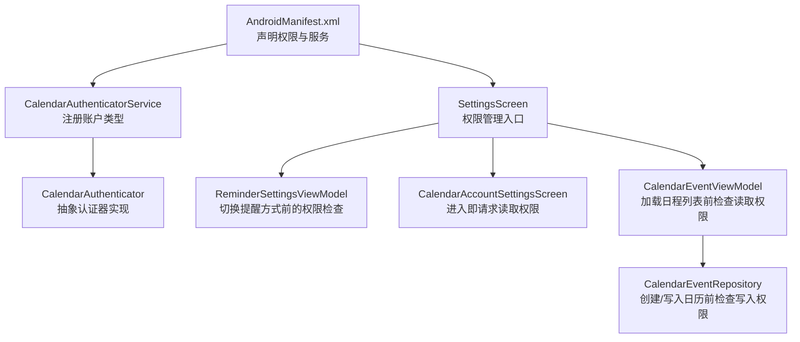
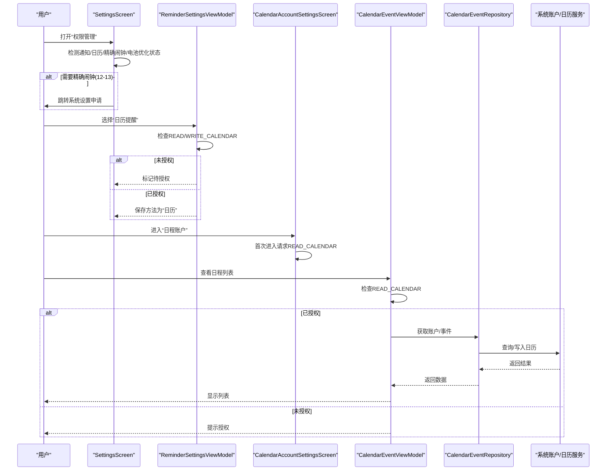
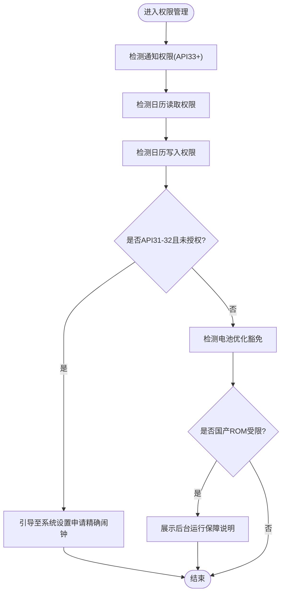
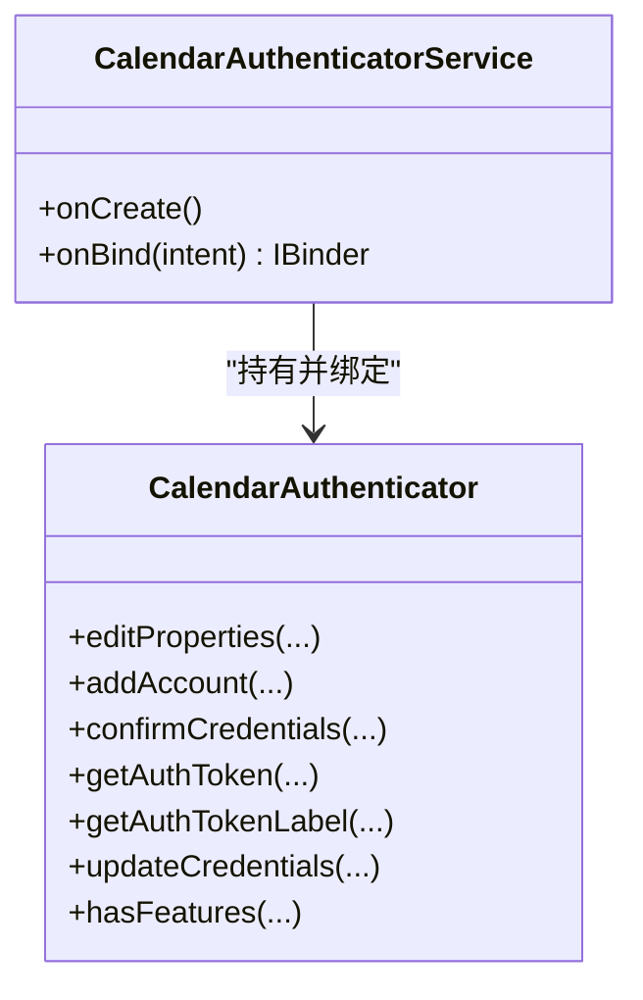
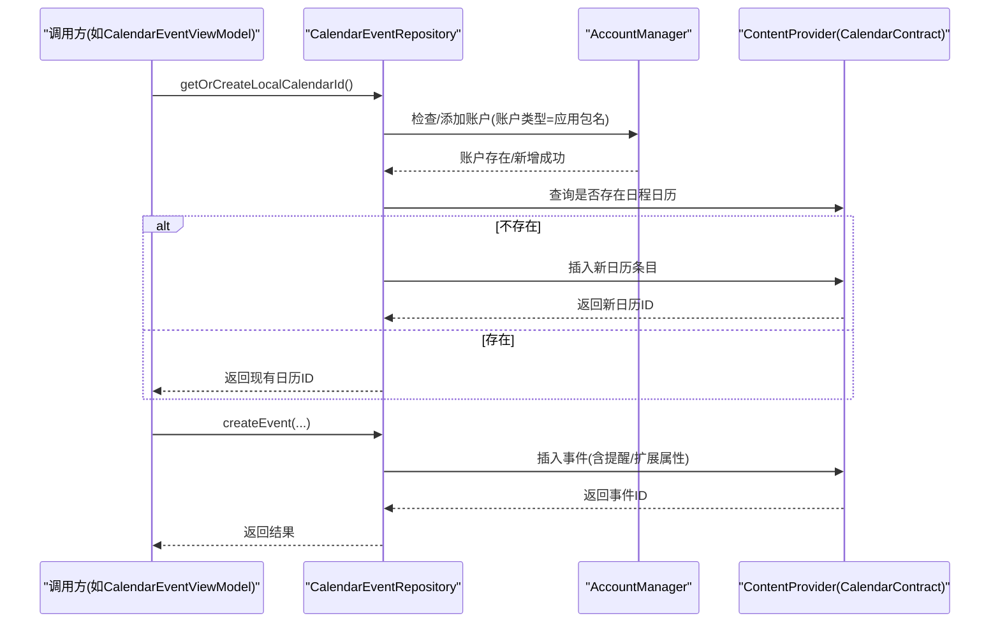
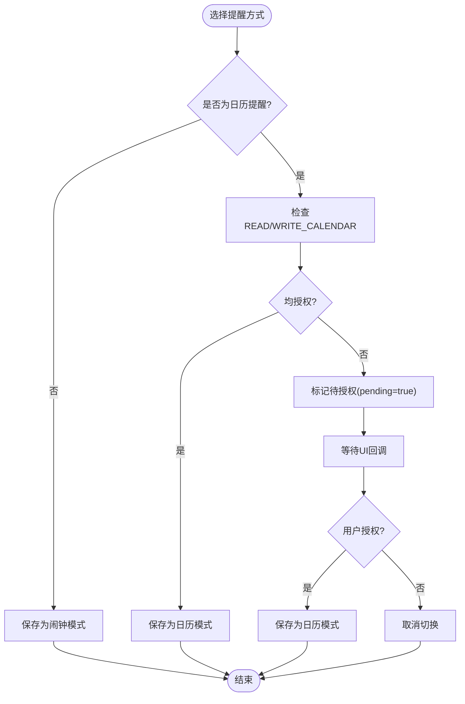
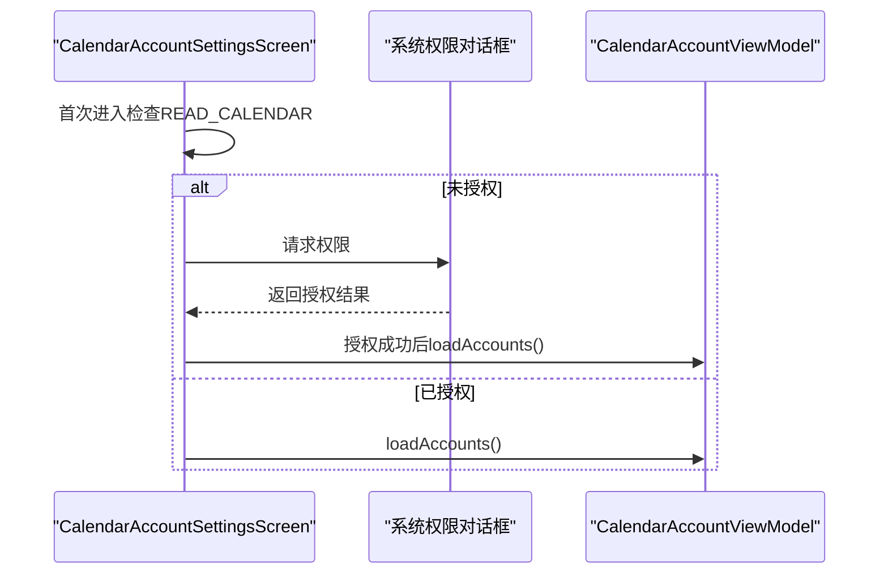
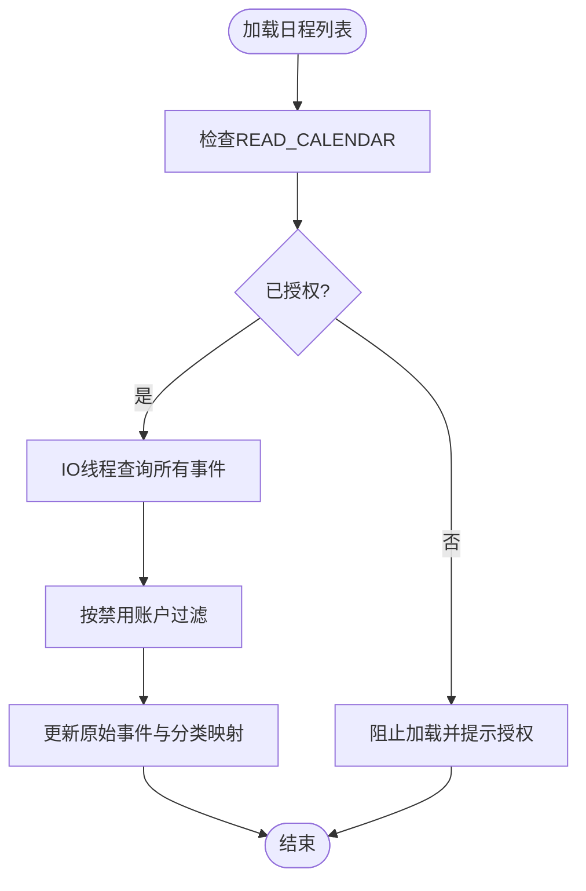
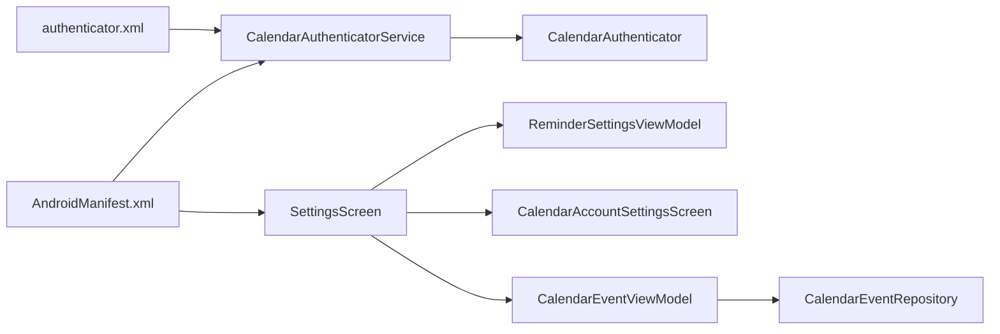

# 权限管理指南

<cite>
**本文引用的文件**   
- [AndroidManifest.xml](file://app/src/main/AndroidManifest.xml)
- [CalendarEventRepository.kt](file://app/src/main/java/com/schedulecalendar/app/data/calendar/CalendarEventRepository.kt)
- [CalendarAuthenticatorService.kt](file://app/src/main/java/com/schedulecalendar/app/data/calendar/CalendarAuthenticatorService.kt)
- [CalendarAuthenticator.kt](file://app/src/main/java/com/schedulecalendar/app/data/calendar/CalendarAuthenticator.kt)
- [authenticator.xml](file://app/src/main/res/xml/authenticator.xml)
- [SettingsScreen.kt](file://app/src/main/java/com/schedulecalendar/app/ui/settings/SettingsScreen.kt)
- [ReminderSettingsViewModel.kt](file://app/src/main/java/com/schedulecalendar/app/ui/settings/ReminderSettingsViewModel.kt)
- [CalendarAccountSettingsScreen.kt](file://app/src/main/java/com/schedulecalendar/app/ui/settings/CalendarAccountSettingsScreen.kt)
- [CalendarEventViewModel.kt](file://app/src/main/java/com/schedulecalendar/app/ui/todo/CalendarEventViewModel.kt)
</cite>

## 目录
1. [简介](#简介)
2. [项目结构](#项目结构)
3. [核心组件](#核心组件)
4. [架构总览](#架构总览)
5. [详细组件分析](#详细组件分析)
6. [依赖关系分析](#依赖关系分析)
7. [性能与兼容性考虑](#性能与兼容性考虑)
8. [故障排查指南](#故障排查指南)
9. [结论](#结论)

## 简介
本指南聚焦于应用中的“权限管理”能力，覆盖运行时权限声明、权限检查与请求流程、日历账户与事件读写权限、精确闹钟与通知权限、电池优化豁免以及国产 ROM 的后台运行保障。文档以代码为依据，提供架构图、时序图与流程图，帮助开发者快速定位权限相关实现并解决常见问题。

## 项目结构
权限相关的实现分布在以下位置：
- 清单与资源：在 AndroidManifest.xml 中声明所需权限；在 authenticator.xml 中注册自定义日历账户类型。
- 数据层：CalendarEventRepository 负责系统日历账户与事件的读写，并在创建本地日历前检查写入权限。
- 认证服务：CalendarAuthenticatorService 与 CalendarAuthenticator 配合，向系统注册应用专属账户类型，使日历账户可见。
- UI 与设置：SettingsScreen 提供统一的“权限管理”入口，集中展示与引导用户授予各类权限；ReminderSettingsViewModel 在切换提醒方式时进行权限校验；CalendarAccountSettingsScreen 在进入页面时请求读取权限；CalendarEventViewModel 在加载日程列表时检查读取权限。

图表来源
- [AndroidManifest.xml:1-126](file://app/src/main/AndroidManifest.xml#L1-L126)
- [CalendarAuthenticatorService.kt:1-26](file://app/src/main/java/com/schedulecalendar/app/data/calendar/CalendarAuthenticatorService.kt#L1-L26)
- [CalendarAuthenticator.kt:1-75](file://app/src/main/java/com/schedulecalendar/app/data/calendar/CalendarAuthenticator.kt#L1-L75)
- [SettingsScreen.kt:217-445](file://app/src/main/java/com/schedulecalendar/app/ui/settings/SettingsScreen.kt#L217-L445)
- [ReminderSettingsViewModel.kt:86-116](file://app/src/main/java/com/schedulecalendar/app/ui/settings/ReminderSettingsViewModel.kt#L86-L116)
- [CalendarAccountSettingsScreen.kt:38-58](file://app/src/main/java/com/schedulecalendar/app/ui/settings/CalendarAccountSettingsScreen.kt#L38-L58)
- [CalendarEventViewModel.kt:222-230](file://app/src/main/java/com/schedulecalendar/app/ui/todo/CalendarEventViewModel.kt#L222-L230)
- [CalendarEventRepository.kt:414-445](file://app/src/main/java/com/schedulecalendar/app/data/calendar/CalendarEventRepository.kt#L414-L445)

章节来源
- [AndroidManifest.xml:1-126](file://app/src/main/AndroidManifest.xml#L1-L126)
- [authenticator.xml:1-7](file://app/src/main/res/xml/authenticator.xml#L1-L7)

## 核心组件
- 权限声明与入口
  - 在清单中声明通知、唤醒锁、日历读写、精确闹钟、开机自启、账户认证等权限。
  - SettingsScreen 提供“权限管理”区块，统一展示与引导授权（通知、日历读写、精确闹钟、电池优化豁免），并对国产 ROM 给出额外指引。
- 日历账户与事件
  - CalendarAuthenticatorService 与 CalendarAuthenticator 配合，将应用包名作为账户类型注册到系统，使应用创建的日历在系统账户管理中可见。
  - CalendarEventRepository 在创建本地日历或写入事件前检查 WRITE_CALENDAR 权限，避免无权限异常。
- 设置与状态
  - ReminderSettingsViewModel 在切换到“日历提醒”模式前检查 READ/WRITE_CALENDAR 权限，未授权则标记待处理。
  - CalendarAccountSettingsScreen 首次进入时请求 READ_CALENDAR 权限。
  - CalendarEventViewModel 在加载日程列表前检查 READ_CALENDAR 权限，并在无权限时阻止后续操作。

章节来源
- [AndroidManifest.xml:1-126](file://app/src/main/AndroidManifest.xml#L1-L126)
- [SettingsScreen.kt:217-445](file://app/src/main/java/com/schedulecalendar/app/ui/settings/SettingsScreen.kt#L217-L445)
- [CalendarAuthenticatorService.kt:1-26](file://app/src/main/java/com/schedulecalendar/app/data/calendar/CalendarAuthenticatorService.kt#L1-L26)
- [CalendarAuthenticator.kt:1-75](file://app/src/main/java/com/schedulecalendar/app/data/calendar/CalendarAuthenticator.kt#L1-L75)
- [CalendarEventRepository.kt:414-445](file://app/src/main/java/com/schedulecalendar/app/data/calendar/CalendarEventRepository.kt#L414-L445)
- [ReminderSettingsViewModel.kt:86-116](file://app/src/main/java/com/schedulecalendar/app/ui/settings/ReminderSettingsViewModel.kt#L86-L116)
- [CalendarAccountSettingsScreen.kt:38-58](file://app/src/main/java/com/schedulecalendar/app/ui/settings/CalendarAccountSettingsScreen.kt#L38-L58)
- [CalendarEventViewModel.kt:222-230](file://app/src/main/java/com/schedulecalendar/app/ui/todo/CalendarEventViewModel.kt#L222-L230)

## 架构总览
下图展示了权限从声明到使用的全链路：清单声明 → UI 入口检查/请求 → 业务逻辑使用前再次校验 → 系统服务/Provider 访问。

图表来源
- [SettingsScreen.kt:217-445](file://app/src/main/java/com/schedulecalendar/app/ui/settings/SettingsScreen.kt#L217-L445)
- [ReminderSettingsViewModel.kt:86-116](file://app/src/main/java/com/schedulecalendar/app/ui/settings/ReminderSettingsViewModel.kt#L86-L116)
- [CalendarAccountSettingsScreen.kt:38-58](file://app/src/main/java/com/schedulecalendar/app/ui/settings/CalendarAccountSettingsScreen.kt#L38-L58)
- [CalendarEventViewModel.kt:222-230](file://app/src/main/java/com/schedulecalendar/app/ui/todo/CalendarEventViewModel.kt#L222-L230)
- [CalendarEventRepository.kt:414-445](file://app/src/main/java/com/schedulecalendar/app/data/calendar/CalendarEventRepository.kt#L414-L445)
- [AndroidManifest.xml:1-126](file://app/src/main/AndroidManifest.xml#L1-L126)

## 详细组件分析

### 组件A：权限管理与引导（SettingsScreen）
- 功能要点
  - 动态检测并展示通知、日历读写、精确闹钟、电池优化豁免的状态。
  - 针对 Android 12/13 差异，分别通过运行时权限与系统设置界面申请精确闹钟。
  - 对国产 ROM 设备提供额外的后台运行保障说明与直达应用设置的入口。
- 关键流程
  - 权限状态刷新：在页面恢复时触发刷新，确保状态准确。
  - 精确闹钟处理：API 33+ 自动授予；API 31-32 需跳转到系统设置申请。
  - 电池优化豁免：直接拉起系统设置页，允许应用忽略省电策略。

图表来源
- [SettingsScreen.kt:217-445](file://app/src/main/java/com/schedulecalendar/app/ui/settings/SettingsScreen.kt#L217-L445)

章节来源
- [SettingsScreen.kt:217-445](file://app/src/main/java/com/schedulecalendar/app/ui/settings/SettingsScreen.kt#L217-L445)

### 组件B：日历账户认证（CalendarAuthenticatorService + CalendarAuthenticator）
- 功能要点
  - 通过 Service 暴露 AbstractAccountAuthenticator，注册自定义账户类型（应用包名）。
  - 配合 authenticator.xml 配置，使应用创建的日历在系统账户管理中可见。
- 交互关系
  - CalendarAuthenticatorService 在 onCreate 中初始化认证器，onBind 返回其 Binder。
  - CalendarAuthenticator 仅做最小化实现，不要求交互式添加账户。

图表来源
- [CalendarAuthenticatorService.kt:1-26](file://app/src/main/java/com/schedulecalendar/app/data/calendar/CalendarAuthenticatorService.kt#L1-L26)
- [CalendarAuthenticator.kt:1-75](file://app/src/main/java/com/schedulecalendar/app/data/calendar/CalendarAuthenticator.kt#L1-L75)
- [authenticator.xml:1-7](file://app/src/main/res/xml/authenticator.xml#L1-L7)

章节来源
- [CalendarAuthenticatorService.kt:1-26](file://app/src/main/java/com/schedulecalendar/app/data/calendar/CalendarAuthenticatorService.kt#L1-L26)
- [CalendarAuthenticator.kt:1-75](file://app/src/main/java/com/schedulecalendar/app/data/calendar/CalendarAuthenticator.kt#L1-L75)
- [authenticator.xml:1-7](file://app/src/main/res/xml/authenticator.xml#L1-L7)

### 组件C：日历事件仓库（CalendarEventRepository）
- 功能要点
  - 提供系统日历账户与事件的查询、创建、更新、删除等操作。
  - 在创建本地日历前检查 WRITE_CALENDAR 权限，避免 SecurityException。
  - 支持创建“日程”“纪念日”“提醒”三类专用日历，并通过 AccountManager 注册账户类型。
- 关键路径
  - getOrCreateLocalCalendarId：先确保账户存在，再查找或创建日程日历。
  - createEvent：插入事件后，可选添加提醒与扩展属性（兼容部分厂商）。

图表来源
- [CalendarEventRepository.kt:414-519](file://app/src/main/java/com/schedulecalendar/app/data/calendar/CalendarEventRepository.kt#L414-L519)
- [CalendarEventRepository.kt:277-332](file://app/src/main/java/com/schedulecalendar/app/data/calendar/CalendarEventRepository.kt#L277-L332)

章节来源
- [CalendarEventRepository.kt:414-519](file://app/src/main/java/com/schedulecalendar/app/data/calendar/CalendarEventRepository.kt#L414-L519)
- [CalendarEventRepository.kt:277-332](file://app/src/main/java/com/schedulecalendar/app/data/calendar/CalendarEventRepository.kt#L277-L332)

### 组件D：提醒设置与权限联动（ReminderSettingsViewModel）
- 功能要点
  - 在切换提醒方式为“日历”前，检查 READ/WRITE_CALENDAR 权限。
  - 未授权时标记 pendingCalendarPermission，等待 UI 回调后再保存设置。
- 关键流程
  - setMethod：若目标为“calendar”，先校验权限；通过后保存并更新状态。
  - onCalendarPermissionGranted/onCalendarPermissionDenied：根据授权结果完成或取消切换。

图表来源
- [ReminderSettingsViewModel.kt:86-116](file://app/src/main/java/com/schedulecalendar/app/ui/settings/ReminderSettingsViewModel.kt#L86-L116)

章节来源
- [ReminderSettingsViewModel.kt:86-116](file://app/src/main/java/com/schedulecalendar/app/ui/settings/ReminderSettingsViewModel.kt#L86-L116)

### 组件E：日程账户管理（CalendarAccountSettingsScreen）
- 功能要点
  - 首次进入页面时请求 READ_CALENDAR 权限，授权后加载系统日历账户列表。
  - 提供启用/禁用账户与分类（日程/纪念日）的能力。
- 关键流程
  - LaunchedEffect：若无权限则发起请求。
  - 授权回调：更新本地状态并触发加载账户。

图表来源
- [CalendarAccountSettingsScreen.kt:38-58](file://app/src/main/java/com/schedulecalendar/app/ui/settings/CalendarAccountSettingsScreen.kt#L38-L58)

章节来源
- [CalendarAccountSettingsScreen.kt:38-58](file://app/src/main/java/com/schedulecalendar/app/ui/settings/CalendarAccountSettingsScreen.kt#L38-L58)

### 组件F：日程列表与权限（CalendarEventViewModel）
- 功能要点
  - 在加载日程列表前检查 READ_CALENDAR 权限，无权限则阻止加载。
  - 监听系统日历变化，自动刷新列表。
- 关键流程
  - checkPermission：更新 hasPermission 状态。
  - loadEvents：有权限才执行 IO 查询，捕获 SecurityException 并降级处理。

图表来源
- [CalendarEventViewModel.kt:222-230](file://app/src/main/java/com/schedulecalendar/app/ui/todo/CalendarEventViewModel.kt#L222-L230)
- [CalendarEventViewModel.kt:236-265](file://app/src/main/java/com/schedulecalendar/app/ui/todo/CalendarEventViewModel.kt#L236-L265)

章节来源
- [CalendarEventViewModel.kt:222-230](file://app/src/main/java/com/schedulecalendar/app/ui/todo/CalendarEventViewModel.kt#L222-L230)
- [CalendarEventViewModel.kt:236-265](file://app/src/main/java/com/schedulecalendar/app/ui/todo/CalendarEventViewModel.kt#L236-L265)

## 依赖关系分析
- 清单与资源
  - AndroidManifest.xml 声明了通知、唤醒锁、日历读写、精确闹钟、开机自启、账户认证等权限，并注册了账户认证服务与小组件接收器。
  - authenticator.xml 定义了账户类型与图标标签，供 CalendarAuthenticatorService 使用。
- 组件耦合
  - SettingsScreen 聚合多类权限的检测与引导，属于“权限入口”。
  - ReminderSettingsViewModel 与 CalendarEventViewModel 分别在各自场景中进行前置权限校验。
  - CalendarEventRepository 在底层写入前再次校验，形成“双重保险”。
  - CalendarAuthenticatorService/CalendarAuthenticator 与 authenticator.xml 共同完成账户类型注册。

图表来源
- [AndroidManifest.xml:1-126](file://app/src/main/AndroidManifest.xml#L1-L126)
- [authenticator.xml:1-7](file://app/src/main/res/xml/authenticator.xml#L1-L7)
- [CalendarAuthenticatorService.kt:1-26](file://app/src/main/java/com/schedulecalendar/app/data/calendar/CalendarAuthenticatorService.kt#L1-L26)
- [CalendarAuthenticator.kt:1-75](file://app/src/main/java/com/schedulecalendar/app/data/calendar/CalendarAuthenticator.kt#L1-L75)
- [SettingsScreen.kt:217-445](file://app/src/main/java/com/schedulecalendar/app/ui/settings/SettingsScreen.kt#L217-L445)
- [ReminderSettingsViewModel.kt:86-116](file://app/src/main/java/com/schedulecalendar/app/ui/settings/ReminderSettingsViewModel.kt#L86-L116)
- [CalendarAccountSettingsScreen.kt:38-58](file://app/src/main/java/com/schedulecalendar/app/ui/settings/CalendarAccountSettingsScreen.kt#L38-L58)
- [CalendarEventViewModel.kt:222-230](file://app/src/main/java/com/schedulecalendar/app/ui/todo/CalendarEventViewModel.kt#L222-L230)
- [CalendarEventRepository.kt:414-445](file://app/src/main/java/com/schedulecalendar/app/data/calendar/CalendarEventRepository.kt#L414-L445)

章节来源
- [AndroidManifest.xml:1-126](file://app/src/main/AndroidManifest.xml#L1-L126)
- [authenticator.xml:1-7](file://app/src/main/res/xml/authenticator.xml#L1-L7)

## 性能与兼容性考虑
- 权限检查时机
  - UI 层在进入页面或切换功能时进行检查与请求，减少不必要的系统调用。
  - 数据层在写入前再次检查，避免 SecurityException 导致崩溃。
- 精确闹钟差异
  - Android 13+：USE_EXACT_ALARM 安装时自动授予，无需用户交互。
  - Android 12：需通过系统设置申请 SCHEDULE_EXACT_ALARM。
- 电池优化与国产 ROM
  - 建议引导用户开启“忽略电池优化”，提升后台可靠性。
  - 对主流国产 ROM 提供额外指引（自启动、后台弹出界面、桌面快捷方式等）。

[本节为通用指导，不涉及具体文件分析]

## 故障排查指南
- 无法读取系统日历账户
  - 现象：进入“日程账户”页面提示需要权限或为空。
  - 排查：确认 READ_CALENDAR 已授权；检查 CalendarAccountSettingsScreen 是否发起请求。
  - 参考路径
    - [CalendarAccountSettingsScreen.kt:38-58](file://app/src/main/java/com/schedulecalendar/app/ui/settings/CalendarAccountSettingsScreen.kt#L38-L58)
- 无法创建/修改日历事件
  - 现象：创建事件失败或返回错误 ID。
  - 排查：确认 WRITE_CALENDAR 已授权；检查 CalendarEventRepository 是否在创建本地日历前进行权限判断。
  - 参考路径
    - [CalendarEventRepository.kt:414-445](file://app/src/main/java/com/schedulecalendar/app/data/calendar/CalendarEventRepository.kt#L414-L445)
- 日程列表不刷新
  - 现象：系统日历变更后应用内列表不变。
  - 排查：确认 ContentObserver 已注册；检查是否有权限导致查询被拦截。
  - 参考路径
    - [CalendarEventViewModel.kt:270-282](file://app/src/main/java/com/schedulecalendar/app/ui/todo/CalendarEventViewModel.kt#L270-L282)
- 精确闹钟不生效
  - 现象：提醒未按时触发。
  - 排查：Android 12 需手动授权；Android 13+ 应自动授予；检查 SettingsScreen 的引导逻辑。
  - 参考路径
    - [SettingsScreen.kt:252-276](file://app/src/main/java/com/schedulecalendar/app/ui/settings/SettingsScreen.kt#L252-L276)
- 电池优化导致后台被杀
  - 现象：重启后提醒未恢复或通知延迟。
  - 排查：引导用户开启“忽略电池优化”；检查国产 ROM 的额外限制项。
  - 参考路径
    - [SettingsScreen.kt:268-294](file://app/src/main/java/com/schedulecalendar/app/ui/settings/SettingsScreen.kt#L268-L294)

章节来源
- [CalendarAccountSettingsScreen.kt:38-58](file://app/src/main/java/com/schedulecalendar/app/ui/settings/CalendarAccountSettingsScreen.kt#L38-L58)
- [CalendarEventRepository.kt:414-445](file://app/src/main/java/com/schedulecalendar/app/data/calendar/CalendarEventRepository.kt#L414-L445)
- [CalendarEventViewModel.kt:270-282](file://app/src/main/java/com/schedulecalendar/app/ui/todo/CalendarEventViewModel.kt#L270-L282)
- [SettingsScreen.kt:252-294](file://app/src/main/java/com/schedulecalendar/app/ui/settings/SettingsScreen.kt#L252-L294)

## 结论
本应用的权限管理采用“声明 + UI 引导 + 业务前置校验 + 数据层兜底”的多层策略，覆盖通知、日历读写、精确闹钟、电池优化豁免及国产 ROM 的特殊限制。通过统一的权限管理入口与清晰的权限流转，既提升了用户体验，也增强了系统的健壮性与可维护性。建议在后续迭代中持续完善权限失败的友好提示与重试机制，并关注不同厂商 ROM 的行为差异。