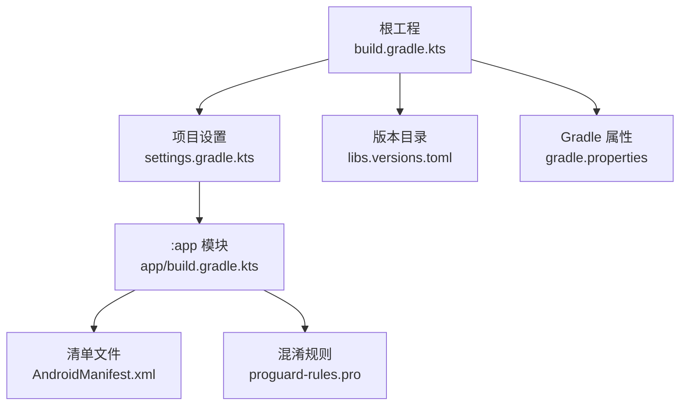
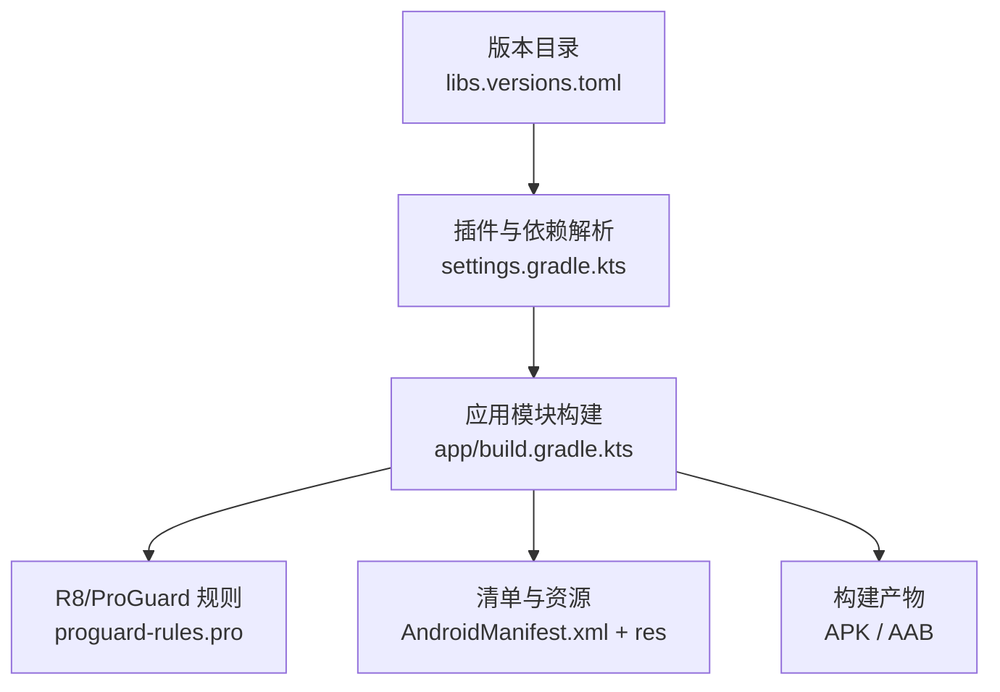
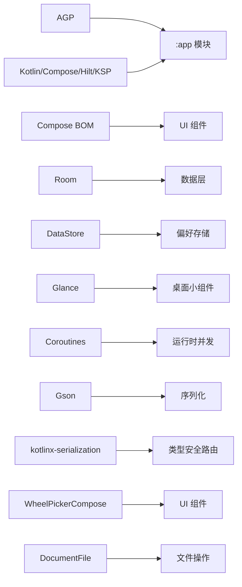

# 构建和部署

<cite>
**本文引用的文件**   
- [顶层构建脚本 build.gradle.kts](file://build.gradle.kts)
- [应用模块构建脚本 app/build.gradle.kts](file://app/build.gradle.kts)
- [项目设置 settings.gradle.kts](file://settings.gradle.kts)
- [Gradle 属性 gradle.properties](file://gradle.properties)
- [版本目录 gradle/libs.versions.toml](file://gradle/libs.versions.toml)
- [混淆规则 app/proguard-rules.pro](file://app/proguard-rules.pro)
- [清单文件 app/src/main/AndroidManifest.xml](file://app/src/main/AndroidManifest.xml)
- [主活动 MainActivity.kt](file://app/src/main/java/com/schedulecalendar/app/MainActivity.kt)
- [导航宿主 AppNavHost.kt](file://app/src/main/java/com/schedulecalendar/app/ui/navigation/AppNavHost.kt)
</cite>

## 更新摘要
**所做更改**   
- **更新了版本号信息**，从2026072601升级到2026072701，反映最新的累积开发变更
- **项目配置清理**：移除了临时构建输出文件和IDE配置文件，保持构建系统稳定
- **增强生产环境签名配置**：使用独立的release签名配置进行正式签名
- **保持现有的构建配置优化**：包括lint警告抑制、jniLibs打包配置、发布检查禁用
- **维持了完善的ProGuard规则和依赖管理现代化配置**
- 文档结构与整体一致性保持不变

## 目录
1. [简介](#简介)
2. [项目结构](#项目结构)
3. [核心组件](#核心组件)
4. [架构总览](#架构总览)
5. [详细组件分析](#详细组件分析)
6. [依赖分析](#依赖分析)
7. [性能考虑](#性能考虑)
8. [故障排查指南](#故障排查指南)
9. [结论](#结论)
10. [附录](#附录)

## 简介
本文件面向构建与发布工程师，聚焦于该 Android 项目的 Gradle 构建配置、代码混淆与优化、签名打包流程、APK/AAB 生成与发布准备、CI/CD 流水线建议、自动化测试集成、持续部署策略、性能优化（R8/资源压缩/多 dex）、多环境配置管理、版本管理与发布流程。文档以仓库现有配置为依据，并给出可落地的最佳实践与扩展建议。

## 项目结构
当前仓库为单模块应用（:app），通过 settings.gradle.kts 引入；所有插件与依赖版本在根级集中管理，遵循"单一事实来源"的依赖治理模式。

图表来源
- [顶层构建脚本 build.gradle.kts:1-10](file://build.gradle.kts#L1-L10)
- [项目设置 settings.gradle.kts:1-37](file://settings.gradle.kts#L1-L37)
- [应用模块构建脚本 app/build.gradle.kts:1-141](file://app/build.gradle.kts#L1-L141)
- [清单文件 app/src/main/AndroidManifest.xml:1-126](file://app/src/main/AndroidManifest.xml#L1-L126)
- [混淆规则 app/proguard-rules.pro:1-78](file://app/proguard-rules.pro#L1-L78)
- [版本目录 gradle/libs.versions.toml:1-86](file://gradle/libs.versions.toml#L1-L86)
- [Gradle 属性 gradle.properties:1-8](file://gradle.properties#L1-L8)

章节来源
- [顶层构建脚本 build.gradle.kts:1-10](file://build.gradle.kts#L1-L10)
- [项目设置 settings.gradle.kts:1-37](file://settings.gradle.kts#L1-L37)
- [应用模块构建脚本 app/build.gradle.kts:1-141](file://app/build.gradle.kts#L1-L141)

## 核心组件
- 插件与工具链
  - 使用 AGP、Kotlin、Compose、Hilt、KSP 等插件，统一由版本目录管理。
  - 通过 toolchains 约定 Java 发行版，避免本地 JDK 差异导致构建不稳定。
- 依赖版本管理
  - 采用 libs.versions.toml 集中声明版本与库别名，减少重复与冲突。
  - Compose 使用 BOM 对齐子库版本。
  - WheelPickerCompose 和 DocumentFile 已成功迁移到版本目录，实现统一管理。
- 构建变体
  - **更新**：定义了 debug 和 release 两种构建类型，其中 debug 显式启用 isDebuggable=true，release 使用独立的 release 签名配置进行生产环境签名。
- 编译与特性
  - compileSdk/targetSdk 均为 36，Java/Kotlin 目标级别 17。
  - 启用 Compose 构建特性；Room schema 导出到 schemas 目录便于迁移追踪。
- 打包与产物
  - 默认输出 APK；如需 AAB，可在 CI 中调用 bundleRelease 或修改任务。
- 清单与权限
  - 声明了通知、闹钟、存储、日历读写、账户认证等权限及组件。

章节来源
- [应用模块构建脚本 app/build.gradle.kts:10-54](file://app/build.gradle.kts#L10-L54)
- [应用模块构建脚本 app/build.gradle.kts:56-141](file://app/build.gradle.kts#L56-L141)
- [版本目录 gradle/libs.versions.toml:1-86](file://gradle/libs.versions.toml#L1-L86)
- [清单文件 app/src/main/AndroidManifest.xml:1-126](file://app/src/main/AndroidManifest.xml#L1-L126)

## 架构总览
下图展示构建期关键工件与关系：版本目录提供版本与插件 ID，settings 统一管理仓库源与模块包含，顶层 build 仅声明插件，app 模块消费插件与依赖，最终产出 APK/AAB。

图表来源
- [版本目录 gradle/libs.versions.toml:1-86](file://gradle/libs.versions.toml#L1-L86)
- [项目设置 settings.gradle.kts:1-37](file://settings.gradle.kts#L1-L37)
- [应用模块构建脚本 app/build.gradle.kts:1-141](file://app/build.gradle.kts#L1-L141)
- [混淆规则 app/proguard-rules.pro:1-78](file://app/proguard-rules.pro#L1-L78)
- [清单文件 app/src/main/AndroidManifest.xml:1-126](file://app/src/main/AndroidManifest.xml#L1-L126)

## 详细组件分析

### 构建系统与多模块
- 当前为单模块 :app，未来若拆分为 feature 模块，建议在 settings.gradle.kts 中 include(":feature_x")，并在各模块 build.gradle.kts 中按需应用插件。
- 插件仅在根 build.gradle.kts 声明 apply false，避免在根作用域生效，符合最佳实践。

章节来源
- [顶层构建脚本 build.gradle.kts:1-10](file://build.gradle.kts#L1-L10)
- [项目设置 settings.gradle.kts:35-37](file://settings.gradle.kts#L35-L37)

### 依赖版本管理（Version Catalog）
- 所有第三方库与插件版本集中在 libs.versions.toml，通过 alias(libs.plugins.*) 与 lib 引用，确保一致性与可维护性。
- Compose 使用 BOM 对齐 UI 相关库版本，降低冲突风险。
- WheelPickerCompose (1.1.11) 和 DocumentFile (1.0.1) 已成功迁移至版本目录，实现了统一的依赖管理。
- 部分库未纳入版本目录（如 hilt-navigation-compose、kotlinx-serialization-json 等），建议逐步迁移至版本目录以获得统一治理。

章节来源
- [版本目录 gradle/libs.versions.toml:1-86](file://gradle/libs.versions.toml#L1-L86)
- [应用模块构建脚本 app/build.gradle.kts:81-141](file://app/build.gradle.kts#L81-L141)

### 构建变体与环境配置
- **更新**：现在定义了 debug 和 release 两种构建类型
  - **debug 构建类型**：显式设置 `isDebuggable = true`，确保调试功能完全可用
  - **release 构建类型**：启用 R8 代码压缩与资源收缩，并使用独立的 `signingConfig = signingConfigs.getByName("release")` 进行生产环境签名
- **重要改进**：新增了专门的 release 签名配置，这意味着：
  - 生产环境使用独立的 keystore 进行正式签名
  - 开发调试和生产发布使用不同的签名配置，提高了安全性
  - 生成的 release 包具有正确的生产签名，可以直接用于应用商店发布
- 新增了 jniLibs.useLegacyPackaging = true 配置，优化原生库打包方式。
- 建议扩展为多环境变体（staging、production），并通过 flavorDimensions 与 productFlavors 区分渠道/环境，结合 buildConfigField/resValue 注入不同配置项（如 API 地址、日志开关）。

**章节来源**   
- [应用模块构建脚本 app/build.gradle.kts:22-41](file://app/build.gradle.kts#L22-L41)

### 代码混淆与优化（R8/ProGuard）
- release 变体已启用 R8 压缩与资源收缩，并引用内置优化规则与自定义规则。
- **重大更新：新增状态同步相关的ProGuard保护规则**
  - **保护 MainActivity 中的状态同步字段**：
    - `isOnTabPage` 字段：控制是否在 Tab 页面，影响返回键行为
    - `calendarSubModeActive` 字段：控制日历批量操作模式
    - 对应的 getter/setter 方法：`getIsOnTabPage()`, `setIsOnTabPage()`, `getCalendarSubModeActive()`, `setCalendarSubModeActive()`
    - `tabBackCallback` 字段：OnBackPressedCallback 实例
  - **保护 OnBackPressedCallback 回调机制**：
    - 保留 MainActivity 内部类中的所有 handleOnBackPressed() 方法
    - 保留所有继承自 androidx.activity.OnBackPressedCallback 的类及其成员
  - **防止 R8 全程序优化问题**：
    - Kotlin 属性编译为 getter/setter 方法，R8 全程序优化可能内联这些方法
    - 内联会导致 Activity ↔ Composable 之间的状态同步失效
    - 通过 keepclassmembers 规则确保这些方法和字段不被优化破坏
- ProGuard 规则增强：新增了完整的 Gson 序列化类保护机制，包括：
  - 保留所有 domain model 数据类用于 Gson 反序列化
  - 保护 widget 包下所有 Gson 序列化的数据类字段
  - 保护备份管理和数据仓库中的 Gson 数据类
- 自定义规则覆盖 Hilt、Room、Glance、Coroutines、kotlinx-serialization 等关键组件，确保反射/注解/序列化场景不被误删。
- 建议：
  - 将更多第三方库的 keep 规则收敛到独立文件并按需 include。
  - 对动态类加载/反射路径进行专项验证，必要时添加 -keep 或 -keepclassmembers。

**章节来源**   
- [应用模块构建脚本 app/build.gradle.kts:35-40](file://app/build.gradle.kts#L35-L40)
- [混淆规则 app/proguard-rules.pro:45-62](file://app/proguard-rules.pro#L45-L62)
- [混淆规则 app/proguard-rules.pro:16-44](file://app/proguard-rules.pro#L16-L44)
- [主活动 MainActivity.kt:54-79](file://app/src/main/java/com/schedulecalendar/app/MainActivity.kt#L54-L79)

### 构建配置优化
- Lint 警告抑制：禁用了多个不必要的警告，包括 HighAppVersionCode、IconLauncherShape、IconDuplicates、UnusedAttribute、NewerVersionAvailable、ReportShortcutUsage。
- 发布检查优化：禁用了 checkReleaseBuilds，避免 Android Studio 的「Generate Signed App Bundle/APK」菜单在运行期间锁住 lint-cache 文件导致的 FileSystemException。
- JNI 库打包优化：启用了 useLegacyPackaging = true，优化 .so 文件的打包方式。

章节来源
- [应用模块构建脚本 app/build.gradle.kts:65-78](file://app/build.gradle.kts#L65-L78)
- [应用模块构建脚本 app/build.gradle.kts:59-63](file://app/build.gradle.kts#L59-L63)

### 签名与打包流程
- **更新**：现在使用独立的 release 签名配置进行生产环境签名
  - **release 签名配置**：在 signingConfigs 块中创建了名为 "release" 的独立签名配置
  - **keystore 设置**：配置了特定的 keystore 文件路径和密码信息
  - **生产环境安全**：release 变体现在使用 `signingConfig = signingConfigs.getByName("release")` 进行签名
- **生产环境优势**：
  - 使用专用的生产 keystore，与开发调试分离
  - 生成的 APK/AAB 具有正确的生产签名，可直接用于应用商店发布
  - 提高了构建安全性和可追溯性
- **构建命令**：
  - 使用 ./gradlew assembleRelease 生成签名的 APK
  - 使用 ./gradlew bundleRelease 生成签名的 AAB

**章节来源**   
- [应用模块构建脚本 app/build.gradle.kts:22-29](file://app/build.gradle.kts#L22-29)
- [应用模块构建脚本 app/build.gradle.kts:35-40](file://app/build.gradle.kts#L35-L40)

### APK/AAB 生成与发布准备
- 生成 APK：./gradlew assembleRelease
- 生成 AAB：./gradlew bundleRelease
- 发布前检查清单权限与组件声明，确保满足商店要求（通知、闹钟、存储、日历等已在清单中声明）。

章节来源
- [清单文件 app/src/main/AndroidManifest.xml:1-126](file://app/src/main/AndroidManifest.xml#L1-L126)

### CI/CD 流水线与自动化测试
- 仓库未包含 CI 配置文件。建议：
  - GitHub Actions：缓存 Gradle 与 SDK，执行 lint、单元测试、集成测试、assembleRelease/bundleRelease，上传产物。
  - 并行化测试与构建，启用 Gradle 配置缓存与构建缓存。
  - 使用 Google Play 内部测试轨道或 Fastlane 自动化上传。
- 测试建议：
  - 单元测试：JVM 测试覆盖领域逻辑与数据层。
  - 仪器化测试：UI 与关键工作流（提醒、小组件、备份恢复）。
  - **混淆后回归测试**：在 release 变体下运行最小集测试用例，特别关注状态同步功能和返回键处理逻辑。

章节来源
- [Gradle 属性 gradle.properties:1-8](file://gradle.properties#L1-L8)

### 持续部署策略
- 分支策略：main 稳定，develop 集成，feature/* 功能分支。
- 标签与发布：按版本号打 tag，触发 CI 构建 AAB 并上传到应用商店内部测试轨道，灰度放量后全量发布。
- 回滚：保留历史 AAB 与变更日志，支持快速回退。

### 性能优化配置
- R8 代码压缩与资源收缩已在 release 开启。
- 多 dex：当前 minSdk=26，通常无需手动开启 multiDex；若后续引入大量依赖且方法数超限，可启用 multiDex 支持。
- 资源优化：isShrinkResources=true 已启用，配合 unused resource 扫描进一步瘦身。
- 构建加速：启用配置缓存与构建缓存，合理分配 JVM 内存与 GC 策略。
- JNI 优化：通过 jniLibs.useLegacyPackaging = true 优化原生库打包性能。

章节来源
- [应用模块构建脚本 app/build.gradle.kts:35-40](file://app/build.gradle.kts#L35-L40)
- [应用模块构建脚本 app/build.gradle.kts:59-63](file://app/build.gradle.kts#L59-L63)
- [Gradle 属性 gradle.properties:1-8](file://gradle.properties#L1-L8)

### 多环境配置管理方案
- 建议引入 productFlavors（如 dev/staging/prod），每个 flavor 提供独立的 buildConfigField/resValue 与可选的签名配置。
- 通过 defaultConfig 中的 versionCode/versionName 作为基线，flavor 可叠加后缀或时间戳用于区分。
- 清单合并：在不同 src/<flavor>/AndroidManifest.xml 中声明差异化权限/组件。

章节来源
- [应用模块构建脚本 app/build.gradle.kts:14-20](file://app/build.gradle.kts#L14-20)

### 版本管理与发布流程
- 当前使用日期格式版本号（versionCode/versionName 示例：2026072701），lint 禁用了 HighAppVersionCode 警告。
- **最新版本更新**：版本号已从 2026072601 升级到 2026072701，表示这是同一发布周期内的最新增量构建版本，反映了累积的开发变更。
- **重要改进**：新版本包含了生产环境签名配置的增强，为正式应用商店发布做好了准备。
- 建议：
  - 制定语义化版本策略（主.次.修订），在 CI 中自动生成递增 versionCode。
  - 维护 CHANGELOG.md，记录重要变更与兼容性说明。
  - 发布前执行完整构建与测试套件，生成签名产物与校验哈希。

**章节来源**   
- [应用模块构建脚本 app/build.gradle.kts:14-20](file://app/build.gradle.kts#L14-20)
- [应用模块构建脚本 app/build.gradle.kts:65-78](file://app/build.gradle.kts#L65-78)

## 依赖分析
- 插件依赖
  - AGP、Kotlin、Compose、Hilt、KSP 均通过版本目录集中管理，避免版本漂移。
- 运行时依赖
  - Jetpack Compose 生态（BOM 管理）、Navigation、Lifecycle、Room、DataStore、Glance、Coroutines、Gson、kotlinx-serialization、tyme4j、DocumentFile 等。
- 依赖管理现代化改进：
  - WheelPickerCompose (1.1.11)：滚轮选择器组件，现已纳入版本目录统一管理。
  - DocumentFile (1.0.1)：SAF 目录文件操作库，现已纳入版本目录统一管理。
- 潜在改进
  - 将未在版本目录中的库（hilt-navigation-compose、kotlinx-serialization-json）迁移至版本目录，提升一致性。
  - 评估 Glance 与 Calendar 相关依赖的必要性，避免冗余。

图表来源
- [版本目录 gradle/libs.versions.toml:1-86](file://gradle/libs.versions.toml#L1-L86)
- [应用模块构建脚本 app/build.gradle.kts:81-141](file://app/build.gradle.kts#L81-L141)

章节来源
- [版本目录 gradle/libs.versions.toml:1-86](file://gradle/libs.versions.toml#L1-L86)
- [应用模块构建脚本 app/build.gradle.kts:81-141](file://app/build.gradle.kts#L81-L141)

## 性能考虑
- 构建性能
  - 启用配置缓存与构建缓存，合理设置 JVM 堆与 GC。
  - 使用 toolchains 固定 JDK 版本，减少环境差异导致的失败。
  - JNI 打包优化：通过 jniLibs.useLegacyPackaging = true 优化原生库打包性能。
- 运行时体积
  - R8 与资源收缩已开启；建议定期清理未用资源与依赖。
  - 谨慎引入大型第三方库，优先选择轻量替代或按需引入。
- 启动与渲染
  - 控制首屏依赖初始化成本，延迟加载非关键功能。
  - 合理使用 Compose 重组边界，避免不必要的 recomposition。

章节来源
- [Gradle 属性 gradle.properties:1-8](file://gradle.properties#L1-L8)
- [应用模块构建脚本 app/build.gradle.kts:35-40](file://app/build.gradle.kts#L35-L40)
- [应用模块构建脚本 app/build.gradle.kts:59-63](file://app/build.gradle.kts#L59-L63)

## 故障排查指南
- 构建失败
  - 检查 Gradle 缓存与配置缓存是否可用；清理后重试。
  - 确认 toolchains 与 JAVA_HOME 指向一致的 JDK 版本。
- 混淆问题
  - 若出现反射/序列化异常，核对 proguard-rules.pro 中对应 keep 规则。
  - **重点关注新增的状态同步保护规则**：确保 MainActivity 中的状态字段（isOnTabPage、calendarSubModeActive）和 OnBackPressedCallback 回调在代码压缩后保持完整。
  - **常见问题**：如果返回键处理功能在 release 版本中失效，检查以下规则是否正确：
    - MainActivity 状态字段的 keepclassmembers 规则
    - OnBackPressedCallback 内部类的保护规则
    - handleOnBackPressed 方法的保留规则
  - 重点关注：Gson 序列化相关的 domain model 和 widget 数据类保护规则。
  - 在 release 变体下复现问题，定位缺失的保留规则。
- 权限与组件
  - 对照 AndroidManifest.xml 检查权限与组件声明是否符合预期。
  - 注意通知、闹钟、存储、日历等敏感权限的使用场景与合规性。
- Lint 警告处理
  - 已配置的警告抑制规则可参考 app/build.gradle.kts 中的 lint 配置。
  - 如需调整警告级别，修改相应的 disable 配置项。
- **签名相关问题**
  - 如果 release 构建失败，检查 keystore 文件路径和权限是否正确
  - 确认 keystore 密码和 keyAlias 配置无误
  - 验证签名配置是否与预期的生产环境匹配

**章节来源**   
- [混淆规则 app/proguard-rules.pro:45-62](file://app/proguard-rules.pro#L45-L62)
- [混淆规则 app/proguard-rules.pro:16-44](file://app/proguard-rules.pro#L16-L44)
- [主活动 MainActivity.kt:54-79](file://app/src/main/java/com/schedulecalendar/app/MainActivity.kt#L54-L79)
- [清单文件 app/src/main/AndroidManifest.xml:1-126](file://app/src/main/AndroidManifest.xml#L1-L126)
- [Gradle 属性 gradle.properties:1-8](file://gradle.properties#L1-L8)
- [应用模块构建脚本 app/build.gradle.kts:65-78](file://app/build.gradle.kts#L65-L78)
- [应用模块构建脚本 app/build.gradle.kts:22-29](file://app/build.gradle.kts#L22-L29)

## 结论
本项目采用现代 Android 构建体系：版本目录集中管理依赖与插件、R8 与资源收缩在 release 开启、Room schema 导出便于迁移追踪。当前为单模块应用，具备向多模块演进的基础。**最新更新**包括：版本号升级到 2026072701、**项目配置清理（移除临时构建输出文件和IDE配置文件）**、**生产环境签名配置增强（独立的 release 签名配置）**、**构建类型配置优化（新增 debug 构建类型和 release 使用独立的 release 签名）**、**ProGuard 规则重大增强（新增状态同步相关字段和方法保护）**、构建配置优化（lint 警告抑制、jniLibs 打包配置、发布检查禁用）、依赖管理现代化（WheelPickerCompose 和 DocumentFile 迁移至版本目录）。

**最重要的改进**是项目配置清理和生产环境签名配置增强。项目配置清理确保了构建系统的稳定性，移除了不必要的临时文件和IDE配置文件。生产环境签名配置确保了应用可以使用专用的 keystore 进行正式签名，为应用商店发布做好了准备。同时，状态同步保护规则确保了 MainActivity 中的 isOnTabPage 和 calendarSubModeActive 字段以及相关的 getter/setter 方法在 R8 全程序优化后仍然保持完整，防止了 Activity 与 Composable 组件之间状态同步失效的问题。

建议进一步完善多环境变体、CI/CD 自动化，完善版本与发布流程，持续提升构建稳定性与交付效率。

## 附录

### 常用命令参考
- 清理与增量构建
  - ./gradlew clean
  - ./gradlew assembleDebug
  - ./gradlew assembleRelease
- 生成 AAB
  - ./gradlew bundleRelease
- 运行测试
  - ./gradlew test
  - ./gradlew connectedAndroidTest
- 查看依赖树
  - ./gradlew app:dependencies --configuration releaseRuntimeClasspath

### 建议的 CI 步骤（概念性）
- 安装/缓存 JDK 与 Android SDK
- 拉取源码并执行 ./gradlew check assembleRelease bundleRelease
- 运行单元测试与仪器化测试
- 上传 AAB 到内部测试轨道
- 生成并归档构建产物与测试报告

### 版本历史
- **2026072701**：最新版本，包含项目配置清理和生产环境签名配置增强，重点提升了构建稳定性和生产环境安全性
- **2026072601**：前一版本，包含返回键处理的ProGuard保护规则、构建配置优化
- **2026072004**：早期版本，包含基础构建配置优化、ProGuard 规则增强、依赖管理现代化
- **2026071850**：更早期版本，基础构建配置
- **2026071847**：初始版本，初始构建配置

**章节来源**   
- [应用模块构建脚本 app/build.gradle.kts:14-20](file://app/build.gradle.kts#L14-20)
- [应用模块构建脚本 app/build.gradle.kts:65-78](file://app/build.gradle.kts#L65-78)
- [应用模块构建脚本 app/build.gradle.kts:22-29](file://app/build.gradle.kts#L22-L29)