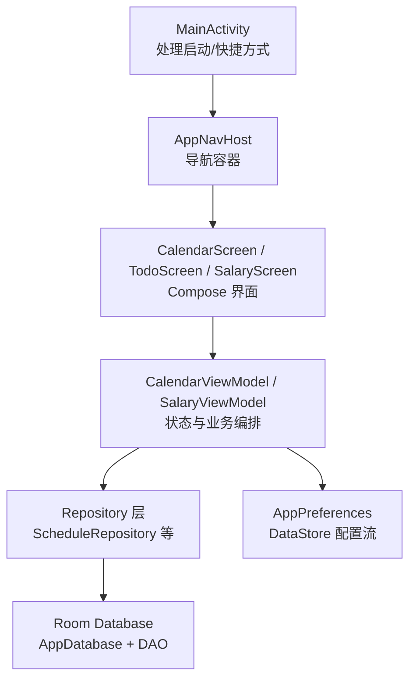
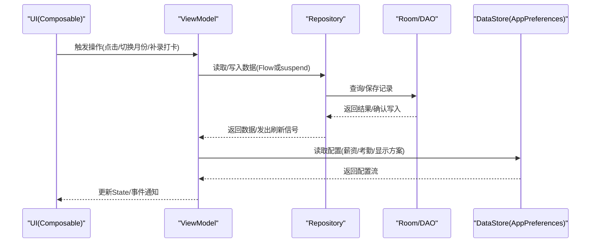
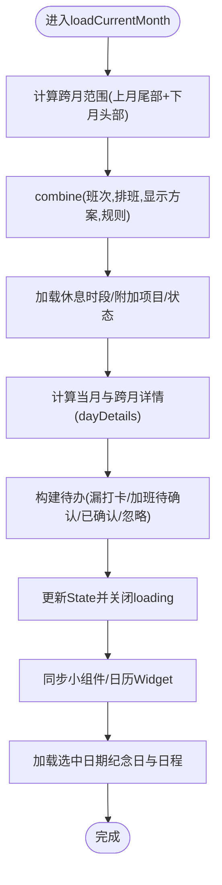
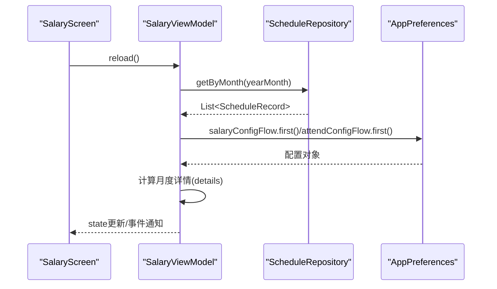
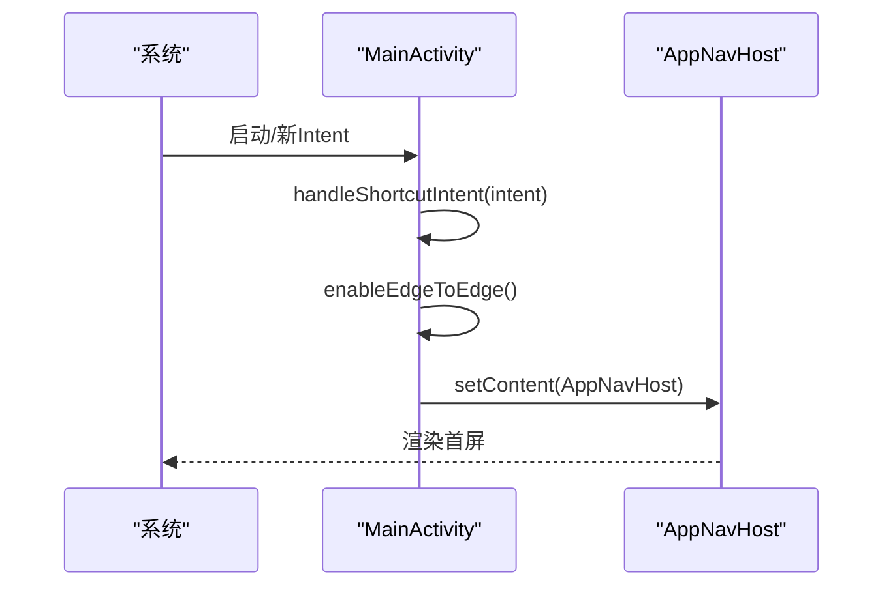
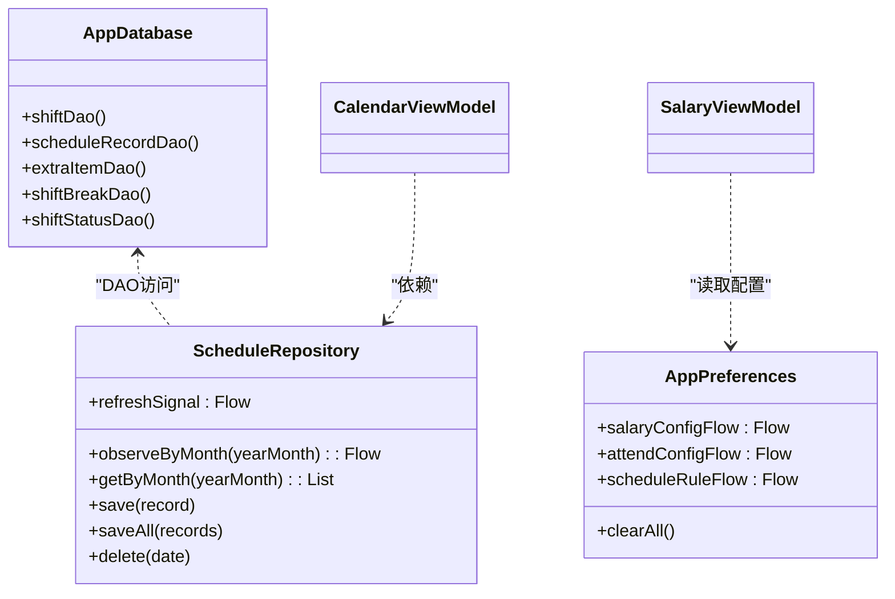
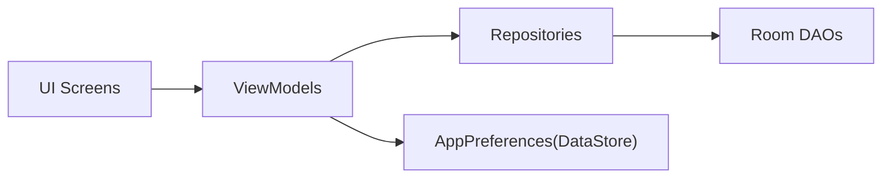

# 调试和测试

<cite>
**本文引用的文件**   
- [MainActivity.kt](file://app/src/main/java/com/schedulecalendar/app/MainActivity.kt)
- [ScheduleApp.kt](file://app/src/main/java/com/schedulecalendar/app/ScheduleApp.kt)
- [CalendarViewModel.kt](file://app/src/main/java/com/schedulecalendar/app/ui/calendar/CalendarViewModel.kt)
- [CalendarScreen.kt](file://app/src/main/java/com/schedulecalendar/app/ui/calendar/CalendarScreen.kt)
- [TodoScreen.kt](file://app/src/main/java/com/schedulecalendar/app/ui/todo/TodoScreen.kt)
- [EditCalendarEventScreen.kt](file://app/src/main/java/com/schedulecalendar/app/ui/todo/EditCalendarEventScreen.kt)
- [AddAnniversaryScreen.kt](file://app/src/main/java/com/schedulecalendar/app/ui/todo/AddAnniversaryScreen.kt)
- [SalaryViewModel.kt](file://app/src/main/java/com/schedulecalendar/app/ui/salary/SalaryViewModel.kt)
- [SalaryScreen.kt](file://app/src/main/java/com/schedulecalendar/app/ui/salary/SalaryScreen.kt)
- [AppNavHost.kt](file://app/src/main/java/com/schedulecalendar/app/ui/navigation/AppNavHost.kt)
- [AppDatabase.kt](file://app/src/main/java/com/schedulecalendar/app/data/db/AppDatabase.kt)
- [ScheduleRepository.kt](file://app/src/main/java/com/schedulecalendar/app/data/repository/ScheduleRepository.kt)
- [AppPreferences.kt](file://app/src/main/java/com/schedulecalendar/app/data/prefs/AppPreferences.kt)
- [build.gradle.kts](file://app/build.gradle.kts)
</cite>

## 目录
1. [简介](#简介)
2. [项目结构](#项目结构)
3. [核心组件](#核心组件)
4. [架构总览](#架构总览)
5. [详细组件分析](#详细组件分析)
6. [依赖分析](#依赖分析)
7. [性能考虑](#性能考虑)
8. [故障排除指南](#故障排除指南)
9. [结论](#结论)
10. [附录](#附录)

## 简介
本指南面向 Android 开发团队，围绕本项目的调试与测试实践，覆盖以下主题：
- 调试技巧：Logcat、断点调试、内存泄漏检测、性能分析（Profiler）
- 单元测试策略：ViewModel、Repository、数据库、业务逻辑
- UI 测试（Espresso + Compose）：Compose UI 测试、用户交互、页面导航
- 集成与端到端测试最佳实践
- 常见问题排查：数据库迁移、权限、异步编程等

## 项目结构
本项目采用分层架构：UI（Compose Screen）→ ViewModel → Repository → DAO/Room → DataStore。应用入口为 MainActivity，使用 Hilt 注入依赖，Room 负责本地持久化，DataStore 管理配置。

图表来源
- [MainActivity.kt:1-105](file://app/src/main/java/com/schedulecalendar/app/MainActivity.kt#L1-L105)
- [AppNavHost.kt:16-40](file://app/src/main/java/com/schedulecalendar/app/ui/navigation/AppNavHost.kt#L16-L40)
- [CalendarScreen.kt:278-966](file://app/src/main/java/com/schedulecalendar/app/ui/calendar/CalendarScreen.kt#L278-L966)
- [CalendarViewModel.kt:104-247](file://app/src/main/java/com/schedulecalendar/app/ui/calendar/CalendarViewModel.kt#L104-L247)
- [ScheduleRepository.kt:13-39](file://app/src/main/java/com/schedulecalendar/app/data/repository/ScheduleRepository.kt#L13-L39)
- [AppDatabase.kt:17-34](file://app/src/main/java/com/schedulecalendar/app/data/db/AppDatabase.kt#L17-L34)
- [AppPreferences.kt:66-86](file://app/src/main/java/com/schedulecalendar/app/data/prefs/AppPreferences.kt#L66-L86)

章节来源
- [MainActivity.kt:1-105](file://app/src/main/java/com/schedulecalendar/app/MainActivity.kt#L1-L105)
- [build.gradle.kts:1-116](file://app/build.gradle.kts#L1-L116)

## 核心组件
- 应用入口与初始化
  - Application 类启用 Hilt；Activity 处理启动 Intent、动态快捷方式恢复、Edge-to-Edge 设置与根导航。
- 导航
  - AppNavHost 集中注册所有 Compose 路由，便于导航测试与断点定位。
- 数据层
  - Room 数据库导出 schema，版本化管理；Repository 封装 DAO 并暴露 Flow 变更信号。
- 偏好与配置
  - DataStore 提供 Flow 驱动的配置项，供 ViewModel 组合计算。
- 视图模型
  - CalendarViewModel 聚合多源数据，计算当月详情与待办；SalaryViewModel 监听排班刷新信号自动重载。

章节来源
- [ScheduleApp.kt:1-9](file://app/src/main/java/com/schedulecalendar/app/ScheduleApp.kt#L1-L9)
- [MainActivity.kt:22-65](file://app/src/main/java/com/schedulecalendar/app/MainActivity.kt#L22-L65)
- [AppNavHost.kt:16-40](file://app/src/main/java/com/schedulecalendar/app/ui/navigation/AppNavHost.kt#L16-L40)
- [AppDatabase.kt:17-34](file://app/src/main/java/com/schedulecalendar/app/data/db/AppDatabase.kt#L17-L34)
- [ScheduleRepository.kt:13-39](file://app/src/main/java/com/schedulecalendar/app/data/repository/ScheduleRepository.kt#L13-L39)
- [AppPreferences.kt:66-86](file://app/src/main/java/com/schedulecalendar/app/data/prefs/AppPreferences.kt#L66-L86)
- [CalendarViewModel.kt:104-247](file://app/src/main/java/com/schedulecalendar/app/ui/calendar/CalendarViewModel.kt#L104-L247)
- [SalaryViewModel.kt:57-88](file://app/src/main/java/com/schedulecalendar/app/ui/salary/SalaryViewModel.kt#L57-L88)

## 架构总览
下图展示从 UI 到数据的调用链与数据流向，适用于理解断点放置与日志定位。

图表来源
- [CalendarScreen.kt:278-966](file://app/src/main/java/com/schedulecalendar/app/ui/calendar/CalendarScreen.kt#L278-L966)
- [CalendarViewModel.kt:104-247](file://app/src/main/java/com/schedulecalendar/app/ui/calendar/CalendarViewModel.kt#L104-L247)
- [ScheduleRepository.kt:13-39](file://app/src/main/java/com/schedulecalendar/app/data/repository/ScheduleRepository.kt#L13-L39)
- [AppDatabase.kt:17-34](file://app/src/main/java/com/schedulecalendar/app/data/db/AppDatabase.kt#L17-L34)
- [AppPreferences.kt:66-86](file://app/src/main/java/com/schedulecalendar/app/data/prefs/AppPreferences.kt#L66-L86)

## 详细组件分析

### 组件A：日历与待办（CalendarViewModel + CalendarScreen + TodoScreen）
- 职责划分
  - CalendarScreen 负责布局与手势（滑动切月）、选择日期、批量/复制模式 UI。
  - TodoScreen 组织待办分类与弹窗交互，调用 ViewModel 执行补录与加班确认。
  - CalendarViewModel 聚合 Shift/Schedule/Extra/Status 与配置，计算当月详情与待办，并通过 Channel 发送 UI 事件。
- 关键流程
  - 月份切换：更新 year/month → loadCurrentMonth() → combine 多源 Flow → 计算 dayDetails/todos → 同步 Widget。
  - 日期点击：更新 selectedDate → 加载选中日期的纪念日与日程事件。
  - 补录打卡/加班确认：写 ScheduleRecord → 发送消息事件 → 同步小组件。

图表来源
- [CalendarViewModel.kt:134-247](file://app/src/main/java/com/schedulecalendar/app/ui/calendar/CalendarViewModel.kt#L134-L247)
- [CalendarScreen.kt:278-966](file://app/src/main/java/com/schedulecalendar/app/ui/calendar/CalendarScreen.kt#L278-L966)
- [TodoScreen.kt:153-204](file://app/src/main/java/com/schedulecalendar/app/ui/todo/TodoScreen.kt#L153-L204)

章节来源
- [CalendarViewModel.kt:104-247](file://app/src/main/java/com/schedulecalendar/app/ui/calendar/CalendarViewModel.kt#L104-L247)
- [CalendarScreen.kt:278-966](file://app/src/main/java/com/schedulecalendar/app/ui/calendar/CalendarScreen.kt#L278-L966)
- [TodoScreen.kt:153-204](file://app/src/main/java/com/schedulecalendar/app/ui/todo/TodoScreen.kt#L153-L204)

### 组件B：薪资计算（SalaryViewModel + SalaryScreen）
- 职责划分
  - SalaryScreen 在 onResume 时触发 reload，支持外部共享月份同步。
  - SalaryViewModel 监听排班刷新信号，首次加载显示 loading，后续刷新保持内容。
- 关键流程
  - 收集配置与数据 → 组装月度详情 → 更新 State → 通过 uiEvent 通知 UI。

图表来源
- [SalaryScreen.kt:29-69](file://app/src/main/java/com/schedulecalendar/app/ui/salary/SalaryScreen.kt#L29-L69)
- [SalaryViewModel.kt:57-88](file://app/src/main/java/com/schedulecalendar/app/ui/salary/SalaryViewModel.kt#L57-L88)
- [ScheduleRepository.kt:25-36](file://app/src/main/java/com/schedulecalendar/app/data/repository/ScheduleRepository.kt#L25-L36)
- [AppPreferences.kt:66-86](file://app/src/main/java/com/schedulecalendar/app/data/prefs/AppPreferences.kt#L66-L86)

章节来源
- [SalaryScreen.kt:29-69](file://app/src/main/java/com/schedulecalendar/app/ui/salary/SalaryScreen.kt#L29-L69)
- [SalaryViewModel.kt:57-88](file://app/src/main/java/com/schedulecalendar/app/ui/salary/SalaryViewModel.kt#L57-L88)

### 组件C：应用入口与导航（MainActivity + AppNavHost）
- 职责划分
  - MainActivity 处理启动 Intent、动态快捷方式恢复、Edge-to-Edge 设置，并挂载 AppNavHost。
  - AppNavHost 集中声明所有屏幕路由，便于导航测试与断点追踪。
- 关键流程
  - onCreate → handleShortcutIntent → setContent(ScheduleCalendarTheme + Surface + AppNavHost)。

图表来源
- [MainActivity.kt:41-65](file://app/src/main/java/com/schedulecalendar/app/MainActivity.kt#L41-L65)
- [AppNavHost.kt:16-40](file://app/src/main/java/com/schedulecalendar/app/ui/navigation/AppNavHost.kt#L16-L40)

章节来源
- [MainActivity.kt:22-65](file://app/src/main/java/com/schedulecalendar/app/MainActivity.kt#L22-L65)
- [AppNavHost.kt:16-40](file://app/src/main/java/com/schedulecalendar/app/ui/navigation/AppNavHost.kt#L16-L40)

### 组件D：数据库与偏好（AppDatabase + ScheduleRepository + AppPreferences）
- 职责划分
  - AppDatabase 定义实体与版本，导出 schema 至 app/schemas。
  - ScheduleRepository 封装 DAO，暴露 Flow 与 suspend API，并在写操作后发出 refreshSignal。
  - AppPreferences 通过 DataStore 提供配置流与读写方法。
- 关键点
  - 写操作后统一 notifyChanged，供 ViewModel 响应刷新。
  - 配置项以 JSON 序列化存储，提供 Flow 驱动的组合计算。

图表来源
- [AppDatabase.kt:17-34](file://app/src/main/java/com/schedulecalendar/app/data/db/AppDatabase.kt#L17-L34)
- [ScheduleRepository.kt:13-39](file://app/src/main/java/com/schedulecalendar/app/data/repository/ScheduleRepository.kt#L13-L39)
- [AppPreferences.kt:66-86](file://app/src/main/java/com/schedulecalendar/app/data/prefs/AppPreferences.kt#L66-L86)

章节来源
- [AppDatabase.kt:17-34](file://app/src/main/java/com/schedulecalendar/app/data/db/AppDatabase.kt#L17-L34)
- [ScheduleRepository.kt:13-39](file://app/src/main/java/com/schedulecalendar/app/data/repository/ScheduleRepository.kt#L13-L39)
- [AppPreferences.kt:66-86](file://app/src/main/java/com/schedulecalendar/app/data/prefs/AppPreferences.kt#L66-L86)

## 依赖分析
- 模块耦合
  - UI 仅依赖 ViewModel 与 Navigation，不直接访问数据层，降低耦合度。
  - ViewModel 依赖多个 Repository 与 Preferences，体现单一职责与可测试性。
  - Repository 对 DAO 的依赖集中在数据访问，便于替换为内存实现进行单元测试。
- 外部依赖
  - Hilt 用于依赖注入；Room 与 KSP 生成代码；DataStore 提供类型安全配置；Coroutines 与 Flow 驱动异步与响应式。

图表来源
- [CalendarViewModel.kt:104-247](file://app/src/main/java/com/schedulecalendar/app/ui/calendar/CalendarViewModel.kt#L104-L247)
- [SalaryViewModel.kt:57-88](file://app/src/main/java/com/schedulecalendar/app/ui/salary/SalaryViewModel.kt#L57-L88)
- [ScheduleRepository.kt:13-39](file://app/src/main/java/com/schedulecalendar/app/data/repository/ScheduleRepository.kt#L13-L39)
- [AppPreferences.kt:66-86](file://app/src/main/java/com/schedulecalendar/app/data/prefs/AppPreferences.kt#L66-L86)

章节来源
- [build.gradle.kts:56-116](file://app/build.gradle.kts#L56-L116)

## 性能考虑
- 避免重复计算
  - 在 Compose 中使用 remember 缓存过滤后的列表（如待办分类），减少重组开销。
- 协程与 Job 管理
  - ViewModel 中维护 collectJob/loadJob，切换月份或重载时取消旧任务，防止累积与泄漏。
- 数据合并优化
  - 使用 combine 将多源 Flow 合并，一次性计算，减少多次重组。
- 首次加载与刷新区分
  - SalaryViewModel 仅在 details 为空时显示 loading，提升用户体验。

章节来源
- [TodoScreen.kt:228-254](file://app/src/main/java/com/schedulecalendar/app/ui/todo/TodoScreen.kt#L228-L254)
- [CalendarViewModel.kt:123-133](file://app/src/main/java/com/schedulecalendar/app/ui/calendar/CalendarViewModel.kt#L123-L133)
- [CalendarViewModel.kt:134-247](file://app/src/main/java/com/schedulecalendar/app/ui/calendar/CalendarViewModel.kt#L134-L247)
- [SalaryViewModel.kt:74-88](file://app/src/main/java/com/schedulecalendar/app/ui/salary/SalaryViewModel.kt#L74-L88)

## 故障排除指南
- Logcat 定位
  - 关注仓库与调度器中的日志标签（如“CalendarEventRepo”、“ReminderScheduler”），快速定位异常路径。
- 断点调试
  - 在 ViewModel 的关键方法（loadCurrentMonth、applyScheduleRule、copyExecute）与 Repository 的 save/saveAll 处设置断点，观察 Flow 数据变化与写操作结果。
- 内存泄漏检测
  - 检查 collectJob/loadJob 是否正确取消；确保 DisposableEffect/LifecycleObserver 在 onDispose 中移除观察者。
- 性能分析（Profiler）
  - 使用 CPU/内存/网络 Profiler 验证月份切换时的数据合并耗时与内存峰值；关注长时间运行的协程与 IO 阻塞。
- 数据库迁移问题
  - 检查 AppDatabase 的版本号与 schemas 目录一致性；必要时清理应用数据或使用 Room Migration 工具。
- 权限问题
  - 日历事件编辑/添加涉及日历权限，注意运行时权限申请与失败回退；闹钟提醒需精确闹钟权限。
- 异步编程问题
  - 使用 runCatching 包裹可能失败的请求；确保 UI 事件通过 Channel 安全传递；避免在主线程执行耗时操作。

章节来源
- [CalendarEventRepository.kt:102-513](file://app/src/main/java/com/schedulecalendar/app/data/calendar/CalendarEventRepository.kt#L102-L513)
- [ReminderScheduler.kt:230-377](file://app/src/main/java/com/schedulecalendar/app/reminder/ReminderScheduler.kt#L230-L377)
- [AppDatabase.kt:17-34](file://app/src/main/java/com/schedulecalendar/app/data/db/AppDatabase.kt#L17-L34)
- [EditCalendarEventScreen.kt:1-25](file://app/src/main/java/com/schedulecalendar/app/ui/todo/EditCalendarEventScreen.kt#L1-L25)
- [AddAnniversaryScreen.kt:192-213](file://app/src/main/java/com/schedulecalendar/app/ui/todo/AddAnniversaryScreen.kt#L192-L213)
- [SalaryViewModel.kt:74-88](file://app/src/main/java/com/schedulecalendar/app/ui/salary/SalaryViewModel.kt#L74-L88)

## 结论
通过清晰的层次结构与响应式数据流，本项目具备良好的可调试性与可测试性。建议在 CI 中引入单元测试与 UI 测试，结合 Profiler 与 Logcat 持续监控性能与稳定性，逐步完善迁移与权限处理的健壮性。

## 附录

### 调试清单
- 启动与导航
  - 在 MainActivity.onCreate 与 AppNavHost 注册处设置断点，验证路由与 Intent 处理。
- 数据加载
  - 在 CalendarViewModel.loadCurrentMonth 与 Repository.save/saveAll 设置断点，观察 Flow 更新与写操作。
- 配置读取
  - 在 AppPreferences 的 Flow 读取处断点，确认默认值与序列化正确性。
- 权限与系统服务
  - 在 EditCalendarEventScreen 与 AddAnniversaryScreen 中检查权限申请与 AlarmManager 调度。

章节来源
- [MainActivity.kt:41-65](file://app/src/main/java/com/schedulecalendar/app/MainActivity.kt#L41-L65)
- [AppNavHost.kt:16-40](file://app/src/main/java/com/schedulecalendar/app/ui/navigation/AppNavHost.kt#L16-L40)
- [CalendarViewModel.kt:134-247](file://app/src/main/java/com/schedulecalendar/app/ui/calendar/CalendarViewModel.kt#L134-L247)
- [ScheduleRepository.kt:25-36](file://app/src/main/java/com/schedulecalendar/app/data/repository/ScheduleRepository.kt#L25-L36)
- [AppPreferences.kt:66-86](file://app/src/main/java/com/schedulecalendar/app/data/prefs/AppPreferences.kt#L66-L86)
- [EditCalendarEventScreen.kt:1-25](file://app/src/main/java/com/schedulecalendar/app/ui/todo/EditCalendarEventScreen.kt#L1-L25)
- [AddAnniversaryScreen.kt:192-213](file://app/src/main/java/com/schedulecalendar/app/ui/todo/AddAnniversaryScreen.kt#L192-L213)

### 测试策略建议
- 单元测试
  - ViewModel：使用 Tornado/Kotest 模拟 Repository 与 Preferences，验证状态更新与事件发送。
  - Repository：使用内存 DAO 或 Mock，验证 Flow 刷新信号与 CRUD 行为。
  - 数据库：使用 Room In-Memory Database 验证查询与迁移。
  - 业务逻辑：针对 applyScheduleRule、copyExecute 等方法编写边界用例。
- UI 测试（Compose + Espresso）
  - 使用 createComposeRule 与 Semantics 断言 UI 元素与状态。
  - 导航测试：验证 navigate 到目标路由与参数传递。
  - 用户交互：模拟点击/长按/滑动手势，验证状态流转与弹窗出现。
- 集成与端到端测试
  - 使用 Hilt Test 注入测试依赖，串联 UI → ViewModel → Repository → In-Memory DB。
  - 端到端：覆盖完整业务流程（创建排班 → 补录打卡 → 查看薪资）。

[本节为通用指导，不直接分析具体文件]