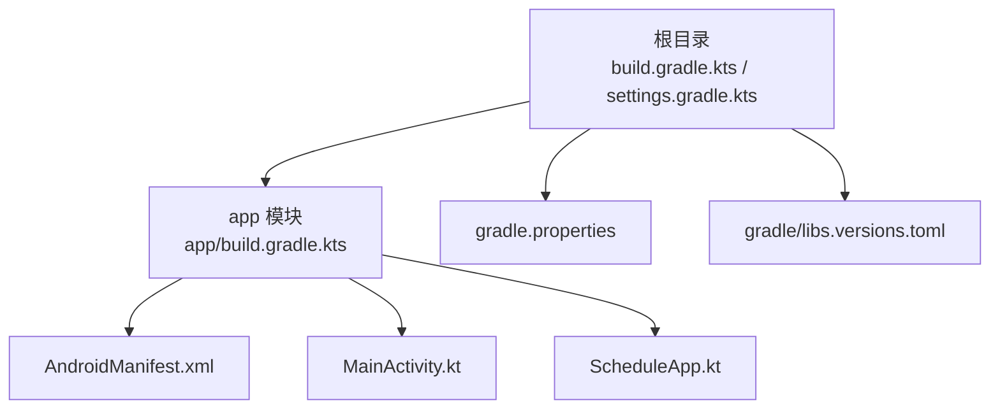
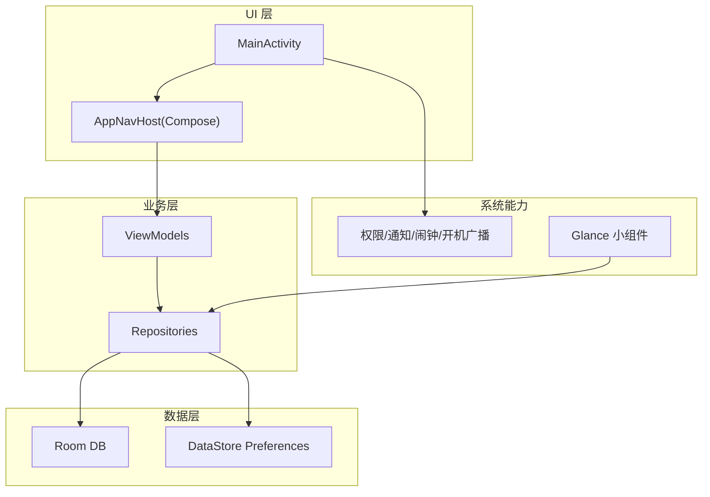
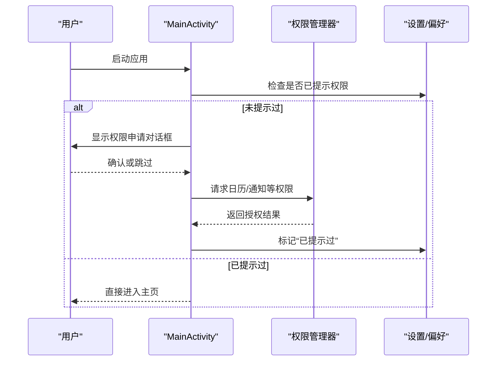

# 快速开始

<cite>
**本文引用的文件**   
- [build.gradle.kts](file://build.gradle.kts)
- [settings.gradle.kts](file://settings.gradle.kts)
- [gradle.properties](file://gradle.properties)
- [gradle/libs.versions.toml](file://gradle/libs.versions.toml)
- [app/build.gradle.kts](file://app/build.gradle.kts)
- [app/src/main/AndroidManifest.xml](file://app/src/main/AndroidManifest.xml)
- [app/src/main/java/com/schedulecalendar/app/ScheduleApp.kt](file://app/src/main/java/com/schedulecalendar/app/ScheduleApp.kt)
- [app/src/main/java/com/schedulecalendar/app/MainActivity.kt](file://app/src/main/java/com/schedulecalendar/app/MainActivity.kt)
- [gradle/gradle-daemon-jvm.properties](file://gradle/gradle-daemon-jvm.properties)
</cite>

## 目录
1. [简介](#简介)
2. [项目结构](#项目结构)
3. [核心组件](#核心组件)
4. [架构总览](#架构总览)
5. [详细组件分析](#详细组件分析)
6. [依赖与构建配置](#依赖与构建配置)
7. [性能考虑](#性能考虑)
8. [故障排查指南](#故障排查指南)
9. [结论](#结论)
10. [附录：首次运行清单](#附录首次运行清单)

## 简介
本指南面向新手开发者，帮助你在最短时间内搭建 Android 排班日历应用的开发环境并完成首次运行。内容涵盖：
- 开发环境与版本要求（Android Studio、Kotlin、SDK、JDK）
- 克隆与构建步骤
- Gradle 配置与依赖管理（含 libs.versions.toml）
- 首次运行与权限配置
- 目录结构与关键配置文件说明
- 常见构建问题与调试技巧

## 项目结构
本项目采用单模块应用结构，入口为 app 模块，使用 Kotlin + Jetpack Compose + Hilt + Room + Navigation + Glance（小组件）。根目录包含顶层 Gradle 插件声明与仓库镜像配置；app 模块包含全部业务代码、资源与清单。

图表来源
- [build.gradle.kts:1-10](file://build.gradle.kts#L1-L10)
- [settings.gradle.kts:1-37](file://settings.gradle.kts#L1-L37)
- [app/build.gradle.kts:1-141](file://app/build.gradle.kts#L1-L141)
- [app/src/main/AndroidManifest.xml:1-126](file://app/src/main/AndroidManifest.xml#L1-L126)
- [app/src/main/java/com/schedulecalendar/app/MainActivity.kt:1-322](file://app/src/main/java/com/schedulecalendar/app/MainActivity.kt#L1-L322)
- [app/src/main/java/com/schedulecalendar/app/ScheduleApp.kt:1-9](file://app/src/main/java/com/schedulecalendar/app/ScheduleApp.kt#L1-L9)

章节来源
- [build.gradle.kts:1-10](file://build.gradle.kts#L1-L10)
- [settings.gradle.kts:1-37](file://settings.gradle.kts#L1-L37)
- [app/build.gradle.kts:1-141](file://app/build.gradle.kts#L1-L141)

## 核心组件
- 应用入口与主题初始化：Application 类用于启用 Hilt 依赖注入。
- 主界面 Activity：负责权限申请、返回键处理、快捷方式与导航入口。
- 清单文件：声明权限、组件（Activity/Receiver/Service）、小组件与 FileProvider。
- 构建与依赖：通过 Gradle 插件与 libs.versions.toml 统一管理版本与依赖。

章节来源
- [app/src/main/java/com/schedulecalendar/app/ScheduleApp.kt:1-9](file://app/src/main/java/com/schedulecalendar/app/ScheduleApp.kt#L1-L9)
- [app/src/main/java/com/schedulecalendar/app/MainActivity.kt:1-322](file://app/src/main/java/com/schedulecalendar/app/MainActivity.kt#L1-L322)
- [app/src/main/AndroidManifest.xml:1-126](file://app/src/main/AndroidManifest.xml#L1-L126)

## 架构总览
应用基于现代 Android 技术栈：
- UI：Jetpack Compose + Material3
- 状态与生命周期：Lifecycle + ViewModel（Compose）
- 依赖注入：Hilt（KSP）
- 数据持久化：Room（KSP schema 导出）+ DataStore Preferences
- 导航：Navigation Compose
- 桌面小组件：Glance（Compose-first）
- 协程：kotlinx-coroutines

[此图为概念性架构图，不直接映射具体源码文件]

## 详细组件分析

### 应用入口与依赖注入
- Application 类标注 Hilt 注解，启动时完成依赖图初始化。
- MainActivity 使用 @AndroidEntryPoint 注入 AppPreferences，并在首次启动时引导权限申请。

章节来源
- [app/src/main/java/com/schedulecalendar/app/ScheduleApp.kt:1-9](file://app/src/main/java/com/schedulecalendar/app/ScheduleApp.kt#L1-L9)
- [app/src/main/java/com/schedulecalendar/app/MainActivity.kt:1-322](file://app/src/main/java/com/schedulecalendar/app/MainActivity.kt#L1-L322)

### 主界面与权限流程
- 首次进入会弹出权限对话框，请求日历读写、通知等权限，并记录“已提示过”的状态。
- 支持动态快捷方式（上班/下班打卡），并通过 Intent Action 路由到对应逻辑。
- 返回键处理兼容 API 34+ 的系统级回调与全 API 的 OnBackPressedDispatcher 兜底。

图表来源
- [app/src/main/java/com/schedulecalendar/app/MainActivity.kt:1-322](file://app/src/main/java/com/schedulecalendar/app/MainActivity.kt#L1-322)

章节来源
- [app/src/main/java/com/schedulecalendar/app/MainActivity.kt:1-322](file://app/src/main/java/com/schedulecalendar/app/MainActivity.kt#L1-322)

### 清单与权限
- 声明了日历读写、通知、精确闹钟、开机自启、账户认证等权限。
- 注册了多个 Receiver（闹钟、纪念日提醒、开机广播）、两个 Glance 小组件 Receiver、FileProvider、以及日历账户认证服务。

章节来源
- [app/src/main/AndroidManifest.xml:1-126](file://app/src/main/AndroidManifest.xml#L1-L126)

## 依赖与构建配置

### 版本与仓库
- 顶层 build.gradle.kts 仅声明插件别名，避免在根目录应用插件。
- settings.gradle.kts 统一仓库源：优先阿里云镜像，备用华为云，最后回退官方源；同时启用 JitPack。
- gradle.properties 配置 JVM 参数、Gradle 缓存与 Java 路径。

章节来源
- [build.gradle.kts:1-10](file://build.gradle.kts#L1-L10)
- [settings.gradle.kts:1-37](file://settings.gradle.kts#L1-L37)
- [gradle.properties:1-8](file://gradle.properties#L1-L8)

### libs.versions.toml 的使用
- 集中定义所有库的版本号与依赖项，便于统一升级与维护。
- 通过 alias(libs.plugins.*) 引用插件，通过 libs.* 引用依赖。
- 本项目使用的关键版本（节选）：
  - AGP: 8.13.0
  - Kotlin: 2.0.21
  - KSP: 2.0.21-1.0.28
  - Hilt: 2.52
  - Compose BOM: 2025.05.01
  - Navigation Compose: 2.8.9
  - Room: 2.7.1
  - DataStore: 1.1.4
  - Lifecycle: 2.9.1
  - Activity Compose: 1.10.1
  - Core-KTX: 1.16.0
  - AppCompat: 1.7.0
  - Coroutines: 1.9.0
  - Gson: 2.11.0
  - Glance: 1.1.1
  - tyme4j: 1.5.1
  - WheelPickerCompose: 1.1.11
  - DocumentFile: 1.0.1

章节来源
- [gradle/libs.versions.toml:1-86](file://gradle/libs.versions.toml#L1-L86)

### app 模块构建配置要点
- compileSdk/targetSdk/minSdk：36/36/26
- Java/Kotlin 目标：17
- Compose 编译：启用 compose 特性，使用独立 Compose Compiler（Kotlin 2.0+）
- Room：KSP 导出 schema 到 app/schemas
- Lint：关闭部分警告以适配打包流程
- 签名：release 类型配置了签名信息（本地路径需替换为实际 keystore）

章节来源
- [app/build.gradle.kts:1-141](file://app/build.gradle.kts#L1-L141)

### JDK 与 Gradle 工具链
- gradle.properties 指定了 Java 路径指向 Android Studio 内置 JBR。
- gradle-daemon-jvm.properties 定义了各平台工具链下载地址与版本（JetBrains JDK 21）。

章节来源
- [gradle.properties:1-8](file://gradle.properties#L1-L8)
- [gradle/gradle-daemon-jvm.properties:1-14](file://gradle/gradle-daemon-jvm.properties#L1-L14)

## 性能考虑
- 启用 Gradle 配置缓存与构建缓存，提升增量构建速度。
- 使用 Compose BOM 统一管理 Compose 依赖版本，减少冲突。
- Room 开启 KSP 增量编译与 schema 导出，利于迁移与稳定性。
- ProGuard/R8 对 release 包进行混淆与资源压缩。

[本节为通用建议，不直接分析具体文件]

## 故障排查指南

### 无法下载依赖或构建缓慢
- 检查网络与代理设置，确保能访问阿里云/华为云镜像与 JitPack。
- 清理 Gradle 缓存后重试：./gradlew clean build --refresh-dependencies
- 若仍失败，临时切换回官方源 google() 与 mavenCentral()。

章节来源
- [settings.gradle.kts:1-37](file://settings.gradle.kts#L1-L37)

### JDK 版本不匹配
- 项目要求 Java 17，确保 Android Studio 的 SDK 与 gradle.properties 中的 java.home 一致。
- 如出现工具链错误，检查 gradle-daemon-jvm.properties 中 toolchainVersion 是否为 21（Gradle 内部工具链）。

章节来源
- [gradle.properties:1-8](file://gradle.properties#L1-L8)
- [gradle/gradle-daemon-jvm.properties:1-14](file://gradle/gradle-daemon-jvm.properties#L1-L14)

### Room Schema 生成失败
- 确认 KSP 插件已启用且 room.schemaLocation 指向 app/schemas。
- 删除旧 schema 后重新编译，确保迁移历史正确更新。

章节来源
- [app/build.gradle.kts:1-141](file://app/build.gradle.kts#L1-L141)

### 权限相关功能异常
- 首次运行请允许日历读写与通知权限；若拒绝，可在系统设置中手动开启。
- 通知权限在 Android 13+ 需要运行时申请。

章节来源
- [app/src/main/AndroidManifest.xml:1-126](file://app/src/main/AndroidManifest.xml#L1-L126)
- [app/src/main/java/com/schedulecalendar/app/MainActivity.kt:1-322](file://app/src/main/java/com/schedulecalendar/app/MainActivity.kt#L1-322)

### 签名与发布包构建
- release 签名路径为本地绝对路径，需在个人机器上替换为有效 keystore 路径与密码。
- 若遇到 lint 或资源校验失败，可参考当前 lint 禁用项调整。

章节来源
- [app/build.gradle.kts:1-141](file://app/build.gradle.kts#L1-L141)

## 结论
通过本指南，你应已完成开发环境准备、理解项目结构与关键配置，并能成功构建与运行应用。建议在后续开发中：
- 统一通过 libs.versions.toml 管理依赖版本
- 保持 Kotlin 与 Compose 编译器版本一致
- 使用 Hilt + KSP 提高依赖注入与编译效率
- 利用 Room schema 追踪数据库迁移

[本节为总结性内容，不直接分析具体文件]

## 附录：首次运行清单
- 安装 Android Studio（建议使用最新稳定版）
- 配置 JDK 17（可通过 Android Studio 内置 SDK Manager 安装）
- 克隆项目到本地
- 打开项目并等待 Gradle 同步完成
- 连接设备或启动模拟器（API 26+）
- 运行 app 模块，首次启动按提示授予权限
- 如需发布，修改 app/build.gradle.kts 中的签名配置

章节来源
- [app/build.gradle.kts:1-141](file://app/build.gradle.kts#L1-L141)
- [app/src/main/AndroidManifest.xml:1-126](file://app/src/main/AndroidManifest.xml#L1-L126)
- [gradle.properties:1-8](file://gradle.properties#L1-L8)