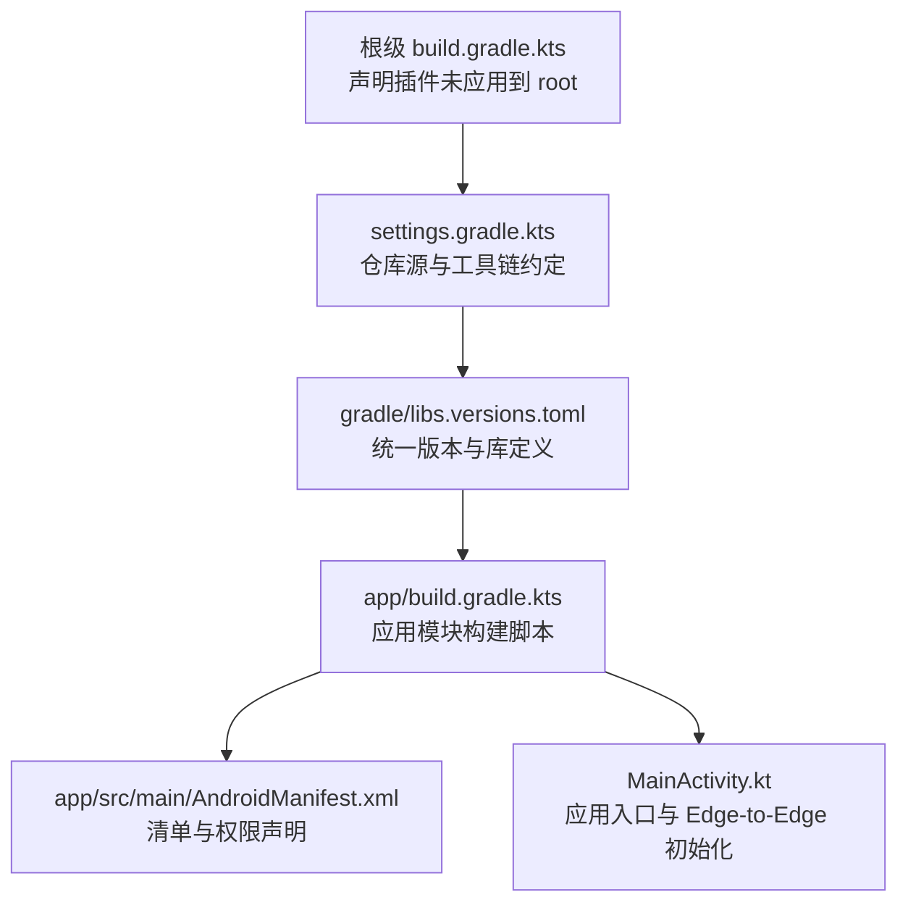
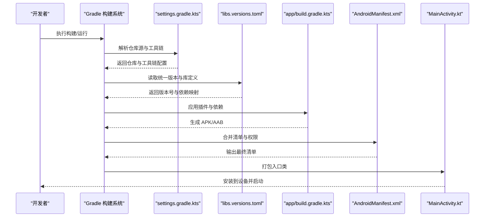

# 快速开始

<cite>
**本文引用的文件**   
- [build.gradle.kts](file://build.gradle.kts)
- [app/build.gradle.kts](file://app/build.gradle.kts)
- [gradle.properties](file://gradle.properties)
- [settings.gradle.kts](file://settings.gradle.kts)
- [gradle/libs.versions.toml](file://gradle/libs.versions.toml)
- [app/src/main/AndroidManifest.xml](file://app/src/main/AndroidManifest.xml)
- [app/src/main/java/com/schedulecalendar/app/MainActivity.kt](file://app/src/main/java/com/schedulecalendar/app/MainActivity.kt)
</cite>

## 目录
1. [简介](#简介)
2. [项目结构](#项目结构)
3. [核心组件](#核心组件)
4. [架构总览](#架构总览)
5. [详细组件分析](#详细组件分析)
6. [依赖与版本管理](#依赖与版本管理)
7. [性能与构建优化](#性能与构建优化)
8. [常见问题排查](#常见问题排查)
9. [结论](#结论)
10. [附录：环境要求与最佳实践](#附录环境要求与最佳实践)

## 简介
本指南面向首次接触“排班日历”Android 应用的开发者，目标是帮助你在最短时间内完成环境搭建、克隆代码、编译运行，并理解 Gradle 构建配置与依赖版本管理方式。文档同时提供常见构建问题的解决方案、开发环境最佳实践、代码格式化建议以及调试技巧，确保新手也能顺利上手。

## 项目结构
本项目采用单模块应用结构（:app），使用 Kotlin + Jetpack Compose 作为 UI 技术栈，结合 Hilt 进行依赖注入，Room 做本地持久化，DataStore 保存偏好设置，Glance 实现桌面小组件，Navigation Compose 负责页面导航。

图表来源
- [build.gradle.kts:1-10](file://build.gradle.kts#L1-L10)
- [settings.gradle.kts:1-37](file://settings.gradle.kts#L1-L37)
- [gradle/libs.versions.toml:1-82](file://gradle/libs.versions.toml#L1-L82)
- [app/build.gradle.kts:1-116](file://app/build.gradle.kts#L1-L116)
- [app/src/main/AndroidManifest.xml:1-128](file://app/src/main/AndroidManifest.xml#L1-L128)
- [app/src/main/java/com/schedulecalendar/app/MainActivity.kt:1-105](file://app/src/main/java/com/schedulecalendar/app/MainActivity.kt#L1-L105)

章节来源
- [build.gradle.kts:1-10](file://build.gradle.kts#L1-L10)
- [settings.gradle.kts:1-37](file://settings.gradle.kts#L1-L37)
- [gradle/libs.versions.toml:1-82](file://gradle/libs.versions.toml#L1-L82)
- [app/build.gradle.kts:1-116](file://app/build.gradle.kts#L1-L116)
- [app/src/main/AndroidManifest.xml:1-128](file://app/src/main/AndroidManifest.xml#L1-L128)
- [app/src/main/java/com/schedulecalendar/app/MainActivity.kt:1-105](file://app/src/main/java/com/schedulecalendar/app/MainActivity.kt#L1-L105)

## 核心组件
- 应用入口与主题
  - MainActivity 负责启动应用、处理快捷方式与小组件跳转意图，并启用 Edge-to-Edge 模式。
  - 通过 Compose 设置主题与导航宿主。
- 清单与权限
  - AndroidManifest 声明了应用图标、主题、主 Activity、小组件接收器、提醒广播接收器、开机自启、文件共享 Provider 等。
  - 声明了存储、通知、日历读写、精确闹钟、账户认证等权限。

章节来源
- [app/src/main/java/com/schedulecalendar/app/MainActivity.kt:22-65](file://app/src/main/java/com/schedulecalendar/app/MainActivity.kt#L22-L65)
- [app/src/main/AndroidManifest.xml:15-45](file://app/src/main/AndroidManifest.xml#L15-L45)
- [app/src/main/AndroidManifest.xml:47-128](file://app/src/main/AndroidManifest.xml#L47-L128)

## 架构总览
从构建与依赖角度，整体流程如下：

图表来源
- [settings.gradle.kts:1-37](file://settings.gradle.kts#L1-L37)
- [gradle/libs.versions.toml:1-82](file://gradle/libs.versions.toml#L1-L82)
- [app/build.gradle.kts:1-116](file://app/build.gradle.kts#L1-L116)
- [app/src/main/AndroidManifest.xml:1-128](file://app/src/main/AndroidManifest.xml#L1-L128)
- [app/src/main/java/com/schedulecalendar/app/MainActivity.kt:1-105](file://app/src/main/java/com/schedulecalendar/app/MainActivity.kt#L1-L105)

## 详细组件分析

### 构建与版本管理
- 顶层 build.gradle.kts 仅声明插件，不应用到 root，避免在根模块误用插件。
- settings.gradle.kts 集中配置仓库源（阿里云优先、华为云备用、官方兜底）、JitPack（第三方库）、Gradle 工具链约定（Foojay Resolver）。
- gradle/libs.versions.toml 统一管理 AGP、Kotlin、Compose BOM、Hilt、Room、Navigation、Coroutines、Gson、Glance、Tyme4j 等版本，并通过 alias 在 app 模块引用。
- app/build.gradle.kts 应用插件、配置命名空间、SDK 版本、Java/Kotlin 目标版本、Compose、KSP Room schema 导出、ProGuard 混淆、Lint 规则与依赖项。

章节来源
- [build.gradle.kts:1-10](file://build.gradle.kts#L1-L10)
- [settings.gradle.kts:1-37](file://settings.gradle.kts#L1-L37)
- [gradle/libs.versions.toml:1-82](file://gradle/libs.versions.toml#L1-L82)
- [app/build.gradle.kts:1-54](file://app/build.gradle.kts#L1-L54)
- [app/build.gradle.kts:56-116](file://app/build.gradle.kts#L56-L116)

### 应用入口与运行时行为
- MainActivity 使用 @AndroidEntryPoint 接入 Hilt，enableEdgeToEdge 适配全面屏，处理来自快捷方式与小组件的 Intent，并在 setContent 中加载导航宿主与主题。
- AndroidManifest 声明主 Activity 的 LAUNCHER 过滤器、动态快捷方式 Action、FileProvider、小组件 Receiver、提醒与开机广播接收器、账户认证服务等。

章节来源
- [app/src/main/java/com/schedulecalendar/app/MainActivity.kt:22-65](file://app/src/main/java/com/schedulecalendar/app/MainActivity.kt#L22-L65)
- [app/src/main/java/com/schedulecalendar/app/MainActivity.kt:67-104](file://app/src/main/java/com/schedulecalendar/app/MainActivity.kt#L67-L104)
- [app/src/main/AndroidManifest.xml:26-45](file://app/src/main/AndroidManifest.xml#L26-L45)
- [app/src/main/AndroidManifest.xml:47-128](file://app/src/main/AndroidManifest.xml#L47-L128)

## 依赖与版本管理
- 统一版本中心：所有关键依赖的版本集中在 libs.versions.toml，便于全局升级与一致性控制。
- 插件与库别名：通过 plugins 与 libraries 块定义别名，app 模块以 alias(libs.plugins.*) 和 implementation(libs.*) 引用，减少重复与错配。
- 仓库策略：settings 中优先使用国内镜像加速下载，同时保留官方源兜底；JitPack 用于第三方库（如滚轮选择器）。
- 关键依赖类别
  - AndroidX 基础：core-ktx、appcompat、activity-compose、lifecycle-runtime-ktx
  - Compose：BOM 管理 ui、runtime、graphics、tooling、foundation、material3、icons
  - Navigation：navigation-compose
  - Hilt：hilt-android、hilt-navigation-compose，编译器使用 KSP
  - Room：room-runtime、room-ktx，编译器使用 KSP，schema 导出至 schemas 目录
  - DataStore：datastore-preferences
  - Glance：glance-appwidget、glance-material3
  - Coroutines：kotlinx-coroutines-android
  - Gson：gson
  - kotlinx-serialization-json：配合 Navigation 类型安全路由
  - 第三方：WheelPickerCompose、tyme4j（农历计算）、documentfile（SAF）

章节来源
- [gradle/libs.versions.toml:1-82](file://gradle/libs.versions.toml#L1-82)
- [app/build.gradle.kts:56-116](file://app/build.gradle.kts#L56-L116)

## 性能与构建优化
- Gradle 缓存与配置缓存：开启 configuration-cache 与 build-cache，提升增量构建速度。
- JVM 参数：增大堆内存并使用并行 GC，降低构建卡顿。
- Java/Kotlin 目标：统一设置为 17，匹配 AGP 与 Kotlin 版本要求。
- ProGuard/R8：release 开启混淆与资源压缩，减小包体。
- Lint：禁用 HighAppVersionCode 警告，兼容日期格式版本号。

章节来源
- [gradle.properties:1-8](file://gradle.properties#L1-L8)
- [app/build.gradle.kts:22-54](file://app/build.gradle.kts#L22-L54)

## 常见问题排查
- 无法拉取依赖或构建缓慢
  - 检查网络与代理，确认 settings.gradle.kts 中的仓库源可达；必要时切换为官方源。
  - 清理 Gradle 缓存后重试：./gradlew clean && ./gradlew assembleDebug
- 找不到 JitPack 库
  - 确认 settings.gradle.kts 已包含 JitPack 仓库。
- KSP/Hilt/Room 注解处理器报错
  - 确认 app/build.gradle.kts 已应用 ksp 插件，且 room.compiler 与 hilt-compiler 使用 KSP 而非 kapt。
- 清单合并失败或权限缺失
  - 检查 AndroidManifest 中权限与组件声明是否完整，特别是通知、日历、精确闹钟、存储相关权限。
- 运行时报 Edge-to-Edge 布局异常
  - 确认 MainActivity 已调用 enableEdgeToEdge()，并在 setContent 中使用 Surface 填充全屏。

章节来源
- [settings.gradle.kts:19-33](file://settings.gradle.kts#L19-L33)
- [app/build.gradle.kts:78-86](file://app/build.gradle.kts#L78-L86)
- [app/src/main/AndroidManifest.xml:4-14](file://app/src/main/AndroidManifest.xml#L4-L14)
- [app/src/main/java/com/schedulecalendar/app/MainActivity.kt:41-65](file://app/src/main/java/com/schedulecalendar/app/MainActivity.kt#L41-L65)

## 结论
通过统一的版本管理与清晰的构建配置，本项目能够快速稳定地构建与运行。遵循本指南的环境要求与步骤，你可以迅速完成首次运行，并在后续迭代中高效维护依赖与构建性能。

## 附录：环境要求与最佳实践

### 环境要求
- Android Studio：建议使用最新稳定版（支持 AGP 8.13.x 与 Kotlin 2.0.x）
- JDK：JDK 17（已在 gradle.properties 指定 jbr 路径）
- SDK：
  - compileSdk/targetSdk：36
  - minSdk：26
- Gradle：由 Gradle Wrapper 管理，无需手动安装
- 其他：
  - 启用 AndroidX
  - 关闭 Jetifier（android.enableJetifier=false）

章节来源
- [gradle/libs.versions.toml:1-20](file://gradle/libs.versions.toml#L1-L20)
- [gradle.properties:4-8](file://gradle.properties#L4-L8)
- [app/build.gradle.kts:10-35](file://app/build.gradle.kts#L10-L35)

### 项目克隆与编译
- 克隆仓库到本地
- 使用 Android Studio 打开项目根目录
- 等待 Gradle 同步完成（首次可能较慢）
- 连接设备或启动模拟器（API 26+）
- 点击 Run 或使用命令行：
  - Windows: .\gradlew.bat assembleDebug
  - Linux/macOS: ./gradlew assembleDebug

章节来源
- [settings.gradle.kts:1-37](file://settings.gradle.kts#L1-L37)
- [app/build.gradle.kts:14-20](file://app/build.gradle.kts#L14-L20)

### 首次运行配置说明
- 权限提示
  - 首次运行会请求通知、存储、日历读写、精确闹钟等权限，请在系统弹窗中允许。
- 小组件与快捷方式
  - 可在桌面添加小组件，长按进入配置页；也可使用动态快捷方式进行打卡操作。
- 数据备份与恢复
  - 应用支持备份与数据提取规则，可在系统设置中查看。

章节来源
- [app/src/main/AndroidManifest.xml:4-14](file://app/src/main/AndroidManifest.xml#L4-L14)
- [app/src/main/AndroidManifest.xml:58-92](file://app/src/main/AndroidManifest.xml#L58-L92)
- [app/src/main/AndroidManifest.xml:22-24](file://app/src/main/AndroidManifest.xml#L22-L24)

### Gradle 构建配置详解
- 插件与特性
  - 应用 android.application、kotlin.android、kotlin.compose、kotlin.serialization、hilt、ksp 插件
  - 启用 Compose 构建特性
- SDK 与语言
  - compileSdk=36，minSdk=26，targetSdk=36
  - Java/Kotlin 目标版本 17
- 构建类型
  - release 开启混淆与资源压缩，使用 proguard-rules.pro
- KSP 与 Room Schema
  - 将 Room schema 导出到 app/schemas 目录，便于迁移追踪
- Lint
  - 禁用 HighAppVersionCode 警告，兼容日期格式版本号

章节来源
- [app/build.gradle.kts:1-54](file://app/build.gradle.kts#L1-L54)

### 依赖版本管理说明
- 版本集中管理：所有版本在 libs.versions.toml 中维护
- 依赖别名：通过 libraries 块定义，app 模块直接引用
- 插件别名：plugins 块定义，避免版本散落
- 仓库优先级：阿里云 > 华为云 > 官方源；JitPack 用于第三方库

章节来源
- [gradle/libs.versions.toml:1-82](file://gradle/libs.versions.toml#L1-L82)
- [settings.gradle.kts:19-33](file://settings.gradle.kts#L19-L33)

### 常见构建问题解决方案
- 依赖下载失败
  - 检查网络与代理；临时切换到官方源验证
  - 清理缓存：./gradlew --stop && ./gradlew clean
- 注解处理器冲突
  - 确保使用 KSP 替代 kapt（Hilt/Room）
- 包体过大
  - 检查 release 混淆与资源压缩是否启用
  - 审查无用依赖

章节来源
- [app/build.gradle.kts:22-54](file://app/build.gradle.kts#L22-L54)
- [app/build.gradle.kts:78-86](file://app/build.gradle.kts#L78-L86)

### 开发环境最佳实践
- 代码风格
  - 启用 Kotlin official 代码风格（kotlin.code.style=official）
- 构建性能
  - 保持 configuration-cache 与 build-cache 开启
  - 合理分配 JVM 内存（当前已配置 4GB）
- 调试技巧
  - 使用 Compose Preview 与 debugImplementation 的 tooling 依赖进行界面预览与调试
  - 利用 Hilt 的调试视图与日志定位依赖注入问题
  - 使用 Logcat 过滤包名 com.schedulecalendar.app 快速定位日志

章节来源
- [gradle.properties:6-7](file://gradle.properties#L6-L7)
- [app/build.gradle.kts:64-73](file://app/build.gradle.kts#L64-L73)