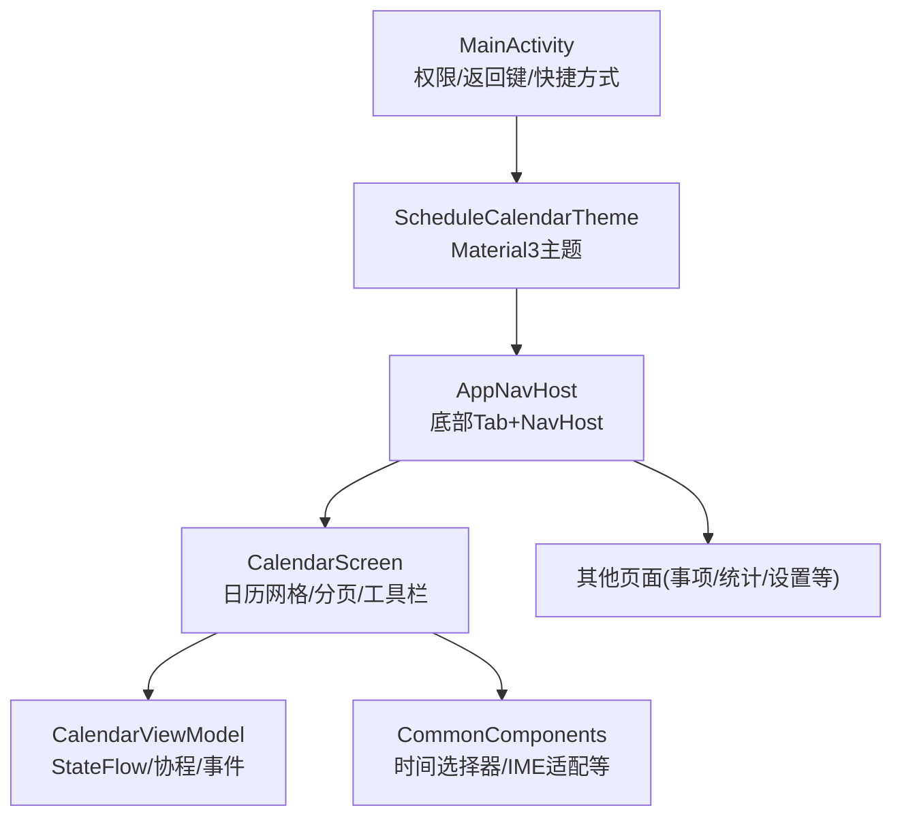
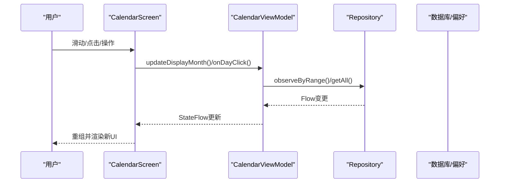
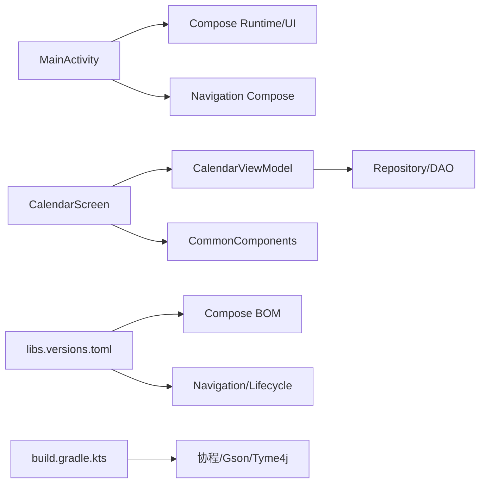

# UI渲染优化

<cite>
**本文引用的文件**   
- [MainActivity.kt](file://app/src/main/java/com/schedulecalendar/app/MainActivity.kt)
- [ScheduleApp.kt](file://app/src/main/java/com/schedulecalendar/app/ScheduleApp.kt)
- [CalendarScreen.kt](file://app/src/main/java/com/schedulecalendar/app/ui/calendar/CalendarScreen.kt)
- [CalendarViewModel.kt](file://app/src/main/java/com/schedulecalendar/app/ui/calendar/CalendarViewModel.kt)
- [AppNavHost.kt](file://app/src/main/java/com/schedulecalendar/app/ui/navigation/AppNavHost.kt)
- [CommonComponents.kt](file://app/src/main/java/com/schedulecalendar/app/ui/component/CommonComponents.kt)
- [HoursDetailScreen.kt](file://app/src/main/java/com/schedulecalendar/app/ui/detail/HoursDetailScreen.kt)
- [libs.versions.toml](file://gradle/libs.versions.toml)
- [build.gradle.kts](file://app/build.gradle.kts)
</cite>

## 目录
1. [简介](#简介)
2. [项目结构](#项目结构)
3. [核心组件](#核心组件)
4. [架构总览](#架构总览)
5. [详细组件分析](#详细组件分析)
6. [依赖关系分析](#依赖关系分析)
7. [性能考量与优化策略](#性能考量与优化策略)
8. [故障排查指南](#故障排查指南)
9. [结论](#结论)
10. [附录](#附录)

## 简介
本文件聚焦于Android排班日历应用的UI渲染优化，围绕Jetpack Compose的重组优化、懒加载与虚拟化列表、自定义组件拆分与状态提升、动画与帧率监控、以及UI测试与性能分析工具使用进行系统化说明。文档以仓库中的实际代码为依据，提供可落地的优化建议与实践路径。

## 项目结构
应用采用模块化分层组织：
- 入口与主题：Application、Activity、Theme
- 导航：基于Navigation Compose的Tab主界面与子页面路由
- 日历与详情：CalendarScreen、CalendarViewModel、详情页等
- 通用组件：CommonComponents封装常用UI元素
- 数据层：Repository、DAO、Entity、Preferences（不在本文重点）

图表来源
- [MainActivity.kt:167-219](file://app/src/main/java/com/schedulecalendar/app/MainActivity.kt#L167-L219)
- [AppNavHost.kt:57-172](file://app/src/main/java/com/schedulecalendar/app/ui/navigation/AppNavHost.kt#L57-L172)
- [CalendarScreen.kt:229-687](file://app/src/main/java/com/schedulecalendar/app/ui/calendar/CalendarScreen.kt#L229-L687)
- [CalendarViewModel.kt:118-246](file://app/src/main/java/com/schedulecalendar/app/ui/calendar/CalendarViewModel.kt#L118-L246)

章节来源
- [MainActivity.kt:167-219](file://app/src/main/java/com/schedulecalendar/app/MainActivity.kt#L167-L219)
- [AppNavHost.kt:57-172](file://app/src/main/java/com/schedulecalendar/app/ui/navigation/AppNavHost.kt#L57-L172)

## 核心组件
- MainActivity：负责权限弹窗、返回键拦截、快捷方式处理、Compose根节点设置
- AppNavHost：底部Tab导航、BackHandler、页面路由
- CalendarScreen：日历网格、月份切换、批量/复制/删除模式、日期详情展示
- CalendarViewModel：状态管理、数据收集、业务逻辑、事件派发
- CommonComponents：时间选择器、IME自适应输入框、颜色选择器等

章节来源
- [MainActivity.kt:141-219](file://app/src/main/java/com/schedulecalendar/app/MainActivity.kt#L141-L219)
- [AppNavHost.kt:57-172](file://app/src/main/java/com/schedulecalendar/app/ui/navigation/AppNavHost.kt#L57-L172)
- [CalendarScreen.kt:229-687](file://app/src/main/java/com/schedulecalendar/app/ui/calendar/CalendarScreen.kt#L229-L687)
- [CalendarViewModel.kt:118-246](file://app/src/main/java/com/schedulecalendar/app/ui/calendar/CalendarViewModel.kt#L118-L246)
- [CommonComponents.kt:182-439](file://app/src/main/java/com/schedulecalendar/app/ui/component/CommonComponents.kt#L182-L439)

## 架构总览
整体采用MVVM + Compose架构：
- ViewModel通过StateFlow暴露UI状态，屏幕侧用collectAsStateWithLifecycle订阅
- LaunchedEffect用于副作用（如监听pager位置变化、读取Intent、显示Snackbar）
- Navigation Compose管理页面跳转，BackHandler统一处理返回逻辑
- 数据层通过Repository观察数据库/偏好变化，合并后更新UI状态

图表来源
- [CalendarScreen.kt:513-528](file://app/src/main/java/com/schedulecalendar/app/ui/calendar/CalendarScreen.kt#L513-L528)
- [CalendarViewModel.kt:153-246](file://app/src/main/java/com/schedulecalendar/app/ui/calendar/CalendarViewModel.kt#L153-L246)

## 详细组件分析

### CalendarScreen：重组优化与懒加载
- 使用remember缓存对话框状态、菜单展开状态、SnackbarHostState等，避免重复创建
- 使用LaunchedEffect监听pager位置变化，轻量级同步ViewModel月份，不触发全量数据重载
- 使用rememberPagerState实现平滑翻页，结合interpolatedHeight实现高度插值动画
- 使用LazyColumn作为整体滚动容器，按item分段渲染日历区域、工具栏、详情区等
- DayCell内部计算复杂但被限制在单元格内，配合remember减少重复计算

优化要点
- remember使用：对话框、菜单、Snackbar、pagerState、shiftMap等
- derivedStateOf未在当前文件中直接出现，但可通过对复杂派生状态（如选中集合、过滤结果）包裹derivedStateOf进一步优化重组范围
- LaunchedEffect使用：权限检查、快捷方式处理、月份同步、事件收集

章节来源
- [CalendarScreen.kt:231-234](file://app/src/main/java/com/schedulecalendar/app/ui/calendar/CalendarScreen.kt#L231-L234)
- [CalendarScreen.kt:491-528](file://app/src/main/java/com/schedulecalendar/app/ui/calendar/CalendarScreen.kt#L491-L528)
- [CalendarScreen.kt:466-657](file://app/src/main/java/com/schedulecalendar/app/ui/calendar/CalendarScreen.kt#L466-L657)

### CalendarViewModel：状态管理与数据流
- 使用MutableStateFlow暴露state，UI侧collectAsStateWithLifecycle订阅
- loadCurrentMonth中combine多个Flow，合并班次、记录、显示方案、规则等，计算当月详情与相邻月份详情
- 使用Channel发送UI事件（导航、消息、错误），屏幕侧collect消费
- 协程作用域viewModelScope确保生命周期安全

优化要点
- collectJob取消旧任务再启新任务，防止泄漏
- 切月时不清除旧数据，避免闪烁；新数据到达后自动替换
- 计算dayDetails时使用完整班次列表，确保历史归档也能正确计算

章节来源
- [CalendarViewModel.kt:131-151](file://app/src/main/java/com/schedulecalendar/app/ui/calendar/CalendarViewModel.kt#L131-L151)
- [CalendarViewModel.kt:153-246](file://app/src/main/java/com/schedulecalendar/app/ui/calendar/CalendarViewModel.kt#L153-L246)
- [CalendarViewModel.kt:345-386](file://app/src/main/java/com/schedulecalendar/app/ui/calendar/CalendarViewModel.kt#L345-L386)

### AppNavHost：导航与返回键优化
- 使用rememberNavController和currentBackStackEntryAsState追踪当前页面
- BottomBar使用AnimatedVisibility配合slideInVertically/slideOutVertically实现入场/出场动画
- BackHandler根据是否在Tab页且非日历子模式决定finishAndRemoveTask
- 防抖机制限制最小点击间隔，避免快速切换导致重组堆积

章节来源
- [AppNavHost.kt:57-172](file://app/src/main/java/com/schedulecalendar/app/ui/navigation/AppNavHost.kt#L57-L172)

### CommonComponents：可复用组件与IME适配
- TimePickerField/ExpandableTimePicker封装时间选择器，支持外部控制对话框或内部自包含
- ImeAdaptiveOutlinedTextField实现软键盘自适应滚动，精确计算输入框位置并滚动至键盘上方
- 稳定label颜色配置，避免焦点状态导致的视觉抖动

章节来源
- [CommonComponents.kt:182-342](file://app/src/main/java/com/schedulecalendar/app/ui/component/CommonComponents.kt#L182-L342)
- [CommonComponents.kt:356-439](file://app/src/main/java/com/schedulecalendar/app/ui/component/CommonComponents.kt#L356-L439)

### HoursDetailScreen：LazyColumn示例
- 使用LazyColumn展示明细列表，items使用key参数优化重组
- 顶部卡片展示统计信息，内容项使用Card封装

章节来源
- [HoursDetailScreen.kt:56-89](file://app/src/main/java/com/schedulecalendar/app/ui/detail/HoursDetailScreen.kt#L56-L89)

## 依赖关系分析
- Compose依赖：ui、runtime、foundation、material3、navigation-compose、lifecycle-runtime-compose
- 协程：kotlinx-coroutines-android
- 其他：Gson、WheelPickerCompose、Tyme4j（农历）、DocumentFile

图表来源
- [libs.versions.toml:29-46](file://gradle/libs.versions.toml#L29-L46)
- [build.gradle.kts:110-140](file://app/build.gradle.kts#L110-L140)

章节来源
- [libs.versions.toml:29-46](file://gradle/libs.versions.toml#L29-L46)
- [build.gradle.kts:110-140](file://app/build.gradle.kts#L110-L140)

## 性能考量与优化策略

### Jetpack Compose重组优化
- remember：用于缓存对话框状态、菜单展开、SnackbarHostState、pagerState、shiftMap等，避免每次重组重新创建
- derivedStateOf：适用于复杂派生状态（如选中集合、过滤后的列表），包裹后可减少不必要的重组
- LaunchedEffect：用于副作用（协程启动、监听状态变化），注意参数稳定性，避免频繁重启
- state hoisting：将状态提升到调用方，组件保持无状态或纯展示，提高可测试性与复用性

实践建议
- 在CalendarScreen中对复杂派生状态（如selectedSet、filteredItems）使用derivedStateOf
- 将Dialog、Menu、DatePicker等状态提升至父级或使用remember保存
- 拆分组合函数，将耗时计算放入独立函数并使用@Composable注解

### 懒加载与虚拟化列表
- LazyColumn：作为主滚动容器，按可见区域渲染item，避免一次性构建全部UI
- items key：为每个item提供稳定key，优化重组与动画
- HorizontalPager：用于月份切换，配合rememberPagerState实现平滑过渡
- 分页加载：对于大数据集（如历史记录、事件列表），建议使用Paging 3库实现按需加载

优化建议
- 在HoursDetailScreen等列表中为items提供唯一key
- 对于超长列表，考虑分页加载以减少内存占用
- 避免在LazyColumn item中进行重型计算，必要时使用remember缓存

### 自定义组件性能优化
- 状态提升：将状态从子组件提升到父组件，减少子组件重组频率
- 组合函数拆分：将大组件拆分为小组件，提高重组粒度
- 避免在重组中创建新对象：使用remember或derivedStateOf缓存计算结果
- 合理使用Modifier：避免在重组中创建新的Modifier实例

### 动画性能优化
- 使用AnimatedVisibility、animate*AsState等内置动画API，避免手动Animatable
- 控制动画复杂度：减少同时运行的动画数量，避免过度绘制
- 使用rememberSaveable持久化动画状态，避免重建时重置

### 帧率监控方法
- Android Studio Profiler：使用CPU/Frame Timeline监控重组与绘制性能
- Layout Inspector：检查布局层级与测量开销
- Compose Compiler Metrics：启用编译指标分析重组热点
- 自定义帧率监控：使用Choreographer或ViewTreeObserver监测掉帧

## 故障排查指南
- 权限问题：检查InitialPermissionDialog是否正确请求权限，确认Manifest声明
- 返回键异常：检查BackHandler条件与MainActivity的isOnTabPage、calendarSubModeActive状态
- 重组过多：使用Compose Compiler Metrics定位热点，优化remember与derivedStateOf使用
- 列表卡顿：检查LazyColumn item复杂度，避免重型计算，使用key优化
- 动画卡顿：减少动画数量，避免过度绘制，使用硬件加速

章节来源
- [MainActivity.kt:173-214](file://app/src/main/java/com/schedulecalendar/app/MainActivity.kt#L173-L214)
- [AppNavHost.kt:161-170](file://app/src/main/java/com/schedulecalendar/app/ui/navigation/AppNavHost.kt#L161-L170)

## 结论
本应用通过合理的架构设计与Compose优化实践，实现了流畅的日历交互体验。建议在现有基础上进一步引入derivedStateOf优化复杂状态、完善分页加载机制、加强动画性能监控，以提升整体性能与用户体验。

## 附录
- Compose最佳实践参考：官方文档与社区资源
- 性能分析工具：Android Studio Profiler、Layout Inspector、Compose Compiler Metrics
- 测试框架：Compose Testing、Espresso、Mockito