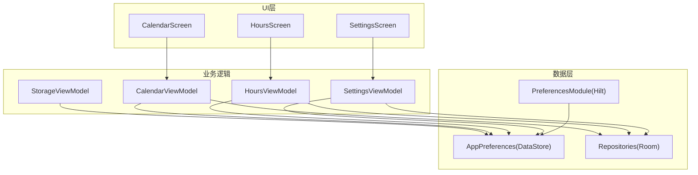
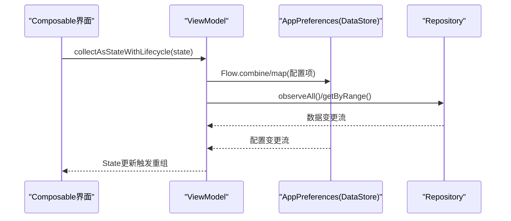
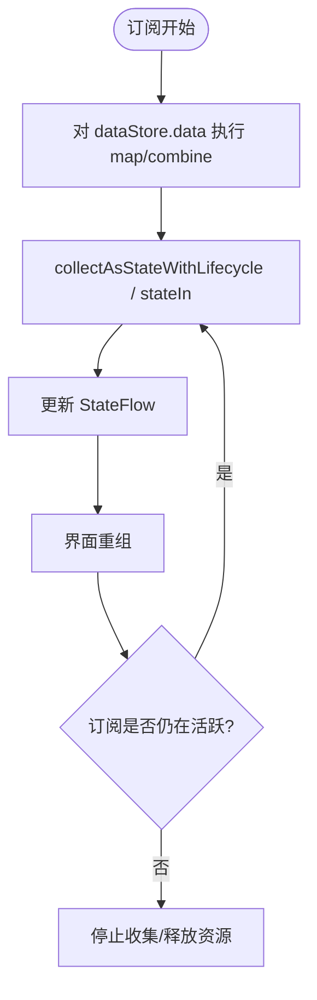
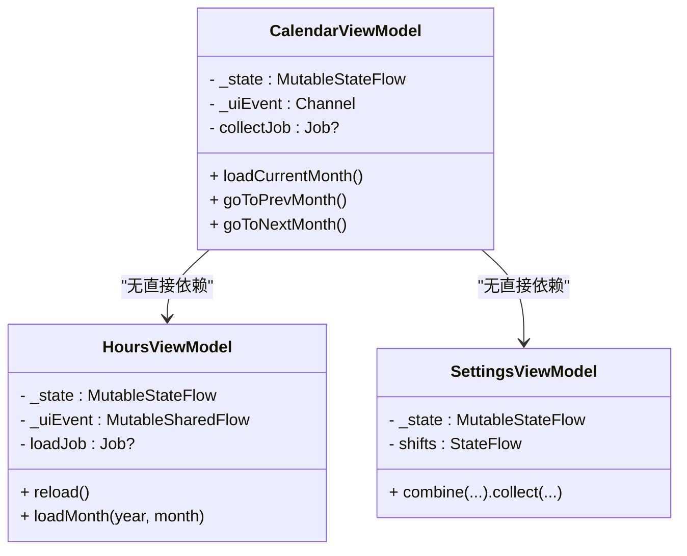
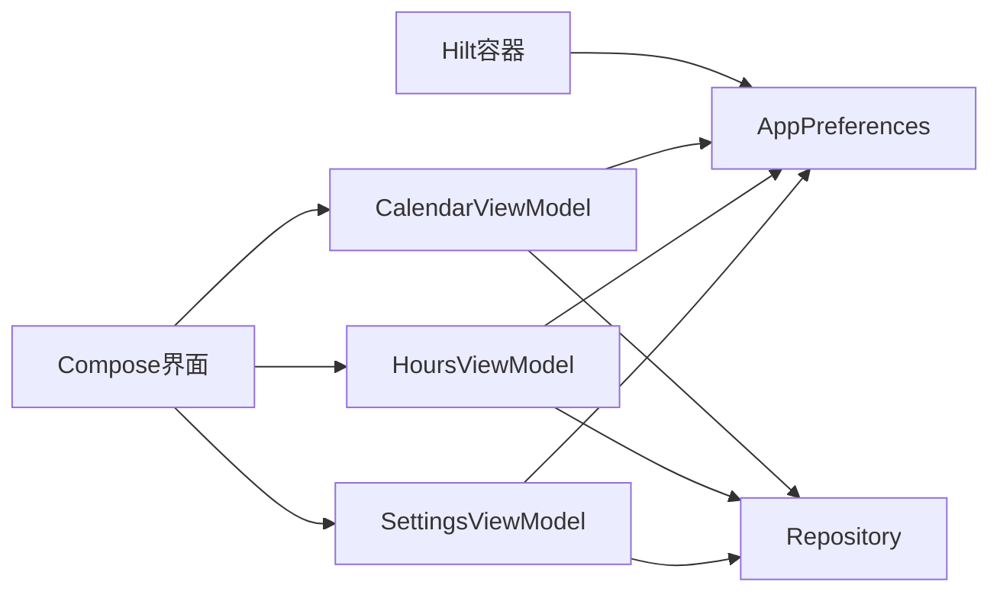

# 内存管理优化

<cite>
**本文引用的文件**   
- [AppPreferences.kt](file://app/src/main/java/com/schedulecalendar/app/data/prefs/AppPreferences.kt)
- [PreferencesModule.kt](file://app/src/main/java/com/schedulecalendar/app/di/PreferencesModule.kt)
- [CalendarViewModel.kt](file://app/src/main/java/com/schedulecalendar/app/ui/calendar/CalendarViewModel.kt)
- [HoursViewModel.kt](file://app/src/main/java/com/schedulecalendar/app/ui/hours/HoursViewModel.kt)
- [SettingsViewModel.kt](file://app/src/main/java/com/schedulecalendar/app/ui/settings/SettingsViewModel.kt)
- [StorageViewModel.kt](file://app/src/main/java/com/schedulecalendar/app/ui/settings/StorageViewModel.kt)
- [build.gradle.kts](file://app/build.gradle.kts)
</cite>

## 目录
1. [简介](#简介)
2. [项目结构](#项目结构)
3. [核心组件](#核心组件)
4. [架构总览](#架构总览)
5. [详细组件分析](#详细组件分析)
6. [依赖关系分析](#依赖关系分析)
7. [性能与内存考量](#性能与内存考量)
8. [故障排查指南](#故障排查指南)
9. [结论](#结论)
10. [附录](#附录)

## 简介
本文件面向Android排班日历应用的内存管理优化，聚焦以下方面：
- DataStore配置存储的内存使用模式、Flow流式数据的缓存策略与生命周期管理
- ViewModel状态管理优化：StateFlow的使用、一次性事件通道、Job取消与泄漏防护
- 图片资源管理与Bitmap缓存策略（通用建议）
- 内存泄漏检测工具集成与堆内存监控方法
- 垃圾回收优化建议与可观测性手段

## 项目结构
本项目采用分层架构：UI层（Compose Screen + ViewModel）、数据层（Repository + Room + DataStore）、依赖注入（Hilt）。内存相关的关键点集中在DataStore封装与ViewModel中。

**图表来源** 
- [CalendarViewModel.kt:118-151](file://app/src/main/java/com/schedulecalendar/app/ui/calendar/CalendarViewModel.kt#L118-L151)
- [HoursViewModel.kt:52-75](file://app/src/main/java/com/schedulecalendar/app/ui/hours/HoursViewModel.kt#L52-L75)
- [SettingsViewModel.kt:34-64](file://app/src/main/java/com/schedulecalendar/app/ui/settings/SettingsViewModel.kt#L34-L64)
- [StorageViewModel.kt:75-124](file://app/src/main/java/com/schedulecalendar/app/ui/settings/StorageViewModel.kt#L75-L124)
- [AppPreferences.kt:25-36](file://app/src/main/java/com/schedulecalendar/app/data/prefs/AppPreferences.kt#L25-L36)
- [PreferencesModule.kt:13-21](file://app/src/main/java/com/schedulecalendar/app/di/PreferencesModule.kt#L13-L21)

**章节来源**
- [CalendarViewModel.kt:118-151](file://app/src/main/java/com/schedulecalendar/app/ui/calendar/CalendarViewModel.kt#L118-L151)
- [HoursViewModel.kt:52-75](file://app/src/main/java/com/schedulecalendar/app/ui/hours/HoursViewModel.kt#L52-L75)
- [SettingsViewModel.kt:34-64](file://app/src/main/java/com/schedulecalendar/app/ui/settings/SettingsViewModel.kt#L34-L64)
- [StorageViewModel.kt:75-124](file://app/src/main/java/com/schedulecalendar/app/ui/settings/StorageViewModel.kt#L75-L124)
- [AppPreferences.kt:25-36](file://app/src/main/java/com/schedulecalendar/app/data/prefs/AppPreferences.kt#L25-L36)
- [PreferencesModule.kt:13-21](file://app/src/main/java/com/schedulecalendar/app/di/PreferencesModule.kt#L13-L21)

## 核心组件
- AppPreferences：基于DataStore的偏好配置读写，提供Flow流式接口与一次性快照读取
- PreferencesModule：Hilt模块，以Application Context提供单例AppPreferences
- CalendarViewModel：主日历页状态与数据收集，使用MutableStateFlow+Channel，Job控制协程生命周期
- HoursViewModel：工时页状态，使用MutableSharedFlow作为一次性事件，Job控制加载任务
- SettingsViewModel：设置页状态，combine多Flow并stateIn共享订阅
- StorageViewModel：备份与存储管理，扫描废弃数据、清理与持久化路径

**章节来源**
- [AppPreferences.kt:25-36](file://app/src/main/java/com/schedulecalendar/app/data/prefs/AppPreferences.kt#L25-L36)
- [PreferencesModule.kt:13-21](file://app/src/main/java/com/schedulecalendar/app/di/PreferencesModule.kt#L13-L21)
- [CalendarViewModel.kt:118-151](file://app/src/main/java/com/schedulecalendar/app/ui/calendar/CalendarViewModel.kt#L118-L151)
- [HoursViewModel.kt:52-75](file://app/src/main/java/com/schedulecalendar/app/ui/hours/HoursViewModel.kt#L52-L75)
- [SettingsViewModel.kt:34-64](file://app/src/main/java/com/schedulecalendar/app/ui/settings/SettingsViewModel.kt#L34-L64)
- [StorageViewModel.kt:75-124](file://app/src/main/java/com/schedulecalendar/app/ui/settings/StorageViewModel.kt#L75-L124)

## 架构总览
下图展示从UI到数据层的调用链路与内存关键点：ViewModel通过Flow订阅DataStore与Repository，使用stateIn或collectAsStateWithLifecycle确保订阅与生命周期对齐；DataStore在应用级单例下持有流式数据源，避免重复创建。

**图表来源** 
- [CalendarViewModel.kt:173-180](file://app/src/main/java/com/schedulecalendar/app/ui/calendar/CalendarViewModel.kt#L173-L180)
- [SettingsViewModel.kt:54-64](file://app/src/main/java/com/schedulecalendar/app/ui/settings/SettingsViewModel.kt#L54-L64)
- [AppPreferences.kt:69-71](file://app/src/main/java/com/schedulecalendar/app/data/prefs/AppPreferences.kt#L69-L71)

## 详细组件分析

### DataStore配置存储的内存使用模式与Flow缓存策略
- 单例与上下文绑定
  - AppPreferences以@Singleton暴露，通过Hilt注入ApplicationContext，避免Activity/Fragment引用导致泄漏
  - preferencesDataStore扩展函数在Context上懒加载，保证DataStore实例唯一且与应用生命周期一致
- Flow流式数据
  - 所有配置项均暴露为Flow，内部对dataStore.data进行map转换，仅在订阅时计算，避免无谓对象创建
  - 一次性快照读取使用data.first()，避免edit{}带来的额外开销与潜在竞争
- 组合与共享订阅
  - SettingsViewModel使用combine将多个Flow合并为单一StateFlow，减少重复订阅与中间对象
  - stateIn(viewModelScope, WhileSubscribed(5_000), emptyList())实现按需共享与超时停止，降低后台内存占用

**图表来源** 
- [AppPreferences.kt:69-71](file://app/src/main/java/com/schedulecalendar/app/data/prefs/AppPreferences.kt#L69-L71)
- [SettingsViewModel.kt:54-64](file://app/src/main/java/com/schedulecalendar/app/ui/settings/SettingsViewModel.kt#L54-L64)

**章节来源**
- [AppPreferences.kt:25-36](file://app/src/main/java/com/schedulecalendar/app/data/prefs/AppPreferences.kt#L25-L36)
- [AppPreferences.kt:69-71](file://app/src/main/java/com/schedulecalendar/app/data/prefs/AppPreferences.kt#L69-L71)
- [PreferencesModule.kt:13-21](file://app/src/main/java/com/schedulecalendar/app/di/PreferencesModule.kt#L13-L21)
- [SettingsViewModel.kt:54-64](file://app/src/main/java/com/schedulecalendar/app/ui/settings/SettingsViewModel.kt#L54-L64)

### ViewModel中的状态管理优化
- StateFlow与一次性事件
  - 所有ViewModel使用MutableStateFlow暴露不可变UI状态，asStateFlow对外只读
  - 一次性UI事件使用Channel.receiveAsFlow或MutableSharedFlow，避免状态污染与重复消费
- 协程Job与生命周期
  - CalendarViewModel维护collectJob，切月时先cancel再launch新Job，防止collector累积泄漏
  - HoursViewModel维护loadJob，每次reload前cancel旧任务，避免并发重复加载
- 共享订阅与延迟初始化
  - SettingsViewModel使用stateIn共享订阅，WhileSubscribed(5_000)在无人订阅后延迟停止，平衡响应性与内存
  - CalendarViewModel init中延迟非关键初始化（自动备份、本地日历ID），避免首帧阻塞

**图表来源** 
- [CalendarViewModel.kt:118-151](file://app/src/main/java/com/schedulecalendar/app/ui/calendar/CalendarViewModel.kt#L118-L151)
- [HoursViewModel.kt:52-75](file://app/src/main/java/com/schedulecalendar/app/ui/hours/HoursViewModel.kt#L52-L75)
- [SettingsViewModel.kt:34-64](file://app/src/main/java/com/schedulecalendar/app/ui/settings/SettingsViewModel.kt#L34-L64)

**章节来源**
- [CalendarViewModel.kt:118-151](file://app/src/main/java/com/schedulecalendar/app/ui/calendar/CalendarViewModel.kt#L118-L151)
- [HoursViewModel.kt:52-75](file://app/src/main/java/com/schedulecalendar/app/ui/hours/HoursViewModel.kt#L52-L75)
- [SettingsViewModel.kt:34-64](file://app/src/main/java/com/schedulecalendar/app/ui/settings/SettingsViewModel.kt#L34-L64)

### 图片资源管理与Bitmap缓存策略（通用建议）
- 使用Compose Image组件配合rememberImagePainter或Coil，避免手动Bitmap管理
- 大图加载遵循：
  - 按显示尺寸采样（inSampleSize）
  - 使用弱引用缓存（WeakReference）或LRU缓存限制容量
  - 在页面销毁时主动释放（onDispose）
- 避免在RecyclerView/LazyColumn中持有大对象引用，使用占位图与渐进加载

[本节为通用指导，不直接分析具体文件]

### 内存泄漏检测与堆内存监控
- LeakCanary集成
  - 在debug构建添加LeakCanary依赖，启动后自动检测常见泄漏（如未取消的协程、静态引用Context等）
  - 结合ViewModel与LiveData/Flow的最佳实践，定位泄漏根因
- 堆内存分析
  - 使用Android Studio Profiler的Memory视图，观察GC前后对象数量变化
  - 导出Heap Dump，分析大对象与引用链，识别未释放的集合或监听器
- 指标采集
  - 记录应用启动时间、首帧渲染时间、内存峰值，建立基线对比

[本节为通用指导，不直接分析具体文件]

### 垃圾回收优化建议
- 减少短期对象分配：复用字符串格式化结果、避免频繁创建临时集合
- 合理使用stateIn与collectAsStateWithLifecycle，避免长时间后台订阅
- 避免在高频回调中创建大对象，必要时使用对象池（如自定义颜色/图标对象）
- 及时关闭IO流与数据库游标，避免Native内存泄漏

[本节为通用指导，不直接分析具体文件]

## 依赖关系分析
- Hilt依赖注入确保AppPreferences为单例，避免重复创建
- ViewModel通过Repository访问Room数据，通过AppPreferences访问DataStore
- Compose界面通过collectAsStateWithLifecycle订阅StateFlow，生命周期自动对齐

**图表来源** 
- [PreferencesModule.kt:13-21](file://app/src/main/java/com/schedulecalendar/app/di/PreferencesModule.kt#L13-L21)
- [CalendarViewModel.kt:118-151](file://app/src/main/java/com/schedulecalendar/app/ui/calendar/CalendarViewModel.kt#L118-L151)
- [HoursViewModel.kt:52-75](file://app/src/main/java/com/schedulecalendar/app/ui/hours/HoursViewModel.kt#L52-L75)
- [SettingsViewModel.kt:34-64](file://app/src/main/java/com/schedulecalendar/app/ui/settings/SettingsViewModel.kt#L34-L64)

**章节来源**
- [PreferencesModule.kt:13-21](file://app/src/main/java/com/schedulecalendar/app/di/PreferencesModule.kt#L13-L21)
- [CalendarViewModel.kt:118-151](file://app/src/main/java/com/schedulecalendar/app/ui/calendar/CalendarViewModel.kt#L118-L151)
- [HoursViewModel.kt:52-75](file://app/src/main/java/com/schedulecalendar/app/ui/hours/HoursViewModel.kt#L52-L75)
- [SettingsViewModel.kt:34-64](file://app/src/main/java/com/schedulecalendar/app/ui/settings/SettingsViewModel.kt#L34-L64)

## 性能与内存考量
- DataStore Flow的map操作在订阅时才执行，避免预计算
- stateIn的WhileSubscribed策略在无人订阅后延迟停止，减少后台内存
- ViewModel中Job.cancel确保切换场景时及时释放协程资源
- 一次性事件使用Channel/MutableSharedFlow，避免状态膨胀

**章节来源**
- [AppPreferences.kt:69-71](file://app/src/main/java/com/schedulecalendar/app/data/prefs/AppPreferences.kt#L69-L71)
- [SettingsViewModel.kt:54-64](file://app/src/main/java/com/schedulecalendar/app/ui/settings/SettingsViewModel.kt#L54-L64)
- [CalendarViewModel.kt:153-155](file://app/src/main/java/com/schedulecalendar/app/ui/calendar/CalendarViewModel.kt#L153-L155)
- [HoursViewModel.kt:84-86](file://app/src/main/java/com/schedulecalendar/app/ui/hours/HoursViewModel.kt#L84-L86)

## 故障排查指南
- 内存泄漏排查
  - 启用LeakCanary，观察泄漏报告，重点关注未取消的协程与静态引用
  - 检查ViewModel中是否有长生命周期引用（如全局单例、静态变量）
- 堆内存分析
  - 使用Profiler抓取Heap Dump，分析大对象与引用链
  - 关注DataStore与Repository的订阅是否被正确取消
- 常见问题
  - Flow订阅过多导致内存增长：使用stateIn共享订阅
  - 协程未取消导致泄漏：确保在ViewModel.onCleared或Job.cancel中清理

**章节来源**
- [CalendarViewModel.kt:153-155](file://app/src/main/java/com/schedulecalendar/app/ui/calendar/CalendarViewModel.kt#L153-L155)
- [HoursViewModel.kt:84-86](file://app/src/main/java/com/schedulecalendar/app/ui/hours/HoursViewModel.kt#L84-L86)

## 结论
本项目在DataStore与ViewModel层面已实现较完善的内存管理：
- DataStore通过单例与Flow流式数据，避免重复创建与无效计算
- ViewModel使用StateFlow、Channel/MutableSharedFlow与Job控制，确保状态与生命周期对齐
- 建议进一步引入LeakCanary与堆内存分析，持续优化内存使用

[本节为总结，不直接分析具体文件]

## 附录
- 构建配置
  - debug构建启用调试选项，release构建启用混淆与资源压缩
  - KSP用于Room与Hilt编译期生成，提升构建效率

**章节来源**
- [build.gradle.kts:31-41](file://app/build.gradle.kts#L31-L41)