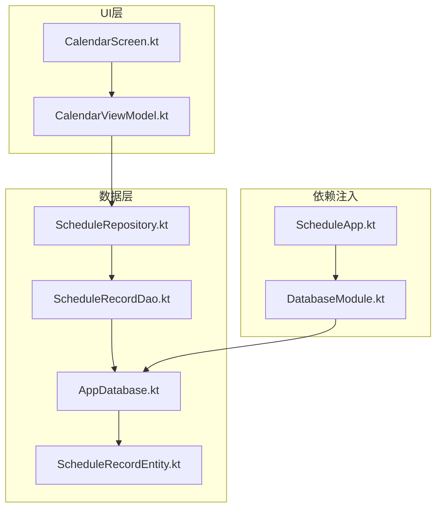
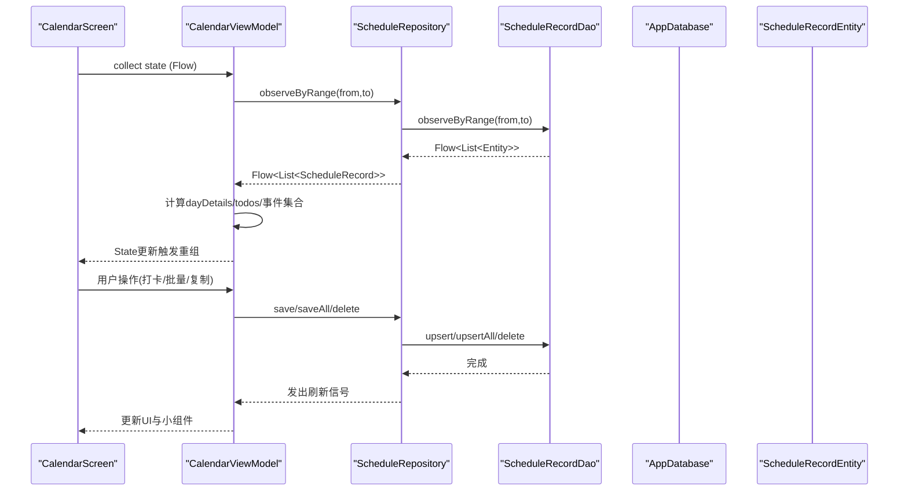
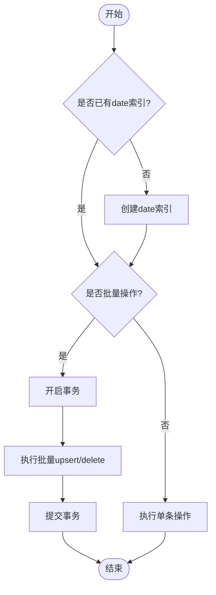
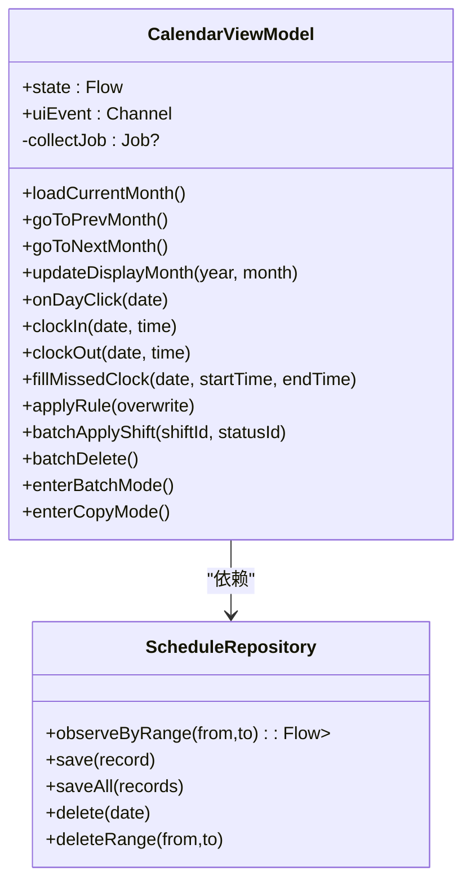
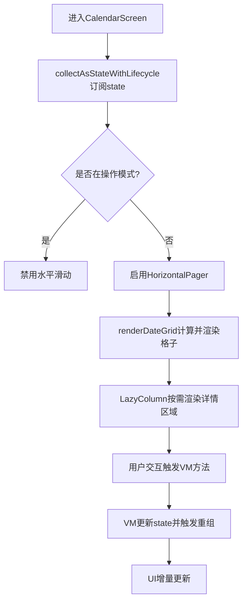
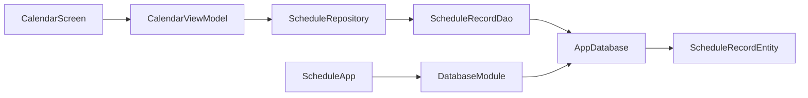

# 性能优化

<cite>
**本文引用的文件**   
- [app/build.gradle.kts](file://app/build.gradle.kts)
- [build.gradle.kts](file://build.gradle.kts)
- [gradle.properties](file://gradle.properties)
- [app/proguard-rules.pro](file://app/proguard-rules.pro)
- [app/src/main/java/com/schedulecalendar/app/ScheduleApp.kt](file://app/src/main/java/com/schedulecalendar/app/ScheduleApp.kt)
- [app/src/main/java/com/schedulecalendar/app/data/db/AppDatabase.kt](file://app/src/main/java/com/schedulecalendar/app/data/db/AppDatabase.kt)
- [app/src/main/java/com/schedulecalendar/app/di/DatabaseModule.kt](file://app/src/main/java/com/schedulecalendar/app/di/DatabaseModule.kt)
- [app/src/main/java/com/schedulecalendar/app/data/db/dao/ScheduleRecordDao.kt](file://app/src/main/java/com/schedulecalendar/app/data/db/dao/ScheduleRecordDao.kt)
- [app/src/main/java/com/schedulecalendar/app/data/db/entity/ScheduleRecordEntity.kt](file://app/src/main/java/com/schedulecalendar/app/data/db/entity/ScheduleRecordEntity.kt)
- [app/src/main/java/com/schedulecalendar/app/data/repository/ScheduleRepository.kt](file://app/src/main/java/com/schedulecalendar/app/data/repository/ScheduleRepository.kt)
- [app/src/main/java/com/schedulecalendar/app/ui/calendar/CalendarViewModel.kt](file://app/src/main/java/com/schedulecalendar/app/ui/calendar/CalendarViewModel.kt)
- [app/src/main/java/com/schedulecalendar/app/ui/calendar/CalendarScreen.kt](file://app/src/main/java/com/schedulecalendar/app/ui/calendar/CalendarScreen.kt)
</cite>

## 目录
1. [简介](#简介)
2. [项目结构](#项目结构)
3. [核心组件](#核心组件)
4. [架构总览](#架构总览)
5. [详细组件分析](#详细组件分析)
6. [依赖关系分析](#依赖关系分析)
7. [性能考量](#性能考量)
8. [故障排查指南](#故障排查指南)
9. [结论](#结论)
10. [附录](#附录)

## 简介
本文件面向Android排班日历应用的性能优化，围绕内存管理、数据库查询优化、UI渲染优化、电池使用优化、代码混淆与打包优化、性能监控与分析工具、以及热修复与动态更新等主题进行系统化说明。文档结合仓库中的实际实现（Room、Hilt、Compose、Coroutines、DataStore、Glance小组件等）给出可落地的优化建议与最佳实践，帮助开发者在保持功能完整性的同时提升应用流畅度、降低内存占用与功耗。

## 项目结构
本项目采用分层架构：
- UI层：基于Jetpack Compose的页面与状态展示（如CalendarScreen）。
- ViewModel层：业务编排与状态管理（如CalendarViewModel），通过Flow与协程驱动数据流。
- 数据层：Repository封装DAO访问，Room负责持久化，DataStore存储偏好设置。
- 依赖注入：Hilt提供单例数据库与DAO实例。
- 构建与打包：Gradle配置启用R8/资源压缩、KSP编译Room/Hilt、导出Schema用于迁移追踪。

**图表来源** 
- [app/src/main/java/com/schedulecalendar/app/ui/calendar/CalendarScreen.kt](file://app/src/main/java/com/schedulecalendar/app/ui/calendar/CalendarScreen.kt)
- [app/src/main/java/com/schedulecalendar/app/ui/calendar/CalendarViewModel.kt](file://app/src/main/java/com/schedulecalendar/app/ui/calendar/CalendarViewModel.kt)
- [app/src/main/java/com/schedulecalendar/app/data/repository/ScheduleRepository.kt](file://app/src/main/java/com/schedulecalendar/app/data/repository/ScheduleRepository.kt)
- [app/src/main/java/com/schedulecalendar/app/data/db/dao/ScheduleRecordDao.kt](file://app/src/main/java/com/schedulecalendar/app/data/db/dao/ScheduleRecordDao.kt)
- [app/src/main/java/com/schedulecalendar/app/data/db/AppDatabase.kt](file://app/src/main/java/com/schedulecalendar/app/data/db/AppDatabase.kt)
- [app/src/main/java/com/schedulecalendar/app/data/db/entity/ScheduleRecordEntity.kt](file://app/src/main/java/com/schedulecalendar/app/data/db/entity/ScheduleRecordEntity.kt)
- [app/src/main/java/com/schedulecalendar/app/di/DatabaseModule.kt](file://app/src/main/java/com/schedulecalendar/app/di/DatabaseModule.kt)
- [app/src/main/java/com/schedulecalendar/app/ScheduleApp.kt](file://app/src/main/java/com/schedulecalendar/app/ScheduleApp.kt)

**章节来源**
- [app/build.gradle.kts](file://app/build.gradle.kts)
- [build.gradle.kts](file://build.gradle.kts)
- [gradle.properties](file://gradle.properties)

## 核心组件
- Room数据库与DAO：定义实体表与查询接口，支持Flow响应式观察与批量操作。
- Repository：聚合DAO调用，暴露Flow与suspend方法，统一数据转换与变更通知。
- ViewModel：组合多源数据（班次、排班记录、显示方案、规则、偏好），计算当月详情与待办事项，协调UI事件与小组件同步。
- Compose UI：使用LazyColumn与HorizontalPager实现日历网格与月份滑动，配合collectAsStateWithLifecycle订阅状态。
- Hilt依赖注入：提供Application级数据库单例与DAO实例，避免重复创建开销。

**章节来源**
- [app/src/main/java/com/schedulecalendar/app/data/db/AppDatabase.kt](file://app/src/main/java/com/schedulecalendar/app/data/db/AppDatabase.kt)
- [app/src/main/java/com/schedulecalendar/app/data/db/dao/ScheduleRecordDao.kt](file://app/src/main/java/com/schedulecalendar/app/data/db/dao/ScheduleRecordDao.kt)
- [app/src/main/java/com/schedulecalendar/app/data/repository/ScheduleRepository.kt](file://app/src/main/java/com/schedulecalendar/app/data/repository/ScheduleRepository.kt)
- [app/src/main/java/com/schedulecalendar/app/ui/calendar/CalendarViewModel.kt](file://app/src/main/java/com/schedulecalendar/app/ui/calendar/CalendarViewModel.kt)
- [app/src/main/java/com/schedulecalendar/app/ui/calendar/CalendarScreen.kt](file://app/src/main/java/com/schedulecalendar/app/ui/calendar/CalendarScreen.kt)
- [app/src/main/java/com/schedulecalendar/app/di/DatabaseModule.kt](file://app/src/main/java/com/schedulecalendar/app/di/DatabaseModule.kt)

## 架构总览
下图展示了从UI到数据层的调用链与数据流向，强调Flow驱动的响应式更新与ViewModel对多源数据的整合。

**图表来源** 
- [app/src/main/java/com/schedulecalendar/app/ui/calendar/CalendarScreen.kt](file://app/src/main/java/com/schedulecalendar/app/ui/calendar/CalendarScreen.kt)
- [app/src/main/java/com/schedulecalendar/app/ui/calendar/CalendarViewModel.kt](file://app/src/main/java/com/schedulecalendar/app/ui/calendar/CalendarViewModel.kt)
- [app/src/main/java/com/schedulecalendar/app/data/repository/ScheduleRepository.kt](file://app/src/main/java/com/schedulecalendar/app/data/repository/ScheduleRepository.kt)
- [app/src/main/java/com/schedulecalendar/app/data/db/dao/ScheduleRecordDao.kt](file://app/src/main/java/com/schedulecalendar/app/data/db/dao/ScheduleRecordDao.kt)
- [app/src/main/java/com/schedulecalendar/app/data/db/AppDatabase.kt](file://app/src/main/java/com/schedulecalendar/app/data/db/AppDatabase.kt)
- [app/src/main/java/com/schedulecalendar/app/data/db/entity/ScheduleRecordEntity.kt](file://app/src/main/java/com/schedulecalendar/app/data/db/entity/ScheduleRecordEntity.kt)

## 详细组件分析

### 数据库与DAO优化
- 索引设计：当前查询主要基于date字段前缀匹配与范围比较，建议在schedule_records.date上建立B-Tree索引以加速LIKE与范围查询；若频繁按shiftId或日期+状态过滤，可增加复合索引。
- 批量操作：Repository已提供upsertAll与deleteByRange，建议在批量写入时尽量合并为单次事务，减少磁盘IO与锁竞争。
- 事务管理：Room默认将每个@Insert/@Query包装为独立事务，批量操作应显式使用@Transaction注解确保原子性，避免部分成功导致的数据不一致。
- Schema导出：启用exportSchema便于版本迁移追踪，结合ksp.room.schemaLocation输出JSON，利于CI校验与回滚。

**图表来源** 
- [app/src/main/java/com/schedulecalendar/app/data/db/dao/ScheduleRecordDao.kt](file://app/src/main/java/com/schedulecalendar/app/data/db/dao/ScheduleRecordDao.kt)
- [app/src/main/java/com/schedulecalendar/app/data/repository/ScheduleRepository.kt](file://app/src/main/java/com/schedulecalendar/app/data/repository/ScheduleRepository.kt)

**章节来源**
- [app/src/main/java/com/schedulecalendar/app/data/db/dao/ScheduleRecordDao.kt](file://app/src/main/java/com/schedulecalendar/app/data/db/dao/ScheduleRecordDao.kt)
- [app/src/main/java/com/schedulecalendar/app/data/repository/ScheduleRepository.kt](file://app/src/main/java/com/schedulecalendar/app/data/repository/ScheduleRepository.kt)
- [app/src/main/java/com/schedulecalendar/app/data/db/AppDatabase.kt](file://app/src/main/java/com/schedulecalendar/app/data/db/AppDatabase.kt)

### ViewModel与数据流优化
- 状态收集与生命周期：使用collectAsStateWithLifecycle确保仅在可见时收集，避免后台CPU与内存消耗。
- 月份切换与Job管理：每次切换月份取消旧collectJob再启动新协程，防止collector累积泄漏。
- 多源数据合并：combine聚合班次、排班记录、显示方案与规则，减少多次UI重组；计算相邻月份详情支持平滑滑动。
- 事件与消息通道：Channel缓冲UI事件，避免阻塞主线程；延迟非关键初始化（备份、本地日历ID）避免首帧卡顿。

**图表来源** 
- [app/src/main/java/com/schedulecalendar/app/ui/calendar/CalendarViewModel.kt](file://app/src/main/java/com/schedulecalendar/app/ui/calendar/CalendarViewModel.kt)
- [app/src/main/java/com/schedulecalendar/app/data/repository/ScheduleRepository.kt](file://app/src/main/java/com/schedulecalendar/app/data/repository/ScheduleRepository.kt)

**章节来源**
- [app/src/main/java/com/schedulecalendar/app/ui/calendar/CalendarViewModel.kt](file://app/src/main/java/com/schedulecalendar/app/ui/calendar/CalendarViewModel.kt)
- [app/src/main/java/com/schedulecalendar/app/data/repository/ScheduleRepository.kt](file://app/src/main/java/com/schedulecalendar/app/data/repository/ScheduleRepository.kt)

### Compose UI渲染优化
- 懒加载与虚拟化：使用LazyColumn与items按需渲染单元格，避免一次性构建全部行；HorizontalPager实现月份滑动且仅渲染可见页。
- 重组优化：将状态提升到必要层级，使用remember缓存派生数据（如shiftMap）；避免在高频重组中执行昂贵计算。
- 动画与高度插值：根据行数动态插值高度，保证滑动过程平滑无抖动。
- 无障碍与交互：为DayCell提供语义描述与点击/长按处理，提升可访问性与用户体验。

**图表来源** 
- [app/src/main/java/com/schedulecalendar/app/ui/calendar/CalendarScreen.kt](file://app/src/main/java/com/schedulecalendar/app/ui/calendar/CalendarScreen.kt)
- [app/src/main/java/com/schedulecalendar/app/ui/calendar/CalendarViewModel.kt](file://app/src/main/java/com/schedulecalendar/app/ui/calendar/CalendarViewModel.kt)

**章节来源**
- [app/src/main/java/com/schedulecalendar/app/ui/calendar/CalendarScreen.kt](file://app/src/main/java/com/schedulecalendar/app/ui/calendar/CalendarScreen.kt)

### 内存管理与对象池
- 单例与依赖注入：Hilt提供Application级数据库与DAO单例，避免重复创建；Repository与ViewModel作用域合理划分，防止长生命周期对象持有短生命周期引用。
- Flow与协程：使用MutableSharedFlow与asSharedFlow发布写操作信号，限制缓冲区容量避免堆积；collectJob在切月时取消，防止泄漏。
- 对象复用：在UI层使用remember缓存派生数据（如shiftMap），减少重复计算与对象分配。
- 内存泄漏防护：避免在Composable中捕获Activity/Context强引用；使用DisposableEffect清理回调；确保所有协程在ViewModel销毁时取消。

**章节来源**
- [app/src/main/java/com/schedulecalendar/app/di/DatabaseModule.kt](file://app/src/main/java/com/schedulecalendar/app/di/DatabaseModule.kt)
- [app/src/main/java/com/schedulecalendar/app/ui/calendar/CalendarViewModel.kt](file://app/src/main/java/com/schedulecalendar/app/ui/calendar/CalendarViewModel.kt)
- [app/src/main/java/com/schedulecalendar/app/ui/calendar/CalendarScreen.kt](file://app/src/main/java/com/schedulecalendar/app/ui/calendar/CalendarScreen.kt)

### 电池使用优化
- 后台任务调度：使用协程与延迟初始化（备份、本地日历ID）避免启动阻塞；如需定时任务，建议使用WorkManager而非AlarmManager以减少唤醒次数。
- 网络请求优化：若集成日历同步，应合并请求、使用ETag/If-None-Match、限制频率与重试策略；优先在WiFi下同步大体积数据。
- 屏幕与CPU：减少不必要的重组与动画；在非前台时暂停非关键计算；合理使用Doze模式与App Standby。

[本节为通用指导，不直接分析具体文件]

### 代码混淆与打包优化
- R8/资源压缩：release构建启用minifyEnabled与shrinkResources，减少APK体积。
- ProGuard规则：保留Hilt注解、Room数据库类、Gson序列化模型、Glance Widget组件、Navigation路由对象与kotlinx-serialization注解，防止裁剪导致运行时异常。
- KSP编译：启用room.incremental与schema导出，提升编译速度与迁移可追溯性。
- Gradle优化：配置JVM参数与并行GC，启用配置缓存与构建缓存，缩短构建时间。

**章节来源**
- [app/build.gradle.kts](file://app/build.gradle.kts)
- [app/proguard-rules.pro](file://app/proguard-rules.pro)
- [gradle.properties](file://gradle.properties)

### 性能监控与分析工具
- Android Studio Profiler：监控CPU、内存、网络与电量，定位卡顿与内存峰值。
- LeakCanary：检测内存泄漏，结合日志定位未释放的引用。
- Database Inspector：查看Room查询与索引使用情况，验证SQL性能。
- Jetpack Compose Compiler Metrics：分析重组热点，优化状态提升与remember使用。
- Battery Historian：分析后台唤醒与网络活动，优化任务调度。

[本节为通用指导，不直接分析具体文件]

### 热修复与动态更新
- 动态模块与Feature Split：将非核心功能拆分为动态模块，按需下载更新，减少主包体积与升级成本。
- 插件化框架：如Tinker、Sophix等可实现类级别热修复，但需注意兼容性与稳定性测试。
- 灰度发布与A/B测试：结合后端配置控制功能开关，逐步放量验证效果。

[本节为通用指导，不直接分析具体文件]

## 依赖关系分析
- 组件耦合：UI层依赖ViewModel，ViewModel依赖Repository，Repository依赖DAO与Entity；Hilt提供单例解耦。
- 外部依赖：Room、Hilt、Compose、Coroutines、DataStore、Glance等库的版本由libs.versions.toml统一管理，避免冲突。
- 潜在循环依赖：当前结构清晰，未发现循环导入；需警惕在Repository中引入UI相关类型。

**图表来源** 
- [app/src/main/java/com/schedulecalendar/app/ui/calendar/CalendarScreen.kt](file://app/src/main/java/com/schedulecalendar/app/ui/calendar/CalendarScreen.kt)
- [app/src/main/java/com/schedulecalendar/app/ui/calendar/CalendarViewModel.kt](file://app/src/main/java/com/schedulecalendar/app/ui/calendar/CalendarViewModel.kt)
- [app/src/main/java/com/schedulecalendar/app/data/repository/ScheduleRepository.kt](file://app/src/main/java/com/schedulecalendar/app/data/repository/ScheduleRepository.kt)
- [app/src/main/java/com/schedulecalendar/app/data/db/dao/ScheduleRecordDao.kt](file://app/src/main/java/com/schedulecalendar/app/data/db/dao/ScheduleRecordDao.kt)
- [app/src/main/java/com/schedulecalendar/app/data/db/AppDatabase.kt](file://app/src/main/java/com/schedulecalendar/app/data/db/AppDatabase.kt)
- [app/src/main/java/com/schedulecalendar/app/data/db/entity/ScheduleRecordEntity.kt](file://app/src/main/java/com/schedulecalendar/app/data/db/entity/ScheduleRecordEntity.kt)
- [app/src/main/java/com/schedulecalendar/app/di/DatabaseModule.kt](file://app/src/main/java/com/schedulecalendar/app/di/DatabaseModule.kt)
- [app/src/main/java/com/schedulecalendar/app/ScheduleApp.kt](file://app/src/main/java/com/schedulecalendar/app/ScheduleApp.kt)

**章节来源**
- [app/build.gradle.kts](file://app/build.gradle.kts)
- [build.gradle.kts](file://build.gradle.kts)

## 性能考量
- 内存：使用单例与依赖注入减少对象创建；Flow与协程合理管理生命周期；避免在UI层持有长生命周期引用。
- 数据库：建立合适索引；批量操作使用事务；避免在主线程执行耗时查询。
- UI：使用Lazy列表与remember优化重组；减少不必要的动画与绘制；按需加载数据。
- 电池：合并网络请求；使用后台任务调度器；避免频繁唤醒CPU。
- 构建：启用R8与资源压缩；使用KSP与增量编译；配置Gradle缓存与并行构建。

[本节为通用指导，不直接分析具体文件]

## 故障排查指南
- 内存泄漏：使用LeakCanary定位未释放引用；检查Composable中是否捕获Activity/Context；确保协程在ViewModel销毁时取消。
- 数据库性能：使用Database Inspector分析慢查询；检查索引是否命中；批量操作是否使用事务。
- UI卡顿：使用Profiler分析CPU与GPU；检查重组热点；优化复杂计算与绘制。
- 崩溃与异常：检查ProGuard规则是否误删必要类；验证Room迁移脚本；确认Hilt依赖是否正确注入。

**章节来源**
- [app/proguard-rules.pro](file://app/proguard-rules.pro)
- [app/src/main/java/com/schedulecalendar/app/data/db/AppDatabase.kt](file://app/src/main/java/com/schedulecalendar/app/data/db/AppDatabase.kt)
- [app/src/main/java/com/schedulecalendar/app/di/DatabaseModule.kt](file://app/src/main/java/com/schedulecalendar/app/di/DatabaseModule.kt)

## 结论
通过合理的内存管理、数据库优化、UI渲染优化与电池使用优化，结合代码混淆与打包优化，以及完善的性能监控与故障排查流程，可以显著提升排班日历应用的流畅度、稳定性与能效。建议持续使用Profiler与LeakCanary等工具进行性能回归测试，确保新版本不会引入性能退化。

[本节为总结，不直接分析具体文件]

## 附录
- 推荐工具清单：Android Studio Profiler、LeakCanary、Database Inspector、Compose Compiler Metrics、Battery Historian。
- 最佳实践清单：单例与依赖注入、Flow与协程生命周期管理、Lazy列表与remember、索引与事务、R8与资源压缩、Gradle缓存与并行构建。

[本节为补充信息，不直接分析具体文件]