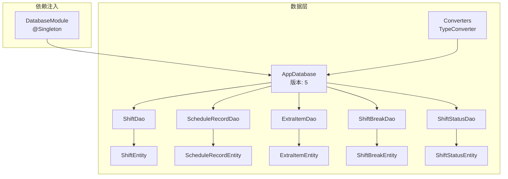
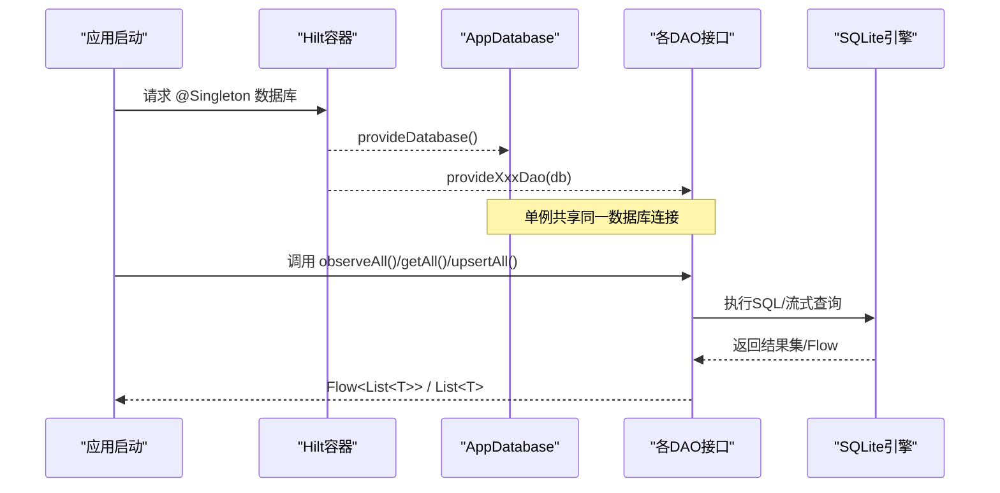
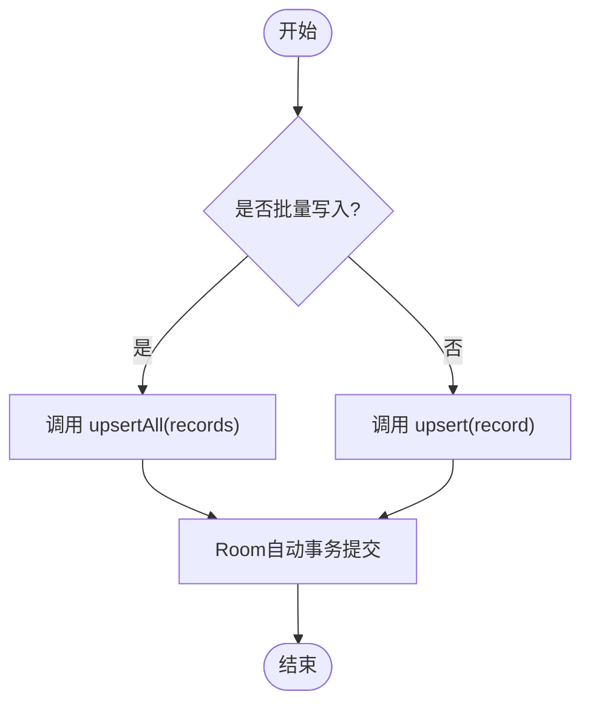
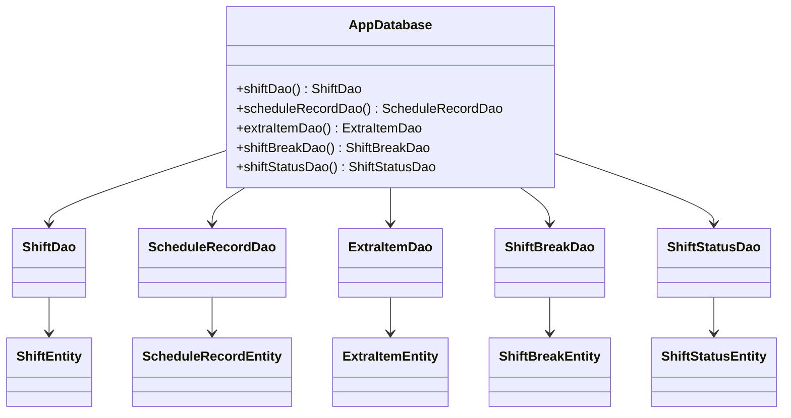

# 数据库查询优化

<cite>
**本文引用的文件**   
- [AppDatabase.kt](file://app/src/main/java/com/schedulecalendar/app/data/db/AppDatabase.kt)
- [DatabaseModule.kt](file://app/src/main/java/com/schedulecalendar/app/di/DatabaseModule.kt)
- [Converters.kt](file://app/src/main/java/com/schedulecalendar/app/data/db/Converters.kt)
- [ScheduleRecordDao.kt](file://app/src/main/java/com/schedulecalendar/app/data/db/dao/ScheduleRecordDao.kt)
- [ShiftDao.kt](file://app/src/main/java/com/schedulecalendar/app/data/db/dao/ShiftDao.kt)
- [ExtraItemDao.kt](file://app/src/main/java/com/schedulecalendar/app/data/db/dao/ExtraItemDao.kt)
- [ShiftBreakDao.kt](file://app/src/main/java/com/schedulecalendar/app/data/db/dao/ShiftBreakDao.kt)
- [ShiftStatusDao.kt](file://app/src/main/java/com/schedulecalendar/app/data/db/dao/ShiftStatusDao.kt)
- [ScheduleRecordEntity.kt](file://app/src/main/java/com/schedulecalendar/app/data/db/entity/ScheduleRecordEntity.kt)
- [ShiftEntity.kt](file://app/src/main/java/com/schedulecalendar/app/data/db/entity/ShiftEntity.kt)
- [ExtraItemEntity.kt](file://app/src/main/java/com/schedulecalendar/app/data/db/entity/ExtraItemEntity.kt)
- [ShiftBreakEntity.kt](file://app/src/main/java/com/schedulecalendar/app/data/db/entity/ShiftBreakEntity.kt)
- [ShiftStatusEntity.kt](file://app/src/main/java/com/schedulecalendar/app/data/db/entity/ShiftStatusEntity.kt)
- [5.json](file://app/schemas/com.schedulecalendar.app.data.db.AppDatabase/5.json)
</cite>

## 目录
1. [简介](#简介)
2. [项目结构](#项目结构)
3. [核心组件](#核心组件)
4. [架构总览](#架构总览)
5. [详细组件分析](#详细组件分析)
6. [依赖关系分析](#依赖关系分析)
7. [性能考虑](#性能考虑)
8. [故障排查指南](#故障排查指南)
9. [结论](#结论)
10. [附录](#附录)

## 简介
本文件面向Android排班日历应用的Room数据库层，聚焦查询与写入性能优化。内容涵盖索引设计策略（复合索引、覆盖索引）、批量操作与事务管理、慢查询分析与调优、连接池与并发访问配置、备份恢复与数据迁移的性能考量。文档以仓库现有代码为依据，给出可落地的优化建议与图示说明。

## 项目结构
应用采用典型的分层结构：UI/ViewModel → Repository → DAO → Room实体与数据库定义。数据库通过Hilt提供单例实例，DAO暴露Flow与suspend方法，实体使用JSON字段承载复杂结构。

图表来源 
- [AppDatabase.kt:17-34](file://app/src/main/java/com/schedulecalendar/app/data/db/AppDatabase.kt#L17-L34)
- [DatabaseModule.kt:23-34](file://app/src/main/java/com/schedulecalendar/app/di/DatabaseModule.kt#L23-L34)
- [Converters.kt:9-16](file://app/src/main/java/com/schedulecalendar/app/data/db/Converters.kt#L9-L16)

章节来源
- [AppDatabase.kt:17-34](file://app/src/main/java/com/schedulecalendar/app/data/db/AppDatabase.kt#L17-L34)
- [DatabaseModule.kt:23-34](file://app/src/main/java/com/schedulecalendar/app/di/DatabaseModule.kt#L23-L34)
- [5.json:1-307](file://app/schemas/com.schedulecalendar.app.data.db.AppDatabase/5.json#L1-L307)

## 核心组件
- 数据库入口与版本控制：AppDatabase声明实体集合与版本号，并导出schema用于迁移追踪。
- 依赖注入：DatabaseModule提供单例数据库与各DAO，便于全局复用连接。
- 类型转换：Converters将List<String>等复杂类型与JSON字符串互转，减少额外表关联。
- DAO接口：各DAO封装CRUD与Flow流式查询，统一命名与行为。
- 实体模型：各Entity定义表结构与字段语义，部分字段使用JSON存储扩展信息。

章节来源
- [AppDatabase.kt:17-34](file://app/src/main/java/com/schedulecalendar/app/data/db/AppDatabase.kt#L17-L34)
- [DatabaseModule.kt:23-34](file://app/src/main/java/com/schedulecalendar/app/di/DatabaseModule.kt#L23-L34)
- [Converters.kt:9-16](file://app/src/main/java/com/schedulecalendar/app/data/db/Converters.kt#L9-L16)
- [ScheduleRecordDao.kt:8-39](file://app/src/main/java/com/schedulecalendar/app/data/db/dao/ScheduleRecordDao.kt#L8-L39)
- [ShiftDao.kt:8-41](file://app/src/main/java/com/schedulecalendar/app/data/db/dao/ShiftDao.kt#L8-L41)
- [ExtraItemDao.kt:8-40](file://app/src/main/java/com/schedulecalendar/app/data/db/dao/ExtraItemDao.kt#L8-L40)
- [ShiftBreakDao.kt:8-38](file://app/src/main/java/com/schedulecalendar/app/data/db/dao/ShiftBreakDao.kt#L8-L38)
- [ShiftStatusDao.kt:8-38](file://app/src/main/java/com/schedulecalendar/app/data/db/dao/ShiftStatusDao.kt#L8-L38)
- [ScheduleRecordEntity.kt:8-25](file://app/src/main/java/com/schedulecalendar/app/data/db/entity/ScheduleRecordEntity.kt#L8-L25)
- [ShiftEntity.kt:8-23](file://app/src/main/java/com/schedulecalendar/app/data/db/entity/ShiftEntity.kt#L8-L23)
- [ExtraItemEntity.kt:8-15](file://app/src/main/java/com/schedulecalendar/app/data/db/entity/ExtraItemEntity.kt#L8-L15)
- [ShiftBreakEntity.kt:8-15](file://app/src/main/java/com/schedulecalendar/app/data/db/entity/ShiftBreakEntity.kt#L8-L15)
- [ShiftStatusEntity.kt:8-18](file://app/src/main/java/com/schedulecalendar/app/data/db/entity/ShiftStatusEntity.kt#L8-L18)

## 架构总览
下图展示从依赖注入到数据库访问的调用链，以及DAO与实体的对应关系。

图表来源 
- [DatabaseModule.kt:23-34](file://app/src/main/java/com/schedulecalendar/app/di/DatabaseModule.kt#L23-L34)
- [AppDatabase.kt:28-34](file://app/src/main/java/com/schedulecalendar/app/data/db/AppDatabase.kt#L28-L34)

## 详细组件分析

### 索引设计与覆盖索引策略
当前Schema未显式创建索引，主要依赖主键与默认排序。针对高频查询，建议如下：

- schedule_records 表
  - 按月份范围查询：WHERE date LIKE :yearMonth || '%' ORDER BY date ASC
    - 建议：为 date 列建立升序索引；若仅按前缀匹配，可使用前缀索引或生成列+索引优化LIKE前缀扫描。
  - 按日期精确查询：WHERE date = :date
    - 已有主键索引，无需额外索引。
  - 覆盖索引场景：当查询只读取少量列（如 date, type, shiftId）时，可构建包含这些列的覆盖索引以减少回表。

- shifts 表
  - 活跃过滤：WHERE archivedAt IS NULL ORDER BY name ASC
    - 建议：为 (archivedAt, name) 建立复合索引，先过滤归档状态再排序。
  - 全量排序：ORDER BY name ASC
    - 若频繁按name排序且无过滤条件，可单独对 name 建索引。

- extra_items、shift_breaks、shift_statuses 表
  - 活跃过滤：WHERE archivedAt IS NULL ORDER BY ... 
    - 建议：为 (archivedAt, 排序列) 建立复合索引，提升过滤+排序效率。
  - 名称搜索：如需模糊搜索name，建议使用全文索引或FTS表。

- JSON字段
  - extraItemIdsJson、appliedStatusesJson、linkedExtraIdsJson 等使用JSON存储，无法直接走B-Tree索引。若需基于JSON内字段筛选，建议引入生成列+索引或使用FTS/虚拟表。

章节来源
- [5.json:77-159](file://app/schemas/com.schedulecalendar.app.data.db.AppDatabase/5.json#L77-L159)
- [5.json:8-74](file://app/schemas/com.schedulecalendar.app.data.db.AppDatabase/5.json#L8-L74)
- [5.json:162-200](file://app/schemas/com.schedulecalendar.app.data.db.AppDatabase/5.json#L162-L200)
- [5.json:203-241](file://app/schemas/com.schedulecalendar.app.data.db.AppDatabase/5.json#L203-L241)
- [5.json:244-299](file://app/schemas/com.schedulecalendar.app.data.db.AppDatabase/5.json#L244-L299)
- [ScheduleRecordDao.kt:10-20](file://app/src/main/java/com/schedulecalendar/app/data/db/dao/ScheduleRecordDao.kt#L10-L20)
- [ShiftDao.kt:11-18](file://app/src/main/java/com/schedulecalendar/app/data/db/dao/ShiftDao.kt#L11-L18)
- [ExtraItemDao.kt:11-23](file://app/src/main/java/com/schedulecalendar/app/data/db/dao/ExtraItemDao.kt#L11-L23)
- [ShiftBreakDao.kt:11-21](file://app/src/main/java/com/schedulecalendar/app/data/db/dao/ShiftBreakDao.kt#L11-L21)
- [ShiftStatusDao.kt:11-18](file://app/src/main/java/com/schedulecalendar/app/data/db/dao/ShiftStatusDao.kt#L11-L18)

### 批量操作与事务管理
- 批量插入/更新
  - 各DAO均提供 upsertAll(List<T>)，适合一次性写入多条记录，减少事务边界开销。
  - 建议在Repository层将多次写入合并为一次 upsertAll，避免逐条提交。
- 事务边界
  - Room默认在每条suspend函数外包裹事务。对于大量写入，应在上层业务逻辑中组织批量操作，必要时使用Room的事务API（如 callInTransaction）确保一致性。
- 删除策略
  - deleteByRange、deleteAll 等方法适用于清理历史数据，注意与备份/迁移流程配合。

章节来源
- [ScheduleRecordDao.kt:22-32](file://app/src/main/java/com/schedulecalendar/app/data/db/dao/ScheduleRecordDao.kt#L22-L32)
- [ShiftDao.kt:23-27](file://app/src/main/java/com/schedulecalendar/app/data/db/dao/ShiftDao.kt#L23-L27)
- [ExtraItemDao.kt:25-29](file://app/src/main/java/com/schedulecalendar/app/data/db/dao/ExtraItemDao.kt#L25-L29)
- [ShiftBreakDao.kt:23-27](file://app/src/main/java/com/schedulecalendar/app/data/db/dao/ShiftBreakDao.kt#L23-L27)
- [ShiftStatusDao.kt:20-24](file://app/src/main/java/com/schedulecalendar/app/data/db/dao/ShiftStatusDao.kt#L20-L24)

### 查询性能调优与慢查询分析
- EXPLAIN ANALYZE 使用建议
  - 在SQLite命令行或调试工具中对关键SQL执行 EXPLAIN QUERY PLAN 和 EXPLAIN ANALYZE，观察是否命中索引、是否存在全表扫描。
  - 关注 LIKE 'YYYY-MM%' 的前缀匹配是否利用索引；必要时改用范围查询（>= AND <）以提升计划稳定性。
- 常见慢查询模式
  - 大范围排序：ORDER BY 在无索引列上排序会导致临时表/文件排序。
  - 多条件过滤：WHERE archivedAt IS NULL 与 ORDER BY 组合，若无复合索引将导致低效。
- 优化手段
  - 为高频过滤+排序列建立复合索引。
  - 将 LIKE 前缀匹配改写为范围比较（例如 yearMonth + '01' <= date AND date < nextMonth）。
  - 对JSON字段进行预计算或拆分至独立表，以便索引化。

章节来源
- [ScheduleRecordDao.kt:10-20](file://app/src/main/java/com/schedulecalendar/app/data/db/dao/ScheduleRecordDao.kt#L10-L20)
- [ShiftDao.kt:11-18](file://app/src/main/java/com/schedulecalendar/app/data/db/dao/ShiftDao.kt#L11-L18)
- [ExtraItemDao.kt:11-23](file://app/src/main/java/com/schedulecalendar/app/data/db/dao/ExtraItemDao.kt#L11-L23)
- [ShiftBreakDao.kt:11-21](file://app/src/main/java/com/schedulecalendar/app/data/db/dao/ShiftBreakDao.kt#L11-L21)
- [ShiftStatusDao.kt:11-18](file://app/src/main/java/com/schedulecalendar/app/data/db/dao/ShiftStatusDao.kt#L11-L18)

### 数据库连接池与并发访问
- 连接模型
  - Room默认使用单连接（写串行），读操作可通过协程并发调度，但写操作会排队。
- 并发优化
  - 避免在主线程执行耗时查询；使用协程与Flow在后台线程运行。
  - 合理设置查询超时与取消机制，防止阻塞UI。
  - 对热点读路径使用缓存（内存缓存或二级缓存）降低DB压力。
- 连接池配置
  - 当前实现未显式配置连接池参数。如需调整，可在Room.databaseBuilder中添加相关选项（如启用读写分离或限制最大连接数），但需谨慎评估移动端资源限制。

章节来源
- [DatabaseModule.kt:23-27](file://app/src/main/java/com/schedulecalendar/app/di/DatabaseModule.kt#L23-L27)
- [AppDatabase.kt:28-34](file://app/src/main/java/com/schedulecalendar/app/data/db/AppDatabase.kt#L28-L34)

### 备份恢复与数据迁移优化
- Schema导出
  - exportSchema=true 已开启，每次编译生成新版本JSON，便于对比差异与自动化迁移脚本。
- 迁移策略
  - 当前使用 fallbackToDestructiveMigration(dropAllTables=true)，升级时重建表并丢失用户数据。生产环境应改为自定义 Migration，保留数据并增量变更。
- 备份恢复
  - 建议在应用退出或定时任务中拷贝 .db 文件至安全位置；恢复时校验完整性后再替换。
  - 大批量导入/导出时，关闭WAL日志切换为DELETE模式可减少IO抖动，完成后恢复WAL。

章节来源
- [AppDatabase.kt:25-26](file://app/src/main/java/com/schedulecalendar/app/data/db/AppDatabase.kt#L25-L26)
- [DatabaseModule.kt:25-27](file://app/src/main/java/com/schedulecalendar/app/di/DatabaseModule.kt#L25-L27)
- [5.json:1-10](file://app/schemas/com.schedulecalendar.app.data.db.AppDatabase/5.json#L1-L10)

## 依赖关系分析
DAO与实体的依赖清晰，数据库由Hilt提供单例，避免重复初始化与连接泄漏。

图表来源 
- [AppDatabase.kt:28-34](file://app/src/main/java/com/schedulecalendar/app/data/db/AppDatabase.kt#L28-L34)
- [ShiftDao.kt:8-41](file://app/src/main/java/com/schedulecalendar/app/data/db/dao/ShiftDao.kt#L8-L41)
- [ScheduleRecordDao.kt:8-39](file://app/src/main/java/com/schedulecalendar/app/data/db/dao/ScheduleRecordDao.kt#L8-L39)
- [ExtraItemDao.kt:8-40](file://app/src/main/java/com/schedulecalendar/app/data/db/dao/ExtraItemDao.kt#L8-L40)
- [ShiftBreakDao.kt:8-38](file://app/src/main/java/com/schedulecalendar/app/data/db/dao/ShiftBreakDao.kt#L8-L38)
- [ShiftStatusDao.kt:8-38](file://app/src/main/java/com/schedulecalendar/app/data/db/dao/ShiftStatusDao.kt#L8-L38)
- [ShiftEntity.kt:8-23](file://app/src/main/java/com/schedulecalendar/app/data/db/entity/ShiftEntity.kt#L8-L23)
- [ScheduleRecordEntity.kt:8-25](file://app/src/main/java/com/schedulecalendar/app/data/db/entity/ScheduleRecordEntity.kt#L8-L25)
- [ExtraItemEntity.kt:8-15](file://app/src/main/java/com/schedulecalendar/app/data/db/entity/ExtraItemEntity.kt#L8-L15)
- [ShiftBreakEntity.kt:8-15](file://app/src/main/java/com/schedulecalendar/app/data/db/entity/ShiftBreakEntity.kt#L8-L15)
- [ShiftStatusEntity.kt:8-18](file://app/src/main/java/com/schedulecalendar/app/data/db/entity/ShiftStatusEntity.kt#L8-L18)

## 性能考虑
- 索引优先：为高频过滤与排序列建立合适索引，避免全表扫描。
- 覆盖索引：尽量让查询只命中索引而不回表，减少I/O。
- 批量写入：使用 upsertAll 合并写入，减少事务次数。
- 流式查询：使用 Flow 延迟加载与背压，避免一次性加载大数据集。
- 避免JSON索引瓶颈：对JSON内字段做预计算或拆分表，以便索引化。
- 监控与分析：定期使用 EXPLAIN QUERY PLAN 与 EXPLAIN ANALYZE 验证执行计划。

## 故障排查指南
- 常见问题
  - 查询缓慢：检查是否命中索引，是否存在LIKE前缀导致的扫描。
  - 写入卡顿：确认是否逐条插入而非批量；检查是否有不必要的触发器或约束。
  - 迁移失败：避免使用破坏性迁移；编写正确的Migration脚本。
- 诊断步骤
  - 使用SQLite工具查看EXPLAIN QUERY PLAN输出。
  - 在关键路径添加日志，记录SQL与耗时。
  - 对热点查询增加索引后复测。

## 结论
当前Room层结构清晰，但未显式索引与迁移策略较为保守。建议优先为高频过滤与排序列建立复合索引，推广批量写入与流式查询，完善迁移与备份策略，并通过EXPLAIN分析持续优化慢查询。

## 附录
- 实体与表映射参考：见 schema 文件中的 createSql 与字段定义。
- 类型转换器：Converters 负责List与JSON互转，避免额外关联表。