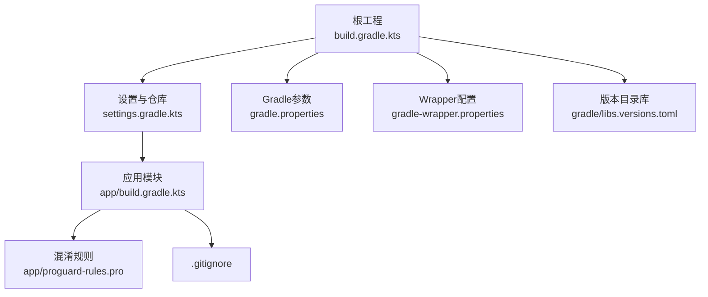
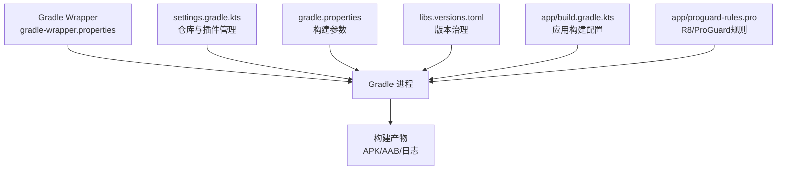
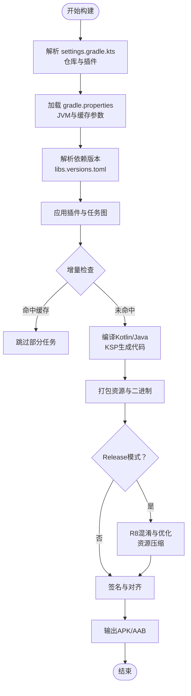
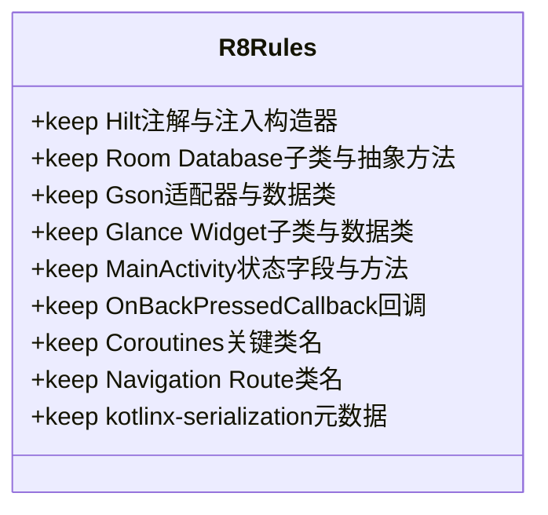
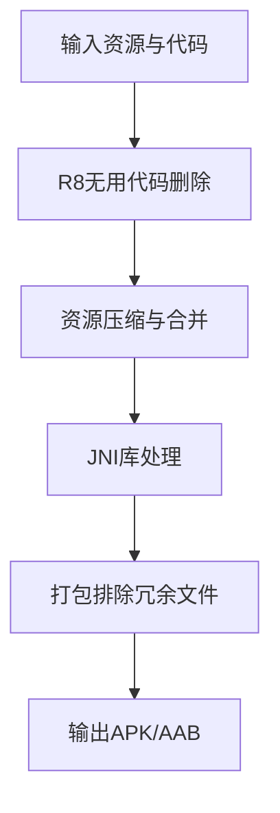
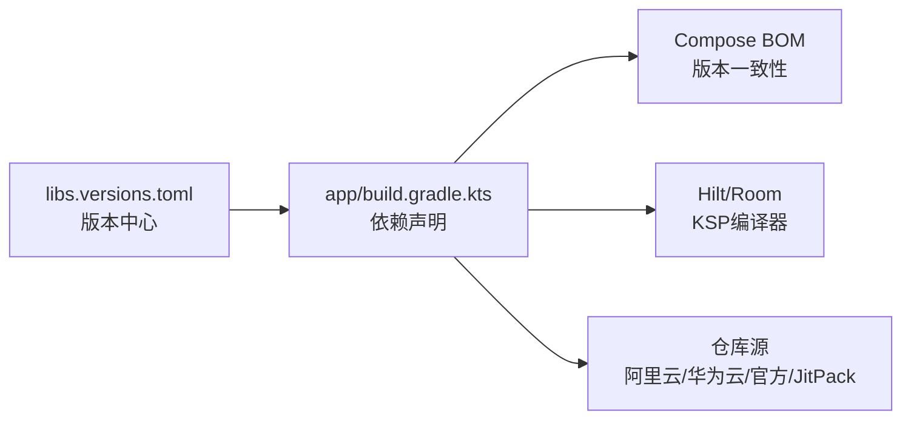
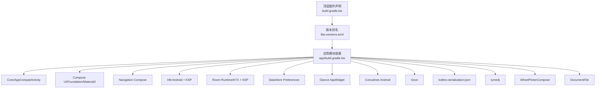

# 构建打包优化

<cite>
**本文引用的文件**   
- [build.gradle.kts](file://build.gradle.kts)
- [app/build.gradle.kts](file://app/build.gradle.kts)
- [gradle.properties](file://gradle.properties)
- [settings.gradle.kts](file://settings.gradle.kts)
- [gradle/libs.versions.toml](file://gradle/libs.versions.toml)
- [app/proguard-rules.pro](file://app/proguard-rules.pro)
- [gradle-wrapper.properties](file://gradle/wrapper/gradle-wrapper.properties)
- [gradle-daemon-jvm.properties](file://gradle/gradle-daemon-jvm.properties)
- [.gitignore](file://.gitignore)
</cite>

## 目录
1. [简介](#简介)
2. [项目结构](#项目结构)
3. [核心组件](#核心组件)
4. [架构总览](#架构总览)
5. [详细组件分析](#详细组件分析)
6. [依赖关系分析](#依赖关系分析)
7. [性能考量](#性能考量)
8. [故障排查指南](#故障排查指南)
9. [结论](#结论)
10. [附录](#附录)

## 简介
本文件面向Android排班日历应用的构建与打包优化，围绕Gradle构建脚本、并行构建、增量编译、缓存配置、代码混淆与R8优化、APK/AAB体积优化（资源压缩、无用代码删除、多架构支持）、依赖版本管理与冲突解决策略，以及构建性能分析与CI/CD流水线优化建议进行系统化说明。文档内容严格基于仓库中的构建脚本与配置文件进行分析与总结，确保可追溯性与准确性。

## 项目结构
本项目采用单模块应用结构，根目录包含顶层插件声明与全局仓库配置；应用模块位于 app 子模块，集中管理构建类型、签名、依赖与ProGuard规则。Gradle Wrapper使用国内镜像加速下载，依赖版本通过 libs.versions.toml 统一管理。

图表来源
- [build.gradle.kts:1-10](file://build.gradle.kts#L1-L10)
- [settings.gradle.kts:1-37](file://settings.gradle.kts#L1-L37)
- [gradle.properties:1-8](file://gradle.properties#L1-L8)
- [gradle-wrapper.properties:1-6](file://gradle/wrapper/gradle-wrapper.properties#L1-L6)
- [gradle/libs.versions.toml:1-86](file://gradle/libs.versions.toml#L1-L86)
- [app/build.gradle.kts:1-141](file://app/build.gradle.kts#L1-L141)
- [app/proguard-rules.pro:1-78](file://app/proguard-rules.pro#L1-L78)
- [.gitignore:1-33](file://.gitignore#L1-L33)

章节来源
- [build.gradle.kts:1-10](file://build.gradle.kts#L1-L10)
- [settings.gradle.kts:1-37](file://settings.gradle.kts#L1-L37)
- [gradle.properties:1-8](file://gradle.properties#L1-L8)
- [gradle/libs.versions.toml:1-86](file://gradle/libs.versions.toml#L1-L86)
- [app/build.gradle.kts:1-141](file://app/build.gradle.kts#L1-L141)
- [app/proguard-rules.pro:1-78](file://app/proguard-rules.pro#L1-L78)
- [gradle-wrapper.properties:1-6](file://gradle/wrapper/gradle-wrapper.properties#L1-L6)
- [.gitignore:1-33](file://.gitignore#L1-L33)

## 核心组件
- 顶层插件声明：统一声明Android、Kotlin、Compose、Hilt、KSP等插件，避免在根工程直接应用，保持职责清晰。
- 应用模块构建配置：定义命名空间、SDK版本、构建类型（debug/release）、签名、编译选项、Compose特性、Room schema导出、打包排除、Lint抑制等。
- Gradle全局参数：JVM内存、并行GC、配置缓存、构建缓存、AndroidX开关、Java路径等。
- 依赖版本管理：通过 libs.versions.toml 集中管理AGP、Kotlin、Compose BOM、Navigation、Room、DataStore、Lifecycle、Coroutines、Gson、Glance、第三方库等版本。
- ProGuard/R8规则：针对Hilt、Room、Gson、Glance、协程、Navigation路由、kotlinx-serialization等进行保留与混淆控制。

章节来源
- [build.gradle.kts:1-10](file://build.gradle.kts#L1-L10)
- [app/build.gradle.kts:10-79](file://app/build.gradle.kts#L10-L79)
- [gradle.properties:1-8](file://gradle.properties#L1-L8)
- [gradle/libs.versions.toml:1-86](file://gradle/libs.versions.toml#L1-L86)
- [app/proguard-rules.pro:1-78](file://app/proguard-rules.pro#L1-L78)

## 架构总览
下图展示构建系统的关键组件及其交互关系：Gradle Wrapper负责分发与JVM环境，settings.gradle.kts统一仓库源与插件管理，gradle.properties驱动构建性能，app/build.gradle.kts组织应用构建流程，libs.versions.toml提供版本治理，proguard-rules.pro指导R8优化与保留规则。

图表来源
- [gradle-wrapper.properties:1-6](file://gradle/wrapper/gradle-wrapper.properties#L1-L6)
- [settings.gradle.kts:1-37](file://settings.gradle.kts#L1-L37)
- [gradle.properties:1-8](file://gradle.properties#L1-L8)
- [gradle/libs.versions.toml:1-86](file://gradle/libs.versions.toml#L1-L86)
- [app/build.gradle.kts:1-141](file://app/build.gradle.kts#L1-L141)
- [app/proguard-rules.pro:1-78](file://app/proguard-rules.pro#L1-L78)

## 详细组件分析

### Gradle构建脚本优化（并行构建、增量编译、缓存）
- 并行构建与JVM参数
  - 启用并行GC与较大堆内存，提升构建吞吐。
  - 开启配置缓存与构建缓存，减少重复构建时间。
- 增量编译
  - Kotlin与AGP默认支持增量编译；KSP为Room/Hilt生成代码，配合增量编译显著缩短编译周期。
  - Room schema导出目录用于追踪迁移历史，同时启用KSP增量参数。
- 仓库与依赖解析
  - 优先使用阿里云镜像，华为云作为备用，官方源兜底，提高依赖下载速度。
  - 禁用Jetifier，减少不必要的转换开销。
- Wrapper与工具链
  - Wrapper使用国内镜像加速下载。
  - 通过foojay-resolver-convention约定JDK工具链版本，保证跨平台一致性。

图表来源
- [settings.gradle.kts:1-37](file://settings.gradle.kts#L1-L37)
- [gradle.properties:1-8](file://gradle.properties#L1-L8)
- [gradle/libs.versions.toml:1-86](file://gradle/libs.versions.toml#L1-L86)
- [app/build.gradle.kts:10-79](file://app/build.gradle.kts#L10-L79)
- [gradle-wrapper.properties:1-6](file://gradle/wrapper/gradle-wrapper.properties#L1-L6)

章节来源
- [gradle.properties:1-8](file://gradle.properties#L1-L8)
- [settings.gradle.kts:1-37](file://settings.gradle.kts#L1-L37)
- [gradle/libs.versions.toml:1-86](file://gradle/libs.versions.toml#L1-L86)
- [app/build.gradle.kts:10-79](file://app/build.gradle.kts#L10-L79)
- [gradle-wrapper.properties:1-6](file://gradle/wrapper/gradle-wrapper.properties#L1-L6)

### 代码混淆与优化规则（ProGuard/R8）
- Release构建启用minify与shrinkResources，结合proguard-android-optimize.txt与自定义规则。
- Hilt：保留注解与注入构造器成员，避免反射失效。
- Room：保留RoomDatabase子类及抽象方法，保障数据库访问。
- Gson：保留TypeAdapterFactory、Serializer/Deserializer实现，以及domain.model包下的数据类字段与类，防止反序列化失败。
- Glance Widget：保留GlanceAppWidget与Receiver子类，以及widget包下被Gson序列化的数据类。
- MainActivity状态字段与方法：防止R8内联导致Activity与Composable状态同步异常。
- OnBackPressedDispatcher回调：保留handleOnBackPressed方法与相关内部类，确保返回键逻辑正确。
- Coroutines：保留MainDispatcherFactory与CoroutineExceptionHandler名称，避免调度异常。
- Navigation Route对象：保留Route*类名，防止::class.qualifiedName与route不匹配。
- kotlinx-serialization：保留Serializable类的Companion、INSTANCE与serializer方法。

图表来源
- [app/proguard-rules.pro:1-78](file://app/proguard-rules.pro#L1-L78)

章节来源
- [app/build.gradle.kts:31-41](file://app/build.gradle.kts#L31-L41)
- [app/proguard-rules.pro:1-78](file://app/proguard-rules.pro#L1-L78)

### APK/AAB包体积优化（资源压缩、无用代码删除、多架构支持）
- 资源压缩：release构建启用isShrinkResources=true，自动剔除未使用的资源。
- 无用代码删除：isMinifyEnabled=true启用R8，移除未引用代码并优化字节码。
- 打包排除：packaging.resources.excludes排除META-INF中冗余许可证文件，减少包体。
- JNI库打包：jniLibs.useLegacyPackaging=true，兼容旧版.so打包方式。
- 多架构支持：当前配置未显式指定abiFilters，默认会包含所有可用ABI；建议在CI或发布时按需裁剪以减小包体。
- Lint抑制：禁用HighAppVersionCode、IconLauncherShape、IconDuplicates、UnusedAttribute、NewerVersionAvailable、ReportShortcutUsage等警告，避免构建噪音。

图表来源
- [app/build.gradle.kts:31-41](file://app/build.gradle.kts#L31-L41)
- [app/build.gradle.kts:59-63](file://app/build.gradle.kts#L59-L63)
- [app/build.gradle.kts:69-78](file://app/build.gradle.kts#L69-L78)

章节来源
- [app/build.gradle.kts:31-41](file://app/build.gradle.kts#L31-L41)
- [app/build.gradle.kts:59-63](file://app/build.gradle.kts#L59-L63)
- [app/build.gradle.kts:69-78](file://app/build.gradle.kts#L69-L78)

### 依赖版本管理与冲突解决策略
- 版本集中管理：通过libs.versions.toml统一AGP、Kotlin、Compose BOM、Navigation、Room、DataStore、Lifecycle、Coroutines、Gson、Glance、第三方库版本。
- Compose BOM：使用platform引入BOM，确保Compose各组件版本一致，避免冲突。
- KSP替代KAPT：Hilt与Room均使用KSP编译器，提升编译速度与兼容性。
- 仓库优先级：阿里云镜像优先，华为云备用，官方源兜底，JitPack用于第三方库。
- 依赖冲突解决：通过FailOnProjectRepos模式强制使用统一仓库配置，避免模块级仓库覆盖导致的版本不一致。

图表来源
- [gradle/libs.versions.toml:1-86](file://gradle/libs.versions.toml#L1-L86)
- [app/build.gradle.kts:81-141](file://app/build.gradle.kts#L81-L141)
- [settings.gradle.kts:19-33](file://settings.gradle.kts#L19-L33)

章节来源
- [gradle/libs.versions.toml:1-86](file://gradle/libs.versions.toml#L1-L86)
- [app/build.gradle.kts:81-141](file://app/build.gradle.kts#L81-L141)
- [settings.gradle.kts:19-33](file://settings.gradle.kts#L19-L33)

### 调试符号处理与构建产物
- Debug构建：isDebuggable=true，便于调试与日志输出。
- Release构建：启用混淆与资源压缩，签名配置指向本地密钥文件（注意生产环境应使用安全存储）。
- Lint：checkReleaseBuilds=false以避免AS签名菜单期间的lint缓存锁问题。
- Git忽略：构建产物、签名密钥、IDE配置等已纳入.gitignore，避免污染仓库。

章节来源
- [app/build.gradle.kts:22-41](file://app/build.gradle.kts#L22-L41)
- [app/build.gradle.kts:69-78](file://app/build.gradle.kts#L69-L78)
- [.gitignore:1-33](file://.gitignore#L1-L33)

## 依赖关系分析
- 插件与版本：顶层build.gradle.kts仅声明插件，应用模块通过alias(libs.plugins.*)引入，版本由libs.versions.toml统一管理。
- 依赖层次：Core KTX、AppCompat、Activity Compose、Lifecycle、Compose UI/Foundation/Material3、Navigation、Hilt、Room、DataStore、Glance、Coroutines、Gson、kotlinx-serialization、tyme4j、WheelPickerCompose、DocumentFile等。
- 构建阶段依赖：KSP在编译期生成Hilt与Room代码，影响增量编译效率。

图表来源
- [build.gradle.kts:1-10](file://build.gradle.kts#L1-L10)
- [gradle/libs.versions.toml:1-86](file://gradle/libs.versions.toml#L1-L86)
- [app/build.gradle.kts:81-141](file://app/build.gradle.kts#L81-L141)

章节来源
- [build.gradle.kts:1-10](file://build.gradle.kts#L1-L10)
- [gradle/libs.versions.toml:1-86](file://gradle/libs.versions.toml#L1-L86)
- [app/build.gradle.kts:81-141](file://app/build.gradle.kts#L81-L141)

## 性能考量
- 构建性能
  - 启用配置缓存与构建缓存，显著提升重复构建速度。
  - 使用并行GC与较大堆内存，降低JVM GC压力。
  - KSP替代KAPT，减少注解处理器开销。
  - 国内镜像加速依赖下载与插件获取。
- 编译性能
  - 增量编译与KSP增量参数，缩短编译时间。
  - 合理划分模块（当前单模块），未来可按功能拆分以提升并行编译效率。
- 包体积
  - 启用R8与资源压缩，剔除未用代码与资源。
  - 按需裁剪ABI，避免全架构打包。
  - 排除冗余META-INF文件。
- 运行时性能
  - 合理使用Gson与kotlinx-serialization，避免过度反射。
  - 对频繁调用的数据结构进行优化，减少序列化开销。

[本节为通用性能讨论，无需特定文件来源]

## 故障排查指南
- 构建失败与Lint警告
  - checkReleaseBuilds=false避免AS签名菜单期间lint缓存锁问题。
  - 禁用特定Lint规则以减少噪音，但需评估潜在风险。
- 混淆与运行时异常
  - 若出现Hilt注入失败、Room数据库访问异常、Gson反序列化错误，检查proguard-rules.pro是否遗漏保留规则。
  - MainActivity状态字段与方法被内联导致状态不同步，确认保留规则生效。
  - OnBackPressedDispatcher回调被裁剪，确保handleOnBackPressed与内部类保留。
- 依赖冲突
  - 使用FailOnProjectRepos模式统一仓库配置，避免模块级仓库覆盖。
  - 通过Compose BOM确保UI组件版本一致。
- 构建速度慢
  - 检查配置缓存与构建缓存是否启用。
  - 确认JVM参数与并行GC配置。
  - 使用国内镜像加速依赖下载。

章节来源
- [app/build.gradle.kts:69-78](file://app/build.gradle.kts#L69-L78)
- [app/proguard-rules.pro:1-78](file://app/proguard-rules.pro#L1-L78)
- [settings.gradle.kts:19-33](file://settings.gradle.kts#L19-L33)
- [gradle.properties:1-8](file://gradle.properties#L1-L8)

## 结论
本项目在构建与打包优化方面具备良好基础：统一的版本管理、合理的插件与依赖配置、完善的ProGuard/R8规则、启用的构建缓存与并行GC、以及国内镜像加速。为进一步优化，建议在生产环境中安全存储签名信息、按需裁剪ABI、持续监控构建时间与包体积变化，并在CI/CD中集成构建性能分析与自动化测试。

[本节为总结性内容，无需特定文件来源]

## 附录
- CI/CD流水线优化建议（概念性）
  - 使用缓存层缓存Gradle依赖与构建缓存目录。
  - 并行执行单元测试与静态分析任务。
  - 构建产物签名与校验，生成构建报告。
  - 定期更新依赖版本与插件，修复安全漏洞。
- 参考文件路径
  - 构建脚本：[app/build.gradle.kts](file://app/build.gradle.kts)
  - 全局参数：[gradle.properties](file://gradle.properties)
  - 版本管理：[gradle/libs.versions.toml](file://gradle/libs.versions.toml)
  - 混淆规则：[app/proguard-rules.pro](file://app/proguard-rules.pro)
  - 仓库配置：[settings.gradle.kts](file://settings.gradle.kts)
  - Wrapper配置：[gradle/wrapper/gradle-wrapper.properties](file://gradle/wrapper/gradle-wrapper.properties)

[本节为附录与概念性建议，无需特定文件来源]