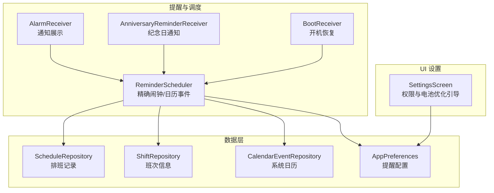
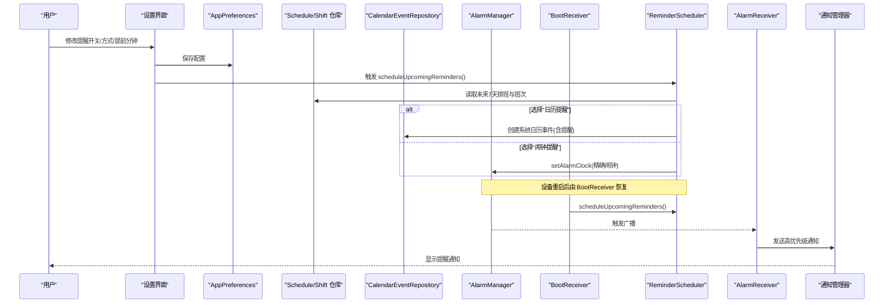
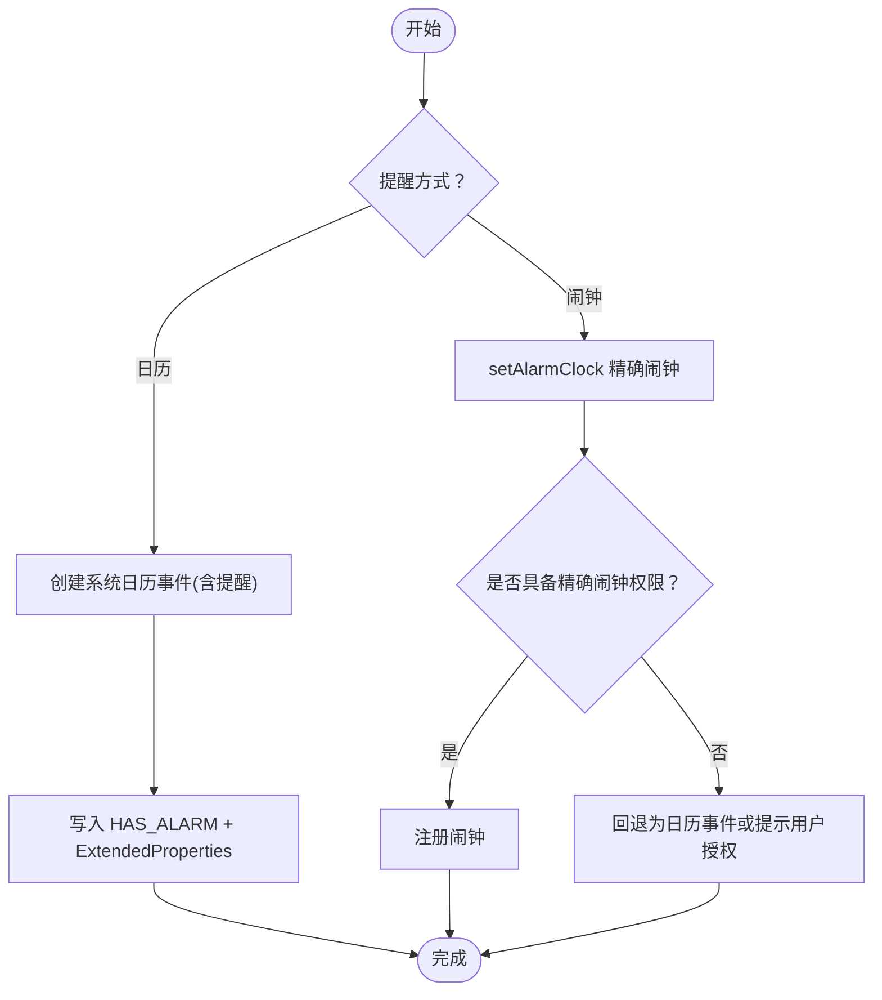
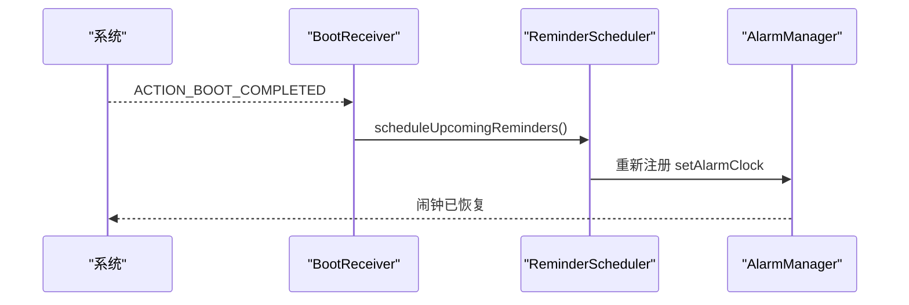
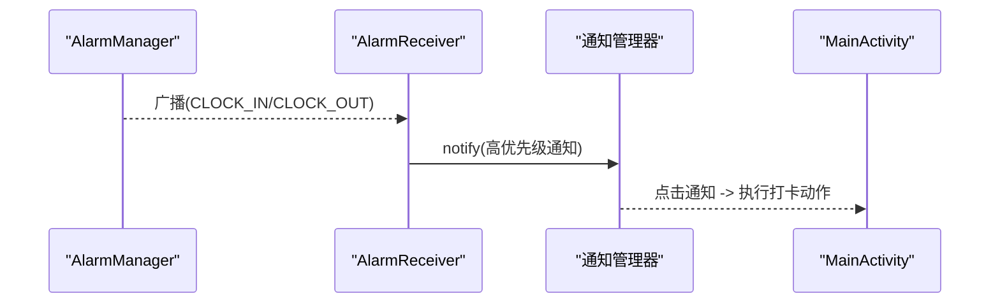
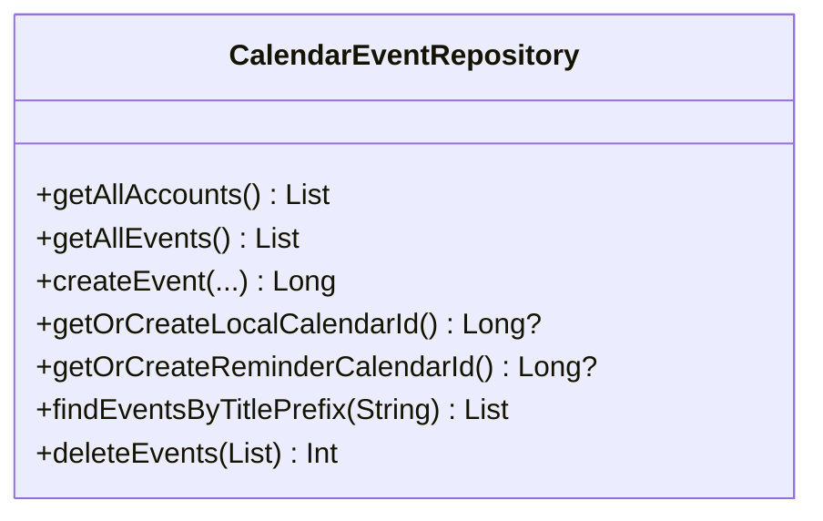
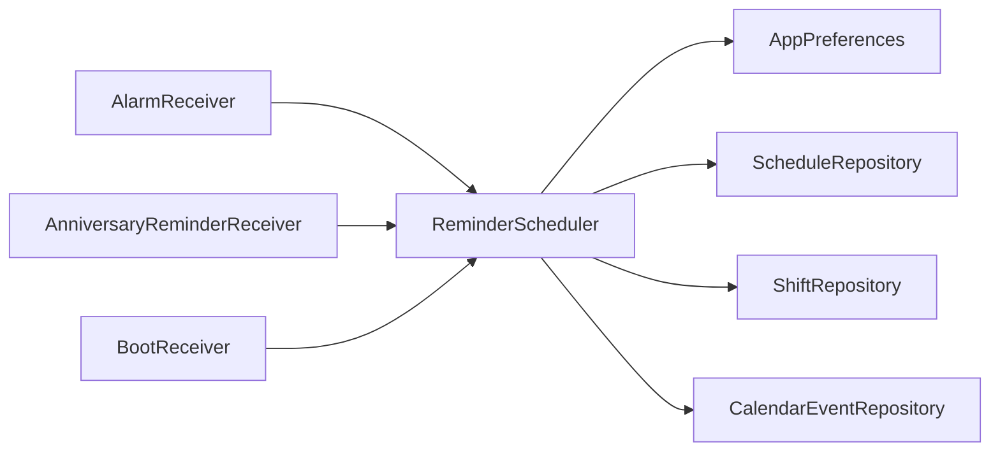

# 电池使用优化

<cite>
**本文引用的文件**   
- [ReminderScheduler.kt](file://app/src/main/java/com/schedulecalendar/app/reminder/ReminderScheduler.kt)
- [AlarmReceiver.kt](file://app/src/main/java/com/schedulecalendar/app/reminder/AlarmReceiver.kt)
- [AnniversaryReminderReceiver.kt](file://app/src/main/java/com/schedulecalendar/app/reminder/AnniversaryReminderReceiver.kt)
- [BootReceiver.kt](file://app/src/main/java/com/schedulecalendar/app/reminder/BootReceiver.kt)
- [CalendarEventRepository.kt](file://app/src/main/java/com/schedulecalendar/app/data/calendar/CalendarEventRepository.kt)
- [ScheduleRepository.kt](file://app/src/main/java/com/schedulecalendar/app/data/repository/ScheduleRepository.kt)
- [ShiftRepository.kt](file://app/src/main/java/com/schedulecalendar/app/data/repository/ShiftRepository.kt)
- [AppPreferences.kt](file://app/src/main/java/com/schedulecalendar/app/data/prefs/AppPreferences.kt)
- [SettingsScreen.kt](file://app/src/main/java/com/schedulecalendar/app/ui/settings/SettingsScreen.kt)
- [AndroidManifest.xml](file://app/src/main/AndroidManifest.xml)
</cite>

## 目录
1. [简介](#简介)
2. [项目结构](#项目结构)
3. [核心组件](#核心组件)
4. [架构总览](#架构总览)
5. [详细组件分析](#详细组件分析)
6. [依赖分析](#依赖分析)
7. [性能与功耗考量](#性能与功耗考量)
8. [故障排查指南](#故障排查指南)
9. [结论](#结论)
10. [附录](#附录)

## 简介
本文件围绕“排班日历应用”的电池使用优化展开，重点覆盖：
- 后台任务调度优化：WorkManager 与 JobScheduler 的使用策略（结合本项目的闹钟与开机自启动场景）
- 闹钟提醒系统的功耗优化：精确闹钟与近似闹钟的选择策略、权限与系统省电模式下的可靠性
- 网络请求优化：请求合并、缓存策略与连接复用（通用建议）
- 位置服务与传感器使用的功耗控制（通用建议）
- 电池使用分析与优化建议：Battery Historian 工具使用要点

本项目通过 AlarmManager.setAlarmClock 实现高可靠性的上下班提醒，并在系统重启后自动恢复；同时提供“系统日历事件提醒”作为替代方案。这些设计在功耗与可靠性之间取得平衡。

## 项目结构
与电池优化相关的代码主要分布在 reminder、data.calendar、data.repository、data.prefs 以及 UI 设置模块中。关键职责如下：
- ReminderScheduler：计算未来 7 天的有效提醒时间，注册精确闹钟或创建系统日历事件
- AlarmReceiver / AnniversaryReminderReceiver：接收闹钟广播并展示通知
- BootReceiver：设备开机后重新调度提醒
- CalendarEventRepository：系统日历账户与事件的读写，支持国产 ROM 兼容
- ScheduleRepository / ShiftRepository：排班与班次数据访问
- AppPreferences：提醒开关、方式、提前分钟等配置
- SettingsScreen：引导用户开启电池优化豁免与精确闹钟权限

图表来源
- [ReminderScheduler.kt:101-203](file://app/src/main/java/com/schedulecalendar/app/reminder/ReminderScheduler.kt#L101-L203)
- [AlarmReceiver.kt:19-62](file://app/src/main/java/com/schedulecalendar/app/reminder/AlarmReceiver.kt#L19-L62)
- [AnniversaryReminderReceiver.kt:24-41](file://app/src/main/java/com/schedulecalendar/app/reminder/AnniversaryReminderReceiver.kt#L24-L41)
- [BootReceiver.kt:31-44](file://app/src/main/java/com/schedulecalendar/app/reminder/BootReceiver.kt#L31-L44)
- [ScheduleRepository.kt:22-39](file://app/src/main/java/com/schedulecalendar/app/data/repository/ScheduleRepository.kt#L22-L39)
- [ShiftRepository.kt:17-44](file://app/src/main/java/com/schedulecalendar/app/data/repository/ShiftRepository.kt#L17-L44)
- [CalendarEventRepository.kt:283-337](file://app/src/main/java/com/schedulecalendar/app/data/calendar/CalendarEventRepository.kt#L283-L337)
- [AppPreferences.kt:202-248](file://app/src/main/java/com/schedulecalendar/app/data/prefs/AppPreferences.kt#L202-L248)
- [SettingsScreen.kt:350-420](file://app/src/main/java/com/schedulecalendar/app/ui/settings/SettingsScreen.kt#L350-L420)

章节来源
- [ReminderScheduler.kt:101-203](file://app/src/main/java/com/schedulecalendar/app/reminder/ReminderScheduler.kt#L101-L203)
- [AndroidManifest.xml:92-110](file://app/src/main/AndroidManifest.xml#L92-L110)

## 核心组件
- 精确闹钟调度器（ReminderScheduler）
  - 读取用户偏好与排班/班次数据，计算未来 7 天内的有效提醒时间
  - 支持两种模式：AlarmManager.setAlarmClock（精确闹钟）与系统日历事件提醒（近似/系统托管）
  - 处理跨午夜班次与内置请假/调休对提醒时间的调整
  - 在 Android 12+ 检查精确闹钟权限，避免无效调度
- 通知接收器（AlarmReceiver / AnniversaryReminderReceiver）
  - 接收闹钟广播，创建高优先级通知，点击跳转主界面执行打卡动作
- 开机恢复（BootReceiver）
  - 监听开机完成广播，通过 Hilt EntryPoint 获取 ReminderScheduler 并重新调度提醒
- 系统日历仓库（CalendarEventRepository）
  - 管理本地账户与三类日历（日程、纪念日、提醒），批量加载日历信息避免 N+1 查询
  - 创建事件时设置 HAS_ALARM 与 ExtendedProperties 以兼容国产 ROM
- 数据仓库（ScheduleRepository / ShiftRepository）
  - 提供按日期/范围查询与 Flow 观察，供提醒调度与 UI 刷新
- 偏好设置（AppPreferences）
  - 存储提醒开关、方式、提前分钟数等配置，并提供 Flow 用于响应式更新

章节来源
- [ReminderScheduler.kt:101-203](file://app/src/main/java/com/schedulecalendar/app/reminder/ReminderScheduler.kt#L101-L203)
- [AlarmReceiver.kt:19-62](file://app/src/main/java/com/schedulecalendar/app/reminder/AlarmReceiver.kt#L19-L62)
- [AnniversaryReminderReceiver.kt:24-41](file://app/src/main/java/com/schedulecalendar/app/reminder/AnniversaryReminderReceiver.kt#L24-L41)
- [BootReceiver.kt:31-44](file://app/src/main/java/com/schedulecalendar/app/reminder/BootReceiver.kt#L31-L44)
- [CalendarEventRepository.kt:283-337](file://app/src/main/java/com/schedulecalendar/app/data/calendar/CalendarEventRepository.kt#L283-L337)
- [ScheduleRepository.kt:22-39](file://app/src/main/java/com/schedulecalendar/app/data/repository/ScheduleRepository.kt#L22-L39)
- [ShiftRepository.kt:17-44](file://app/src/main/java/com/schedulecalendar/app/data/repository/ShiftRepository.kt#L17-L44)
- [AppPreferences.kt:202-248](file://app/src/main/java/com/schedulecalendar/app/data/prefs/AppPreferences.kt#L202-L248)

## 架构总览
提醒调度与通知的整体流程如下：

图表来源
- [ReminderScheduler.kt:101-203](file://app/src/main/java/com/schedulecalendar/app/reminder/ReminderScheduler.kt#L101-L203)
- [BootReceiver.kt:31-44](file://app/src/main/java/com/schedulecalendar/app/reminder/BootReceiver.kt#L31-L44)
- [AlarmReceiver.kt:19-62](file://app/src/main/java/com/schedulecalendar/app/reminder/AlarmReceiver.kt#L19-L62)
- [CalendarEventRepository.kt:283-337](file://app/src/main/java/com/schedulecalendar/app/data/calendar/CalendarEventRepository.kt#L283-L337)
- [AppPreferences.kt:202-248](file://app/src/main/java/com/schedulecalendar/app/data/prefs/AppPreferences.kt#L202-L248)

## 详细组件分析

### 精确闹钟 vs 系统日历事件提醒
- 精确闹钟（AlarmManager.setAlarmClock）
  - 优点：最高级别可靠性，Doze/省电模式下仍可准时触发
  - 缺点：需要精确闹钟权限（Android 12+ USE_EXACT_ALARM/SCHEDULE_EXACT_ALARM），频繁唤醒可能增加功耗
  - 适用场景：必须准时的上下班提醒
- 系统日历事件提醒
  - 优点：由系统日历托管，减少应用侧唤醒，功耗更友好
  - 缺点：受系统日历行为影响，部分国产 ROM 需额外兼容（ExtendedProperties）
  - 适用场景：对精度要求不高但希望降低功耗的场景

图表来源
- [ReminderScheduler.kt:101-203](file://app/src/main/java/com/schedulecalendar/app/reminder/ReminderScheduler.kt#L101-L203)
- [CalendarEventRepository.kt:283-337](file://app/src/main/java/com/schedulecalendar/app/data/calendar/CalendarEventRepository.kt#L283-L337)
- [AndroidManifest.xml:8-10](file://app/src/main/AndroidManifest.xml#L8-L10)

章节来源
- [ReminderScheduler.kt:101-203](file://app/src/main/java/com/schedulecalendar/app/reminder/ReminderScheduler.kt#L101-L203)
- [CalendarEventRepository.kt:283-337](file://app/src/main/java/com/schedulecalendar/app/data/calendar/CalendarEventRepository.kt#L283-L337)
- [AndroidManifest.xml:8-10](file://app/src/main/AndroidManifest.xml#L8-L10)

### 开机恢复与后台保活
- BootReceiver 监听 BOOT_COMPLETED/LOCKED_BOOT_COMPLETED，通过 Hilt EntryPoint 获取 ReminderScheduler 并重新调度未来 7 天提醒
- 设置界面提供“电池优化豁免”与国产 ROM 后台运行保障引导，提升后台可靠性

图表来源
- [BootReceiver.kt:31-44](file://app/src/main/java/com/schedulecalendar/app/reminder/BootReceiver.kt#L31-L44)
- [ReminderScheduler.kt:101-203](file://app/src/main/java/com/schedulecalendar/app/reminder/ReminderScheduler.kt#L101-L203)

章节来源
- [BootReceiver.kt:31-44](file://app/src/main/java/com/schedulecalendar/app/reminder/BootReceiver.kt#L31-L44)
- [SettingsScreen.kt:350-420](file://app/src/main/java/com/schedulecalendar/app/ui/settings/SettingsScreen.kt#L350-L420)

### 通知与交互路径
- AlarmReceiver 解析广播参数，构建高优先级通知，点击后跳转到 MainActivity 执行打卡动作
- AnniversaryReminderReceiver 同理，用于纪念日提醒

图表来源
- [AlarmReceiver.kt:19-62](file://app/src/main/java/com/schedulecalendar/app/reminder/AlarmReceiver.kt#L19-L62)
- [AnniversaryReminderReceiver.kt:24-41](file://app/src/main/java/com/schedulecalendar/app/reminder/AnniversaryReminderReceiver.kt#L24-L41)

章节来源
- [AlarmReceiver.kt:19-62](file://app/src/main/java/com/schedulecalendar/app/reminder/AlarmReceiver.kt#L19-L62)
- [AnniversaryReminderReceiver.kt:24-41](file://app/src/main/java/com/schedulecalendar/app/reminder/AnniversaryReminderReceiver.kt#L24-L41)

### 系统日历仓库的批量优化
- getAllEvents 先批量加载所有可见日历信息，再遍历事件，避免 N+1 查询
- 创建事件时设置 HAS_ALARM 与 ExtendedProperties 以兼容国产 ROM

图表来源
- [CalendarEventRepository.kt:163-211](file://app/src/main/java/com/schedulecalendar/app/data/calendar/CalendarEventRepository.kt#L163-L211)
- [CalendarEventRepository.kt:283-337](file://app/src/main/java/com/schedulecalendar/app/data/calendar/CalendarEventRepository.kt#L283-L337)
- [CalendarEventRepository.kt:518-581](file://app/src/main/java/com/schedulecalendar/app/data/calendar/CalendarEventRepository.kt#L518-L581)

章节来源
- [CalendarEventRepository.kt:163-211](file://app/src/main/java/com/schedulecalendar/app/data/calendar/CalendarEventRepository.kt#L163-L211)
- [CalendarEventRepository.kt:283-337](file://app/src/main/java/com/schedulecalendar/app/data/calendar/CalendarEventRepository.kt#L283-L337)

## 依赖分析
- ReminderScheduler 依赖：
  - AppPreferences：读取提醒开关、方式、提前分钟数
  - ScheduleRepository：按日期获取排班记录
  - ShiftRepository：按 ID 获取班次信息（含内置类型判断）
  - CalendarEventRepository：创建/清理系统日历事件
- 权限与清单：
  - POST_NOTIFICATIONS、WAKE_LOCK、READ/WRITE_CALENDAR、USE_EXACT_ALARM、SCHEDULE_EXACT_ALARM、RECEIVE_BOOT_COMPLETED、AUTHENTICATE_ACCOUNTS

图表来源
- [ReminderScheduler.kt:101-203](file://app/src/main/java/com/schedulecalendar/app/reminder/ReminderScheduler.kt#L101-L203)
- [AndroidManifest.xml:4-12](file://app/src/main/AndroidManifest.xml#L4-L12)

章节来源
- [ReminderScheduler.kt:101-203](file://app/src/main/java/com/schedulecalendar/app/reminder/ReminderScheduler.kt#L101-L203)
- [AndroidManifest.xml:4-12](file://app/src/main/AndroidManifest.xml#L4-L12)

## 性能与功耗考量
- 后台任务调度
  - 本项目未直接使用 WorkManager/JobScheduler 进行提醒调度，而是采用 AlarmManager.setAlarmClock 保证高可靠性；若需批量同步或延迟任务，可引入 WorkManager 的 Constraints（如仅充电/非待机）以降低功耗
  - 对于周期性低优先级任务，建议使用 JobScheduler 的 setPeriodic 并结合 Doze 适配
- 闹钟提醒系统
  - 精确闹钟（setAlarmClock）在 Doze/省电模式下仍会触发，但会增加唤醒次数；若对精度要求不高，优先选择系统日历事件提醒以降低功耗
  - Android 12+ 需检查 canScheduleExactAlarms，避免无效调度
  - 通过 BootReceiver 在开机后恢复闹钟，确保长期可靠性
- 网络请求优化（通用建议）
  - 请求合并：将多个小请求合并为一次批量请求，减少握手与唤醒次数
  - 缓存策略：使用内存缓存（短期）与磁盘缓存（长期），配合 ETag/Last-Modified 减少重复下载
  - 连接复用：启用 HTTP 连接池与 Keep-Alive，合理设置超时与重试策略
- 位置服务与传感器（通用建议）
  - 使用最小必要精度与频率，避免前台持续高精度定位
  - 使用一次性或低频采样，必要时使用地理围栏或显著位置变化回调
  - 传感器仅在需要时启用，及时释放监听
- 电池优化与权限
  - 通过设置界面引导用户开启“电池优化豁免”，提升后台可靠性
  - 针对国产 ROM 提供后台运行保障引导（自启动、无限制、后台弹出界面、桌面快捷方式）

[本节为通用指导，不直接分析具体文件]

## 故障排查指南
- 闹钟未触发
  - 检查精确闹钟权限（Android 12+）：USE_EXACT_ALARM/SCHEDULE_EXACT_ALARM
  - 确认是否处于 Doze/省电模式，必要时引导用户开启电池优化豁免
  - 验证 BootReceiver 是否正确恢复闹钟
- 通知未显示
  - 确认通知渠道已创建且优先级正确
  - 检查 POST_NOTIFICATIONS 权限（Android 13+）
- 日历事件未生效
  - 检查 READ/WRITE_CALENDAR 权限
  - 确认系统日历账户存在且可写，事件 HAS_ALARM 与 ExtendedProperties 已写入
- 开机后提醒丢失
  - 确认 RECEIVE_BOOT_COMPLETED 权限与 BootReceiver 注册
  - 检查是否在锁定开机广播（LOCKED_BOOT_COMPLETED）中恢复

章节来源
- [AlarmReceiver.kt:19-62](file://app/src/main/java/com/schedulecalendar/app/reminder/AlarmReceiver.kt#L19-L62)
- [AnniversaryReminderReceiver.kt:24-41](file://app/src/main/java/com/schedulecalendar/app/reminder/AnniversaryReminderReceiver.kt#L24-L41)
- [BootReceiver.kt:31-44](file://app/src/main/java/com/schedulecalendar/app/reminder/BootReceiver.kt#L31-L44)
- [AndroidManifest.xml:4-12](file://app/src/main/AndroidManifest.xml#L4-L12)

## 结论
- 本项目通过 AlarmManager.setAlarmClock 实现高可靠性的上下班提醒，并在系统重启后自动恢复；同时提供系统日历事件提醒作为低功耗替代方案
- 通过设置界面引导用户开启电池优化豁免与精确闹钟权限，提升后台可靠性与用户体验
- 建议在非关键任务中引入 WorkManager/JobScheduler，结合系统省电策略进一步优化功耗
- 网络与位置/传感器的优化遵循“最小必要”的原则，减少不必要的唤醒与资源占用

[本节为总结，不直接分析具体文件]

## 附录
- Battery Historian 使用要点
  - 导出电池历史：adb shell dumpsys batterystats > stats.txt
  - 生成报告：python batteryhistorian.py --csv stats.csv
  - 关注指标：WakeLock、CPU、GPS、网络、Alarm 触发频率
  - 结合日志定位问题：查看应用包名对应的 WakeLock 持有时长、Alarm 触发间隔、Doze 进入/退出时间点

[本节为通用指导，不直接分析具体文件]