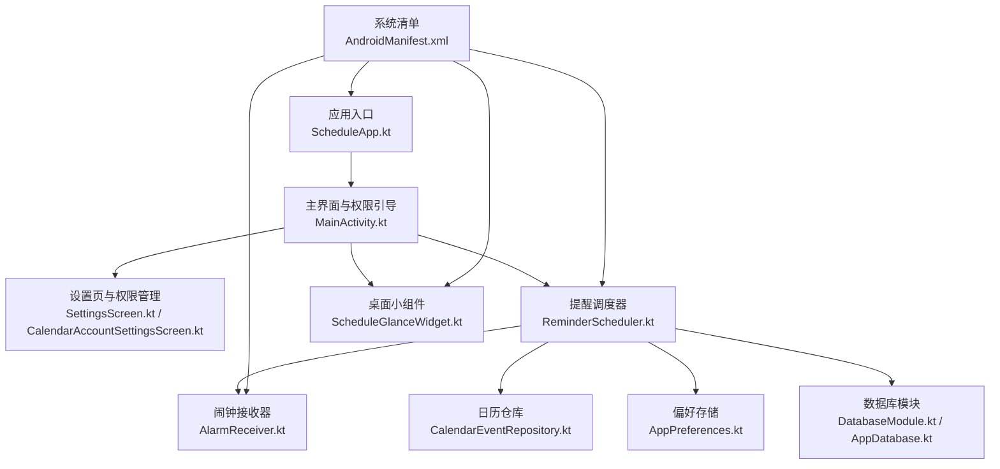
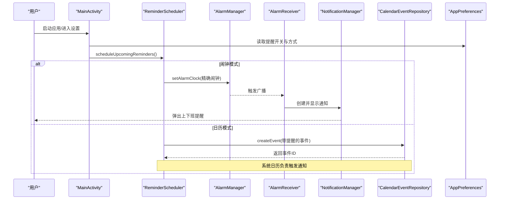
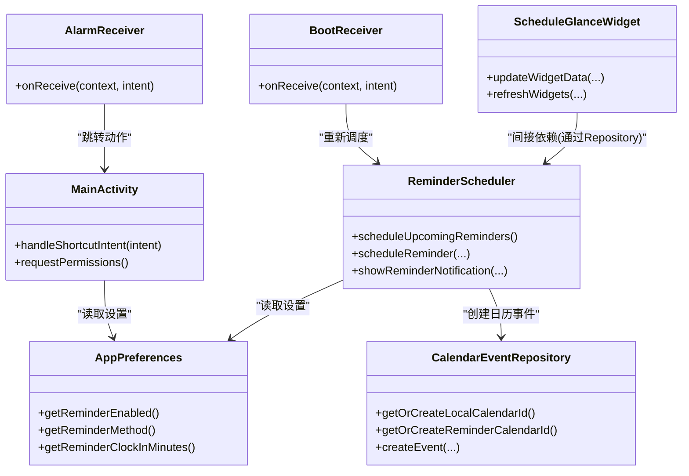

# 故障排除

<cite>
**本文引用的文件**   
- [AndroidManifest.xml](file://app/src/main/AndroidManifest.xml)
- [ScheduleApp.kt](file://app/src/main/java/com/schedulecalendar/app/ScheduleApp.kt)
- [AppDatabase.kt](file://app/src/main/java/com/schedulecalendar/app/data/db/AppDatabase.kt)
- [DatabaseModule.kt](file://app/src/main/java/com/schedulecalendar/app/di/DatabaseModule.kt)
- [ReminderScheduler.kt](file://app/src/main/java/com/schedulecalendar/app/reminder/ReminderScheduler.kt)
- [AlarmReceiver.kt](file://app/src/main/java/com/schedulecalendar/app/reminder/AlarmReceiver.kt)
- [BootReceiver.kt](file://app/src/main/java/com/schedulecalendar/app/reminder/BootReceiver.kt)
- [CalendarEventRepository.kt](file://app/src/main/java/com/schedulecalendar/app/data/calendar/CalendarEventRepository.kt)
- [AppPreferences.kt](file://app/src/main/java/com/schedulecalendar/app/data/prefs/AppPreferences.kt)
- [MainActivity.kt](file://app/src/main/java/com/schedulecalendar/app/MainActivity.kt)
- [SettingsScreen.kt](file://app/src/main/java/com/schedulecalendar/app/ui/settings/SettingsScreen.kt)
- [CalendarAccountSettingsScreen.kt](file://app/src/main/java/com/schedulecalendar/app/ui/settings/CalendarAccountSettingsScreen.kt)
- [ScheduleGlanceWidget.kt](file://app/src/main/java/com/schedulecalendar/app/widget/ScheduleGlanceWidget.kt)
- [build.gradle.kts](file://app/build.gradle.kts)
</cite>

## 目录
1. [简介](#简介)
2. [项目结构](#项目结构)
3. [核心组件](#核心组件)
4. [架构总览](#架构总览)
5. [详细组件分析](#详细组件分析)
6. [依赖关系分析](#依赖关系分析)
7. [性能考虑](#性能考虑)
8. [故障排除指南](#故障排除指南)
9. [结论](#结论)
10. [附录](#附录)

## 简介
本故障排除文档面向 Android 排班日历应用，聚焦常见问题与解决方案：权限问题、数据库异常、通知失效、日历同步失败等。同时提供日志收集与分析方法（Logcat、崩溃报告、性能监控）、调试技巧（Android Studio 调试器、Profiler、远程调试）、系统兼容性排查（不同 Android 版本差异），以及用户反馈问题的诊断流程与修复策略。内容基于代码仓库实际实现进行梳理，确保可操作性和可追溯性。

## 项目结构
应用采用模块化分层组织：
- UI 层：Compose 界面与 ViewModel
- 数据层：Room 数据库、DataStore 偏好、CalendarProvider 日历仓库
- 系统交互：AlarmManager 闹钟、NotificationManager 通知、BroadcastReceiver 开机广播
- 小组件：Glance 桌面小组件
- 配置与初始化：Hilt DI、Application、Manifest 声明

**图表来源** 
- [ScheduleApp.kt:1-9](file://app/src/main/java/com/schedulecalendar/app/ScheduleApp.kt#L1-L9)
- [MainActivity.kt:1-200](file://app/src/main/java/com/schedulecalendar/app/MainActivity.kt#L1-L200)
- [SettingsScreen.kt:199-229](file://app/src/main/java/com/schedulecalendar/app/ui/settings/SettingsScreen.kt#L199-L229)
- [CalendarAccountSettingsScreen.kt:37-57](file://app/src/main/java/com/schedulecalendar/app/ui/settings/CalendarAccountSettingsScreen.kt#L37-L57)
- [ReminderScheduler.kt:1-497](file://app/src/main/java/com/schedulecalendar/app/reminder/ReminderScheduler.kt#L1-L497)
- [AlarmReceiver.kt:1-78](file://app/src/main/java/com/schedulecalendar/app/reminder/AlarmReceiver.kt#L1-L78)
- [CalendarEventRepository.kt:1-820](file://app/src/main/java/com/schedulecalendar/app/data/calendar/CalendarEventRepository.kt#L1-L820)
- [AppPreferences.kt:1-313](file://app/src/main/java/com/schedulecalendar/app/data/prefs/AppPreferences.kt#L1-L313)
- [DatabaseModule.kt:1-34](file://app/src/main/java/com/schedulecalendar/app/di/DatabaseModule.kt#L1-L34)
- [AppDatabase.kt:1-35](file://app/src/main/java/com/schedulecalendar/app/data/db/AppDatabase.kt#L1-L35)
- [AndroidManifest.xml:1-126](file://app/src/main/AndroidManifest.xml#L1-L126)

**章节来源**
- [AndroidManifest.xml:1-126](file://app/src/main/AndroidManifest.xml#L1-L126)
- [build.gradle.kts:1-141](file://app/build.gradle.kts#L1-L141)

## 核心组件
- 应用入口与依赖注入：Hilt Application 类用于启用依赖注入框架。
- 主界面与权限引导：首次启动时引导用户授予日历读写与通知权限。
- 提醒调度器：支持“闹钟”和“日历事件”两种提醒方式，处理跨午夜、内置请假/调休时间调整、精确闹钟权限检查。
- 闹钟接收器：触发通知并跳转主界面执行打卡动作。
- 开机自启动：设备重启后重新调度未来 7 天的提醒。
- 日历仓库：创建/查询/删除系统日历事件，维护本地账户与专用提醒日历。
- 偏好存储：使用 DataStore 持久化提醒开关、方式、提前分钟数、账户分类等。
- 数据库模块：Room 数据库构建与 DAO 暴露，破坏性迁移策略。
- 桌面小组件：Glance 实现的快捷打卡小组件，支持状态刷新与规则控制。

**章节来源**
- [ScheduleApp.kt:1-9](file://app/src/main/java/com/schedulecalendar/app/ScheduleApp.kt#L1-L9)
- [MainActivity.kt:1-200](file://app/src/main/java/com/schedulecalendar/app/MainActivity.kt#L1-L200)
- [ReminderScheduler.kt:1-497](file://app/src/main/java/com/schedulecalendar/app/reminder/ReminderScheduler.kt#L1-L497)
- [AlarmReceiver.kt:1-78](file://app/src/main/java/com/schedulecalendar/app/reminder/AlarmReceiver.kt#L1-L78)
- [BootReceiver.kt:1-46](file://app/src/main/java/com/schedulecalendar/app/reminder/BootReceiver.kt#L1-L46)
- [CalendarEventRepository.kt:1-820](file://app/src/main/java/com/schedulecalendar/app/data/calendar/CalendarEventRepository.kt#L1-L820)
- [AppPreferences.kt:1-313](file://app/src/main/java/com/schedulecalendar/app/data/prefs/AppPreferences.kt#L1-L313)
- [DatabaseModule.kt:1-34](file://app/src/main/java/com/schedulecalendar/app/di/DatabaseModule.kt#L1-L34)
- [AppDatabase.kt:1-35](file://app/src/main/java/com/schedulecalendar/app/data/db/AppDatabase.kt#L1-L35)
- [ScheduleGlanceWidget.kt:1-633](file://app/src/main/java/com/schedulecalendar/app/widget/ScheduleGlanceWidget.kt#L1-L633)

## 架构总览
提醒与通知的核心调用链如下：

**图表来源** 
- [MainActivity.kt:1-200](file://app/src/main/java/com/schedulecalendar/app/MainActivity.kt#L1-L200)
- [ReminderScheduler.kt:100-203](file://app/src/main/java/com/schedulecalendar/app/reminder/ReminderScheduler.kt#L100-L203)
- [AlarmReceiver.kt:1-78](file://app/src/main/java/com/schedulecalendar/app/reminder/AlarmReceiver.kt#L1-L78)
- [CalendarEventRepository.kt:283-337](file://app/src/main/java/com/schedulecalendar/app/data/calendar/CalendarEventRepository.kt#L283-L337)
- [AppPreferences.kt:199-250](file://app/src/main/java/com/schedulecalendar/app/data/prefs/AppPreferences.kt#L199-L250)

## 详细组件分析

### 权限与通知问题
- 常见症状
  - 通知不显示或点击无效
  - 日历无法读取/写入
  - 精确闹钟未生效
- 关键检查点
  - Manifest 中已声明必要权限：READ_CALENDAR、WRITE_CALENDAR、POST_NOTIFICATIONS、USE_EXACT_ALARM、SCHEDULE_EXACT_ALARM、RECEIVE_BOOT_COMPLETED、AUTHENTICATE_ACCOUNTS
  - MainActivity 首次启动弹窗请求权限，并在 TIRAMISU+ 请求 POST_NOTIFICATIONS
  - ReminderScheduler 在 setAlarmClock 前检查 canScheduleExactAlarms（API 31+）
  - AlarmReceiver 创建通知渠道（Android 8.0+）
- 解决步骤
  - 确认用户已授权日历读写与通知权限；若拒绝，引导至系统设置页面
  - 对于 API 31+，确保精确闹钟权限可用；不可用时回退到日历提醒模式
  - 检查通知渠道是否创建成功，必要时清理渠道重试
  - 验证 PendingIntent 的 FLAG 与 requestCode 唯一性，避免重复覆盖

**章节来源**
- [AndroidManifest.xml:1-126](file://app/src/main/AndroidManifest.xml#L1-L126)
- [MainActivity.kt:178-204](file://app/src/main/java/com/schedulecalendar/app/MainActivity.kt#L178-L204)
- [ReminderScheduler.kt:301-353](file://app/src/main/java/com/schedulecalendar/app/reminder/ReminderScheduler.kt#L301-L353)
- [AlarmReceiver.kt:64-76](file://app/src/main/java/com/schedulecalendar/app/reminder/AlarmReceiver.kt#L64-L76)
- [SettingsScreen.kt:199-229](file://app/src/main/java/com/schedulecalendar/app/ui/settings/SettingsScreen.kt#L199-L229)
- [CalendarAccountSettingsScreen.kt:37-57](file://app/src/main/java/com/schedulecalendar/app/ui/settings/CalendarAccountSettingsScreen.kt#L37-L57)

### 数据库异常与迁移
- 常见症状
  - 应用启动崩溃（Room 版本不一致）
  - 数据丢失或表不存在
- 关键检查点
  - AppDatabase version=5，schemas 导出目录 app/schemas/
  - DatabaseModule 使用 fallbackToDestructiveMigration(dropAllTables=true)
- 解决步骤
  - 升级版本时需更新 schema 并编写迁移脚本；当前策略为破坏性迁移，会清空数据
  - 若出现 Schema 不匹配，先备份数据再卸载重装或清除应用数据
  - 检查 DAO 与 Entity 字段变更是否一致，避免编译期或运行期错误

**章节来源**
- [AppDatabase.kt:17-34](file://app/src/main/java/com/schedulecalendar/app/data/db/AppDatabase.kt#L17-L34)
- [DatabaseModule.kt:23-27](file://app/src/main/java/com/schedulecalendar/app/di/DatabaseModule.kt#L23-L27)

### 通知失效与闹钟不触发
- 常见症状
  - 上下班提醒未按时弹出
  - 通知点击无响应
- 关键检查点
  - ReminderScheduler.scheduleReminder 使用 setAlarmClock，需精确闹钟权限
  - BootReceiver 在开机后重新调度未来 7 天提醒
  - AlarmReceiver 创建通知渠道并显示通知
- 解决步骤
  - 检查精确闹钟权限；不可用时切换到日历提醒模式
  - 确认开机广播已注册且能触发 BootReceiver
  - 清理并重建通知渠道，确保渠道 ID 与优先级正确
  - 校验 PendingIntent 的 action 与 flags，保证点击跳转与动作正确

**章节来源**
- [ReminderScheduler.kt:301-353](file://app/src/main/java/com/schedulecalendar/app/reminder/ReminderScheduler.kt#L301-L353)
- [BootReceiver.kt:31-44](file://app/src/main/java/com/schedulecalendar/app/reminder/BootReceiver.kt#L31-L44)
- [AlarmReceiver.kt:19-62](file://app/src/main/java/com/schedulecalendar/app/reminder/AlarmReceiver.kt#L19-L62)

### 日历同步失败
- 常见症状
  - 无法创建/读取系统日历事件
  - 提醒事件未出现在系统日历
- 关键检查点
  - CalendarEventRepository.getOrCreateLocalCalendarId 创建自定义账户与日程日历
  - getOrCreateReminderCalendarId 创建提醒专用日历
  - createEvent 设置 HAS_ALARM 与 ExtendedProperties（国产 ROM 兼容）
- 解决步骤
  - 确保 WRITE_CALENDAR 权限已授予
  - 检查 AccountManager 账户是否存在并可同步
  - 若事件未创建，查看 ContentResolver 插入返回值与异常
  - 国产 ROM 下通过 need_alarm 扩展属性保障提醒触发

**章节来源**
- [CalendarEventRepository.kt:417-516](file://app/src/main/java/com/schedulecalendar/app/data/calendar/CalendarEventRepository.kt#L417-L516)
- [CalendarEventRepository.kt:525-581](file://app/src/main/java/com/schedulecalendar/app/data/calendar/CalendarEventRepository.kt#L525-L581)
- [CalendarEventRepository.kt:283-337](file://app/src/main/java/com/schedulecalendar/app/data/calendar/CalendarEventRepository.kt#L283-L337)

### 桌面小组件打卡异常
- 常见症状
  - 小组件按钮点击无反应
  - 打卡时间未保存或显示不正确
- 关键检查点
  - ScheduleGlanceWidget 使用 PreferencesGlanceStateDefinition 与 SharedPreferences 双写
  - WidgetClockInAction/WidgetClockOutAction 通过 Hilt EntryPoint 访问 Repository
  - refreshWidgets 同步刷新两个小组件
- 解决步骤
  - 检查小组件权限与数据持久化路径是否正确
  - 确认 ActionCallback 能获取到正确的日期与班次信息
  - 若状态不同步，强制刷新 Glance 状态并更新所有实例

**章节来源**
- [ScheduleGlanceWidget.kt:85-111](file://app/src/main/java/com/schedulecalendar/app/widget/ScheduleGlanceWidget.kt#L85-L111)
- [ScheduleGlanceWidget.kt:115-194](file://app/src/main/java/com/schedulecalendar/app/widget/ScheduleGlanceWidget.kt#L115-L194)
- [ScheduleGlanceWidget.kt:218-299](file://app/src/main/java/com/schedulecalendar/app/widget/ScheduleGlanceWidget.kt#L218-L299)
- [ScheduleGlanceWidget.kt:318-325](file://app/src/main/java/com/schedulecalendar/app/widget/ScheduleGlanceWidget.kt#L318-L325)

## 依赖关系分析
组件间依赖与耦合情况：
- MainActivity 依赖 AppPreferences 与 Hilt 注入
- ReminderScheduler 依赖 AppPreferences、ScheduleRepository、ShiftRepository、CalendarEventRepository
- AlarmReceiver 依赖 NotificationManager 与 MainActivity 动作
- BootReceiver 通过 Hilt EntryPoint 获取 ReminderScheduler
- CalendarEventRepository 依赖 AccountManager 与 CalendarContract
- ScheduleGlanceWidget 通过 EntryPoint 访问 Repository

**图表来源** 
- [MainActivity.kt:1-200](file://app/src/main/java/com/schedulecalendar/app/MainActivity.kt#L1-L200)
- [ReminderScheduler.kt:1-497](file://app/src/main/java/com/schedulecalendar/app/reminder/ReminderScheduler.kt#L1-L497)
- [AlarmReceiver.kt:1-78](file://app/src/main/java/com/schedulecalendar/app/reminder/AlarmReceiver.kt#L1-L78)
- [BootReceiver.kt:1-46](file://app/src/main/java/com/schedulecalendar/app/reminder/BootReceiver.kt#L1-L46)
- [CalendarEventRepository.kt:1-820](file://app/src/main/java/com/schedulecalendar/app/data/calendar/CalendarEventRepository.kt#L1-L820)
- [AppPreferences.kt:1-313](file://app/src/main/java/com/schedulecalendar/app/data/prefs/AppPreferences.kt#L1-L313)
- [ScheduleGlanceWidget.kt:1-633](file://app/src/main/java/com/schedulecalendar/app/widget/ScheduleGlanceWidget.kt#L1-L633)

**章节来源**
- [ReminderScheduler.kt:1-497](file://app/src/main/java/com/schedulecalendar/app/reminder/ReminderScheduler.kt#L1-L497)
- [CalendarEventRepository.kt:1-820](file://app/src/main/java/com/schedulecalendar/app/data/calendar/CalendarEventRepository.kt#L1-L820)
- [AppPreferences.kt:1-313](file://app/src/main/java/com/schedulecalendar/app/data/prefs/AppPreferences.kt#L1-L313)
- [ScheduleGlanceWidget.kt:1-633](file://app/src/main/java/com/schedulecalendar/app/widget/ScheduleGlanceWidget.kt#L1-L633)

## 性能考虑
- Room 数据库：使用 KSP 生成 DAO，避免运行时反射开销；破坏性迁移适合开发阶段，生产环境建议编写增量迁移。
- DataStore：异步流式读写，避免阻塞主线程；读取时使用 .first() 快照。
- AlarmManager：setAlarmClock 高可靠性但耗电，建议在 Doze 模式下仍能保证触发；频繁调度需合并与去重。
- CalendarProvider：批量加载日历信息避免 N+1 查询；ExtendedProperties 写入可能失败，需容错。
- Glance 小组件：状态更新与刷新应批量处理，减少多次 update 调用。

[本节为通用指导，无需引用具体文件]

## 故障排除指南

### 日志收集与分析
- Logcat 使用
  - 过滤标签：MainActivity、ReminderScheduler、AlarmReceiver、BootReceiver、CalendarEventRepository、ScheduleGlanceWidget
  - 关注权限申请、闹钟注册、通知创建、日历事件插入的关键日志
- 崩溃报告分析
  - 使用 Android Studio 的 Crashlytics 或系统崩溃日志定位堆栈
  - 重点检查 Room 迁移、ContentResolver 插入、PendingIntent 创建异常
- 性能监控
  - Profiler 监测 CPU、内存、网络（CalendarProvider 查询）
  - 观察 AlarmManager 调度频率与通知数量

**章节来源**
- [MainActivity.kt:1-200](file://app/src/main/java/com/schedulecalendar/app/MainActivity.kt#L1-L200)
- [ReminderScheduler.kt:1-497](file://app/src/main/java/com/schedulecalendar/app/reminder/ReminderScheduler.kt#L1-L497)
- [CalendarEventRepository.kt:1-820](file://app/src/main/java/com/schedulecalendar/app/data/calendar/CalendarEventRepository.kt#L1-L820)

### 调试技巧与工具
- Android Studio 调试器
  - 断点设置在权限请求、闹钟注册、通知创建、日历事件插入处
  - 变量监视权限状态、SharedPreferences 值、DataStore 流
- Profiler 工具
  - 监控数据库读写耗时、CalendarProvider 查询性能
  - 观察小组件刷新时的 CPU 峰值
- 远程调试
  - 使用 adb logcat 抓取设备日志
  - 通过 USB 或 Wi-Fi 连接进行实时调试

**章节来源**
- [build.gradle.kts:32-41](file://app/build.gradle.kts#L32-L41)
- [AppPreferences.kt:105-112](file://app/src/main/java/com/schedulecalendar/app/data/prefs/AppPreferences.kt#L105-L112)

### 系统兼容性排查
- Android 8.0+ 通知渠道：确保渠道 ID 存在且优先级正确
- Android 11+ 精确闹钟：检查 canScheduleExactAlarms，不可用时切换日历提醒
- Android 13+ 通知权限：TIRAMISU 必须请求 POST_NOTIFICATIONS
- 国产 ROM 日历：ExtendedProperties 兼容 need_alarm 标志

**章节来源**
- [AlarmReceiver.kt:64-76](file://app/src/main/java/com/schedulecalendar/app/reminder/AlarmReceiver.kt#L64-L76)
- [ReminderScheduler.kt:301-353](file://app/src/main/java/com/schedulecalendar/app/reminder/ReminderScheduler.kt#L301-L353)
- [CalendarEventRepository.kt:325-337](file://app/src/main/java/com/schedulecalendar/app/data/calendar/CalendarEventRepository.kt#L325-L337)
- [MainActivity.kt:197-204](file://app/src/main/java/com/schedulecalendar/app/MainActivity.kt#L197-L204)

### 用户反馈问题诊断流程
- 收集用户设备信息：Android 版本、ROM 类型、权限状态
- 复现问题：按用户描述操作步骤，观察日志输出
- 定位根因：权限、数据库、通知、日历、小组件
- 修复策略：临时规避（如切换提醒方式）、长期修复（权限引导、迁移脚本）
- 验证与回归：测试多版本设备，确保稳定性

**章节来源**
- [SettingsScreen.kt:199-229](file://app/src/main/java/com/schedulecalendar/app/ui/settings/SettingsScreen.kt#L199-L229)
- [CalendarAccountSettingsScreen.kt:37-57](file://app/src/main/java/com/schedulecalendar/app/ui/settings/CalendarAccountSettingsScreen.kt#L37-L57)
- [ReminderScheduler.kt:100-203](file://app/src/main/java/com/schedulecalendar/app/reminder/ReminderScheduler.kt#L100-L203)

## 结论
本故障排除文档围绕权限、数据库、通知、日历同步、小组件等核心场景，提供了详细的排查步骤与解决方案。结合日志收集、调试工具与系统兼容性知识，可有效定位并修复问题。建议在生产环境中完善迁移脚本与错误上报机制，提升用户体验与稳定性。

[本节为总结，无需引用具体文件]

## 附录
- 常用命令
  - adb logcat -s MainActivity ReminderScheduler AlarmReceiver
  - adb shell dumpsys alarm | grep schedulecalendar
  - adb shell dumpsys notification
- 关键权限清单
  - READ_CALENDAR、WRITE_CALENDAR、POST_NOTIFICATIONS、USE_EXACT_ALARM、SCHEDULE_EXACT_ALARM、RECEIVE_BOOT_COMPLETED、AUTHENTICATE_ACCOUNTS

**章节来源**
- [AndroidManifest.xml:1-126](file://app/src/main/AndroidManifest.xml#L1-L126)