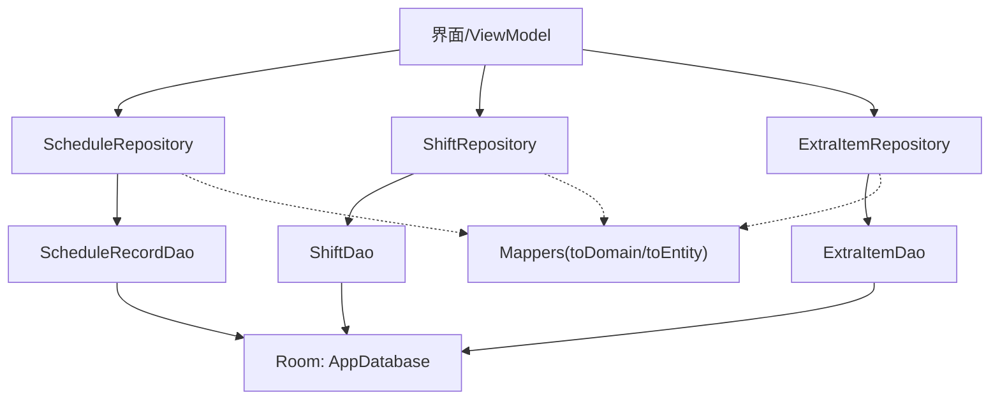
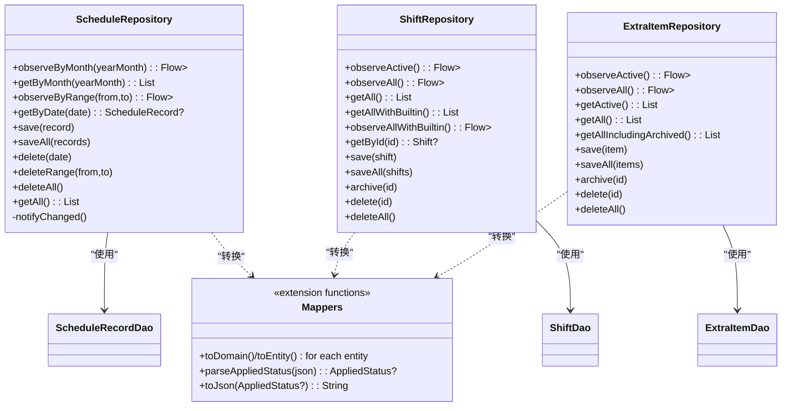
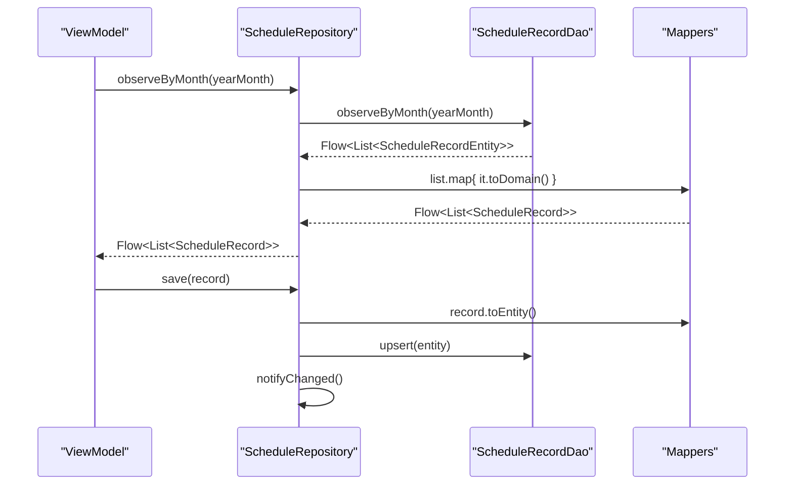
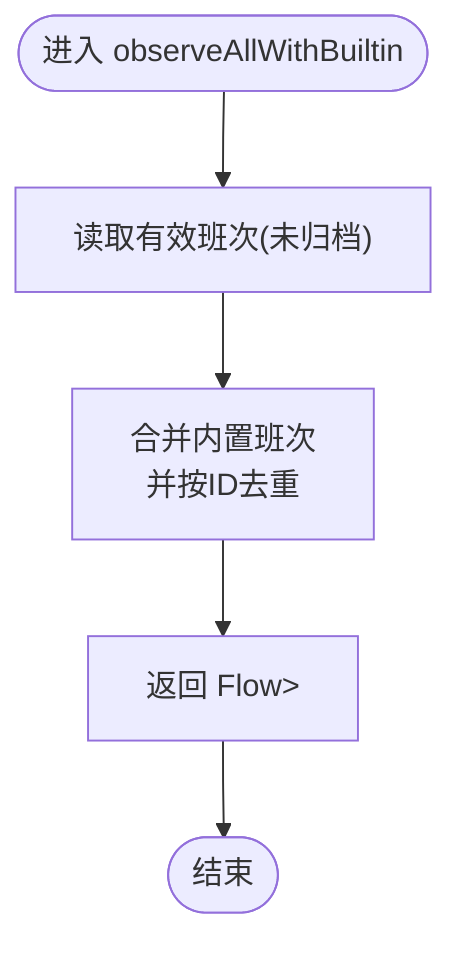
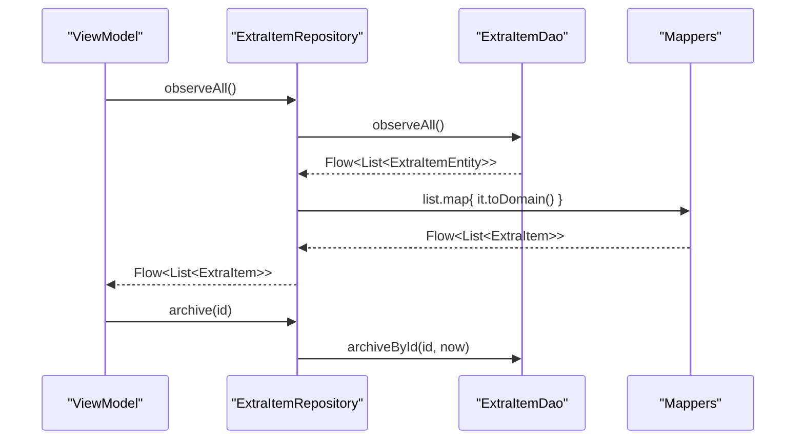
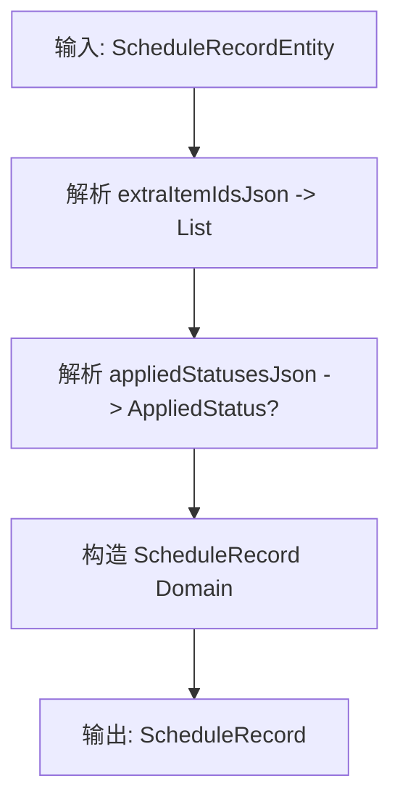
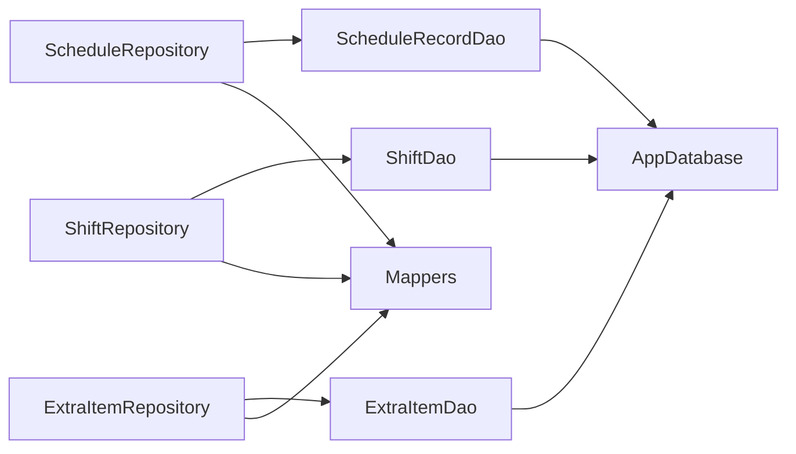

# 仓库模式实现

<cite>
**本文引用的文件**
- [ScheduleRepository.kt](file://app/src/main/java/com/schedulecalendar/app/data/repository/ScheduleRepository.kt)
- [ShiftRepository.kt](file://app/src/main/java/com/schedulecalendar/app/data/repository/ShiftRepository.kt)
- [ExtraItemRepository.kt](file://app/src/main/java/com/schedulecalendar/app/data/repository/ExtraItemRepository.kt)
- [Mappers.kt](file://app/src/main/java/com/schedulecalendar/app/data/repository/Mappers.kt)
- [AppDatabase.kt](file://app/src/main/java/com/schedulecalendar/app/data/db/AppDatabase.kt)
- [ScheduleRecordDao.kt](file://app/src/main/java/com/schedulecalendar/app/data/db/dao/ScheduleRecordDao.kt)
- [ShiftDao.kt](file://app/src/main/java/com/schedulecalendar/app/data/db/dao/ShiftDao.kt)
- [ExtraItemDao.kt](file://app/src/main/java/com/schedulecalendar/app/data/db/dao/ExtraItemDao.kt)
- [ShiftBreakDao.kt](file://app/src/main/java/com/schedulecalendar/app/data/db/dao/ShiftBreakDao.kt)
- [ShiftStatusDao.kt](file://app/src/main/java/com/schedulecalendar/app/data/db/dao/ShiftStatusDao.kt)
- [ScheduleRecordEntity.kt](file://app/src/main/java/com/schedulecalendar/app/data/db/entity/ScheduleRecordEntity.kt)
- [ShiftEntity.kt](file://app/src/main/java/com/schedulecalendar/app/data/db/entity/ShiftEntity.kt)
- [ExtraItemEntity.kt](file://app/src/main/java/com/schedulecalendar/app/data/db/entity/ExtraItemEntity.kt)
- [ShiftBreakEntity.kt](file://app/src/main/java/com/schedulecalendar/app/data/db/entity/ShiftBreakEntity.kt)
- [ShiftStatusEntity.kt](file://app/src/main/java/com/schedulecalendar/app/data/db/entity/ShiftStatusEntity.kt)
- [Models.kt](file://app/src/main/java/com/schedulecalendar/app/domain/model/Models.kt)
</cite>

## 目录
1. [简介](#简介)
2. [项目结构](#项目结构)
3. [核心组件](#核心组件)
4. [架构总览](#架构总览)
5. [详细组件分析](#详细组件分析)
6. [依赖关系分析](#依赖关系分析)
7. [性能与一致性](#性能与一致性)
8. [错误处理与重试](#错误处理与重试)
9. [测试策略与Mock方案](#测试策略与mock方案)
10. [结论](#结论)

## 简介
本文件围绕仓库层（Repository）的实现，系统化阐述数据访问抽象、领域模型映射、异步响应式流、归档与一致性策略，以及面向排班、班次、附加项目的职责划分。文档同时给出架构图、类图与时序图，帮助读者快速理解从UI到数据库的完整数据通路。

## 项目结构
仓库层位于 data/repository 包，负责：
- 暴露给上层（ViewModel/UI）的领域级API
- 将DAO返回的Entity转换为Domain Model
- 管理内置数据与业务规则（如内置班次合并）
- 通过Flow提供响应式数据流，并在写操作后发出刷新信号

图表来源
- [ScheduleRepository.kt:1-40](file://app/src/main/java/com/schedulecalendar/app/data/repository/ScheduleRepository.kt#L1-L40)
- [ShiftRepository.kt:1-45](file://app/src/main/java/com/schedulecalendar/app/data/repository/ShiftRepository.kt#L1-L45)
- [ExtraItemRepository.kt:1-31](file://app/src/main/java/com/schedulecalendar/app/data/repository/ExtraItemRepository.kt#L1-L31)
- [Mappers.kt:1-134](file://app/src/main/java/com/schedulecalendar/app/data/repository/Mappers.kt#L1-L134)
- [AppDatabase.kt:1-35](file://app/src/main/java/com/schedulecalendar/app/data/db/AppDatabase.kt#L1-L35)

章节来源
- [ScheduleRepository.kt:1-40](file://app/src/main/java/com/schedulecalendar/app/data/repository/ScheduleRepository.kt#L1-L40)
- [ShiftRepository.kt:1-45](file://app/src/main/java/com/schedulecalendar/app/data/repository/ShiftRepository.kt#L1-L45)
- [ExtraItemRepository.kt:1-31](file://app/src/main/java/com/schedulecalendar/app/data/repository/ExtraItemRepository.kt#L1-L31)
- [Mappers.kt:1-134](file://app/src/main/java/com/schedulecalendar/app/data/repository/Mappers.kt#L1-L134)
- [AppDatabase.kt:1-35](file://app/src/main/java/com/schedulecalendar/app/data/db/AppDatabase.kt#L1-L35)

## 核心组件
- ScheduleRepository：排班记录的数据访问入口，提供按月份/范围观察、单条查询、增删改及变更信号通知。
- ShiftRepository：班次管理，支持有效/全部/含内置的查询与保存，并提供逻辑删除（归档）。
- ExtraItemRepository：附加补贴/扣款项目管理，支持有效/全部（含归档）查询与归档。
- Mappers：统一负责Entity与Domain Model之间的双向转换，包含JSON字段解析与枚举安全转换。

章节来源
- [ScheduleRepository.kt:1-40](file://app/src/main/java/com/schedulecalendar/app/data/repository/ScheduleRepository.kt#L1-L40)
- [ShiftRepository.kt:1-45](file://app/src/main/java/com/schedulecalendar/app/data/repository/ShiftRepository.kt#L1-L45)
- [ExtraItemRepository.kt:1-31](file://app/src/main/java/com/schedulecalendar/app/data/repository/ExtraItemRepository.kt#L1-L31)
- [Mappers.kt:1-134](file://app/src/main/java/com/schedulecalendar/app/data/repository/Mappers.kt#L1-L134)

## 架构总览
仓库层采用“Repository + DAO + Entity + Mapper”的分层设计：
- Repository：聚合业务语义，屏蔽底层存储细节；对外暴露领域模型与Flow。
- DAO：Room注解接口，定义SQL查询与CRUD操作，返回Entity或Flow<List<Entity>>。
- Entity：Room持久化对象，对应数据库表结构。
- Mapper：在Repository中调用，完成Entity与Domain Model的双向转换。

图表来源
- [ScheduleRepository.kt:1-40](file://app/src/main/java/com/schedulecalendar/app/data/repository/ScheduleRepository.kt#L1-L40)
- [ShiftRepository.kt:1-45](file://app/src/main/java/com/schedulecalendar/app/data/repository/ShiftRepository.kt#L1-L45)
- [ExtraItemRepository.kt:1-31](file://app/src/main/java/com/schedulecalendar/app/data/repository/ExtraItemRepository.kt#L1-L31)
- [Mappers.kt:1-134](file://app/src/main/java/com/schedulecalendar/app/data/repository/Mappers.kt#L1-L134)
- [ScheduleRecordDao.kt:1-40](file://app/src/main/java/com/schedulecalendar/app/data/db/dao/ScheduleRecordDao.kt#L1-L40)
- [ShiftDao.kt:1-42](file://app/src/main/java/com/schedulecalendar/app/data/db/dao/ShiftDao.kt#L1-L42)
- [ExtraItemDao.kt:1-41](file://app/src/main/java/com/schedulecalendar/app/data/db/dao/ExtraItemDao.kt#L1-L41)

## 详细组件分析

### ScheduleRepository：排班业务逻辑
- 职责
  - 提供按月份/日期范围/单日查询能力
  - 提供批量插入/更新（upsert）、删除与清空
  - 维护一个共享信号流，用于写操作后触发UI刷新
- 关键流程
  - 读路径：DAO返回Flow<List<Entity>> -> map为Domain Model列表
  - 写路径：执行DAO写入 -> 发出刷新信号
- 数据源抽象
  - 仅依赖ScheduleRecordDao，不感知具体存储实现
- 一致性保证
  - 通过onConflict=REPLACE确保幂等写入
  - 写操作后发出单一缓冲的刷新信号，避免重复刷新

图表来源
- [ScheduleRepository.kt:22-36](file://app/src/main/java/com/schedulecalendar/app/data/repository/ScheduleRepository.kt#L22-L36)
- [ScheduleRecordDao.kt:10-38](file://app/src/main/java/com/schedulecalendar/app/data/db/dao/ScheduleRecordDao.kt#L10-L38)
- [Mappers.kt:92-128](file://app/src/main/java/com/schedulecalendar/app/data/repository/Mappers.kt#L92-L128)

章节来源
- [ScheduleRepository.kt:1-40](file://app/src/main/java/com/schedulecalendar/app/data/repository/ScheduleRepository.kt#L1-L40)
- [ScheduleRecordDao.kt:1-40](file://app/src/main/java/com/schedulecalendar/app/data/db/dao/ScheduleRecordDao.kt#L1-L40)
- [Mappers.kt:92-128](file://app/src/main/java/com/schedulecalendar/app/data/repository/Mappers.kt#L92-L128)

### ShiftRepository：班次管理
- 职责
  - 提供有效/全部/含内置班次的查询
  - 提供保存、批量保存、归档（逻辑删除）、物理删除
- 内置数据融合
  - getAllWithBuiltin/observeAllWithBuiltin 会将内置班次与用户数据合并，并去重
- 数据源抽象
  - 仅依赖ShiftDao
- 一致性保证
  - 对非内置班次进行upsert；内置班次不参与持久化
  - 归档通过设置时间戳实现，便于历史追溯

图表来源
- [ShiftRepository.kt:27-32](file://app/src/main/java/com/schedulecalendar/app/data/repository/ShiftRepository.kt#L27-L32)
- [ShiftDao.kt:11-18](file://app/src/main/java/com/schedulecalendar/app/data/db/dao/ShiftDao.kt#L11-L18)
- [Models.kt:68-72](file://app/src/main/java/com/schedulecalendar/app/domain/model/Models.kt#L68-L72)

章节来源
- [ShiftRepository.kt:1-45](file://app/src/main/java/com/schedulecalendar/app/data/repository/ShiftRepository.kt#L1-L45)
- [ShiftDao.kt:1-42](file://app/src/main/java/com/schedulecalendar/app/data/db/dao/ShiftDao.kt#L1-L42)
- [Models.kt:68-72](file://app/src/main/java/com/schedulecalendar/app/domain/model/Models.kt#L68-L72)

### ExtraItemRepository：附加项目管理
- 职责
  - 提供有效/全部（含归档）查询
  - 提供保存、批量保存、归档、物理删除
- 数据源抽象
  - 仅依赖ExtraItemDao
- 一致性保证
  - 归档通过设置时间戳实现，保留历史金额用于薪资计算

图表来源
- [ExtraItemRepository.kt:16-28](file://app/src/main/java/com/schedulecalendar/app/data/repository/ExtraItemRepository.kt#L16-L28)
- [ExtraItemDao.kt:11-33](file://app/src/main/java/com/schedulecalendar/app/data/db/dao/ExtraItemDao.kt#L11-L33)
- [Mappers.kt:132-134](file://app/src/main/java/com/schedulecalendar/app/data/repository/Mappers.kt#L132-L134)

章节来源
- [ExtraItemRepository.kt:1-31](file://app/src/main/java/com/schedulecalendar/app/data/repository/ExtraItemRepository.kt#L1-L31)
- [ExtraItemDao.kt:1-41](file://app/src/main/java/com/schedulecalendar/app/data/db/dao/ExtraItemDao.kt#L1-L41)
- [Mappers.kt:132-134](file://app/src/main/java/com/schedulecalendar/app/data/repository/Mappers.kt#L132-L134)

### Mappers：数据转换与兼容
- 职责
  - 提供各Entity与Domain Model的双向转换
  - 处理JSON字段（如extraItemIdsJson、appliedStatusesJson、linkedExtraIdsJson）
  - 提供AppliedStatus的旧数组格式与新对象格式的兼容解析
- 复杂度与健壮性
  - JSON解析失败时回退为空集合或null，避免崩溃
  - 枚举转换使用安全包装，防止非法值导致异常

图表来源
- [Mappers.kt:92-128](file://app/src/main/java/com/schedulecalendar/app/data/repository/Mappers.kt#L92-L128)
- [Mappers.kt:62-88](file://app/src/main/java/com/schedulecalendar/app/data/repository/Mappers.kt#L62-L88)

章节来源
- [Mappers.kt:1-134](file://app/src/main/java/com/schedulecalendar/app/data/repository/Mappers.kt#L1-L134)

## 依赖关系分析
- 组件耦合
  - Repository仅依赖DAO接口，低耦合、高内聚
  - Mapper以扩展函数形式集中管理，避免在各Repository中散落转换逻辑
- 外部依赖
  - Room数据库（AppDatabase + Dao）
  - Gson用于复杂字段序列化/反序列化
- 循环依赖
  - 未发现循环依赖；Mapper无运行时状态，纯函数式转换

图表来源
- [AppDatabase.kt:17-34](file://app/src/main/java/com/schedulecalendar/app/data/db/AppDatabase.kt#L17-L34)
- [ScheduleRepository.kt:1-40](file://app/src/main/java/com/schedulecalendar/app/data/repository/ScheduleRepository.kt#L1-L40)
- [ShiftRepository.kt:1-45](file://app/src/main/java/com/schedulecalendar/app/data/repository/ShiftRepository.kt#L1-L45)
- [ExtraItemRepository.kt:1-31](file://app/src/main/java/com/schedulecalendar/app/data/repository/ExtraItemRepository.kt#L1-L31)
- [Mappers.kt:1-134](file://app/src/main/java/com/schedulecalendar/app/data/repository/Mappers.kt#L1-L134)

章节来源
- [AppDatabase.kt:1-35](file://app/src/main/java/com/schedulecalendar/app/data/db/AppDatabase.kt#L1-L35)
- [ScheduleRepository.kt:1-40](file://app/src/main/java/com/schedulecalendar/app/data/repository/ScheduleRepository.kt#L1-L40)
- [ShiftRepository.kt:1-45](file://app/src/main/java/com/schedulecalendar/app/data/repository/ShiftRepository.kt#L1-L45)
- [ExtraItemRepository.kt:1-31](file://app/src/main/java/com/schedulecalendar/app/data/repository/ExtraItemRepository.kt#L1-L31)
- [Mappers.kt:1-134](file://app/src/main/java/com/schedulecalendar/app/data/repository/Mappers.kt#L1-L134)

## 性能与一致性
- 响应式与缓存
  - 所有读操作均基于Room Flow，自动利用SQLite变更监听，无需手动缓存
  - 写操作后通过SharedFlow发出一次刷新信号，减少不必要的UI重建
- 并发与线程
  - DAO方法标注suspend，默认在IO调度器执行；Repository内部map在相同协程上下文执行
- 一致性
  - 使用REPLACE策略保证幂等写入
  - 归档字段archivedAt用于逻辑删除，保障历史数据可追溯
- 内存与CPU
  - JSON解析集中在Mapper，避免重复解析；对空/无效JSON做容错处理

[本节为通用指导，不直接分析具体文件]

## 错误处理与重试
- 错误处理
  - 枚举转换使用安全包装，避免非法字符串导致崩溃
  - JSON解析失败时返回空集合或null，保持系统稳定
- 重试机制
  - 当前仓库层未实现显式重试；如需网络或外部I/O，可在更高层封装重试策略
- 验证逻辑
  - 数据校验建议在UI/ViewModel层进行，Repository专注数据存取与转换

章节来源
- [Mappers.kt:92-128](file://app/src/main/java/com/schedulecalendar/app/data/repository/Mappers.kt#L92-L128)
- [Mappers.kt:62-88](file://app/src/main/java/com/schedulecalendar/app/data/repository/Mappers.kt#L62-L88)

## 测试策略与Mock方案
- 单元测试
  - 针对Mapper编写用例，覆盖正常、空串、null、旧数组格式、新对象格式等边界情况
- 集成测试
  - 使用Room In-Memory Database替代真实数据库，验证DAO SQL与Repository行为
- Mock策略
  - 对Repository的DAO依赖注入点使用Mock对象，模拟Flow发射与返回值
  - 对Gson相关解析可使用独立测试数据文件，避免硬编码
- 示例思路
  - 验证observeByMonth返回的Flow在数据变更后能触发下游收集
  - 验证getAllWithBuiltin合并结果的正确性与去重逻辑

[本节为通用指导，不直接分析具体文件]

## 结论
仓库层通过清晰的职责划分与统一的Mapper，实现了稳定的数据访问抽象与领域模型转换。借助Room Flow与SharedFlow，系统在响应式与一致性方面表现良好。后续可在需要处引入更完善的错误处理与重试策略，并通过完善的测试套件保障长期演进质量。