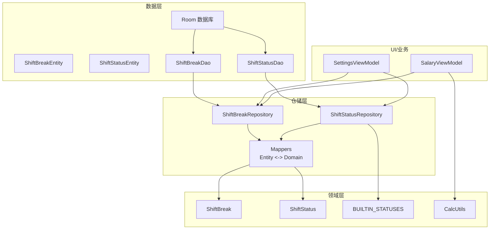
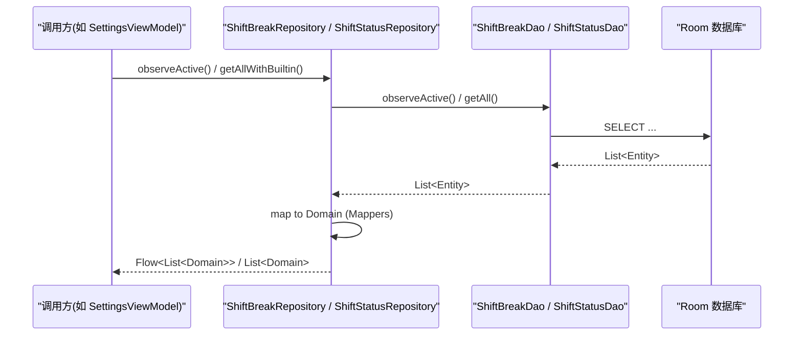
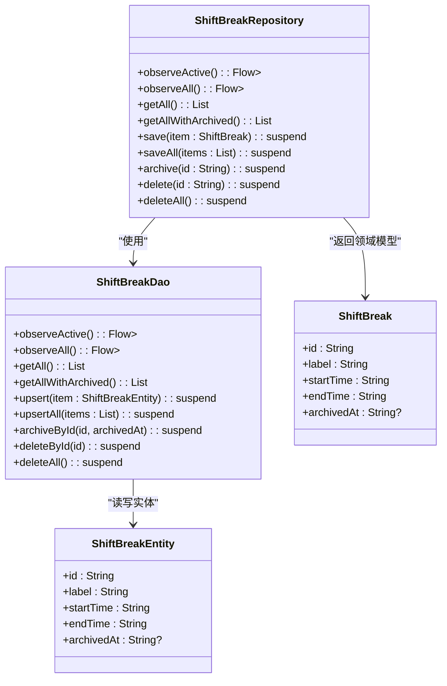
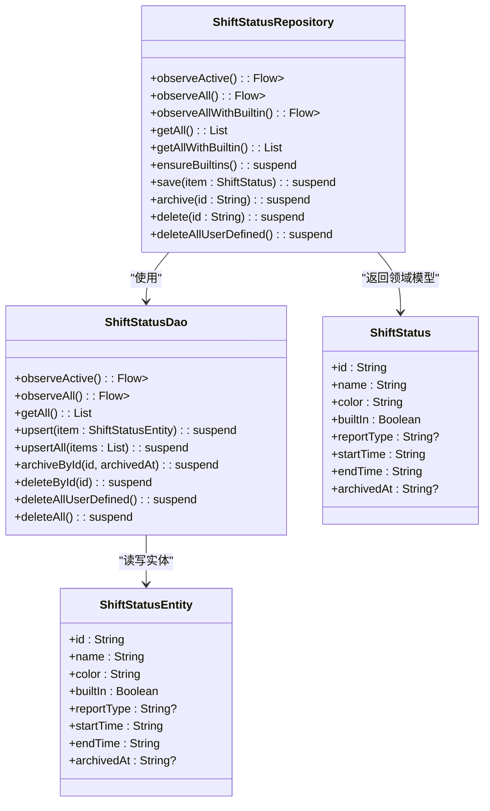
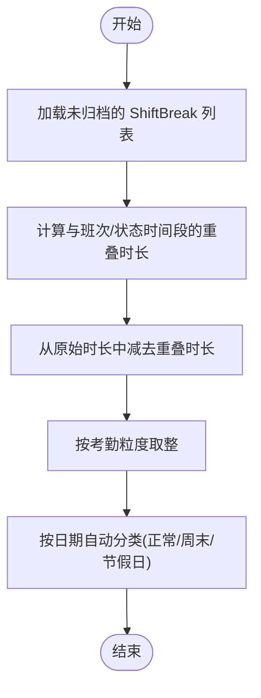
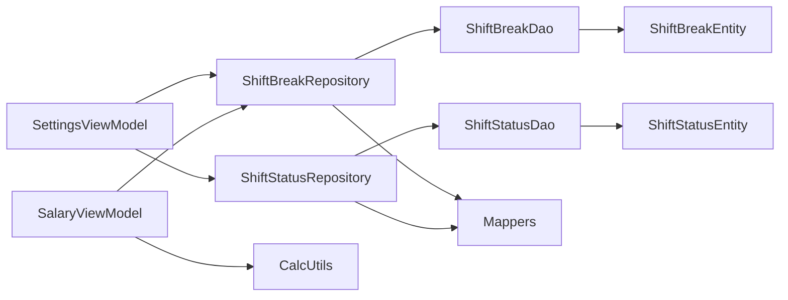

# 休息状态仓库实现

<cite>
**本文引用的文件列表**
- [ShiftBreakRepository.kt](file://app/src/main/java/com/schedulecalendar/app/data/repository/ShiftBreakRepository.kt)
- [ShiftStatusRepository.kt](file://app/src/main/java/com/schedulecalendar/app/data/repository/ShiftStatusRepository.kt)
- [ShiftBreakEntity.kt](file://app/src/main/java/com/schedulecalendar/app/data/db/entity/ShiftBreakEntity.kt)
- [ShiftStatusEntity.kt](file://app/src/main/java/com/schedulecalendar/app/data/db/entity/ShiftStatusEntity.kt)
- [ShiftBreakDao.kt](file://app/src/main/java/com/schedulecalendar/app/data/db/dao/ShiftBreakDao.kt)
- [ShiftStatusDao.kt](file://app/src/main/java/com/schedulecalendar/app/data/db/dao/ShiftStatusDao.kt)
- [Mappers.kt](file://app/src/main/java/com/schedulecalendar/app/data/repository/Mappers.kt)
- [Models.kt](file://app/src/main/java/com/schedulecalendar/app/domain/model/Models.kt)
- [CalcUtils.kt](file://app/src/main/java/com/schedulecalendar/app/domain/model/CalcUtils.kt)
- [SettingsViewModel.kt](file://app/src/main/java/com/schedulecalendar/app/ui/settings/SettingsViewModel.kt)
- [SalaryViewModel.kt](file://app/src/main/java/com/schedulecalendar/app/ui/salary/SalaryViewModel.kt)
</cite>

## 目录
1. [简介](#简介)
2. [项目结构](#项目结构)
3. [核心组件](#核心组件)
4. [架构总览](#架构总览)
5. [详细组件分析](#详细组件分析)
6. [依赖关系分析](#依赖关系分析)
7. [性能与一致性](#性能与一致性)
8. [故障排查指南](#故障排查指南)
9. [结论](#结论)
10. [附录：使用示例与报表生成](#附录使用示例与报表生成)

## 简介
本文件围绕“休息时间”和“工作状态”两个维度，系统化阐述 ShiftBreakRepository 与 ShiftStatusRepository 的设计与实现。重点覆盖：
- 休息时间类型、时长计算与统计
- 工作状态（请假、调休等）的创建、归档与内置保障
- 休息与工作状态的关联逻辑及其对工时计算的影响
- 数据一致性与同步机制
- 典型用法示例与报表输出路径
- 边界情况处理与性能优化要点

## 项目结构
该功能位于数据层与领域层的衔接处：
- 数据实体：ShiftBreakEntity、ShiftStatusEntity
- DAO 访问：ShiftBreakDao、ShiftStatusDao
- 仓储接口：ShiftBreakRepository、ShiftStatusRepository
- 领域模型：ShiftBreak、ShiftStatus、BUILTIN_STATUSES、AppliedStatus 等
- 计算工具：CalcUtils（全局休息扣减、工作日/周末/节假日分类、薪资汇总）
- UI/业务集成：SettingsViewModel、SalaryViewModel 等消费仓储并驱动报表

图表来源
- [ShiftBreakRepository.kt:1-27](file://app/src/main/java/com/schedulecalendar/app/data/repository/ShiftBreakRepository.kt#L1-L27)
- [ShiftStatusRepository.kt:1-54](file://app/src/main/java/com/schedulecalendar/app/data/repository/ShiftStatusRepository.kt#L1-L54)
- [ShiftBreakDao.kt:1-39](file://app/src/main/java/com/schedulecalendar/app/data/db/dao/ShiftBreakDao.kt#L1-L39)
- [ShiftStatusDao.kt:1-39](file://app/src/main/java/com/schedulecalendar/app/data/db/dao/ShiftStatusDao.kt#L1-L39)
- [Mappers.kt:50-58](file://app/src/main/java/com/schedulecalendar/app/data/repository/Mappers.kt#L50-L58)
- [Models.kt:14-35](file://app/src/main/java/com/schedulecalendar/app/domain/model/Models.kt#L14-L35)
- [Models.kt:74-78](file://app/src/main/java/com/schedulecalendar/app/domain/model/Models.kt#L74-L78)
- [CalcUtils.kt:121-134](file://app/src/main/java/com/schedulecalendar/app/domain/model/CalcUtils.kt#L121-L134)
- [SettingsViewModel.kt:34-42](file://app/src/main/java/com/schedulecalendar/app/ui/settings/SettingsViewModel.kt#L34-L42)
- [SalaryViewModel.kt:49-58](file://app/src/main/java/com/schedulecalendar/app/ui/salary/SalaryViewModel.kt#L49-L58)

章节来源
- [ShiftBreakRepository.kt:1-27](file://app/src/main/java/com/schedulecalendar/app/data/repository/ShiftBreakRepository.kt#L1-L27)
- [ShiftStatusRepository.kt:1-54](file://app/src/main/java/com/schedulecalendar/app/data/repository/ShiftStatusRepository.kt#L1-L54)
- [ShiftBreakDao.kt:1-39](file://app/src/main/java/com/schedulecalendar/app/data/db/dao/ShiftBreakDao.kt#L1-L39)
- [ShiftStatusDao.kt:1-39](file://app/src/main/java/com/schedulecalendar/app/data/db/dao/ShiftStatusDao.kt#L1-L39)
- [Mappers.kt:50-58](file://app/src/main/java/com/schedulecalendar/app/data/repository/Mappers.kt#L50-L58)
- [Models.kt:14-35](file://app/src/main/java/com/schedulecalendar/app/domain/model/Models.kt#L14-L35)
- [Models.kt:74-78](file://app/src/main/java/com/schedulecalendar/app/domain/model/Models.kt#L74-L78)
- [CalcUtils.kt:121-134](file://app/src/main/java/com/schedulecalendar/app/domain/model/CalcUtils.kt#L121-L134)
- [SettingsViewModel.kt:34-42](file://app/src/main/java/com/schedulecalendar/app/ui/settings/SettingsViewModel.kt#L34-L42)
- [SalaryViewModel.kt:49-58](file://app/src/main/java/com/schedulecalendar/app/ui/salary/SalaryViewModel.kt#L49-L58)

## 核心组件
- ShiftBreakRepository：提供对“全局不计入工时时段”的增删改查与观察能力，支持有效/全部、归档与批量保存。
- ShiftStatusRepository：提供对“班次状态类型”的管理，包含内置状态保障、去重合并、观察与持久化。
- Mappers：负责 Entity 与 Domain 的双向映射，确保仓储层对外暴露领域模型。
- Models：定义领域模型（ShiftBreak、ShiftStatus、内置常量等）。
- CalcUtils：基于 ShiftBreak 进行全局休息扣减，结合 AppliedStatus 与日期属性完成工时/薪资计算。

章节来源
- [ShiftBreakRepository.kt:1-27](file://app/src/main/java/com/schedulecalendar/app/data/repository/ShiftBreakRepository.kt#L1-L27)
- [ShiftStatusRepository.kt:1-54](file://app/src/main/java/com/schedulecalendar/app/data/repository/ShiftStatusRepository.kt#L1-L54)
- [Mappers.kt:50-58](file://app/src/main/java/com/schedulecalendar/app/data/repository/Mappers.kt#L50-L58)
- [Models.kt:14-35](file://app/src/main/java/com/schedulecalendar/app/domain/model/Models.kt#L14-L35)
- [Models.kt:74-78](file://app/src/main/java/com/schedulecalendar/app/domain/model/Models.kt#L74-L78)
- [CalcUtils.kt:121-134](file://app/src/main/java/com/schedulecalendar/app/domain/model/CalcUtils.kt#L121-L134)

## 架构总览
仓储层通过 DAO 访问 Room 数据库，返回 Flow<List<Domain>> 供上层实时订阅；同时提供 suspend 方法用于一次性读取。仓储内部统一做 Entity 到 Domain 的转换，屏蔽存储细节。

图表来源
- [ShiftBreakRepository.kt:15-21](file://app/src/main/java/com/schedulecalendar/app/data/repository/ShiftBreakRepository.kt#L15-L21)
- [ShiftStatusRepository.kt:16-39](file://app/src/main/java/com/schedulecalendar/app/data/repository/ShiftStatusRepository.kt#L16-L39)
- [ShiftBreakDao.kt:10-21](file://app/src/main/java/com/schedulecalendar/app/data/db/dao/ShiftBreakDao.kt#L10-L21)
- [ShiftStatusDao.kt:10-18](file://app/src/main/java/com/schedulecalendar/app/data/db/dao/ShiftStatusDao.kt#L10-L18)
- [Mappers.kt:50-58](file://app/src/main/java/com/schedulecalendar/app/data/repository/Mappers.kt#L50-L58)

## 详细组件分析

### 休息时间管理：ShiftBreakRepository
职责
- 暴露有效/全部休息时段的 Flow 与快照查询
- 支持 upsert、批量 upsert、归档（逻辑删除）、物理删除
- 将 Entity 转换为领域模型 ShiftBreak

关键行为
- observeActive：仅返回 archivedAt 为 null 的记录，按 startTime 排序
- observeAll：返回所有记录（含已归档），按 startTime 排序
- archive：设置 archivedAt 为当前时间戳，实现软删除
- save/saveAll：upsert 单条或多条

数据模型
- ShiftBreak：id、label、startTime(HH:mm)、endTime(HH:mm)、archivedAt?

图表来源
- [ShiftBreakRepository.kt:11-26](file://app/src/main/java/com/schedulecalendar/app/data/repository/ShiftBreakRepository.kt#L11-L26)
- [ShiftBreakDao.kt:8-38](file://app/src/main/java/com/schedulecalendar/app/data/db/dao/ShiftBreakDao.kt#L8-L38)
- [ShiftBreakEntity.kt:7-16](file://app/src/main/java/com/schedulecalendar/app/data/db/entity/ShiftBreakEntity.kt#L7-L16)
- [Models.kt:14-20](file://app/src/main/java/com/schedulecalendar/app/domain/model/Models.kt#L14-L20)

章节来源
- [ShiftBreakRepository.kt:1-27](file://app/src/main/java/com/schedulecalendar/app/data/repository/ShiftBreakRepository.kt#L1-L27)
- [ShiftBreakDao.kt:1-39](file://app/src/main/java/com/schedulecalendar/app/data/db/dao/ShiftBreakDao.kt#L1-L39)
- [ShiftBreakEntity.kt:1-16](file://app/src/main/java/com/schedulecalendar/app/data/db/entity/ShiftBreakEntity.kt#L1-L16)
- [Models.kt:14-20](file://app/src/main/java/com/schedulecalendar/app/domain/model/Models.kt#L14-L20)

### 工作状态管理：ShiftStatusRepository
职责
- 暴露有效/全部状态类型的 Flow 与快照查询
- 提供“含内置状态”的视图（内置在前、去重）
- 首次启动保证内置状态存在（ensureBuiltins）
- 支持 upsert、归档、删除用户自定义项

关键行为
- observeAllWithBuiltin：合并 BUILTIN_STATUSES 与数据库结果，内置优先且去重
- ensureBuiltins：对比已有 id 集合，插入缺失的内置状态
- save：若 builtIn=true 则跳过写入，防止覆盖内置
- deleteAllUserDefined：仅删除非内置项

数据模型
- ShiftStatus：id、name、color、builtIn、reportType("leave"/"swap")、startTime、endTime、archivedAt?
- BUILTIN_STATUSES：内置请假与调休两条记录

图表来源
- [ShiftStatusRepository.kt:12-53](file://app/src/main/java/com/schedulecalendar/app/data/repository/ShiftStatusRepository.kt#L12-L53)
- [ShiftStatusDao.kt:8-38](file://app/src/main/java/com/schedulecalendar/app/data/db/dao/ShiftStatusDao.kt#L8-L38)
- [ShiftStatusEntity.kt:7-19](file://app/src/main/java/com/schedulecalendar/app/data/db/entity/ShiftStatusEntity.kt#L7-L19)
- [Models.kt:22-35](file://app/src/main/java/com/schedulecalendar/app/domain/model/Models.kt#L22-L35)
- [Models.kt:74-78](file://app/src/main/java/com/schedulecalendar/app/domain/model/Models.kt#L74-L78)

章节来源
- [ShiftStatusRepository.kt:1-54](file://app/src/main/java/com/schedulecalendar/app/data/repository/ShiftStatusRepository.kt#L1-L54)
- [ShiftStatusDao.kt:1-39](file://app/src/main/java/com/schedulecalendar/app/data/db/dao/ShiftStatusDao.kt#L1-L39)
- [ShiftStatusEntity.kt:1-19](file://app/src/main/java/com/schedulecalendar/app/data/db/entity/ShiftStatusEntity.kt#L1-L19)
- [Models.kt:22-35](file://app/src/main/java/com/schedulecalendar/app/domain/model/Models.kt#L22-L35)
- [Models.kt:74-78](file://app/src/main/java/com/schedulecalendar/app/domain/model/Models.kt#L74-L78)

### 休息时间与工作状态对工时计算的影响
- 全局休息扣减：CalcUtils.calcGlobalBreakHours 根据 ShiftBreak 列表与班次时间窗口计算重叠时长，从实际工作时长中扣除。
- 附加状态时间段：AppliedStatus 可指定 startTime/endTime，在普通班次中直接扣减对应时长；在 REST/SWAP 模式下，若附带时间段则按该段计算工时（同样应用全局休息扣减）。
- 报告类型映射：ShiftStatus.reportType 为 "leave"/"swap" 时，月统计会累计 leaveStatusHours/swapStatusHours，参与请假折算与调休统计。

图表来源
- [CalcUtils.kt:121-134](file://app/src/main/java/com/schedulecalendar/app/domain/model/CalcUtils.kt#L121-L134)
- [CalcUtils.kt:149-230](file://app/src/main/java/com/schedulecalendar/app/domain/model/CalcUtils.kt#L149-L230)
- [Models.kt:37-42](file://app/src/main/java/com/schedulecalendar/app/domain/model/Models.kt#L37-L42)
- [Models.kt:22-35](file://app/src/main/java/com/schedulecalendar/app/domain/model/Models.kt#L22-L35)

章节来源
- [CalcUtils.kt:121-134](file://app/src/main/java/com/schedulecalendar/app/domain/model/CalcUtils.kt#L121-L134)
- [CalcUtils.kt:149-230](file://app/src/main/java/com/schedulecalendar/app/domain/model/CalcUtils.kt#L149-L230)
- [Models.kt:37-42](file://app/src/main/java/com/schedulecalendar/app/domain/model/Models.kt#L37-L42)
- [Models.kt:22-35](file://app/src/main/java/com/schedulecalendar/app/domain/model/Models.kt#L22-L35)

## 依赖关系分析
- Repository 依赖 DAO，DAO 依赖 Room 实体表
- Repository 依赖 Mappers 进行 Entity/Domain 转换
- UI/业务层通过 Hilt 注入 Repository，订阅 Flow 或调用 suspend 方法
- 计算模块 CalcUtils 依赖领域模型与配置，不直接依赖仓储

图表来源
- [SettingsViewModel.kt:34-42](file://app/src/main/java/com/schedulecalendar/app/ui/settings/SettingsViewModel.kt#L34-L42)
- [SalaryViewModel.kt:49-58](file://app/src/main/java/com/schedulecalendar/app/ui/salary/SalaryViewModel.kt#L49-L58)
- [ShiftBreakRepository.kt:11-21](file://app/src/main/java/com/schedulecalendar/app/data/repository/ShiftBreakRepository.kt#L11-L21)
- [ShiftStatusRepository.kt:16-39](file://app/src/main/java/com/schedulecalendar/app/data/repository/ShiftStatusRepository.kt#L16-L39)
- [Mappers.kt:50-58](file://app/src/main/java/com/schedulecalendar/app/data/repository/Mappers.kt#L50-L58)

章节来源
- [SettingsViewModel.kt:34-42](file://app/src/main/java/com/schedulecalendar/app/ui/settings/SettingsViewModel.kt#L34-L42)
- [SalaryViewModel.kt:49-58](file://app/src/main/java/com/schedulecalendar/app/ui/salary/SalaryViewModel.kt#L49-L58)
- [ShiftBreakRepository.kt:11-21](file://app/src/main/java/com/schedulecalendar/app/data/repository/ShiftBreakRepository.kt#L11-L21)
- [ShiftStatusRepository.kt:16-39](file://app/src/main/java/com/schedulecalendar/app/data/repository/ShiftStatusRepository.kt#L16-L39)
- [Mappers.kt:50-58](file://app/src/main/java/com/schedulecalendar/app/data/repository/Mappers.kt#L50-L58)

## 性能与一致性
- 响应式更新：Repository 暴露 Flow，避免频繁轮询；UI 侧按需订阅，减少无效计算。
- 排序与过滤：DAO 层在 SQL 中完成排序与过滤（如 archivedAt IS NULL、builtIn DESC），降低内存开销。
- 幂等写入：upsert 使用 REPLACE 策略，避免重复插入导致的数据膨胀。
- 软删除：archive 仅更新 archivedAt，保留历史数据便于审计与恢复。
- 内置保障：ensureBuiltins 在首次启动时补齐缺失的内置状态，避免运行时空引用。
- 去重合并：observeAllWithBuiltin 在内存中进行去重与拼接，保证内置始终在最前且唯一。

章节来源
- [ShiftBreakDao.kt:10-21](file://app/src/main/java/com/schedulecalendar/app/data/db/dao/ShiftBreakDao.kt#L10-L21)
- [ShiftStatusDao.kt:10-18](file://app/src/main/java/com/schedulecalendar/app/data/db/dao/ShiftStatusDao.kt#L10-L18)
- [ShiftStatusRepository.kt:24-46](file://app/src/main/java/com/schedulecalendar/app/data/repository/ShiftStatusRepository.kt#L24-L46)
- [ShiftBreakRepository.kt:22-25](file://app/src/main/java/com/schedulecalendar/app/data/repository/ShiftBreakRepository.kt#L22-L25)

## 故障排查指南
- 内置状态缺失：检查 ensureBuiltins 是否被调用；确认 BUILTIN_STATUSES 的 id 未被覆盖。
- 归档后不可见：确认 observeActive 与 observeAll 的使用场景；如需查看已归档数据，使用 getAllWithArchived 或 observeAll。
- 状态未生效：确认 reportType 是否为 "leave"/"swap"；确认 AppliedStatus 的 startTime/endTime 是否填写完整。
- 工时异常：检查 ShiftBreak 的时间段是否与班次/状态时间段有重叠；核对考勤粒度与容忍时长配置。

章节来源
- [ShiftStatusRepository.kt:41-46](file://app/src/main/java/com/schedulecalendar/app/data/repository/ShiftStatusRepository.kt#L41-L46)
- [ShiftBreakRepository.kt:15-21](file://app/src/main/java/com/schedulecalendar/app/data/repository/ShiftBreakRepository.kt#L15-L21)
- [CalcUtils.kt:121-134](file://app/src/main/java/com/schedulecalendar/app/domain/model/CalcUtils.kt#L121-L134)
- [Models.kt:22-35](file://app/src/main/java/com/schedulecalendar/app/domain/model/Models.kt#L22-L35)

## 结论
ShiftBreakRepository 与 ShiftStatusRepository 以清晰的仓储模式封装了休息时间与工作状态的数据访问与领域映射，配合 CalcUtils 实现了严谨的工时与薪资计算。通过 Flow 响应式更新、SQL 层过滤与排序、软删除与内置保障等机制，系统在易用性、一致性与性能之间取得良好平衡。

## 附录：使用示例与报表生成

### 示例一：记录一条休息时间
- 步骤
  - 构造领域模型 ShiftBreak（id、label、startTime、endTime）
  - 调用 ShiftBreakRepository.save(item)
  - 如需批量导入，使用 saveAll(items)
- 参考路径
  - [ShiftBreakRepository.save:20-21](file://app/src/main/java/com/schedulecalendar/app/data/repository/ShiftBreakRepository.kt#L20-L21)
  - [Mappers.toEntity:52-53](file://app/src/main/java/com/schedulecalendar/app/data/repository/Mappers.kt#L52-L53)

### 示例二：设置工作状态（请假/调休）
- 步骤
  - 首次启动调用 ShiftStatusRepository.ensureBuiltins() 保证内置存在
  - 新增自定义状态时调用 save(item)，注意 builtIn=false
  - 需要显示内置+自定义时，使用 observeAllWithBuiltin() 或 getAllWithBuiltin()
- 参考路径
  - [ensureBuiltins:41-46](file://app/src/main/java/com/schedulecalendar/app/data/repository/ShiftStatusRepository.kt#L41-L46)
  - [save:48-48](file://app/src/main/java/com/schedulecalendar/app/data/repository/ShiftStatusRepository.kt#L48-L48)
  - [observeAllWithBuiltin:24-30](file://app/src/main/java/com/schedulecalendar/app/data/repository/ShiftStatusRepository.kt#L24-L30)

### 示例三：生成月度工时与薪资报表
- 步骤
  - 从 ScheduleRepository 获取当月排班记录
  - 从 ShiftBreakRepository 获取未归档的休息时间
  - 从 ShiftStatusRepository 获取状态（含内置）
  - 调用 CalcUtils.calcMonthHours(...) 与 calcMonthSalary(...) 得到汇总
- 参考路径
  - [SalaryViewModel.buildTrend 调用 calcMonthSalary:134-150](file://app/src/main/java/com/schedulecalendar/app/ui/salary/SalaryViewModel.kt#L134-L150)
  - [CalcUtils.calcMonthHours:234-340](file://app/src/main/java/com/schedulecalendar/app/domain/model/CalcUtils.kt#L234-L340)
  - [CalcUtils.calcMonthSalary:344-423](file://app/src/main/java/com/schedulecalendar/app/domain/model/CalcUtils.kt#L344-L423)

### 边界情况与注意事项
- 跨天时间：CalcUtils 对时间范围进行归一化处理，支持跨天计算
- 零时长保护：当扣除后时长 ≤ 0 时，视为无工时
- 粒度取整：按配置的 overtimeGranMin 向下取整，避免微小差异影响统计
- 内置保护：builtIn=true 的状态不允许通过 save 覆盖，需先删除再重建（或通过迁移脚本）

章节来源
- [CalcUtils.kt:33-47](file://app/src/main/java/com/schedulecalendar/app/domain/model/CalcUtils.kt#L33-L47)
- [CalcUtils.kt:149-230](file://app/src/main/java/com/schedulecalendar/app/domain/model/CalcUtils.kt#L149-L230)
- [ShiftStatusRepository.kt:48-48](file://app/src/main/java/com/schedulecalendar/app/data/repository/ShiftStatusRepository.kt#L48-L48)