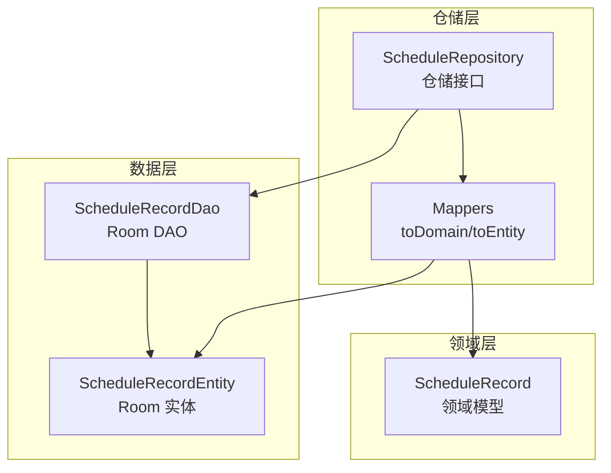
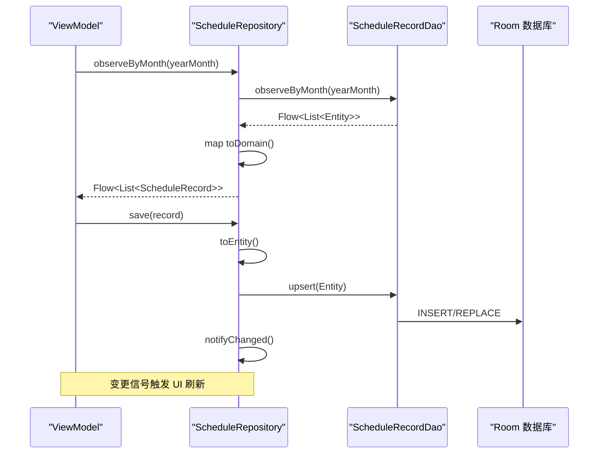
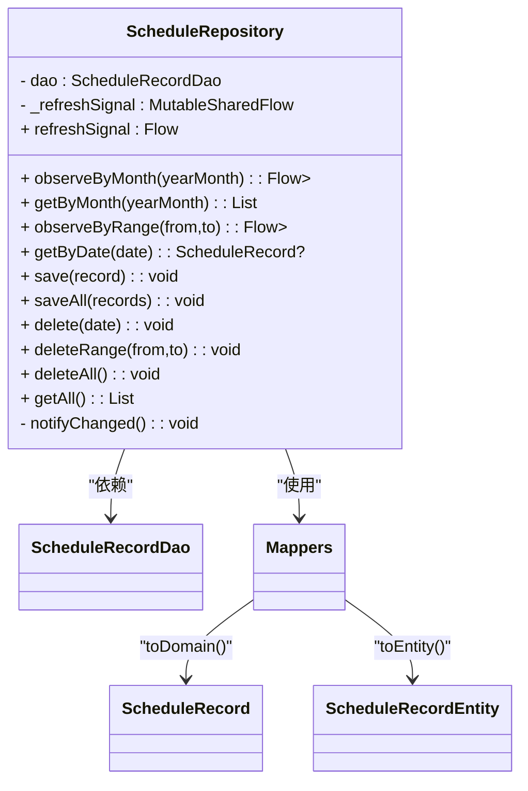
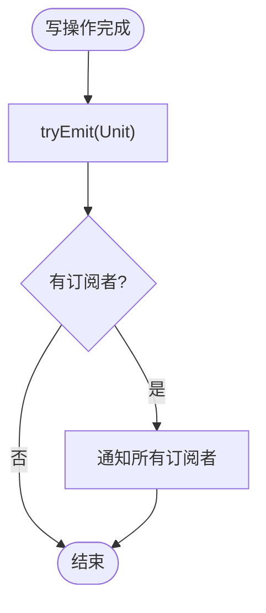
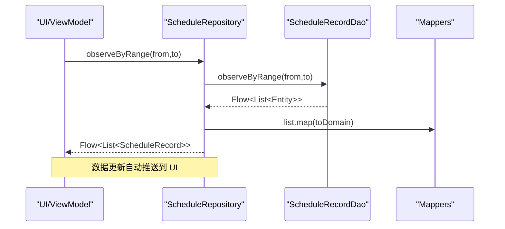
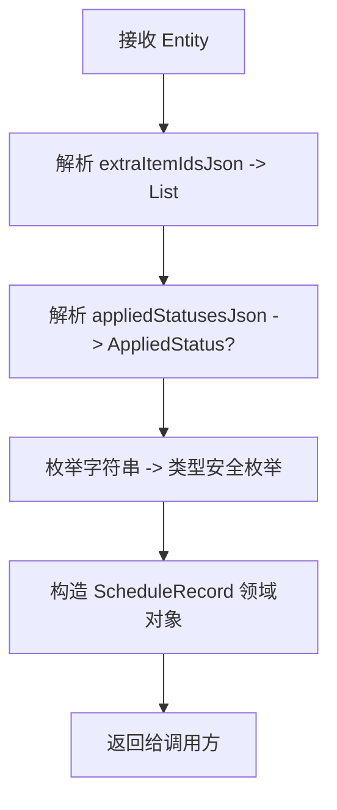
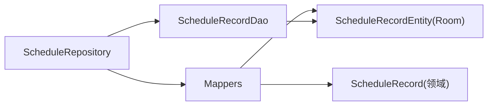

# 排班仓库实现

<cite>
**本文引用的文件**   
- [ScheduleRepository.kt](file://app/src/main/java/com/schedulecalendar/app/data/repository/ScheduleRepository.kt)
- [ScheduleRecordDao.kt](file://app/src/main/java/com/schedulecalendar/app/data/db/dao/ScheduleRecordDao.kt)
- [ScheduleRecordEntity.kt](file://app/src/main/java/com/schedulecalendar/app/data/db/entity/ScheduleRecordEntity.kt)
- [Mappers.kt](file://app/src/main/java/com/schedulecalendar/app/data/repository/Mappers.kt)
- [Models.kt](file://app/src/main/java/com/schedulecalendar/app/domain/model/Models.kt)
</cite>

## 目录
1. [简介](#简介)
2. [项目结构](#项目结构)
3. [核心组件](#核心组件)
4. [架构总览](#架构总览)
5. [详细组件分析](#详细组件分析)
6. [依赖关系分析](#依赖关系分析)
7. [性能与并发特性](#性能与并发特性)
8. [故障排查指南](#故障排查指南)
9. [结论](#结论)
10. [附录：使用示例与最佳实践](#附录使用示例与最佳实践)

## 简介
本文件围绕 ScheduleRepository 的实现，系统性阐述排班数据的仓储层设计。重点覆盖以下方面：
- 数据访问抽象与 Room DAO 的对接
- 按月份、日期范围查询与单条记录操作
- 批量保存与删除
- 基于 MutableSharedFlow 的数据变更信号机制
- 基于 Flow 的响应式数据流（异步）
- Entity 到 Domain Model 的转换逻辑（toDomain/toEntity）
- 面向 ViewModel 的使用方式与最佳实践

## 项目结构
仓库位于 data.repository 包，负责将底层 Room 数据库访问（DAO）与领域模型（domain.model）解耦，并通过 Flow 暴露响应式数据流。

图表来源
- [ScheduleRepository.kt:1-40](file://app/src/main/java/com/schedulecalendar/app/data/repository/ScheduleRepository.kt#L1-L40)
- [ScheduleRecordDao.kt:1-40](file://app/src/main/java/com/schedulecalendar/app/data/db/dao/ScheduleRecordDao.kt#L1-L40)
- [ScheduleRecordEntity.kt:1-26](file://app/src/main/java/com/schedulecalendar/app/data/db/entity/ScheduleRecordEntity.kt#L1-L26)
- [Mappers.kt:1-134](file://app/src/main/java/com/schedulecalendar/app/data/repository/Mappers.kt#L1-L134)
- [Models.kt:81-100](file://app/src/main/java/com/schedulecalendar/app/domain/model/Models.kt#L81-L100)

章节来源
- [ScheduleRepository.kt:1-40](file://app/src/main/java/com/schedulecalendar/app/data/repository/ScheduleRepository.kt#L1-L40)
- [ScheduleRecordDao.kt:1-40](file://app/src/main/java/com/schedulecalendar/app/data/db/dao/ScheduleRecordDao.kt#L1-L40)
- [ScheduleRecordEntity.kt:1-26](file://app/src/main/java/com/schedulecalendar/app/data/db/entity/ScheduleRecordEntity.kt#L1-L26)
- [Mappers.kt:1-134](file://app/src/main/java/com/schedulecalendar/app/data/repository/Mappers.kt#L1-L134)
- [Models.kt:81-100](file://app/src/main/java/com/schedulecalendar/app/domain/model/Models.kt#L81-L100)

## 核心组件
- ScheduleRepository：对外暴露统一的排班数据访问能力，封装了读写、查询、批量操作以及变更通知。
- ScheduleRecordDao：Room DAO，定义 SQL 查询与插入/删除操作，返回 Flow 或 suspend 函数结果。
- ScheduleRecordEntity：Room 持久化实体，字段以 JSON 形式存储复杂集合与状态。
- Mappers：提供 Entity 与 Domain 之间的双向转换，处理枚举、JSON 序列化等细节。
- Models：领域模型定义，如 ScheduleRecord、AppliedStatus、SalaryMode 等。

章节来源
- [ScheduleRepository.kt:13-39](file://app/src/main/java/com/schedulecalendar/app/data/repository/ScheduleRepository.kt#L13-L39)
- [ScheduleRecordDao.kt:8-39](file://app/src/main/java/com/schedulecalendar/app/data/db/dao/ScheduleRecordDao.kt#L8-L39)
- [ScheduleRecordEntity.kt:8-25](file://app/src/main/java/com/schedulecalendar/app/data/db/entity/ScheduleRecordEntity.kt#L8-L25)
- [Mappers.kt:90-128](file://app/src/main/java/com/schedulecalendar/app/data/repository/Mappers.kt#L90-L128)
- [Models.kt:81-100](file://app/src/main/java/com/schedulecalendar/app/domain/model/Models.kt#L81-L100)

## 架构总览
仓库采用“仓储模式 + 响应式编程”的组合：
- 通过 DAO 直接访问数据库，避免在 Repository 中编写 SQL。
- 所有读操作统一转换为领域模型；写操作后发出变更信号，驱动 UI 刷新。
- 使用 Flow 暴露实时数据流，支持按月份、日期范围观察变化。

图表来源
- [ScheduleRepository.kt:22-33](file://app/src/main/java/com/schedulecalendar/app/data/repository/ScheduleRepository.kt#L22-L33)
- [ScheduleRecordDao.kt:10-26](file://app/src/main/java/com/schedulecalendar/app/data/db/dao/ScheduleRecordDao.kt#L10-L26)
- [Mappers.kt:114-128](file://app/src/main/java/com/schedulecalendar/app/data/repository/Mappers.kt#L114-L128)

## 详细组件分析

### ScheduleRepository 类设计与职责
- 单一职责：仅协调 DAO 与 Mapper，不持有业务规则。
- 响应式读取：observeByMonth/observeByRange 返回 Flow，自动映射为领域模型。
- 同步读取：getByMonth/getByDate/getAll 返回 List/单个对象，便于一次性加载。
- 写入与批量：save/saveAll/delete/deleteRange/deleteAll 均调用 DAO 并在成功后发出变更信号。
- 变更信号：内部使用 MutableSharedFlow 暴露 refreshSignal，供上层订阅并刷新界面。

图表来源
- [ScheduleRepository.kt:13-39](file://app/src/main/java/com/schedulecalendar/app/data/repository/ScheduleRepository.kt#L13-L39)
- [Mappers.kt:90-128](file://app/src/main/java/com/schedulecalendar/app/data/repository/Mappers.kt#L90-L128)

章节来源
- [ScheduleRepository.kt:13-39](file://app/src/main/java/com/schedulecalendar/app/data/repository/ScheduleRepository.kt#L13-L39)

### 数据变更信号机制（MutableSharedFlow）
- 内部维护一个 extraBufferCapacity=1 的 MutableSharedFlow，确保最近一次变更可被新订阅者立即消费。
- 每次写操作完成后调用 notifyChanged()，向所有订阅者发出 Unit 事件。
- 上层（如 ViewModel）可收集该 Flow，触发重新拉取最新数据或局部刷新。

图表来源
- [ScheduleRepository.kt:17-21](file://app/src/main/java/com/schedulecalendar/app/data/repository/ScheduleRepository.kt#L17-L21)

章节来源
- [ScheduleRepository.kt:17-21](file://app/src/main/java/com/schedulecalendar/app/data/repository/ScheduleRepository.kt#L17-L21)

### 异步数据处理模式（Flow 响应式）
- 按月/范围查询返回 Flow<List<ScheduleRecord>>，当底层表发生变化时自动推送新列表。
- 所有 Flow 在 Repository 层统一进行 toDomain 映射，保证上层只接触领域模型。
- 适合在 Compose/ViewModel 中 collectAsStateWithLifecycle 等方式使用。

图表来源
- [ScheduleRepository.kt:28-29](file://app/src/main/java/com/schedulecalendar/app/data/repository/ScheduleRepository.kt#L28-L29)
- [ScheduleRecordDao.kt:19-20](file://app/src/main/java/com/schedulecalendar/app/data/db/dao/ScheduleRecordDao.kt#L19-L20)
- [Mappers.kt:92-112](file://app/src/main/java/com/schedulecalendar/app/data/repository/Mappers.kt#L92-L112)

章节来源
- [ScheduleRepository.kt:22-29](file://app/src/main/java/com/schedulecalendar/app/data/repository/ScheduleRepository.kt#L22-L29)
- [ScheduleRecordDao.kt:10-20](file://app/src/main/java/com/schedulecalendar/app/data/db/dao/ScheduleRecordDao.kt#L10-L20)

### Entity 到 Domain Model 的转换逻辑
- toDomain：解析 JSON 字段（extraItemIdsJson、appliedStatusesJson），将字符串枚举转为类型安全枚举，构造领域对象。
- toEntity：将领域对象序列化为 JSON 字符串，填充实体字段，供 DAO 持久化。
- 兼容旧格式：appliedStatusesJson 同时支持数组与单对象两种历史格式，提升迁移兼容性。

图表来源
- [Mappers.kt:92-112](file://app/src/main/java/com/schedulecalendar/app/data/repository/Mappers.kt#L92-L112)
- [Mappers.kt:68-88](file://app/src/main/java/com/schedulecalendar/app/data/repository/Mappers.kt#L68-L88)

章节来源
- [Mappers.kt:90-128](file://app/src/main/java/com/schedulecalendar/app/data/repository/Mappers.kt#L90-L128)

### CRUD 操作详解
- 按月份查询
  - 响应式：observeByMonth(yearMonth) 返回 Flow<List<ScheduleRecord>>
  - 一次性：getByMonth(yearMonth) 返回 List<ScheduleRecord>
- 日期范围查询
  - 响应式：observeByRange(from, to) 返回 Flow<List<ScheduleRecord>>
- 单条记录
  - getByDate(date) 返回 ScheduleRecord?
- 保存
  - save(record)：upsert 单条，随后发出变更信号
  - saveAll(records)：批量 upsert，随后发出变更信号
- 删除
  - delete(date)、deleteRange(from, to)、deleteAll()：分别按日、范围、全量删除，均发出变更信号
- 全量获取
  - getAll()：返回全部记录的领域模型列表

章节来源
- [ScheduleRepository.kt:22-39](file://app/src/main/java/com/schedulecalendar/app/data/repository/ScheduleRepository.kt#L22-L39)
- [ScheduleRecordDao.kt:10-38](file://app/src/main/java/com/schedulecalendar/app/data/db/dao/ScheduleRecordDao.kt#L10-L38)

## 依赖关系分析
- 低耦合：Repository 仅依赖 DAO 与 Mapper，不感知 UI 与具体持久化细节。
- 单向依赖：Repository -> DAO -> Room；Mapper 独立于两者，负责数据形态转换。
- 外部依赖：Gson 用于 JSON 序列化/反序列化；Kotlin Coroutines/Flow 用于异步与响应式。

图表来源
- [ScheduleRepository.kt:13-39](file://app/src/main/java/com/schedulecalendar/app/data/repository/ScheduleRepository.kt#L13-L39)
- [Mappers.kt:90-128](file://app/src/main/java/com/schedulecalendar/app/data/repository/Mappers.kt#L90-L128)
- [ScheduleRecordDao.kt:8-39](file://app/src/main/java/com/schedulecalendar/app/data/db/dao/ScheduleRecordDao.kt#L8-L39)

章节来源
- [ScheduleRepository.kt:13-39](file://app/src/main/java/com/schedulecalendar/app/data/repository/ScheduleRepository.kt#L13-L39)
- [Mappers.kt:90-128](file://app/src/main/java/com/schedulecalendar/app/data/repository/Mappers.kt#L90-L128)
- [ScheduleRecordDao.kt:8-39](file://app/src/main/java/com/schedulecalendar/app/data/db/dao/ScheduleRecordDao.kt#L8-L39)

## 性能与并发特性
- 响应式查询：Flow 由 Room 驱动，仅在数据变化时推送，减少无效刷新。
- 批量写入：saveAll 使用 REPLACE 策略，避免重复插入冲突，降低事务开销。
- 变更信号缓冲：extraBufferCapacity=1 保证新订阅者可立即收到最近一次变更，避免丢失刷新时机。
- 建议：
  - 在 UI 层使用 collectAsStateWithLifecycle 管理生命周期，避免内存泄漏。
  - 对大数据集分页展示时，优先使用 observeByRange 限制范围，再结合 UI 分页。

[本节为通用指导，无需源码引用]

## 故障排查指南
- 现象：保存后 UI 未刷新
  - 检查是否收集了 refreshSignal 并在回调中触发数据重拉取。
  - 确认 save/saveAll/delete* 方法确实被调用且无异常中断。
- 现象：月度/范围查询结果为空
  - 核对传入的 yearMonth 格式是否为 yyyy-MM 前缀，或 from/to 是否符合 yyyy-MM-dd。
  - 确认 DAO 查询条件与数据实际存储格式一致。
- 现象：附加状态显示异常
  - 检查 appliedStatusesJson 是否为空或 null，Mappers 已兼容旧数组与新对象格式。
- 现象：JSON 解析失败
  - 检查 extraItemIdsJson 与 appliedStatusesJson 内容是否符合预期结构。

章节来源
- [ScheduleRepository.kt:17-21](file://app/src/main/java/com/schedulecalendar/app/data/repository/ScheduleRepository.kt#L17-L21)
- [Mappers.kt:68-88](file://app/src/main/java/com/schedulecalendar/app/data/repository/Mappers.kt#L68-L88)

## 结论
ScheduleRepository 以清晰的职责边界与响应式 API 提供了完整的排班数据管理能力。通过 DAO 与 Mapper 的解耦，既保证了数据一致性，又提升了可测试性与可维护性。配合 MutableSharedFlow 的变更信号机制，能够高效驱动 UI 层的实时更新。

[本节为总结，无需源码引用]

## 附录：使用示例与最佳实践

### 基本用法（按月份观察）
- 在 ViewModel 中收集 observeByMonth 的 Flow，绑定到 UI 状态。
- 当用户新增/修改/删除排班时，调用 save/saveAll/delete*，然后监听 refreshSignal 触发重新拉取或局部刷新。

章节来源
- [ScheduleRepository.kt:22-26](file://app/src/main/java/com/schedulecalendar/app/data/repository/ScheduleRepository.kt#L22-L26)

### 日期范围查询
- 使用 observeByRange(from, to) 获取指定区间的实时数据流。
- 适用于周视图或跨月滚动场景。

章节来源
- [ScheduleRepository.kt:28-29](file://app/src/main/java/com/schedulecalendar/app/data/repository/ScheduleRepository.kt#L28-L29)

### 单条记录操作
- 读取：getByDate(date)
- 写入：save(record)
- 删除：delete(date)

章节来源
- [ScheduleRepository.kt:31-35](file://app/src/main/java/com/schedulecalendar/app/data/repository/ScheduleRepository.kt#L31-L35)

### 批量操作
- 批量写入：saveAll(records)
- 批量删除：deleteRange(from, to) 或 deleteAll()

章节来源
- [ScheduleRepository.kt:33-36](file://app/src/main/java/com/schedulecalendar/app/data/repository/ScheduleRepository.kt#L33-L36)

### 变更信号订阅
- 在需要全局刷新的场景（如切换月份、回到首页）订阅 refreshSignal，执行必要的重拉取或缓存失效。

章节来源
- [ScheduleRepository.kt:17-21](file://app/src/main/java/com/schedulecalendar/app/data/repository/ScheduleRepository.kt#L17-L21)