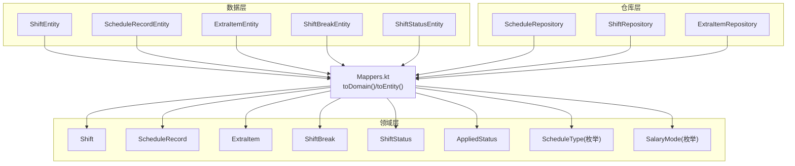
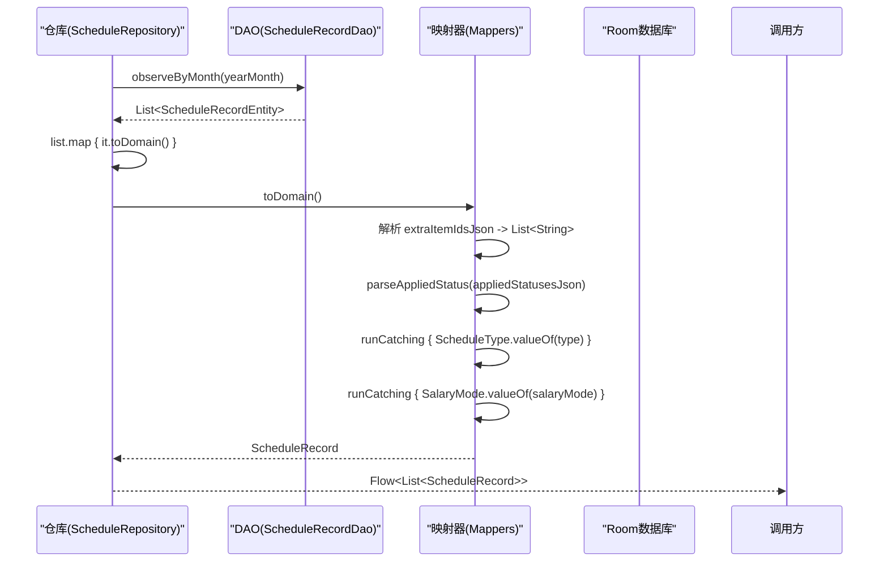
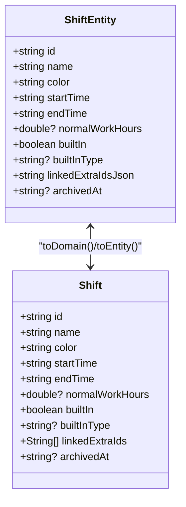
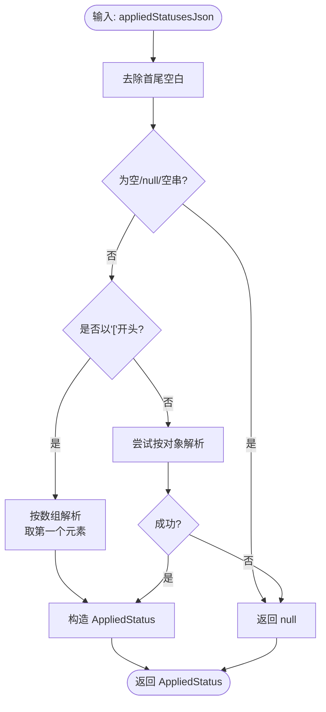
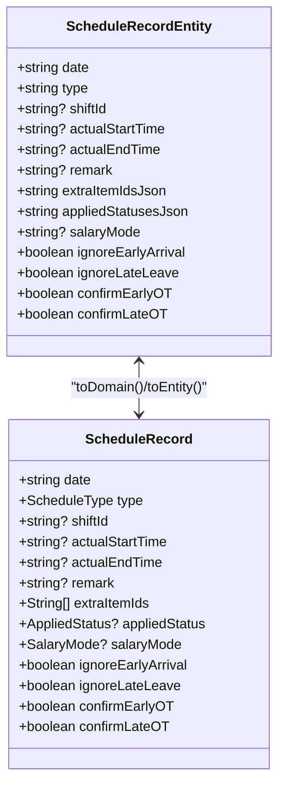
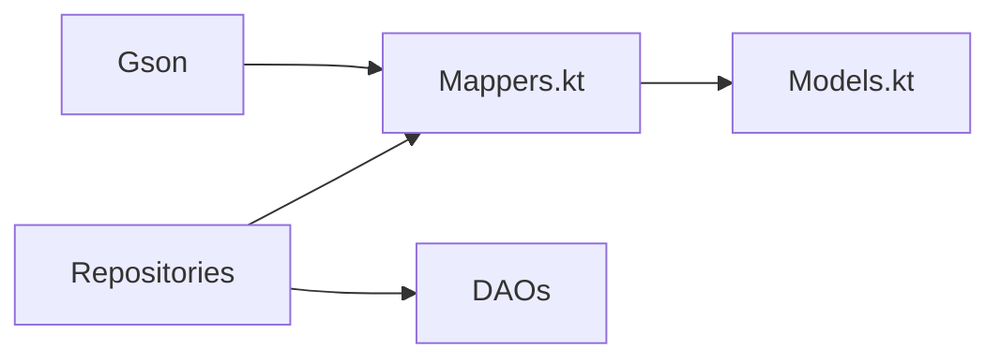

# 数据映射器

<cite>
**本文引用的文件**   
- [Mappers.kt](file://app/src/main/java/com/schedulecalendar/app/data/repository/Mappers.kt)
- [ShiftEntity.kt](file://app/src/main/java/com/schedulecalendar/app/data/db/entity/ShiftEntity.kt)
- [ScheduleRecordEntity.kt](file://app/src/main/java/com/schedulecalendar/app/data/db/entity/ScheduleRecordEntity.kt)
- [ExtraItemEntity.kt](file://app/src/main/java/com/schedulecalendar/app/data/db/entity/ExtraItemEntity.kt)
- [ShiftBreakEntity.kt](file://app/src/main/java/com/schedulecalendar/app/data/db/entity/ShiftBreakEntity.kt)
- [ShiftStatusEntity.kt](file://app/src/main/java/com/schedulecalendar/app/data/db/entity/ShiftStatusEntity.kt)
- [Models.kt](file://app/src/main/java/com/schedulecalendar/app/domain/model/Models.kt)
- [ShiftRepository.kt](file://app/src/main/java/com/schedulecalendar/app/data/repository/ShiftRepository.kt)
- [ScheduleRepository.kt](file://app/src/main/java/com/schedulecalendar/app/data/repository/ScheduleRepository.kt)
- [ExtraItemRepository.kt](file://app/src/main/java/com/schedulecalendar/app/data/repository/ExtraItemRepository.kt)
</cite>

## 目录
1. [简介](#简介)
2. [项目结构](#项目结构)
3. [核心组件](#核心组件)
4. [架构总览](#架构总览)
5. [详细组件分析](#详细组件分析)
6. [依赖关系分析](#依赖关系分析)
7. [性能考量](#性能考量)
8. [故障排查指南](#故障排查指南)
9. [结论](#结论)
10. [附录：扩展与最佳实践](#附录扩展与最佳实践)

## 简介
本文件聚焦于数据层到领域层的映射机制，围绕 Mappers.kt 中定义的 Entity 与 Domain Model 双向转换逻辑进行系统化说明。文档覆盖以下要点：
- toDomain() 与 toEntity() 的实现原理与职责边界
- 复杂数据类型（日期、枚举、集合、JSON）的转换策略
- 数据验证与清洗规则在转换过程中的应用
- 扩展点设计与新增类型支持的步骤
- 自定义映射器的编写方法与最佳实践
- 性能优化技巧与常见错误处理

## 项目结构
本项目采用分层架构：数据层通过 Room 实体（Entity）持久化数据；领域层以不可变 data class 表达业务模型；Repository 负责协调 DAO 与 Mapper，将 Entity 转换为 Domain Model 供上层使用。

图表来源
- [Mappers.kt:1-134](file://app/src/main/java/com/schedulecalendar/app/data/repository/Mappers.kt#L1-L134)
- [ShiftEntity.kt:1-24](file://app/src/main/java/com/schedulecalendar/app/data/db/entity/ShiftEntity.kt#L1-L24)
- [ScheduleRecordEntity.kt:1-26](file://app/src/main/java/com/schedulecalendar/app/data/db/entity/ScheduleRecordEntity.kt#L1-L26)
- [ExtraItemEntity.kt:1-16](file://app/src/main/java/com/schedulecalendar/app/data/db/entity/ExtraItemEntity.kt#L1-L16)
- [ShiftBreakEntity.kt:1-16](file://app/src/main/java/com/schedulecalendar/app/data/db/entity/ShiftBreakEntity.kt#L1-L16)
- [ShiftStatusEntity.kt:1-19](file://app/src/main/java/com/schedulecalendar/app/data/db/entity/ShiftStatusEntity.kt#L1-L19)
- [Models.kt:1-277](file://app/src/main/java/com/schedulecalendar/app/domain/model/Models.kt#L1-L277)
- [ScheduleRepository.kt:1-40](file://app/src/main/java/com/schedulecalendar/app/data/repository/ScheduleRepository.kt#L1-L40)
- [ShiftRepository.kt:1-45](file://app/src/main/java/com/schedulecalendar/app/data/repository/ShiftRepository.kt#L1-L45)
- [ExtraItemRepository.kt:1-30](file://app/src/main/java/com/schedulecalendar/app/data/repository/ExtraItemRepository.kt#L1-L30)

章节来源
- [Mappers.kt:1-134](file://app/src/main/java/com/schedulecalendar/app/data/repository/Mappers.kt#L1-L134)
- [Models.kt:1-277](file://app/src/main/java/com/schedulecalendar/app/domain/model/Models.kt#L1-L277)

## 核心组件
- 映射入口：Mappers.kt 提供各实体的 toDomain()/toEntity() 扩展函数，以及辅助 JSON 解析工具 parseAppliedStatus()/toJson()。
- 领域模型：Models.kt 定义 Shift、ScheduleRecord、ExtraItem、ShiftBreak、ShiftStatus、AppliedStatus 等不可变数据类及枚举 ScheduleType、SalaryMode。
- 仓库层：各 Repository 调用 DAO 获取 Entity 列表后，统一通过 map { it.toDomain() } 转换为领域模型返回给上层。

章节来源
- [Mappers.kt:1-134](file://app/src/main/java/com/schedulecalendar/app/data/repository/Mappers.kt#L1-L134)
- [Models.kt:1-277](file://app/src/main/java/com/schedulecalendar/app/domain/model/Models.kt#L1-L277)
- [ScheduleRepository.kt:1-40](file://app/src/main/java/com/schedulecalendar/app/data/repository/ScheduleRepository.kt#L1-L40)
- [ShiftRepository.kt:1-45](file://app/src/main/java/com/schedulecalendar/app/data/repository/ShiftRepository.kt#L1-L45)
- [ExtraItemRepository.kt:1-30](file://app/src/main/java/com/schedulecalendar/app/data/repository/ExtraItemRepository.kt#L1-L30)

## 架构总览
下图展示了从数据库读取到领域模型的完整流程，包括 JSON 字段解析、枚举安全转换与异常兜底。

图表来源
- [ScheduleRepository.kt:22-26](file://app/src/main/java/com/schedulecalendar/app/data/repository/ScheduleRepository.kt#L22-L26)
- [Mappers.kt:92-128](file://app/src/main/java/com/schedulecalendar/app/data/repository/Mappers.kt#L92-L128)

## 详细组件分析

### Shift 映射
- 目标：在 ShiftEntity 与 Shift 之间进行双向转换。
- 关键点：
  - linkedExtraIdsJson 为 JSON 数组字符串，需反序列化为 List<String>；写入时序列化回 JSON。
  - builtInType 为可选内置类型标识，直接透传。
  - archivedAt 用于逻辑删除标记，保持 null 表示有效。
- 复杂度：O(n) 取决于 linkedExtraIds 长度。

图表来源
- [ShiftEntity.kt:1-24](file://app/src/main/java/com/schedulecalendar/app/data/db/entity/ShiftEntity.kt#L1-L24)
- [Models.kt:51-65](file://app/src/main/java/com/schedulecalendar/app/domain/model/Models.kt#L51-L65)
- [Mappers.kt:19-48](file://app/src/main/java/com/schedulecalendar/app/data/repository/Mappers.kt#L19-L48)

章节来源
- [Mappers.kt:19-48](file://app/src/main/java/com/schedulecalendar/app/data/repository/Mappers.kt#L19-L48)
- [ShiftEntity.kt:1-24](file://app/src/main/java/com/schedulecalendar/app/data/db/entity/ShiftEntity.kt#L1-L24)
- [Models.kt:51-65](file://app/src/main/java/com/schedulecalendar/app/domain/model/Models.kt#L51-L65)

### ShiftBreak 映射
- 一对一字段映射，无复杂类型。
- 注意 archivedAt 语义保持一致。

章节来源
- [Mappers.kt:52-53](file://app/src/main/java/com/schedulecalendar/app/data/repository/Mappers.kt#L52-L53)
- [ShiftBreakEntity.kt:1-16](file://app/src/main/java/com/schedulecalendar/app/data/db/entity/ShiftBreakEntity.kt#L1-L16)
- [Models.kt:14-20](file://app/src/main/java/com/schedulecalendar/app/domain/model/Models.kt#L14-L20)

### ShiftStatus 映射
- 一对一字段映射，reportType 为可选字符串，用于报表类型映射。
- archivedAt 语义一致。

章节来源
- [Mappers.kt:57-58](file://app/src/main/java/com/schedulecalendar/app/data/repository/Mappers.kt#L57-L58)
- [ShiftStatusEntity.kt:1-19](file://app/src/main/java/com/schedulecalendar/app/data/db/entity/ShiftStatusEntity.kt#L1-L19)
- [Models.kt:23-35](file://app/src/main/java/com/schedulecalendar/app/domain/model/Models.kt#L23-L35)

### AppliedStatus 与 JSON 兼容解析
- 背景：appliedStatusesJson 可能为旧版数组格式或新版单对象格式，需要兼容解析。
- 实现要点：
  - 空串、null、空字符串均视为无效，返回 null。
  - 若以 "[" 开头，按数组解析并取第一个元素作为当前状态。
  - 否则按单对象解析，失败则返回 null。
- 输出：toJson() 将 AppliedStatus 序列化为 JSON 字符串，空值返回 "null"。

图表来源
- [Mappers.kt:62-88](file://app/src/main/java/com/schedulecalendar/app/data/repository/Mappers.kt#L62-L88)

章节来源
- [Mappers.kt:62-88](file://app/src/main/java/com/schedulecalendar/app/data/repository/Mappers.kt#L62-L88)

### ScheduleRecord 映射
- 关键转换：
  - extraItemIdsJson -> List<String>（JSON 数组）。
  - appliedStatusesJson -> AppliedStatus?（兼容解析）。
  - type -> ScheduleType（枚举），使用安全转换，失败回退默认 SHIFT。
  - salaryMode -> SalaryMode?（枚举），失败则为 null。
  - 其他字段一一映射。
- 反向转换：
  - 枚举转 name 字符串。
  - List<String> 转 JSON 字符串。
  - AppliedStatus? 转 JSON 字符串。

图表来源
- [ScheduleRecordEntity.kt:1-26](file://app/src/main/java/com/schedulecalendar/app/data/db/entity/ScheduleRecordEntity.kt#L1-L26)
- [Models.kt:81-100](file://app/src/main/java/com/schedulecalendar/app/domain/model/Models.kt#L81-L100)
- [Mappers.kt:92-128](file://app/src/main/java/com/schedulecalendar/app/data/repository/Mappers.kt#L92-L128)

章节来源
- [Mappers.kt:92-128](file://app/src/main/java/com/schedulecalendar/app/data/repository/Mappers.kt#L92-L128)
- [ScheduleRecordEntity.kt:1-26](file://app/src/main/java/com/schedulecalendar/app/data/db/entity/ScheduleRecordEntity.kt#L1-L26)
- [Models.kt:81-100](file://app/src/main/java/com/schedulecalendar/app/domain/model/Models.kt#L81-L100)

### ExtraItem 映射
- 一对一字段映射，type 为字符串（allowance/deduction），amount 为 Double。
- archivedAt 语义一致。

章节来源
- [Mappers.kt:132-133](file://app/src/main/java/com/schedulecalendar/app/data/repository/Mappers.kt#L132-L133)
- [ExtraItemEntity.kt:1-16](file://app/src/main/java/com/schedulecalendar/app/data/db/entity/ExtraItemEntity.kt#L1-L16)
- [Models.kt:103-109](file://app/src/main/java/com/schedulecalendar/app/domain/model/Models.kt#L103-L109)

## 依赖关系分析
- 外部依赖：Gson 用于 JSON 序列化/反序列化。
- 内部依赖：
  - Mappers 依赖 Models 中的 domain model 与枚举。
  - Repository 依赖 DAO 与 Mappers，统一在 map 阶段完成转换。
- 耦合度：
  - 映射逻辑集中在 Mappers.kt，便于维护与测试。
  - Repository 仅做薄封装，避免重复转换逻辑。

图表来源
- [Mappers.kt:1-134](file://app/src/main/java/com/schedulecalendar/app/data/repository/Mappers.kt#L1-L134)
- [Models.kt:1-277](file://app/src/main/java/com/schedulecalendar/app/domain/model/Models.kt#L1-L277)
- [ScheduleRepository.kt:1-40](file://app/src/main/java/com/schedulecalendar/app/data/repository/ScheduleRepository.kt#L1-L40)
- [ShiftRepository.kt:1-45](file://app/src/main/java/com/schedulecalendar/app/data/repository/ShiftRepository.kt#L1-L45)
- [ExtraItemRepository.kt:1-30](file://app/src/main/java/com/schedulecalendar/app/data/repository/ExtraItemRepository.kt#L1-L30)

章节来源
- [Mappers.kt:1-134](file://app/src/main/java/com/schedulecalendar/app/data/repository/Mappers.kt#L1-L134)
- [Models.kt:1-277](file://app/src/main/java/com/schedulecalendar/app/domain/model/Models.kt#L1-L277)
- [ScheduleRepository.kt:1-40](file://app/src/main/java/com/schedulecalendar/app/data/repository/ScheduleRepository.kt#L1-L40)
- [ShiftRepository.kt:1-45](file://app/src/main/java/com/schedulecalendar/app/data/repository/ShiftRepository.kt#L1-L45)
- [ExtraItemRepository.kt:1-30](file://app/src/main/java/com/schedulecalendar/app/data/repository/ExtraItemRepository.kt#L1-L30)

## 性能考量
- JSON 解析开销：
  - 对大列表（如 extraItemIds）频繁解析会带来 CPU 与内存压力。建议在批量场景下复用 Gson 实例（已在 Mappers 中全局持有）。
- 枚举转换：
  - valueOf 会抛异常，使用 runCatching/getOrDefault 降低异常路径成本。
- 流式处理：
  - Repository 使用 Flow.map 延迟转换，避免一次性加载全量数据时的峰值内存。
- 建议：
  - 对热点路径可考虑缓存已解析的集合对象，或在 DAO 层直接返回更贴近领域的数据以减少中间转换。
  - 对超大 JSON 字段考虑分片存储或引入专用转换器。

[本节为通用指导，不直接分析具体文件]

## 故障排查指南
- 常见错误与定位：
  - JSON 解析失败：检查 appliedStatusesJson 是否为合法 JSON；确认旧数组格式与新对象格式兼容逻辑。
  - 枚举值非法：type 或 salaryMode 非预期值时，查看安全转换回退逻辑。
  - 空值处理：appliedStatusesJson 为空或 "null" 时应返回 null，避免上层 NPE。
- 调试建议：
  - 在 Repository 的 map 阶段增加日志打印原始 JSON 与解析结果。
  - 对历史数据进行抽样校验，确保迁移后的 JSON 结构与解析逻辑一致。

章节来源
- [Mappers.kt:62-88](file://app/src/main/java/com/schedulecalendar/app/data/repository/Mappers.kt#L62-L88)
- [Mappers.kt:92-128](file://app/src/main/java/com/schedulecalendar/app/data/repository/Mappers.kt#L92-L128)

## 结论
Mappers.kt 提供了清晰、稳定的 Entity 与 Domain Model 双向转换能力，并通过 JSON 兼容解析与安全枚举转换提升了鲁棒性。Repository 层集中调用映射函数，保持职责单一。整体设计易于扩展与维护，适合持续演进的业务需求。

[本节为总结，不直接分析具体文件]

## 附录：扩展与最佳实践

### 添加新数据类型转换支持
- 步骤：
  1. 在 Models.kt 中定义新的领域模型或枚举。
  2. 在对应 Entity 中添加持久化字段（必要时使用 JSON 字段承载复杂结构）。
  3. 在 Mappers.kt 中新增 toDomain()/toEntity() 扩展函数，遵循现有模式：
     - 集合字段：使用 TypeToken 解析/序列化。
     - 枚举字段：使用 runCatching/valueOf 安全转换。
     - 可选对象：使用兼容解析函数（参考 parseAppliedStatus）。
  4. 在相应 Repository 的 map 链中接入新映射。
- 示例路径（不含代码内容）：
  - 新增领域模型：[Models.kt:1-277](file://app/src/main/java/com/schedulecalendar/app/domain/model/Models.kt#L1-L277)
  - 新增映射函数：[Mappers.kt:1-134](file://app/src/main/java/com/schedulecalendar/app/data/repository/Mappers.kt#L1-L134)
  - 接入仓库：[ScheduleRepository.kt:1-40](file://app/src/main/java/com/schedulecalendar/app/data/repository/ScheduleRepository.kt#L1-L40)

### 自定义映射器编写方法
- 推荐做法：
  - 将复杂转换逻辑封装为独立函数（如 parseAppliedStatus），提高可读性与可测试性。
  - 对 JSON 字段统一使用 Gson 的 TypeToken 指定泛型类型，避免运行时类型擦除问题。
  - 对枚举转换使用 runCatching 包裹，保证健壮性。
- 参考路径：
  - 集合解析与序列化：[Mappers.kt:19-48](file://app/src/main/java/com/schedulecalendar/app/data/repository/Mappers.kt#L19-L48)
  - 兼容解析与序列化：[Mappers.kt:62-88](file://app/src/main/java/com/schedulecalendar/app/data/repository/Mappers.kt#L62-L88)
  - 枚举安全转换：[Mappers.kt:92-128](file://app/src/main/java/com/schedulecalendar/app/data/repository/Mappers.kt#L92-L128)

### 数据验证与清洗规则
- 清洗规则：
  - 空串、null、空字符串视为无效状态，返回 null。
  - 枚举非法值回退默认或 null，避免崩溃。
- 验证建议：
  - 在保存前对领域模型进行前置校验（如时间范围、必填字段）。
  - 对 JSON 字段进行最小合法性检查后再解析。

章节来源
- [Mappers.kt:62-88](file://app/src/main/java/com/schedulecalendar/app/data/repository/Mappers.kt#L62-L88)
- [Mappers.kt:92-128](file://app/src/main/java/com/schedulecalendar/app/data/repository/Mappers.kt#L92-L128)