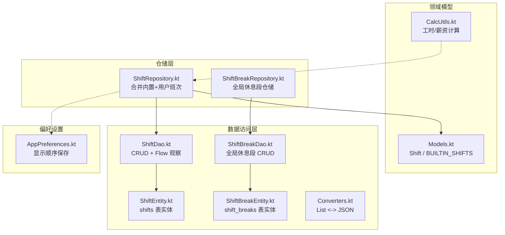
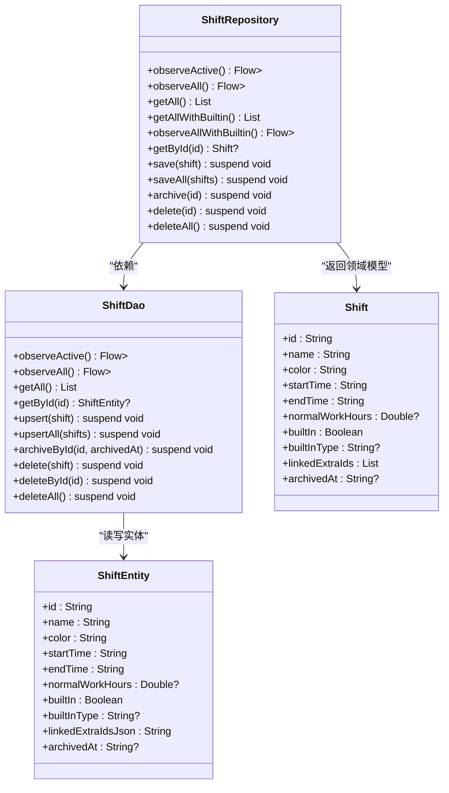
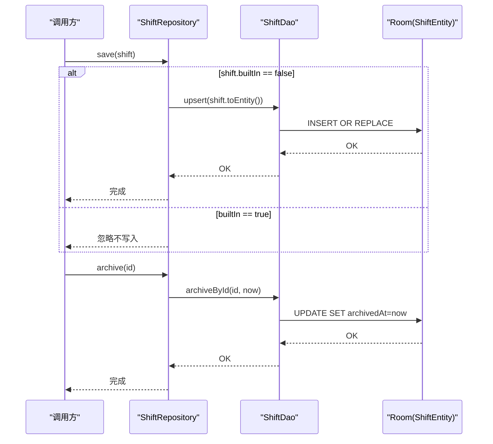
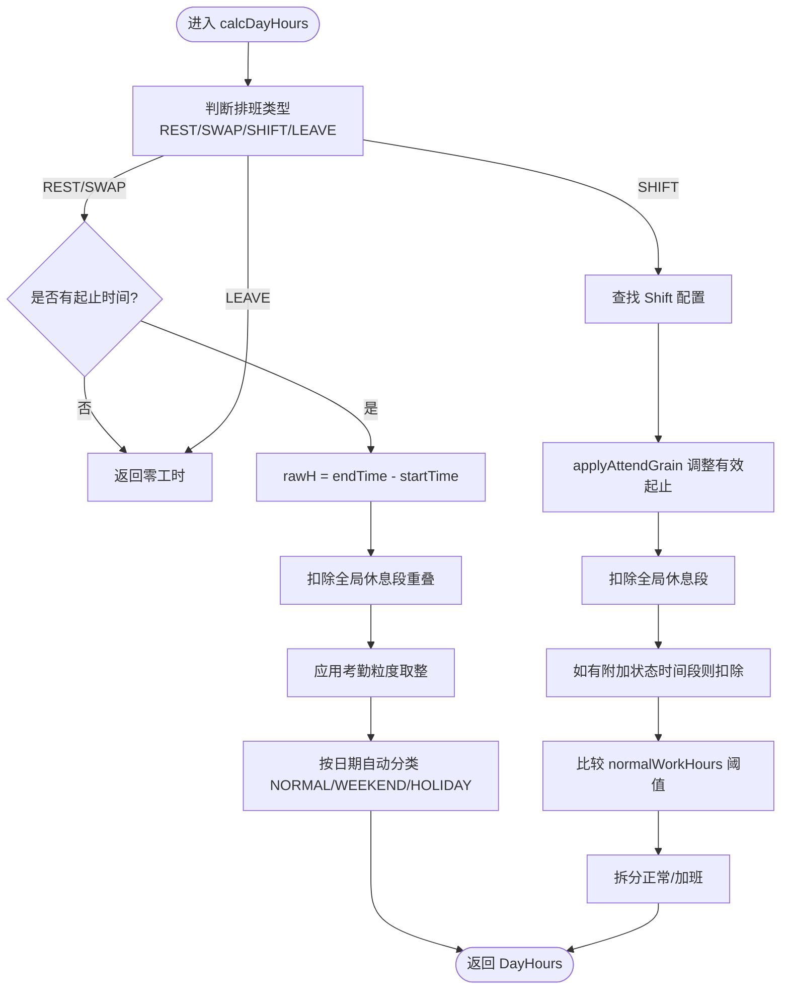
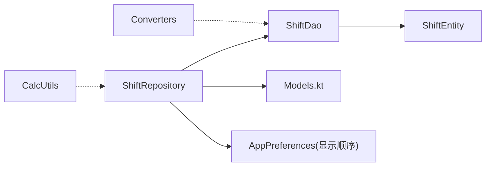

# 班次仓库实现

<cite>
**本文引用的文件**   
- [ShiftRepository.kt](file://app/src/main/java/com/schedulecalendar/app/data/repository/ShiftRepository.kt)
- [ShiftDao.kt](file://app/src/main/java/com/schedulecalendar/app/data/db/dao/ShiftDao.kt)
- [ShiftEntity.kt](file://app/src/main/java/com/schedulecalendar/app/data/db/entity/ShiftEntity.kt)
- [Models.kt](file://app/src/main/java/com/schedulecalendar/app/domain/model/Models.kt)
- [CalcUtils.kt](file://app/src/main/java/com/schedulecalendar/app/domain/model/CalcUtils.kt)
- [ShiftBreakRepository.kt](file://app/src/main/java/com/schedulecalendar/app/data/repository/ShiftBreakRepository.kt)
- [ShiftBreakDao.kt](file://app/src/main/java/com/schedulecalendar/app/data/db/dao/ShiftBreakDao.kt)
- [ShiftBreakEntity.kt](file://app/src/main/java/com/schedulecalendar/app/data/db/entity/ShiftBreakEntity.kt)
- [Converters.kt](file://app/src/main/java/com/schedulecalendar/app/data/db/Converters.kt)
- [AppPreferences.kt](file://app/src/main/java/com/schedulecalendar/app/data/prefs/AppPreferences.kt)
</cite>

## 目录
1. [简介](#简介)
2. [项目结构](#项目结构)
3. [核心组件](#核心组件)
4. [架构总览](#架构总览)
5. [详细组件分析](#详细组件分析)
6. [依赖关系分析](#依赖关系分析)
7. [性能考量](#性能考量)
8. [故障排查指南](#故障排查指南)
9. [结论](#结论)
10. [附录：使用示例与最佳实践](#附录使用示例与最佳实践)

## 简介
本文件围绕 ShiftRepository 类，系统化阐述其班次管理功能，包括：
- 班次类型定义、创建、修改与删除
- 开始时间、结束时间与时长计算逻辑
- 排序与归档机制
- 多项目环境下的隔离策略（当前实现）
- 错误处理与数据验证要点
- 自定义班次类型与工作时间的配置方法

## 项目结构
与班次仓库相关的代码主要分布在以下层次：
- 领域模型层：定义 Shift、内置班次常量、全局休息时段等
- 数据访问层：Room DAO 与 Entity，负责持久化与查询
- 仓储层：ShiftRepository 封装对 DAO 的调用，并融合内置班次
- 工具与偏好：工时薪资计算、显示顺序存储等

图表来源
- [ShiftRepository.kt:1-45](file://app/src/main/java/com/schedulecalendar/app/data/repository/ShiftRepository.kt#L1-L45)
- [ShiftDao.kt:1-42](file://app/src/main/java/com/schedulecalendar/app/data/db/dao/ShiftDao.kt#L1-L42)
- [ShiftEntity.kt:1-24](file://app/src/main/java/com/schedulecalendar/app/data/db/entity/ShiftEntity.kt#L1-L24)
- [Models.kt:50-78](file://app/src/main/java/com/schedulecalendar/app/domain/model/Models.kt#L50-L78)
- [CalcUtils.kt:149-230](file://app/src/main/java/com/schedulecalendar/app/domain/model/CalcUtils.kt#L149-L230)
- [ShiftBreakRepository.kt:1-27](file://app/src/main/java/com/schedulecalendar/app/data/repository/ShiftBreakRepository.kt#L1-L27)
- [ShiftBreakDao.kt:1-39](file://app/src/main/java/com/schedulecalendar/app/data/db/dao/ShiftBreakDao.kt#L1-L39)
- [ShiftBreakEntity.kt:1-16](file://app/src/main/java/com/schedulecalendar/app/data/db/entity/ShiftBreakEntity.kt#L1-L16)
- [Converters.kt:1-17](file://app/src/main/java/com/schedulecalendar/app/data/db/Converters.kt#L1-L17)
- [AppPreferences.kt:117-142](file://app/src/main/java/com/schedulecalendar/app/data/prefs/AppPreferences.kt#L117-L142)

章节来源
- [ShiftRepository.kt:1-45](file://app/src/main/java/com/schedulecalendar/app/data/repository/ShiftRepository.kt#L1-L45)
- [ShiftDao.kt:1-42](file://app/src/main/java/com/schedulecalendar/app/data/db/dao/ShiftDao.kt#L1-L42)
- [ShiftEntity.kt:1-24](file://app/src/main/java/com/schedulecalendar/app/data/db/entity/ShiftEntity.kt#L1-L24)
- [Models.kt:50-78](file://app/src/main/java/com/schedulecalendar/app/domain/model/Models.kt#L50-L78)
- [CalcUtils.kt:149-230](file://app/src/main/java/com/schedulecalendar/app/domain/model/CalcUtils.kt#L149-L230)
- [ShiftBreakRepository.kt:1-27](file://app/src/main/java/com/schedulecalendar/app/data/repository/ShiftBreakRepository.kt#L1-L27)
- [ShiftBreakDao.kt:1-39](file://app/src/main/java/com/schedulecalendar/app/data/db/dao/ShiftBreakDao.kt#L1-L39)
- [ShiftBreakEntity.kt:1-16](file://app/src/main/java/com/schedulecalendar/app/data/db/entity/ShiftBreakEntity.kt#L1-L16)
- [Converters.kt:1-17](file://app/src/main/java/com/schedulecalendar/app/data/db/Converters.kt#L1-L17)
- [AppPreferences.kt:117-142](file://app/src/main/java/com/schedulecalendar/app/data/prefs/AppPreferences.kt#L117-L142)

## 核心组件
- ShiftRepository：对外暴露班次的增删改查、归档、以及“含内置”的聚合视图；内部通过 DAO 操作数据库，并通过映射函数在 Domain 与 Entity 之间转换。
- ShiftDao：基于 Room 的 SQL 查询与变更接口，提供 Flow 实时观察与一次性查询。
- ShiftEntity：对应 shifts 表的持久化结构，包含名称、颜色、起止时间、正常班时长、是否内置、内置类型、关联补贴/扣款 ID 列表、归档时间戳等。
- Models.kt：定义 Shift 领域模型、内置班次常量与内置状态类型等。
- CalcUtils.kt：提供时间差、跨天归一化、考勤粒度处理、全局休息段扣减、按日/月工时与薪资计算等。
- ShiftBreakRepository/Dao/Entity：管理全局不计入工时的休息段（如午休），参与工时计算。
- Converters.kt：将 List<String> 与 JSON 字符串互转，用于持久化 linkedExtraIdsJson。
- AppPreferences.kt：保存显示顺序（如班次显示顺序），影响 UI 展示但不影响业务数据。

章节来源
- [ShiftRepository.kt:1-45](file://app/src/main/java/com/schedulecalendar/app/data/repository/ShiftRepository.kt#L1-L45)
- [ShiftDao.kt:1-42](file://app/src/main/java/com/schedulecalendar/app/data/db/dao/ShiftDao.kt#L1-L42)
- [ShiftEntity.kt:1-24](file://app/src/main/java/com/schedulecalendar/app/data/db/entity/ShiftEntity.kt#L1-L24)
- [Models.kt:50-78](file://app/src/main/java/com/schedulecalendar/app/domain/model/Models.kt#L50-L78)
- [CalcUtils.kt:149-230](file://app/src/main/java/com/schedulecalendar/app/domain/model/CalcUtils.kt#L149-L230)
- [ShiftBreakRepository.kt:1-27](file://app/src/main/java/com/schedulecalendar/app/data/repository/ShiftBreakRepository.kt#L1-L27)
- [ShiftBreakDao.kt:1-39](file://app/src/main/java/com/schedulecalendar/app/data/db/dao/ShiftBreakDao.kt#L1-L39)
- [ShiftBreakEntity.kt:1-16](file://app/src/main/java/com/schedulecalendar/app/data/db/entity/ShiftBreakEntity.kt#L1-L16)
- [Converters.kt:1-17](file://app/src/main/java/com/schedulecalendar/app/data/db/Converters.kt#L1-L17)
- [AppPreferences.kt:117-142](file://app/src/main/java/com/schedulecalendar/app/data/prefs/AppPreferences.kt#L117-L142)

## 架构总览
ShiftRepository 作为仓储层，屏蔽了底层 Room 细节，向上层提供统一的班次管理能力，同时融合内置班次，形成“用户数据 + 内置数据”的统一视图。

图表来源
- [ShiftRepository.kt:1-45](file://app/src/main/java/com/schedulecalendar/app/data/repository/ShiftRepository.kt#L1-L45)
- [ShiftDao.kt:1-42](file://app/src/main/java/com/schedulecalendar/app/data/db/dao/ShiftDao.kt#L1-L42)
- [ShiftEntity.kt:1-24](file://app/src/main/java/com/schedulecalendar/app/data/db/entity/ShiftEntity.kt#L1-L24)
- [Models.kt:50-78](file://app/src/main/java/com/schedulecalendar/app/domain/model/Models.kt#L50-L78)

## 详细组件分析

### ShiftRepository 能力与流程
- 观察有效班次：仅返回未归档的班次，按名称升序排列。
- 观察所有班次：返回全部（含已归档），用于历史数据展示查找。
- 获取所有班次：同步一次性读取。
- 获取含内置的班次：将内置班次与用户数据合并，避免重复内置项。
- 根据 ID 获取：优先匹配内置，否则从数据库查找。
- 保存/批量保存：仅保存非内置班次；内置不可被覆盖或写入。
- 归档：逻辑删除，设置归档时间戳。
- 删除/清空：物理删除单条或全部。

图表来源
- [ShiftRepository.kt:37-42](file://app/src/main/java/com/schedulecalendar/app/data/repository/ShiftRepository.kt#L37-L42)
- [ShiftDao.kt:23-31](file://app/src/main/java/com/schedulecalendar/app/data/db/dao/ShiftDao.kt#L23-L31)

章节来源
- [ShiftRepository.kt:16-42](file://app/src/main/java/com/schedulecalendar/app/data/repository/ShiftRepository.kt#L16-L42)
- [ShiftDao.kt:10-31](file://app/src/main/java/com/schedulecalendar/app/data/db/dao/ShiftDao.kt#L10-L31)

### 班次类型定义与内置机制
- 内置班次常量：休息、调休、请假等，具有固定 ID 与类型标记。
- Shift.builtIn/builtInType：区分内置与用户自定义；内置不参与持久化更新。
- 内置状态类型：请假、调休等，用于报表统计。

章节来源
- [Models.kt:5-11](file://app/src/main/java/com/schedulecalendar/app/domain/model/Models.kt#L5-L11)
- [Models.kt:50-78](file://app/src/main/java/com/schedulecalendar/app/domain/model/Models.kt#L50-L78)

### 时间配置与时长计算
- 起止时间：HH:mm 格式，支持跨天；CalcUtils 提供归一化与差值计算。
- 正常班时长：Shift.normalWorkHours 为阈值，超出部分计加班；若为空则回退到全局配置 AttendConfig.normalWorkHoursPerDay。
- 全局休息段：ShiftBreak 列表与班次窗口求交集，扣除不计入工时时段。
- 考勤粒度与容忍：早到/迟到/晚退/早退按规则调整有效起止时间，再计算工时。
- 附加状态时间段：可单独扣除或计入特定类型工时（如请假/调休）。

图表来源
- [CalcUtils.kt:149-230](file://app/src/main/java/com/schedulecalendar/app/domain/model/CalcUtils.kt#L149-L230)
- [CalcUtils.kt:115-134](file://app/src/main/java/com/schedulecalendar/app/domain/model/CalcUtils.kt#L115-L134)
- [CalcUtils.kt:61-113](file://app/src/main/java/com/schedulecalendar/app/domain/model/CalcUtils.kt#L61-L113)

章节来源
- [CalcUtils.kt:149-230](file://app/src/main/java/com/schedulecalendar/app/domain/model/CalcUtils.kt#L149-L230)
- [CalcUtils.kt:115-134](file://app/src/main/java/com/schedulecalendar/app/domain/model/CalcUtils.kt#L115-L134)
- [CalcUtils.kt:61-113](file://app/src/main/java/com/schedulecalendar/app/domain/model/CalcUtils.kt#L61-L113)

### 排序与归档
- 排序：DAO 查询默认按 name ASC 排序，保证列表稳定有序。
- 归档：通过设置 archivedAt 时间戳进行逻辑删除；observeActive 仅返回未归档项。
- 显示顺序：AppPreferences 中保存显示顺序（不影响业务数据，仅影响 UI）。

章节来源
- [ShiftDao.kt:11-15](file://app/src/main/java/com/schedulecalendar/app/data/db/dao/ShiftDao.kt#L11-L15)
- [ShiftDao.kt:29-31](file://app/src/main/java/com/schedulecalendar/app/data/db/dao/ShiftDao.kt#L29-L31)
- [AppPreferences.kt:117-120](file://app/src/main/java/com/schedulecalendar/app/data/prefs/AppPreferences.kt#L117-L120)

### 与项目关联及多项目隔离
- 当前实现：ShiftEntity 与 ShiftDao 均未包含项目标识字段；ShiftRepository 亦无项目过滤逻辑。
- 结论：在当前版本中，班次数据为全局共享，不存在多项目隔离。如需隔离，需在实体与查询中引入项目维度并在 Repository 层增加过滤。

章节来源
- [ShiftEntity.kt:9-23](file://app/src/main/java/com/schedulecalendar/app/data/db/entity/ShiftEntity.kt#L9-L23)
- [ShiftDao.kt:10-21](file://app/src/main/java/com/schedulecalendar/app/data/db/dao/ShiftDao.kt#L10-L21)
- [ShiftRepository.kt:16-35](file://app/src/main/java/com/schedulecalendar/app/data/repository/ShiftRepository.kt#L16-L35)

### 错误处理与数据验证
- 空值与边界：CalcUtils 对空起止时间返回 0 小时；跨天场景通过归一化处理。
- 内置保护：Repository.save/saveAll 跳过内置项，防止覆盖系统预设。
- 缺失数据：calcDayHours 在未找到 Shift 或时间为空时直接返回零工时，避免异常。
- 校验建议：可在 Repository 层增加参数校验（如名称非空、时间格式合法、normalWorkHours 非负等），以提升健壮性。

章节来源
- [ShiftRepository.kt:37-39](file://app/src/main/java/com/schedulecalendar/app/data/repository/ShiftRepository.kt#L37-L39)
- [CalcUtils.kt:40-47](file://app/src/main/java/com/schedulecalendar/app/domain/model/CalcUtils.kt#L40-L47)
- [CalcUtils.kt:187-188](file://app/src/main/java/com/schedulecalendar/app/domain/model/CalcUtils.kt#L187-L188)

## 依赖关系分析
- ShiftRepository 依赖 ShiftDao 与 Models.kt 中的内置常量。
- ShiftDao 依赖 ShiftEntity 与 Room 注解。
- CalcUtils 独立于仓储层，但被上层（如薪资/工时模块）广泛使用。
- Converters 提供 List<String> 与 JSON 的转换，服务于 linkedExtraIdsJson 的持久化。

图表来源
- [ShiftRepository.kt:1-45](file://app/src/main/java/com/schedulecalendar/app/data/repository/ShiftRepository.kt#L1-L45)
- [ShiftDao.kt:1-42](file://app/src/main/java/com/schedulecalendar/app/data/db/dao/ShiftDao.kt#L1-L42)
- [ShiftEntity.kt:1-24](file://app/src/main/java/com/schedulecalendar/app/data/db/entity/ShiftEntity.kt#L1-L24)
- [Models.kt:50-78](file://app/src/main/java/com/schedulecalendar/app/domain/model/Models.kt#L50-L78)
- [Converters.kt:1-17](file://app/src/main/java/com/schedulecalendar/app/data/db/Converters.kt#L1-L17)
- [AppPreferences.kt:117-142](file://app/src/main/java/com/schedulecalendar/app/data/prefs/AppPreferences.kt#L117-L142)

章节来源
- [ShiftRepository.kt:1-45](file://app/src/main/java/com/schedulecalendar/app/data/repository/ShiftRepository.kt#L1-L45)
- [ShiftDao.kt:1-42](file://app/src/main/java/com/schedulecalendar/app/data/db/dao/ShiftDao.kt#L1-L42)
- [ShiftEntity.kt:1-24](file://app/src/main/java/com/schedulecalendar/app/data/db/entity/ShiftEntity.kt#L1-L24)
- [Models.kt:50-78](file://app/src/main/java/com/schedulecalendar/app/domain/model/Models.kt#L50-L78)
- [Converters.kt:1-17](file://app/src/main/java/com/schedulecalendar/app/data/db/Converters.kt#L1-L17)
- [AppPreferences.kt:117-142](file://app/src/main/java/com/schedulecalendar/app/data/prefs/AppPreferences.kt#L117-L142)

## 性能考量
- Flow 观察：observeActive/observeAll 使用 Flow 实时推送，减少轮询开销。
- 合并内置：observeAllWithBuiltin 在内存中合并内置与用户数据，注意内置集合大小可控。
- 排序：SQL 层 ORDER BY name 提升 UI 渲染稳定性。
- 批量操作：upsertAll 降低多次插入的开销。
- 计算复杂度：calcDayHours 为 O(1) 单次计算；月度汇总为 O(N)，N 为当月记录数。

[本节为通用指导，无需具体文件引用]

## 故障排查指南
- 无法保存内置班次：确认传入的 Shift.builtIn 是否为 true；Repository 会忽略内置项的保存。
- 归档后不在列表中：observeActive 仅返回未归档项；如需查看归档数据请使用 observeAll 或 getAll。
- 时长计算异常：检查起止时间格式是否为 HH:mm；跨天场景需确保 endTime 能正确归一化。
- 全局休息段未生效：确认 ShiftBreak 列表是否正确加载且未归档。
- 显示顺序未生效：检查 AppPreferences 中保存的顺序是否与 UI 绑定一致。

章节来源
- [ShiftRepository.kt:37-42](file://app/src/main/java/com/schedulecalendar/app/data/repository/ShiftRepository.kt#L37-L42)
- [ShiftDao.kt:11-15](file://app/src/main/java/com/schedulecalendar/app/data/db/dao/ShiftDao.kt#L11-L15)
- [CalcUtils.kt:40-47](file://app/src/main/java/com/schedulecalendar/app/domain/model/CalcUtils.kt#L40-L47)
- [ShiftBreakRepository.kt:15-23](file://app/src/main/java/com/schedulecalendar/app/data/repository/ShiftBreakRepository.kt#L15-L23)
- [AppPreferences.kt:117-142](file://app/src/main/java/com/schedulecalendar/app/data/prefs/AppPreferences.kt#L117-L142)

## 结论
ShiftRepository 提供了简洁一致的班次管理能力，结合内置班次与全局休息段，支撑了完整的工时与薪资计算链路。当前版本未实现多项目隔离，如需扩展，应在实体与 DAO 层引入项目维度并在 Repository 层增加过滤逻辑。建议在仓储层补充输入校验与更明确的错误反馈，以进一步提升健壮性与可维护性。

[本节为总结，无需具体文件引用]

## 附录：使用示例与最佳实践

### 创建自定义班次类型
- 构造一个 Shift 对象，设置 id、name、color、startTime、endTime、normalWorkHours 等字段。
- 调用 ShiftRepository.save(shift) 进行持久化；内置项不会被写入。
- 参考路径：
  - [Models.kt:50-65](file://app/src/main/java/com/schedulecalendar/app/domain/model/Models.kt#L50-L65)
  - [ShiftRepository.kt:37-39](file://app/src/main/java/com/schedulecalendar/app/data/repository/ShiftRepository.kt#L37-L39)

### 配置工作时间与正常班时长
- 设置 startTime/endTime 为 HH:mm；如需跨天，确保 endTime 能正确归一化。
- 设置 normalWorkHours 为非空数值以启用加班分界；为空则使用全局配置。
- 参考路径：
  - [ShiftEntity.kt:13-16](file://app/src/main/java/com/schedulecalendar/app/data/db/entity/ShiftEntity.kt#L13-L16)
  - [CalcUtils.kt:221-229](file://app/src/main/java/com/schedulecalendar/app/domain/model/CalcUtils.kt#L221-L229)

### 管理班次列表（含内置）
- 使用 observeAllWithBuiltin 或 getAllWithBuiltin 获取完整列表，便于 UI 选择。
- 使用 observeActive 获取未归档列表，用于日常排班。
- 参考路径：
  - [ShiftRepository.kt:25-32](file://app/src/main/java/com/schedulecalendar/app/data/repository/ShiftRepository.kt#L25-L32)
  - [ShiftRepository.kt:16-22](file://app/src/main/java/com/schedulecalendar/app/data/repository/ShiftRepository.kt#L16-L22)

### 归档与删除
- 归档：调用 archive(id) 进行逻辑删除，后续 observeActive 不再返回该班次。
- 删除：调用 delete(id) 或 deleteAll() 进行物理删除。
- 参考路径：
  - [ShiftRepository.kt:40-43](file://app/src/main/java/com/schedulecalendar/app/data/repository/ShiftRepository.kt#L40-L43)
  - [ShiftDao.kt:29-40](file://app/src/main/java/com/schedulecalendar/app/data/db/dao/ShiftDao.kt#L29-L40)

### 与全局休息段协同
- 通过 ShiftBreakRepository 管理全局休息段，参与工时计算。
- 参考路径：
  - [ShiftBreakRepository.kt:15-23](file://app/src/main/java/com/schedulecalendar/app/data/repository/ShiftBreakRepository.kt#L15-L23)
  - [CalcUtils.kt:115-134](file://app/src/main/java/com/schedulecalendar/app/domain/model/CalcUtils.kt#L115-L134)

### 多项目隔离建议（扩展方向）
- 在 ShiftEntity 中添加 projectId 字段，并在 DAO 查询中加入 WHERE projectId = ?。
- 在 Repository 层增加 getForProject(projectId) 等方法，并对 observeActive/observeAll 增加过滤。
- 参考路径（现有结构）：
  - [ShiftEntity.kt:9-23](file://app/src/main/java/com/schedulecalendar/app/data/db/entity/ShiftEntity.kt#L9-L23)
  - [ShiftDao.kt:10-21](file://app/src/main/java/com/schedulecalendar/app/data/db/dao/ShiftDao.kt#L10-L21)
  - [ShiftRepository.kt:16-35](file://app/src/main/java/com/schedulecalendar/app/data/repository/ShiftRepository.kt#L16-L35)