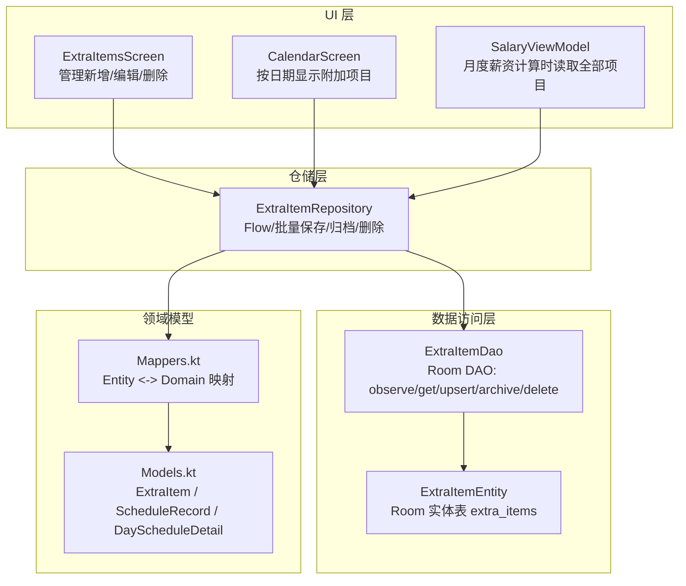
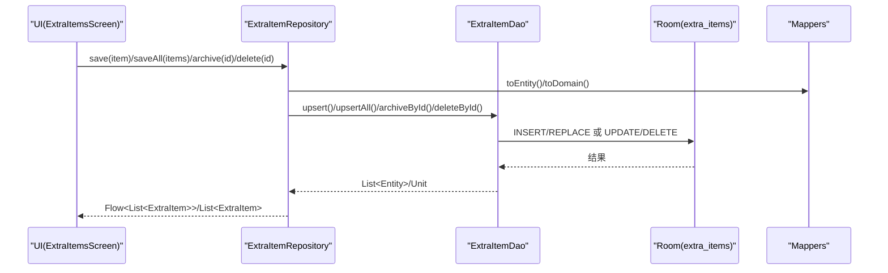
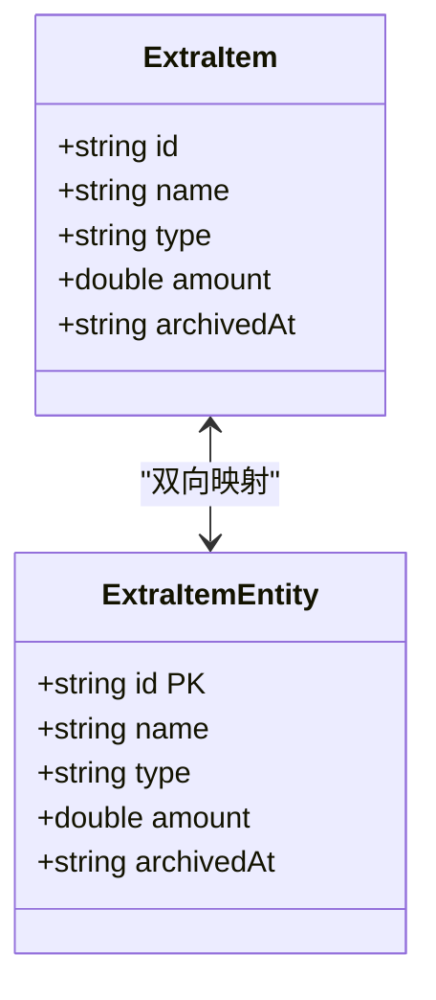
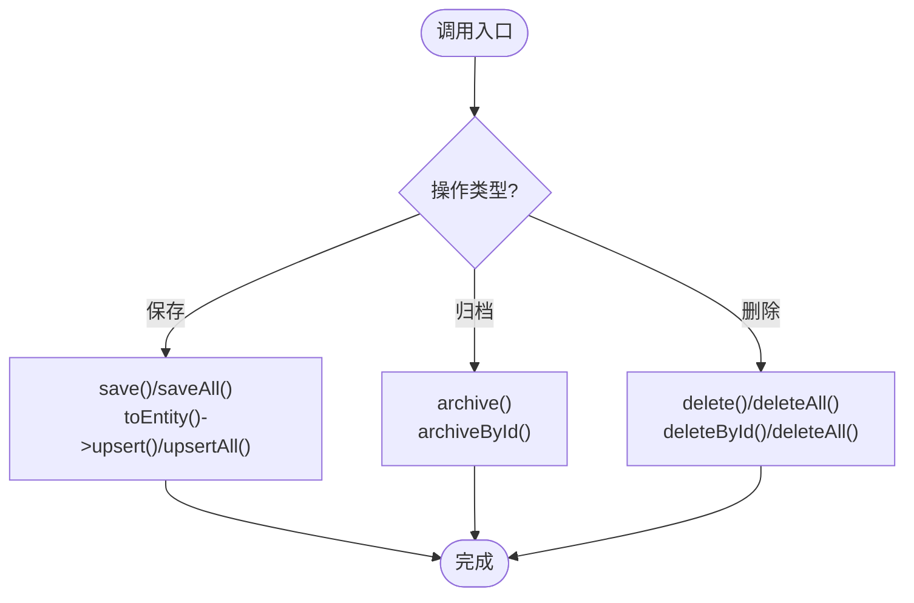
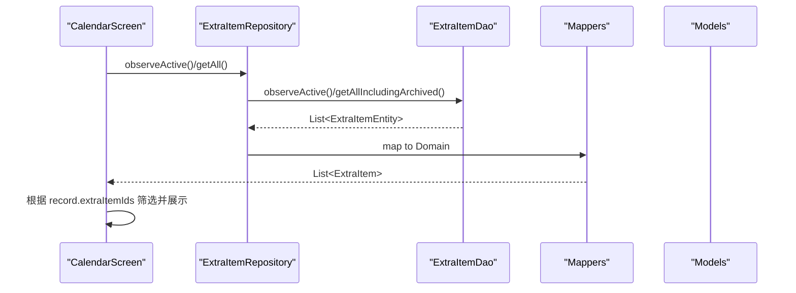
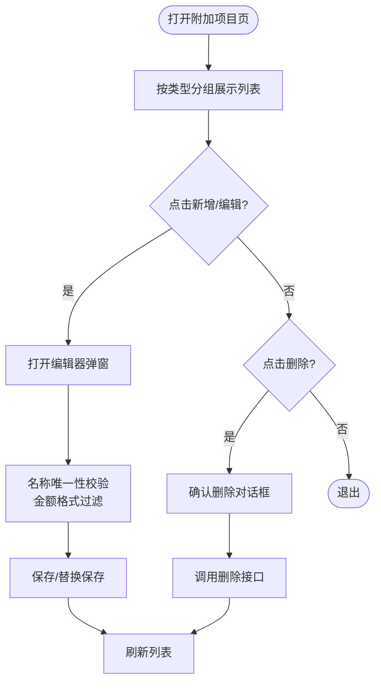
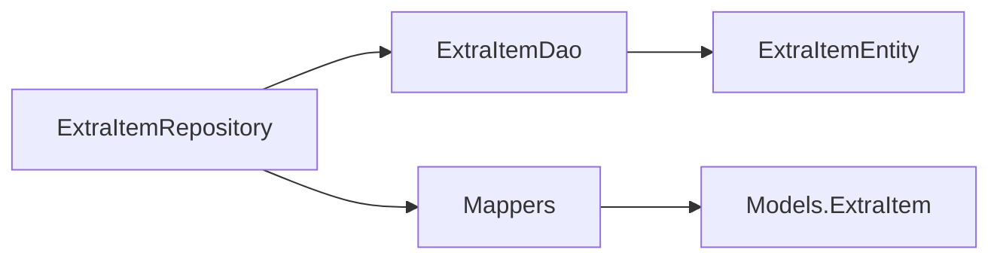

# 附加项目仓库实现

<cite>
**本文引用的文件**   
- [ExtraItemRepository.kt](file://app/src/main/java/com/schedulecalendar/app/data/repository/ExtraItemRepository.kt)
- [ExtraItemDao.kt](file://app/src/main/java/com/schedulecalendar/app/data/db/dao/ExtraItemDao.kt)
- [ExtraItemEntity.kt](file://app/src/main/java/com/schedulecalendar/app/data/db/entity/ExtraItemEntity.kt)
- [Mappers.kt](file://app/src/main/java/com/schedulecalendar/app/data/repository/Mappers.kt)
- [Models.kt](file://app/src/main/java/com/schedulecalendar/app/domain/model/Models.kt)
- [ExtraItemsScreen.kt](file://app/src/main/java/com/schedulecalendar/app/ui/detail/ExtraItemsScreen.kt)
- [CalendarScreen.kt](file://app/src/main/java/com/schedulecalendar/app/ui/calendar/CalendarScreen.kt)
- [SalaryViewModel.kt](file://app/src/main/java/com/schedulecalendar/app/ui/salary/SalaryViewModel.kt)
</cite>

## 目录
1. [简介](#简介)
2. [项目结构](#项目结构)
3. [核心组件](#核心组件)
4. [架构总览](#架构总览)
5. [详细组件分析](#详细组件分析)
6. [依赖关系分析](#依赖关系分析)
7. [性能与查询优化](#性能与查询优化)
8. [故障排查指南](#故障排查指南)
9. [结论](#结论)
10. [附录：使用示例与最佳实践](#附录使用示例与最佳实践)

## 简介
本文件围绕 ExtraItemRepository 及其相关数据层、领域模型与 UI 展示，系统化阐述“附加项目（补贴/扣款）”的完整实现。内容涵盖数据结构定义、与排班记录的关联方式、分类管理与统计汇总、持久化策略与查询优化，以及面向业务规则验证与异常处理的实践建议。文档以循序渐进的方式呈现，既适合初学者快速上手，也便于高级用户深入理解代码级细节。

## 项目结构
附加项目功能在数据层采用 Room 数据库 + DAO 的设计；在仓储层通过 Repository 暴露 Flow 与 suspend API；在领域层由 Models 定义统一的数据模型；UI 层提供编辑与管理界面，并在日历与薪资页面消费附加项目数据。

图表来源 
- [ExtraItemRepository.kt:1-31](file://app/src/main/java/com/schedulecalendar/app/data/repository/ExtraItemRepository.kt#L1-L31)
- [ExtraItemDao.kt:1-41](file://app/src/main/java/com/schedulecalendar/app/data/db/dao/ExtraItemDao.kt#L1-L41)
- [ExtraItemEntity.kt:1-16](file://app/src/main/java/com/schedulecalendar/app/data/db/entity/ExtraItemEntity.kt#L1-L16)
- [Mappers.kt:130-134](file://app/src/main/java/com/schedulecalendar/app/data/repository/Mappers.kt#L130-L134)
- [Models.kt:102-109](file://app/src/main/java/com/schedulecalendar/app/domain/model/Models.kt#L102-L109)
- [ExtraItemsScreen.kt:1-219](file://app/src/main/java/com/schedulecalendar/app/ui/detail/ExtraItemsScreen.kt#L1-L219)
- [CalendarScreen.kt:2090-2104](file://app/src/main/java/com/schedulecalendar/app/ui/calendar/CalendarScreen.kt#L2090-L2104)
- [SalaryViewModel.kt:74-88](file://app/src/main/java/com/schedulecalendar/app/ui/salary/SalaryViewModel.kt#L74-L88)

章节来源
- [ExtraItemRepository.kt:1-31](file://app/src/main/java/com/schedulecalendar/app/data/repository/ExtraItemRepository.kt#L1-L31)
- [ExtraItemDao.kt:1-41](file://app/src/main/java/com/schedulecalendar/app/data/db/dao/ExtraItemDao.kt#L1-L41)
- [ExtraItemEntity.kt:1-16](file://app/src/main/java/com/schedulecalendar/app/data/db/entity/ExtraItemEntity.kt#L1-L16)
- [Mappers.kt:130-134](file://app/src/main/java/com/schedulecalendar/app/data/repository/Mappers.kt#L130-L134)
- [Models.kt:102-109](file://app/src/main/java/com/schedulecalendar/app/domain/model/Models.kt#L102-L109)
- [ExtraItemsScreen.kt:1-219](file://app/src/main/java/com/schedulecalendar/app/ui/detail/ExtraItemsScreen.kt#L1-L219)
- [CalendarScreen.kt:2090-2104](file://app/src/main/java/com/schedulecalendar/app/ui/calendar/CalendarScreen.kt#L2090-L2104)
- [SalaryViewModel.kt:74-88](file://app/src/main/java/com/schedulecalendar/app/ui/salary/SalaryViewModel.kt#L74-L88)

## 核心组件
- 领域模型 ExtraItem：包含 id、name、type（allowance/deduction）、amount、archivedAt。用于表示补贴或扣款项目。
- 仓储层 ExtraItemRepository：封装对 DAO 的调用，提供观察有效/全部项目的 Flow、一次性获取、批量保存、归档与删除等能力。
- 数据访问层 ExtraItemDao：基于 Room 的 SQL 查询与写入接口，支持仅有效项、含归档项的查询，以及 upsert、归档、删除等操作。
- 实体层 ExtraItemEntity：Room 表映射，字段与领域模型一致。
- 映射器 Mappers：负责 Entity 与 Domain 的双向转换。
- UI 层 ExtraItemsScreen：提供新增/编辑/删除的交互，并进行名称唯一性校验与金额输入过滤。
- 消费方 CalendarScreen 与 SalaryViewModel：前者按日期展示已关联的附加项目，后者在薪资计算时读取所有项目（含历史）。

章节来源
- [Models.kt:102-109](file://app/src/main/java/com/schedulecalendar/app/domain/model/Models.kt#L102-L109)
- [ExtraItemRepository.kt:11-30](file://app/src/main/java/com/schedulecalendar/app/data/repository/ExtraItemRepository.kt#L11-L30)
- [ExtraItemDao.kt:8-40](file://app/src/main/java/com/schedulecalendar/app/data/db/dao/ExtraItemDao.kt#L8-L40)
- [ExtraItemEntity.kt:7-15](file://app/src/main/java/com/schedulecalendar/app/data/db/entity/ExtraItemEntity.kt#L7-L15)
- [Mappers.kt:130-134](file://app/src/main/java/com/schedulecalendar/app/data/repository/Mappers.kt#L130-L134)
- [ExtraItemsScreen.kt:32-113](file://app/src/main/java/com/schedulecalendar/app/ui/detail/ExtraItemsScreen.kt#L32-L113)
- [CalendarScreen.kt:2090-2104](file://app/src/main/java/com/schedulecalendar/app/ui/calendar/CalendarScreen.kt#L2090-L2104)
- [SalaryViewModel.kt:74-88](file://app/src/main/java/com/schedulecalendar/app/ui/salary/SalaryViewModel.kt#L74-L88)

## 架构总览
附加项目从 UI 发起操作，经 Repository 进入 DAO，最终落库到 Room 表。读路径支持实时 Flow 与一次性查询；写路径支持单条与批量 upsert，并提供逻辑删除（归档）能力。领域模型与实体之间通过映射器进行转换，保证上层不感知存储细节。

图表来源 
- [ExtraItemRepository.kt:24-28](file://app/src/main/java/com/schedulecalendar/app/data/repository/ExtraItemRepository.kt#L24-L28)
- [ExtraItemDao.kt:25-39](file://app/src/main/java/com/schedulecalendar/app/data/db/dao/ExtraItemDao.kt#L25-L39)
- [Mappers.kt:130-134](file://app/src/main/java/com/schedulecalendar/app/data/repository/Mappers.kt#L130-L134)

## 详细组件分析

### 领域模型与数据表设计
- 领域模型 ExtraItem
  - 字段：id、name、type（"allowance"/"deduction"）、amount、archivedAt
  - 用途：统一表示补贴或扣款项目，供薪资计算与明细展示使用
- Room 实体 ExtraItemEntity
  - 表名：extra_items
  - 主键：id
  - 字段：name、type、amount、archivedAt
  - 说明：与领域模型一一对应，archivedAt 用于逻辑删除（归档）

图表来源 
- [Models.kt:102-109](file://app/src/main/java/com/schedulecalendar/app/domain/model/Models.kt#L102-L109)
- [ExtraItemEntity.kt:7-15](file://app/src/main/java/com/schedulecalendar/app/data/db/entity/ExtraItemEntity.kt#L7-L15)
- [Mappers.kt:130-134](file://app/src/main/java/com/schedulecalendar/app/data/repository/Mappers.kt#L130-L134)

章节来源
- [Models.kt:102-109](file://app/src/main/java/com/schedulecalendar/app/domain/model/Models.kt#L102-L109)
- [ExtraItemEntity.kt:7-15](file://app/src/main/java/com/schedulecalendar/app/data/db/entity/ExtraItemEntity.kt#L7-L15)
- [Mappers.kt:130-134](file://app/src/main/java/com/schedulecalendar/app/data/repository/Mappers.kt#L130-L134)

### 仓储层：ExtraItemRepository
- 观察有效项目：observeActive()，返回未归档的项目列表 Flow，用于 UI 展示
- 观察全部项目：observeAll()，返回含归档的项目列表 Flow，用于薪资计算查找历史金额
- 一次性获取：getActive()/getAll()/getAllIncludingArchived()
- 保存：save()/saveAll()，内部将领域模型转换为实体后执行 upsert
- 归档与删除：archive()/delete()/deleteAll()

图表来源 
- [ExtraItemRepository.kt:15-29](file://app/src/main/java/com/schedulecalendar/app/data/repository/ExtraItemRepository.kt#L15-L29)
- [ExtraItemDao.kt:25-39](file://app/src/main/java/com/schedulecalendar/app/data/db/dao/ExtraItemDao.kt#L25-L39)

章节来源
- [ExtraItemRepository.kt:11-30](file://app/src/main/java/com/schedulecalendar/app/data/repository/ExtraItemRepository.kt#L11-L30)
- [ExtraItemDao.kt:8-40](file://app/src/main/java/com/schedulecalendar/app/data/db/dao/ExtraItemDao.kt#L8-L40)

### 数据访问层：ExtraItemDao
- 查询接口
  - observeActive(): 仅未归档项目，按名称排序
  - observeAll(): 含归档项目，按名称排序
  - getAll(): 仅未归档项目
  - getAllIncludingArchived(): 含归档项目
- 写入接口
  - upsert()/upsertAll(): 插入或替换
  - archiveById(): 设置归档时间戳（逻辑删除）
  - deleteById()/deleteAll(): 物理删除

章节来源
- [ExtraItemDao.kt:8-40](file://app/src/main/java/com/schedulecalendar/app/data/db/dao/ExtraItemDao.kt#L8-L40)

### 领域模型与排班记录的关联
- 排班记录 ScheduleRecord 中包含 extraItemIds 列表，用于关联多个附加项目
- 日历与薪资页面根据该列表加载对应附加项目并展示或参与计算
- 薪资计算流程中会读取全部附加项目（含历史），以便正确还原历史金额

图表来源 
- [CalendarScreen.kt:2090-2104](file://app/src/main/java/com/schedulecalendar/app/ui/calendar/CalendarScreen.kt#L2090-L2104)
- [ExtraItemRepository.kt:15-23](file://app/src/main/java/com/schedulecalendar/app/data/repository/ExtraItemRepository.kt#L15-L23)
- [Mappers.kt:130-134](file://app/src/main/java/com/schedulecalendar/app/data/repository/Mappers.kt#L130-L134)
- [Models.kt:80-100](file://app/src/main/java/com/schedulecalendar/app/domain/model/Models.kt#L80-L100)

章节来源
- [Models.kt:80-100](file://app/src/main/java/com/schedulecalendar/app/domain/model/Models.kt#L80-L100)
- [CalendarScreen.kt:2090-2104](file://app/src/main/java/com/schedulecalendar/app/ui/calendar/CalendarScreen.kt#L2090-L2104)
- [ExtraItemRepository.kt:15-23](file://app/src/main/java/com/schedulecalendar/app/data/repository/ExtraItemRepository.kt#L15-L23)
- [Mappers.kt:130-134](file://app/src/main/java/com/schedulecalendar/app/data/repository/Mappers.kt#L130-L134)

### UI 层：ExtraItemsScreen 的分类管理与交互
- 分类展示：按 type 分为“补贴项目”和“扣款项目”，分别渲染
- 新增/编辑：弹窗表单包含名称、金额、类型选择，提交前进行名称唯一性校验
- 删除：二次确认对话框，提示删除不影响历史排班数据
- 金额输入：过滤非数字字符，限制小数点数量，避免 IME 自动填充干扰

图表来源 
- [ExtraItemsScreen.kt:68-113](file://app/src/main/java/com/schedulecalendar/app/ui/detail/ExtraItemsScreen.kt#L68-L113)
- [ExtraItemsScreen.kt:140-219](file://app/src/main/java/com/schedulecalendar/app/ui/detail/ExtraItemsScreen.kt#L140-L219)

章节来源
- [ExtraItemsScreen.kt:68-113](file://app/src/main/java/com/schedulecalendar/app/ui/detail/ExtraItemsScreen.kt#L68-L113)
- [ExtraItemsScreen.kt:140-219](file://app/src/main/java/com/schedulecalendar/app/ui/detail/ExtraItemsScreen.kt#L140-L219)

### 薪资计算中的附加项目统计汇总
- 月度薪资计算时，读取全部附加项目（含历史），结合排班记录中的 extraItemIds 汇总当日收入
- 日历与薪资页面均会根据 type 区分补贴与扣款，并以不同颜色与符号展示

章节来源
- [SalaryViewModel.kt:74-88](file://app/src/main/java/com/schedulecalendar/app/ui/salary/SalaryViewModel.kt#L74-L88)
- [CalendarScreen.kt:2090-2104](file://app/src/main/java/com/schedulecalendar/app/ui/calendar/CalendarScreen.kt#L2090-L2104)

## 依赖关系分析
- 低耦合：Repository 仅依赖 DAO 与映射器，屏蔽了存储细节
- 高内聚：DAO 专注 SQL 与事务语义；映射器专注类型转换
- 外部依赖：Room 数据库、Gson（用于复杂字段序列化，如排班记录中的 JSON 字段）

图表来源 
- [ExtraItemRepository.kt:11-30](file://app/src/main/java/com/schedulecalendar/app/data/repository/ExtraItemRepository.kt#L11-L30)
- [ExtraItemDao.kt:8-40](file://app/src/main/java/com/schedulecalendar/app/data/db/dao/ExtraItemDao.kt#L8-L40)
- [ExtraItemEntity.kt:7-15](file://app/src/main/java/com/schedulecalendar/app/data/db/entity/ExtraItemEntity.kt#L7-L15)
- [Mappers.kt:130-134](file://app/src/main/java/com/schedulecalendar/app/data/repository/Mappers.kt#L130-L134)
- [Models.kt:102-109](file://app/src/main/java/com/schedulecalendar/app/domain/model/Models.kt#L102-L109)

章节来源
- [ExtraItemRepository.kt:11-30](file://app/src/main/java/com/schedulecalendar/app/data/repository/ExtraItemRepository.kt#L11-L30)
- [ExtraItemDao.kt:8-40](file://app/src/main/java/com/schedulecalendar/app/data/db/dao/ExtraItemDao.kt#L8-L40)
- [ExtraItemEntity.kt:7-15](file://app/src/main/java/com/schedulecalendar/app/data/db/entity/ExtraItemEntity.kt#L7-L15)
- [Mappers.kt:130-134](file://app/src/main/java/com/schedulecalendar/app/data/repository/Mappers.kt#L130-L134)
- [Models.kt:102-109](file://app/src/main/java/com/schedulecalendar/app/domain/model/Models.kt#L102-L109)

## 性能与查询优化
- 使用 Flow 观察数据变化，减少手动刷新开销，提升 UI 响应性
- 区分“仅有效”与“含归档”两类查询，避免不必要的归档项扫描
- 批量 upsert 降低多次写入的网络与 IO 成本
- 归档采用逻辑删除（设置时间戳），保留历史数据的同时简化查询条件

[本节为通用性能建议，无需特定文件引用]

## 故障排查指南
- 名称重复：在新增/编辑时进行大小写不敏感的唯一性检查，若重复则阻止保存并提示修改
- 金额输入异常：过滤非法字符，限制小数点数量，防止 IME 自动填充导致状态不一致
- 删除影响历史：删除项目不会改变历史排班的 extraItemIds 引用，但建议在 UI 明确提示
- 归档与删除区别：归档为逻辑删除，仍可用于历史薪资计算；删除为物理删除，需谨慎使用

章节来源
- [ExtraItemsScreen.kt:200-219](file://app/src/main/java/com/schedulecalendar/app/ui/detail/ExtraItemsScreen.kt#L200-L219)
- [ExtraItemRepository.kt:26-29](file://app/src/main/java/com/schedulecalendar/app/data/repository/ExtraItemRepository.kt#L26-L29)
- [ExtraItemDao.kt:31-39](file://app/src/main/java/com/schedulecalendar/app/data/db/dao/ExtraItemDao.kt#L31-L39)

## 结论
ExtraItemRepository 提供了清晰、可扩展的附加项目管理能力，配合 Room 与 Flow 实现了高效的数据读写与实时更新。通过领域模型与实体的解耦映射，系统具备良好的可维护性与扩展性。结合 UI 层的分类展示与校验机制，整体体验友好且健壮。

[本节为总结性内容，无需特定文件引用]

## 附录：使用示例与最佳实践

### 创建不同类型的附加项目
- 新增补贴项目：在编辑器中选择类型为“补贴”，填写名称与金额后保存
- 新增扣款项目：在编辑器中选择类型为“扣款”，填写名称与金额后保存
- 批量导入：使用 saveAll 接口批量写入多条项目，适用于初始化或迁移场景

参考路径
- [ExtraItemsScreen.kt:140-219](file://app/src/main/java/com/schedulecalendar/app/ui/detail/ExtraItemsScreen.kt#L140-L219)
- [ExtraItemRepository.kt:24-25](file://app/src/main/java/com/schedulecalendar/app/data/repository/ExtraItemRepository.kt#L24-L25)

### 将附加项目关联到排班记录
- 在排班记录中维护 extraItemIds 列表，添加或删除对应项目 ID
- 日历与薪资页面根据该列表加载并展示/计算附加项目

参考路径
- [Models.kt:80-100](file://app/src/main/java/com/schedulecalendar/app/domain/model/Models.kt#L80-L100)
- [CalendarScreen.kt:2090-2104](file://app/src/main/java/com/schedulecalendar/app/ui/calendar/CalendarScreen.kt#L2090-L2104)

### 生成统计报表（月度薪资）
- 读取当月排班记录与全部附加项目（含历史）
- 根据 extraItemIds 聚合每日附加项目金额，结合工时与薪资配置计算总收入

参考路径
- [SalaryViewModel.kt:74-88](file://app/src/main/java/com/schedulecalendar/app/ui/salary/SalaryViewModel.kt#L74-L88)

### 业务规则验证与异常处理最佳实践
- 名称唯一性校验：忽略大小写比较，避免重复命名
- 金额输入过滤：仅允许数字与一个小数点，拦截粘贴货币符号等非法字符
- 删除风险提示：明确告知删除不影响历史数据，避免误删造成困惑
- 归档优先于删除：对于需要保留历史的变更，优先使用归档而非物理删除

参考路径
- [ExtraItemsScreen.kt:200-219](file://app/src/main/java/com/schedulecalendar/app/ui/detail/ExtraItemsScreen.kt#L200-L219)
- [ExtraItemRepository.kt:26-29](file://app/src/main/java/com/schedulecalendar/app/data/repository/ExtraItemRepository.kt#L26-L29)
- [ExtraItemDao.kt:31-39](file://app/src/main/java/com/schedulecalendar/app/data/db/dao/ExtraItemDao.kt#L31-L39)