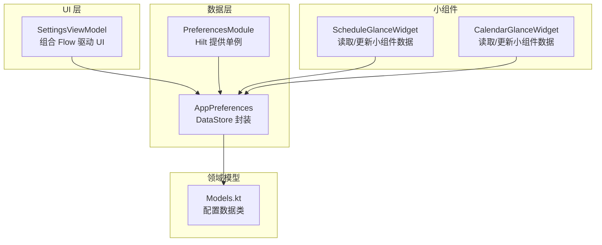
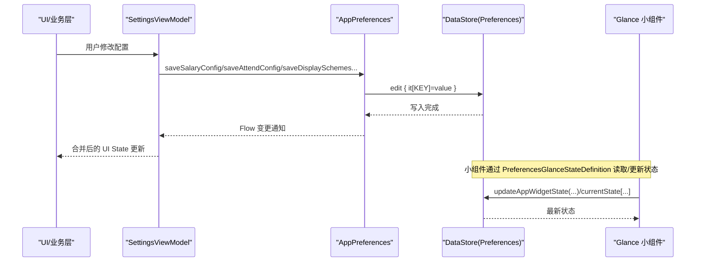
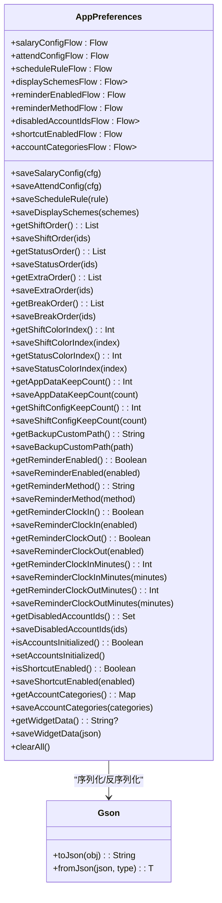
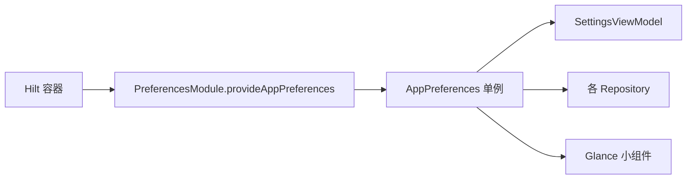
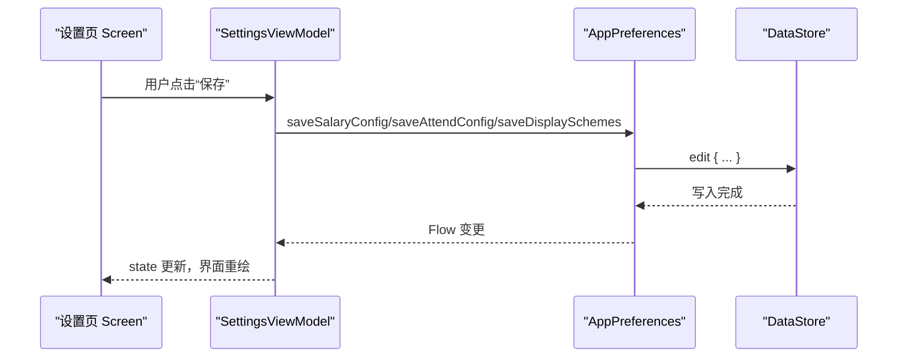
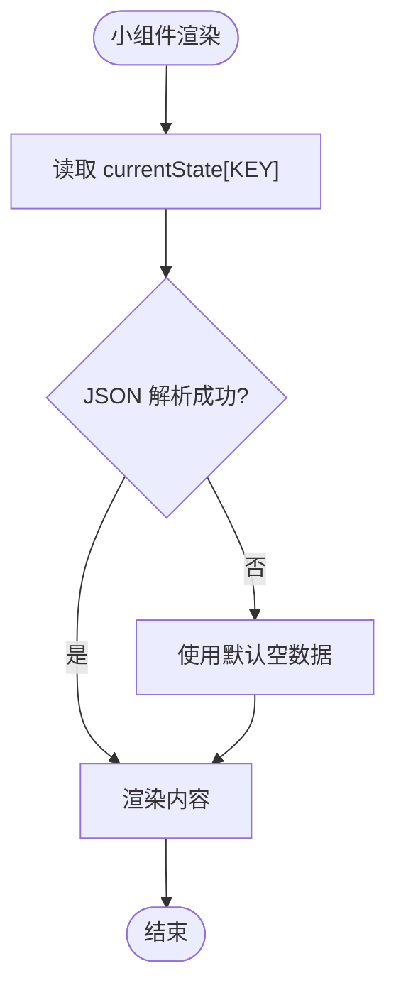
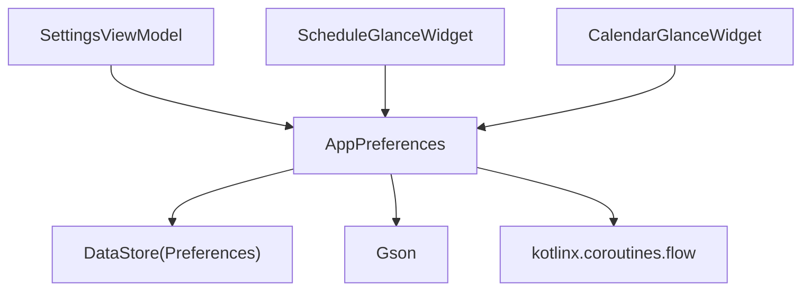

# 偏好设置存储

<cite>
**本文引用的文件**
- [AppPreferences.kt](file://app/src/main/java/com/schedulecalendar/app/data/prefs/AppPreferences.kt)
- [PreferencesModule.kt](file://app/src/main/java/com/schedulecalendar/app/di/PreferencesModule.kt)
- [SettingsViewModel.kt](file://app/src/main/java/com/schedulecalendar/app/ui/settings/SettingsViewModel.kt)
- [Models.kt](file://app/src/main/java/com/schedulecalendar/app/domain/model/Models.kt)
- [ScheduleGlanceWidget.kt](file://app/src/main/java/com/schedulecalendar/app/widget/ScheduleGlanceWidget.kt)
- [CalendarGlanceWidget.kt](file://app/src/main/java/com/schedulecalendar/app/widget/CalendarGlanceWidget.kt)
</cite>

## 目录
1. [简介](#简介)
2. [项目结构](#项目结构)
3. [核心组件](#核心组件)
4. [架构总览](#架构总览)
5. [详细组件分析](#详细组件分析)
6. [依赖关系分析](#依赖关系分析)
7. [性能与内存考虑](#性能与内存考虑)
8. [故障排查指南](#故障排查指南)
9. [结论](#结论)
10. [附录：数据类型与键值映射](#附录数据类型与键值映射)

## 简介
本文件围绕应用中的偏好设置存储方案，系统性阐述基于 DataStore Preferences 的配置与使用方式。重点包括：
- AppPreferences 类的设计模式、数据定义、读写操作与默认值策略
- 基本类型、复杂对象序列化、集合数据的存储方式
- 基于 Flow 的响应式监听机制
- 迁移策略与版本兼容性处理建议
- 最佳实践（性能优化、内存管理、数据安全）
- 与 UI 层集成及状态同步机制

## 项目结构
偏好设置相关代码主要分布在以下位置：
- 数据层：com.schedulecalendar.app.data.prefs.AppPreferences
- 依赖注入：com.schedulecalendar.app.di.PreferencesModule
- 领域模型：com.schedulecalendar.app.domain.model.Models（用于配置对象的定义）
- UI 层：com.schedulecalendar.app.ui.settings.SettingsViewModel（组合多个偏好 Flow 驱动 UI）
- 小组件：widget 包下的 Glance 小组件通过 DataStore 读取/更新展示数据

图表来源
- [AppPreferences.kt:1-303](file://app/src/main/java/com/schedulecalendar/app/data/prefs/AppPreferences.kt#L1-L303)
- [PreferencesModule.kt:1-21](file://app/src/main/java/com/schedulecalendar/app/di/PreferencesModule.kt#L1-L21)
- [SettingsViewModel.kt:1-91](file://app/src/main/java/com/schedulecalendar/app/ui/settings/SettingsViewModel.kt#L1-L91)
- [Models.kt:1-277](file://app/src/main/java/com/schedulecalendar/app/domain/model/Models.kt#L1-L277)
- [ScheduleGlanceWidget.kt:1-353](file://app/src/main/java/com/schedulecalendar/app/widget/ScheduleGlanceWidget.kt#L1-L353)
- [CalendarGlanceWidget.kt:1-272](file://app/src/main/java/com/schedulecalendar/app/widget/CalendarGlanceWidget.kt#L1-L272)

章节来源
- [AppPreferences.kt:1-303](file://app/src/main/java/com/schedulecalendar/app/data/prefs/AppPreferences.kt#L1-L303)
- [PreferencesModule.kt:1-21](file://app/src/main/java/com/schedulecalendar/app/di/PreferencesModule.kt#L1-L21)
- [SettingsViewModel.kt:1-91](file://app/src/main/java/com/schedulecalendar/app/ui/settings/SettingsViewModel.kt#L1-L91)
- [Models.kt:1-277](file://app/src/main/java/com/schedulecalendar/app/domain/model/Models.kt#L1-L277)
- [ScheduleGlanceWidget.kt:1-353](file://app/src/main/java/com/schedulecalendar/app/widget/ScheduleGlanceWidget.kt#L1-L353)
- [CalendarGlanceWidget.kt:1-272](file://app/src/main/java/com/schedulecalendar/app/widget/CalendarGlanceWidget.kt#L1-L272)

## 核心组件
- AppPreferences：对 DataStore Preferences 的统一封装，提供所有偏好项的键、读/写 API 以及基于 Flow 的响应式观察。内部使用 Gson 进行复杂对象与集合的 JSON 序列化/反序列化，并通过 InstanceCreator 确保反序列化时保留 Kotlin data class 的默认值。
- PreferencesModule：通过 Hilt 提供 AppPreferences 的单例实例，供 ViewModel、Repository、Widget 等消费。
- SettingsViewModel：组合多个偏好 Flow，将薪资、考勤、排班规则、显示方案等配置合并为统一的 UI 状态，驱动设置页渲染。
- Models：定义各类配置的数据类（如 SalaryConfig、AttendConfig、DisplayScheme、ScheduleRule 等），作为偏好存储的领域模型。
- 小组件：通过 DataStore 读取/更新小组件展示数据，实现跨进程可见的状态共享。

章节来源
- [AppPreferences.kt:1-303](file://app/src/main/java/com/schedulecalendar/app/data/prefs/AppPreferences.kt#L1-L303)
- [PreferencesModule.kt:1-21](file://app/src/main/java/com/schedulecalendar/app/di/PreferencesModule.kt#L1-L21)
- [SettingsViewModel.kt:1-91](file://app/src/main/java/com/schedulecalendar/app/ui/settings/SettingsViewModel.kt#L1-L91)
- [Models.kt:1-277](file://app/src/main/java/com/schedulecalendar/app/domain/model/Models.kt#L1-L277)

## 架构总览
偏好设置的整体流程如下：
- 写入路径：UI/业务逻辑调用 AppPreferences.saveXxx() → DataStore.edit { ... } 持久化
- 读取路径：
  - 一次性快照：data.first()[KEY] 获取当前值
  - 响应式流：data.map(...) 暴露 Flow，供 UI 订阅
- 依赖注入：Hilt 在应用启动时创建并持有 AppPreferences 单例
- 小组件：通过 PreferencesGlanceStateDefinition 与 DataStore 交互，实现小组件状态持久化与刷新

图表来源
- [AppPreferences.kt:66-101](file://app/src/main/java/com/schedulecalendar/app/data/prefs/AppPreferences.kt#L66-L101)
- [SettingsViewModel.kt:53-64](file://app/src/main/java/com/schedulecalendar/app/ui/settings/SettingsViewModel.kt#L53-L64)
- [ScheduleGlanceWidget.kt:67-80](file://app/src/main/java/com/schedulecalendar/app/widget/ScheduleGlanceWidget.kt#L67-L80)
- [CalendarGlanceWidget.kt:59-70](file://app/src/main/java/com/schedulecalendar/app/widget/CalendarGlanceWidget.kt#L59-L70)

## 详细组件分析

### AppPreferences 设计与实现
- 设计要点
  - 单例：@Singleton + @Inject 构造，配合 Hilt 提供
  - 键集中管理：companion object 中统一声明 string/int 类型的 Key
  - 序列化：Gson + InstanceCreator 保证复杂对象反序列化时使用默认值
  - 响应式：Flow 暴露常用配置的实时变化；一次性读取使用 first()
  - 原子写入：edit { ... } 保证事务性写入
- 关键能力
  - 复杂对象：SalaryConfig、AttendConfig、ScheduleRule、DisplayScheme 列表
  - 集合：List<String> 以逗号分隔字符串存储；Set<Long> 同理
  - Map：Map<String,String> 以 JSON 存储
  - 布尔/整型：以 String/Int 形式存储，并提供默认值回退
  - 清理：clearAll() 清空所有键值对

图表来源
- [AppPreferences.kt:25-35](file://app/src/main/java/com/schedulecalendar/app/data/prefs/AppPreferences.kt#L25-L35)
- [AppPreferences.kt:37-64](file://app/src/main/java/com/schedulecalendar/app/data/prefs/AppPreferences.kt#L37-L64)
- [AppPreferences.kt:66-101](file://app/src/main/java/com/schedulecalendar/app/data/prefs/AppPreferences.kt#L66-L101)
- [AppPreferences.kt:111-195](file://app/src/main/java/com/schedulecalendar/app/data/prefs/AppPreferences.kt#L111-L195)
- [AppPreferences.kt:197-302](file://app/src/main/java/com/schedulecalendar/app/data/prefs/AppPreferences.kt#L197-L302)

章节来源
- [AppPreferences.kt:1-303](file://app/src/main/java/com/schedulecalendar/app/data/prefs/AppPreferences.kt#L1-L303)

### 依赖注入与生命周期
- PreferencesModule 通过 Hilt 提供 AppPreferences 单例，作用域为 SingletonComponent
- 各 ViewModel、Repository、Widget 均可通过 @Inject 注入 AppPreferences

图表来源
- [PreferencesModule.kt:13-20](file://app/src/main/java/com/schedulecalendar/app/di/PreferencesModule.kt#L13-L20)
- [SettingsViewModel.kt:34-42](file://app/src/main/java/com/schedulecalendar/app/ui/settings/SettingsViewModel.kt#L34-L42)

章节来源
- [PreferencesModule.kt:1-21](file://app/src/main/java/com/schedulecalendar/app/di/PreferencesModule.kt#L1-L21)
- [SettingsViewModel.kt:1-91](file://app/src/main/java/com/schedulecalendar/app/ui/settings/SettingsViewModel.kt#L1-L91)

### UI 层集成与状态同步
- SettingsViewModel 在 init 中 combine 多个偏好 Flow，生成统一的 SettingsUiState，供 Compose Screen 订阅
- 保存操作由 ViewModel 发起，委托给 AppPreferences 的 saveXxx 方法

图表来源
- [SettingsViewModel.kt:53-64](file://app/src/main/java/com/schedulecalendar/app/ui/settings/SettingsViewModel.kt#L53-L64)
- [AppPreferences.kt:66-101](file://app/src/main/java/com/schedulecalendar/app/data/prefs/AppPreferences.kt#L66-L101)

章节来源
- [SettingsViewModel.kt:1-91](file://app/src/main/java/com/schedulecalendar/app/ui/settings/SettingsViewModel.kt#L1-L91)
- [AppPreferences.kt:66-101](file://app/src/main/java/com/schedulecalendar/app/data/prefs/AppPreferences.kt#L66-L101)

### 小组件与偏好设置的交互
- ScheduleGlanceWidget 与 CalendarGlanceWidget 均使用 PreferencesGlanceStateDefinition 作为状态定义
- 通过 updateAppWidgetState 写入小组件数据，并在 provideContent 中从 currentState 读取
- 小组件数据通常以 JSON 字符串形式存储在 DataStore 中，便于跨进程访问

图表来源
- [ScheduleGlanceWidget.kt:62-80](file://app/src/main/java/com/schedulecalendar/app/widget/ScheduleGlanceWidget.kt#L62-L80)
- [CalendarGlanceWidget.kt:55-70](file://app/src/main/java/com/schedulecalendar/app/widget/CalendarGlanceWidget.kt#L55-L70)

章节来源
- [ScheduleGlanceWidget.kt:1-353](file://app/src/main/java/com/schedulecalendar/app/widget/ScheduleGlanceWidget.kt#L1-L353)
- [CalendarGlanceWidget.kt:1-272](file://app/src/main/java/com/schedulecalendar/app/widget/CalendarGlanceWidget.kt#L1-L272)

## 依赖关系分析
- AppPreferences 依赖：
  - Android Context（通过 @ApplicationContext 注入）
  - DataStore Preferences（preferencesDataStore("app_config")）
  - Gson（复杂对象与集合的 JSON 序列化/反序列化）
  - kotlinx.coroutines.flow（map/combine/first）
- 被依赖方：
  - 各 ViewModel（SettingsViewModel 等）
  - 小组件（ScheduleGlanceWidget、CalendarGlanceWidget）
  - 其他需要读取/写入偏好的模块

图表来源
- [AppPreferences.kt:4-21](file://app/src/main/java/com/schedulecalendar/app/data/prefs/AppPreferences.kt#L4-L21)
- [SettingsViewModel.kt:34-42](file://app/src/main/java/com/schedulecalendar/app/ui/settings/SettingsViewModel.kt#L34-L42)
- [ScheduleGlanceWidget.kt:1-30](file://app/src/main/java/com/schedulecalendar/app/widget/ScheduleGlanceWidget.kt#L1-L30)
- [CalendarGlanceWidget.kt:1-30](file://app/src/main/java/com/schedulecalendar/app/widget/CalendarGlanceWidget.kt#L1-L30)

章节来源
- [AppPreferences.kt:1-303](file://app/src/main/java/com/schedulecalendar/app/data/prefs/AppPreferences.kt#L1-L303)
- [SettingsViewModel.kt:1-91](file://app/src/main/java/com/schedulecalendar/app/ui/settings/SettingsViewModel.kt#L1-L91)
- [ScheduleGlanceWidget.kt:1-353](file://app/src/main/java/com/schedulecalendar/app/widget/ScheduleGlanceWidget.kt#L1-L353)
- [CalendarGlanceWidget.kt:1-272](file://app/src/main/java/com/schedulecalendar/app/widget/CalendarGlanceWidget.kt#L1-L272)

## 性能与内存考虑
- 写入策略
  - 使用 edit { ... } 进行原子写入，避免并发冲突
  - 批量更新时尽量合并到一次 edit 中，减少磁盘 I/O
- 读取策略
  - 一次性读取使用 data.first()，避免不必要的 Flow 订阅
  - 响应式场景使用 map/combine 构建最小化的 Flow 链
- 序列化开销
  - 复杂对象与集合采用 JSON 序列化，注意控制对象大小与字段数量
  - 对于频繁更新的配置，可考虑拆分为更小的键或简化数据结构
- 内存管理
  - Flow 应在合适的生命周期内收集（如 ViewModel scope），避免泄漏
  - 小组件渲染时仅解析必要字段，避免大对象反复重建
- 数据安全
  - 敏感信息不建议直接明文存储于 DataStore；如需存储，应结合加密方案
  - 备份路径等外部路径需做合法性校验，防止非法路径导致异常

## 故障排查指南
- 常见问题
  - 首次运行未设置默认值：确保 Flow 的 map 分支返回合理的默认对象
  - JSON 解析失败：使用 runCatching/getOrNull 捕获异常并回退到默认值
  - 小组件不刷新：确认 updateAppWidgetState 后调用了 widget.update(context, id)
- 定位步骤
  - 检查对应 KEY 是否已写入 DataStore
  - 验证 Gson 的 TypeToken 与数据类字段一致性
  - 在 SettingsViewModel 中打印合并后的 UI State，确认 Flow 链路正常

章节来源
- [AppPreferences.kt:91-101](file://app/src/main/java/com/schedulecalendar/app/data/prefs/AppPreferences.kt#L91-L101)
- [ScheduleGlanceWidget.kt:67-80](file://app/src/main/java/com/schedulecalendar/app/widget/ScheduleGlanceWidget.kt#L67-L80)
- [CalendarGlanceWidget.kt:59-70](file://app/src/main/java/com/schedulecalendar/app/widget/CalendarGlanceWidget.kt#L59-L70)

## 结论
本项目通过 AppPreferences 对 DataStore Preferences 进行了统一封装，提供了清晰的键管理、完善的读写 API 与响应式 Flow 支持。借助 Hilt 注入，UI 层与小组件能够稳定地消费偏好数据。建议在后续迭代中关注：
- 迁移策略与版本兼容性的完善
- 敏感数据的加密存储
- 大数据量集合的分片存储与增量更新

## 附录：数据类型与键值映射
以下为部分关键偏好项的类型与存储方式说明（示例）：
- 薪资配置：SalaryConfig → JSON 字符串
- 考勤配置：AttendConfig → JSON 字符串
- 排班规则：ScheduleRule? → JSON 字符串（null 时存空串）
- 显示方案：List<DisplayScheme> → JSON 数组
- 小组件数据：String → JSON 字符串
- 排序列表：List<String> → 逗号分隔字符串
- 颜色索引：Int → Int
- 提醒开关/方式：Boolean/String → String
- 禁用账户 ID：Set<Long> → 逗号分隔字符串
- 账户分类映射：Map<String,String> → JSON 对象

章节来源
- [AppPreferences.kt:37-64](file://app/src/main/java/com/schedulecalendar/app/data/prefs/AppPreferences.kt#L37-L64)
- [AppPreferences.kt:66-101](file://app/src/main/java/com/schedulecalendar/app/data/prefs/AppPreferences.kt#L66-L101)
- [AppPreferences.kt:111-195](file://app/src/main/java/com/schedulecalendar/app/data/prefs/AppPreferences.kt#L111-L195)
- [AppPreferences.kt:197-302](file://app/src/main/java/com/schedulecalendar/app/data/prefs/AppPreferences.kt#L197-L302)
- [Models.kt:111-194](file://app/src/main/java/com/schedulecalendar/app/domain/model/Models.kt#L111-L194)