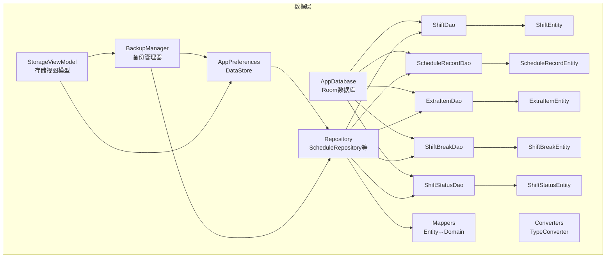
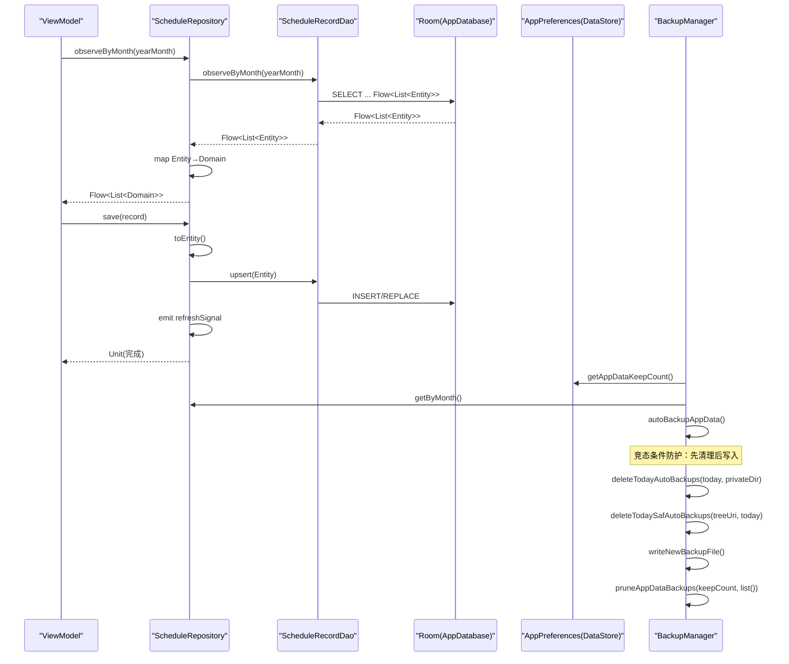
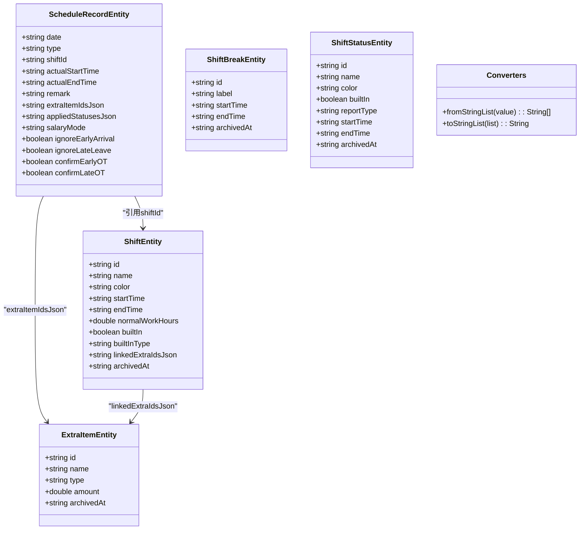
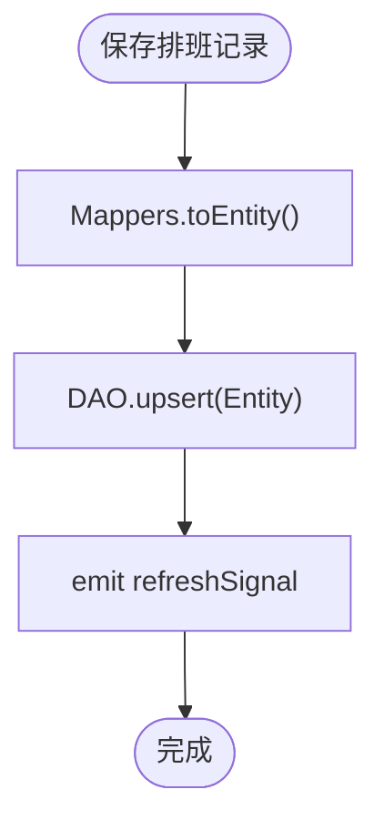
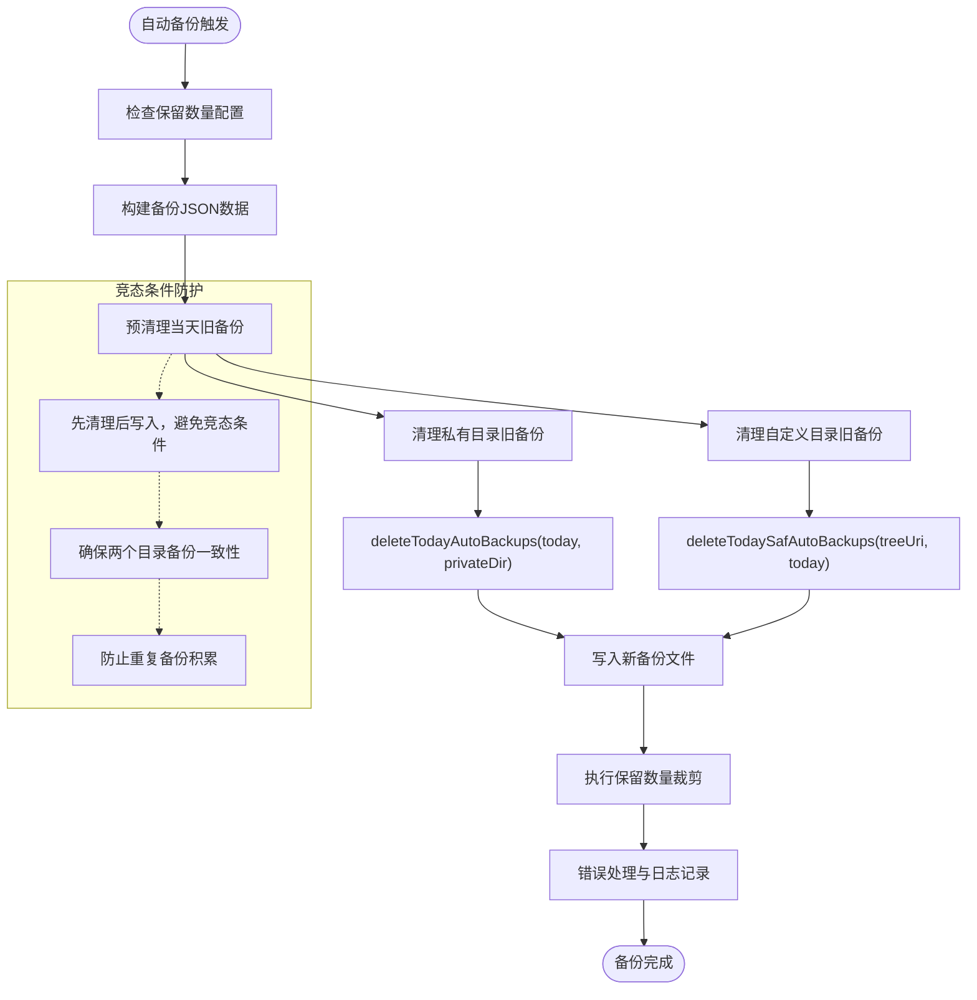
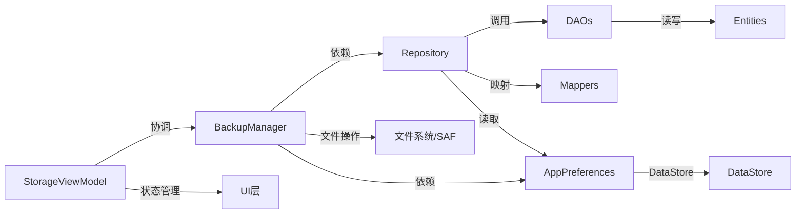

# 数据层设计

<cite>
**本文引用的文件**
- [AppDatabase.kt](file://app/src/main/java/com/schedulecalendar/app/data/db/AppDatabase.kt)
- [Converters.kt](file://app/src/main/java/com/schedulecalendar/app/data/db/Converters.kt)
- [ShiftEntity.kt](file://app/src/main/java/com/schedulecalendar/app/data/db/entity/ShiftEntity.kt)
- [ScheduleRecordEntity.kt](file://app/src/main/java/com/schedulecalendar/app/data/db/entity/ScheduleRecordEntity.kt)
- [ExtraItemEntity.kt](file://app/src/main/java/com/schedulecalendar/app/data/db/entity/ExtraItemEntity.kt)
- [ShiftBreakEntity.kt](file://app/src/main/java/com/schedulecalendar/app/data/db/entity/ShiftBreakEntity.kt)
- [ShiftStatusEntity.kt](file://app/src/main/java/com/schedulecalendar/app/data/db/entity/ShiftStatusEntity.kt)
- [ShiftDao.kt](file://app/src/main/java/com/schedulecalendar/app/data/db/dao/ShiftDao.kt)
- [ScheduleRecordDao.kt](file://app/src/main/java/com/schedulecalendar/app/data/db/dao/ScheduleRecordDao.kt)
- [ExtraItemDao.kt](file://app/src/main/java/com/schedulecalendar/app/data/db/dao/ExtraItemDao.kt)
- [ShiftBreakDao.kt](file://app/src/main/java/com/schedulecalendar/app/data/db/dao/ShiftBreakDao.kt)
- [ShiftStatusDao.kt](file://app/src/main/java/com/schedulecalendar/app/data/db/dao/ShiftStatusDao.kt)
- [Mappers.kt](file://app/src/main/java/com/schedulecalendar/app/data/repository/Mappers.kt)
- [ScheduleRepository.kt](file://app/src/main/java/com/schedulecalendar/app/data/repository/ScheduleRepository.kt)
- [AppPreferences.kt](file://app/src/main/java/com/schedulecalendar/app/data/prefs/AppPreferences.kt)
- [BackupManager.kt](file://app/src/main/java/com/schedulecalendar/app/ui/settings/BackupManager.kt)
- [StorageViewModel.kt](file://app/src/main/java/com/schedulecalendar/app/ui/settings/StorageViewModel.kt)
- [backup_rules.xml](file://app/src/main/res/xml/backup_rules.xml)
- [data_extraction_rules.xml](file://app/src/main/res/xml/data_extraction_rules.xml)
</cite>

## 更新摘要
**变更内容**
- **重大改进**：重构了备份清理序列，防止竞态条件导致新创建的备份文件被误删
- **新增跨目录一致性保障**：在写入新备份前先清理当天旧备份，确保两个目录的备份状态一致
- **优化清理机制**：引入deleteTodayAutoBackups()和deleteTodaySafAutoBackups()方法，实现精确的日期匹配清理
- **增强错误处理**：使用runCatching包裹关键操作，提供更详细的错误信息和日志记录
- **提升可靠性**：通过预清理策略避免竞态条件，确保备份操作的原子性和一致性

## 目录
1. [简介](#简介)
2. [项目结构](#项目结构)
3. [核心组件](#核心组件)
4. [架构总览](#架构总览)
5. [详细组件分析](#详细组件分析)
6. [依赖分析](#依赖分析)
7. [性能考虑](#性能考虑)
8. [故障排查指南](#故障排查指南)
9. [结论](#结论)
10. [附录](#附录)

## 简介
本文件面向Android排班日历应用的数据层设计与实现，聚焦于Room数据库、DAO接口、Repository抽象、DataStore偏好设置、迁移策略、缓存与异步处理、同步与一致性保证、查询优化、备份恢复以及数据安全与隐私保护。文档以"由浅入深"的方式组织，既提供高层架构图示，也给出代码级关系图与关键流程时序图，帮助读者快速理解并扩展数据层能力。

## 项目结构
数据层主要位于 data 包下，按职责划分为：
- db：Room数据库定义、实体、DAO、类型转换器
- repository：领域模型与持久化之间的桥接层，负责映射、事件通知与统一访问入口
- prefs：基于DataStore的偏好设置与配置管理
- di：依赖注入模块（未在本文展开）
- ui.settings.BackupManager：备份与恢复逻辑（调用层）

图表来源
- [AppDatabase.kt:17-34](file://app/src/main/java/com/schedulecalendar/app/data/db/AppDatabase.kt#L17-L34)
- [ShiftDao.kt:8-41](file://app/src/main/java/com/schedulecalendar/app/data/db/dao/ShiftDao.kt#L8-L41)
- [ScheduleRecordDao.kt:8-39](file://app/src/main/java/com/schedulecalendar/app/data/db/dao/ScheduleRecordDao.kt#L8-L39)
- [ExtraItemDao.kt:8-40](file://app/src/main/java/com/schedulecalendar/app/data/db/dao/ExtraItemDao.kt#L8-L40)
- [ShiftBreakDao.kt:8-38](file://app/src/main/java/com/schedulecalendar/app/data/db/dao/ShiftBreakDao.kt#L8-L38)
- [ShiftStatusDao.kt:8-38](file://app/src/main/java/com/schedulecalendar/app/data/db/dao/ShiftStatusDao.kt#L8-L38)
- [Mappers.kt:1-134](file://app/src/main/java/com/schedulecalendar/app/data/repository/Mappers.kt#L1-L134)
- [AppPreferences.kt:25-302](file://app/src/main/java/com/schedulecalendar/app/data/prefs/AppPreferences.kt#L25-L302)
- [BackupManager.kt:31-39](file://app/src/main/java/com/schedulecalendar/app/ui/settings/BackupManager.kt#L31-L39)
- [StorageViewModel.kt:62-71](file://app/src/main/java/com/schedulecalendar/app/ui/settings/StorageViewModel.kt#L62-L71)

章节来源
- [AppDatabase.kt:17-34](file://app/src/main/java/com/schedulecalendar/app/data/db/AppDatabase.kt#L17-L34)
- [AppPreferences.kt:25-302](file://app/src/main/java/com/schedulecalendar/app/data/prefs/AppPreferences.kt#L25-L302)

## 核心组件
- Room数据库与实体
  - AppDatabase集中声明所有实体与版本，导出schema用于迁移追踪
  - 实体采用轻量data class，主键为字符串ID或日期，部分字段使用JSON存储复杂结构
- DAO接口
  - 每个实体对应一个DAO，提供Flow流式观察与suspend阻塞查询
  - 支持"有效/全部"两套查询，归档通过archivedAt字段进行逻辑删除
- Repository层
  - 封装DAO调用，将Entity转换为Domain模型，暴露统一的业务API
  - 使用SharedFlow发出变更信号，驱动UI刷新
- DataStore偏好设置
  - 集中管理应用配置、显示方案、排序、提醒、账户分类等
  - 提供Flow响应式读取与suspend写入，兼容Gson反序列化默认值
- 备份管理器
  - 统一管理应用数据和班次配置的备份与恢复
  - 支持私有目录和自定义路径（包括SAF URI）的统一备份管理
  - 提供自动备份、手动备份、智能清理等功能
  - **重大改进**：重构清理序列防止竞态条件，确保新创建的备份文件不会被后续清理操作误删
  - **跨目录一致性保障**：将私有目录和自定义目录视为整体进行备份管理
  - **智能清理机制**：自动清理当天旧备份，防止重复备份文件积累
  - **增强的错误处理**：使用runCatching包裹关键操作，提供详细的错误信息

章节来源
- [AppDatabase.kt:17-34](file://app/src/main/java/com/schedulecalendar/app/data/db/AppDatabase.kt#L17-L34)
- [ShiftEntity.kt:8-23](file://app/src/main/java/com/schedulecalendar/app/data/db/entity/ShiftEntity.kt#L8-L23)
- [ScheduleRecordEntity.kt:8-25](file://app/src/main/java/com/schedulecalendar/app/data/db/entity/ScheduleRecordEntity.kt#L8-L25)
- [ExtraItemEntity.kt:8-15](file://app/src/main/java/com/schedulecalendar/app/data/db/entity/ExtraItemEntity.kt#L8-L15)
- [ShiftBreakEntity.kt:8-15](file://app/src/main/java/com/schedulecalendar/app/data/db/entity/ShiftBreakEntity.kt#L8-L15)
- [ShiftStatusEntity.kt:8-18](file://app/src/main/java/com/schedulecalendar/app/data/db/entity/ShiftStatusEntity.kt#L8-L18)
- [ShiftDao.kt:8-41](file://app/src/main/java/com/schedulecalendar/app/data/db/dao/ShiftDao.kt#L8-L41)
- [ScheduleRecordDao.kt:8-39](file://app/src/main/java/com/schedulecalendar/app/data/db/dao/ScheduleRecordDao.kt#L8-L39)
- [ExtraItemDao.kt:8-40](file://app/src/main/java/com/schedulecalendar/app/data/db/dao/ExtraItemDao.kt#L8-L40)
- [ShiftBreakDao.kt:8-38](file://app/src/main/java/com/schedulecalendar/app/data/db/dao/ShiftBreakDao.kt#L8-L38)
- [ShiftStatusDao.kt:8-38](file://app/src/main/java/com/schedulecalendar/app/data/db/dao/ShiftStatusDao.kt#L8-L38)
- [Mappers.kt:1-134](file://app/src/main/java/com/schedulecalendar/app/data/repository/Mappers.kt#L1-L134)
- [ScheduleRepository.kt:13-39](file://app/src/main/java/com/schedulecalendar/app/data/repository/ScheduleRepository.kt#L13-L39)
- [AppPreferences.kt:25-302](file://app/src/main/java/com/schedulecalendar/app/data/prefs/AppPreferences.kt#L25-L302)
- [BackupManager.kt:24-39](file://app/src/main/java/com/schedulecalendar/app/ui/settings/BackupManager.kt#L24-L39)

## 架构总览
数据层遵循清晰的分层：UI/ViewModel → Repository → DAO → Room → DataStore（偏好）。Repository承担映射与事件广播；DAO专注SQL与流式查询；Room负责持久化；DataStore负责轻量配置；BackupManager提供统一的数据备份恢复服务。

图表来源
- [ScheduleRepository.kt:22-36](file://app/src/main/java/com/schedulecalendar/app/data/repository/ScheduleRepository.kt#L22-L36)
- [ScheduleRecordDao.kt:10-26](file://app/src/main/java/com/schedulecalendar/app/data/db/dao/ScheduleRecordDao.kt#L10-L26)
- [AppDatabase.kt:28-33](file://app/src/main/java/com/schedulecalendar/app/data/db/AppDatabase.kt#L28-L33)
- [Mappers.kt:92-128](file://app/src/main/java/com/schedulecalendar/app/data/repository/Mappers.kt#L92-L128)
- [BackupManager.kt:190-227](file://app/src/main/java/com/schedulecalendar/app/ui/settings/BackupManager.kt#L190-L227)

## 详细组件分析

### Room数据库与实体设计
- 数据库元信息
  - 版本号为5，开启exportSchema，便于生成与对比迁移脚本
- 实体与关系
  - ShiftEntity：班次定义，含时间、颜色、内置类型、关联补贴/扣款ID列表（JSON）
  - ScheduleRecordEntity：每日排班记录，包含类型、实际上下班时间、备注、附加项ID列表（JSON）、应用状态（JSON）、薪资模式与加班确认标志
  - ExtraItemEntity：补贴/扣款项目
  - ShiftBreakEntity：全局不计入工时时段
  - ShiftStatusEntity：请假/外出/培训等状态类型
- 类型转换
  - Converters提供List<String>与JSON互转，简化复杂字段存取

图表来源
- [ShiftEntity.kt:8-23](file://app/src/main/java/com/schedulecalendar/app/data/db/entity/ShiftEntity.kt#L8-L23)
- [ScheduleRecordEntity.kt:8-25](file://app/src/main/java/com/schedulecalendar/app/data/db/entity/ScheduleRecordEntity.kt#L8-L25)
- [ExtraItemEntity.kt:8-15](file://app/src/main/java/com/schedulecalendar/app/data/db/entity/ExtraItemEntity.kt#L8-L15)
- [ShiftBreakEntity.kt:8-15](file://app/src/main/java/com/schedulecalendar/app/data/db/entity/ShiftBreakEntity.kt#L8-L15)
- [ShiftStatusEntity.kt:8-18](file://app/src/main/java/com/schedulecalendar/app/data/db/entity/ShiftStatusEntity.kt#L8-L18)
- [Converters.kt:9-16](file://app/src/main/java/com/schedulecalendar/app/data/db/Converters.kt#L9-L16)

章节来源
- [AppDatabase.kt:17-34](file://app/src/main/java/com/schedulecalendar/app/data/db/AppDatabase.kt#L17-L34)
- [Converters.kt:9-16](file://app/src/main/java/com/schedulecalendar/app/data/db/Converters.kt#L9-L16)

### DAO接口与查询模式
- 通用模式
  - 提供observeActive()/observeAll()区分"仅有效/含归档"
  - 提供getAll()/getById()等阻塞查询与Flow流式查询
  - 使用onConflict=REPLACE实现upsert语义
  - 使用archivedAt实现逻辑删除
- 典型查询
  - 按月/范围查询排班记录，返回Flow以便UI实时刷新
  - 按ID获取单个实体，适合编辑场景

章节来源
- [ShiftDao.kt:10-41](file://app/src/main/java/com/schedulecalendar/app/data/db/dao/ShiftDao.kt#L10-L41)
- [ScheduleRecordDao.kt:10-39](file://app/src/main/java/com/schedulecalendar/app/data/db/dao/ScheduleRecordDao.kt#L10-L39)
- [ExtraItemDao.kt:10-40](file://app/src/main/java/com/schedulecalendar/app/data/db/dao/ExtraItemDao.kt#L10-L40)
- [ShiftBreakDao.kt:10-38](file://app/src/main/java/com/schedulecalendar/app/data/db/dao/ShiftBreakDao.kt#L10-L38)
- [ShiftStatusDao.kt:10-38](file://app/src/main/java/com/schedulecalendar/app/data/db/dao/ShiftStatusDao.kt#L10-L38)

### Repository层与映射
- 职责
  - 将Entity与Domain模型互相转换（Mappers）
  - 对外暴露简洁的Flow/List API
  - 写操作后发出refreshSignal，供上层订阅刷新
- 映射细节
  - 使用Gson解析JSON字段（如extraItemIds、appliedStatuses）
  - 兼容旧版数据结构（数组格式到单对象格式的过渡）

图表来源
- [ScheduleRepository.kt:32-36](file://app/src/main/java/com/schedulecalendar/app/data/repository/ScheduleRepository.kt#L32-L36)
- [Mappers.kt:114-128](file://app/src/main/java/com/schedulecalendar/app/data/repository/Mappers.kt#L114-L128)

章节来源
- [ScheduleRepository.kt:13-39](file://app/src/main/java/com/schedulecalendar/app/data/repository/ScheduleRepository.kt#L13-L39)
- [Mappers.kt:1-134](file://app/src/main/java/com/schedulecalendar/app/data/repository/Mappers.kt#L1-L134)

### DataStore偏好设置
- 功能覆盖
  - 薪资/考勤/排班规则/显示方案/小组件数据
  - 各类排序（班次、状态、补贴扣款、休息时段）
  - 预设颜色索引、备份保留份数、自定义备份路径
  - 上下班提醒开关、方式、提前分钟数
  - 已禁用日历账户ID集合、账户分类映射、初始化标记
  - 长按快捷方式开关
- 特性
  - 使用Flow响应式读取，edit{}原子写入
  - 使用Gson+InstanceCreator确保Kotlin data class默认值正确反序列化
  - 提供clearAll()一键恢复出厂默认

章节来源
- [AppPreferences.kt:25-302](file://app/src/main/java/com/schedulecalendar/app/data/prefs/AppPreferences.kt#L25-302)

### 数据迁移策略
- 现状
  - 数据库版本为5，启用exportSchema=true，schema文件位于app/schemas/...目录下
- 建议实践
  - 每次修改实体或表结构时，更新版本号并重新生成schema
  - 在AppDatabase中实现Migration，逐步从旧版本迁移至新版本
  - 对JSON字段新增列时，优先保持向后兼容，避免破坏已有数据
  - 针对大表迁移，考虑分批次更新或使用SQLite原生语句

章节来源
- [AppDatabase.kt:17-27](file://app/src/main/java/com/schedulecalendar/app/data/db/AppDatabase.kt#L17-L27)

### 数据同步策略与一致性保证
- 本地一致性
  - 使用Flow保证读端自动感知变化
  - 使用REPLACE策略保证幂等写入
  - 使用archivedAt实现软删除，避免硬删导致的历史不一致
- 跨源同步（如系统日历）
  - 通过CalendarEventRepository与Authenticator相关类对接系统日历
  - 建议在Repository层引入本地快照与远端差异合并策略，结合事务与重试机制
  - 对于冲突数据，采用"最近写入优先"或"用户选择"策略

章节来源
- [ScheduleRecordDao.kt:22-26](file://app/src/main/java/com/schedulecalendar/app/data/db/dao/ScheduleRecordDao.kt#L22-L26)
- [ShiftDao.kt:29-31](file://app/src/main/java/com/schedulecalendar/app/data/db/dao/ShiftDao.kt#L29-L31)
- [ExtraItemDao.kt:31-33](file://app/src/main/java/com/schedulecalendar/app/data/db/dao/ExtraItemDao.kt#L31-L33)
- [ShiftBreakDao.kt:29-31](file://app/src/main/java/com/schedulecalendar/app/data/db/dao/ShiftBreakDao.kt#L29-L31)
- [ShiftStatusDao.kt:26-28](file://app/src/main/java/com/schedulecalendar/app/data/db/dao/ShiftStatusDao.kt#L26-L28)

### 数据模型设计与关系映射
- 主键策略
  - 使用稳定字符串ID作为主键，避免自增ID带来的迁移与同步问题
- 关系建模
  - 多对多通过JSON数组外置（如extraItemIdsJson、linkedExtraIdsJson），在Repository层解析
  - 若未来需要强约束，可引入中间表并建立外键
- 枚举与模式
  - 使用name字符串存储枚举，配合runCatching安全解析，提升兼容性

章节来源
- [ScheduleRecordEntity.kt:8-25](file://app/src/main/java/com/schedulecalendar/app/data/db/entity/ScheduleRecordEntity.kt#L8-L25)
- [ShiftEntity.kt:8-23](file://app/src/main/java/com/schedulecalendar/app/data/db/entity/ShiftEntity.kt#L8-L23)
- [Mappers.kt:92-128](file://app/src/main/java/com/schedulecalendar/app/data/repository/Mappers.kt#L92-L128)

### 查询优化
- 索引建议
  - schedule_records.date：高频按日/月/范围查询
  - shifts.archivedAt、extra_items.archivedAt、shift_statuses.archivedAt：过滤未归档数据
  - shift_statuses.builtIn：排序与筛选
- SQL层面
  - 使用LIKE前缀匹配年月，避免函数包裹列名
  - 使用ORDER BY减少内存排序开销
- 流式查询
  - 尽量使用Flow而非轮询，降低CPU与电量消耗

章节来源
- [ScheduleRecordDao.kt:10-20](file://app/src/main/java/com/schedulecalendar/app/data/db/dao/ScheduleRecordDao.kt#L10-L20)
- [ShiftDao.kt:10-18](file://app/src/main/java/com/schedulecalendar/app/data/db/dao/ShiftDao.kt#L10-L18)
- [ExtraItemDao.kt:10-23](file://app/src/main/java/com/schedulecalendar/app/data/db/dao/ExtraItemDao.kt#L10-L23)
- [ShiftBreakDao.kt:10-21](file://app/src/main/java/com/schedulecalendar/app/data/db/dao/ShiftBreakDao.kt#L10-L21)
- [ShiftStatusDao.kt:10-18](file://app/src/main/java/com/schedulecalendar/app/data/db/dao/ShiftStatusDao.kt#L10-L18)

### 数据备份与恢复

**重大更新** 重构了备份清理序列，防止竞态条件导致新创建的备份文件被误删

- 系统备份
  - backup_rules.xml与data_extraction_rules.xml控制哪些数据允许被系统备份与提取
- 应用内备份
  - BackupManager提供备份/恢复入口，结合DataStore与Room数据导出
  - 支持自定义备份路径与保留份数策略
  - **竞态条件防护**：重构清理序列，在写入新备份前先清理当天的旧备份，确保新文件不会被后续清理操作误删
  - **跨目录一致性保障**：将私有目录和自定义目录视为整体进行备份管理
  - **智能清理机制**：新增deleteTodayAutoBackups()、deleteTodaySafAutoBackups()等方法，确保跨目录备份一致性
  - **防重复积累**：自动清理当天旧备份，防止重复备份文件积累
  - **完善的错误处理**：使用runCatching包裹关键操作，提供详细的错误信息
- 备份策略
  - 应用数据：每天只保留最新一条自动备份
  - 班次配置：每次修改保存后生成新备份
  - 手动备份：始终保留，不受保留数量限制
- 恢复机制
  - 始终从私有目录恢复，确保数据完整性
  - 支持从外部JSON内容直接恢复
- 建议
  - 备份前关闭并发写入，确保一致性
  - 恢复时先校验数据完整性，失败回滚
  - 敏感数据加密存储与传输

图表来源
- [BackupManager.kt:190-227](file://app/src/main/java/com/schedulecalendar/app/ui/settings/BackupManager.kt#L190-L227)
- [BackupManager.kt:230-244](file://app/src/main/java/com/schedulecalendar/app/ui/settings/BackupManager.kt#L230-L244)
- [BackupManager.kt:530-545](file://app/src/main/java/com/schedulecalendar/app/ui/settings/BackupManager.kt#L530-L545)

章节来源
- [BackupManager.kt:24-579](file://app/src/main/java/com/schedulecalendar/app/ui/settings/BackupManager.kt#L24-L579)
- [backup_rules.xml:1-7](file://app/src/main/res/xml/backup_rules.xml#L1-L7)
- [data_extraction_rules.xml:1-14](file://app/src/main/res/xml/data_extraction_rules.xml#L1-L14)
- [AppPreferences.kt:174-192](file://app/src/main/java/com/schedulecalendar/app/data/prefs/AppPreferences.kt#L174-L192)

### 数据安全性与隐私保护
- 本地存储
  - 使用应用私有目录，避免越权访问
  - 对敏感配置（如账户分类、禁用账户ID）进行最小化存储
- 权限与授权
  - 日历账户访问需用户授权，并提供禁用账户列表
  - SAF路径访问需要用户明确授权，支持持久化权限管理
- 合规与透明
  - 明确告知用户备份内容与作用域
  - 提供一键清除偏好设置的能力
  - 备份文件命名规范，便于用户识别和管理

章节来源
- [AppPreferences.kt:250-267](file://app/src/main/java/com/schedulecalendar/app/data/prefs/AppPreferences.kt#L250-L267)
- [AppPreferences.kt:194-195](file://app/src/main/java/com/schedulecalendar/app/data/prefs/AppPreferences.kt#L194-L195)
- [BackupManager.kt:54-63](file://app/src/main/java/com/schedulecalendar/app/ui/settings/BackupManager.kt#L54-L63)

## 依赖分析
- 组件耦合
  - Repository依赖多个DAO与Mappers，职责单一且内聚
  - DAO仅依赖实体与Room注解，低耦合
  - AppPreferences独立于数据库，通过DI注入上下文
  - BackupManager依赖Repository和Preferences，提供统一备份服务
  - StorageViewModel协调BackupManager和UI状态管理
- 外部依赖
  - Gson用于JSON序列化/反序列化
  - DataStore用于偏好设置
  - Room用于关系型数据存储
  - DocumentFile用于SAF路径文件操作

图表来源
- [ScheduleRepository.kt:13-39](file://app/src/main/java/com/schedulecalendar/app/data/repository/ScheduleRepository.kt#L13-L39)
- [Mappers.kt:1-134](file://app/src/main/java/com/schedulecalendar/app/data/repository/Mappers.kt#L1-L134)
- [AppPreferences.kt:25-302](file://app/src/main/java/com/schedulecalendar/app/data/prefs/AppPreferences.kt#L25-L302)
- [BackupManager.kt:31-39](file://app/src/main/java/com/schedulecalendar/app/ui/settings/BackupManager.kt#L31-L39)
- [StorageViewModel.kt:62-71](file://app/src/main/java/com/schedulecalendar/app/ui/settings/StorageViewModel.kt#L62-L71)

章节来源
- [ScheduleRepository.kt:13-39](file://app/src/main/java/com/schedulecalendar/app/data/repository/ScheduleRepository.kt#L13-L39)
- [Mappers.kt:1-134](file://app/src/main/java/com/schedulecalendar/app/data/repository/Mappers.kt#L1-L134)
- [AppPreferences.kt:25-302](file://app/src/main/java/com/schedulecalendar/app/data/prefs/AppPreferences.kt#L25-L302)
- [BackupManager.kt:31-39](file://app/src/main/java/com/schedulecalendar/app/ui/settings/BackupManager.kt#L31-L39)
- [StorageViewModel.kt:62-71](file://app/src/main/java/com/schedulecalendar/app/ui/settings/StorageViewModel.kt#L62-L71)

## 性能考虑
- 使用Flow替代轮询，减少无效IO
- 批量写入使用upsertAll，降低事务次数
- 合理添加索引，避免全表扫描
- JSON字段仅在必要时解析，避免频繁Gson开销
- 大列表分页加载，避免一次性加载过多数据
- **备份优化**：使用DocumentsContract单次IPC查询列出SAF目录文件，避免DocumentFile的N次IPC性能陷阱
- **智能清理**：跨目录合并后统一裁剪，减少重复扫描和文件操作
- **竞态条件防护**：预清理策略避免文件操作竞争，提升备份可靠性
- **错误处理优化**：使用runCatching包裹关键操作，避免异常传播影响用户体验

## 故障排查指南
- 常见问题
  - 数据未刷新：检查Repository是否发出refreshSignal，ViewModel是否正确订阅
  - 归档数据仍可见：确认查询是否误用observeAll()而非observeActive()
  - JSON解析异常：检查Mappers中的兼容逻辑与Gson配置
  - 备份失败：检查备份路径权限与保留策略配置
  - **备份不一致**：检查竞态条件防护机制是否正常执行
  - **重复备份文件**：确认智能清理机制是否正常工作
  - **竞态条件问题**：验证预清理策略是否在写入前正确执行
- 定位步骤
  - 查看日志输出与Flow订阅链路
  - 验证数据库版本与schema一致性
  - 核对DataStore键值是否存在与格式正确
  - **备份问题**：检查私有目录和自定义目录的备份文件命名和清理情况
  - **清理机制**：验证deleteTodayAutoBackups()和deleteTodaySafAutoBackups()的执行结果
  - **竞态条件**：确认autoBackupAppData()中的清理顺序是否正确

章节来源
- [ScheduleRepository.kt:17-21](file://app/src/main/java/com/schedulecalendar/app/data/repository/ScheduleRepository.kt#L17-L21)
- [Mappers.kt:68-88](file://app/src/main/java/com/schedulecalendar/app/data/repository/Mappers.kt#L68-L88)
- [AppPreferences.kt:174-192](file://app/src/main/java/com/schedulecalendar/app/data/prefs/AppPreferences.kt#L174-L192)
- [BackupManager.kt:230-244](file://app/src/main/java/com/schedulecalendar/app/ui/settings/BackupManager.kt#L230-L244)

## 结论
该数据层以Room为核心，结合DAO、Repository与DataStore，形成清晰的分层架构。通过Flow实现响应式数据流，使用JSON与TypeConverter灵活处理复杂字段，借助archivedAt实现软删除与历史一致性。迁移策略与备份恢复机制完善，具备良好可扩展性与维护性。**最新的BackupManager重大改进通过重构清理序列有效防止了竞态条件，确保新创建的备份文件不会被后续清理操作误删。新增的预清理策略、跨目录一致性保障和增强的错误处理机制显著提升了系统的健壮性和可靠性**。后续可在索引优化、事务边界与跨源同步方面持续改进。

## 附录
- 术语
  - Entity：Room实体，映射数据库表
  - DAO：数据访问对象，定义CRUD与查询方法
  - Repository：数据访问抽象层，封装业务逻辑与映射
  - DataStore：Android官方偏好设置库，支持Flow与协程
  - SAF：Storage Access Framework，Android存储访问框架
  - BackupManager：统一备份管理器，提供竞态条件防护和跨目录备份一致性保障
  - StorageViewModel：存储界面视图模型，协调备份操作与UI状态
- 参考路径
  - 数据库定义：[AppDatabase.kt](file://app/src/main/java/com/schedulecalendar/app/data/db/AppDatabase.kt)
  - 实体定义：[entity/*](file://app/src/main/java/com/schedulecalendar/app/data/db/entity/)
  - DAO接口：[dao/*](file://app/src/main/java/com/schedulecalendar/app/data/db/dao/)
  - 映射器：[Mappers.kt](file://app/src/main/java/com/schedulecalendar/app/data/repository/Mappers.kt)
  - 仓库实现：[repository/*](file://app/src/main/java/com/schedulecalendar/app/data/repository/)
  - 偏好设置：[AppPreferences.kt](file://app/src/main/java/com/schedulecalendar/app/data/prefs/AppPreferences.kt)
  - 备份管理：[BackupManager.kt](file://app/src/main/java/com/schedulecalendar/app/ui/settings/BackupManager.kt)
  - 存储视图模型：[StorageViewModel.kt](file://app/src/main/java/com/schedulecalendar/app/ui/settings/StorageViewModel.kt)