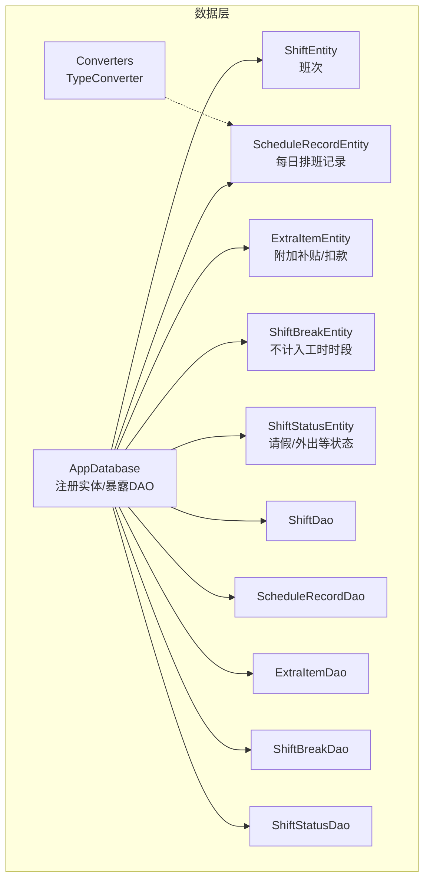
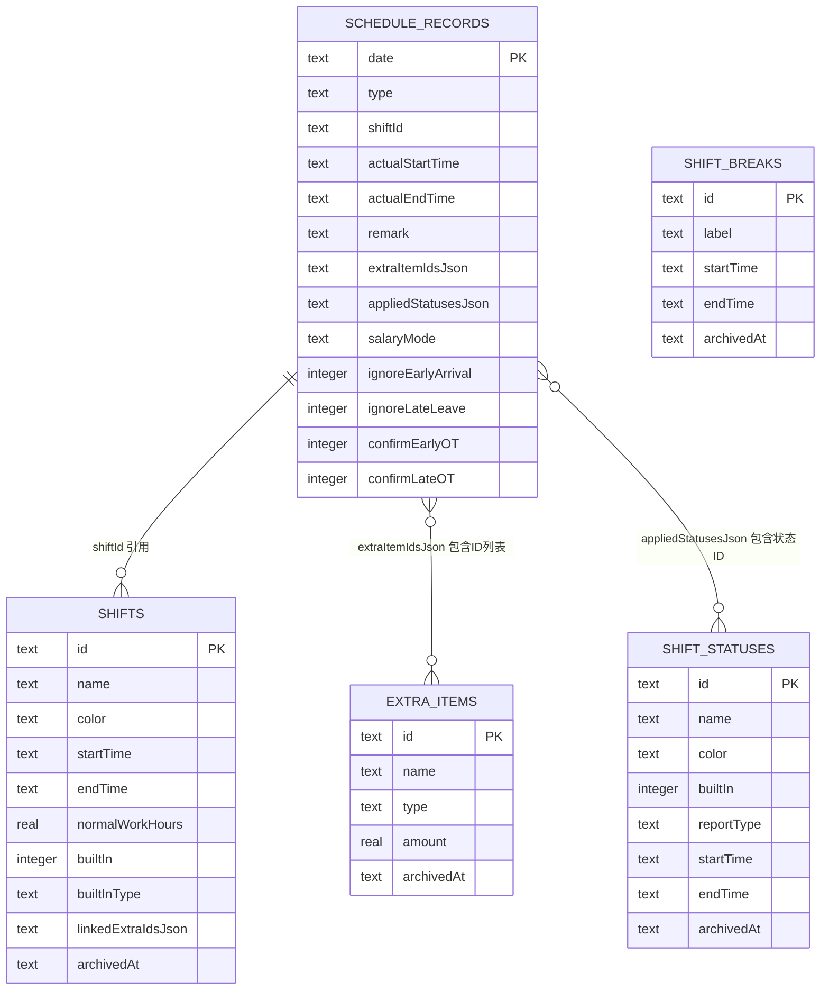
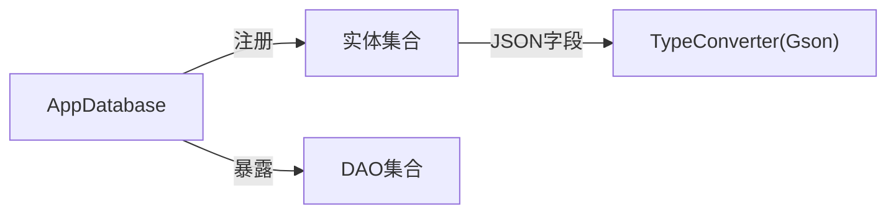

# 数据库架构设计

<cite>
**本文引用的文件**   
- [AppDatabase.kt](file://app/src/main/java/com/schedulecalendar/app/data/db/AppDatabase.kt)
- [Converters.kt](file://app/src/main/java/com/schedulecalendar/app/data/db/Converters.kt)
- [ShiftEntity.kt](file://app/src/main/java/com/schedulecalendar/app/data/db/entity/ShiftEntity.kt)
- [ScheduleRecordEntity.kt](file://app/src/main/java/com/schedulecalendar/app/data/db/entity/ScheduleRecordEntity.kt)
- [ExtraItemEntity.kt](file://app/src/main/java/com/schedulecalendar/app/data/db/entity/ExtraItemEntity.kt)
- [ShiftBreakEntity.kt](file://app/src/main/java/com/schedulecalendar/app/data/db/entity/ShiftBreakEntity.kt)
- [ShiftStatusEntity.kt](file://app/src/main/java/com/schedulecalendar/app/data/db/entity/ShiftStatusEntity.kt)
- [ShiftDao.kt](file://app/src/main/java/com/schedulecalendar/app/data/db/dao/ShiftDao.kt)
- [ScheduleRecordDao.kt](file://app/src/main/java/com/schedulecalendar/app/data/db/dao/ScheduleRecordDao.kt)
- [ExtraItemDao.kt](file://app/src/main/java/com/schedulecalendar/app/data/db/dao/ExtraItemDao.kt)
- [ShiftBreakDao.kt](file://app/src/main/java/com/schedulecalendar/app/data/db/dao/ShiftBreakDao.kt)
- [ShiftStatusDao.kt](file://app/src/main/java/com/schedulecalendar/app/data/db/dao/ShiftStatusDao.kt)
- [5.json](file://app/schemas/com.schedulecalendar.app.data.db.AppDatabase/5.json)
</cite>

## 目录
1. [简介](#简介)
2. [项目结构](#项目结构)
3. [核心组件](#核心组件)
4. [架构总览](#架构总览)
5. [详细组件分析](#详细组件分析)
6. [依赖关系分析](#依赖关系分析)
7. [性能考虑与索引建议](#性能考虑与索引建议)
8. [故障排查指南](#故障排查指南)
9. [结论](#结论)

## 简介
本文件面向排班与考勤应用的数据层，系统性阐述基于 Room 的数据库架构设计与实体关系模型。内容覆盖主数据库类 AppDatabase 的配置与初始化、版本管理与 Schema 导出机制；全面解析各实体（班次、排班记录、附加项目、休息时段、状态）的字段定义、数据类型映射与约束；说明实体间关联关系、外键策略与数据完整性保证；解释自定义 TypeConverter 的实现原理与使用场景；并提供数据库性能优化策略与索引设计建议。

## 项目结构
数据层采用“实体-DAO-数据库”分层组织：
- 实体层：定义表结构与字段映射
- DAO 层：声明 SQL 查询与增删改操作
- 数据库层：集中注册实体、暴露 DAO、管理版本与 Schema 导出

图表来源
- [AppDatabase.kt:17-34](file://app/src/main/java/com/schedulecalendar/app/data/db/AppDatabase.kt#L17-L34)
- [ShiftEntity.kt:8-23](file://app/src/main/java/com/schedulecalendar/app/data/db/entity/ShiftEntity.kt#L8-L23)
- [ScheduleRecordEntity.kt:8-25](file://app/src/main/java/com/schedulecalendar/app/data/db/entity/ScheduleRecordEntity.kt#L8-L25)
- [ExtraItemEntity.kt:8-15](file://app/src/main/java/com/schedulecalendar/app/data/db/entity/ExtraItemEntity.kt#L8-L15)
- [ShiftBreakEntity.kt:8-15](file://app/src/main/java/com/schedulecalendar/app/data/db/entity/ShiftBreakEntity.kt#L8-L15)
- [ShiftStatusEntity.kt:8-18](file://app/src/main/java/com/schedulecalendar/app/data/db/entity/ShiftStatusEntity.kt#L8-L18)
- [Converters.kt:9-16](file://app/src/main/java/com/schedulecalendar/app/data/db/Converters.kt#L9-L16)

章节来源
- [AppDatabase.kt:17-34](file://app/src/main/java/com/schedulecalendar/app/data/db/AppDatabase.kt#L17-L34)

## 核心组件
- 主数据库类 AppDatabase：通过 @Database 注解注册全部实体、设置版本号并开启 Schema 导出；提供对五个 DAO 的抽象访问方法。
- 实体类：以 data class + @Entity 描述表结构，@PrimaryKey 标识主键，字段类型与 SQLite 亲和性一一对应。
- DAO 接口：封装所有 SQL 查询与变更操作，广泛使用 Flow 实现响应式观察。
- 转换器 Converters：将复杂对象序列化为 JSON 字符串存储，并在读取时反序列化回集合或对象。

章节来源
- [AppDatabase.kt:17-34](file://app/src/main/java/com/schedulecalendar/app/data/db/AppDatabase.kt#L17-L34)
- [Converters.kt:9-16](file://app/src/main/java/com/schedulecalendar/app/data/db/Converters.kt#L9-L16)

## 架构总览
下图展示了数据库、实体与 DAO 的整体交互关系，以及逻辑关联（非物理外键）的指向。

图表来源
- [5.json:8-300](file://app/schemas/com.schedulecalendar.app.data.db.AppDatabase/5.json#L8-L300)

## 详细组件分析

### 主数据库类 AppDatabase
- 配置要点
  - 实体注册：一次性声明所有参与建表的实体类。
  - 版本管理：version=5，配合迁移脚本演进数据库结构。
  - Schema 导出：exportSchema=true，编译期生成 JSON Schema 到 app/schemas 目录，便于追踪 schema 变化与校验。
- 初始化与访问
  - 通过抽象方法暴露 DAO，上层通过依赖注入获取单例实例后调用对应 DAO。
- 注意事项
  - 当前未启用外键约束，数据一致性由业务层保障。
  - 归档字段 archivedAt 用于逻辑删除，查询时需过滤 null。

章节来源
- [AppDatabase.kt:17-34](file://app/src/main/java/com/schedulecalendar/app/data/db/AppDatabase.kt#L17-L34)
- [5.json:1-10](file://app/schemas/com.schedulecalendar.app.data.db.AppDatabase/5.json#L1-L10)

### 实体与字段映射

#### ShiftEntity（班次）
- 表名：shifts
- 主键：id（TEXT）
- 关键字段
  - name、color、startTime、endTime：文本型，NOT NULL
  - normalWorkHours：REAL，可空，表示正常班时长（小时），null 表示不限制加班分界
  - builtIn：INTEGER，是否内置
  - builtInType：TEXT，可选，内置类型枚举值
  - linkedExtraIdsJson：TEXT，JSON 数组，关联的附加项目 ID 列表
  - archivedAt：TEXT，逻辑删除时间戳，null 表示有效
- 约束与默认值
  - 除 normalWorkHours、builtInType、archivedAt 外均为 NOT NULL
  - 无外键约束，linkedExtraIdsJson 为软引用

章节来源
- [ShiftEntity.kt:8-23](file://app/src/main/java/com/schedulecalendar/app/data/db/entity/ShiftEntity.kt#L8-L23)
- [5.json:8-75](file://app/schemas/com.schedulecalendar.app.data.db.AppDatabase/5.json#L8-L75)

#### ScheduleRecordEntity（排班记录）
- 表名：schedule_records
- 主键：date（TEXT，格式 yyyy-MM-dd）
- 关键字段
  - type：TEXT，排班类型名称
  - shiftId：TEXT，可空，引用班次 id
  - actualStartTime、actualEndTime：HH:mm 文本
  - remark：备注
  - extraItemIdsJson：TEXT，JSON 数组，附加项目 ID 列表
  - appliedStatusesJson：TEXT，JSON 数组，已应用的状态信息（含 statusId 及可选起止时间）
  - salaryMode：TEXT，薪资模式名称或空
  - ignoreEarlyArrival、ignoreLateLeave、confirmEarlyOT、confirmLateOT：布尔标志位
- 约束与默认值
  - 多数字段 NOT NULL，部分可为空
  - 无外键约束，shiftId 为软引用

章节来源
- [ScheduleRecordEntity.kt:8-25](file://app/src/main/java/com/schedulecalendar/app/data/db/entity/ScheduleRecordEntity.kt#L8-L25)
- [5.json:77-160](file://app/schemas/com.schedulecalendar.app.data.db.AppDatabase/5.json#L77-L160)

#### ExtraItemEntity（附加项目）
- 表名：extra_items
- 主键：id（TEXT）
- 关键字段
  - name：名称
  - type：类型（如“allowance”、“deduction”）
  - amount：金额（REAL）
  - archivedAt：逻辑删除时间戳
- 约束与默认值
  - 基本字段 NOT NULL，amount 不可为空

章节来源
- [ExtraItemEntity.kt:8-15](file://app/src/main/java/com/schedulecalendar/app/data/db/entity/ExtraItemEntity.kt#L8-L15)
- [5.json:162-201](file://app/schemas/com.schedulecalendar.app.data.db.AppDatabase/5.json#L162-L201)

#### ShiftBreakEntity（休息时段）
- 表名：shift_breaks
- 主键：id（TEXT）
- 关键字段
  - label：标签
  - startTime、endTime：HH:mm 文本
  - archivedAt：逻辑删除时间戳
- 约束与默认值
  - 基本字段 NOT NULL

章节来源
- [ShiftBreakEntity.kt:8-15](file://app/src/main/java/com/schedulecalendar/app/data/db/entity/ShiftBreakEntity.kt#L8-L15)
- [5.json:203-242](file://app/schemas/com.schedulecalendar.app.data.db.AppDatabase/5.json#L203-L242)

#### ShiftStatusEntity（状态）
- 表名：shift_statuses
- 主键：id（TEXT）
- 关键字段
  - name、color：名称与颜色
  - builtIn：是否内置
  - reportType：报告类型（如“leave”、“swap”）
  - startTime、endTime：HH:mm 文本
  - archivedAt：逻辑删除时间戳
- 约束与默认值
  - 基本字段 NOT NULL

章节来源
- [ShiftStatusEntity.kt:8-18](file://app/src/main/java/com/schedulecalendar/app/data/db/entity/ShiftStatusEntity.kt#L8-L18)
- [5.json:244-300](file://app/schemas/com.schedulecalendar.app.data.db.AppDatabase/5.json#L244-L300)

### 实体间关联关系与数据完整性
- 逻辑关联
  - schedule_records.shiftId → shifts.id（软引用）
  - schedule_records.extraItemIdsJson → extra_items.id 列表（JSON 内嵌）
  - schedule_records.appliedStatusesJson → shift_statuses.id 列表（JSON 内嵌）
- 外键约束
  - 当前未启用外键约束，数据一致性由业务层在写入/更新时维护
- 数据完整性建议
  - 建议在写入 schedule_records 前校验 shiftId 是否存在于 shifts
  - 对 JSON 数组中的 ID 进行存在性校验，避免脏数据
  - 使用事务批量写入，确保多表变更的一致性

章节来源
- [5.json:77-160](file://app/schemas/com.schedulecalendar.app.data.db.AppDatabase/5.json#L77-L160)
- [5.json:8-75](file://app/schemas/com.schedulecalendar.app.data.db.AppDatabase/5.json#L8-L75)
- [5.json:162-201](file://app/schemas/com.schedulecalendar.app.data.db.AppDatabase/5.json#L162-L201)
- [5.json:244-300](file://app/schemas/com.schedulecalendar.app.data.db.AppDatabase/5.json#L244-L300)

### 自定义 TypeConverter 实现原理与使用场景
- 实现原理
  - 使用 Gson 将 List<String> 序列化为 JSON 字符串存储
  - 读取时将 JSON 字符串反序列化为 List<String>
- 使用场景
  - 应用于需要存储集合类型的字段，例如 schedule_records.extraItemIdsJson
- 注意
  - 需确保 JSON 结构稳定，避免反序列化失败
  - 对于复杂嵌套对象，可扩展更多 TypeConverter

章节来源
- [Converters.kt:9-16](file://app/src/main/java/com/schedulecalendar/app/data/db/Converters.kt#L9-L16)
- [ScheduleRecordEntity.kt:16-19](file://app/src/main/java/com/schedulecalendar/app/data/db/entity/ScheduleRecordEntity.kt#L16-L19)

### DAO 与查询模式
- 响应式查询
  - 大量使用 Flow<List<T>> 返回实时数据流，便于 UI 自动刷新
- 常见模式
  - observeActive()/observeAll()：区分仅有效与包含归档的记录
  - upsert/upsertAll：幂等写入，冲突策略 REPLACE
  - archiveById：逻辑删除，设置 archivedAt
- 示例路径
  - 班次：[ShiftDao.kt:10-41](file://app/src/main/java/com/schedulecalendar/app/data/db/dao/ShiftDao.kt#L10-L41)
  - 排班记录：[ScheduleRecordDao.kt:10-39](file://app/src/main/java/com/schedulecalendar/app/data/db/dao/ScheduleRecordDao.kt#L10-L39)
  - 附加项目：[ExtraItemDao.kt:10-40](file://app/src/main/java/com/schedulecalendar/app/data/db/dao/ExtraItemDao.kt#L10-L40)
  - 休息时段：[ShiftBreakDao.kt:10-38](file://app/src/main/java/com/schedulecalendar/app/data/db/dao/ShiftBreakDao.kt#L10-L38)
  - 状态：[ShiftStatusDao.kt:10-38](file://app/src/main/java/com/schedulecalendar/app/data/db/dao/ShiftStatusDao.kt#L10-L38)

章节来源
- [ShiftDao.kt:10-41](file://app/src/main/java/com/schedulecalendar/app/data/db/dao/ShiftDao.kt#L10-L41)
- [ScheduleRecordDao.kt:10-39](file://app/src/main/java/com/schedulecalendar/app/data/db/dao/ScheduleRecordDao.kt#L10-L39)
- [ExtraItemDao.kt:10-40](file://app/src/main/java/com/schedulecalendar/app/data/db/dao/ExtraItemDao.kt#L10-L40)
- [ShiftBreakDao.kt:10-38](file://app/src/main/java/com/schedulecalendar/app/data/db/dao/ShiftBreakDao.kt#L10-L38)
- [ShiftStatusDao.kt:10-38](file://app/src/main/java/com/schedulecalendar/app/data/db/dao/ShiftStatusDao.kt#L10-L38)

## 依赖关系分析
- 模块耦合
  - AppDatabase 强依赖所有实体与 DAO
  - DAO 仅依赖对应实体，保持高内聚低耦合
  - Converters 被实体中 JSON 字段间接使用
- 外部依赖
  - Room 运行时库
  - Gson 用于 JSON 序列化/反序列化

图表来源
- [AppDatabase.kt:17-34](file://app/src/main/java/com/schedulecalendar/app/data/db/AppDatabase.kt#L17-L34)
- [Converters.kt:9-16](file://app/src/main/java/com/schedulecalendar/app/data/db/Converters.kt#L9-L16)

章节来源
- [AppDatabase.kt:17-34](file://app/src/main/java/com/schedulecalendar/app/data/db/AppDatabase.kt#L17-L34)
- [Converters.kt:9-16](file://app/src/main/java/com/schedulecalendar/app/data/db/Converters.kt#L9-L16)

## 性能考虑与索引建议
- 现状评估
  - 当前未显式创建索引，主要依赖主键查找
  - 常用查询包括按日期范围、按月、按名称排序、按 archivedAt 过滤
- 建议索引
  - schedule_records.date：已有主键，无需额外索引
  - schedule_records.shiftId：若频繁按班次筛选，建议添加索引
  - shifts.name：若频繁按名称排序/搜索，建议添加索引
  - shifts.archivedAt：若常过滤有效记录，建议添加索引
  - extra_items.name：若频繁按名称排序/搜索，建议添加索引
  - shift_statuses.builtIn、shift_statuses.name：若常按内置与名称排序，建议添加复合索引
- 查询优化
  - 使用 LIKE 'YYYY-MM%' 进行月级查询，建议结合索引提升性能
  - 对大结果集分页查询，避免一次性加载过多数据
- 写入优化
  - 使用 upsertAll 批量写入减少事务开销
  - 对 JSON 字段写入前进行最小化序列化，避免过大负载

章节来源
- [ScheduleRecordDao.kt:10-20](file://app/src/main/java/com/schedulecalendar/app/data/db/dao/ScheduleRecordDao.kt#L10-L20)
- [ShiftDao.kt:10-18](file://app/src/main/java/com/schedulecalendar/app/data/db/dao/ShiftDao.kt#L10-L18)
- [ExtraItemDao.kt:10-19](file://app/src/main/java/com/schedulecalendar/app/data/db/dao/ExtraItemDao.kt#L10-L19)
- [ShiftStatusDao.kt:10-18](file://app/src/main/java/com/schedulecalendar/app/data/db/dao/ShiftStatusDao.kt#L10-L18)

## 故障排查指南
- Schema 不一致
  - 现象：升级时报错或启动崩溃
  - 排查：检查 version 与 app/schemas 下 JSON 是否一致；确认迁移脚本正确
  - 参考：[AppDatabase.kt:25-26](file://app/src/main/java/com/schedulecalendar/app/data/db/AppDatabase.kt#L25-L26)、[5.json:1-10](file://app/schemas/com.schedulecalendar.app.data.db.AppDatabase/5.json#L1-L10)
- JSON 反序列化失败
  - 现象：读取 extraItemIdsJson/appliedStatusesJson 时报错
  - 排查：确认 JSON 格式与 TypeConverter 期望一致；检查历史数据兼容性
  - 参考：[Converters.kt:9-16](file://app/src/main/java/com/schedulecalendar/app/data/db/Converters.kt#L9-L16)
- 数据一致性异常
  - 现象：shiftId 不存在或 JSON 中包含无效 ID
  - 排查：在写入前增加存在性校验；必要时引入外键约束（需谨慎评估迁移成本）
  - 参考：[5.json:77-160](file://app/schemas/com.schedulecalendar.app.data.db.AppDatabase/5.json#L77-L160)

章节来源
- [AppDatabase.kt:25-26](file://app/src/main/java/com/schedulecalendar/app/data/db/AppDatabase.kt#L25-L26)
- [Converters.kt:9-16](file://app/src/main/java/com/schedulecalendar/app/data/db/Converters.kt#L9-L16)
- [5.json:77-160](file://app/schemas/com.schedulecalendar.app.data.db.AppDatabase/5.json#L77-L160)

## 结论
本架构以 Room 为核心，采用轻量化的软引用与 JSON 字段表达多对多关系，简化了外键约束带来的迁移复杂度，同时通过逻辑删除字段 archivedAt 实现了数据的可恢复性与审计能力。配合 DAO 层的响应式查询与批量写入，整体具备良好的可扩展性与可维护性。后续可在关键查询路径上补充索引，进一步提升性能；在数据一致性要求更高的场景，可逐步引入外键约束与更严格的校验流程。