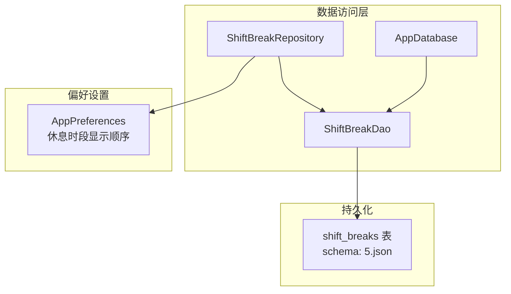
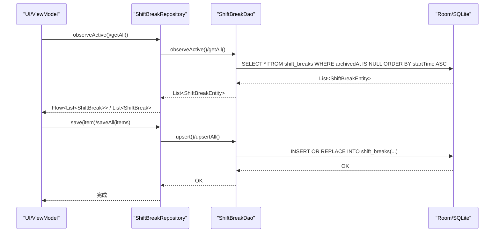
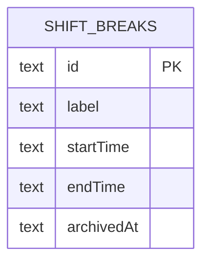
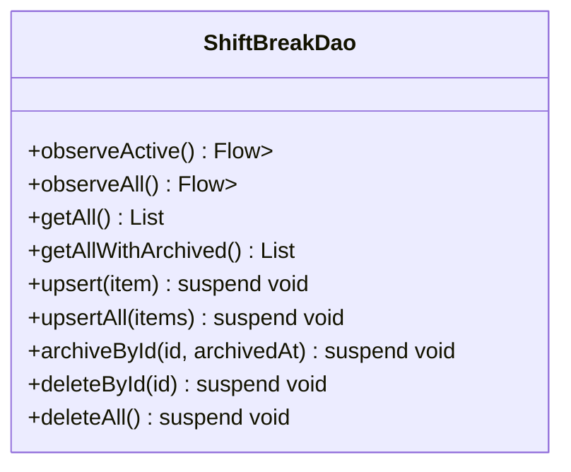
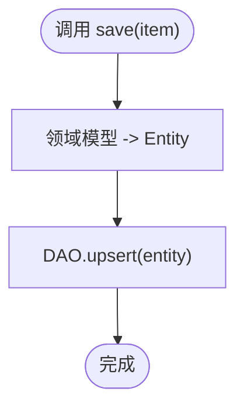
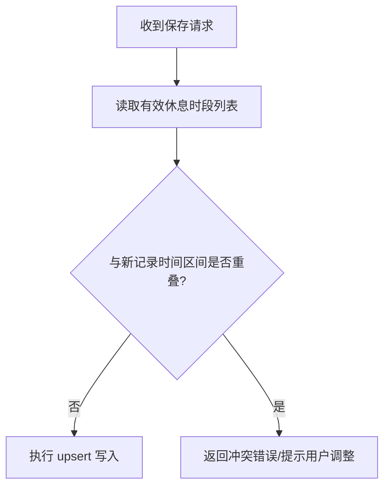
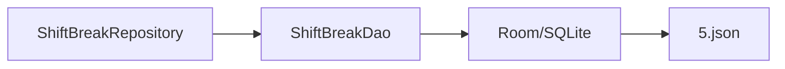

# 休息时段数据访问对象(ShiftBreakDao)

<cite>
**本文引用的文件**   
- [ShiftBreakDao.kt](file://app/src/main/java/com/schedulecalendar/app/data/db/dao/ShiftBreakDao.kt)
- [ShiftBreakEntity.kt](file://app/src/main/java/com/schedulecalendar/app/data/db/entity/ShiftBreakEntity.kt)
- [ShiftBreakRepository.kt](file://app/src/main/java/com/schedulecalendar/app/data/repository/ShiftBreakRepository.kt)
- [AppDatabase.kt](file://app/src/main/java/com/schedulecalendar/app/data/db/AppDatabase.kt)
- [5.json](file://app/schemas/com.schedulecalendar.app.data.db.AppDatabase/5.json)
- [AppPreferences.kt](file://app/src/main/java/com/schedulecalendar/app/data/prefs/AppPreferences.kt)
</cite>

## 目录
1. [简介](#简介)
2. [项目结构](#项目结构)
3. [核心组件](#核心组件)
4. [架构总览](#架构总览)
5. [详细组件分析](#详细组件分析)
6. [依赖关系分析](#依赖关系分析)
7. [性能与一致性](#性能与一致性)
8. [故障排查指南](#故障排查指南)
9. [结论](#结论)
10. [附录](#附录)

## 简介
本文件围绕 ShiftBreakDao 数据访问对象，系统化阐述“休息时段”在排班系统中的数据模型、CRUD 能力、与班次的数据关联方式、时间计算与验证规则、重叠冲突检测策略、业务使用示例以及数据库迁移与版本兼容性要点。文档面向具备基础 Android/Room 知识的读者，同时兼顾非技术读者的可理解性。

## 项目结构
与休息时段相关的关键代码位于 data/db 层（DAO/Entity）、data/repository 层（仓储）以及 schema 导出文件：
- DAO 层：定义对 shift_breaks 表的查询与写入接口
- Entity 层：映射 shift_breaks 表结构
- Repository 层：封装领域模型转换与调用 DAO
- Database 层：声明实体与版本，并导出 schema 用于迁移追踪
- Schema 文件：记录当前数据库版本的结构定义

图表来源
- [ShiftBreakDao.kt:1-39](file://app/src/main/java/com/schedulecalendar/app/data/db/dao/ShiftBreakDao.kt#L1-L39)
- [ShiftBreakRepository.kt:1-27](file://app/src/main/java/com/schedulecalendar/app/data/repository/ShiftBreakRepository.kt#L1-L27)
- [AppDatabase.kt:17-34](file://app/src/main/java/com/schedulecalendar/app/data/db/AppDatabase.kt#L17-L34)
- [5.json:203-242](file://app/schemas/com.schedulecalendar.app.data.db.AppDatabase/5.json#L203-L242)
- [AppPreferences.kt:144-153](file://app/src/main/java/com/schedulecalendar/app/data/prefs/AppPreferences.kt#L144-L153)

章节来源
- [AppDatabase.kt:17-34](file://app/src/main/java/com/schedulecalendar/app/data/db/AppDatabase.kt#L17-L34)
- [5.json:203-242](file://app/schemas/com.schedulecalendar.app.data.db.AppDatabase/5.json#L203-L242)

## 核心组件
- ShiftBreakEntity：表示全局不计入工时的休息时段（如午休、用餐），包含标识、标签、起止时间（HH:mm）与归档标记。
- ShiftBreakDao：提供观察有效/全部列表、批量 upsert、逻辑归档、物理删除等能力。
- ShiftBreakRepository：将 Entity 与领域模型进行双向转换，暴露更贴近业务的 API。
- AppPreferences：维护休息时段的显示顺序配置，便于 UI 展示排序。

章节来源
- [ShiftBreakEntity.kt:8-15](file://app/src/main/java/com/schedulecalendar/app/data/db/entity/ShiftBreakEntity.kt#L8-L15)
- [ShiftBreakDao.kt:8-38](file://app/src/main/java/com/schedulecalendar/app/data/db/dao/ShiftBreakDao.kt#L8-L38)
- [ShiftBreakRepository.kt:11-26](file://app/src/main/java/com/schedulecalendar/app/data/repository/ShiftBreakRepository.kt#L11-L26)
- [AppPreferences.kt:144-153](file://app/src/main/java/com/schedulecalendar/app/data/prefs/AppPreferences.kt#L144-L153)

## 架构总览
下图展示了从 UI/ViewModel 到数据库的调用链，以及休息时段在排班系统中的角色定位。

图表来源
- [ShiftBreakRepository.kt:15-21](file://app/src/main/java/com/schedulecalendar/app/data/repository/ShiftBreakRepository.kt#L15-L21)
- [ShiftBreakDao.kt:10-27](file://app/src/main/java/com/schedulecalendar/app/data/db/dao/ShiftBreakDao.kt#L10-L27)
- [5.json:203-242](file://app/schemas/com.schedulecalendar.app.data.db.AppDatabase/5.json#L203-L242)

## 详细组件分析

### 数据模型与约束
- 主键：id（TEXT）
- 字段：
  - label：文本标签
  - startTime：开始时间（HH:mm）
  - endTime：结束时间（HH:mm）
  - archivedAt：归档时间戳（null 表示有效；非 null 表示已归档）
- 约束：
  - 无外键约束，未建立与班次表的外键关联
  - 无唯一或检查约束，未强制 startTime < endTime 或区间不重叠
  - 默认按 startTime 升序返回结果

图表来源
- [5.json:203-242](file://app/schemas/com.schedulecalendar.app.data.db.AppDatabase/5.json#L203-L242)

章节来源
- [ShiftBreakEntity.kt:8-15](file://app/src/main/java/com/schedulecalendar/app/data/db/entity/ShiftBreakEntity.kt#L8-L15)
- [5.json:203-242](file://app/schemas/com.schedulecalendar.app.data.db.AppDatabase/5.json#L203-L242)

### 数据访问接口（ShiftBreakDao）
- 观察有效列表：observeActive()，仅返回 archivedAt IS NULL 的记录，并按 startTime 升序
- 观察全部列表：observeAll()，包含已归档记录，按 startTime 升序
- 一次性获取：getAll() 与 getAllWithArchived()
- 写入：upsert()/upsertAll()，采用 REPLACE 策略，相同 id 会覆盖旧记录
- 逻辑归档：archiveById(id, archivedAt)，将 archivedAt 设置为指定时间戳
- 物理删除：deleteById()/deleteAll()

图表来源
- [ShiftBreakDao.kt:8-38](file://app/src/main/java/com/schedulecalendar/app/data/db/dao/ShiftBreakDao.kt#L8-L38)

章节来源
- [ShiftBreakDao.kt:10-37](file://app/src/main/java/com/schedulecalendar/app/data/db/dao/ShiftBreakDao.kt#L10-L37)

### 仓储层（ShiftBreakRepository）
- 负责 Entity 与领域模型的转换
- 暴露 observeActive()/observeAll()/getAll()/getAllWithArchived()/save()/saveAll()/archive()/delete()/deleteAll()
- 归档时使用系统时间作为 archivedAt 值

图表来源
- [ShiftBreakRepository.kt:20-23](file://app/src/main/java/com/schedulecalendar/app/data/repository/ShiftBreakRepository.kt#L20-L23)

章节来源
- [ShiftBreakRepository.kt:15-25](file://app/src/main/java/com/schedulecalendar/app/data/repository/ShiftBreakRepository.kt#L15-L25)

### 与班次（Shift）的关联关系与数据完整性
- 当前实现中，休息时段为“全局配置”，不与具体班次建立外键关联
- 因此不存在级联更新/删除、引用完整性约束
- 若需限定某休息时段仅对特定班次生效，可在未来引入外键或中间表，并在应用层增加校验

章节来源
- [ShiftBreakEntity.kt:8-15](file://app/src/main/java/com/schedulecalendar/app/data/db/entity/ShiftBreakEntity.kt#L8-L15)
- [5.json:203-242](file://app/schemas/com.schedulecalendar.app.data.db.AppDatabase/5.json#L203-L242)

### 休息时间计算逻辑与验证规则
- 存储格式：startTime 与 endTime 均为 HH:mm 字符串
- 时长计算：通常以分钟为单位计算差值，跨日场景可按 24:00 归一化处理
- 建议验证规则（推荐在 Repository 或上层业务层实现）：
  - 必填校验：label、startTime、endTime 不可为空
  - 时间格式：符合 HH:mm 规范
  - 区间合法性：startTime < endTime（同日内）；如需支持跨日，应允许 endTime 视为次日
  - 去重/冲突：同一 label 是否允许多条？若不允许，应在保存前做唯一性校验
- 注意：当前 DAO 层未内置上述校验，建议在 Repository 或业务层统一处理

章节来源
- [ShiftBreakEntity.kt:10-14](file://app/src/main/java/com/schedulecalendar/app/data/db/entity/ShiftBreakEntity.kt#L10-L14)
- [ShiftBreakRepository.kt:15-21](file://app/src/main/java/com/schedulecalendar/app/data/repository/ShiftBreakRepository.kt#L15-L21)

### 重叠时间段冲突检测与解决策略
- 现状：数据库层未施加唯一或检查约束，DAO 也未提供冲突检测接口
- 推荐策略（在 Repository 或业务层实现）：
  - 插入/更新前，读取所有有效（archivedAt IS NULL）的休息时段
  - 比较新记录的 [start, end] 是否与已有记录存在交集
  - 冲突处理选项：
    - 拒绝写入并提示用户调整时间
    - 自动拆分或合并（需谨慎，避免破坏语义）
    - 允许覆盖（REPLACE 策略已在 DAO 层生效，但需明确业务含义）
- 复杂度：O(n) 扫描一次有效集合即可判断是否存在重叠

[此图为概念流程，无需图表来源]

### 业务场景示例
- 场景一：新增午休时段
  - 输入：label=“午休”, startTime=“12:00”, endTime=“13:00”
  - 操作：调用 save()，Repository 转换为 Entity 后通过 DAO.upsert() 写入
  - 展示：UI 通过 observeActive() 实时刷新列表
- 场景二：归档历史午休
  - 操作：调用 archive(id)，Repository 使用当前时间戳写入 archivedAt
  - 效果：observeActive() 不再返回该记录，observeAll() 仍可见
- 场景三：批量导入预设休息时段
  - 操作：调用 saveAll()，利用 upsertAll() 批量写入
  - 注意：确保导入数据满足时间格式与业务校验

章节来源
- [ShiftBreakRepository.kt:18-23](file://app/src/main/java/com/schedulecalendar/app/data/repository/ShiftBreakRepository.kt#L18-L23)
- [ShiftBreakDao.kt:23-31](file://app/src/main/java/com/schedulecalendar/app/data/db/dao/ShiftBreakDao.kt#L23-L31)

### 显示顺序与偏好设置
- 休息时段显示顺序由 AppPreferences 中的 break order 控制
- 读取/保存方法分别对应 getBreakOrder() 与 saveBreakOrder(ids)
- 与 DAO 无关，属于 UI 展示层面的排序策略

章节来源
- [AppPreferences.kt:144-153](file://app/src/main/java/com/schedulecalendar/app/data/prefs/AppPreferences.kt#L144-L153)

## 依赖关系分析
- ShiftBreakRepository 依赖 ShiftBreakDao
- ShiftBreakDao 依赖 Room/SQLite（通过 @Query/@Insert 注解）
- AppDatabase 注册了 ShiftBreakEntity 与 ShiftBreakDao，并导出 schema 至 app/schemas
- 当前版本号为 5，schema 文件 5.json 描述了 shift_breaks 表结构

图表来源
- [ShiftBreakRepository.kt:11-14](file://app/src/main/java/com/schedulecalendar/app/data/repository/ShiftBreakRepository.kt#L11-L14)
- [AppDatabase.kt:17-34](file://app/src/main/java/com/schedulecalendar/app/data/db/AppDatabase.kt#L17-L34)
- [5.json:203-242](file://app/schemas/com.schedulecalendar.app.data.db.AppDatabase/5.json#L203-L242)

章节来源
- [AppDatabase.kt:17-34](file://app/src/main/java/com/schedulecalendar/app/data/db/AppDatabase.kt#L17-L34)
- [5.json:203-242](file://app/schemas/com.schedulecalendar.app.data.db.AppDatabase/5.json#L203-L242)

## 性能与一致性
- 查询优化：
  - 默认按 startTime 升序返回，适合时间轴展示
  - 若数据量增长，可为 startTime 建立索引以提升排序性能
- 写入策略：
  - upsert 使用 REPLACE，相同 id 直接覆盖，避免重复插入开销
- 事务与一致性：
  - 批量 upsertAll 可减少往返次数，提升吞吐
  - 归档操作为单行更新，原子性良好
- 内存与流式：
  - observeActive()/observeAll() 返回 Flow，适合响应式 UI 更新

章节来源
- [ShiftBreakDao.kt:10-27](file://app/src/main/java/com/schedulecalendar/app/data/db/dao/ShiftBreakDao.kt#L10-L27)

## 故障排查指南
- 问题：保存后 observeActive() 仍显示已归档记录
  - 排查：确认 archivedAt 是否为 null；检查是否误用 getAllWithArchived()
- 问题：重复保存导致数据被覆盖
  - 说明：upsert 使用 REPLACE，相同 id 会被覆盖；如需保留历史，请更换 id 或使用审计表
- 问题：时间格式异常
  - 排查：确保 startTime/endTime 为 HH:mm 字符串；在 Repository 层增加格式校验
- 问题：重叠冲突未被拦截
  - 说明：当前未实现冲突检测；需在 Repository 或业务层添加区间重叠判断与提示

章节来源
- [ShiftBreakDao.kt:10-31](file://app/src/main/java/com/schedulecalendar/app/data/db/dao/ShiftBreakDao.kt#L10-L31)
- [ShiftBreakRepository.kt:15-23](file://app/src/main/java/com/schedulecalendar/app/data/repository/ShiftBreakRepository.kt#L15-L23)

## 结论
ShiftBreakDao 提供了简洁高效的休息时段数据访问能力，结合 Repository 的领域模型转换，能够支撑常见的增删改查与逻辑归档需求。当前版本未内置时间校验与重叠冲突检测，建议在 Repository 或业务层完善这些规则，以保证数据一致性与用户体验。对于未来的扩展（如与班次关联、多租户隔离等），可通过外键或中间表逐步演进。

## 附录

### 数据库迁移与版本兼容性
- 当前数据库版本：5
- Schema 导出位置：app/schemas/com.schedulecalendar.app.data.db.AppDatabase/5.json
- 关键变更点：
  - shift_breaks 表包含 id、label、startTime、endTime、archivedAt 字段
  - 无外键与检查约束，迁移时需关注应用层校验的完备性
- 迁移建议：
  - 新增字段或约束时，保持向后兼容（例如新增列允许为 null）
  - 在迁移脚本中补充缺失数据的默认值或清洗逻辑
  - 持续导出最新 schema，便于对比与回滚

章节来源
- [AppDatabase.kt:25-26](file://app/src/main/java/com/schedulecalendar/app/data/db/AppDatabase.kt#L25-L26)
- [5.json:203-242](file://app/schemas/com.schedulecalendar.app.data.db.AppDatabase/5.json#L203-L242)