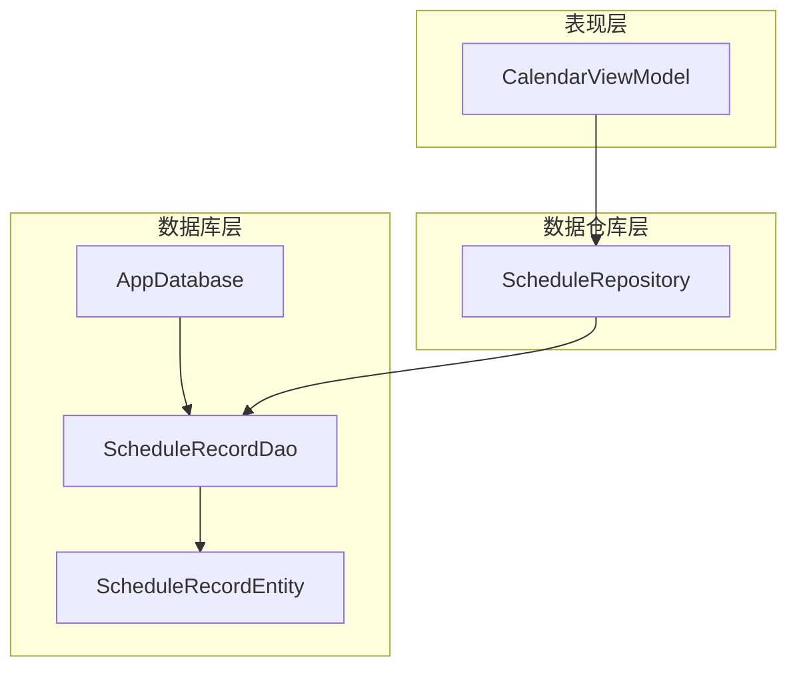
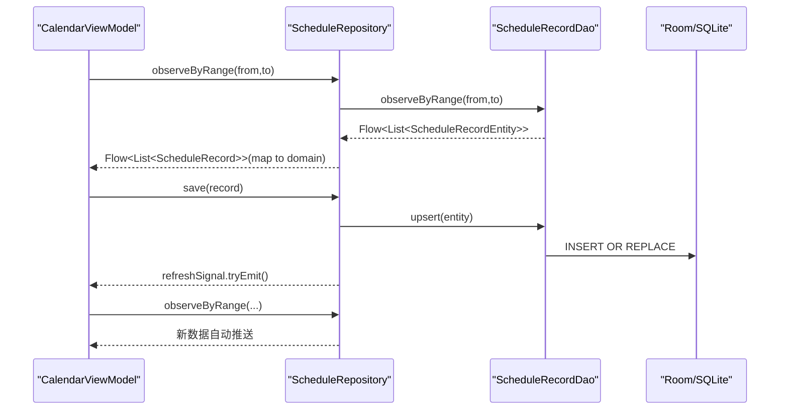
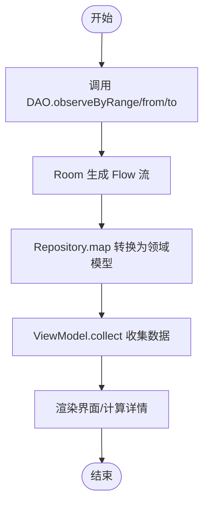
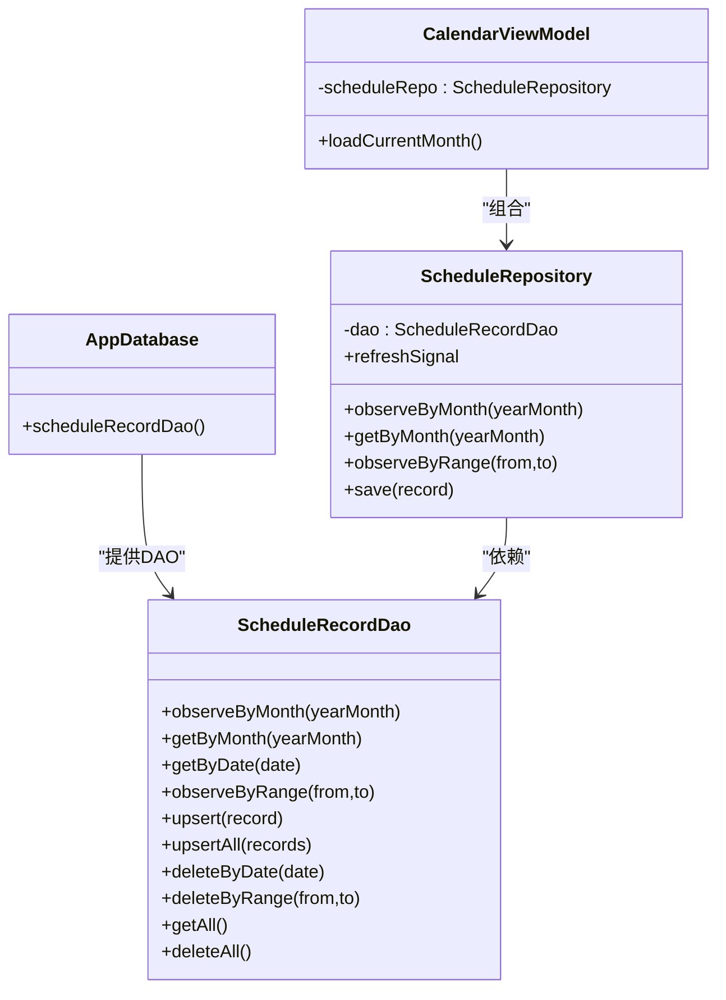

# 排班记录数据访问对象(ScheduleRecordDao)

<cite>
**本文引用的文件**   
- [ScheduleRecordDao.kt](file://app/src/main/java/com/schedulecalendar/app/data/db/dao/ScheduleRecordDao.kt)
- [ScheduleRecordEntity.kt](file://app/src/main/java/com/schedulecalendar/app/data/db/entity/ScheduleRecordEntity.kt)
- [AppDatabase.kt](file://app/src/main/java/com/schedulecalendar/app/data/db/AppDatabase.kt)
- [DatabaseModule.kt](file://app/src/main/java/com/schedulecalendar/app/di/DatabaseModule.kt)
- [ScheduleRepository.kt](file://app/src/main/java/com/schedulecalendar/app/data/repository/ScheduleRepository.kt)
- [CalendarViewModel.kt](file://app/src/main/java/com/schedulecalendar/app/ui/calendar/CalendarViewModel.kt)
</cite>

## 目录
1. [简介](#简介)
2. [项目结构](#项目结构)
3. [核心组件](#核心组件)
4. [架构总览](#架构总览)
5. [详细组件分析](#详细组件分析)
6. [依赖关系分析](#依赖关系分析)
7. [性能与索引建议](#性能与索引建议)
8. [故障排查指南](#故障排查指南)
9. [结论](#结论)
10. [附录：查询示例与业务场景](#附录查询示例与业务场景)

## 简介
本文件围绕 ScheduleRecordDao 数据访问对象，系统化梳理其能力边界、响应式数据流使用方式以及与上层 Repository/ViewModel 的协作模式。重点覆盖按时间范围筛选、状态过滤、统计聚合等高级查询能力的实现思路与扩展点；解释复杂 SQL（多表 JOIN、子查询、GROUP BY）在 Room 中的落地方式；并结合 Flow 实时监听机制说明变更通知链路。文末提供月度汇总、加班统计、工时计算等业务相关查询示例及性能优化建议。

## 项目结构
与 ScheduleRecordDao 直接相关的代码位于 data/db 层，并通过 DI 模块注入到 Repository，最终被 UI 层的 ViewModel 消费。

图表来源
- [AppDatabase.kt:17-34](file://app/src/main/java/com/schedulecalendar/app/data/db/AppDatabase.kt#L17-L34)
- [ScheduleRecordDao.kt:8-39](file://app/src/main/java/com/schedulecalendar/app/data/db/dao/ScheduleRecordDao.kt#L8-L39)
- [ScheduleRecordEntity.kt:7-25](file://app/src/main/java/com/schedulecalendar/app/data/db/entity/ScheduleRecordEntity.kt#L7-L25)
- [ScheduleRepository.kt:13-39](file://app/src/main/java/com/schedulecalendar/app/data/repository/ScheduleRepository.kt#L13-L39)
- [CalendarViewModel.kt:104-115](file://app/src/main/java/com/schedulecalendar/app/ui/calendar/CalendarViewModel.kt#L104-L115)

章节来源
- [AppDatabase.kt:17-34](file://app/src/main/java/com/schedulecalendar/app/data/db/AppDatabase.kt#L17-L34)
- [DatabaseModule.kt:23-34](file://app/src/main/java/com/schedulecalendar/app/di/DatabaseModule.kt#L23-L34)
- [ScheduleRepository.kt:13-39](file://app/src/main/java/com/schedulecalendar/app/data/repository/ScheduleRepository.kt#L13-L39)
- [CalendarViewModel.kt:104-115](file://app/src/main/java/com/schedulecalendar/app/ui/calendar/CalendarViewModel.kt#L104-L115)

## 核心组件
- ScheduleRecordDao：基于 Room 的 DAO 接口，定义对 schedule_records 表的增删改查与 Flow 观察方法。
- ScheduleRecordEntity：映射 schedule_records 表的数据实体，包含日期、班次、实际打卡时间、备注、附加项、应用状态、薪资模式、早到晚退处理标志等字段。
- AppDatabase：Room 数据库入口，注册实体并暴露 DAO 获取器。
- DatabaseModule：Hilt 模块，提供 AppDatabase 与所有 DAO 的单例实例。
- ScheduleRepository：封装业务语义，将 DAO 返回的 Entity 映射为领域模型，并提供刷新信号。
- CalendarViewModel：组合多个 Flow 源，驱动日历视图与待办中心，调用 Repository 进行读写与统计展示。

章节来源
- [ScheduleRecordDao.kt:8-39](file://app/src/main/java/com/schedulecalendar/app/data/db/dao/ScheduleRecordDao.kt#L8-L39)
- [ScheduleRecordEntity.kt:7-25](file://app/src/main/java/com/schedulecalendar/app/data/db/entity/ScheduleRecordEntity.kt#L7-L25)
- [AppDatabase.kt:17-34](file://app/src/main/java/com/schedulecalendar/app/data/db/AppDatabase.kt#L17-L34)
- [DatabaseModule.kt:23-34](file://app/src/main/java/com/schedulecalendar/app/di/DatabaseModule.kt#L23-L34)
- [ScheduleRepository.kt:13-39](file://app/src/main/java/com/schedulecalendar/app/data/repository/ScheduleRepository.kt#L13-L39)
- [CalendarViewModel.kt:104-115](file://app/src/main/java/com/schedulecalendar/app/ui/calendar/CalendarViewModel.kt#L104-L115)

## 架构总览
下图展示了从 UI 到数据库的完整数据通路，以及 Flow 驱动的实时响应链。

图表来源
- [CalendarViewModel.kt:160-166](file://app/src/main/java/com/schedulecalendar/app/ui/calendar/CalendarViewModel.kt#L160-L166)
- [ScheduleRepository.kt:22-36](file://app/src/main/java/com/schedulecalendar/app/data/repository/ScheduleRepository.kt#L22-L36)
- [ScheduleRecordDao.kt:19-26](file://app/src/main/java/com/schedulecalendar/app/data/db/dao/ScheduleRecordDao.kt#L19-L26)

## 详细组件分析

### ScheduleRecordDao 接口与方法
- 按月查询（Flow）：observeByMonth(yearMonth)
- 按月查询（一次性）：getByMonth(yearMonth)
- 按日查询：getByDate(date)
- 按范围查询（Flow）：observeByRange(from, to)
- 插入/更新：upsert(record)、upsertAll(records)
- 删除：deleteByDate(date)、deleteByRange(from, to)、deleteAll()
- 全量读取：getAll()

要点
- 返回类型区分：Flow 用于实时监听，suspend 函数用于一次性读取。
- 时间筛选策略：通过字符串比较与 LIKE 前缀匹配实现“年-月”筛选，范围查询采用 >= 与 <= 比较。
- 冲突策略：INSERT 使用 REPLACE 策略，保证幂等写入。

章节来源
- [ScheduleRecordDao.kt:10-38](file://app/src/main/java/com/schedulecalendar/app/data/db/dao/ScheduleRecordDao.kt#L10-L38)

### ScheduleRecordEntity 数据模型
- 主键：date（yyyy-MM-dd）
- 班次关联：type、shiftId
- 实际打卡：actualStartTime、actualEndTime
- 附加信息：remark、extraItemIdsJson、appliedStatusesJson
- 薪资模式：salaryMode
- 早到晚退处理：ignoreEarlyArrival、ignoreLateLeave、confirmEarlyOT、confirmLateOT

复杂度与存储
- JSON 字段以文本形式存储，便于灵活扩展但需在上层解析。
- 主键即日期，天然适合按日/按月/按范围检索。

章节来源
- [ScheduleRecordEntity.kt:7-25](file://app/src/main/java/com/schedulecalendar/app/data/db/entity/ScheduleRecordEntity.kt#L7-L25)

### 响应式数据流与变更通知
- DAO 返回 Flow<List<...>>，Room 内部监听表变化并自动下发新结果。
- Repository 将 Entity 映射为领域模型，并对外暴露 Flow<List<ScheduleRecord>>。
- 写操作后，Repository 发出 refreshSignal，供上层统一刷新或触发二次加载。

图表来源
- [ScheduleRepository.kt:22-29](file://app/src/main/java/com/schedulecalendar/app/data/repository/ScheduleRepository.kt#L22-L29)
- [CalendarViewModel.kt:160-166](file://app/src/main/java/com/schedulecalendar/app/ui/calendar/CalendarViewModel.kt#L160-L166)

章节来源
- [ScheduleRepository.kt:17-21](file://app/src/main/java/com/schedulecalendar/app/data/repository/ScheduleRepository.kt#L17-L21)
- [CalendarViewModel.kt:160-166](file://app/src/main/java/com/schedulecalendar/app/ui/calendar/CalendarViewModel.kt#L160-L166)

### 复杂查询扩展点（JOIN、子查询、GROUP BY）
当前 DAO 未直接提供统计类方法，但可通过以下方式扩展：
- 多表 JOIN：在 DAO 中定义新的 @Query，结合 ShiftEntity、ShiftBreakEntity、ShiftStatusEntity 等表进行连接查询，返回自定义数据类或 DTO。
- 子查询：在 WHERE/HAVING 中使用子查询表达式，例如根据某条件过滤后再聚合。
- GROUP BY 分组统计：在 @Query 中使用 COUNT/SUM/AVG 等聚合函数，并按日期维度（如 yyyy-MM）分组，返回统计结果列表。

注意
- 若返回非实体类型，需在 DAO 中定义对应的 Data Class 作为返回值。
- 对于大表统计，建议在 Repository 层做分页或增量聚合，避免一次性拉取过多数据。

[本节为概念性扩展说明，不直接分析具体文件]

## 依赖关系分析
- AppDatabase 声明了 ScheduleRecordEntity 与 ScheduleRecordDao。
- DatabaseModule 提供 AppDatabase 单例，并暴露 scheduleRecordDao()。
- ScheduleRepository 通过构造注入持有 ScheduleRecordDao。
- CalendarViewModel 通过 Hilt 注入 ScheduleRepository，并在 init/loadCurrentMonth 中组合 Flow 源。

图表来源
- [AppDatabase.kt:17-34](file://app/src/main/java/com/schedulecalendar/app/data/db/AppDatabase.kt#L17-L34)
- [DatabaseModule.kt:23-34](file://app/src/main/java/com/schedulecalendar/app/di/DatabaseModule.kt#L23-L34)
- [ScheduleRepository.kt:13-39](file://app/src/main/java/com/schedulecalendar/app/data/repository/ScheduleRepository.kt#L13-L39)
- [CalendarViewModel.kt:104-115](file://app/src/main/java/com/schedulecalendar/app/ui/calendar/CalendarViewModel.kt#L104-L115)

章节来源
- [AppDatabase.kt:17-34](file://app/src/main/java/com/schedulecalendar/app/data/db/AppDatabase.kt#L17-L34)
- [DatabaseModule.kt:23-34](file://app/src/main/java/com/schedulecalendar/app/di/DatabaseModule.kt#L23-L34)
- [ScheduleRepository.kt:13-39](file://app/src/main/java/com/schedulecalendar/app/data/repository/ScheduleRepository.kt#L13-L39)
- [CalendarViewModel.kt:104-115](file://app/src/main/java/com/schedulecalendar/app/ui/calendar/CalendarViewModel.kt#L104-L115)

## 性能与索引建议
- 主键索引：date 已为主键，天然具备高效等值与范围查找能力。
- 复合索引建议：
  - (date ASC)：已存在（主键），满足按范围排序需求。
  - (shiftId, date)：当需要按班次+时间范围筛选时，可显著减少扫描。
  - (salaryMode, date)：当按薪资模式聚合统计时，有助于快速定位。
  - (ignoreEarlyArrival, confirmEarlyOT, date)：针对加班确认/忽略状态的过滤与统计。
- 查询优化：
  - 优先使用精确范围查询（>= 与 <=）而非模糊匹配，避免 LIKE 前缀以外的通配符导致全表扫描。
  - 统计类查询尽量在数据库侧完成（GROUP BY、COUNT/SUM），减少内存计算。
  - 对大表统计增加 LIMIT/Pagination，或在 Repository 层分批聚合。
- 写入优化：
  - 批量 upsertAll 优于循环单条插入，降低事务开销。
  - 合理设置 onConflict 策略，避免不必要的回滚与重建。

[本节为通用性能指导，不直接分析具体文件]

## 故障排查指南
- Flow 不更新：
  - 检查是否在正确的协程作用域 collect，且未被提前取消。
  - 确认 write 路径是否调用了 Repository.save/saveAll，从而触发 refreshSignal。
- 查询结果为空：
  - 校验传入的日期格式是否为 yyyy-MM-dd，范围 from<=to。
  - 确认数据是否已写入 schedule_records 表。
- 性能问题：
  - 查看是否使用了低效的 LIKE %xx% 模式，改为前缀匹配或范围比较。
  - 评估是否需要引入复合索引以提升特定查询效率。

章节来源
- [ScheduleRepository.kt:17-21](file://app/src/main/java/com/schedulecalendar/app/data/repository/ScheduleRepository.kt#L17-L21)
- [CalendarViewModel.kt:160-166](file://app/src/main/java/com/schedulecalendar/app/ui/calendar/CalendarViewModel.kt#L160-L166)

## 结论
ScheduleRecordDao 提供了面向排班记录的简洁而强大的数据访问能力，配合 Flow 实现了高效的实时数据同步。当前实现聚焦于基础 CRUD 与时间范围查询，未来可在 DAO 层扩展复杂查询（JOIN、子查询、GROUP BY）以满足月度汇总、加班统计、工时计算等业务需求。通过合理的索引设计与查询策略，可进一步提升大数据量下的性能表现。

[本节为总结性内容，不直接分析具体文件]

## 附录：查询示例与业务场景

### 月度排班汇总
- 目标：获取指定月份的排班明细，并计算当月工作天数、休息天数等。
- 实现思路：
  - 使用 getByMonth(yearMonth) 获取当月全部记录。
  - 在 Repository 或 ViewModel 层按 type/shiftId 分类统计。
- 参考路径
  - [ScheduleRepository.kt:24-26](file://app/src/main/java/com/schedulecalendar/app/data/repository/ScheduleRepository.kt#L24-L26)
  - [CalendarViewModel.kt:199-225](file://app/src/main/java/com/schedulecalendar/app/ui/calendar/CalendarViewModel.kt#L199-L225)

### 加班统计（早到/晚退）
- 目标：统计当月早到加班分钟数、晚退加班分钟数，支持“待确认/已确认/忽略”三类状态。
- 实现思路：
  - 在 DAO 新增统计查询，按日期分组，结合 ignoreEarlyArrival、confirmEarlyOT、ignoreLateLeave、confirmLateOT 字段进行条件聚合。
  - 或使用现有记录在 Repository 层计算，结合班次起止时间与 actualStartTime/actualEndTime。
- 参考路径
  - [ScheduleRecordEntity.kt:10-24](file://app/src/main/java/com/schedulecalendar/app/data/db/entity/ScheduleRecordEntity.kt#L10-L24)
  - [CalendarViewModel.kt:289-320](file://app/src/main/java/com/schedulecalendar/app/ui/calendar/CalendarViewModel.kt#L289-L320)

### 工时计算（含跨日/补录）
- 目标：计算每日有效工时，考虑班次时间、实际打卡时间、午休时段与加班确认。
- 实现思路：
  - 使用 getByDate(date) 获取当日记录，结合 Shift 与 Break 配置计算。
  - 在 ViewModel 层调用 CalcUtils 工具方法进行规范化与累加。
- 参考路径
  - [ScheduleRepository.kt:31](file://app/src/main/java/com/schedulecalendar/app/data/repository/ScheduleRepository.kt#L31)
  - [CalendarViewModel.kt:199-225](file://app/src/main/java/com/schedulecalendar/app/ui/calendar/CalendarViewModel.kt#L199-L225)

### 状态过滤与高级筛选
- 目标：按薪资模式、附加状态、早到晚退处理标志等进行筛选。
- 实现思路：
  - 在 DAO 新增带条件的 observeByRange 重载，支持 salaryMode、appliedStatusesJson 解析后的状态过滤。
  - 使用子查询或 JOIN 关联 ShiftStatus 表进行更细粒度过滤。
- 参考路径
  - [ScheduleRecordDao.kt:19-20](file://app/src/main/java/com/schedulecalendar/app/data/db/dao/ScheduleRecordDao.kt#L19-L20)
  - [ScheduleRecordEntity.kt:18-24](file://app/src/main/java/com/schedulecalendar/app/data/db/entity/ScheduleRecordEntity.kt#L18-L24)

### 实时数据监听与变更通知
- 目标：在用户修改排班后，界面即时刷新。
- 实现思路：
  - 使用 observeByRange 订阅数据流，write 后通过 refreshSignal 触发上层重新组合数据。
- 参考路径
  - [ScheduleRepository.kt:17-21](file://app/src/main/java/com/schedulecalendar/app/data/repository/ScheduleRepository.kt#L17-L21)
  - [CalendarViewModel.kt:160-166](file://app/src/main/java/com/schedulecalendar/app/ui/calendar/CalendarViewModel.kt#L160-L166)