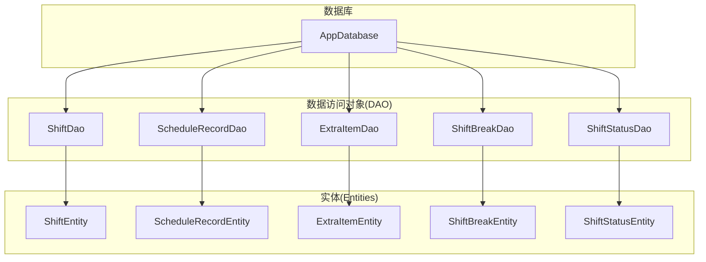
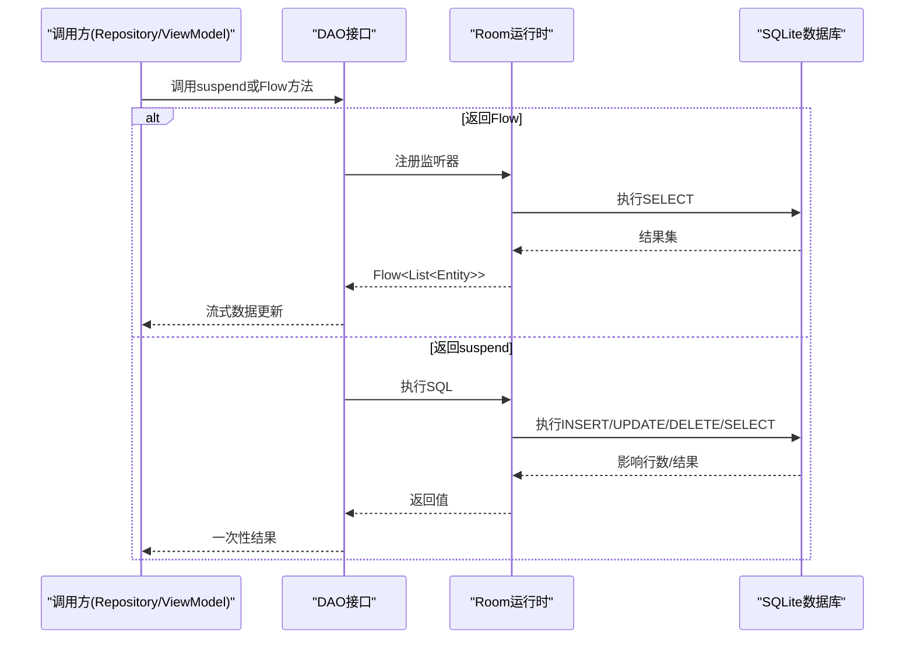
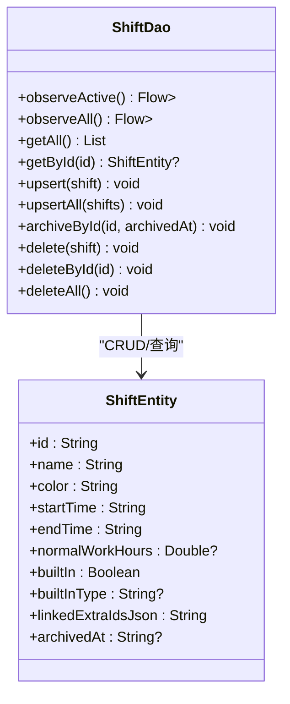
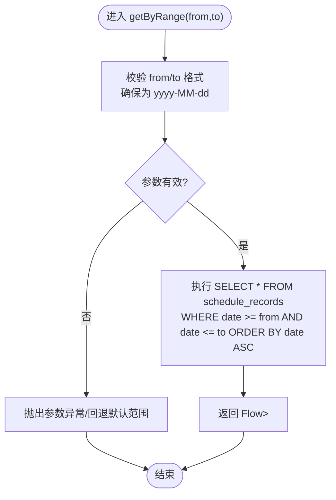
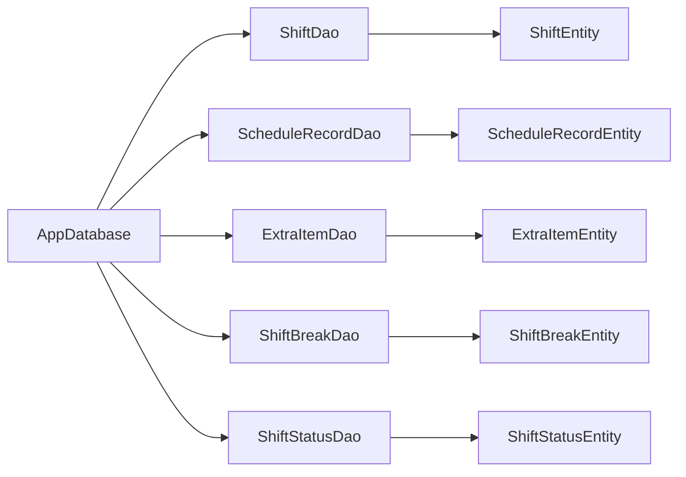

# 数据访问层(DAO)

<cite>
**本文引用的文件**   
- [ShiftDao.kt](file://app/src/main/java/com/schedulecalendar/app/data/db/dao/ShiftDao.kt)
- [ScheduleRecordDao.kt](file://app/src/main/java/com/schedulecalendar/app/data/db/dao/ScheduleRecordDao.kt)
- [ExtraItemDao.kt](file://app/src/main/java/com/schedulecalendar/app/data/db/dao/ExtraItemDao.kt)
- [ShiftBreakDao.kt](file://app/src/main/java/com/schedulecalendar/app/data/db/dao/ShiftBreakDao.kt)
- [ShiftStatusDao.kt](file://app/src/main/java/com/schedulecalendar/app/data/db/dao/ShiftStatusDao.kt)
- [AppDatabase.kt](file://app/src/main/java/com/schedulecalendar/app/data/db/AppDatabase.kt)
- [ShiftEntity.kt](file://app/src/main/java/com/schedulecalendar/app/data/db/entity/ShiftEntity.kt)
- [ScheduleRecordEntity.kt](file://app/src/main/java/com/schedulecalendar/app/data/db/entity/ScheduleRecordEntity.kt)
- [ExtraItemEntity.kt](file://app/src/main/java/com/schedulecalendar/app/data/db/entity/ExtraItemEntity.kt)
- [ShiftBreakEntity.kt](file://app/src/main/java/com/schedulecalendar/app/data/db/entity/ShiftBreakEntity.kt)
- [ShiftStatusEntity.kt](file://app/src/main/java/com/schedulecalendar/app/data/db/entity/ShiftStatusEntity.kt)
</cite>

## 目录
1. [简介](#简介)
2. [项目结构](#项目结构)
3. [核心组件](#核心组件)
4. [架构总览](#架构总览)
5. [详细组件分析](#详细组件分析)
6. [依赖关系分析](#依赖关系分析)
7. [性能与优化](#性能与优化)
8. [故障排查指南](#故障排查指南)
9. [结论](#结论)
10. [附录：Room注解与SQL示例](#附录room注解与sql示例)

## 简介
本文件聚焦于应用的数据访问层（DAO），围绕 Room 注解与 Kotlin Flow 异步流，系统梳理各 DAO 的 CRUD、批量操作、复杂查询与事务处理模式。重点覆盖：
- ShiftDao：CRUD、归档逻辑删除、Flow 实时观察
- ScheduleRecordDao：按日/按月/时间范围查询、批量插入与删除
- ExtraItemDao、ShiftBreakDao、ShiftStatusDao：通用数据操作方法
- Room 注解使用规范与最佳实践
- 异步查询（Flow）在 UI 层的集成方式
- 查询性能优化技巧与常见陷阱

## 项目结构
数据访问层位于 data/db 包下，包含数据库定义、实体与 DAO 接口。整体采用“表-实体-DAO”分层组织，便于维护与扩展。

图表来源
- [AppDatabase.kt:17-34](file://app/src/main/java/com/schedulecalendar/app/data/db/AppDatabase.kt#L17-L34)
- [ShiftDao.kt:8-41](file://app/src/main/java/com/schedulecalendar/app/data/db/dao/ShiftDao.kt#L8-L41)
- [ScheduleRecordDao.kt:8-39](file://app/src/main/java/com/schedulecalendar/app/data/db/dao/ScheduleRecordDao.kt#L8-L39)
- [ExtraItemDao.kt:8-40](file://app/src/main/java/com/schedulecalendar/app/data/db/dao/ExtraItemDao.kt#L8-L40)
- [ShiftBreakDao.kt:8-38](file://app/src/main/java/com/schedulecalendar/app/data/db/dao/ShiftBreakDao.kt#L8-L38)
- [ShiftStatusDao.kt:8-38](file://app/src/main/java/com/schedulecalendar/app/data/db/dao/ShiftStatusDao.kt#L8-L38)

章节来源
- [AppDatabase.kt:1-35](file://app/src/main/java/com/schedulecalendar/app/data/db/AppDatabase.kt#L1-L35)

## 核心组件
- AppDatabase：集中声明所有实体与版本，提供 DAO 获取入口，并导出 schema 用于迁移追踪。
- 各 DAO 接口：基于 @Query、@Insert、@Update、@Delete、@Transaction 等注解定义 SQL 与事务边界；返回类型支持 suspend 函数与 Flow<List<T>> 以适配协程与响应式更新。
- Entity 模型：对应 SQLite 表结构，主键、字段类型与约束由 Room 自动生成迁移脚本。

章节来源
- [AppDatabase.kt:17-34](file://app/src/main/java/com/schedulecalendar/app/data/db/AppDatabase.kt#L17-L34)
- [ShiftDao.kt:8-41](file://app/src/main/java/com/schedulecalendar/app/data/db/dao/ShiftDao.kt#L8-L41)
- [ScheduleRecordDao.kt:8-39](file://app/src/main/java/com/schedulecalendar/app/data/db/dao/ScheduleRecordDao.kt#L8-L39)
- [ExtraItemDao.kt:8-40](file://app/src/main/java/com/schedulecalendar/app/data/db/dao/ExtraItemDao.kt#L8-L40)
- [ShiftBreakDao.kt:8-38](file://app/src/main/java/com/schedulecalendar/app/data/db/dao/ShiftBreakDao.kt#L8-L38)
- [ShiftStatusDao.kt:8-38](file://app/src/main/java/com/schedulecalendar/app/data/db/dao/ShiftStatusDao.kt#L8-L38)

## 架构总览
下图展示了从上层调用到数据库的完整路径，以及 Flow 驱动的实时数据更新机制。

图表来源
- [ShiftDao.kt:10-41](file://app/src/main/java/com/schedulecalendar/app/data/db/dao/ShiftDao.kt#L10-L41)
- [ScheduleRecordDao.kt:10-39](file://app/src/main/java/com/schedulecalendar/app/data/db/dao/ScheduleRecordDao.kt#L10-L39)
- [ExtraItemDao.kt:10-40](file://app/src/main/java/com/schedulecalendar/app/data/db/dao/ExtraItemDao.kt#L10-L40)
- [ShiftBreakDao.kt:10-38](file://app/src/main/java/com/schedulecalendar/app/data/db/dao/ShiftBreakDao.kt#L10-L38)
- [ShiftStatusDao.kt:10-38](file://app/src/main/java/com/schedulecalendar/app/data/db/dao/ShiftStatusDao.kt#L10-L38)

## 详细组件分析

### ShiftDao 分析
职责与能力
- 有效/全部班次列表：通过 archivedAt 过滤实现“逻辑删除”，并提供 Flow 与 suspend 两种读取方式。
- 单条/批量读写：upsert/upsertAll 使用 REPLACE 策略保证幂等写入。
- 归档与删除：archiveById 为逻辑删除；deleteById/deleteAll 为物理删除。
- 排序：默认按名称升序，便于展示稳定顺序。

关键方法与语义
- observeActive()/observeAll()：返回 Flow<List<ShiftEntity>>，适合 UI 实时刷新。
- getAll()/getById()：suspend 一次性查询。
- upsert()/upsertAll()：幂等写入，避免重复记录。
- archiveById()：将 archivedAt 设置为非空值，实现软删除。
- deleteById()/deleteAll()：物理删除。

图表来源
- [ShiftDao.kt:8-41](file://app/src/main/java/com/schedulecalendar/app/data/db/dao/ShiftDao.kt#L8-L41)
- [ShiftEntity.kt:8-23](file://app/src/main/java/com/schedulecalendar/app/data/db/entity/ShiftEntity.kt#L8-L23)

章节来源
- [ShiftDao.kt:1-42](file://app/src/main/java/com/schedulecalendar/app/data/db/dao/ShiftDao.kt#L1-L42)
- [ShiftEntity.kt:1-24](file://app/src/main/java/com/schedulecalendar/app/data/db/entity/ShiftEntity.kt#L1-L24)

### ScheduleRecordDao 分析
职责与能力
- 按日/月/范围查询：支持 yyyy-MM-dd 精确匹配、yyyy-MM 前缀模糊匹配、起止日期范围查询。
- 批量写入：upsert/upsertAll 支持幂等写入。
- 批量删除：按日期或范围删除，便于清理历史数据。
- 全量读取与清空：getAll/deleteAll。

高级功能说明
- 时间范围过滤：通过 >= 和 <= 比较字符串形式的日期，要求输入格式统一为 yyyy-MM-dd。
- 月度查询：利用 LIKE 前缀匹配，快速筛选某月的所有记录。
- 排序：默认按日期升序，利于日历视图渲染。

图表来源
- [ScheduleRecordDao.kt:19-20](file://app/src/main/java/com/schedulecalendar/app/data/db/dao/ScheduleRecordDao.kt#L19-L20)

章节来源
- [ScheduleRecordDao.kt:1-40](file://app/src/main/java/com/schedulecalendar/app/data/db/dao/ScheduleRecordDao.kt#L1-L40)
- [ScheduleRecordEntity.kt:1-26](file://app/src/main/java/com/schedulecalendar/app/data/db/entity/ScheduleRecordEntity.kt#L1-L26)

### ExtraItemDao 分析
职责与能力
- 有效/全部项目：区分是否包含已归档项，满足薪资计算对历史数据的需要。
- 幂等写入：upsert/upsertAll 使用 REPLACE 策略。
- 归档与删除：archiveById 实现软删除；deleteById/deleteAll 物理删除。

典型用法
- 薪资计算场景：使用 getAllIncludingArchived() 获取历史金额配置。
- 日常编辑：使用 observeActive()/getAll() 仅显示未归档项。

章节来源
- [ExtraItemDao.kt:1-41](file://app/src/main/java/com/schedulecalendar/app/data/db/dao/ExtraItemDao.kt#L1-L41)
- [ExtraItemEntity.kt:1-16](file://app/src/main/java/com/schedulecalendar/app/data/db/entity/ExtraItemEntity.kt#L1-L16)

### ShiftBreakDao 分析
职责与能力
- 全局不计入工时时段管理：如午休、用餐等。
- 有效/全部查询：支持包含归档项的全量查询，便于审计与恢复。
- 幂等写入与归档：upsert/upsertAll 与 archiveById。

章节来源
- [ShiftBreakDao.kt:1-39](file://app/src/main/java/com/schedulecalendar/app/data/db/dao/ShiftBreakDao.kt#L1-L39)
- [ShiftBreakEntity.kt:1-16](file://app/src/main/java/com/schedulecalendar/app/data/db/entity/ShiftBreakEntity.kt#L1-L16)

### ShiftStatusDao 分析
职责与能力
- 状态类型管理：内置/自定义状态，支持按 builtIn 降序、名称升序排列，优先展示内置项。
- 用户自定义清理：deleteAllUserDefined() 可一键清除自定义状态。
- 幂等写入与归档：upsert/upsertAll 与 archiveById。

章节来源
- [ShiftStatusDao.kt:1-39](file://app/src/main/java/com/schedulecalendar/app/data/db/dao/ShiftStatusDao.kt#L1-L39)
- [ShiftStatusEntity.kt:1-19](file://app/src/main/java/com/schedulecalendar/app/data/db/entity/ShiftStatusEntity.kt#L1-L19)

## 依赖关系分析
- AppDatabase 作为唯一入口，聚合所有 DAO 与 Entities，并通过 exportSchema=true 导出 JSON Schema，便于版本迁移。
- 各 DAO 仅依赖其对应的 Entity，耦合度低、内聚度高。
- 无循环依赖：DAO 不互相引用，Entity 不被 DAO 以外的模块直接修改。

图表来源
- [AppDatabase.kt:17-34](file://app/src/main/java/com/schedulecalendar/app/data/db/AppDatabase.kt#L17-L34)

章节来源
- [AppDatabase.kt:1-35](file://app/src/main/java/com/schedulecalendar/app/data/db/AppDatabase.kt#L1-L35)

## 性能与优化
- 索引建议
  - shifts.archivedAt：频繁用于 observeActive()/archiveById() 过滤。
  - schedule_records.date：用于精确匹配、范围查询与月度前缀匹配。
  - extra_items.archivedAt、shift_breaks.archivedAt、shift_statuses.archivedAt：用于软删除过滤。
  - shift_statuses.builtIn：用于排序与批量删除自定义项。
- 查询优化
  - 尽量使用 Flow 进行列表观察，减少轮询与手动刷新。
  - 批量写入优先使用 upsertAll，降低事务开销。
  - 范围查询时确保日期格式一致（yyyy-MM-dd），避免隐式转换导致全表扫描。
- 事务处理
  - 多步写操作建议使用 @Transaction 包裹，保证原子性。
  - 大批量删除（如 deleteByRange）需谨慎，必要时分片执行。
- 内存与UI
  - Flow 在 UI 层应配合生命周期作用域收集，避免泄漏。
  - 大数据集分页加载，避免一次性加载过多记录。

[本节为通用指导，无需特定文件来源]

## 故障排查指南
- 软删除无效
  - 现象：observeActive() 仍返回已归档项。
  - 排查：确认 archivedAt 是否为 null；检查 archiveById 是否成功执行。
- 月度查询为空
  - 现象：observeByMonth("yyyy-MM") 返回空。
  - 排查：确认存储的 date 字段格式为 yyyy-MM-dd；LIKE 前缀需严格匹配。
- 范围查询结果异常
  - 现象：observeByRange(from,to) 返回不符合预期的数据。
  - 排查：from/to 必须为 yyyy-MM-dd；注意边界包含关系。
- 批量写入冲突
  - 现象：重复插入导致数据不一致。
  - 排查：使用 upsert/upsertAll 并确保主键正确；必要时开启 @Transaction。

章节来源
- [ShiftDao.kt:29-31](file://app/src/main/java/com/schedulecalendar/app/data/db/dao/ShiftDao.kt#L29-L31)
- [ScheduleRecordDao.kt:10-20](file://app/src/main/java/com/schedulecalendar/app/data/db/dao/ScheduleRecordDao.kt#L10-L20)
- [ExtraItemDao.kt:31-33](file://app/src/main/java/com/schedulecalendar/app/data/db/dao/ExtraItemDao.kt#L31-L33)
- [ShiftBreakDao.kt:29-31](file://app/src/main/java/com/schedulecalendar/app/data/db/dao/ShiftBreakDao.kt#L29-L31)
- [ShiftStatusDao.kt:26-28](file://app/src/main/java/com/schedulecalendar/app/data/db/dao/ShiftStatusDao.kt#L26-L28)

## 结论
本 DAO 层遵循 Room 标准模式，结合 Kotlin Flow 提供响应式数据访问。通过统一的软删除字段 archivedAt 与幂等写入策略，保证了数据一致性与可维护性。建议在后续迭代中补充索引、完善统计聚合查询，并在复杂业务场景中引入 @Transaction 保障事务完整性。

[本节为总结，无需特定文件来源]

## 附录：Room注解与SQL示例

### Room注解速览
- @Query：定义任意 SQL 查询，支持参数绑定与返回 Flow/List/suspend。
- @Insert：插入数据，onConflict 策略控制冲突行为（如 REPLACE）。
- @Update/@Delete：更新/删除数据，支持按实体或条件删除。
- @Transaction：将多个 DAO 操作组合为一个事务，保证原子性。
- @Entity/@PrimaryKey/@ColumnInfo 等：定义表结构与约束。

章节来源
- [ShiftDao.kt:23-27](file://app/src/main/java/com/schedulecalendar/app/data/db/dao/ShiftDao.kt#L23-L27)
- [ScheduleRecordDao.kt:22-26](file://app/src/main/java/com/schedulecalendar/app/data/db/dao/ScheduleRecordDao.kt#L22-L26)
- [ExtraItemDao.kt:25-29](file://app/src/main/java/com/schedulecalendar/app/data/db/dao/ExtraItemDao.kt#L25-L29)
- [ShiftBreakDao.kt:23-27](file://app/src/main/java/com/schedulecalendar/app/data/db/dao/ShiftBreakDao.kt#L23-L27)
- [ShiftStatusDao.kt:20-24](file://app/src/main/java/com/schedulecalendar/app/data/db/dao/ShiftStatusDao.kt#L20-L24)

### 复杂SQL示例（概念性）
以下为常见复杂查询的模式化示例，供参考与扩展：
- JOIN 操作
  - 示例：关联班次与附加项目，列出每条排班记录的补贴/扣款明细。
  - 思路：schedule_records.extraItemIdsJson 解析后与 extra_items 表 JOIN。
- 子查询
  - 示例：统计每月的排班数量与总时长，使用子查询汇总每日时长。
- 分组统计
  - 示例：按班次类型或状态分组，统计人数、天数、平均时长。
- 时间范围过滤
  - 示例：按月份前缀 LIKE 'yyyy-MM%' 筛选当月数据。
- 事务处理
  - 示例：批量导入排班记录时，先清空再插入，或使用 @Transaction 包裹多条 upsert。

[本节为概念性示例，无需特定文件来源]

### 异步查询（Flow/LiveData）
- Flow
  - 适用：列表实时观察、增量更新、UI 自动刷新。
  - 推荐：在 ViewModel 中收集 Flow，暴露 StateFlow/SharedFlow 给 UI。
- LiveData
  - 适用：Android 组件生命周期感知，常用于旧版架构或兼容场景。
  - 注意：与 Flow 混用时需注意线程切换与背压策略。

[本节为通用指导，无需特定文件来源]