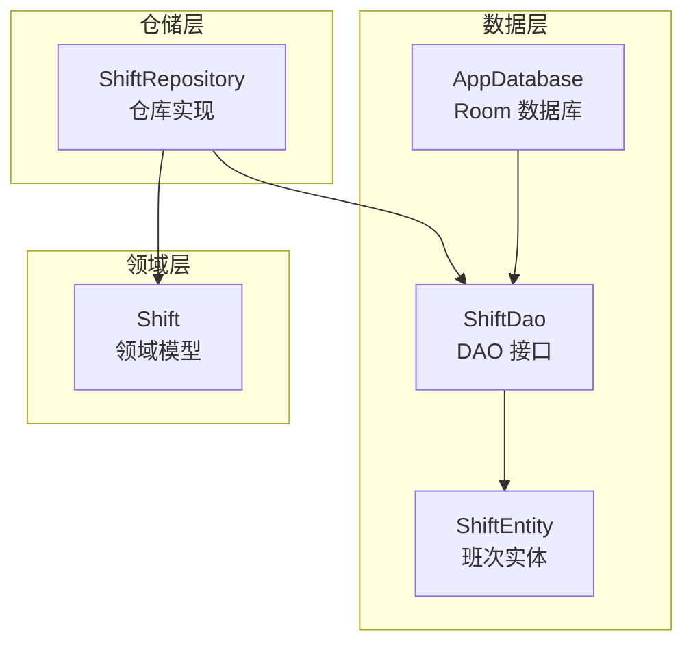
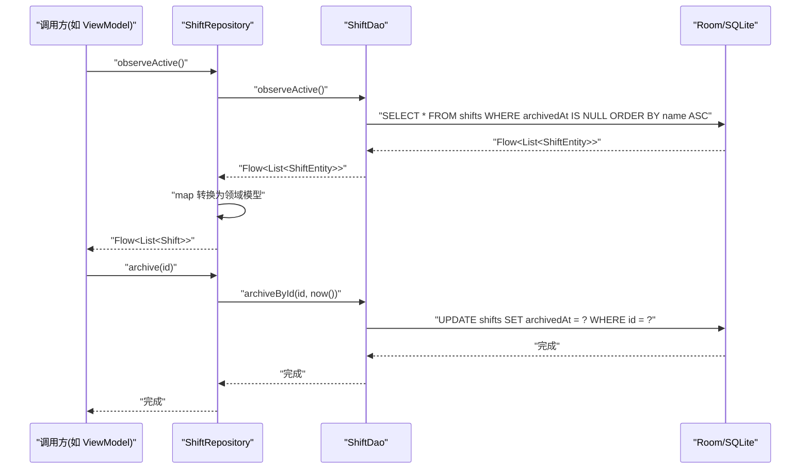
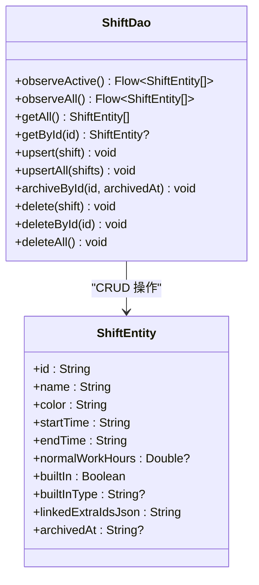
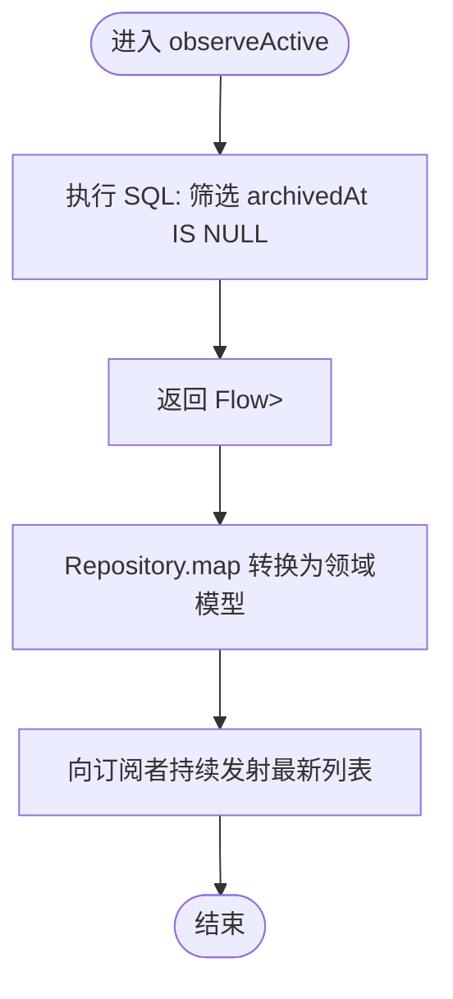
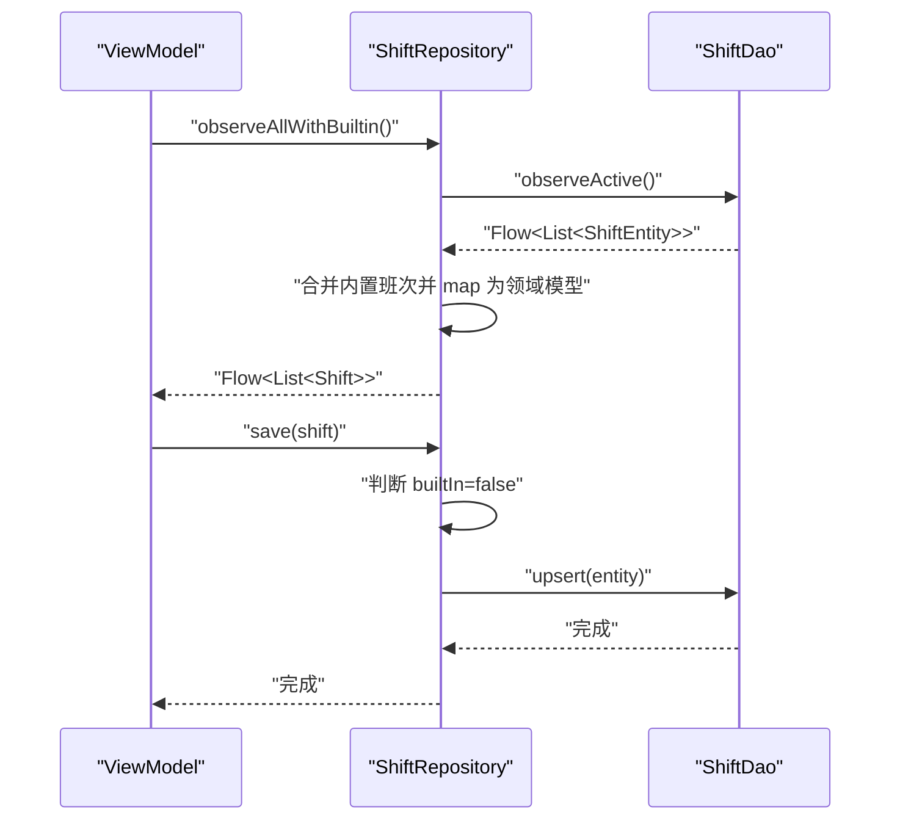
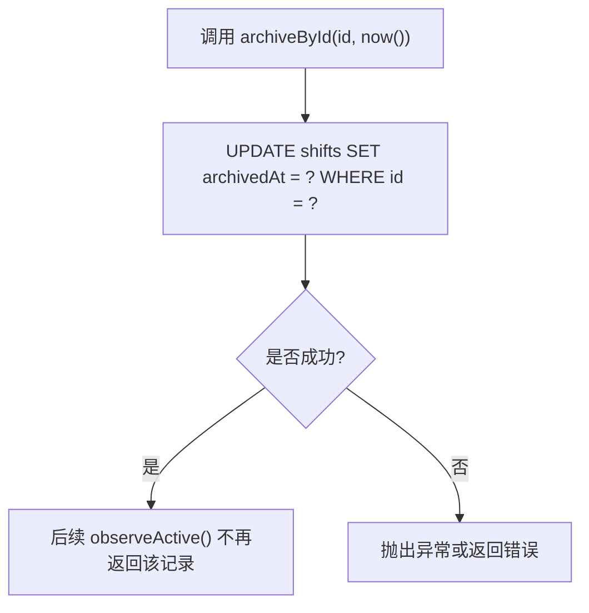
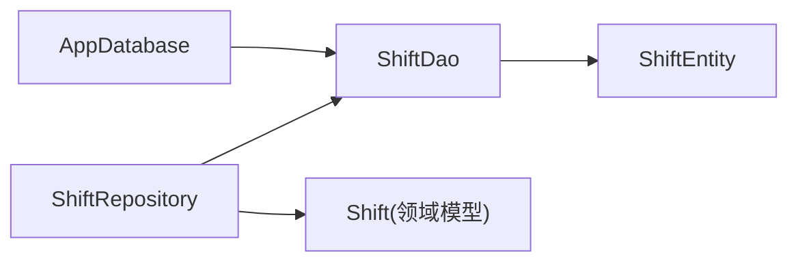

# 班次数据访问对象(ShiftDao)

<cite>
**本文引用的文件**   
- [ShiftDao.kt](file://app/src/main/java/com/schedulecalendar/app/data/db/dao/ShiftDao.kt)
- [ShiftEntity.kt](file://app/src/main/java/com/schedulecalendar/app/data/db/entity/ShiftEntity.kt)
- [AppDatabase.kt](file://app/src/main/java/com/schedulecalendar/app/data/db/AppDatabase.kt)
- [ShiftRepository.kt](file://app/src/main/java/com/schedulecalendar/app/data/repository/ShiftRepository.kt)
- [Models.kt](file://app/src/main/java/com/schedulecalendar/app/domain/model/Models.kt)
</cite>

## 目录
1. [简介](#简介)
2. [项目结构](#项目结构)
3. [核心组件](#核心组件)
4. [架构总览](#架构总览)
5. [详细组件分析](#详细组件分析)
6. [依赖关系分析](#依赖关系分析)
7. [性能考量](#性能考量)
8. [故障排查指南](#故障排查指南)
9. [结论](#结论)
10. [附录](#附录)

## 简介
本文件聚焦于 ShiftDao 数据访问对象的实现与使用，围绕班次实体的 CRUD 操作展开，重点说明：
- Flow 响应式查询 observeActive() 与 observeAll() 的语义与差异
- upsert()/upsertAll() 批量插入更新策略
- archiveById() 逻辑删除的实现与业务含义
- Room 注解的使用方式（@Query、@Insert、@Delete）
- Repository 层如何调用 DAO 并桥接领域模型
- 异步查询模式（suspend 函数）与响应式流（Flow）的使用场景
- 性能优化建议与最佳实践

## 项目结构
ShiftDao 位于 data/db/dao 包下，负责通过 Room 对 shifts 表进行读写。其对应的实体为 ShiftEntity，数据库由 AppDatabase 管理，Repository 层在 data/repository 中封装 DAO 并提供领域模型转换。

图表来源
- [AppDatabase.kt:17-34](file://app/src/main/java/com/schedulecalendar/app/data/db/AppDatabase.kt#L17-L34)
- [ShiftDao.kt:8-41](file://app/src/main/java/com/schedulecalendar/app/data/db/dao/ShiftDao.kt#L8-L41)
- [ShiftEntity.kt:8-23](file://app/src/main/java/com/schedulecalendar/app/data/db/entity/ShiftEntity.kt#L8-L23)
- [ShiftRepository.kt:12-44](file://app/src/main/java/com/schedulecalendar/app/data/repository/ShiftRepository.kt#L12-L44)
- [Models.kt:51-72](file://app/src/main/java/com/schedulecalendar/app/domain/model/Models.kt#L51-L72)

章节来源
- [AppDatabase.kt:17-34](file://app/src/main/java/com/schedulecalendar/app/data/db/AppDatabase.kt#L17-L34)
- [ShiftDao.kt:8-41](file://app/src/main/java/com/schedulecalendar/app/data/db/dao/ShiftDao.kt#L8-L41)
- [ShiftEntity.kt:8-23](file://app/src/main/java/com/schedulecalendar/app/data/db/entity/ShiftEntity.kt#L8-L23)
- [ShiftRepository.kt:12-44](file://app/src/main/java/com/schedulecalendar/app/data/repository/ShiftRepository.kt#L12-L44)
- [Models.kt:51-72](file://app/src/main/java/com/schedulecalendar/app/domain/model/Models.kt#L51-L72)

## 核心组件
- ShiftDao：定义班次数据的增删改查与响应式观察接口，包含 Flow 查询、suspend 单条/批量操作、逻辑删除等。
- ShiftEntity：映射到 shifts 表的 Room 实体，包含主键 id、名称、颜色、起止时间、正常班时长、内置标识、内置类型、关联补贴/扣款 JSON、归档时间戳等字段。
- AppDatabase：声明数据库版本、导出 schema，并暴露 shiftDao() 获取 DAO 实例。
- ShiftRepository：封装 DAO 调用，提供领域模型与实体之间的转换，处理内置班次合并与过滤。

章节来源
- [ShiftDao.kt:8-41](file://app/src/main/java/com/schedulecalendar/app/data/db/dao/ShiftDao.kt#L8-L41)
- [ShiftEntity.kt:8-23](file://app/src/main/java/com/schedulecalendar/app/data/db/entity/ShiftEntity.kt#L8-L23)
- [AppDatabase.kt:17-34](file://app/src/main/java/com/schedulecalendar/app/data/db/AppDatabase.kt#L17-L34)
- [ShiftRepository.kt:12-44](file://app/src/main/java/com/schedulecalendar/app/data/repository/ShiftRepository.kt#L12-L44)

## 架构总览
ShiftDao 作为数据访问层的核心，向上被 ShiftRepository 消费；向下通过 Room 与 SQLite 交互。Repository 将实体转换为领域模型，并在需要时合并内置班次数据，从而向 UI/ViewModel 暴露统一的数据视图。

图表来源
- [ShiftRepository.kt:16-22](file://app/src/main/java/com/schedulecalendar/app/data/repository/ShiftRepository.kt#L16-L22)
- [ShiftDao.kt:10-15](file://app/src/main/java/com/schedulecalendar/app/data/db/dao/ShiftDao.kt#L10-L15)
- [ShiftDao.kt:29-31](file://app/src/main/java/com/schedulecalendar/app/data/db/dao/ShiftDao.kt#L29-L31)

## 详细组件分析

### ShiftDao 接口与方法详解
- observeActive(): 返回仅未归档（archivedAt IS NULL）的班次列表，按名称升序排列，类型为 Flow<List<ShiftEntity>>，用于实时监听有效班次变化。
- observeAll(): 返回所有班次（含已归档），按名称升序排列，类型为 Flow<List<ShiftEntity>>，适用于历史数据展示或全局查找。
- getAll(): suspend 函数，一次性获取全部班次列表。
- getById(id): suspend 函数，根据 ID 获取单个班次。
- upsert(shift): suspend 函数，按 REPLACE 冲突策略插入或更新单条记录。
- upsertAll(shifts): suspend 函数，批量执行 REPLACE 策略的插入/更新。
- archiveById(id, archivedAt): suspend 函数，设置 archivedAt 为非空值，实现逻辑删除。
- delete(delete by entity/id/all): 支持按实体、ID 或清空全表三种删除方式。

图表来源
- [ShiftDao.kt:8-41](file://app/src/main/java/com/schedulecalendar/app/data/db/dao/ShiftDao.kt#L8-L41)
- [ShiftEntity.kt:8-23](file://app/src/main/java/com/schedulecalendar/app/data/db/entity/ShiftEntity.kt#L8-L23)

章节来源
- [ShiftDao.kt:8-41](file://app/src/main/java/com/schedulecalendar/app/data/db/dao/ShiftDao.kt#L8-L41)
- [ShiftEntity.kt:8-23](file://app/src/main/java/com/schedulecalendar/app/data/db/entity/ShiftEntity.kt#L8-L23)

### Room 注解与 SQL 编写要点
- @Query
  - 使用 SELECT 语句配合 WHERE 条件与 ORDER BY 排序，例如 observeActive() 和 observeAll()。
  - 使用 UPDATE 语句实现逻辑删除，例如 archiveById() 设置 archivedAt 时间戳。
  - 使用 DELETE 语句按 ID 或清空全表。
- @Insert(onConflict = OnConflictStrategy.REPLACE)
  - upsert()/upsertAll() 基于主键 id 进行“存在则替换”的幂等操作，适合同步或导入场景。
- @Delete
  - 支持按实体或 ID 删除，以及清空全表。

章节来源
- [ShiftDao.kt:10-40](file://app/src/main/java/com/schedulecalendar/app/data/db/dao/ShiftDao.kt#L10-L40)

### 响应式查询与异步模式
- Flow 响应式查询
  - observeActive() 与 observeAll() 返回 Flow，当底层 shifts 表变更时自动推送新结果，适合 UI 实时刷新。
- suspend 函数
  - getAll()/getById()/upsert()/archiveById()/delete*() 均为挂起函数，适合协程环境下的单次读写操作。

图表来源
- [ShiftDao.kt:10-12](file://app/src/main/java/com/schedulecalendar/app/data/db/dao/ShiftDao.kt#L10-L12)
- [ShiftRepository.kt:16-17](file://app/src/main/java/com/schedulecalendar/app/data/repository/ShiftRepository.kt#L16-L17)

章节来源
- [ShiftDao.kt:10-18](file://app/src/main/java/com/schedulecalendar/app/data/db/dao/ShiftDao.kt#L10-L18)
- [ShiftRepository.kt:16-22](file://app/src/main/java/com/schedulecalendar/app/data/repository/ShiftRepository.kt#L16-L22)

### Repository 层调用示例与领域模型桥接
- observeActive()/observeAll()
  - Repository 调用 DAO 的 Flow 方法，并将 ShiftEntity 列表映射为领域模型 Shift 列表。
  - observeAll() 还会合并内置班次（休息/调休），以便日历网格历史数据展示与查找。
- getAll()/getAllWithBuiltin()
  - 一次性获取全部班次，后者额外合并内置班次，供排班选择使用。
- getById(id)
  - 优先匹配内置班次，否则查询数据库并转换。
- save()/saveAll()
  - 仅对非内置班次执行 upsert/upsertAll，避免覆盖内置数据。
- archive(id)/delete(id)/deleteAll()
  - 分别调用 DAO 的逻辑删除、物理删除与清空全表。

图表来源
- [ShiftRepository.kt:27-32](file://app/src/main/java/com/schedulecalendar/app/data/repository/ShiftRepository.kt#L27-L32)
- [ShiftRepository.kt:37-39](file://app/src/main/java/com/schedulecalendar/app/data/repository/ShiftRepository.kt#L37-L39)
- [ShiftDao.kt:23-27](file://app/src/main/java/com/schedulecalendar/app/data/db/dao/ShiftDao.kt#L23-L27)

章节来源
- [ShiftRepository.kt:16-44](file://app/src/main/java/com/schedulecalendar/app/data/repository/ShiftRepository.kt#L16-L44)
- [Models.kt:51-72](file://app/src/main/java/com/schedulecalendar/app/domain/model/Models.kt#L51-L72)

### 逻辑删除与数据一致性
- archiveById() 通过设置 archivedAt 为非空时间戳实现逻辑删除，便于保留历史数据与审计。
- observeActive() 默认排除已归档记录，确保 UI 只看到有效班次。
- observeAll() 包含已归档记录，适用于历史查看与全局搜索。

图表来源
- [ShiftDao.kt:29-31](file://app/src/main/java/com/schedulecalendar/app/data/db/dao/ShiftDao.kt#L29-L31)
- [ShiftDao.kt:10-12](file://app/src/main/java/com/schedulecalendar/app/data/db/dao/ShiftDao.kt#L10-L12)

章节来源
- [ShiftDao.kt:10-12](file://app/src/main/java/com/schedulecalendar/app/data/db/dao/ShiftDao.kt#L10-L12)
- [ShiftDao.kt:29-31](file://app/src/main/java/com/schedulecalendar/app/data/db/dao/ShiftDao.kt#L29-L31)

## 依赖关系分析
- AppDatabase 声明 entities 列表并导出 schema，暴露 shiftDao() 以获取 DAO 实例。
- ShiftDao 依赖 ShiftEntity 作为数据载体。
- ShiftRepository 依赖 ShiftDao 与领域模型 Shift，负责数据转换与内置数据合并。

图表来源
- [AppDatabase.kt:17-34](file://app/src/main/java/com/schedulecalendar/app/data/db/AppDatabase.kt#L17-L34)
- [ShiftDao.kt:8-41](file://app/src/main/java/com/schedulecalendar/app/data/db/dao/ShiftDao.kt#L8-L41)
- [ShiftEntity.kt:8-23](file://app/src/main/java/com/schedulecalendar/app/data/db/entity/ShiftEntity.kt#L8-L23)
- [ShiftRepository.kt:12-44](file://app/src/main/java/com/schedulecalendar/app/data/repository/ShiftRepository.kt#L12-L44)
- [Models.kt:51-72](file://app/src/main/java/com/schedulecalendar/app/domain/model/Models.kt#L51-L72)

章节来源
- [AppDatabase.kt:17-34](file://app/src/main/java/com/schedulecalendar/app/data/db/AppDatabase.kt#L17-L34)
- [ShiftDao.kt:8-41](file://app/src/main/java/com/schedulecalendar/app/data/db/dao/ShiftDao.kt#L8-L41)
- [ShiftEntity.kt:8-23](file://app/src/main/java/com/schedulecalendar/app/data/db/entity/ShiftEntity.kt#L8-L23)
- [ShiftRepository.kt:12-44](file://app/src/main/java/com/schedulecalendar/app/data/repository/ShiftRepository.kt#L12-L44)
- [Models.kt:51-72](file://app/src/main/java/com/schedulecalendar/app/domain/model/Models.kt#L51-L72)

## 性能考量
- 索引建议
  - 频繁按 archivedAt 过滤与按 name 排序，可考虑在 archivedAt 与 name 上建立复合索引以提升 observeActive() 性能。
- 批量操作
  - 使用 upsertAll() 减少事务开销，适合导入或同步场景。
- 响应式流
  - 使用 Flow 观察数据变化，避免轮询；注意在 UI 层合理收集与取消订阅，防止内存泄漏。
- 并发安全
  - Room 保证线程安全，但需避免在同一协程作用域内重复创建大量观察者；必要时使用共享作用域或去抖策略。
- 查询范围控制
  - 仅在需要的地方使用 observeAll()，避免不必要的已归档数据加载；UI 展示历史数据时才启用。

[本节为通用性能指导，不直接分析具体文件]

## 故障排查指南
- 无法观察到数据变化
  - 确认上层是否正确收集 Flow（如在 Compose/ViewModel 中使用 collectAsState 或 collect）。
  - 检查 observeActive() 与 observeAll() 的过滤条件是否符合预期。
- 逻辑删除后仍出现在列表
  - 确认调用的是 observeActive() 而非 observeAll()。
  - 验证 archiveById() 是否成功设置了 archivedAt 时间戳。
- 插入/更新失败
  - 检查主键 id 是否唯一且符合预期。
  - 确认 onConflict=REPLACE 的策略是否与业务一致。
- 内置班次被覆盖
  - 确保 Repository 的 save()/saveAll() 仅对非内置班次执行 upsert。

章节来源
- [ShiftDao.kt:10-40](file://app/src/main/java/com/schedulecalendar/app/data/db/dao/ShiftDao.kt#L10-L40)
- [ShiftRepository.kt:37-43](file://app/src/main/java/com/schedulecalendar/app/data/repository/ShiftRepository.kt#L37-L43)

## 结论
ShiftDao 提供了完整的班次数据访问能力，结合 Flow 与 suspend 函数满足响应式与异步需求。Repository 层进一步封装了领域模型转换与内置数据合并，使上层调用更简洁。通过合理的索引与批量操作策略，可在保证一致性的同时提升性能。

[本节为总结性内容，不直接分析具体文件]

## 附录
- 关键方法路径参考
  - observeActive(): [ShiftDao.kt:10-12](file://app/src/main/java/com/schedulecalendar/app/data/db/dao/ShiftDao.kt#L10-L12)
  - observeAll(): [ShiftDao.kt:14-15](file://app/src/main/java/com/schedulecalendar/app/data/db/dao/ShiftDao.kt#L14-L15)
  - upsert()/upsertAll(): [ShiftDao.kt:23-27](file://app/src/main/java/com/schedulecalendar/app/data/db/dao/ShiftDao.kt#L23-L27)
  - archiveById(): [ShiftDao.kt:29-31](file://app/src/main/java/com/schedulecalendar/app/data/db/dao/ShiftDao.kt#L29-L31)
  - Repository 调用示例: [ShiftRepository.kt:16-44](file://app/src/main/java/com/schedulecalendar/app/data/repository/ShiftRepository.kt#L16-L44)