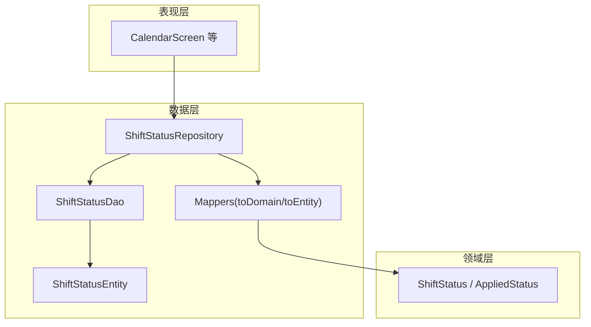
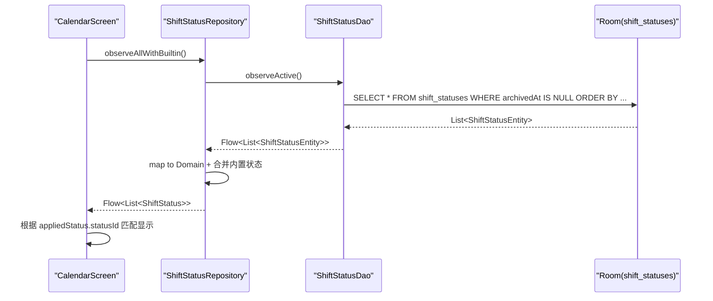
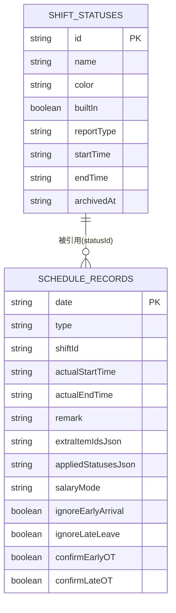
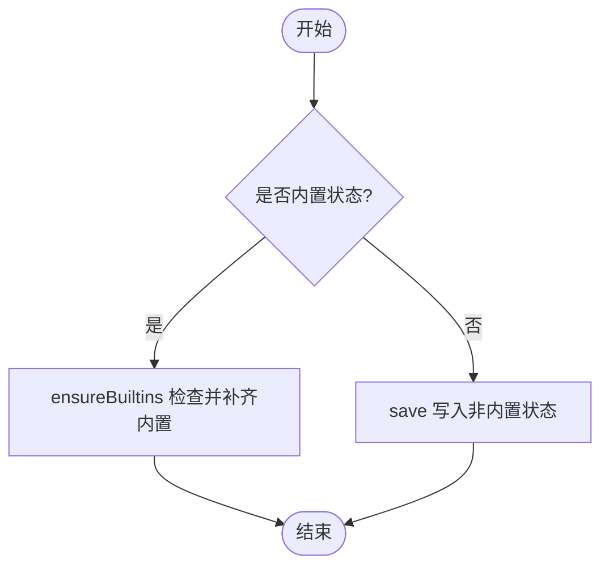
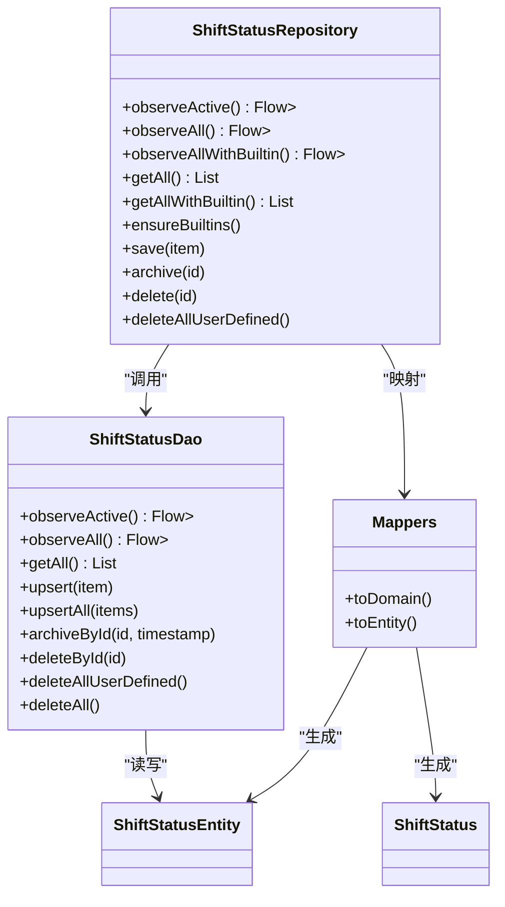

# 班次状态数据访问对象(ShiftStatusDao)

<cite>
**本文引用的文件**
- [ShiftStatusDao.kt](file://app/src/main/java/com/schedulecalendar/app/data/db/dao/ShiftStatusDao.kt)
- [ShiftStatusEntity.kt](file://app/src/main/java/com/schedulecalendar/app/data/db/entity/ShiftStatusEntity.kt)
- [ShiftStatusRepository.kt](file://app/src/main/java/com/schedulecalendar/app/data/repository/ShiftStatusRepository.kt)
- [Mappers.kt](file://app/src/main/java/com/schedulecalendar/app/data/repository/Mappers.kt)
- [Models.kt](file://app/src/main/java/com/schedulecalendar/app/domain/model/Models.kt)
- [ScheduleRecordEntity.kt](file://app/src/main/java/com/schedulecalendar/app/data/db/entity/ScheduleRecordEntity.kt)
- [CalendarScreen.kt](file://app/src/main/java/com/schedulecalendar/app/ui/calendar/CalendarScreen.kt)
</cite>

## 目录
1. [简介](#简介)
2. [项目结构](#项目结构)
3. [核心组件](#核心组件)
4. [架构总览](#架构总览)
5. [详细组件分析](#详细组件分析)
6. [依赖关系分析](#依赖关系分析)
7. [性能与并发](#性能与并发)
8. [事务与一致性](#事务与一致性)
9. [使用示例](#使用示例)
10. [故障排查](#故障排查)
11. [结论](#结论)

## 简介
本文件围绕 ShiftStatusDao 数据访问对象，系统化阐述“班次状态”的创建、更新、查询、归档等能力，并结合应用中的排班记录（ScheduleRecord）说明状态在考勤打卡与状态跟踪中的应用。文档同时解释状态与排班记录的关联方式、内置状态的初始化策略、以及面向生产环境的并发与一致性建议。

## 项目结构
ShiftStatusDao 位于数据层 DAO 目录，负责 shift_statuses 表的增删改查；其上层由 ShiftStatusRepository 封装领域模型映射与业务规则；UI 层通过 Repository 观察状态变化并渲染到日历等界面。

图表来源
- [ShiftStatusDao.kt:1-39](file://app/src/main/java/com/schedulecalendar/app/data/db/dao/ShiftStatusDao.kt#L1-L39)
- [ShiftStatusRepository.kt:1-54](file://app/src/main/java/com/schedulecalendar/app/data/repository/ShiftStatusRepository.kt#L1-L54)
- [Mappers.kt:55-58](file://app/src/main/java/com/schedulecalendar/app/data/repository/Mappers.kt#L55-L58)
- [Models.kt:22-35](file://app/src/main/java/com/schedulecalendar/app/domain/model/Models.kt#L22-L35)

章节来源
- [ShiftStatusDao.kt:1-39](file://app/src/main/java/com/schedulecalendar/app/data/db/dao/ShiftStatusDao.kt#L1-L39)
- [ShiftStatusRepository.kt:1-54](file://app/src/main/java/com/schedulecalendar/app/data/repository/ShiftStatusRepository.kt#L1-L54)

## 核心组件
- ShiftStatusDao：基于 Room 的 DAO 接口，提供对 shift_statuses 表的高效读写与 Flow 响应式查询。
- ShiftStatusEntity：Room 实体，对应 shift_statuses 表字段，包含 id、name、color、builtIn、reportType、startTime、endTime、archivedAt。
- ShiftStatusRepository：封装 DAO 调用与领域模型转换，提供 observeActive/observeAll/ensureBuiltins/save/archive/delete 等方法。
- Mappers：负责 Entity 与 Domain 之间的双向转换，包括 ShiftStatus 与 ShiftStatusEntity 的映射。
- Models：定义领域模型 ShiftStatus、AppliedStatus、BUILTIN_STATUSES 等常量与数据结构。

章节来源
- [ShiftStatusEntity.kt:1-19](file://app/src/main/java/com/schedulecalendar/app/data/db/entity/ShiftStatusEntity.kt#L1-L19)
- [Mappers.kt:55-58](file://app/src/main/java/com/schedulecalendar/app/data/repository/Mappers.kt#L55-L58)
- [Models.kt:22-35](file://app/src/main/java/com/schedulecalendar/app/domain/model/Models.kt#L22-L35)
- [ShiftStatusRepository.kt:1-54](file://app/src/main/java/com/schedulecalendar/app/data/repository/ShiftStatusRepository.kt#L1-L54)

## 架构总览
ShiftStatusDao 作为数据访问入口，向上暴露 Flow 与 suspend 方法，供 Repository 组合业务逻辑。UI 层订阅 Flow 实现实时刷新。状态与排班记录的关联通过 ScheduleRecord.appliedStatus 引用 ShiftStatus.id，并在展示时进行名称与颜色解析。

图表来源
- [ShiftStatusRepository.kt:24-30](file://app/src/main/java/com/schedulecalendar/app/data/repository/ShiftStatusRepository.kt#L24-L30)
- [ShiftStatusDao.kt:10-15](file://app/src/main/java/com/schedulecalendar/app/data/db/dao/ShiftStatusDao.kt#L10-L15)
- [CalendarScreen.kt:709-718](file://app/src/main/java/com/schedulecalendar/app/ui/calendar/CalendarScreen.kt#L709-L718)

## 详细组件分析

### ShiftStatusDao 接口设计
- 查询
  - observeActive：仅返回未归档的状态，按内置优先与名称排序，适合列表展示。
  - observeAll：返回所有状态（含已归档），用于管理页面或导出场景。
  - getAll：一次性获取全部有效状态，适用于非响应式加载。
- 写入
  - upsert/upsertAll：以 REPLACE 策略插入或更新，保证幂等性。
  - archiveById：逻辑删除，设置 archivedAt 时间戳。
  - deleteById/deleteAllUserDefined/deleteAll：物理删除，谨慎使用。
- 排序与过滤
  - builtIn DESC, name ASC：确保内置项始终置顶，便于用户选择。

章节来源
- [ShiftStatusDao.kt:10-37](file://app/src/main/java/com/schedulecalendar/app/data/db/dao/ShiftStatusDao.kt#L10-L37)

### ShiftStatusEntity 实体与字段语义
- id：主键，唯一标识一个状态类型。
- name/color：展示用名称与颜色。
- builtIn：是否内置，用于区分系统默认与用户自定义。
- reportType：报表映射类型（如 leave、swap），影响工时统计口径。
- startTime/endTime：可选的时间段限制，为空表示不限制。
- archivedAt：归档时间戳，null 表示有效，非 null 表示已归档。

章节来源
- [ShiftStatusEntity.kt:7-18](file://app/src/main/java/com/schedulecalendar/app/data/db/entity/ShiftStatusEntity.kt#L7-L18)

### ShiftStatusRepository 业务封装
- observeActive/observeAll：将 DAO 的 Flow<List<ShiftStatusEntity>> 映射为 Flow<List<ShiftStatus>>。
- observeAllWithBuiltin：在 observeActive 基础上，前置内置状态并去重，保证 UI 下拉框中内置项始终可见且在前。
- ensureBuiltins：首次启动时，若数据库缺少内置状态则自动插入，保障系统可用性。
- save：仅允许保存非内置状态，避免覆盖系统默认。
- archive/delete：支持逻辑删除与物理删除。

章节来源
- [ShiftStatusRepository.kt:16-53](file://app/src/main/java/com/schedulecalendar/app/data/repository/ShiftStatusRepository.kt#L16-L53)

### 与排班记录的关系映射
- 排班记录（ScheduleRecord）通过 appliedStatus 引用某个 ShiftStatus.id，并可附带可选的开始/结束时间，用于部分时段请假或调休。
- 持久化层面，appliedStatus 以 JSON 字符串存储在 schedule_records 表中，读取时由 Mappers 解析为 AppliedStatus。
- 展示层（如 CalendarScreen）根据 appliedStatus.statusId 查找对应的 ShiftStatus，从而显示状态名称与颜色。

图表来源
- [ShiftStatusEntity.kt:7-18](file://app/src/main/java/com/schedulecalendar/app/data/db/entity/ShiftStatusEntity.kt#L7-L18)
- [ScheduleRecordEntity.kt:8-25](file://app/src/main/java/com/schedulecalendar/app/data/db/entity/ScheduleRecordEntity.kt#L8-L25)
- [Mappers.kt:68-88](file://app/src/main/java/com/schedulecalendar/app/data/repository/Mappers.kt#L68-L88)

章节来源
- [ScheduleRecordEntity.kt:8-25](file://app/src/main/java/com/schedulecalendar/app/data/db/entity/ScheduleRecordEntity.kt#L8-L25)
- [Mappers.kt:68-88](file://app/src/main/java/com/schedulecalendar/app/data/repository/Mappers.kt#L68-L88)
- [CalendarScreen.kt:709-718](file://app/src/main/java/com/schedulecalendar/app/ui/calendar/CalendarScreen.kt#L709-L718)

### 状态流转与业务规则
- 新建/编辑：通过 Repository.save 写入非内置状态；内置状态由 ensureBuiltins 维护。
- 归档：archiveById 设置 archivedAt，使 observeActive 不再返回该状态，但历史数据仍保留。
- 删除：deleteById/deleteAllUserDefined 直接移除记录，需谨慎操作。
- 排序与优先级：builtIn DESC, name ASC 保证内置项优先显示。

图表来源
- [ShiftStatusRepository.kt:41-48](file://app/src/main/java/com/schedulecalendar/app/data/repository/ShiftStatusRepository.kt#L41-L48)

章节来源
- [ShiftStatusRepository.kt:41-53](file://app/src/main/java/com/schedulecalendar/app/data/repository/ShiftStatusRepository.kt#L41-L53)

## 依赖关系分析
- ShiftStatusDao 依赖 ShiftStatusEntity 作为数据载体。
- ShiftStatusRepository 依赖 ShiftStatusDao 与 Mappers，负责领域模型转换与内置状态管理。
- UI 层（如 CalendarScreen）依赖 Repository 提供的 Flow 进行响应式展示。

图表来源
- [ShiftStatusDao.kt:8-38](file://app/src/main/java/com/schedulecalendar/app/data/db/dao/ShiftStatusDao.kt#L8-L38)
- [ShiftStatusRepository.kt:12-53](file://app/src/main/java/com/schedulecalendar/app/data/repository/ShiftStatusRepository.kt#L12-L53)
- [Mappers.kt:55-58](file://app/src/main/java/com/schedulecalendar/app/data/repository/Mappers.kt#L55-L58)

章节来源
- [ShiftStatusDao.kt:8-38](file://app/src/main/java/com/schedulecalendar/app/data/db/dao/ShiftStatusDao.kt#L8-L38)
- [ShiftStatusRepository.kt:12-53](file://app/src/main/java/com/schedulecalendar/app/data/repository/ShiftStatusRepository.kt#L12-L53)
- [Mappers.kt:55-58](file://app/src/main/java/com/schedulecalendar/app/data/repository/Mappers.kt#L55-L58)

## 性能与并发
- 响应式查询：observeActive/observeAll 返回 Flow，利用 Room 的增量变更通知，减少全量扫描。
- 排序优化：builtIn DESC, name ASC 在 SQL 层完成排序，避免内存排序开销。
- 批量写入：upsertAll 可减少多次 IO 的往返。
- 并发安全：Room 内部保证线程安全；Repository 的 Flow 在多个观察者间共享，注意背压与取消。

[本节为通用指导，无需具体文件引用]

## 事务与一致性
- 当前 DAO 方法均为单条语句级别，未显式声明事务。若需跨表原子更新（例如同时更新状态与相关排班记录），应在 Repository 层使用 @Transaction 包裹多条 DAO 调用。
- 逻辑删除（archivedAt）可保证历史数据完整性，避免外键约束问题；如需强一致，建议在业务层校验状态有效性后再写入排班记录。
- 并发写入：多协程并发 upsert 同一 id 时，REPLACE 策略保证最终一致性；但需注意业务侧的幂等性与冲突处理。

[本节为通用指导，无需具体文件引用]

## 使用示例

### 在日历中显示附加状态
- 流程要点
  - 从 Repository 获取 Flow<List<ShiftStatus>>（含内置）。
  - 根据 ScheduleRecord.appliedStatus.statusId 找到对应 ShiftStatus。
  - 当显示方案配置了 STATUS 项时，渲染状态名称与颜色。
- 参考路径
  - [CalendarScreen.kt:709-718](file://app/src/main/java/com/schedulecalendar/app/ui/calendar/CalendarScreen.kt#L709-L718)

章节来源
- [CalendarScreen.kt:709-718](file://app/src/main/java/com/schedulecalendar/app/ui/calendar/CalendarScreen.kt#L709-L718)

### 初始化内置状态
- 流程要点
  - 应用启动时调用 ensureBuiltins，若数据库缺失内置状态则自动插入。
  - 后续 observeAllWithBuiltin 会始终返回内置+用户自定义的组合列表。
- 参考路径
  - [ShiftStatusRepository.kt:41-46](file://app/src/main/java/com/schedulecalendar/app/data/repository/ShiftStatusRepository.kt#L41-L46)

章节来源
- [ShiftStatusRepository.kt:41-46](file://app/src/main/java/com/schedulecalendar/app/data/repository/ShiftStatusRepository.kt#L41-L46)

### 新增/修改用户自定义状态
- 流程要点
  - 构造 ShiftStatus（非内置），调用 Repository.save。
  - 通过 observeActive/observeAll 观察变更并刷新 UI。
- 参考路径
  - [ShiftStatusRepository.kt:48](file://app/src/main/java/com/schedulecalendar/app/data/repository/ShiftStatusRepository.kt#L48)

章节来源
- [ShiftStatusRepository.kt:48](file://app/src/main/java/com/schedulecalendar/app/data/repository/ShiftStatusRepository.kt#L48)

### 归档与删除
- 归档：archiveById 设置 archivedAt，使 observeActive 不再返回该状态。
- 删除：deleteById/deleteAllUserDefined 直接移除记录，适用于清理用户自定义数据。
- 参考路径
  - [ShiftStatusRepository.kt:49-53](file://app/src/main/java/com/schedulecalendar/app/data/repository/ShiftStatusRepository.kt#L49-L53)

章节来源
- [ShiftStatusRepository.kt:49-53](file://app/src/main/java/com/schedulecalendar/app/data/repository/ShiftStatusRepository.kt#L49-L53)

## 故障排查
- 状态未显示
  - 检查 observeActive 是否正确返回未归档状态。
  - 确认 CalendarScreen 的显示方案是否启用了 STATUS 项。
  - 参考路径：[CalendarScreen.kt:714-718](file://app/src/main/java/com/schedulecalendar/app/ui/calendar/CalendarScreen.kt#L714-L718)
- 内置状态丢失
  - 确认 ensureBuiltins 是否在应用启动时执行。
  - 参考路径：[ShiftStatusRepository.kt:41-46](file://app/src/main/java/com/schedulecalendar/app/data/repository/ShiftStatusRepository.kt#L41-L46)
- 状态与排班记录不一致
  - 检查 appliedStatusesJson 的解析逻辑与格式兼容性。
  - 参考路径：[Mappers.kt:68-88](file://app/src/main/java/com/schedulecalendar/app/data/repository/Mappers.kt#L68-L88)

章节来源
- [CalendarScreen.kt:714-718](file://app/src/main/java/com/schedulecalendar/app/ui/calendar/CalendarScreen.kt#L714-L718)
- [ShiftStatusRepository.kt:41-46](file://app/src/main/java/com/schedulecalendar/app/data/repository/ShiftStatusRepository.kt#L41-L46)
- [Mappers.kt:68-88](file://app/src/main/java/com/schedulecalendar/app/data/repository/Mappers.kt#L68-L88)

## 结论
ShiftStatusDao 提供了简洁而强大的状态管理能力，结合 Repository 的领域映射与内置状态初始化策略，能够稳定支撑考勤打卡与状态跟踪的核心场景。通过 Flow 响应式查询与逻辑删除机制，系统在性能与数据一致性之间取得良好平衡。对于需要跨表原子性的复杂操作，建议在 Repository 层引入事务边界，以确保更强的数据一致性保障。