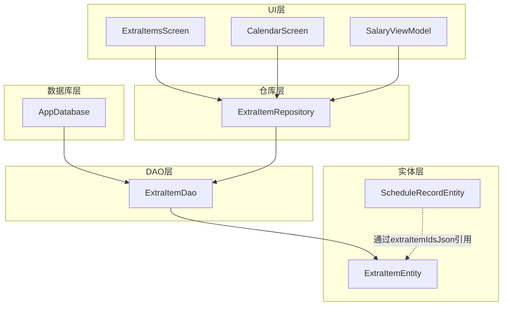
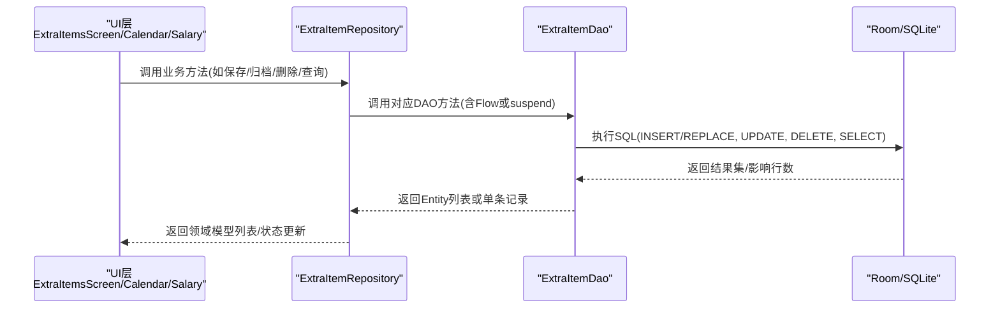
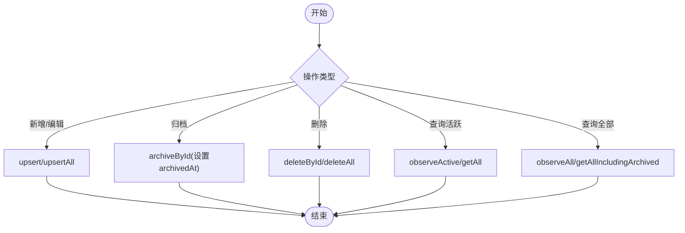
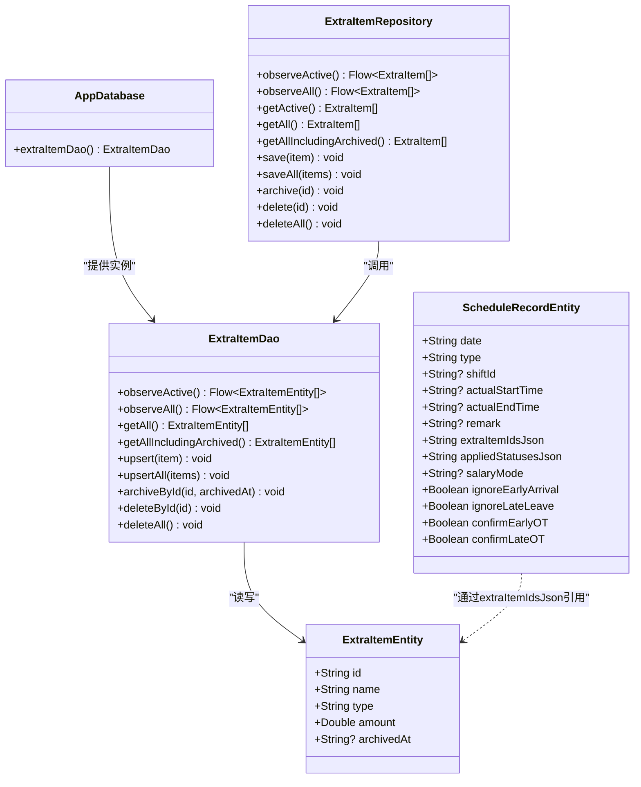
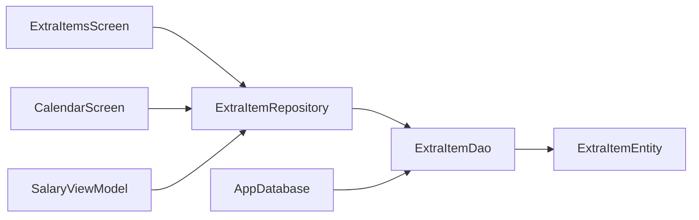

# 附加项目数据访问对象(ExtraItemDao)

<cite>
**本文引用的文件**   
- [ExtraItemDao.kt](file://app/src/main/java/com/schedulecalendar/app/data/db/dao/ExtraItemDao.kt)
- [ExtraItemEntity.kt](file://app/src/main/java/com/schedulecalendar/app/data/db/entity/ExtraItemEntity.kt)
- [ScheduleRecordEntity.kt](file://app/src/main/java/com/schedulecalendar/app/data/db/entity/ScheduleRecordEntity.kt)
- [AppDatabase.kt](file://app/src/main/java/com/schedulecalendar/app/data/db/AppDatabase.kt)
- [ExtraItemRepository.kt](file://app/src/main/java/com/schedulecalendar/app/data/repository/ExtraItemRepository.kt)
- [ExtraItemsScreen.kt](file://app/src/main/java/com/schedulecalendar/app/ui/detail/ExtraItemsScreen.kt)
- [CalendarScreen.kt](file://app/src/main/java/com/schedulecalendar/app/ui/calendar/CalendarScreen.kt)
- [SalaryViewModel.kt](file://app/src/main/java/com/schedulecalendar/app/ui/salary/SalaryViewModel.kt)
</cite>

## 目录
1. [简介](#简介)
2. [项目结构](#项目结构)
3. [核心组件](#核心组件)
4. [架构总览](#架构总览)
5. [详细组件分析](#详细组件分析)
6. [依赖关系分析](#依赖关系分析)
7. [性能与一致性](#性能与一致性)
8. [故障排查指南](#故障排查指南)
9. [结论](#结论)
10. [附录：使用示例](#附录使用示例)

## 简介
本文件围绕 ExtraItemDao 数据访问对象，系统阐述“附加项目（补贴/扣款）”的数据操作方法、与排班记录的关联方式、数据完整性约束、同步与一致性保证机制、错误处理策略，以及在待办事项管理中的典型使用示例。文档面向不同技术背景的读者，提供从高层到代码级的渐进式说明与图示。

## 项目结构
与 ExtraItemDao 相关的核心位置如下：
- DAO 层：定义对 extra_items 表的增删改查与归档操作
- 实体层：定义 extra_items 表结构与字段语义
- 数据库层：注册实体与导出 Schema，暴露 DAO 实例
- 仓库层：封装领域模型与实体的转换，向上层提供业务化接口
- UI 层：在附加项目管理页面、日历展示、薪资计算中消费 DAO 能力

图表来源
- [ExtraItemDao.kt:1-41](file://app/src/main/java/com/schedulecalendar/app/data/db/dao/ExtraItemDao.kt#L1-L41)
- [ExtraItemEntity.kt:1-16](file://app/src/main/java/com/schedulecalendar/app/data/db/entity/ExtraItemEntity.kt#L1-L16)
- [ScheduleRecordEntity.kt:1-26](file://app/src/main/java/com/schedulecalendar/app/data/db/entity/ScheduleRecordEntity.kt#L1-L26)
- [AppDatabase.kt:1-35](file://app/src/main/java/com/schedulecalendar/app/data/db/AppDatabase.kt#L1-L35)
- [ExtraItemRepository.kt:1-31](file://app/src/main/java/com/schedulecalendar/app/data/repository/ExtraItemRepository.kt#L1-L31)
- [ExtraItemsScreen.kt:1-219](file://app/src/main/java/com/schedulecalendar/app/ui/detail/ExtraItemsScreen.kt#L1-L219)
- [CalendarScreen.kt:2090-2105](file://app/src/main/java/com/schedulecalendar/app/ui/calendar/CalendarScreen.kt#L2090-L2105)
- [SalaryViewModel.kt:74-132](file://app/src/main/java/com/schedulecalendar/app/ui/salary/SalaryViewModel.kt#L74-L132)

章节来源
- [ExtraItemDao.kt:1-41](file://app/src/main/java/com/schedulecalendar/app/data/db/dao/ExtraItemDao.kt#L1-L41)
- [ExtraItemEntity.kt:1-16](file://app/src/main/java/com/schedulecalendar/app/data/db/entity/ExtraItemEntity.kt#L1-L16)
- [ScheduleRecordEntity.kt:1-26](file://app/src/main/java/com/schedulecalendar/app/data/db/entity/ScheduleRecordEntity.kt#L1-L26)
- [AppDatabase.kt:1-35](file://app/src/main/java/com/schedulecalendar/app/data/db/AppDatabase.kt#L1-L35)
- [ExtraItemRepository.kt:1-31](file://app/src/main/java/com/schedulecalendar/app/data/repository/ExtraItemRepository.kt#L1-L31)
- [ExtraItemsScreen.kt:1-219](file://app/src/main/java/com/schedulecalendar/app/ui/detail/ExtraItemsScreen.kt#L1-L219)
- [CalendarScreen.kt:2090-2105](file://app/src/main/java/com/schedulecalendar/app/ui/calendar/CalendarScreen.kt#L2090-L2105)
- [SalaryViewModel.kt:74-132](file://app/src/main/java/com/schedulecalendar/app/ui/salary/SalaryViewModel.kt#L74-L132)

## 核心组件
- ExtraItemDao：提供对 extra_items 表的查询、插入/替换、逻辑归档与物理删除等基础操作；支持 Flow 响应式观察与 suspend 阻塞式调用。
- ExtraItemEntity：映射 extra_items 表，包含 id、name、type、amount、archivedAt 字段。
- AppDatabase：声明数据库版本、实体集合，并暴露 extraItemDao() 获取 DAO 实例。
- ExtraItemRepository：将 DAO 的 Entity 转换为领域模型，对外暴露更贴近业务的 API。

章节来源
- [ExtraItemDao.kt:1-41](file://app/src/main/java/com/schedulecalendar/app/data/db/dao/ExtraItemDao.kt#L1-L41)
- [ExtraItemEntity.kt:1-16](file://app/src/main/java/com/schedulecalendar/app/data/db/entity/ExtraItemEntity.kt#L1-L16)
- [AppDatabase.kt:1-35](file://app/src/main/java/com/schedulecalendar/app/data/db/AppDatabase.kt#L1-L35)
- [ExtraItemRepository.kt:1-31](file://app/src/main/java/com/schedulecalendar/app/data/repository/ExtraItemRepository.kt#L1-L31)

## 架构总览
下图展示了从 UI 到 DAO 的调用链以及数据流向，重点体现 ExtraItemDao 在其中的角色。

图表来源
- [ExtraItemRepository.kt:1-31](file://app/src/main/java/com/schedulecalendar/app/data/repository/ExtraItemRepository.kt#L1-L31)
- [ExtraItemDao.kt:1-41](file://app/src/main/java/com/schedulecalendar/app/data/db/dao/ExtraItemDao.kt#L1-L41)
- [AppDatabase.kt:1-35](file://app/src/main/java/com/schedulecalendar/app/data/db/AppDatabase.kt#L1-L35)

## 详细组件分析

### ExtraItemDao 接口与方法
- 查询
  - observeActive：仅查询未归档项目，按名称升序，返回 Flow<List<ExtraItemEntity>>
  - observeAll：查询所有项目（含已归档），用于薪资计算历史金额查找
  - getAll：同 observeActive 的阻塞式快照
  - getAllIncludingArchived：同 observeAll 的阻塞式快照
- 写入
  - upsert：按主键替换插入（REPLACE）
  - upsertAll：批量替换插入
- 归档与删除
  - archiveById：逻辑删除，设置 archivedAt 时间戳
  - deleteById：物理删除
  - deleteAll：清空表

注意：
- 所有查询均基于 name 排序，便于稳定展示
- 归档采用逻辑删除，保留历史数据以供薪资回溯

章节来源
- [ExtraItemDao.kt:10-40](file://app/src/main/java/com/schedulecalendar/app/data/db/dao/ExtraItemDao.kt#L10-L40)

### 数据模型与关联关系
- ExtraItemEntity
  - 字段：id、name、type（allowance/deduction）、amount、archivedAt
  - 主键：id
- ScheduleRecordEntity
  - 字段：date、type、shiftId、actualStartTime、actualEndTime、remark、extraItemIdsJson、appliedStatusesJson、salaryMode、ignoreEarlyArrival、ignoreLateLeave、confirmEarlyOT、confirmLateOT
  - 主键：date
  - 关联：extraItemIdsJson 为 JSON 字符串，存储该日排班所引用的附加项目 ID 列表

关联方式与完整性：
- 无外键约束：schedule_records.extraItemIdsJson 以 JSON 文本形式存储额外项目 ID 列表，不建立数据库级外键约束
- 应用层一致性：当删除或归档附加项目时，需确保引用该项目的排班记录仍可用（例如显示历史金额），避免破坏既有统计结果
- 建议：如需强一致性，可在未来引入中间表与外键约束，并在迁移脚本中校验引用完整性

章节来源
- [ExtraItemEntity.kt:7-15](file://app/src/main/java/com/schedulecalendar/app/data/db/entity/ExtraItemEntity.kt#L7-L15)
- [ScheduleRecordEntity.kt:9-25](file://app/src/main/java/com/schedulecalendar/app/data/db/entity/ScheduleRecordEntity.kt#L9-L25)

### 数据流与处理逻辑
- 新增/编辑附加项目
  - UI 提交表单 -> Repository 转换领域模型为 Entity -> DAO.upsert 写入
- 归档/删除
  - 归档：DAO.archiveById 设置 archivedAt
  - 删除：DAO.deleteById 物理删除
- 查询
  - 活跃项：observeActive/getAll 过滤 archivedAt IS NULL
  - 全部项：observeAll/getAllIncludingArchived 包含已归档
- 与排班联动
  - CalendarScreen 根据 record.extraItemIds 筛选出相关附加项目并展示
  - SalaryViewModel 加载 extraItems 参与薪资计算

图表来源
- [ExtraItemDao.kt:25-39](file://app/src/main/java/com/schedulecalendar/app/data/db/dao/ExtraItemDao.kt#L25-L39)
- [ExtraItemRepository.kt:15-29](file://app/src/main/java/com/schedulecalendar/app/data/repository/ExtraItemRepository.kt#L15-L29)
- [CalendarScreen.kt:2090-2105](file://app/src/main/java/com/schedulecalendar/app/ui/calendar/CalendarScreen.kt#L2090-L2105)
- [SalaryViewModel.kt:74-132](file://app/src/main/java/com/schedulecalendar/app/ui/salary/SalaryViewModel.kt#L74-L132)

### 类图（代码级）

图表来源
- [ExtraItemDao.kt:1-41](file://app/src/main/java/com/schedulecalendar/app/data/db/dao/ExtraItemDao.kt#L1-L41)
- [ExtraItemEntity.kt:1-16](file://app/src/main/java/com/schedulecalendar/app/data/db/entity/ExtraItemEntity.kt#L1-L16)
- [ScheduleRecordEntity.kt:1-26](file://app/src/main/java/com/schedulecalendar/app/data/db/entity/ScheduleRecordEntity.kt#L1-L26)
- [AppDatabase.kt:1-35](file://app/src/main/java/com/schedulecalendar/app/data/db/AppDatabase.kt#L1-L35)
- [ExtraItemRepository.kt:1-31](file://app/src/main/java/com/schedulecalendar/app/data/repository/ExtraItemRepository.kt#L1-L31)

## 依赖关系分析
- 耦合与内聚
  - ExtraItemDao 与 ExtraItemEntity 高内聚，职责单一
  - ExtraItemRepository 作为适配层，屏蔽 Entity 与领域模型的差异
- 外部依赖
  - Room 注解与 SQL 生成
  - Kotlin Coroutines Flow 与 suspend 函数
- 潜在循环依赖
  - 当前未见循环依赖；DAO 不依赖上层模块
- 集成点
  - AppDatabase 暴露 DAO 实例
  - UI 通过 Repository 间接使用 DAO

图表来源
- [ExtraItemRepository.kt:1-31](file://app/src/main/java/com/schedulecalendar/app/data/repository/ExtraItemRepository.kt#L1-L31)
- [ExtraItemDao.kt:1-41](file://app/src/main/java/com/schedulecalendar/app/data/db/dao/ExtraItemDao.kt#L1-L41)
- [ExtraItemEntity.kt:1-16](file://app/src/main/java/com/schedulecalendar/app/data/db/entity/ExtraItemEntity.kt#L1-L16)
- [AppDatabase.kt:1-35](file://app/src/main/java/com/schedulecalendar/app/data/db/AppDatabase.kt#L1-L35)
- [ExtraItemsScreen.kt:1-219](file://app/src/main/java/com/schedulecalendar/app/ui/detail/ExtraItemsScreen.kt#L1-L219)
- [CalendarScreen.kt:2090-2105](file://app/src/main/java/com/schedulecalendar/app/ui/calendar/CalendarScreen.kt#L2090-L2105)
- [SalaryViewModel.kt:74-132](file://app/src/main/java/com/schedulecalendar/app/ui/salary/SalaryViewModel.kt#L74-L132)

## 性能与一致性
- 性能特性
  - observeActive/observeAll 使用 Flow，适合 UI 实时刷新
  - getAll/getAllIncludingArchived 为一次性快照，适合后台计算
  - upsert/upsertAll 使用 REPLACE 策略，避免重复插入开销
- 一致性保证
  - 无外键约束，依赖应用层维护引用完整性
  - 归档采用逻辑删除，保障历史薪资计算的稳定性
  - 建议在删除前检查是否存在引用，必要时提示用户或进行级联处理

[本节为通用指导，无需特定文件来源]

## 故障排查指南
- 常见问题
  - 删除后薪资异常：确认是否误删被历史排班引用的附加项目；优先使用归档而非物理删除
  - 列表未更新：检查是否订阅了 observeActive/observeAll 的 Flow，或在非主线程更新 UI
  - 重复名称：UI 层已有去重校验，若出现冲突请检查并发写入场景
- 定位步骤
  - 查看 DAO 方法是否抛出异常（如 SQL 语法错误）
  - 检查 AppDatabase 版本与 schema 导出是否一致
  - 核对 Repository 的转换逻辑是否正确

章节来源
- [ExtraItemDao.kt:25-39](file://app/src/main/java/com/schedulecalendar/app/data/db/dao/ExtraItemDao.kt#L25-L39)
- [AppDatabase.kt:17-27](file://app/src/main/java/com/schedulecalendar/app/data/db/AppDatabase.kt#L17-L27)
- [ExtraItemRepository.kt:15-29](file://app/src/main/java/com/schedulecalendar/app/data/repository/ExtraItemRepository.kt#L15-L29)

## 结论
ExtraItemDao 提供了简洁稳定的附加项目管理能力，结合 Repository 的领域模型转换与 UI 层的响应式消费，形成了清晰的分层架构。由于未使用外键约束，需在应用层做好引用完整性与一致性控制，优先采用逻辑归档来保护历史数据。

[本节为总结性内容，无需特定文件来源]

## 附录：使用示例

### 在附加项目管理页面中操作
- 新增/编辑
  - 打开编辑器，填写名称、金额、类型
  - 点击保存，触发 save/saveAsReplacement -> Repository.save -> DAO.upsert
- 删除
  - 弹出确认框，确认后调用 delete -> Repository.delete -> DAO.deleteById
- 归档
  - 如需保留历史但不再显示，调用 archive -> Repository.archive -> DAO.archiveById

章节来源
- [ExtraItemsScreen.kt:92-113](file://app/src/main/java/com/schedulecalendar/app/ui/detail/ExtraItemsScreen.kt#L92-L113)
- [ExtraItemRepository.kt:24-29](file://app/src/main/java/com/schedulecalendar/app/data/repository/ExtraItemRepository.kt#L24-L29)
- [ExtraItemDao.kt:25-39](file://app/src/main/java/com/schedulecalendar/app/data/db/dao/ExtraItemDao.kt#L25-L39)

### 在日历与薪资计算中消费附加项目
- 日历展示
  - 读取 schedule_records 的 extraItemIdsJson，匹配 extra_items 列表，展示补贴/扣款明细
- 薪资计算
  - 加载全部附加项目（含归档），参与月度薪资汇总与趋势计算

章节来源
- [CalendarScreen.kt:2090-2105](file://app/src/main/java/com/schedulecalendar/app/ui/calendar/CalendarScreen.kt#L2090-L2105)
- [SalaryViewModel.kt:74-132](file://app/src/main/java/com/schedulecalendar/app/ui/salary/SalaryViewModel.kt#L74-L132)