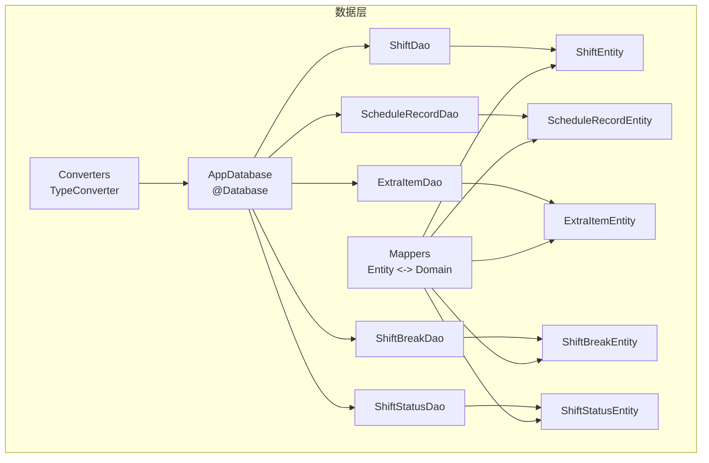
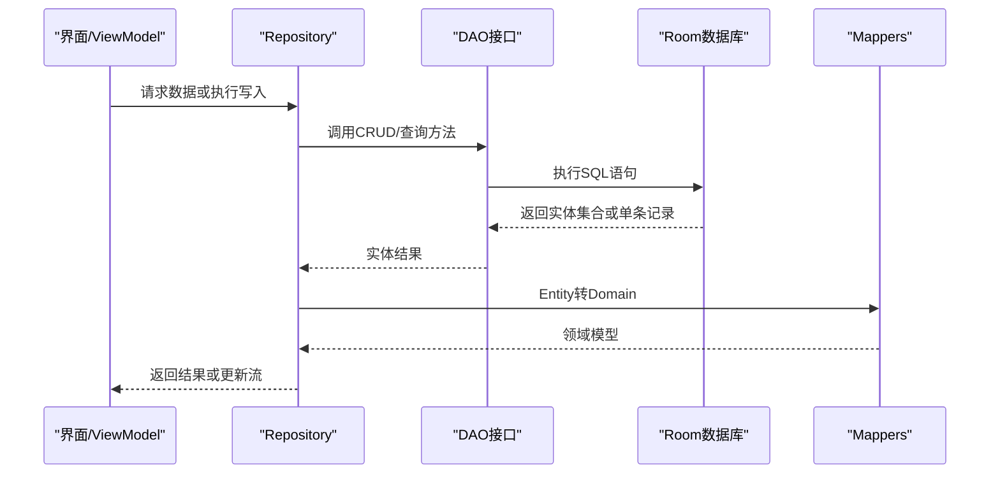
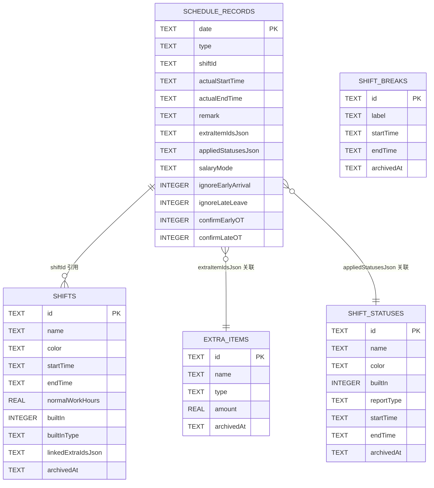
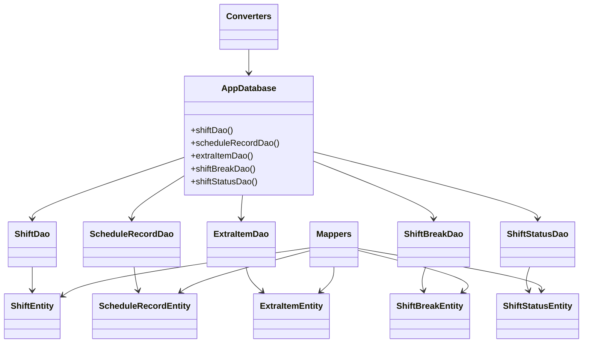

# 数据库设计

<cite>
**本文引用的文件**   
- [AppDatabase.kt](file://app/src/main/java/com/schedulecalendar/app/data/db/AppDatabase.kt)
- [ShiftEntity.kt](file://app/src/main/java/com/schedulecalendar/app/data/db/entity/ShiftEntity.kt)
- [ScheduleRecordEntity.kt](file://app/src/main/java/com/schedulecalendar/app/data/db/entity/ScheduleRecordEntity.kt)
- [ExtraItemEntity.kt](file://app/src/main/java/com/schedulecalendar/app/data/db/entity/ExtraItemEntity.kt)
- [ShiftBreakEntity.kt](file://app/src/main/java/com/schedulecalendar/app/data/db/entity/ShiftBreakEntity.kt)
- [ShiftStatusEntity.kt](file://app/src/main/java/com/schedulecalendar/app/data/db/entity/ShiftStatusEntity.kt)
- [ShiftDao.kt](file://app/src/main/java/com/schedulecalendar/app/data/db/dao/ShiftDao.kt)
- [ScheduleRecordDao.kt](file://app/src/main/java/com/schedulecalendar/app/data/db/dao/ScheduleRecordDao.kt)
- [ExtraItemDao.kt](file://app/src/main/java/com/schedulecalendar/app/data/db/dao/ExtraItemDao.kt)
- [ShiftBreakDao.kt](file://app/src/main/java/com/schedulecalendar/app/data/db/dao/ShiftBreakDao.kt)
- [ShiftStatusDao.kt](file://app/src/main/java/com/schedulecalendar/app/data/db/dao/ShiftStatusDao.kt)
- [Converters.kt](file://app/src/main/java/com/schedulecalendar/app/data/db/Converters.kt)
- [Mappers.kt](file://app/src/main/java/com/schedulecalendar/app/data/repository/Mappers.kt)
- [5.json](file://app/schemas/com.schedulecalendar.app.data.db.AppDatabase/5.json)
- [4.json](file://app/schemas/com.schedulecalendar.app.data.db.AppDatabase/4.json)
- [3.json](file://app/schemas/com.schedulecalendar.app.data.db.AppDatabase/3.json)
</cite>

## 目录
1. [引言](#引言)
2. [项目结构](#项目结构)
3. [核心组件](#核心组件)
4. [架构总览](#架构总览)
5. [详细组件分析](#详细组件分析)
6. [依赖关系分析](#依赖关系分析)
7. [性能考虑](#性能考虑)
8. [故障排查指南](#故障排查指南)
9. [结论](#结论)
10. [附录](#附录)

## 引言
本文件面向Android排班日历应用的数据库设计与实现，聚焦Room数据库的实体类、DAO接口、类型转换与映射、数据验证与业务约束、Schema演进与迁移策略、数据访问模式与查询优化、以及数据生命周期管理与清理策略。文档通过ER图、时序图与流程图帮助开发者快速理解数据结构与交互流程，并提供可操作的优化建议与问题定位方法。

## 项目结构
应用采用分层架构：UI层通过ViewModel调用Repository，Repository使用DAO访问Room数据库，DAO直接操作实体表。数据库定义在AppDatabase中集中声明，实体位于entity包，DAO位于dao包，类型转换器位于Converters.kt，领域模型与实体之间的映射位于Mappers.kt。Schema版本以JSON形式导出至schemas目录，便于追踪演进。

图表来源
- [AppDatabase.kt:17-34](file://app/src/main/java/com/schedulecalendar/app/data/db/AppDatabase.kt#L17-L34)
- [ShiftEntity.kt:8-23](file://app/src/main/java/com/schedulecalendar/app/data/db/entity/ShiftEntity.kt#L8-L23)
- [ScheduleRecordEntity.kt:8-25](file://app/src/main/java/com/schedulecalendar/app/data/db/entity/ScheduleRecordEntity.kt#L8-L25)
- [ExtraItemEntity.kt:8-15](file://app/src/main/java/com/schedulecalendar/app/data/db/entity/ExtraItemEntity.kt#L8-L15)
- [ShiftBreakEntity.kt:8-15](file://app/src/main/java/com/schedulecalendar/app/data/db/entity/ShiftBreakEntity.kt#L8-L15)
- [ShiftStatusEntity.kt:8-18](file://app/src/main/java/com/schedulecalendar/app/data/db/entity/ShiftStatusEntity.kt#L8-L18)
- [ShiftDao.kt:8-41](file://app/src/main/java/com/schedulecalendar/app/data/db/dao/ShiftDao.kt#L8-L41)
- [ScheduleRecordDao.kt:8-39](file://app/src/main/java/com/schedulecalendar/app/data/db/dao/ScheduleRecordDao.kt#L8-L39)
- [ExtraItemDao.kt:8-40](file://app/src/main/java/com/schedulecalendar/app/data/db/dao/ExtraItemDao.kt#L8-L40)
- [ShiftBreakDao.kt:8-38](file://app/src/main/java/com/schedulecalendar/app/data/db/dao/ShiftBreakDao.kt#L8-L38)
- [ShiftStatusDao.kt:8-38](file://app/src/main/java/com/schedulecalendar/app/data/db/dao/ShiftStatusDao.kt#L8-L38)
- [Converters.kt:9-16](file://app/src/main/java/com/schedulecalendar/app/data/db/Converters.kt#L9-L16)
- [Mappers.kt:19-133](file://app/src/main/java/com/schedulecalendar/app/data/repository/Mappers.kt#L19-L133)

章节来源
- [AppDatabase.kt:17-34](file://app/src/main/java/com/schedulecalendar/app/data/db/AppDatabase.kt#L17-L34)

## 核心组件
- AppDatabase：集中声明所有实体与DAO，设置数据库版本为5，并开启schema导出以便追踪变更。
- 实体（Entity）：
  - ShiftEntity：班次主数据，包含名称、颜色、起止时间、正常工时、内置标识、关联补贴ID列表等。
  - ScheduleRecordEntity：每日排班记录，包含日期、类型、关联班次、实际起止时间、备注、附加项ID列表、应用状态、薪资模式及多项布尔开关。
  - ExtraItemEntity：附加补贴/扣款项目，包含名称、类型、金额与归档时间。
  - ShiftBreakEntity：全局不计入工时段（如午休），包含标签、起止时间与归档时间。
  - ShiftStatusEntity：班次状态类型（请假、外出、培训等），包含名称、颜色、内置标识、报告类型、起止时间与归档时间。
- DAO接口：提供CRUD、按范围查询、Flow流式观察、归档逻辑删除等操作。
- Converters：将复杂对象序列化为JSON字符串，支持List<String>等类型的持久化。
- Mappers：负责Entity与Domain模型的双向转换，处理JSON字段解析与序列化。

章节来源
- [AppDatabase.kt:17-34](file://app/src/main/java/com/schedulecalendar/app/data/db/AppDatabase.kt#L17-L34)
- [ShiftEntity.kt:8-23](file://app/src/main/java/com/schedulecalendar/app/data/db/entity/ShiftEntity.kt#L8-L23)
- [ScheduleRecordEntity.kt:8-25](file://app/src/main/java/com/schedulecalendar/app/data/db/entity/ScheduleRecordEntity.kt#L8-L25)
- [ExtraItemEntity.kt:8-15](file://app/src/main/java/com/schedulecalendar/app/data/db/entity/ExtraItemEntity.kt#L8-L15)
- [ShiftBreakEntity.kt:8-15](file://app/src/main/java/com/schedulecalendar/app/data/db/entity/ShiftBreakEntity.kt#L8-L15)
- [ShiftStatusEntity.kt:8-18](file://app/src/main/java/com/schedulecalendar/app/data/db/entity/ShiftStatusEntity.kt#L8-L18)
- [ShiftDao.kt:8-41](file://app/src/main/java/com/schedulecalendar/app/data/db/dao/ShiftDao.kt#L8-L41)
- [ScheduleRecordDao.kt:8-39](file://app/src/main/java/com/schedulecalendar/app/data/db/dao/ScheduleRecordDao.kt#L8-L39)
- [ExtraItemDao.kt:8-40](file://app/src/main/java/com/schedulecalendar/app/data/db/dao/ExtraItemDao.kt#L8-L40)
- [ShiftBreakDao.kt:8-38](file://app/src/main/java/com/schedulecalendar/app/data/db/dao/ShiftBreakDao.kt#L8-L38)
- [ShiftStatusDao.kt:8-38](file://app/src/main/java/com/schedulecalendar/app/data/db/dao/ShiftStatusDao.kt#L8-L38)
- [Converters.kt:9-16](file://app/src/main/java/com/schedulecalendar/app/data/db/Converters.kt#L9-L16)
- [Mappers.kt:19-133](file://app/src/main/java/com/schedulecalendar/app/data/repository/Mappers.kt#L19-L133)

## 架构总览
整体数据流遵循“UI -> ViewModel -> Repository -> DAO -> Room”的分层模式。DAO通过SQL语句进行数据读写，Entity作为持久化模型，Converters处理复杂类型到JSON的转换，Mappers负责领域模型与实体的双向映射。数据库版本管理通过AppDatabase.version与schemas下的JSON文件协同完成。

图表来源
- [ShiftDao.kt:8-41](file://app/src/main/java/com/schedulecalendar/app/data/db/dao/ShiftDao.kt#L8-L41)
- [ScheduleRecordDao.kt:8-39](file://app/src/main/java/com/schedulecalendar/app/data/db/dao/ScheduleRecordDao.kt#L8-L39)
- [ExtraItemDao.kt:8-40](file://app/src/main/java/com/schedulecalendar/app/data/db/dao/ExtraItemDao.kt#L8-L40)
- [ShiftBreakDao.kt:8-38](file://app/src/main/java/com/schedulecalendar/app/data/db/dao/ShiftBreakDao.kt#L8-L38)
- [ShiftStatusDao.kt:8-38](file://app/src/main/java/com/schedulecalendar/app/data/db/dao/ShiftStatusDao.kt#L8-L38)
- [Mappers.kt:19-133](file://app/src/main/java/com/schedulecalendar/app/data/repository/Mappers.kt#L19-L133)

## 详细组件分析

### 实体类设计与关系映射
- ShiftEntity
  - 主键：id（TEXT）
  - 关键字段：name、color、startTime、endTime、normalWorkHours（REAL）、builtIn（INTEGER）、builtInType（TEXT）、linkedExtraIdsJson（TEXT，存储JSON数组）、archivedAt（TEXT，用于逻辑删除）
  - 关系：通过linkedExtraIdsJson与ExtraItemEntity建立多对多关联（间接引用）
- ScheduleRecordEntity
  - 主键：date（TEXT，yyyy-MM-dd）
  - 关键字段：type（TEXT，枚举名）、shiftId（TEXT，外键引用）、actualStartTime/actualEndTime（TEXT）、remark（TEXT）、extraItemIdsJson（TEXT，JSON数组）、appliedStatusesJson（TEXT，JSON对象或兼容旧数组格式）、salaryMode（TEXT，枚举名）、ignoreEarlyArrival/ignoreLateLeave/confirmEarlyOT/confirmLateOT（INTEGER布尔）
  - 关系：shiftId引用ShiftEntity；extraItemIdsJson与ExtraItemEntity关联；appliedStatusesJson引用ShiftStatusEntity
- ExtraItemEntity
  - 主键：id（TEXT）
  - 关键字段：name（TEXT）、type（TEXT，allowance/deduction）、amount（REAL）、archivedAt（TEXT）
- ShiftBreakEntity
  - 主键：id（TEXT）
  - 关键字段：label（TEXT）、startTime/endTime（TEXT）、archivedAt（TEXT）
- ShiftStatusEntity
  - 主键：id（TEXT）
  - 关键字段：name（TEXT）、color（TEXT）、builtIn（INTEGER）、reportType（TEXT）、startTime/endTime（TEXT）、archivedAt（TEXT）

图表来源
- [5.json:8-300](file://app/schemas/com.schedulecalendar.app.data.db.AppDatabase/5.json#L8-L300)

章节来源
- [ShiftEntity.kt:8-23](file://app/src/main/java/com/schedulecalendar/app/data/db/entity/ShiftEntity.kt#L8-L23)
- [ScheduleRecordEntity.kt:8-25](file://app/src/main/java/com/schedulecalendar/app/data/db/entity/ScheduleRecordEntity.kt#L8-L25)
- [ExtraItemEntity.kt:8-15](file://app/src/main/java/com/schedulecalendar/app/data/db/entity/ExtraItemEntity.kt#L8-L15)
- [ShiftBreakEntity.kt:8-15](file://app/src/main/java/com/schedulecalendar/app/data/db/entity/ShiftBreakEntity.kt#L8-L15)
- [ShiftStatusEntity.kt:8-18](file://app/src/main/java/com/schedulecalendar/app/data/db/entity/ShiftStatusEntity.kt#L8-L18)
- [5.json:8-300](file://app/schemas/com.schedulecalendar.app.data.db.AppDatabase/5.json#L8-L300)

### 主键、外键与索引策略
- 主键
  - 所有实体均使用TEXT类型的主键（id或date），避免自增带来的跨设备同步问题。
- 外键
  - 当前未启用Room的外键约束（无@ForeignKey注解）。关联通过业务层校验与JSON字段维护一致性，降低迁移复杂度。
- 索引
  - 未显式创建索引。常用查询包括按日期范围、按月前缀匹配、按名称排序等。建议在高频查询列上添加索引以提升性能（例如schedule_records.date、shifts.name、extra_items.name）。

章节来源
- [5.json:8-300](file://app/schemas/com.schedulecalendar.app.data.db.AppDatabase/5.json#L8-L300)
- [ShiftDao.kt:10-18](file://app/src/main/java/com/schedulecalendar/app/data/db/dao/ShiftDao.kt#L10-L18)
- [ScheduleRecordDao.kt:10-20](file://app/src/main/java/com/schedulecalendar/app/data/db/dao/ScheduleRecordDao.kt#L10-L20)
- [ExtraItemDao.kt:10-23](file://app/src/main/java/com/schedulecalendar/app/data/db/dao/ExtraItemDao.kt#L10-L23)

### 数据验证规则与业务约束
- 类型与格式
  - 日期字段统一为yyyy-MM-dd文本；时间字段为HH:mm文本；数值字段使用REAL（Double）。
  - JSON字段使用Gson序列化，确保List<String>与对象结构的兼容性。
- 业务约束
  - 逻辑删除：archivedAt非空表示已归档，查询时默认过滤有效数据。
  - 内置项保护：builtIn=1的项禁止用户删除（ShiftStatusDao提供deleteAllUserDefined）。
  - 薪资模式与类型枚举：type与salaryMode为枚举名称字符串，需在映射层做安全解析。
  - 关联完整性：shiftId需指向存在的ShiftEntity；extraItemIdsJson中的ID应存在于ExtraItemEntity；appliedStatusesJson中的statusId应存在于ShiftStatusEntity。

章节来源
- [ScheduleRecordDao.kt:10-20](file://app/src/main/java/com/schedulecalendar/app/data/db/dao/ScheduleRecordDao.kt#L10-L20)
- [ShiftDao.kt:10-18](file://app/src/main/java/com/schedulecalendar/app/data/db/dao/ShiftDao.kt#L10-L18)
- [ExtraItemDao.kt:10-23](file://app/src/main/java/com/schedulecalendar/app/data/db/dao/ExtraItemDao.kt#L10-L23)
- [ShiftStatusDao.kt:10-18](file://app/src/main/java/com/schedulecalendar/app/data/db/dao/ShiftStatusDao.kt#L10-L18)
- [Mappers.kt:69-88](file://app/src/main/java/com/schedulecalendar/app/data/repository/Mappers.kt#L69-L88)

### Schema演进与版本迁移策略
- 版本现状
  - 当前数据库版本为5，schemas目录下存在3.json、4.json、5.json，记录了历史结构。
- 演进要点
  - v3到v4：引入archivedAt字段（逻辑删除）于extra_items、shift_breaks、shift_statuses；shifts增加archivedAt。
  - v4到v5：保持结构稳定，identityHash变化表明字段顺序或类型微调。
- 迁移建议
  - 新增字段：使用ALTER TABLE ADD COLUMN，并为必要字段设置默认值。
  - 删除字段：不建议直接DROP，可通过废弃标记保留。
  - 重命名列：先新建列、迁移数据、再删除旧列。
  - 索引调整：在migration脚本中添加CREATE INDEX，避免全表扫描。

章节来源
- [AppDatabase.kt:25-26](file://app/src/main/java/com/schedulecalendar/app/data/db/AppDatabase.kt#L25-L26)
- [3.json:158-280](file://app/schemas/com.schedulecalendar.app.data.db.AppDatabase/3.json#L158-L280)
- [4.json:158-280](file://app/schemas/com.schedulecalendar.app.data.db.AppDatabase/4.json#L158-L280)
- [5.json:163-300](file://app/schemas/com.schedulecalendar.app.data.db.AppDatabase/5.json#L163-L300)

### 数据访问模式与查询优化建议
- 访问模式
  - Flow流式观察：observeActive/observeAll/observeByRange等返回Flow，适合UI实时刷新。
  - 批量操作：upsert/upsertAll用于幂等写入，减少冲突。
  - 范围查询：按yearMonth前缀匹配、按from/to范围筛选，提升分页与月度视图性能。
- 优化建议
  - 为schedule_records.date添加索引，加速按日期范围与前缀匹配。
  - 为shifts.name、extra_items.name添加索引，提升排序与搜索性能。
  - 避免在JSON字段上进行SQL条件过滤，应在应用层解析后过滤。
  - 使用REPLACE策略的Insert避免重复插入开销。

章节来源
- [ShiftDao.kt:10-18](file://app/src/main/java/com/schedulecalendar/app/data/db/dao/ShiftDao.kt#L10-L18)
- [ScheduleRecordDao.kt:10-20](file://app/src/main/java/com/schedulecalendar/app/data/db/dao/ScheduleRecordDao.kt#L10-L20)
- [ExtraItemDao.kt:10-23](file://app/src/main/java/com/schedulecalendar/app/data/db/dao/ExtraItemDao.kt#L10-L23)
- [ShiftBreakDao.kt:10-18](file://app/src/main/java/com/schedulecalendar/app/data/db/dao/ShiftBreakDao.kt#L10-L18)
- [ShiftStatusDao.kt:10-18](file://app/src/main/java/com/schedulecalendar/app/data/db/dao/ShiftStatusDao.kt#L10-L18)

### 数据生命周期管理与清理策略
- 逻辑删除
  - 通过archivedAt字段标记归档，查询默认过滤已归档数据，保证历史数据可追溯。
- 清理策略
  - 定期清理过期排班记录：根据业务策略删除早于某日期的schedule_records。
  - 清理无效关联：检查extraItemIdsJson与appliedStatusesJson中的ID是否存在，必要时修正或删除。
  - 内置项保护：禁止删除builtIn=1的记录，防止系统配置损坏。

章节来源
- [ShiftDao.kt:29-31](file://app/src/main/java/com/schedulecalendar/app/data/db/dao/ShiftDao.kt#L29-L31)
- [ExtraItemDao.kt:31-33](file://app/src/main/java/com/schedulecalendar/app/data/db/dao/ExtraItemDao.kt#L31-L33)
- [ShiftBreakDao.kt:29-31](file://app/src/main/java/com/schedulecalendar/app/data/db/dao/ShiftBreakDao.kt#L29-L31)
- [ShiftStatusDao.kt:26-28](file://app/src/main/java/com/schedulecalendar/app/data/db/dao/ShiftStatusDao.kt#L26-L28)
- [ScheduleRecordDao.kt:28-32](file://app/src/main/java/com/schedulecalendar/app/data/db/dao/ScheduleRecordDao.kt#L28-L32)

## 依赖关系分析
- 组件耦合
  - DAO与Entity强耦合，Entity与Domain通过Mappers解耦。
  - Converters独立于业务逻辑，仅负责类型转换。
- 外部依赖
  - Gson用于JSON序列化与反序列化。
  - Room库提供数据库抽象与编译期SQL校验。
- 潜在循环依赖
  - 未发现循环导入，DAO仅依赖Entity，Mappers依赖Entity与Domain。

图表来源
- [AppDatabase.kt:17-34](file://app/src/main/java/com/schedulecalendar/app/data/db/AppDatabase.kt#L17-L34)
- [ShiftDao.kt:8-41](file://app/src/main/java/com/schedulecalendar/app/data/db/dao/ShiftDao.kt#L8-L41)
- [ScheduleRecordDao.kt:8-39](file://app/src/main/java/com/schedulecalendar/app/data/db/dao/ScheduleRecordDao.kt#L8-L39)
- [ExtraItemDao.kt:8-40](file://app/src/main/java/com/schedulecalendar/app/data/db/dao/ExtraItemDao.kt#L8-L40)
- [ShiftBreakDao.kt:8-38](file://app/src/main/java/com/schedulecalendar/app/data/db/dao/ShiftBreakDao.kt#L8-L38)
- [ShiftStatusDao.kt:8-38](file://app/src/main/java/com/schedulecalendar/app/data/db/dao/ShiftStatusDao.kt#L8-L38)
- [Converters.kt:9-16](file://app/src/main/java/com/schedulecalendar/app/data/db/Converters.kt#L9-L16)
- [Mappers.kt:19-133](file://app/src/main/java/com/schedulecalendar/app/data/repository/Mappers.kt#L19-L133)

章节来源
- [AppDatabase.kt:17-34](file://app/src/main/java/com/schedulecalendar/app/data/db/AppDatabase.kt#L17-L34)
- [Converters.kt:9-16](file://app/src/main/java/com/schedulecalendar/app/data/db/Converters.kt#L9-L16)
- [Mappers.kt:19-133](file://app/src/main/java/com/schedulecalendar/app/data/repository/Mappers.kt#L19-L133)

## 性能考虑
- 查询优化
  - 为高频查询列添加索引（date、name等）。
  - 使用LIKE前缀匹配替代函数计算，提高索引利用率。
  - 避免在SQL中解析JSON，尽量在应用层处理。
- 写入优化
  - 使用upsert批量写入减少事务开销。
  - 合理分片写入，避免单次写入过大导致阻塞。
- 内存与线程
  - 使用Flow进行异步流式处理，避免主线程阻塞。
  - 控制返回数据集大小，按需分页加载。

[本节为通用指导，不直接分析具体文件]

## 故障排查指南
- 常见问题
  - JSON解析失败：检查extraItemIdsJson与appliedStatusesJson格式是否符合预期。
  - 数据不一致：确认关联ID是否存在，必要时进行修复或删除无效记录。
  - 性能问题：检查是否缺少索引，或使用低效查询。
- 定位方法
  - 查看Room生成的SQL日志，确认实际执行的语句。
  - 使用SQLite工具检查表结构与数据完整性。
  - 通过Mappers的异常捕获信息定位解析错误。

章节来源
- [Mappers.kt:69-88](file://app/src/main/java/com/schedulecalendar/app/data/repository/Mappers.kt#L69-L88)
- [5.json:8-300](file://app/schemas/com.schedulecalendar.app.data.db.AppDatabase/5.json#L8-L300)

## 结论
本数据库设计通过清晰的实体划分、DAO接口与类型转换机制，实现了排班日历应用的数据持久化需求。逻辑删除、内置项保护与JSON字段兼容性确保了数据的灵活性与可维护性。通过合理的索引与查询优化，系统在性能与可扩展性方面具备良好基础。未来可进一步引入外键约束与更严格的验证规则，以提升数据一致性与安全性。

[本节为总结性内容，不直接分析具体文件]

## 附录
- ER图示例与样例数据说明
  - shifts表：包含多个班次定义，每个班次有唯一id、名称、颜色、起止时间、正常工时、内置标识、关联补贴ID列表与归档时间。
  - schedule_records表：每天一条记录，包含日期、类型、关联班次、实际起止时间、备注、附加项ID列表、应用状态、薪资模式与多项布尔开关。
  - extra_items表：补贴/扣款项目，包含id、名称、类型、金额与归档时间。
  - shift_breaks表：全局不计工时段，包含id、标签、起止时间与归档时间。
  - shift_statuses表：班次状态类型，包含id、名称、颜色、内置标识、报告类型、起止时间与归档时间。

[本节为概念性说明，不直接分析具体文件]