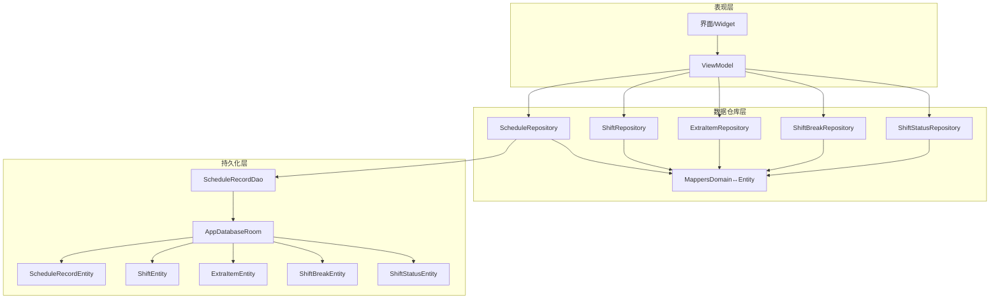
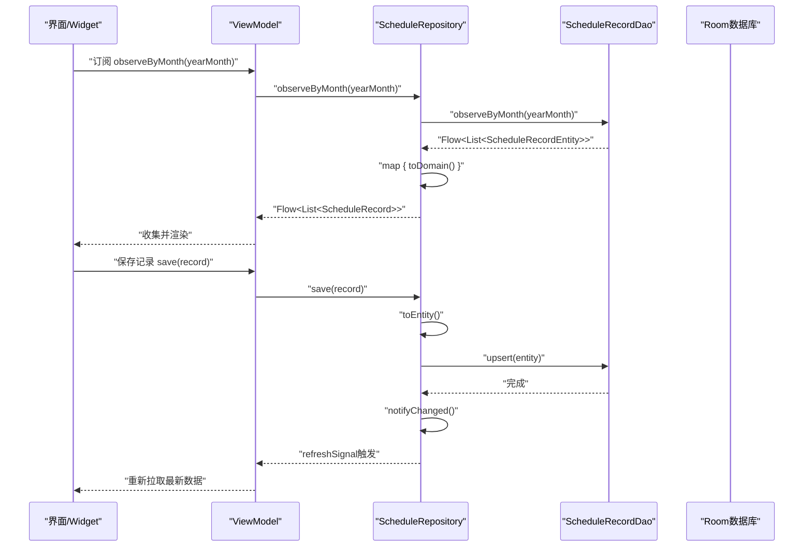
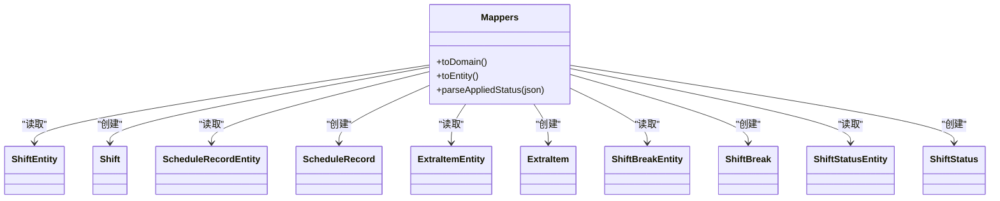
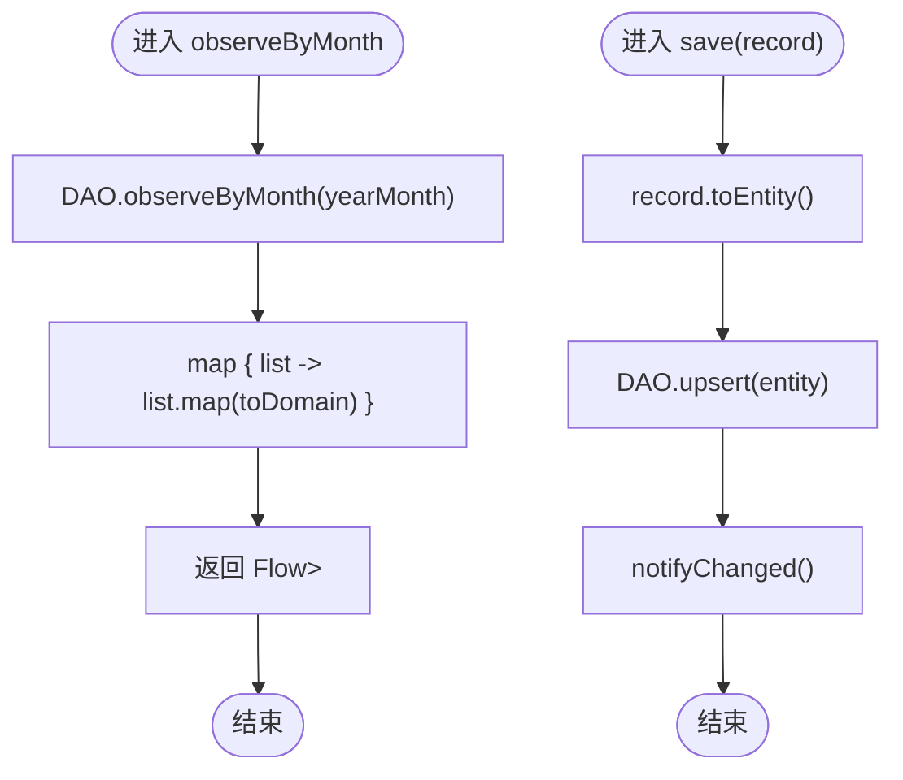
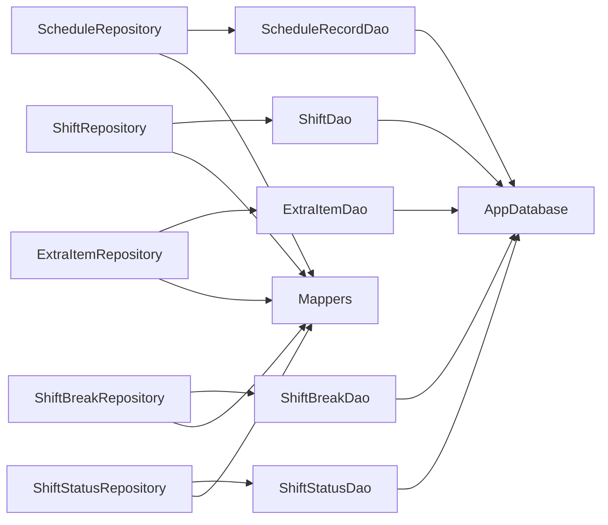
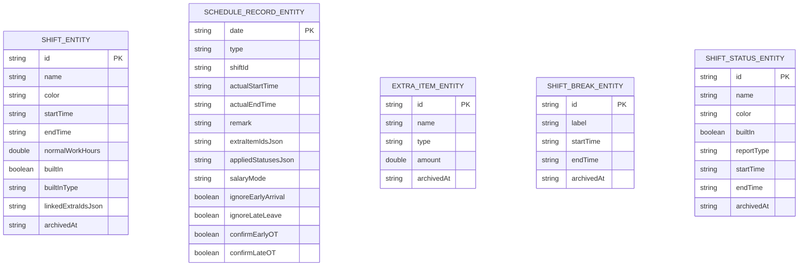

# Repository数据仓库

<cite>
**本文引用的文件**   
- [Mappers.kt](file://app/src/main/java/com/schedulecalendar/app/data/repository/Mappers.kt)
- [ScheduleRepository.kt](file://app/src/main/java/com/schedulecalendar/app/data/repository/ScheduleRepository.kt)
- [ShiftRepository.kt](file://app/src/main/java/com/schedulecalendar/app/data/repository/ShiftRepository.kt)
- [ExtraItemRepository.kt](file://app/src/main/java/com/schedulecalendar/app/data/repository/ExtraItemRepository.kt)
- [ShiftBreakRepository.kt](file://app/src/main/java/com/schedulecalendar/app/data/repository/ShiftBreakRepository.kt)
- [ShiftStatusRepository.kt](file://app/src/main/java/com/schedulecalendar/app/data/repository/ShiftStatusRepository.kt)
- [Models.kt](file://app/src/main/java/com/schedulecalendar/app/domain/model/Models.kt)
- [AppDatabase.kt](file://app/src/main/java/com/schedulecalendar/app/data/db/AppDatabase.kt)
- [DatabaseModule.kt](file://app/src/main/java/com/schedulecalendar/app/di/DatabaseModule.kt)
- [ScheduleRecordDao.kt](file://app/src/main/java/com/schedulecalendar/app/data/db/dao/ScheduleRecordDao.kt)
- [ShiftEntity.kt](file://app/src/main/java/com/schedulecalendar/app/data/db/entity/ShiftEntity.kt)
- [ScheduleRecordEntity.kt](file://app/src/main/java/com/schedulecalendar/app/data/db/entity/ScheduleRecordEntity.kt)
- [ExtraItemEntity.kt](file://app/src/main/java/com/schedulecalendar/app/data/db/entity/ExtraItemEntity.kt)
- [ShiftBreakEntity.kt](file://app/src/main/java/com/schedulecalendar/app/data/db/entity/ShiftBreakEntity.kt)
- [ShiftStatusEntity.kt](file://app/src/main/java/com/schedulecalendar/app/data/db/entity/ShiftStatusEntity.kt)
</cite>

## 目录
1. [简介](#简介)
2. [项目结构](#项目结构)
3. [核心组件](#核心组件)
4. [架构总览](#架构总览)
5. [详细组件分析](#详细组件分析)
6. [依赖分析](#依赖分析)
7. [性能考虑](#性能考虑)
8. [故障排查指南](#故障排查指南)
9. [结论](#结论)
10. [附录](#附录)

## 简介
本文件围绕Repository数据仓库模式，系统化阐述该项目的分层设计、职责分离与数据流转。重点包括：
- 数据源抽象（Room DAO）与业务封装（Repository）的边界
- Domain模型与Entity之间的映射（Mappers）
- 响应式数据流（Flow/StateFlow）与变更通知机制
- 内置数据初始化与一致性保障
- 并发访问控制与错误处理策略
- 缓存策略与数据同步思路（结合现有实现与最佳实践建议）

## 项目结构
本项目采用典型的“UI → ViewModel → Repository → DAO → Room”的分层架构：
- UI层通过ViewModel消费Repository暴露的响应式数据流
- Repository负责领域模型与持久化实体之间的转换、数据聚合与变更通知
- DAO基于Room提供数据库查询与变更流
- Entity为Room表结构定义
- Mappers集中处理Domain与Entity的双向转换

图表来源 
- [AppDatabase.kt:17-34](file://app/src/main/java/com/schedulecalendar/app/data/db/AppDatabase.kt#L17-L34)
- [ScheduleRecordDao.kt:8-39](file://app/src/main/java/com/schedulecalendar/app/data/db/dao/ScheduleRecordDao.kt#L8-L39)
- [ScheduleRepository.kt:13-39](file://app/src/main/java/com/schedulecalendar/app/data/repository/ScheduleRepository.kt#L13-L39)
- [ShiftRepository.kt:12-44](file://app/src/main/java/com/schedulecalendar/app/data/repository/ShiftRepository.kt#L12-L44)
- [ExtraItemRepository.kt:11-30](file://app/src/main/java/com/schedulecalendar/app/data/repository/ExtraItemRepository.kt#L11-L30)
- [ShiftBreakRepository.kt:11-26](file://app/src/main/java/com/schedulecalendar/app/data/repository/ShiftBreakRepository.kt#L11-L26)
- [ShiftStatusRepository.kt:12-53](file://app/src/main/java/com/schedulecalendar/app/data/repository/ShiftStatusRepository.kt#L12-L53)
- [Mappers.kt:19-133](file://app/src/main/java/com/schedulecalendar/app/data/repository/Mappers.kt#L19-L133)

章节来源
- [AppDatabase.kt:17-34](file://app/src/main/java/com/schedulecalendar/app/data/db/AppDatabase.kt#L17-L34)
- [DatabaseModule.kt:23-34](file://app/src/main/java/com/schedulecalendar/app/di/DatabaseModule.kt#L23-L34)

## 核心组件
- Repository层
  - ScheduleRepository：排班记录的CRUD与按月/范围观察流，写操作后发出刷新信号
  - ShiftRepository：班次CRUD，支持内置班次合并与归档
  - ExtraItemRepository：附加项CRUD，区分有效与全部（含归档）
  - ShiftBreakRepository：全局不计入工时时段CRUD
  - ShiftStatusRepository：状态类型CRUD，内置状态保证与去重合并
- Mappers：集中处理Domain与Entity双向转换，包含JSON解析与兼容旧格式
- DAO与Entity：Room定义的表结构与查询接口
- DI模块：Hilt提供单例数据库与各DAO实例

章节来源
- [ScheduleRepository.kt:13-39](file://app/src/main/java/com/schedulecalendar/app/data/repository/ScheduleRepository.kt#L13-L39)
- [ShiftRepository.kt:12-44](file://app/src/main/java/com/schedulecalendar/app/data/repository/ShiftRepository.kt#L12-L44)
- [ExtraItemRepository.kt:11-30](file://app/src/main/java/com/schedulecalendar/app/data/repository/ExtraItemRepository.kt#L11-L30)
- [ShiftBreakRepository.kt:11-26](file://app/src/main/java/com/schedulecalendar/app/data/repository/ShiftBreakRepository.kt#L11-L26)
- [ShiftStatusRepository.kt:12-53](file://app/src/main/java/com/schedulecalendar/app/data/repository/ShiftStatusRepository.kt#L12-L53)
- [Mappers.kt:19-133](file://app/src/main/java/com/schedulecalendar/app/data/repository/Mappers.kt#L19-L133)
- [AppDatabase.kt:17-34](file://app/src/main/java/com/schedulecalendar/app/data/db/AppDatabase.kt#L17-L34)
- [DatabaseModule.kt:23-34](file://app/src/main/java/com/schedulecalendar/app/di/DatabaseModule.kt#L23-L34)

## 架构总览
下图展示从UI到数据库的完整调用链与数据流向，突出Repository在转换、聚合与响应式更新中的作用。

图表来源 
- [ScheduleRepository.kt:22-36](file://app/src/main/java/com/schedulecalendar/app/data/repository/ScheduleRepository.kt#L22-L36)
- [ScheduleRecordDao.kt:10-26](file://app/src/main/java/com/schedulecalendar/app/data/db/dao/ScheduleRecordDao.kt#L10-L26)
- [Mappers.kt:92-128](file://app/src/main/java/com/schedulecalendar/app/data/repository/Mappers.kt#L92-L128)

## 详细组件分析

### Mappers：Domain与Entity映射
- 职责
  - 将Entity转换为Domain模型，供上层使用
  - 将Domain模型转换为Entity，写入数据库
  - 处理JSON字段（如关联ID列表、应用状态），兼容旧版数组格式与新对象格式
- 关键逻辑
  - Shift/ShiftBreak/ShiftStatus/ExtraItem：一对一字段映射
  - ScheduleRecord：复杂字段解析（extraItemIdsJson、appliedStatusesJson、枚举转换）
  - parseAppliedStatus：兼容旧版数组与新对象两种JSON结构
- 复杂度与性能
  - JSON解析使用Gson TypeToken，时间复杂度O(n)，n为JSON元素数量
  - 批量转换时建议在Repository层进行一次性map，避免重复解析

图表来源 
- [Mappers.kt:19-133](file://app/src/main/java/com/schedulecalendar/app/data/repository/Mappers.kt#L19-L133)
- [ShiftEntity.kt:8-23](file://app/src/main/java/com/schedulecalendar/app/data/db/entity/ShiftEntity.kt#L8-L23)
- [ScheduleRecordEntity.kt:8-25](file://app/src/main/java/com/schedulecalendar/app/data/db/entity/ScheduleRecordEntity.kt#L8-L25)
- [ExtraItemEntity.kt:8-15](file://app/src/main/java/com/schedulecalendar/app/data/db/entity/ExtraItemEntity.kt#L8-L15)
- [ShiftBreakEntity.kt:8-15](file://app/src/main/java/com/schedulecalendar/app/data/db/entity/ShiftBreakEntity.kt#L8-L15)
- [ShiftStatusEntity.kt:8-18](file://app/src/main/java/com/schedulecalendar/app/data/db/entity/ShiftStatusEntity.kt#L8-L18)
- [Models.kt:51-110](file://app/src/main/java/com/schedulecalendar/app/domain/model/Models.kt#L51-L110)

章节来源
- [Mappers.kt:19-133](file://app/src/main/java/com/schedulecalendar/app/data/repository/Mappers.kt#L19-L133)
- [Models.kt:51-110](file://app/src/main/java/com/schedulecalendar/app/domain/model/Models.kt#L51-L110)

### ScheduleRepository：排班记录仓库
- 职责
  - 提供按月份、日期范围、全量的查询与观察流
  - 提供保存、删除等写操作，并在写后发出刷新信号
- 响应式与变更通知
  - 使用MutableSharedFlow作为内部刷新信号，对外暴露不可变Flow
  - 所有写操作后调用notifyChanged()触发上层刷新
- 数据转换
  - 在Flow.map中统一执行toDomain()，确保返回给上层的都是Domain模型

图表来源 
- [ScheduleRepository.kt:22-36](file://app/src/main/java/com/schedulecalendar/app/data/repository/ScheduleRepository.kt#L22-L36)
- [ScheduleRecordDao.kt:10-26](file://app/src/main/java/com/schedulecalendar/app/data/db/dao/ScheduleRecordDao.kt#L10-L26)
- [Mappers.kt:92-128](file://app/src/main/java/com/schedulecalendar/app/data/repository/Mappers.kt#L92-L128)

章节来源
- [ScheduleRepository.kt:13-39](file://app/src/main/java/com/schedulecalendar/app/data/repository/ScheduleRepository.kt#L13-L39)
- [ScheduleRecordDao.kt:8-39](file://app/src/main/java/com/schedulecalendar/app/data/db/dao/ScheduleRecordDao.kt#L8-L39)

### ShiftRepository：班次仓库
- 职责
  - 提供有效/全部/含内置班次的查询与观察流
  - 提供保存、归档、删除等操作；内置班次不写入数据库
- 内置数据合并
  - 在observeAllWithBuiltin与getAllWithBuiltin中合并内置班次与数据库结果，并按id去重

章节来源
- [ShiftRepository.kt:12-44](file://app/src/main/java/com/schedulecalendar/app/data/repository/ShiftRepository.kt#L12-L44)
- [Models.kt:68-79](file://app/src/main/java/com/schedulecalendar/app/domain/model/Models.kt#L68-L79)

### ExtraItemRepository：附加项仓库
- 职责
  - 提供有效/全部（含归档）的查询与观察流
  - 提供保存、归档、删除等操作

章节来源
- [ExtraItemRepository.kt:11-30](file://app/src/main/java/com/schedulecalendar/app/data/repository/ExtraItemRepository.kt#L11-L30)

### ShiftBreakRepository：休息时段仓库
- 职责
  - 提供有效/全部（含归档）的查询与观察流
  - 提供保存、归档、删除等操作

章节来源
- [ShiftBreakRepository.kt:11-26](file://app/src/main/java/com/schedulecalendar/app/data/repository/ShiftBreakRepository.kt#L11-L26)

### ShiftStatusRepository：状态类型仓库
- 职责
  - 提供有效/全部/含内置状态的查询与观察流
  - ensureBuiltins保证首次启动时内置状态存在
  - save时跳过内置状态写入

章节来源
- [ShiftStatusRepository.kt:12-53](file://app/src/main/java/com/schedulecalendar/app/data/repository/ShiftStatusRepository.kt#L12-L53)
- [Models.kt:76-79](file://app/src/main/java/com/schedulecalendar/app/domain/model/Models.kt#L76-L79)

## 依赖分析
- Repository依赖DAO，DAO依赖Room数据库
- Mappers被各Repository复用，承担Domain与Entity转换职责
- Hilt提供AppDatabase与各DAO的单例实例，降低耦合

图表来源 
- [ScheduleRepository.kt:13-39](file://app/src/main/java/com/schedulecalendar/app/data/repository/ScheduleRepository.kt#L13-L39)
- [ShiftRepository.kt:12-44](file://app/src/main/java/com/schedulecalendar/app/data/repository/ShiftRepository.kt#L12-L44)
- [ExtraItemRepository.kt:11-30](file://app/src/main/java/com/schedulecalendar/app/data/repository/ExtraItemRepository.kt#L11-L30)
- [ShiftBreakRepository.kt:11-26](file://app/src/main/java/com/schedulecalendar/app/data/repository/ShiftBreakRepository.kt#L11-L26)
- [ShiftStatusRepository.kt:12-53](file://app/src/main/java/com/schedulecalendar/app/data/repository/ShiftStatusRepository.kt#L12-L53)
- [AppDatabase.kt:17-34](file://app/src/main/java/com/schedulecalendar/app/data/db/AppDatabase.kt#L17-L34)

章节来源
- [DatabaseModule.kt:23-34](file://app/src/main/java/com/schedulecalendar/app/di/DatabaseModule.kt#L23-L34)
- [AppDatabase.kt:17-34](file://app/src/main/java/com/schedulecalendar/app/data/db/AppDatabase.kt#L17-L34)

## 性能考虑
- 响应式流优化
  - 使用Flow.map在Repository层统一转换，减少UI层负担
  - MutableSharedFlow用于写后刷新信号，避免频繁LiveData切换
- 批量操作
  - upsertAll/saveAll减少数据库往返次数
- JSON解析
  - Gson解析在Mappers中进行，注意大列表场景下的性能影响
- 内存占用
  - observeActive/observeAll返回Flow，避免一次性加载过多历史数据
- 迁移与兼容性
  - Room版本管理与fallbackToDestructiveMigration简化迁移，但会丢失数据，需谨慎评估

[本节为通用指导，无需特定文件引用]

## 故障排查指南
- 常见错误
  - JSON解析失败：parseAppliedStatus对空串、null、旧数组格式做了兼容，但仍需检查输入合法性
  - 枚举转换异常：runCatching包裹了枚举转换，默认回退值可避免崩溃
  - 并发冲突：DAO的onConflict=REPLACE保证覆盖写入，注意业务语义是否允许覆盖
- 调试建议
  - 在Repository层添加日志输出，确认Flow数据变化与转换结果
  - 检查ensureBuiltins是否在应用启动时调用，避免内置数据缺失
- 数据一致性
  - 写操作后立即触发refreshSignal，确保UI拉取最新数据
  - 归档字段archivedAt用于逻辑删除，查询时需过滤或明确包含

章节来源
- [Mappers.kt:69-88](file://app/src/main/java/com/schedulecalendar/app/data/repository/Mappers.kt#L69-L88)
- [Mappers.kt:92-128](file://app/src/main/java/com/schedulecalendar/app/data/repository/Mappers.kt#L92-L128)
- [ScheduleRepository.kt:22-36](file://app/src/main/java/com/schedulecalendar/app/data/repository/ScheduleRepository.kt#L22-L36)
- [ShiftStatusRepository.kt:42-46](file://app/src/main/java/com/schedulecalendar/app/data/repository/ShiftStatusRepository.kt#L42-L46)

## 结论
该项目采用清晰的Repository数据仓库模式，实现了：
- 数据源抽象与业务封装的职责分离
- 统一的Domain与Entity映射（Mappers）
- 响应式数据流与写后刷新机制
- 内置数据初始化与一致性保障
- 合理的并发与错误处理策略

建议后续优化方向：
- 引入显式缓存层（如内存缓存+失效策略）以提升热点数据访问性能
- 增加跨进程/多源数据同步机制（如与远程API或系统日历同步）
- 完善单元测试与集成测试，覆盖Mappers与Repository的关键路径

[本节为总结性内容，无需特定文件引用]

## 附录
- 数据模型概览（Domain与Entity对应关系）

图表来源 
- [ShiftEntity.kt:8-23](file://app/src/main/java/com/schedulecalendar/app/data/db/entity/ShiftEntity.kt#L8-L23)
- [ScheduleRecordEntity.kt:8-25](file://app/src/main/java/com/schedulecalendar/app/data/db/entity/ScheduleRecordEntity.kt#L8-L25)
- [ExtraItemEntity.kt:8-15](file://app/src/main/java/com/schedulecalendar/app/data/db/entity/ExtraItemEntity.kt#L8-L15)
- [ShiftBreakEntity.kt:8-15](file://app/src/main/java/com/schedulecalendar/app/data/db/entity/ShiftBreakEntity.kt#L8-L15)
- [ShiftStatusEntity.kt:8-18](file://app/src/main/java/com/schedulecalendar/app/data/db/entity/ShiftStatusEntity.kt#L8-L18)