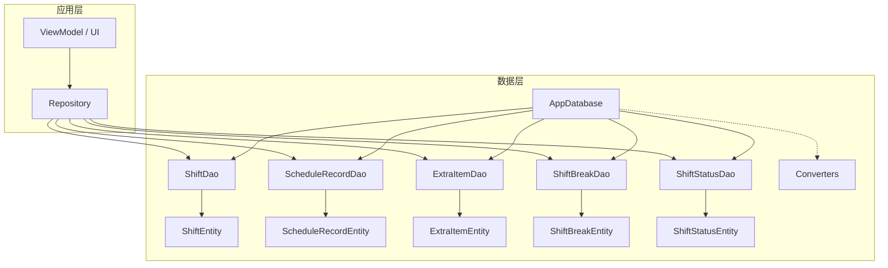
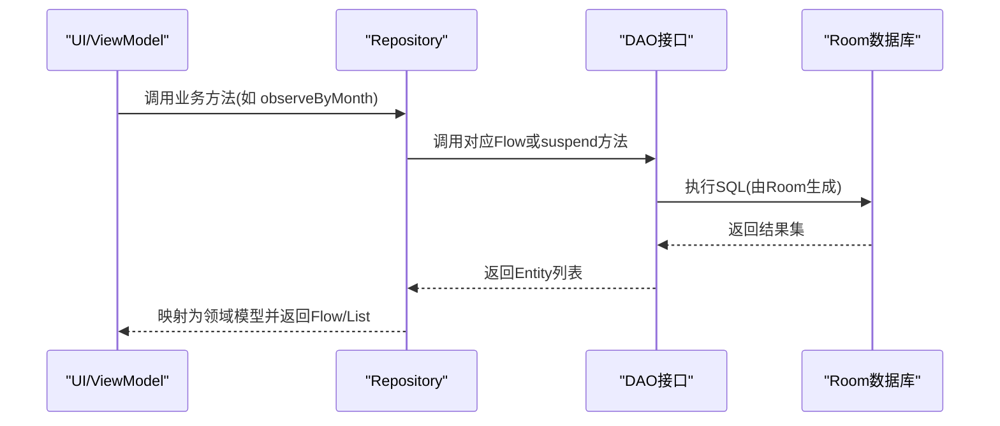
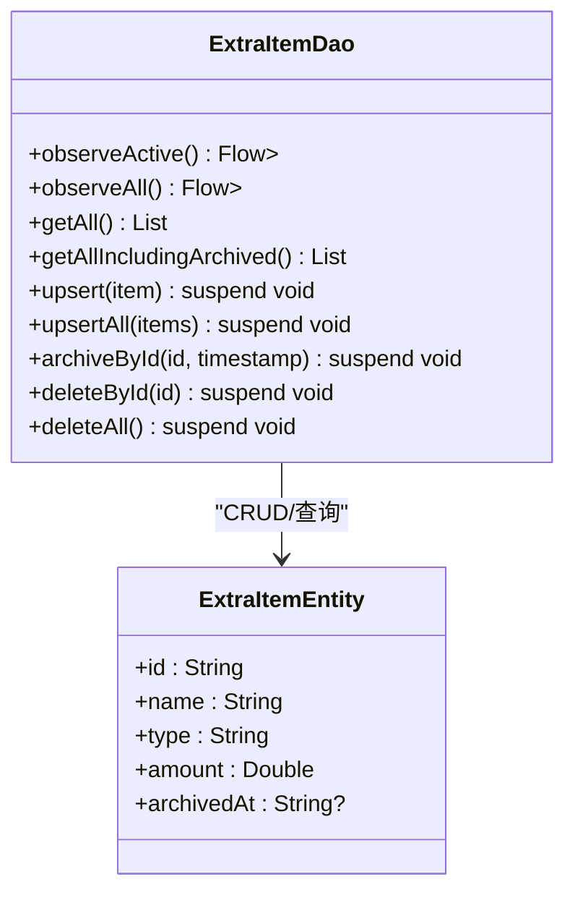
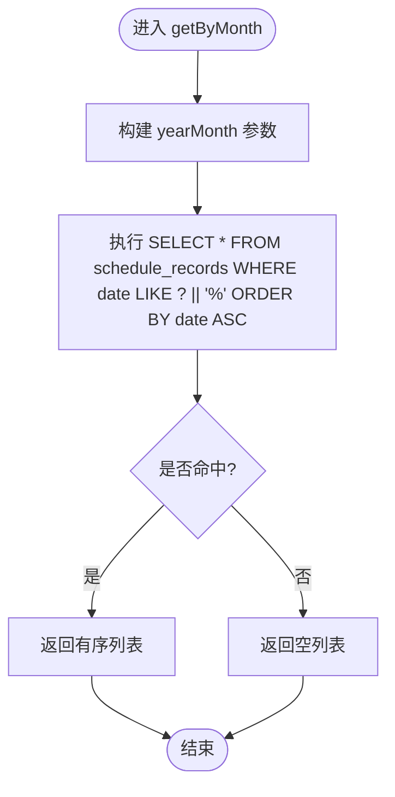
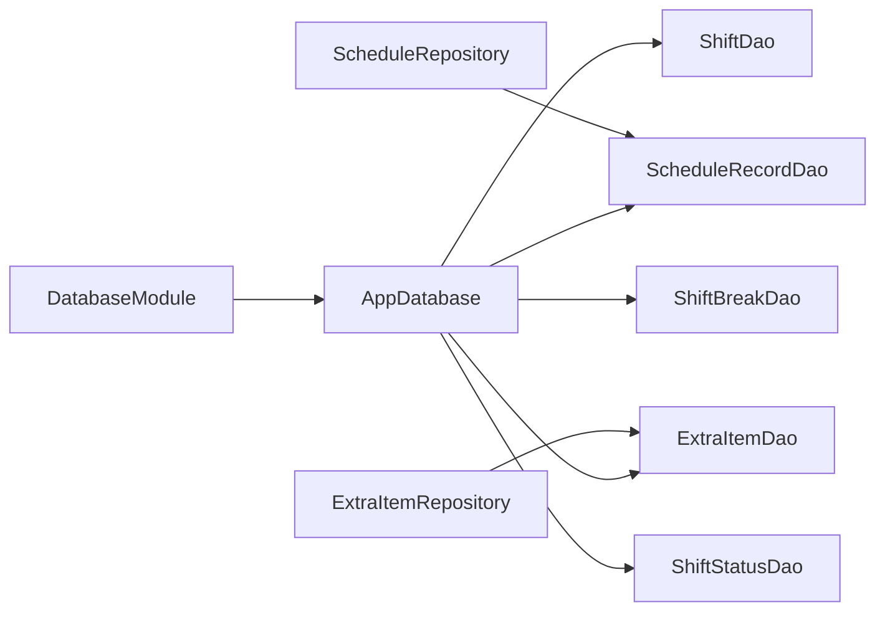

# DAO接口设计

<cite>
**本文引用的文件**   
- [ExtraItemDao.kt](file://app/src/main/java/com/schedulecalendar/app/data/db/dao/ExtraItemDao.kt)
- [ScheduleRecordDao.kt](file://app/src/main/java/com/schedulecalendar/app/data/db/dao/ScheduleRecordDao.kt)
- [ShiftBreakDao.kt](file://app/src/main/java/com/schedulecalendar/app/data/db/dao/ShiftBreakDao.kt)
- [ShiftDao.kt](file://app/src/main/java/com/schedulecalendar/app/data/db/dao/ShiftDao.kt)
- [ShiftStatusDao.kt](file://app/src/main/java/com/schedulecalendar/app/data/db/dao/ShiftStatusDao.kt)
- [ExtraItemEntity.kt](file://app/src/main/java/com/schedulecalendar/app/data/db/entity/ExtraItemEntity.kt)
- [ScheduleRecordEntity.kt](file://app/src/main/java/com/schedulecalendar/app/data/db/entity/ScheduleRecordEntity.kt)
- [ShiftBreakEntity.kt](file://app/src/main/java/com/schedulecalendar/app/data/db/entity/ShiftBreakEntity.kt)
- [ShiftEntity.kt](file://app/src/main/java/com/schedulecalendar/app/data/db/entity/ShiftEntity.kt)
- [ShiftStatusEntity.kt](file://app/src/main/java/com/schedulecalendar/app/data/db/entity/ShiftStatusEntity.kt)
- [AppDatabase.kt](file://app/src/main/java/com/schedulecalendar/app/data/db/AppDatabase.kt)
- [Converters.kt](file://app/src/main/java/com/schedulecalendar/app/data/db/Converters.kt)
- [DatabaseModule.kt](file://app/src/main/java/com/schedulecalendar/app/di/DatabaseModule.kt)
- [ExtraItemRepository.kt](file://app/src/main/java/com/schedulecalendar/app/data/repository/ExtraItemRepository.kt)
- [ScheduleRepository.kt](file://app/src/main/java/com/schedulecalendar/app/data/repository/ScheduleRepository.kt)
</cite>

## 目录
1. [简介](#简介)
2. [项目结构](#项目结构)
3. [核心组件](#核心组件)
4. [架构总览](#架构总览)
5. [详细组件分析](#详细组件分析)
6. [依赖关系分析](#依赖关系分析)
7. [性能考虑](#性能考虑)
8. [故障排查指南](#故障排查指南)
9. [结论](#结论)
10. [附录](#附录)

## 简介
本文件围绕 Room + Kotlin Coroutines 的 DAO 接口设计进行系统化说明，覆盖以下主题：
- @Dao 注解与接口的职责边界
- CRUD 操作注解（@Insert、@Update、@Delete、@Query）的使用模式
- Flow 驱动的响应式查询与并发安全
- 复杂查询（JOIN、聚合、子查询）的设计建议与实现路径
- 事务处理最佳实践
- 使用示例与性能优化建议

## 项目结构
本项目采用分层数据访问设计：
- 实体层（Entity）：定义 Room 表结构与字段映射
- DAO 层（@Dao 接口）：声明 SQL 语句与数据库交互方法
- 数据库配置（AppDatabase）：集中注册实体与版本管理
- 转换器（TypeConverter）：复杂类型与 JSON 字符串互转
- 依赖注入（Hilt Module）：提供 AppDatabase 与各 DAO 实例
- Repository 层：封装业务逻辑，桥接 Domain 与 Data

**图示来源** 
- [AppDatabase.kt:17-34](file://app/src/main/java/com/schedulecalendar/app/data/db/AppDatabase.kt#L17-L34)
- [DatabaseModule.kt:23-34](file://app/src/main/java/com/schedulecalendar/app/di/DatabaseModule.kt#L23-L34)
- [ExtraItemDao.kt:8-40](file://app/src/main/java/com/schedulecalendar/app/data/db/dao/ExtraItemDao.kt#L8-L40)
- [ScheduleRecordDao.kt:8-39](file://app/src/main/java/com/schedulecalendar/app/data/db/dao/ScheduleRecordDao.kt#L8-L39)
- [ShiftBreakDao.kt:8-38](file://app/src/main/java/com/schedulecalendar/app/data/db/dao/ShiftBreakDao.kt#L8-L38)
- [ShiftDao.kt:8-41](file://app/src/main/java/com/schedulecalendar/app/data/db/dao/ShiftDao.kt#L8-L41)
- [ShiftStatusDao.kt:8-38](file://app/src/main/java/com/schedulecalendar/app/data/db/dao/ShiftStatusDao.kt#L8-L38)

**章节来源**
- [AppDatabase.kt:17-34](file://app/src/main/java/com/schedulecalendar/app/data/db/AppDatabase.kt#L17-L34)
- [DatabaseModule.kt:23-34](file://app/src/main/java/com/schedulecalendar/app/di/DatabaseModule.kt#L23-L34)

## 核心组件
- DAO 接口统一以 @Dao 标注，暴露协程 suspend 方法与 Flow 流式查询
- Entity 通过 @Entity 与 @PrimaryKey 声明表结构
- AppDatabase 通过 @Database 注册实体并导出 schema
- Converters 提供 List<String> 与 JSON 字符串的双向转换
- Repository 封装业务语义，调用 DAO 并返回领域模型

**章节来源**
- [ExtraItemDao.kt:8-40](file://app/src/main/java/com/schedulecalendar/app/data/db/dao/ExtraItemDao.kt#L8-L40)
- [ScheduleRecordDao.kt:8-39](file://app/src/main/java/com/schedulecalendar/app/data/db/dao/ScheduleRecordDao.kt#L8-L39)
- [ShiftBreakDao.kt:8-38](file://app/src/main/java/com/schedulecalendar/app/data/db/dao/ShiftBreakDao.kt#L8-L38)
- [ShiftDao.kt:8-41](file://app/src/main/java/com/schedulecalendar/app/data/db/dao/ShiftDao.kt#L8-L41)
- [ShiftStatusDao.kt:8-38](file://app/src/main/java/com/schedulecalendar/app/data/db/dao/ShiftStatusDao.kt#L8-L38)
- [ExtraItemEntity.kt:7-15](file://app/src/main/java/com/schedulecalendar/app/data/db/entity/ExtraItemEntity.kt#L7-L15)
- [ScheduleRecordEntity.kt:7-25](file://app/src/main/java/com/schedulecalendar/app/data/db/entity/ScheduleRecordEntity.kt#L7-L25)
- [ShiftBreakEntity.kt:7-15](file://app/src/main/java/com/schedulecalendar/app/data/db/entity/ShiftBreakEntity.kt#L7-L15)
- [ShiftEntity.kt:7-23](file://app/src/main/java/com/schedulecalendar/app/data/db/entity/ShiftEntity.kt#L7-L23)
- [ShiftStatusEntity.kt:7-18](file://app/src/main/java/com/schedulecalendar/app/data/db/entity/ShiftStatusEntity.kt#L7-L18)
- [AppDatabase.kt:17-34](file://app/src/main/java/com/schedulecalendar/app/data/db/AppDatabase.kt#L17-L34)
- [Converters.kt:9-16](file://app/src/main/java/com/schedulecalendar/app/data/db/Converters.kt#L9-L16)

## 架构总览
Room 在编译期根据 @Dao 接口生成具体实现，DAO 方法直接映射到 SQL。Repository 负责将 Entity 转换为领域模型，并提供更高层的业务能力（如变更信号）。

**图示来源** 
- [ScheduleRepository.kt:22-33](file://app/src/main/java/com/schedulecalendar/app/data/repository/ScheduleRepository.kt#L22-L33)
- [ScheduleRecordDao.kt:10-20](file://app/src/main/java/com/schedulecalendar/app/data/db/dao/ScheduleRecordDao.kt#L10-L20)
- [AppDatabase.kt:28-33](file://app/src/main/java/com/schedulecalendar/app/data/db/AppDatabase.kt#L28-L33)

## 详细组件分析

### ExtraItemDao（附加补贴/扣款项目）
- 功能要点
  - 支持观察有效项与全部项（含归档），用于不同场景（显示 vs 薪资计算）
  - upsert 使用 REPLACE 策略保证幂等写入
  - 逻辑删除通过 archivedAt 字段标记
- 关键注解与方法
  - @Query：过滤 archivedAt IS NULL、排序、范围查询
  - @Insert(onConflict = REPLACE)：upsert/upsertAll
  - @Query UPDATE：archiveById 逻辑删除
  - @Query DELETE：按ID与清空表
- 复杂度与性能
  - 全表扫描+排序：O(n log n)，建议在 name 上建立索引以提升排序性能
  - 条件过滤 archivedAt 可结合索引减少扫描

**图示来源** 
- [ExtraItemDao.kt:8-40](file://app/src/main/java/com/schedulecalendar/app/data/db/dao/ExtraItemDao.kt#L8-L40)
- [ExtraItemEntity.kt:7-15](file://app/src/main/java/com/schedulecalendar/app/data/db/entity/ExtraItemEntity.kt#L7-L15)

**章节来源**
- [ExtraItemDao.kt:8-40](file://app/src/main/java/com/schedulecalendar/app/data/db/dao/ExtraItemDao.kt#L8-L40)
- [ExtraItemEntity.kt:7-15](file://app/src/main/java/com/schedulecalendar/app/data/db/entity/ExtraItemEntity.kt#L7-L15)

### ScheduleRecordDao（每日排班记录）
- 功能要点
  - 按月与日期范围查询，支持 Flow 实时监听
  - upsert 批量写入，支持按日期删除与范围删除
- 关键注解与方法
  - @Query LIKE 拼接 yearMonth 前缀，便于范围筛选
  - @Insert(REPLACE)：upsert/upsertAll
  - @Query DELETE：按日期与范围删除
- 复杂度与性能
  - LIKE 'YYYY-MM%' 可利用前缀索引；若频繁按 date 查询，建议对 date 建索引
  - 范围查询 ORDER BY date ASC 建议配合索引避免排序开销

**图示来源** 
- [ScheduleRecordDao.kt:10-14](file://app/src/main/java/com/schedulecalendar/app/data/db/dao/ScheduleRecordDao.kt#L10-L14)

**章节来源**
- [ScheduleRecordDao.kt:8-39](file://app/src/main/java/com/schedulecalendar/app/data/db/dao/ScheduleRecordDao.kt#L8-L39)
- [ScheduleRecordEntity.kt:7-25](file://app/src/main/java/com/schedulecalendar/app/data/db/entity/ScheduleRecordEntity.kt#L7-L25)

### ShiftBreakDao（全局不计入工时时段）
- 功能要点
  - 区分有效项与全部项（含归档），支持按 startTime 排序
  - 逻辑删除通过 archivedAt 标记
- 关键注解与方法
  - @Query 过滤 archivedAt IS NULL
  - @Insert(REPLACE)：upsert/upsertAll
  - @Query UPDATE：archiveById
  - @Query DELETE：按ID与清空表

**章节来源**
- [ShiftBreakDao.kt:8-38](file://app/src/main/java/com/schedulecalendar/app/data/db/dao/ShiftBreakDao.kt#L8-L38)
- [ShiftBreakEntity.kt:7-15](file://app/src/main/java/com/schedulecalendar/app/data/db/entity/ShiftBreakEntity.kt#L7-L15)

### ShiftDao（班次）
- 功能要点
  - 区分有效项与全部项（含归档），支持按 name 排序
  - 提供 getById 精确查找
  - 支持按对象删除与按ID删除
- 关键注解与方法
  - @Query 过滤 archivedAt IS NULL
  - @Insert(REPLACE)：upsert/upsertAll
  - @Delete：基于实体的删除
  - @Query UPDATE：archiveById

**章节来源**
- [ShiftDao.kt:8-41](file://app/src/main/java/com/schedulecalendar/app/data/db/dao/ShiftDao.kt#L8-L41)
- [ShiftEntity.kt:7-23](file://app/src/main/java/com/schedulecalendar/app/data/db/entity/ShiftEntity.kt#L7-L23)

### ShiftStatusDao（班次状态类型）
- 功能要点
  - 内置与用户自定义状态的区分（builtIn）
  - 支持仅删除用户自定义状态
- 关键注解与方法
  - @Query 过滤 archivedAt IS NULL
  - @Insert(REPLACE)：upsert/upsertAll
  - @Query UPDATE：archiveById
  - @Query DELETE：按 builtIn=0 删除用户定义项

**章节来源**
- [ShiftStatusDao.kt:8-38](file://app/src/main/java/com/schedulecalendar/app/data/db/dao/ShiftStatusDao.kt#L8-L38)
- [ShiftStatusEntity.kt:7-18](file://app/src/main/java/com/schedulecalendar/app/data/db/entity/ShiftStatusEntity.kt#L7-L18)

### 数据库与转换器
- AppDatabase
  - 通过 @Database 注册所有实体，设置版本与导出 schema
  - 抽象方法暴露各 DAO 获取入口
- Converters
  - 提供 List<String> 与 JSON 字符串的双向转换，支撑复杂字段的持久化

**章节来源**
- [AppDatabase.kt:17-34](file://app/src/main/java/com/schedulecalendar/app/data/db/AppDatabase.kt#L17-L34)
- [Converters.kt:9-16](file://app/src/main/java/com/schedulecalendar/app/data/db/Converters.kt#L9-L16)

## 依赖关系分析
- Hilt 模块提供单例 AppDatabase 与各 DAO 实例
- Repository 注入 DAO，封装领域模型转换与变更信号
- DAO 与 Entity 一一对应，Room 在编译期生成实现

**图示来源** 
- [DatabaseModule.kt:23-34](file://app/src/main/java/com/schedulecalendar/app/di/DatabaseModule.kt#L23-L34)
- [AppDatabase.kt:28-33](file://app/src/main/java/com/schedulecalendar/app/data/db/AppDatabase.kt#L28-L33)
- [ScheduleRepository.kt:14-16](file://app/src/main/java/com/schedulecalendar/app/data/repository/ScheduleRepository.kt#L14-L16)
- [ExtraItemRepository.kt:12-14](file://app/src/main/java/com/schedulecalendar/app/data/repository/ExtraItemRepository.kt#L12-L14)

**章节来源**
- [DatabaseModule.kt:23-34](file://app/src/main/java/com/schedulecalendar/app/di/DatabaseModule.kt#L23-L34)
- [AppDatabase.kt:28-33](file://app/src/main/java/com/schedulecalendar/app/data/db/AppDatabase.kt#L28-L33)
- [ScheduleRepository.kt:14-16](file://app/src/main/java/com/schedulecalendar/app/data/repository/ScheduleRepository.kt#L14-L16)
- [ExtraItemRepository.kt:12-14](file://app/src/main/java/com/schedulecalendar/app/data/repository/ExtraItemRepository.kt#L12-L14)

## 性能考虑
- 索引建议
  - schedule_records.date：高频按日期查询与排序
  - shifts.name、shift_statuses.name、extra_items.name：排序与搜索
  - shift_breaks.startTime：排序
  - archivedAt：逻辑删除过滤常用，可考虑复合索引（如 (archivedAt, name)）
- 查询优化
  - 使用 LIKE 'YYYY-MM%' 时确保前缀匹配，避免函数包裹列名
  - 尽量只选择必要字段，减少数据传输量
  - 大结果集优先使用 Flow 分页或限制条数
- 写入优化
  - 批量 upsertAll 优于循环单条插入
  - 使用 REPLACE 策略时需评估唯一键冲突成本
- 并发与线程
  - Room 默认在主线程禁止写操作，需在协程中调用 suspend 方法
  - Flow 自动在 IO 线程发射，注意背压与取消
- 事务处理
  - 多表一致性更新建议使用 @Transaction 包裹多个 DAO 调用
  - 长事务应避免阻塞 UI，必要时拆分任务或使用工作队列

[本节为通用指导，不直接分析具体文件]

## 故障排查指南
- 常见错误
  - 主键冲突：检查 @Insert 的 onConflict 策略是否符合预期
  - 字段类型不匹配：确认 Entity 字段与 SQL 类型一致，必要时扩展 TypeConverter
  - 未启用协程：确保 DAO 方法为 suspend 或在协程上下文中调用
- 调试建议
  - 开启 Room 日志输出，查看生成的 SQL
  - 使用 SQLite 浏览器验证表结构与索引
  - 针对慢查询添加 EXPLAIN QUERY PLAN 分析执行计划
- 迁移问题
  - 修改 schema 后需升级版本号并处理迁移脚本
  - 当前配置使用破坏性迁移，生产环境需谨慎

**章节来源**
- [AppDatabase.kt:17-27](file://app/src/main/java/com/schedulecalendar/app/data/db/AppDatabase.kt#L17-L27)
- [DatabaseModule.kt:24-27](file://app/src/main/java/com/schedulecalendar/app/di/DatabaseModule.kt#L24-L27)

## 结论
本项目的 DAO 设计遵循 Room + Coroutines 的最佳实践：
- 清晰的 @Dao 接口划分与统一的 CRUD 模式
- 使用 Flow 实现响应式数据流，提升 UI 体验
- 通过 TypeConverter 处理复杂字段，保持模型简洁
- 借助 Hilt 完成依赖注入，降低耦合度
建议后续补充索引设计与复杂查询（JOIN/聚合/子查询）的规范化实现，并完善事务边界与错误处理策略。

[本节为总结性内容，不直接分析具体文件]

## 附录

### 使用示例（Repository 调用 DAO）
- 观察月度排班数据
  - 调用流程：Repository.observeByMonth → DAO.observeByMonth → Room 执行 SQL → Flow 返回
  - 参考路径：[ScheduleRepository.kt:22-24](file://app/src/main/java/com/schedulecalendar/app/data/repository/ScheduleRepository.kt#L22-L24)、[ScheduleRecordDao.kt:10-11](file://app/src/main/java/com/schedulecalendar/app/data/db/dao/ScheduleRecordDao.kt#L10-L11)
- 保存附加项目
  - 调用流程：Repository.save → DAO.upsert → Room 执行 INSERT/REPLACE
  - 参考路径：[ExtraItemRepository.kt:24](file://app/src/main/java/com/schedulecalendar/app/data/repository/ExtraItemRepository.kt#L24)、[ExtraItemDao.kt:25-26](file://app/src/main/java/com/schedulecalendar/app/data/db/dao/ExtraItemDao.kt#L25-L26)

**章节来源**
- [ScheduleRepository.kt:22-24](file://app/src/main/java/com/schedulecalendar/app/data/repository/ScheduleRepository.kt#L22-L24)
- [ScheduleRecordDao.kt:10-11](file://app/src/main/java/com/schedulecalendar/app/data/db/dao/ScheduleRecordDao.kt#L10-L11)
- [ExtraItemRepository.kt:24](file://app/src/main/java/com/schedulecalendar/app/data/repository/ExtraItemRepository.kt#L24)
- [ExtraItemDao.kt:25-26](file://app/src/main/java/com/schedulecalendar/app/data/db/dao/ExtraItemDao.kt#L25-L26)

### 复杂查询编写建议
- JOIN 操作
  - 在多表关联时，确保连接键有索引，避免全表扫描
  - 使用视图或中间表简化复杂关联
- 聚合函数
  - 使用 COUNT/SUM/AVG 等聚合时，尽量在 SQL 层完成计算，减少内存压力
- 子查询
  - 将子查询结果物化为临时表或视图，提高可读性与性能
- 示例思路（概念性）
  - 统计某月各状态排班数量：GROUP BY statusId
  - 计算某班次平均时长：SELECT AVG(endTime - startTime) GROUP BY shiftId

[本节为概念性指导，不直接分析具体文件]

### 事务处理最佳实践
- 使用 @Transaction 包裹多个 DAO 调用，确保原子性
- 将耗时操作放入后台协程，避免阻塞主线程
- 合理拆分事务粒度，减少锁竞争
- 失败回滚：捕获异常并抛出，让 Room 自动回滚

[本节为通用指导，不直接分析具体文件]

### 并发访问安全性
- Room 内部已处理并发读写，但需注意：
  - 避免长时间持有数据库连接
  - 使用 Flow 的取消机制及时释放资源
  - 批量写入时使用事务减少锁切换
- 推荐模式
  - 读多写少：Flow + 缓存（内存/磁盘）
  - 写多读少：队列化写入，合并更新

[本节为通用指导，不直接分析具体文件]