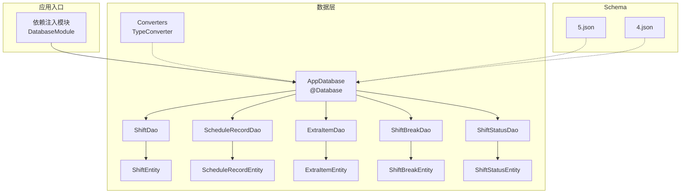
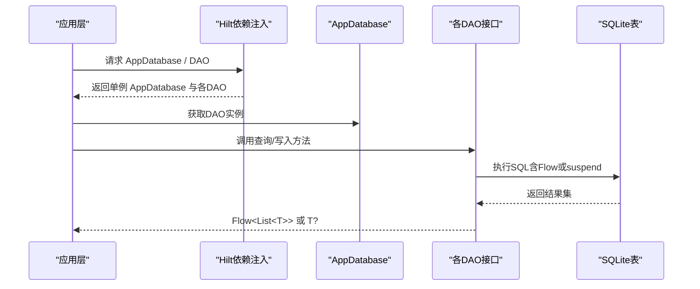
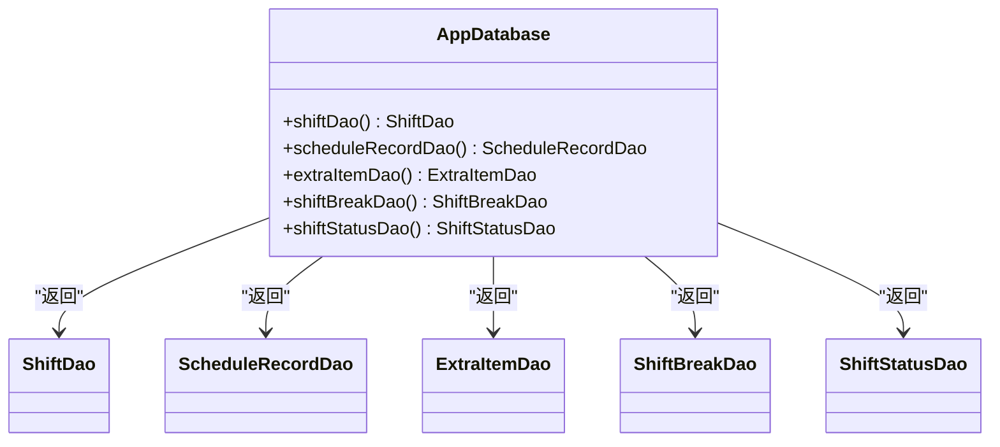
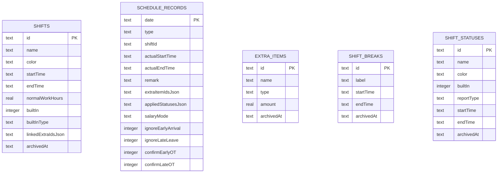
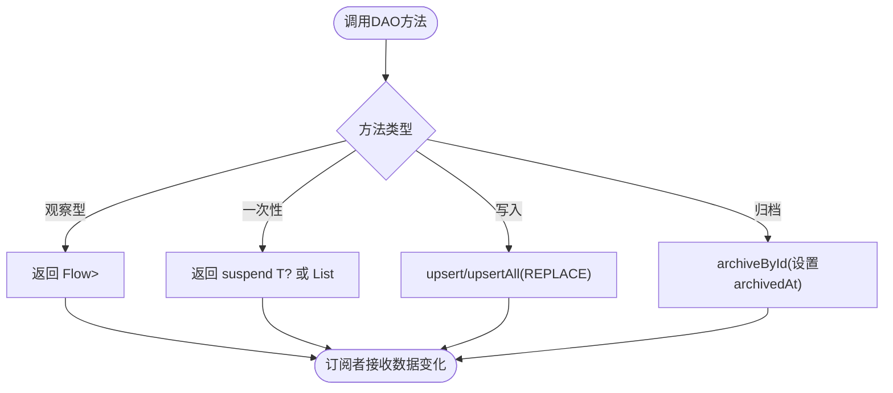
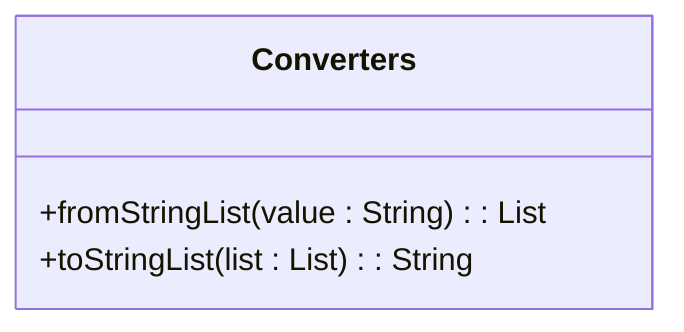
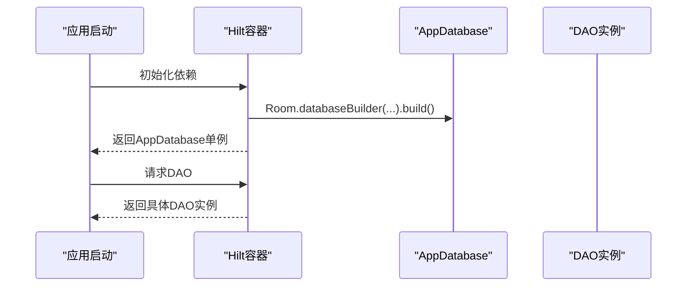
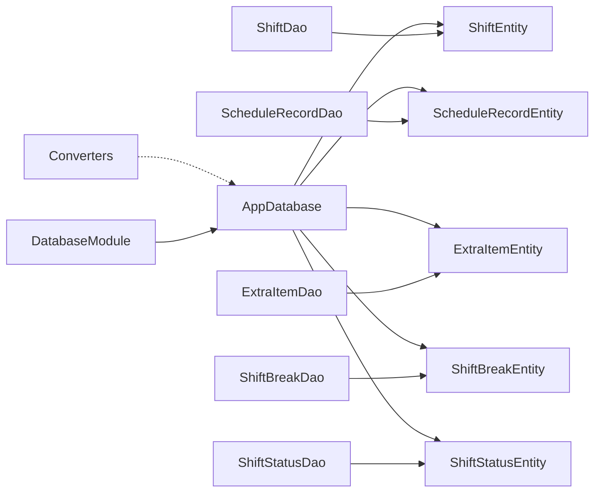

# Room数据库设计

<cite>
**本文引用的文件**
- [AppDatabase.kt](file://app/src/main/java/com/schedulecalendar/app/data/db/AppDatabase.kt)
- [Converters.kt](file://app/src/main/java/com/schedulecalendar/app/data/db/Converters.kt)
- [ShiftEntity.kt](file://app/src/main/java/com/schedulecalendar/app/data/db/entity/ShiftEntity.kt)
- [ScheduleRecordEntity.kt](file://app/src/main/java/com/schedulecalendar/app/data/db/entity/ScheduleRecordEntity.kt)
- [ExtraItemEntity.kt](file://app/src/main/java/com/schedulecalendar/app/data/db/entity/ExtraItemEntity.kt)
- [ShiftBreakEntity.kt](file://app/src/main/java/com/schedulecalendar/app/data/db/entity/ShiftBreakEntity.kt)
- [ShiftStatusEntity.kt](file://app/src/main/java/com/schedulecalendar/app/data/db/entity/ShiftStatusEntity.kt)
- [ShiftDao.kt](file://app/src/main/java/com/schedulecalendar/app/data/db/dao/ShiftDao.kt)
- [ScheduleRecordDao.kt](file://app/src/main/java/com/schedulecalendar/app/data/db/dao/ScheduleRecordDao.kt)
- [ExtraItemDao.kt](file://app/src/main/java/com/schedulecalendar/app/data/db/dao/ExtraItemDao.kt)
- [ShiftBreakDao.kt](file://app/src/main/java/com/schedulecalendar/app/data/db/dao/ShiftBreakDao.kt)
- [ShiftStatusDao.kt](file://app/src/main/java/com/schedulecalendar/app/data/db/dao/ShiftStatusDao.kt)
- [DatabaseModule.kt](file://app/src/main/java/com/schedulecalendar/app/di/DatabaseModule.kt)
- [5.json](file://app/schemas/com.schedulecalendar.app.data.db.AppDatabase/5.json)
- [4.json](file://app/schemas/com.schedulecalendar.app.data.db.AppDatabase/4.json)
</cite>

## 目录
1. [简介](#简介)
2. [项目结构](#项目结构)
3. [核心组件](#核心组件)
4. [架构总览](#架构总览)
5. [详细组件分析](#详细组件分析)
6. [依赖关系分析](#依赖关系分析)
7. [性能考虑](#性能考虑)
8. [故障排查指南](#故障排查指南)
9. [结论](#结论)
10. [附录](#附录)

## 简介
本文件围绕Room数据库设计，系统化阐述AppDatabase配置、实体映射、DAO接口、类型转换器与迁移策略。重点覆盖以下实体：ShiftEntity、ScheduleRecordEntity、ExtraItemEntity、ShiftBreakEntity、ShiftStatusEntity；并解释@Database注解、版本管理、schema导出机制、TypeConverter使用场景与实现、数据库初始化流程、连接池配置与性能优化建议，以及数据库迁移与版本升级最佳实践。

## 项目结构
本项目采用分层组织：
- 数据层（data/db）：包含AppDatabase、实体类（entity）、数据访问对象（dao）、类型转换器（Converters）。
- 依赖注入（di）：通过Hilt提供AppDatabase单例及DAO实例。
- Schema导出（schemas）：按版本号存放JSON，便于编译期校验与迁移追踪。

图表来源
- [AppDatabase.kt:17-34](file://app/src/main/java/com/schedulecalendar/app/data/db/AppDatabase.kt#L17-L34)
- [DatabaseModule.kt:23-33](file://app/src/main/java/com/schedulecalendar/app/di/DatabaseModule.kt#L23-L33)
- [5.json:1-307](file://app/schemas/com.schedulecalendar.app.data.db.AppDatabase/5.json#L1-L307)
- [4.json:1-200](file://app/schemas/com.schedulecalendar.app.data.db.AppDatabase/4.json#L1-L200)

章节来源
- [AppDatabase.kt:17-34](file://app/src/main/java/com/schedulecalendar/app/data/db/AppDatabase.kt#L17-L34)
- [DatabaseModule.kt:23-33](file://app/src/main/java/com/schedulecalendar/app/di/DatabaseModule.kt#L23-L33)

## 核心组件
- AppDatabase：定义数据库元信息（实体集合、版本、schema导出），暴露DAO抽象方法。
- Entity：描述表结构与字段约束，主键、非空、默认值等。
- DAO：封装SQL查询与CRUD操作，支持Flow响应式流与协程suspend函数。
- Converters：将复杂类型（如List<String>）与JSON字符串互转，供Room持久化。
- DatabaseModule：通过Hilt提供AppDatabase单例与DAO实例，配置迁移策略。

章节来源
- [AppDatabase.kt:17-34](file://app/src/main/java/com/schedulecalendar/app/data/db/AppDatabase.kt#L17-L34)
- [ShiftEntity.kt:8-23](file://app/src/main/java/com/schedulecalendar/app/data/db/entity/ShiftEntity.kt#L8-L23)
- [ScheduleRecordEntity.kt:8-25](file://app/src/main/java/com/schedulecalendar/app/data/db/entity/ScheduleRecordEntity.kt#L8-L25)
- [ExtraItemEntity.kt:8-15](file://app/src/main/java/com/schedulecalendar/app/data/db/entity/ExtraItemEntity.kt#L8-L15)
- [ShiftBreakEntity.kt:8-15](file://app/src/main/java/com/schedulecalendar/app/data/db/entity/ShiftBreakEntity.kt#L8-L15)
- [ShiftStatusEntity.kt:8-18](file://app/src/main/java/com/schedulecalendar/app/data/db/entity/ShiftStatusEntity.kt#L8-L18)
- [ShiftDao.kt:8-41](file://app/src/main/java/com/schedulecalendar/app/data/db/dao/ShiftDao.kt#L8-L41)
- [ScheduleRecordDao.kt:8-39](file://app/src/main/java/com/schedulecalendar/app/data/db/dao/ScheduleRecordDao.kt#L8-L39)
- [ExtraItemDao.kt:8-40](file://app/src/main/java/com/schedulecalendar/app/data/db/dao/ExtraItemDao.kt#L8-L40)
- [ShiftBreakDao.kt:8-38](file://app/src/main/java/com/schedulecalendar/app/data/db/dao/ShiftBreakDao.kt#L8-L38)
- [ShiftStatusDao.kt:8-38](file://app/src/main/java/com/schedulecalendar/app/data/db/dao/ShiftStatusDao.kt#L8-L38)
- [Converters.kt:9-16](file://app/src/main/java/com/schedulecalendar/app/data/db/Converters.kt#L9-L16)
- [DatabaseModule.kt:23-33](file://app/src/main/java/com/schedulecalendar/app/di/DatabaseModule.kt#L23-L33)

## 架构总览
下图展示从依赖注入到数据库访问的调用链，以及实体与DAO的关系。

图表来源
- [DatabaseModule.kt:23-33](file://app/src/main/java/com/schedulecalendar/app/di/DatabaseModule.kt#L23-L33)
- [AppDatabase.kt:28-34](file://app/src/main/java/com/schedulecalendar/app/data/db/AppDatabase.kt#L28-L34)
- [ShiftDao.kt:10-41](file://app/src/main/java/com/schedulecalendar/app/data/db/dao/ShiftDao.kt#L10-L41)
- [ScheduleRecordDao.kt:10-39](file://app/src/main/java/com/schedulecalendar/app/data/db/dao/ScheduleRecordDao.kt#L10-L39)
- [ExtraItemDao.kt:10-40](file://app/src/main/java/com/schedulecalendar/app/data/db/dao/ExtraItemDao.kt#L10-L40)
- [ShiftBreakDao.kt:10-38](file://app/src/main/java/com/schedulecalendar/app/data/db/dao/ShiftBreakDao.kt#L10-L38)
- [ShiftStatusDao.kt:10-38](file://app/src/main/java/com/schedulecalendar/app/data/db/dao/ShiftStatusDao.kt#L10-L38)

## 详细组件分析

### AppDatabase与@Database配置
- 实体集合：声明所有参与映射的实体类。
- 版本：当前为5，用于schema演进与迁移控制。
- schema导出：开启后在编译期生成对应版本的JSON，便于验证与回滚。
- DAO暴露：抽象方法返回各DAO实例，供上层注入使用。

图表来源
- [AppDatabase.kt:17-34](file://app/src/main/java/com/schedulecalendar/app/data/db/AppDatabase.kt#L17-L34)

章节来源
- [AppDatabase.kt:17-34](file://app/src/main/java/com/schedulecalendar/app/data/db/AppDatabase.kt#L17-L34)

### 实体类与字段约束
- ShiftEntity（班次）
  - 主键：id（TEXT）
  - 名称/颜色/时间：name、color、startTime、endTime（TEXT，非空）
  - 正常班时长：normalWorkHours（REAL，可空）
  - 内置标识与类型：builtIn（INTEGER，非空）、builtInType（TEXT，可空）
  - JSON关联：linkedExtraIdsJson（TEXT，非空，默认空数组）
  - 归档时间：archivedAt（TEXT，可空）
- ScheduleRecordEntity（排班记录）
  - 主键：date（TEXT，yyyy-MM-dd）
  - 类型/关联：type（TEXT，非空，默认SHIFT）、shiftId（TEXT，可空）
  - 实际时间：actualStartTime、actualEndTime（TEXT，可空）
  - 备注：remark（TEXT，可空）
  - JSON字段：extraItemIdsJson、appliedStatusesJson（TEXT，非空，默认空数组）
  - 薪资模式：salaryMode（TEXT，可空）
  - 布尔开关：ignoreEarlyArrival、ignoreLateLeave、confirmEarlyOT、confirmLateOT（INTEGER，非空）
- ExtraItemEntity（附加补贴/扣款）
  - 主键：id（TEXT）
  - 名称/类型/金额：name（TEXT，非空）、type（TEXT，非空）、amount（REAL，非空）
  - 归档时间：archivedAt（TEXT，可空）
- ShiftBreakEntity（不计入工时时段）
  - 主键：id（TEXT）
  - 标签/时间：label（TEXT，非空）、startTime、endTime（TEXT，非空）
  - 归档时间：archivedAt（TEXT，可空）
- ShiftStatusEntity（班次状态类型）
  - 主键：id（TEXT）
  - 名称/颜色：name（TEXT，非空）、color（TEXT，非空）
  - 内置标识：builtIn（INTEGER，非空）
  - 上报类型：reportType（TEXT，可空）
  - 起止时间：startTime、endTime（TEXT，非空）
  - 归档时间：archivedAt（TEXT，可空）

图表来源
- [5.json:1-307](file://app/schemas/com.schedulecalendar.app.data.db.AppDatabase/5.json#L1-L307)

章节来源
- [ShiftEntity.kt:8-23](file://app/src/main/java/com/schedulecalendar/app/data/db/entity/ShiftEntity.kt#L8-L23)
- [ScheduleRecordEntity.kt:8-25](file://app/src/main/java/com/schedulecalendar/app/data/db/entity/ScheduleRecordEntity.kt#L8-L25)
- [ExtraItemEntity.kt:8-15](file://app/src/main/java/com/schedulecalendar/app/data/db/entity/ExtraItemEntity.kt#L8-L15)
- [ShiftBreakEntity.kt:8-15](file://app/src/main/java/com/schedulecalendar/app/data/db/entity/ShiftBreakEntity.kt#L8-L15)
- [ShiftStatusEntity.kt:8-18](file://app/src/main/java/com/schedulecalendar/app/data/db/entity/ShiftStatusEntity.kt#L8-L18)
- [5.json:1-307](file://app/schemas/com.schedulecalendar.app.data.db.AppDatabase/5.json#L1-L307)

### DAO接口与查询模式
- 响应式查询：多数DAO提供observeActive()/observeAll()返回Flow<List<T>>，便于UI实时刷新。
- 协程查询：getAll/getById/getByMonth等suspend函数，适合一次性读取。
- 写入策略：upsert/upsertAll使用REPLACE冲突策略，保证幂等更新。
- 逻辑删除：archiveById统一设置archivedAt，配合WHERE archivedAt IS NULL过滤有效数据。
- 范围查询：ScheduleRecordDao支持按日期范围查询，便于月度统计。

图表来源
- [ShiftDao.kt:10-41](file://app/src/main/java/com/schedulecalendar/app/data/db/dao/ShiftDao.kt#L10-L41)
- [ScheduleRecordDao.kt:10-39](file://app/src/main/java/com/schedulecalendar/app/data/db/dao/ScheduleRecordDao.kt#L10-L39)
- [ExtraItemDao.kt:10-40](file://app/src/main/java/com/schedulecalendar/app/data/db/dao/ExtraItemDao.kt#L10-L40)
- [ShiftBreakDao.kt:10-38](file://app/src/main/java/com/schedulecalendar/app/data/db/dao/ShiftBreakDao.kt#L10-L38)
- [ShiftStatusDao.kt:10-38](file://app/src/main/java/com/schedulecalendar/app/data/db/dao/ShiftStatusDao.kt#L10-L38)

章节来源
- [ShiftDao.kt:10-41](file://app/src/main/java/com/schedulecalendar/app/data/db/dao/ShiftDao.kt#L10-L41)
- [ScheduleRecordDao.kt:10-39](file://app/src/main/java/com/schedulecalendar/app/data/db/dao/ScheduleRecordDao.kt#L10-L39)
- [ExtraItemDao.kt:10-40](file://app/src/main/java/com/schedulecalendar/app/data/db/dao/ExtraItemDao.kt#L10-L40)
- [ShiftBreakDao.kt:10-38](file://app/src/main/java/com/schedulecalendar/app/data/db/dao/ShiftBreakDao.kt#L10-L38)
- [ShiftStatusDao.kt:10-38](file://app/src/main/java/com/schedulecalendar/app/data/db/dao/ShiftStatusDao.kt#L10-L38)

### 类型转换器（TypeConverter）
- 用途：将复杂类型（如List<String>）序列化为JSON字符串存储，读取时反序列化回原类型。
- 实现：Converters类中提供fromStringList与toStringList两个方法，使用Gson进行转换。
- 使用场景：实体中的JSON字段（如extraItemIdsJson、appliedStatusesJson、linkedExtraIdsJson）需要自动转换。

图表来源
- [Converters.kt:9-16](file://app/src/main/java/com/schedulecalendar/app/data/db/Converters.kt#L9-L16)

章节来源
- [Converters.kt:9-16](file://app/src/main/java/com/schedulecalendar/app/data/db/Converters.kt#L9-L16)

### 数据库初始化与依赖注入
- 单例提供：DatabaseModule通过Hilt提供AppDatabase单例，文件名固定为schedule_calendar.db。
- 迁移策略：fallbackToDestructiveMigration(dropAllTables = true)，在版本不兼容时直接重建表（适用于开发阶段或允许丢失数据的场景）。
- DAO注入：每个DAO通过db.xxxDao()获取并交由Hilt提供。

图表来源
- [DatabaseModule.kt:23-33](file://app/src/main/java/com/schedulecalendar/app/di/DatabaseModule.kt#L23-L33)

章节来源
- [DatabaseModule.kt:23-33](file://app/src/main/java/com/schedulecalendar/app/di/DatabaseModule.kt#L23-L33)

## 依赖关系分析
- AppDatabase依赖所有实体与DAO，并通过@Database注册。
- DAO依赖对应实体，并在Query中使用实体字段名。
- Converters被Room在编译期识别，用于JSON字段转换。
- DatabaseModule集中管理数据库生命周期与迁移策略。

图表来源
- [AppDatabase.kt:17-34](file://app/src/main/java/com/schedulecalendar/app/data/db/AppDatabase.kt#L17-L34)
- [DatabaseModule.kt:23-33](file://app/src/main/java/com/schedulecalendar/app/di/DatabaseModule.kt#L23-L33)
- [Converters.kt:9-16](file://app/src/main/java/com/schedulecalendar/app/data/db/Converters.kt#L9-L16)

章节来源
- [AppDatabase.kt:17-34](file://app/src/main/java/com/schedulecalendar/app/data/db/AppDatabase.kt#L17-L34)
- [DatabaseModule.kt:23-33](file://app/src/main/java/com/schedulecalendar/app/di/DatabaseModule.kt#L23-L33)

## 性能考虑
- 索引建议：对频繁查询字段添加索引，例如schedule_records.date、shifts.name、extra_items.name、shift_breaks.startTime、shift_statuses.name。
- 查询优化：尽量使用Flow进行增量更新，避免全量拉取；合理使用WHERE条件过滤archivedAt。
- 写入优化：批量upsertAll减少事务开销；必要时使用Room事务包裹多条写入。
- JSON字段：避免存储过大JSON；如需复杂查询，考虑拆分为子表或使用FTS。
- 连接池：Room默认使用SQLite连接池，无需额外配置；避免长时间持有数据库引用导致连接泄漏。

[本节为通用性能建议，不直接分析具体文件]

## 故障排查指南
- 版本不一致：若出现schema不匹配错误，检查@Database.version与schemas下JSON版本是否一致。
- 破坏性迁移：fallbackToDestructiveMigration会清空数据，确保开发阶段可接受数据丢失或已做好备份。
- JSON转换异常：确认Converters是否正确注册且字段类型为List<String>；检查Gson依赖与泛型解析。
- 归档失效：确认查询是否正确使用WHERE archivedAt IS NULL；写入归档时需设置archivedAt为非空。
- Flow未更新：检查是否在后台线程调用DAO；确保Flow订阅在合适的生命周期内。

章节来源
- [DatabaseModule.kt:23-33](file://app/src/main/java/com/schedulecalendar/app/di/DatabaseModule.kt#L23-L33)
- [Converters.kt:9-16](file://app/src/main/java/com/schedulecalendar/app/data/db/Converters.kt#L9-L16)
- [ShiftDao.kt:29-31](file://app/src/main/java/com/schedulecalendar/app/data/db/dao/ShiftDao.kt#L29-L31)
- [ExtraItemDao.kt:31-33](file://app/src/main/java/com/schedulecalendar/app/data/db/dao/ExtraItemDao.kt#L31-L33)
- [ShiftBreakDao.kt:29-31](file://app/src/main/java/com/schedulecalendar/app/data/db/dao/ShiftBreakDao.kt#L29-L31)
- [ShiftStatusDao.kt:26-28](file://app/src/main/java/com/schedulecalendar/app/data/db/dao/ShiftStatusDao.kt#L26-L28)

## 结论
本设计以Room为核心，结合Hilt完成依赖注入与生命周期管理，通过实体-DAO分层清晰表达业务模型与数据访问。借助@Database版本管理与schema导出，配合TypeConverter处理复杂类型，实现了可扩展、可维护的数据层。建议在后续迭代中引入索引、合理拆分JSON字段，并逐步替换破坏性迁移为显式迁移脚本，以提升稳定性与可追溯性。

[本节为总结性内容，不直接分析具体文件]

## 附录

### Schema导出与版本管理
- 启用exportSchema后，Room在编译期生成各版本JSON，用于校验实体变更与迁移一致性。
- 当前版本为5，历史版本4可见于schemas目录，便于对比字段差异与迁移路径。

章节来源
- [AppDatabase.kt:17-27](file://app/src/main/java/com/schedulecalendar/app/data/db/AppDatabase.kt#L17-L27)
- [5.json:1-307](file://app/schemas/com.schedulecalendar.app.data.db.AppDatabase/5.json#L1-L307)
- [4.json:1-200](file://app/schemas/com.schedulecalendar.app.data.db.AppDatabase/4.json#L1-L200)

### 数据库迁移策略与最佳实践
- 开发阶段：可使用fallbackToDestructiveMigration快速迭代，但需明确数据丢失风险。
- 生产环境：应编写显式Migration脚本，确保字段新增、重命名、类型变更的安全过渡。
- 版本升级：每次修改实体后，更新@Database.version并重新生成schema JSON，提交至版本库。
- 兼容性测试：在CI中校验schema JSON与代码一致性，防止运行时崩溃。

[本节为通用迁移建议，不直接分析具体文件]