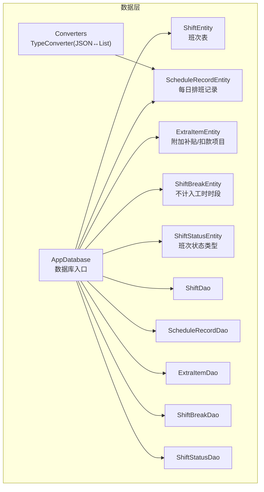
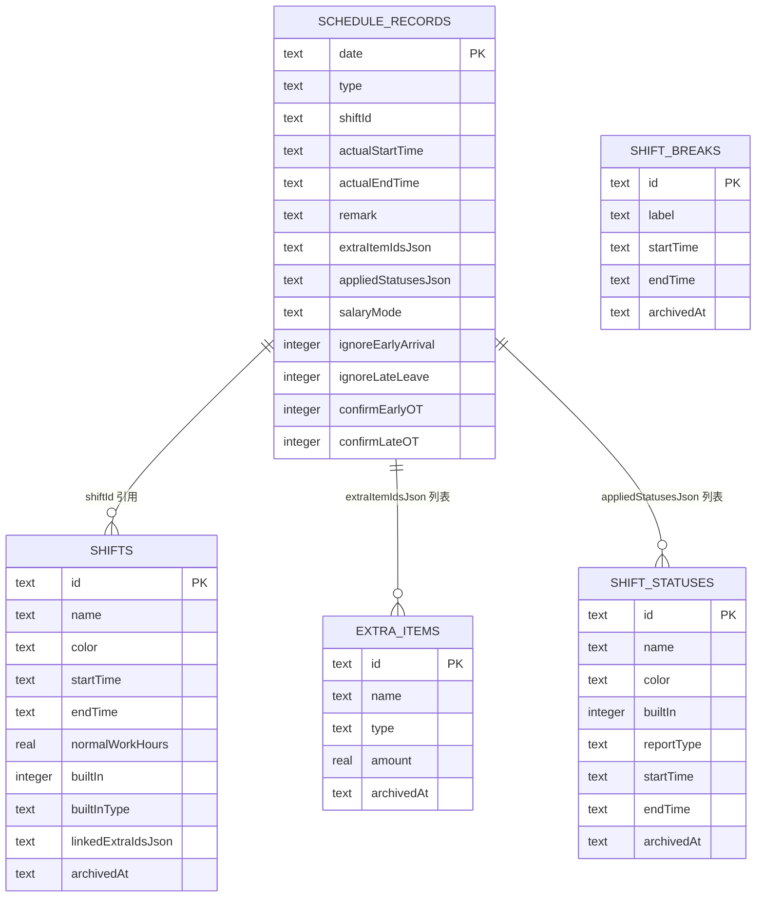
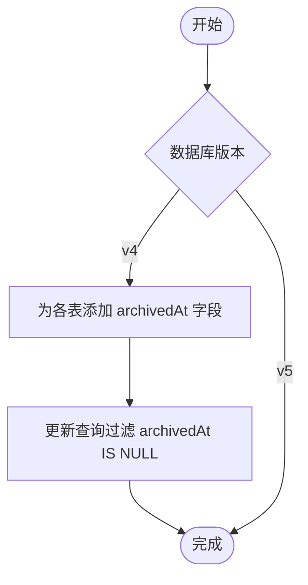

# 数据库实体类设计

<cite>
**本文引用的文件**
- [AppDatabase.kt](file://app/src/main/java/com/schedulecalendar/app/data/db/AppDatabase.kt)
- [Converters.kt](file://app/src/main/java/com/schedulecalendar/app/data/db/Converters.kt)
- [ExtraItemEntity.kt](file://app/src/main/java/com/schedulecalendar/app/data/db/entity/ExtraItemEntity.kt)
- [ScheduleRecordEntity.kt](file://app/src/main/java/com/schedulecalendar/app/data/db/entity/ScheduleRecordEntity.kt)
- [ShiftBreakEntity.kt](file://app/src/main/java/com/schedulecalendar/app/data/db/entity/ShiftBreakEntity.kt)
- [ShiftEntity.kt](file://app/src/main/java/com/schedulecalendar/app/data/db/entity/ShiftEntity.kt)
- [ShiftStatusEntity.kt](file://app/src/main/java/com/schedulecalendar/app/data/db/entity/ShiftStatusEntity.kt)
- [ExtraItemDao.kt](file://app/src/main/java/com/schedulecalendar/app/data/db/dao/ExtraItemDao.kt)
- [ScheduleRecordDao.kt](file://app/src/main/java/com/schedulecalendar/app/data/db/dao/ScheduleRecordDao.kt)
- [ShiftBreakDao.kt](file://app/src/main/java/com/schedulecalendar/app/data/db/dao/ShiftBreakDao.kt)
- [ShiftDao.kt](file://app/src/main/java/com/schedulecalendar/app/data/db/dao/ShiftDao.kt)
- [ShiftStatusDao.kt](file://app/src/main/java/com/schedulecalendar/app/data/db/dao/ShiftStatusDao.kt)
- [5.json](file://app/schemas/com.schedulecalendar.app.data.db.AppDatabase/5.json)
- [4.json](file://app/schemas/com.schedulecalendar.app.data.db.AppDatabase/4.json)
</cite>

## 目录
1. [简介](#简介)
2. [项目结构](#项目结构)
3. [核心组件](#核心组件)
4. [架构总览](#架构总览)
5. [详细组件分析](#详细组件分析)
6. [依赖关系分析](#依赖关系分析)
7. [性能与索引优化](#性能与索引优化)
8. [使用示例与常见操作模式](#使用示例与常见操作模式)
9. [故障排查指南](#故障排查指南)
10. [结论](#结论)

## 简介
本文件围绕 Room 数据库实体类设计与使用进行系统化说明，覆盖所有实体的定义、注解配置、字段语义、约束条件与关联关系。同时给出最佳实践（命名规范、索引策略、查询性能）、典型使用模式与常见问题排查建议，帮助开发者在排班与薪资计算场景中高效、稳定地持久化数据。

## 项目结构
本项目采用分层组织：
- 数据层：Room 数据库定义、实体类、DAO 接口、类型转换器
- 业务层：Repository 与 Mappers（不在本文重点）
- UI 层：Compose 界面与 ViewModel（不在本文重点）

图表来源
- [AppDatabase.kt:17-34](file://app/src/main/java/com/schedulecalendar/app/data/db/AppDatabase.kt#L17-L34)
- [Converters.kt:9-16](file://app/src/main/java/com/schedulecalendar/app/data/db/Converters.kt#L9-L16)

章节来源
- [AppDatabase.kt:1-35](file://app/src/main/java/com/schedulecalendar/app/data/db/AppDatabase.kt#L1-L35)

## 核心组件
- AppDatabase：声明数据库版本、导出 schema、注册实体与 DAO
- Converters：将复杂对象序列化为 JSON 字符串以适配 Room 的 TEXT 列
- 实体类：ShiftEntity、ScheduleRecordEntity、ExtraItemEntity、ShiftBreakEntity、ShiftStatusEntity
- DAO 接口：提供 Flow、suspend 函数等异步访问能力

章节来源
- [AppDatabase.kt:17-34](file://app/src/main/java/com/schedulecalendar/app/data/db/AppDatabase.kt#L17-L34)
- [Converters.kt:9-16](file://app/src/main/java/com/schedulecalendar/app/data/db/Converters.kt#L9-L16)

## 架构总览
下图展示数据库、实体与 DAO 的整体关系。当前实现未使用 @ForeignKey 外键约束，而是通过逻辑引用（如 shiftId、extraItemIdsJson、appliedStatusesJson）与上层业务保证一致性。

图表来源
- [5.json:8-300](file://app/schemas/com.schedulecalendar.app.data.db.AppDatabase/5.json#L8-L300)

## 详细组件分析

### 数据库入口 AppDatabase
- 作用：集中声明实体集合、数据库版本、schema 导出开关，并提供 DAO 获取方法
- 关键点：
  - entities 数组包含全部实体类
  - version=5，配合 app/schemas 下的迁移文件追踪变更
  - exportSchema=true 便于生成并校验 schema

章节来源
- [AppDatabase.kt:17-34](file://app/src/main/java/com/schedulecalendar/app/data/db/AppDatabase.kt#L17-L34)

### 类型转换器 Converters
- 作用：将 List<String> 与 JSON 字符串互转，用于存储多值字段（如 extraItemIdsJson、appliedStatusesJson）
- 关键点：
  - 使用 Gson 序列化/反序列化
  - 空值安全处理，避免 null 导致异常

章节来源
- [Converters.kt:9-16](file://app/src/main/java/com/schedulecalendar/app/data/db/Converters.kt#L9-L16)

### 实体：ShiftEntity（班次表）
- 表名：shifts
- 主键：id（TEXT，非空）
- 字段语义：
  - name/color：名称与颜色
  - startTime/endTime：起止时间（HH:mm）
  - normalWorkHours：正常班时长（小时），null 表示不限制加班分界
  - builtIn/builtInType：是否内置及内置类型（rest/swap/leave）
  - linkedExtraIdsJson：JSON 数组，关联的补贴/扣款 ID 列表
  - archivedAt：归档时间戳，null=有效，非空=已归档
- 约束与关系：
  - 无外键约束；通过 linkedExtraIdsJson 与 ExtraItemEntity 建立逻辑关联
  - 逻辑删除通过 archivedAt 控制

章节来源
- [ShiftEntity.kt:8-23](file://app/src/main/java/com/schedulecalendar/app/data/db/entity/ShiftEntity.kt#L8-L23)
- [5.json:8-75](file://app/schemas/com.schedulecalendar.app.data.db.AppDatabase/5.json#L8-L75)

### 实体：ScheduleRecordEntity（每日排班记录）
- 表名：schedule_records
- 主键：date（TEXT，yyyy-MM-dd）
- 字段语义：
  - type：排班类型（如 SHIFT）
  - shiftId：关联班次 ID（可为空）
  - actualStartTime/actualEndTime：实际上下班时间（HH:mm）
  - remark：备注
  - extraItemIdsJson：JSON 数组，记录当日关联的补贴/扣款 ID 列表
  - appliedStatusesJson：JSON 数组，记录应用的状态信息（含 statusId 与可选起止时间）
  - salaryMode：薪资模式（枚举名或 null）
  - ignoreEarlyArrival/ignoreLateLeave：忽略早到/晚离标志
  - confirmEarlyOT/confirmLateOT：确认早/晚加班标志
- 约束与关系：
  - 无外键约束；通过 shiftId、extraItemIdsJson、appliedStatusesJson 与其余实体建立逻辑关联
  - 日期作为主键，天然具备唯一性

章节来源
- [ScheduleRecordEntity.kt:8-25](file://app/src/main/java/com/schedulecalendar/app/data/db/entity/ScheduleRecordEntity.kt#L8-L25)
- [5.json:76-160](file://app/schemas/com.schedulecalendar.app.data.db.AppDatabase/5.json#L76-L160)

### 实体：ExtraItemEntity（附加补贴/扣款项目）
- 表名：extra_items
- 主键：id（TEXT，非空）
- 字段语义：
  - name：项目名称
  - type：类型（allowance/deduction）
  - amount：金额（REAL）
  - archivedAt：归档时间戳，null=有效，非空=已归档
- 约束与关系：
  - 无外键约束；被 ScheduleRecordEntity 通过 extraItemIdsJson 引用

章节来源
- [ExtraItemEntity.kt:8-15](file://app/src/main/java/com/schedulecalendar/app/data/db/entity/ExtraItemEntity.kt#L8-L15)
- [5.json:162-201](file://app/schemas/com.schedulecalendar.app.data.db.AppDatabase/5.json#L162-L201)

### 实体：ShiftBreakEntity（不计入工时时段）
- 表名：shift_breaks
- 主键：id（TEXT，非空）
- 字段语义：
  - label：标签（如午休、用餐）
  - startTime/endTime：时段起止（HH:mm）
  - archivedAt：归档时间戳，null=有效，非空=已归档
- 约束与关系：
  - 无外键约束；通常作为全局配置参与工时计算

章节来源
- [ShiftBreakEntity.kt:8-15](file://app/src/main/java/com/schedulecalendar/app/data/db/entity/ShiftBreakEntity.kt#L8-L15)
- [5.json:203-242](file://app/schemas/com.schedulecalendar.app.data.db.AppDatabase/5.json#L203-L242)

### 实体：ShiftStatusEntity（班次状态类型）
- 表名：shift_statuses
- 主键：id（TEXT，非空）
- 字段语义：
  - name/color：名称与颜色
  - builtIn：是否内置
  - reportType：上报类型（leave/swap/null）
  - startTime/endTime：默认起止时间（HH:mm）
  - archivedAt：归档时间戳，null=有效，非空=已归档
- 约束与关系：
  - 无外键约束；被 ScheduleRecordEntity 通过 appliedStatusesJson 引用

章节来源
- [ShiftStatusEntity.kt:8-18](file://app/src/main/java/com/schedulecalendar/app/data/db/entity/ShiftStatusEntity.kt#L8-L18)
- [5.json:244-300](file://app/schemas/com.schedulecalendar.app.data.db.AppDatabase/5.json#L244-L300)

### DAO 接口概览
- ShiftDao：查询有效/全部班次、upsert、归档、删除
- ScheduleRecordDao：按月份/范围查询、按日期增删改查、批量 upsert
- ExtraItemDao：查询有效/全部项目、upsert、归档、删除
- ShiftBreakDao：查询有效/全部时段、upsert、归档、删除
- ShiftStatusDao：查询有效/全部状态、upsert、归档、删除

章节来源
- [ShiftDao.kt:10-41](file://app/src/main/java/com/schedulecalendar/app/data/db/dao/ShiftDao.kt#L10-L41)
- [ScheduleRecordDao.kt:9-39](file://app/src/main/java/com/schedulecalendar/app/data/db/dao/ScheduleRecordDao.kt#L9-L39)
- [ExtraItemDao.kt:10-40](file://app/src/main/java/com/schedulecalendar/app/data/db/dao/ExtraItemDao.kt#L10-L40)
- [ShiftBreakDao.kt:10-38](file://app/src/main/java/com/schedulecalendar/app/data/db/dao/ShiftBreakDao.kt#L10-L38)
- [ShiftStatusDao.kt:10-38](file://app/src/main/java/com/schedulecalendar/app/data/db/dao/ShiftStatusDao.kt#L10-L38)

## 依赖关系分析
- 实体间为“逻辑引用”而非“物理外键”：
  - ScheduleRecordEntity.shiftId → ShiftEntity.id
  - ScheduleRecordEntity.extraItemIdsJson → ExtraItemEntity.id[]
  - ScheduleRecordEntity.appliedStatusesJson → ShiftStatusEntity.id[]
- 优势：简化迁移与跨表更新复杂度；劣势：需由上层业务保证一致性
- 版本演进：
  - v4→v5 主要变化：为 shifts/schedule_records/extra_items/shift_breaks/shift_statuses 统一引入 archivedAt 字段，支持逻辑删除

图表来源
- [4.json:8-292](file://app/schemas/com.schedulecalendar.app.data.db.AppDatabase/4.json#L8-L292)
- [5.json:8-300](file://app/schemas/com.schedulecalendar.app.data.db.AppDatabase/5.json#L8-L300)

章节来源
- [4.json:8-292](file://app/schemas/com.schedulecalendar.app.data.db.AppDatabase/4.json#L8-L292)
- [5.json:8-300](file://app/schemas/com.schedulecalendar.app.data.db.AppDatabase/5.json#L8-L300)

## 性能与索引优化
- 主键选择：
  - schedule_records.date 作为主键，天然适合按日查询与去重
- 查询模式与潜在索引：
  - 按月查询：WHERE date LIKE :yearMonth||'%' ORDER BY date ASC
    - 若数据量大，可考虑对 date 建前缀索引或使用生成列/虚拟列加速前缀匹配
  - 按范围查询：WHERE date BETWEEN :from AND :to
    - 已有主键索引，性能良好
  - 按名称排序：shifts.name、extra_items.name、shift_statuses.name
    - 可在 name 上建立索引以提升排序与筛选性能
  - 按时间排序：shift_breaks.startTime
    - 可在 startTime 上建立索引
- 逻辑删除：
  - 通过 archivedAt 过滤，建议在常用查询中保持 archivedAt IS NULL 条件，必要时可建立复合索引（如 (archivedAt, name)）
- JSON 字段：
  - extraItemIdsJson/appliedStatusesJson 为文本存储，无法直接利用 SQL 索引；如需高频查找某 ID 是否存在，建议在上层缓存或额外映射表

[本节为通用指导，不直接分析具体文件]

## 使用示例与常见操作模式
- 插入/更新（upsert）：
  - 使用 DAO 的 upsert/upsertAll，基于主键冲突策略 REPLACE 实现幂等写入
- 查询活跃数据：
  - observeActive() 返回 Flow<List<T>>，自动过滤 archivedAt IS NULL
- 归档（逻辑删除）：
  - archiveById(id, timestamp) 设置 archivedAt，保留历史数据
- 批量操作：
  - 批量 upsertAll 减少往返开销
- 按时间维度查询：
  - getByMonth/getByRange/observeByMonth/observeByRange 用于排班记录的月度与区间查询

章节来源
- [ShiftDao.kt:23-31](file://app/src/main/java/com/schedulecalendar/app/data/db/dao/ShiftDao.kt#L23-L31)
- [ExtraItemDao.kt:25-33](file://app/src/main/java/com/schedulecalendar/app/data/db/dao/ExtraItemDao.kt#L25-L33)
- [ShiftBreakDao.kt:23-31](file://app/src/main/java/com/schedulecalendar/app/data/db/dao/ShiftBreakDao.kt#L23-L31)
- [ShiftStatusDao.kt:20-28](file://app/src/main/java/com/schedulecalendar/app/data/db/dao/ShiftStatusDao.kt#L20-L28)
- [ScheduleRecordDao.kt:10-32](file://app/src/main/java/com/schedulecalendar/app/data/db/dao/ScheduleRecordDao.kt#L10-L32)

## 故障排查指南
- 类型转换异常：
  - 检查 Converters 是否正确注册并在需要处生效；确保 JSON 格式与 TypeToken 一致
- 查询结果为空：
  - 确认 archivedAt 是否为 null；检查 LIKE 前缀拼接是否正确
- 数据不一致：
  - 由于未使用外键约束，需在上层保证 shiftId、extraItemIdsJson、appliedStatusesJson 的有效性
- 迁移失败：
  - 核对 app/schemas 下 JSON 与实际实体字段一致性；确保新增字段有默认值或允许为空

章节来源
- [Converters.kt:9-16](file://app/src/main/java/com/schedulecalendar/app/data/db/Converters.kt#L9-L16)
- [ScheduleRecordDao.kt:10-14](file://app/src/main/java/com/schedulecalendar/app/data/db/dao/ScheduleRecordDao.kt#L10-L14)
- [5.json:8-300](file://app/schemas/com.schedulecalendar.app.data.db.AppDatabase/5.json#L8-L300)

## 结论
本项目采用简洁清晰的 Room 实体设计，通过逻辑引用与 JSON 字段灵活表达多对多关系，结合 archivedAt 实现逻辑删除与版本演进。建议在大数据量场景下按需增加索引，并在上层严格维护引用完整性，以获得更好的性能与可维护性。