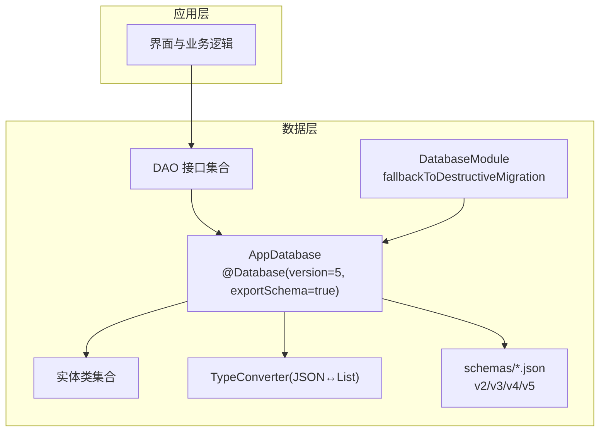
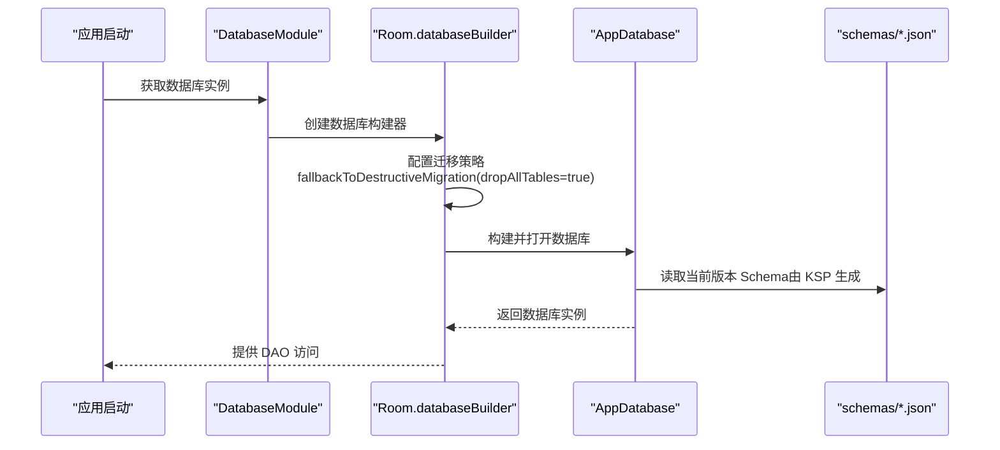
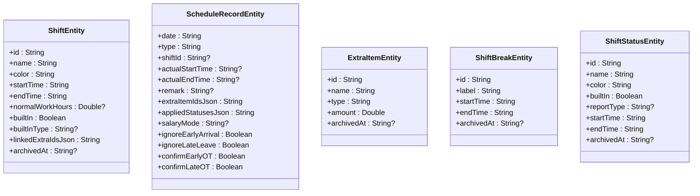
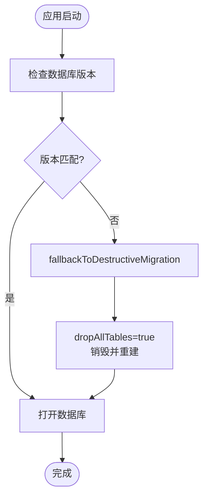
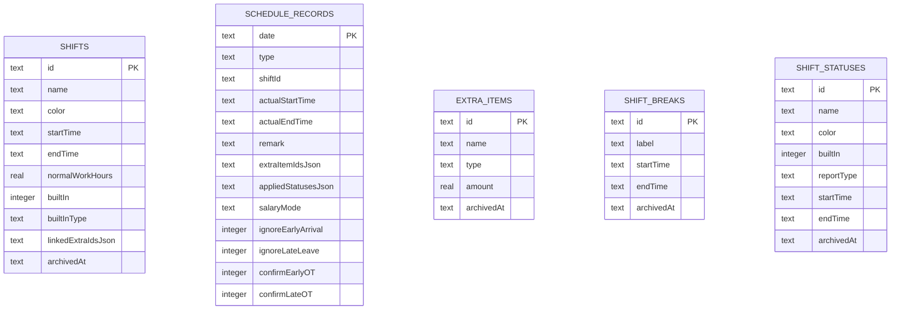
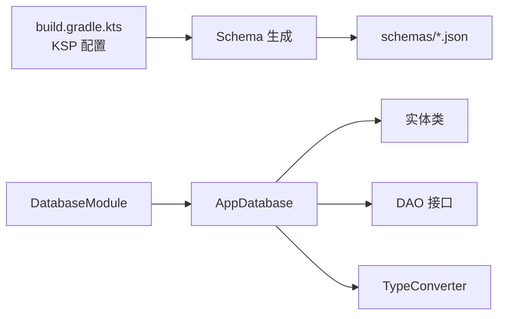

# 数据库迁移策略

<cite>
**本文引用的文件**   
- [AppDatabase.kt](file://app/src/main/java/com/schedulecalendar/app/data/db/AppDatabase.kt)
- [DatabaseModule.kt](file://app/src/main/java/com/schedulecalendar/app/di/DatabaseModule.kt)
- [build.gradle.kts](file://app/build.gradle.kts)
- [2.json](file://app/schemas/com.schedulecalendar.app.data.db.AppDatabase/2.json)
- [3.json](file://app/schemas/com.schedulecalendar.app.data.db.AppDatabase/3.json)
- [4.json](file://app/schemas/com.schedulecalendar.app.data.db.AppDatabase/4.json)
- [5.json](file://app/schemas/com.schedulecalendar.app.data.db.AppDatabase/5.json)
- [ShiftEntity.kt](file://app/src/main/java/com/schedulecalendar/app/data/db/entity/ShiftEntity.kt)
- [ScheduleRecordEntity.kt](file://app/src/main/java/com/schedulecalendar/app/data/db/entity/ScheduleRecordEntity.kt)
- [ExtraItemEntity.kt](file://app/src/main/java/com/schedulecalendar/app/data/db/entity/ExtraItemEntity.kt)
- [ShiftBreakEntity.kt](file://app/src/main/java/com/schedulecalendar/app/data/db/entity/ShiftBreakEntity.kt)
- [ShiftStatusEntity.kt](file://app/src/main/java/com/schedulecalendar/app/data/db/entity/ShiftStatusEntity.kt)
- [ShiftDao.kt](file://app/src/main/java/com/schedulecalendar/app/data/db/dao/ShiftDao.kt)
- [Converters.kt](file://app/src/main/java/com/schedulecalendar/app/data/db/Converters.kt)
</cite>

## 目录
1. [简介](#简介)
2. [项目结构](#项目结构)
3. [核心组件](#核心组件)
4. [架构总览](#架构总览)
5. [详细组件分析](#详细组件分析)
6. [依赖关系分析](#依赖关系分析)
7. [性能考虑](#性能考虑)
8. [故障排查指南](#故障排查指南)
9. [结论](#结论)
10. [附录](#附录)

## 简介
本文件围绕 Room 数据库的版本管理与 Schema 导出机制，系统阐述本项目的数据库迁移策略。重点包括：
- Room 的 @Database 注解与版本控制、Schema 导出配置
- 实体类演进与 JSON 字段类型转换
- 迁移失败时的破坏性回退策略
- 表结构变更（新增列、归档字段）对数据完整性的影响
- 向前兼容与向后兼容的设计考量
- Schema 文件的版本管理与冲突解决建议
- 最佳实践与故障恢复流程

## 项目结构
本项目采用“按功能域组织”的结构，数据库相关代码集中在 data/db 包下，包含：
- AppDatabase：Room 数据库入口，声明实体、版本与 Schema 导出
- entity：数据模型（对应 SQLite 表）
- dao：数据访问接口
- Converters：复杂类型到字符串的序列化/反序列化
- di：依赖注入模块（含数据库构建与迁移策略）
- schemas：Room 自动导出的各版本 Schema 文件（JSON），用于追踪 schema 演进

图表来源
- [AppDatabase.kt:17-27](file://app/src/main/java/com/schedulecalendar/app/data/db/AppDatabase.kt#L17-L27)
- [build.gradle.kts:53-57](file://app/build.gradle.kts#L53-L57)
- [DatabaseModule.kt:26](file://app/src/main/java/com/schedulecalendar/app/di/DatabaseModule.kt#L26)

章节来源
- [AppDatabase.kt:1-35](file://app/src/main/java/com/schedulecalendar/app/data/db/AppDatabase.kt#L1-L35)
- [build.gradle.kts:53-57](file://app/build.gradle.kts#L53-L57)

## 核心组件
- AppDatabase：定义数据库版本为 5，启用 Schema 导出；声明所有实体与 DAO 提供方法
- Entity：ShiftEntity、ScheduleRecordEntity、ExtraItemEntity、ShiftBreakEntity、ShiftStatusEntity，体现表结构与字段演进（如 archivedAt 归档字段）
- DAO：以 ShiftDao 为例，展示基于 SQL 的查询与更新，支持逻辑删除（归档）
- Converters：使用 Gson 将 List<String> 等复杂类型序列化为 TEXT 存储
- DatabaseModule：通过 fallbackToDestructiveMigration 处理无法自动迁移的场景（破坏性迁移）
- schemas/*.json：记录每个版本的完整 Schema，便于对比差异与审计

章节来源
- [AppDatabase.kt:17-34](file://app/src/main/java/com/schedulecalendar/app/data/db/AppDatabase.kt#L17-L34)
- [ShiftEntity.kt:8-23](file://app/src/main/java/com/schedulecalendar/app/data/db/entity/ShiftEntity.kt#L8-L23)
- [ScheduleRecordEntity.kt:8-25](file://app/src/main/java/com/schedulecalendar/app/data/db/entity/ScheduleRecordEntity.kt#L8-L25)
- [ExtraItemEntity.kt:8-15](file://app/src/main/java/com/schedulecalendar/app/data/db/entity/ExtraItemEntity.kt#L8-L15)
- [ShiftBreakEntity.kt:8-15](file://app/src/main/java/com/schedulecalendar/app/data/db/entity/ShiftBreakEntity.kt#L8-L15)
- [ShiftStatusEntity.kt:8-18](file://app/src/main/java/com/schedulecalendar/app/data/db/entity/ShiftStatusEntity.kt#L8-L18)
- [ShiftDao.kt:10-41](file://app/src/main/java/com/schedulecalendar/app/data/db/dao/ShiftDao.kt#L10-L41)
- [Converters.kt:9-16](file://app/src/main/java/com/schedulecalendar/app/data/db/Converters.kt#L9-L16)
- [DatabaseModule.kt:26](file://app/src/main/java/com/schedulecalendar/app/di/DatabaseModule.kt#L26)

## 架构总览
下图展示了 Room 数据库在应用启动时的初始化与迁移决策流程，以及 Schema 导出与校验的作用。

图表来源
- [DatabaseModule.kt:26](file://app/src/main/java/com/schedulecalendar/app/di/DatabaseModule.kt#L26)
- [AppDatabase.kt:17-27](file://app/src/main/java/com/schedulecalendar/app/data/db/AppDatabase.kt#L17-L27)
- [build.gradle.kts:53-57](file://app/build.gradle.kts#L53-L57)

## 详细组件分析

### Room 数据库与 Schema 导出
- 版本管理：@Database(version = 5) 指定当前数据库版本
- Schema 导出：exportSchema = true 配合 KSP 参数 room.schemaLocation 将每个版本的 Schema 导出为 JSON，便于版本追踪与对比
- 实体注册：entities 列表声明所有参与建表的实体

章节来源
- [AppDatabase.kt:17-27](file://app/src/main/java/com/schedulecalendar/app/data/db/AppDatabase.kt#L17-L27)
- [build.gradle.kts:53-57](file://app/build.gradle.kts#L53-L57)

### 实体类与表结构演进
- ShiftEntity：引入 archivedAt 字段实现逻辑删除；builtInType 支持内置类型扩展
- ScheduleRecordEntity：完善排班记录字段，包含 JSON 数组与布尔开关
- ExtraItemEntity：增加 archivedAt 字段，支持补贴/扣款项归档
- ShiftBreakEntity：增加 archivedAt 字段，支持不计入时段归档
- ShiftStatusEntity：增加 startTime/endTime 与 archivedAt，支持状态的时间范围与归档

图表来源
- [ShiftEntity.kt:8-23](file://app/src/main/java/com/schedulecalendar/app/data/db/entity/ShiftEntity.kt#L8-L23)
- [ScheduleRecordEntity.kt:8-25](file://app/src/main/java/com/schedulecalendar/app/data/db/entity/ScheduleRecordEntity.kt#L8-L25)
- [ExtraItemEntity.kt:8-15](file://app/src/main/java/com/schedulecalendar/app/data/db/entity/ExtraItemEntity.kt#L8-L15)
- [ShiftBreakEntity.kt:8-15](file://app/src/main/java/com/schedulecalendar/app/data/db/entity/ShiftBreakEntity.kt#L8-L15)
- [ShiftStatusEntity.kt:8-18](file://app/src/main/java/com/schedulecalendar/app/data/db/entity/ShiftStatusEntity.kt#L8-L18)

### DAO 与数据完整性
- ShiftDao 提供 observeActive() 仅返回未归档数据，确保业务层默认只操作有效记录
- archiveById() 实现逻辑删除，避免直接物理删除导致的数据丢失风险
- upsert/upsertAll 使用 REPLACE 策略，保证幂等写入

章节来源
- [ShiftDao.kt:10-41](file://app/src/main/java/com/schedulecalendar/app/data/db/dao/ShiftDao.kt#L10-L41)

### 类型转换器（JSON 字段）
- Converters 使用 Gson 将 List<String> 等复杂对象序列化为 TEXT，适配 Room 的简单类型限制
- 注意：当 JSON 结构变化时，需确保反序列化兼容（例如新增字段保持默认值）

章节来源
- [Converters.kt:9-16](file://app/src/main/java/com/schedulecalendar/app/data/db/Converters.kt#L9-L16)

### 迁移策略与版本升级
- 当前策略：fallbackToDestructiveMigration(dropAllTables = true)，当检测到版本不匹配且无可用 Migration 时，执行破坏性迁移（清空重建）
- 适用场景：开发阶段或可接受数据丢失的场景；生产环境应谨慎使用
- 推荐改进：为关键版本间添加显式 Migration，实现无损升级（如新增列、重命名列、索引优化）

图表来源
- [DatabaseModule.kt:26](file://app/src/main/java/com/schedulecalendar/app/di/DatabaseModule.kt#L26)

章节来源
- [DatabaseModule.kt:26](file://app/src/main/java/com/schedulecalendar/app/di/DatabaseModule.kt#L26)

### Schema 文件版本管理与差异
- v2→v3：shift_statuses 表新增 startTime/endTime 字段
- v3→v4：extra_items 表新增 archivedAt 字段
- v4→v5：shifts、shift_breaks、shift_statuses 均新增 archivedAt 字段

图表来源
- [2.json:1-275](file://app/schemas/com.schedulecalendar.app.data.db.AppDatabase/2.json#L1-L275)
- [3.json:1-287](file://app/schemas/com.schedulecalendar.app.data.db.AppDatabase/3.json#L1-L287)
- [4.json:1-292](file://app/schemas/com.schedulecalendar.app.data.db.AppDatabase/4.json#L1-L292)
- [5.json:1-307](file://app/schemas/com.schedulecalendar.app.data.db.AppDatabase/5.json#L1-L307)

章节来源
- [2.json:1-275](file://app/schemas/com.schedulecalendar.app.data.db.AppDatabase/2.json#L1-L275)
- [3.json:1-287](file://app/schemas/com.schedulecalendar.app.data.db.AppDatabase/3.json#L1-L287)
- [4.json:1-292](file://app/schemas/com.schedulecalendar.app.data.db.AppDatabase/4.json#L1-L292)
- [5.json:1-307](file://app/schemas/com.schedulecalendar.app.data.db.AppDatabase/5.json#L1-L307)

## 依赖关系分析
- AppDatabase 依赖所有实体与 DAO，并通过 @Database 注解统一管理
- DatabaseModule 负责构建 Room 实例并设置迁移策略
- build.gradle.kts 中的 KSP 配置驱动 Schema 导出
- Converters 被 Room 编译期使用，将复杂类型映射为 TEXT

图表来源
- [build.gradle.kts:53-57](file://app/build.gradle.kts#L53-L57)
- [AppDatabase.kt:17-34](file://app/src/main/java/com/schedulecalendar/app/data/db/AppDatabase.kt#L17-L34)
- [DatabaseModule.kt:26](file://app/src/main/java/com/schedulecalendar/app/di/DatabaseModule.kt#L26)

章节来源
- [build.gradle.kts:53-57](file://app/build.gradle.kts#L53-L57)
- [AppDatabase.kt:17-34](file://app/src/main/java/com/schedulecalendar/app/data/db/AppDatabase.kt#L17-L34)
- [DatabaseModule.kt:26](file://app/src/main/java/com/schedulecalendar/app/di/DatabaseModule.kt#L26)

## 性能考虑
- 破坏性迁移会触发 dropAllTables，导致全量重建，可能引起冷启动延迟；建议在非关键路径或后台线程中执行
- 大量 JSON 字段读写会影响 I/O 性能，必要时可对常用字段建立索引
- 合理使用 Flow 观察器（如 observeActive）减少不必要的全量查询

[本节为通用指导，无需特定文件引用]

## 故障排查指南
- 常见错误：版本不匹配导致崩溃
  - 现象：应用启动时报错提示需要 Migration
  - 原因：当前数据库版本与代码定义的 version 不一致，且未提供相应 Migration
  - 解决：添加显式 Migration 或临时启用 fallbackToDestructiveMigration（需谨慎）
- 数据丢失风险：破坏性迁移会清空所有表
  - 预防：在生产环境禁用破坏性迁移，改为增量迁移
- JSON 解析异常：TypeConverter 反序列化失败
  - 排查：检查 JSON 格式是否与预期一致，确保新增字段有默认值或兼容处理

章节来源
- [DatabaseModule.kt:26](file://app/src/main/java/com/schedulecalendar/app/di/DatabaseModule.kt#L26)
- [Converters.kt:9-16](file://app/src/main/java/com/schedulecalendar/app/data/db/Converters.kt#L9-L16)

## 结论
本项目通过 Room 的 @Database 注解与 KSP 生成的 Schema 文件实现了清晰的版本管理与演进追踪。当前采用破坏性迁移作为兜底策略，适用于开发阶段或可接受数据丢失的场景。生产环境应逐步引入显式 Migration，实现无损升级，并结合逻辑删除（archivedAt）保障数据完整性。建议定期审查 Schema 差异，确保向前与向后兼容性，降低迁移风险。

[本节为总结性内容，无需特定文件引用]

## 附录
- 向前兼容性：新客户端能读取旧版本数据（通过默认值与兼容 JSON 结构）
- 向后兼容性：旧客户端能忽略新字段（SQLite 允许未知列）
- 冲突解决方案：
  - 列重命名：先新增列，迁移数据，再删除旧列
  - 索引变更：先删除旧索引，再创建新索引
  - 约束变更：谨慎评估，必要时重建表

[本节为概念性内容，无需特定文件引用]