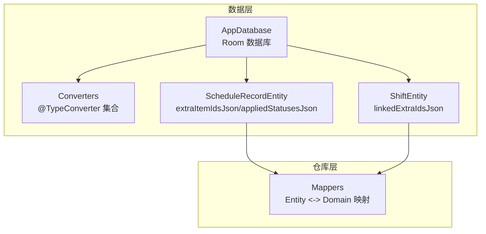
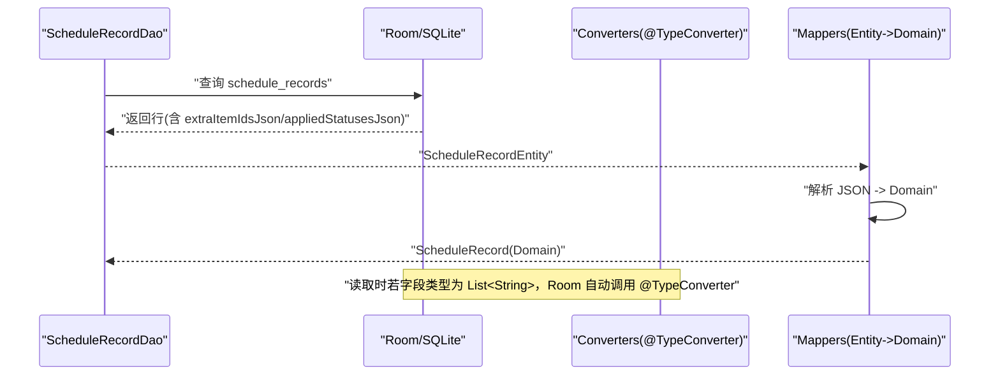
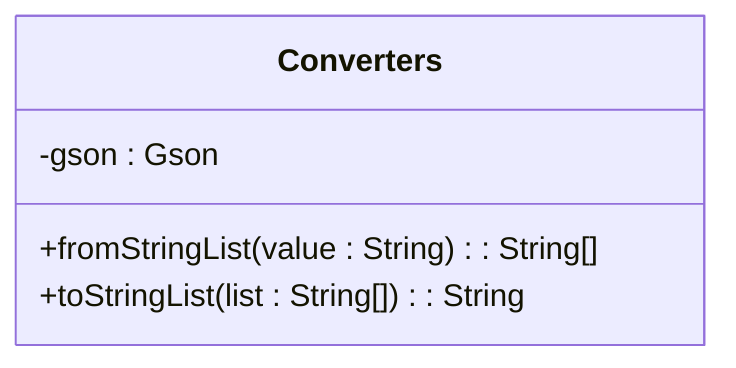
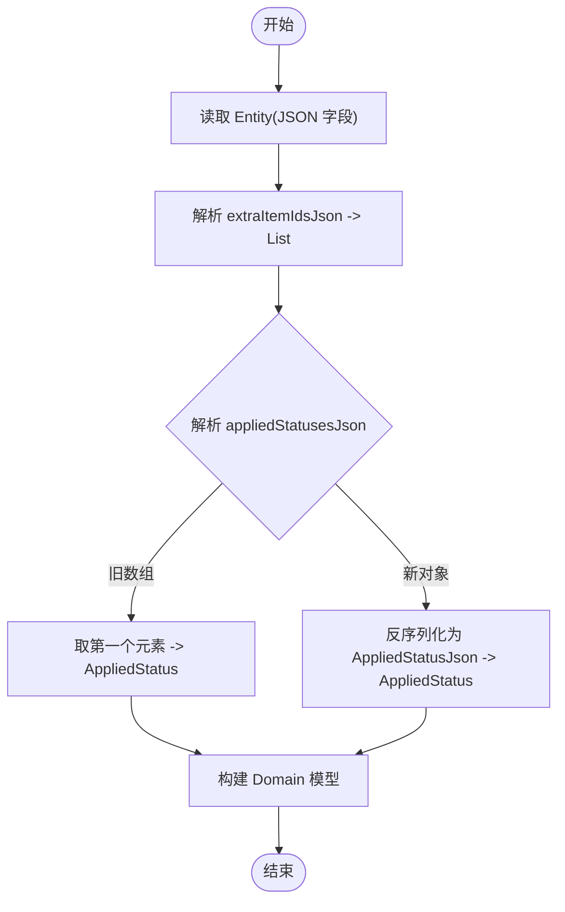
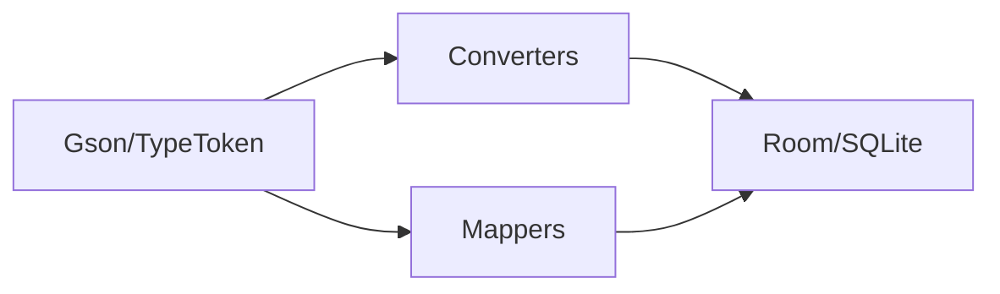

# 类型转换器

<cite>
**本文引用的文件**   
- [Converters.kt](file://app/src/main/java/com/schedulecalendar/app/data/db/Converters.kt)
- [AppDatabase.kt](file://app/src/main/java/com/schedulecalendar/app/data/db/AppDatabase.kt)
- [ScheduleRecordEntity.kt](file://app/src/main/java/com/schedulecalendar/app/data/db/entity/ScheduleRecordEntity.kt)
- [ShiftEntity.kt](file://app/src/main/java/com/schedulecalendar/app/data/db/entity/ShiftEntity.kt)
- [Mappers.kt](file://app/src/main/java/com/schedulecalendar/app/data/repository/Mappers.kt)
</cite>

## 目录
1. [简介](#简介)
2. [项目结构](#项目结构)
3. [核心组件](#核心组件)
4. [架构总览](#架构总览)
5. [详细组件分析](#详细组件分析)
6. [依赖关系分析](#依赖关系分析)
7. [性能考虑](#性能考虑)
8. [故障排查指南](#故障排查指南)
9. [结论](#结论)
10. [附录](#附录)

## 简介
本文件围绕 Room 的类型转换器（TypeConverter）在本项目中的使用与扩展进行系统化说明。重点包括：
- TypeConverter 注解的使用方式与自定义转换器的实现要点
- 将复杂数据类型（List、Map、自定义对象等）转换为 SQLite 支持的简单类型（如 TEXT）
- 日期时间类型的处理策略与时区、格式化的注意事项
- 类型转换器的注册机制与在 Room 中的生效方式
- 性能优化建议与常见问题解决方案

本项目当前已实现 List<String> 的 JSON 序列化/反序列化的 TypeConverter，并在实体字段中以 JSON 字符串形式持久化复杂数据；同时通过 Repository 层的映射函数完成 Entity 与 Domain 模型之间的双向转换。

## 项目结构
与类型转换器相关的代码主要分布在以下位置：
- 数据库定义与转换器：app/src/main/java/com/schedulecalendar/app/data/db
- 实体类定义：app/src/main/java/com/schedulecalendar/app/data/db/entity
- 领域模型与映射：app/src/main/java/com/schedulecalendar/app/data/repository

图表来源 
- [AppDatabase.kt:17-34](file://app/src/main/java/com/schedulecalendar/app/data/db/AppDatabase.kt#L17-L34)
- [Converters.kt:9-16](file://app/src/main/java/com/schedulecalendar/app/data/db/Converters.kt#L9-L16)
- [ScheduleRecordEntity.kt:17-19](file://app/src/main/java/com/schedulecalendar/app/data/db/entity/ScheduleRecordEntity.kt#L17-L19)
- [ShiftEntity.kt:20-22](file://app/src/main/java/com/schedulecalendar/app/data/db/entity/ShiftEntity.kt#L20-L22)

章节来源
- [AppDatabase.kt:17-34](file://app/src/main/java/com/schedulecalendar/app/data/db/AppDatabase.kt#L17-L34)
- [Converters.kt:9-16](file://app/src/main/java/com/schedulecalendar/app/data/db/Converters.kt#L9-L16)
- [ScheduleRecordEntity.kt:17-19](file://app/src/main/java/com/schedulecalendar/app/data/db/entity/ScheduleRecordEntity.kt#L17-L19)
- [ShiftEntity.kt:20-22](file://app/src/main/java/com/schedulecalendar/app/data/db/entity/ShiftEntity.kt#L20-L22)

## 核心组件
- Converters：提供 @TypeConverter 方法，用于 List<String> 与 JSON 字符串的双向转换。
- AppDatabase：声明数据库版本、导出 Schema 以及 DAO 接口；当前未显式指定 typeConverters，Room 会按包扫描发现 @TypeConverter 类。
- ScheduleRecordEntity：包含 extraItemIdsJson 与 appliedStatusesJson 两个 JSON 文本字段，分别存储 ID 列表与应用状态信息。
- ShiftEntity：包含 linkedExtraIdsJson 字段，存储关联的补贴/扣款 ID 列表。
- Mappers：在仓库层将 Entity 的 JSON 字段解析为 Domain 模型，或将 Domain 模型序列化为 JSON 字符串写入 Entity。

章节来源
- [Converters.kt:9-16](file://app/src/main/java/com/schedulecalendar/app/data/db/Converters.kt#L9-L16)
- [AppDatabase.kt:17-34](file://app/src/main/java/com/schedulecalendar/app/data/db/AppDatabase.kt#L17-L34)
- [ScheduleRecordEntity.kt:17-19](file://app/src/main/java/com/schedulecalendar/app/data/db/entity/ScheduleRecordEntity.kt#L17-L19)
- [ShiftEntity.kt:20-22](file://app/src/main/java/com/schedulecalendar/app/data/db/entity/ShiftEntity.kt#L20-L22)
- [Mappers.kt:19-48](file://app/src/main/java/com/schedulecalendar/app/data/repository/Mappers.kt#L19-L48)
- [Mappers.kt:92-128](file://app/src/main/java/com/schedulecalendar/app/data/repository/Mappers.kt#L92-L128)

## 架构总览
下图展示了从 DAO 读取数据到 Domain 模型的完整流程，以及写回时的反向流程。其中，JSON 字段的读写由 Room 自动调用 @TypeConverter 或手动在 Mapper 中处理。

图表来源 
- [ScheduleRecordDao.kt:10-17](file://app/src/main/java/com/schedulecalendar/app/data/db/dao/ScheduleRecordDao.kt#L10-L17)
- [Converters.kt:12-15](file://app/src/main/java/com/schedulecalendar/app/data/db/Converters.kt#L12-L15)
- [Mappers.kt:92-128](file://app/src/main/java/com/schedulecalendar/app/data/repository/Mappers.kt#L92-L128)

## 详细组件分析

### 类型转换器 Converters
- 作用：将 List<String> 与 JSON 字符串相互转换，以便 SQLite 以 TEXT 列存储复杂数据结构。
- 关键点：
  - 使用 Gson 进行序列化/反序列化
  - 使用 TypeToken 确保泛型类型正确解析
  - 反序列化失败时返回空集合，避免异常中断

图表来源 
- [Converters.kt:9-16](file://app/src/main/java/com/schedulecalendar/app/data/db/Converters.kt#L9-L16)

章节来源
- [Converters.kt:9-16](file://app/src/main/java/com/schedulecalendar/app/data/db/Converters.kt#L9-L16)

### 实体与 JSON 字段
- ScheduleRecordEntity：
  - extraItemIdsJson：存储附加项 ID 列表（JSON 数组）
  - appliedStatusesJson：存储应用状态（兼容旧版数组与新版单对象）
- ShiftEntity：
  - linkedExtraIdsJson：存储关联的补贴/扣款 ID 列表（JSON 数组）

这些字段均为 TEXT 类型，便于 Room 直接持久化，同时在读取/写入时通过 Converter 或 Mapper 进行转换。

章节来源
- [ScheduleRecordEntity.kt:17-19](file://app/src/main/java/com/schedulecalendar/app/data/db/entity/ScheduleRecordEntity.kt#L17-L19)
- [ShiftEntity.kt:20-22](file://app/src/main/java/com/schedulecalendar/app/data/db/entity/ShiftEntity.kt#L20-L22)

### 仓库层映射 Mappers
- ShiftEntity <-> Shift：
  - 将 linkedExtraIdsJson 解析为 List<String>，并写回时序列化为 JSON
- ScheduleRecordEntity <-> ScheduleRecord：
  - 解析 extraItemIdsJson 为 List<String>
  - 解析 appliedStatusesJson 为 AppliedStatus（兼容旧数组与新对象格式）
  - 将 Domain 模型写回 Entity 时序列化为 JSON

图表来源 
- [Mappers.kt:19-48](file://app/src/main/java/com/schedulecalendar/app/data/repository/Mappers.kt#L19-L48)
- [Mappers.kt:68-88](file://app/src/main/java/com/schedulecalendar/app/data/repository/Mappers.kt#L68-L88)
- [Mappers.kt:92-128](file://app/src/main/java/com/schedulecalendar/app/data/repository/Mappers.kt#L92-L128)

章节来源
- [Mappers.kt:19-48](file://app/src/main/java/com/schedulecalendar/app/data/repository/Mappers.kt#L19-L48)
- [Mappers.kt:68-88](file://app/src/main/java/com/schedulecalendar/app/data/repository/Mappers.kt#L68-L88)
- [Mappers.kt:92-128](file://app/src/main/java/com/schedulecalendar/app/data/repository/Mappers.kt#L92-L128)

### 类型转换器的注册机制
- 当前 AppDatabase 未显式指定 typeConverters，Room 会在编译期扫描同包下的 @TypeConverter 类并自动注册。
- 如需显式注册，可在 @Database 注解中添加 typeConverters = [Converters::class]。

章节来源
- [AppDatabase.kt:17-34](file://app/src/main/java/com/schedulecalendar/app/data/db/AppDatabase.kt#L17-L34)
- [Converters.kt:9-16](file://app/src/main/java/com/schedulecalendar/app/data/db/Converters.kt#L9-L16)

## 依赖关系分析
- Converters 依赖 Gson 与 TypeToken 进行 JSON 序列化/反序列化
- Mappers 同样依赖 Gson 与 TypeToken，负责 Entity 与 Domain 之间的转换
- Entity 字段以 JSON 文本形式存在，降低对 SQLite 原生类型的依赖

图表来源 
- [Converters.kt:4-6](file://app/src/main/java/com/schedulecalendar/app/data/db/Converters.kt#L4-L6)
- [Mappers.kt:4-5](file://app/src/main/java/com/schedulecalendar/app/data/repository/Mappers.kt#L4-L5)

章节来源
- [Converters.kt:4-6](file://app/src/main/java/com/schedulecalendar/app/data/db/Converters.kt#L4-L6)
- [Mappers.kt:4-5](file://app/src/main/java/com/schedulecalendar/app/data/repository/Mappers.kt#L4-L5)

## 性能考虑
- 序列化开销：频繁 JSON 序列化/反序列化会带来 CPU 与内存压力。建议在批量操作时复用 Gson 实例（当前 Converters 与 Mappers 均持有实例）。
- 大对象存储：JSON 字段过大可能导致 I/O 放大。应评估字段大小，必要时拆分表或使用 BLOB。
- 索引与查询：JSON 字段无法被 SQLite 有效索引。如需按内容过滤，应在应用层解析后过滤，或在数据库中增加冗余列。
- 并发与线程安全：Gson 是线程安全的，但 TypeToken 匿名类在每次调用时创建，可考虑缓存 Type 对象以减少分配。

[本节为通用指导，不直接分析具体文件]

## 故障排查指南
- 反序列化失败导致空结果：
  - 检查 JSON 格式是否符合预期（例如空串、null、空数组）
  - 在反序列化处添加默认值或空集合，避免崩溃
- 字段类型不匹配：
  - 确认 @TypeConverter 的参数与返回值类型与实体字段一致
  - 若实体字段为 JSON 字符串，则无需 @TypeConverter，直接在 Mapper 中处理
- 迁移问题：
  - 当 JSON 结构变化时，需在 Mapper 中兼容旧格式（如旧数组与新对象的并存）

章节来源
- [Mappers.kt:68-88](file://app/src/main/java/com/schedulecalendar/app/data/repository/Mappers.kt#L68-L88)
- [Converters.kt:12-15](file://app/src/main/java/com/schedulecalendar/app/data/db/Converters.kt#L12-L15)

## 结论
本项目通过 @TypeConverter 与 Repository 层映射函数相结合的方式，实现了复杂数据类型与 SQLite 简单类型的无缝转换。对于 List、Map 与自定义对象，统一采用 JSON 文本作为持久化载体，既简化了数据库设计，又提升了灵活性。未来可扩展更多 TypeConverter，并结合性能优化与兼容性处理，保障系统的稳定性与可维护性。

[本节为总结性内容，不直接分析具体文件]

## 附录

### 常见场景与示例路径
- 将 List<String> 持久化为 JSON 字符串：
  - 参考：[Converters.kt:12-15](file://app/src/main/java/com/schedulecalendar/app/data/db/Converters.kt#L12-L15)
- 将 JSON 字符串解析为 List<String>：
  - 参考：[Converters.kt:12-13](file://app/src/main/java/com/schedulecalendar/app/data/db/Converters.kt#L12-L13)
- 将复杂对象（AppliedStatus）序列化为 JSON：
  - 参考：[Mappers.kt:86-88](file://app/src/main/java/com/schedulecalendar/app/data/repository/Mappers.kt#L86-L88)
- 兼容旧版数组格式与新对象格式的解析：
  - 参考：[Mappers.kt:68-84](file://app/src/main/java/com/schedulecalendar/app/data/repository/Mappers.kt#L68-L84)

### 日期时间类型处理建议
- 存储格式：建议使用 ISO-8601 字符串（如 yyyy-MM-dd HH:mm:ss）或 UTC 毫秒时间戳，便于跨时区一致性。
- 时区处理：在应用层统一转换为 UTC 存储，展示时再根据用户时区格式化。
- 格式转换：在 Mapper 或 UI 层进行格式化，避免在数据库层引入复杂性。

[本节为通用指导，不直接分析具体文件]