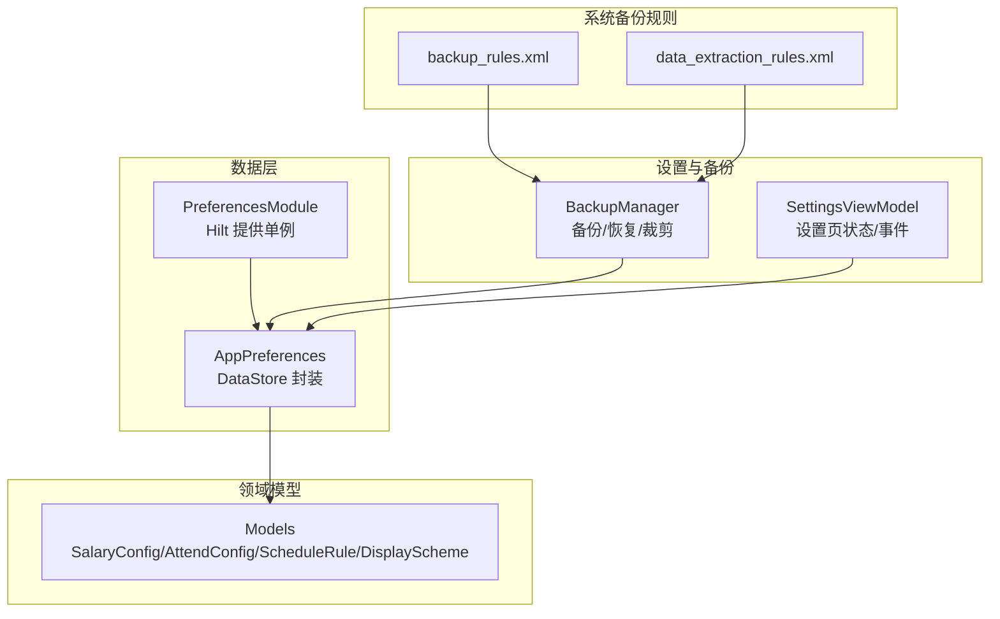
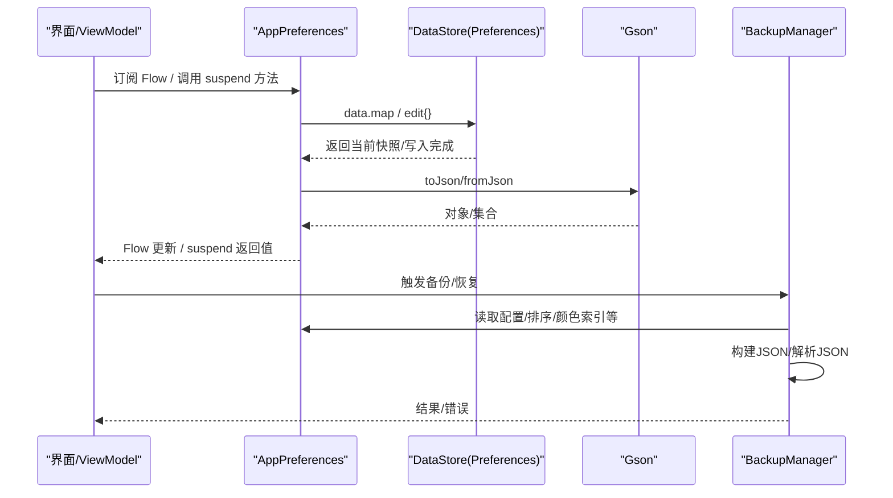
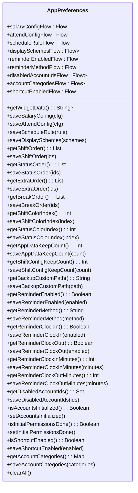
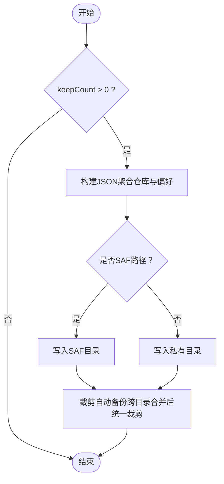
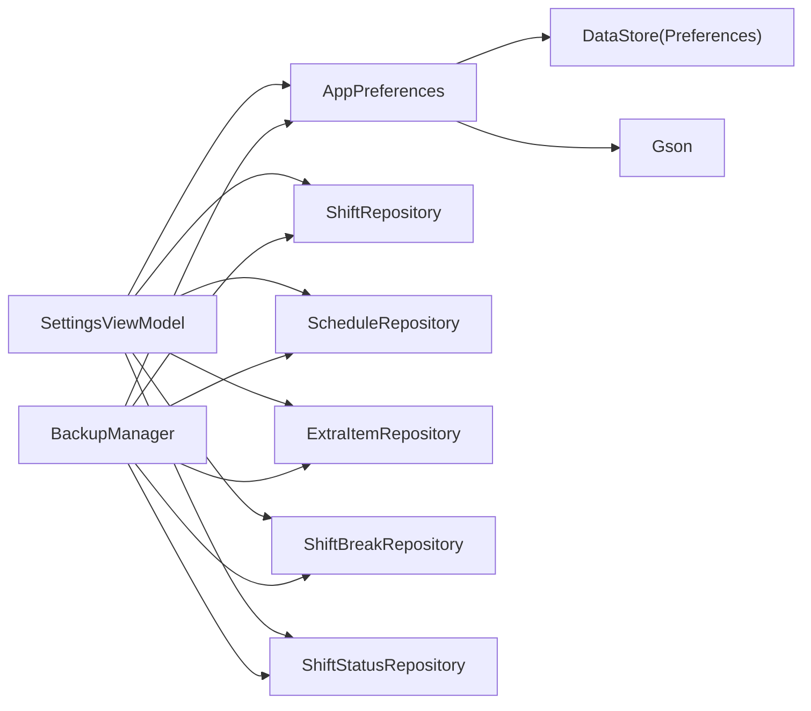

# 偏好设置存储

<cite>
**本文引用的文件**   
- [AppPreferences.kt](file://app/src/main/java/com/schedulecalendar/app/data/prefs/AppPreferences.kt)
- [PreferencesModule.kt](file://app/src/main/java/com/schedulecalendar/app/di/PreferencesModule.kt)
- [BackupManager.kt](file://app/src/main/java/com/schedulecalendar/app/ui/settings/BackupManager.kt)
- [Models.kt](file://app/src/main/java/com/schedulecalendar/app/domain/model/Models.kt)
- [SettingsViewModel.kt](file://app/src/main/java/com/schedulecalendar/app/ui/settings/SettingsViewModel.kt)
- [backup_rules.xml](file://app/src/main/res/xml/backup_rules.xml)
- [data_extraction_rules.xml](file://app/src/main/res/xml/data_extraction_rules.xml)
</cite>

## 目录
1. [简介](#简介)
2. [项目结构](#项目结构)
3. [核心组件](#核心组件)
4. [架构总览](#架构总览)
5. [详细组件分析](#详细组件分析)
6. [依赖关系分析](#依赖关系分析)
7. [性能考量](#性能考量)
8. [故障排查指南](#故障排查指南)
9. [结论](#结论)
10. [附录](#附录)

## 简介
本文件围绕应用中的偏好设置存储系统，系统性阐述 DataStore 在配置管理中的应用方式，包括数据类型支持、序列化机制与异步访问模式；解释 AppPreferences 类的配置项设计（用户偏好、应用设置、系统参数）；说明数据迁移策略、备份恢复机制与性能优化方案；并提供类型安全的配置访问方式、默认值处理、配置验证、错误处理与调试技巧。

## 项目结构
偏好设置相关代码主要分布在以下位置：
- 数据层：AppPreferences（DataStore 封装）、PreferencesModule（Hilt 注入）
- 领域模型：Models（薪资、考勤、排班规则、显示方案等）
- 设置与备份：BackupManager（备份/恢复/裁剪）、SettingsViewModel（设置页状态与事件）
- 系统备份规则：backup_rules.xml、data_extraction_rules.xml

图表来源
- [AppPreferences.kt:1-313](file://app/src/main/java/com/schedulecalendar/app/data/prefs/AppPreferences.kt#L1-L313)
- [PreferencesModule.kt:1-21](file://app/src/main/java/com/schedulecalendar/app/di/PreferencesModule.kt#L1-L21)
- [BackupManager.kt:1-579](file://app/src/main/java/com/schedulecalendar/app/ui/settings/BackupManager.kt#L1-L579)
- [Models.kt:1-278](file://app/src/main/java/com/schedulecalendar/app/domain/model/Models.kt#L1-L278)
- [SettingsViewModel.kt:1-91](file://app/src/main/java/com/schedulecalendar/app/ui/settings/SettingsViewModel.kt#L1-L91)
- [backup_rules.xml:1-7](file://app/src/main/res/xml/backup_rules.xml#L1-L7)
- [data_extraction_rules.xml:1-14](file://app/src/main/res/xml/data_extraction_rules.xml#L1-L14)

章节来源
- [AppPreferences.kt:1-313](file://app/src/main/java/com/schedulecalendar/app/data/prefs/AppPreferences.kt#L1-L313)
- [PreferencesModule.kt:1-21](file://app/src/main/java/com/schedulecalendar/app/di/PreferencesModule.kt#L1-L21)
- [BackupManager.kt:1-579](file://app/src/main/java/com/schedulecalendar/app/ui/settings/BackupManager.kt#L1-L579)
- [Models.kt:1-278](file://app/src/main/java/com/schedulecalendar/app/domain/model/Models.kt#L1-L278)
- [SettingsViewModel.kt:1-91](file://app/src/main/java/com/schedulecalendar/app/ui/settings/SettingsViewModel.kt#L1-L91)
- [backup_rules.xml:1-7](file://app/src/main/res/xml/backup_rules.xml#L1-L7)
- [data_extraction_rules.xml:1-14](file://app/src/main/res/xml/data_extraction_rules.xml#L1-L14)

## 核心组件
- AppPreferences：基于 DataStore Preferences 的键值与对象持久化封装，提供 Flow 与 suspend 函数两种访问模式，内置 Gson 序列化与默认值回退。
- PreferencesModule：通过 Hilt 提供 AppPreferences 单例，便于全局注入。
- BackupManager：负责应用数据与班次配置的自动/手动备份、恢复、列表合并与裁剪，读取/写入私有目录或 SAF 自定义路径。
- Models：定义薪资、考勤、排班规则、显示方案等数据结构，作为 DataStore 中复杂对象的载体。
- SettingsViewModel：聚合多个 Flow 构建 UI 状态，调用 AppPreferences 保存配置，并触发清空等操作。

章节来源
- [AppPreferences.kt:1-313](file://app/src/main/java/com/schedulecalendar/app/data/prefs/AppPreferences.kt#L1-L313)
- [PreferencesModule.kt:1-21](file://app/src/main/java/com/schedulecalendar/app/di/PreferencesModule.kt#L1-L21)
- [BackupManager.kt:1-579](file://app/src/main/java/com/schedulecalendar/app/ui/settings/BackupManager.kt#L1-L579)
- [Models.kt:1-278](file://app/src/main/java/com/schedulecalendar/app/domain/model/Models.kt#L1-L278)
- [SettingsViewModel.kt:1-91](file://app/src/main/java/com/schedulecalendar/app/ui/settings/SettingsViewModel.kt#L1-L91)

## 架构总览
偏好设置以 DataStore 为中心，上层通过 Flow 进行响应式订阅，或通过 suspend 函数进行一次性读写。备份模块从仓库与 AppPreferences 聚合数据生成 JSON 备份，支持私有目录与 SAF 外部路径，并在启动时按保留数量裁剪。

图表来源
- [AppPreferences.kt:1-313](file://app/src/main/java/com/schedulecalendar/app/data/prefs/AppPreferences.kt#L1-L313)
- [BackupManager.kt:1-579](file://app/src/main/java/com/schedulecalendar/app/ui/settings/BackupManager.kt#L1-L579)

## 详细组件分析

### AppPreferences：配置中心
- 数据类型支持
  - 基本类型：int、string（通过 intPreferencesKey/stringPreferencesKey）
  - 复杂对象：SalaryConfig、AttendConfig、ScheduleRule、DisplayScheme、Map/Set/List 等（通过 Gson 序列化）
- 序列化机制
  - 使用 GsonBuilder + InstanceCreator 确保反序列化时保留 Kotlin data class 默认值
  - 对 List/Map 使用 TypeToken 指定泛型类型，避免运行时类型擦除问题
- 异步访问模式
  - Flow 流式订阅：适用于需要实时响应的场景（如薪资/考勤/排班规则/显示方案/提醒开关/分类映射）
  - suspend 一次性读写：适用于单次获取/保存（如小组件数据、排序顺序、颜色索引、备份路径）
- 默认值处理
  - 缺失键时返回默认对象或空集合（如 DisplayScheme()、emptyList()/emptySet()/emptyMap()）
  - 布尔型字段采用字符串比较（"true"/"false"），兼容旧数据
- 关键 API 分组
  - 薪资/考勤/排班/显示方案：Flow + saveXxx
  - 小组件数据：getWidgetData/saveWidgetData（读取用 .first() 快照）
  - 排序顺序：shift/status/extra/break 的 ID 列表（逗号分隔）
  - 颜色索引：shift/status 预设颜色索引
  - 备份设置：保留份数、自定义路径
  - 提醒设置：启用/方式/内容/提前分钟
  - 账户管理：禁用ID集合、分类映射、初始化标记
  - 快捷方式开关、首次权限标记
  - 清理：clearAll()

图表来源
- [AppPreferences.kt:1-313](file://app/src/main/java/com/schedulecalendar/app/data/prefs/AppPreferences.kt#L1-L313)

章节来源
- [AppPreferences.kt:1-313](file://app/src/main/java/com/schedulecalendar/app/data/prefs/AppPreferences.kt#L1-L313)

### PreferencesModule：依赖注入
- 通过 Hilt 提供 AppPreferences 单例，使用 @ApplicationContext 注入 Context
- 保证全局唯一实例，避免重复创建 DataStore

章节来源
- [PreferencesModule.kt:1-21](file://app/src/main/java/com/schedulecalendar/app/di/PreferencesModule.kt#L1-L21)

### BackupManager：备份与恢复
- 备份策略
  - 应用数据：每天只保留最新一条自动备份；keepCount=0 禁用
  - 班次配置：每次修改生成新备份；keepCount=0 禁用
  - 自定义路径：支持 SAF content URI 与普通文件系统路径
- 恢复机制
  - 始终从私有目录恢复（filesDir/backups）
  - 支持导入外部 JSON，自动识别应用数据或班次配置格式
- 列表与裁剪
  - 合并私有目录与自定义路径的备份列表（去重）
  - 启动时执行全局裁剪，仅删除自动备份，保留手动备份
- 与 AppPreferences 集成
  - 导出/恢复时读取/写入薪资、考勤、排班规则、显示方案、排序顺序、颜色索引、提醒设置、账户分类与禁用ID、快捷方式开关等

图表来源
- [BackupManager.kt:183-227](file://app/src/main/java/com/schedulecalendar/app/ui/settings/BackupManager.kt#L183-L227)
- [BackupManager.kt:246-274](file://app/src/main/java/com/schedulecalendar/app/ui/settings/BackupManager.kt#L246-L274)
- [BackupManager.kt:518-545](file://app/src/main/java/com/schedulecalendar/app/ui/settings/BackupManager.kt#L518-L545)

章节来源
- [BackupManager.kt:1-579](file://app/src/main/java/com/schedulecalendar/app/ui/settings/BackupManager.kt#L1-L579)

### SettingsViewModel：设置页状态与事件
- 组合多个 Flow（薪资/考勤/排班/显示方案）构建统一 UI 状态
- 提供保存方法与清空操作，清空时同时清理数据库与 DataStore

章节来源
- [SettingsViewModel.kt:1-91](file://app/src/main/java/com/schedulecalendar/app/ui/settings/SettingsViewModel.kt#L1-L91)

### Models：领域模型
- SalaryConfig、AttendConfig、ScheduleRule、DisplayScheme 等作为 DataStore 中复杂对象的载体
- 内置常量与工具方法（如文本颜色计算）

章节来源
- [Models.kt:1-278](file://app/src/main/java/com/schedulecalendar/app/domain/model/Models.kt#L1-L278)

## 依赖关系分析
- AppPreferences 依赖 DataStore Preferences 与 Gson
- BackupManager 依赖多个 Repository 与 AppPreferences，用于聚合数据与恢复
- SettingsViewModel 依赖 AppPreferences 与各 Repository，用于状态同步与持久化
- 系统备份规则 XML 影响 Android 原生备份行为（包含 sharedpref、database、backups）

图表来源
- [SettingsViewModel.kt:1-91](file://app/src/main/java/com/schedulecalendar/app/ui/settings/SettingsViewModel.kt#L1-L91)
- [BackupManager.kt:1-579](file://app/src/main/java/com/schedulecalendar/app/ui/settings/BackupManager.kt#L1-L579)
- [AppPreferences.kt:1-313](file://app/src/main/java/com/schedulecalendar/app/data/prefs/AppPreferences.kt#L1-L313)

章节来源
- [SettingsViewModel.kt:1-91](file://app/src/main/java/com/schedulecalendar/app/ui/settings/SettingsViewModel.kt#L1-L91)
- [BackupManager.kt:1-579](file://app/src/main/java/com/schedulecalendar/app/ui/settings/BackupManager.kt#L1-L579)
- [AppPreferences.kt:1-313](file://app/src/main/java/com/schedulecalendar/app/data/prefs/AppPreferences.kt#L1-L313)

## 性能考量
- DataStore 访问
  - 优先使用 Flow 订阅减少重复 IO；一次性读取使用 .first() 快照（如 getWidgetData）
  - 写操作使用 edit{} 原子更新，避免并发冲突
- 序列化开销
  - 复杂对象使用 Gson 序列化，注意大对象频繁更新的成本；必要时拆分键或延迟序列化
- 备份裁剪
  - 启动时统一裁剪，避免多次扫描；仅删除自动备份，保护手动备份
- SAF 路径
  - 使用 DocumentsContract 批量查询减少 IPC 次数；避免 DocumentFile 的 N 次调用陷阱

[本节为通用指导，不直接分析具体文件]

## 故障排查指南
- 常见异常
  - JSON 解析失败：检查备份文件格式与版本字段；确认 Gson TypeToken 泛型正确
  - SAF 权限丢失：选择目录后需调用 persistUriPermission 持久化权限
  - 备份文件不存在：恢复前校验文件存在性，抛出明确异常信息
- 调试技巧
  - 打印 DataStore 键值：通过日志输出 key 与 value，确认默认值与覆盖逻辑
  - 备份文件校验：导出后打开 JSON 检查字段完整性与时间戳
  - Flow 订阅调试：在 ViewModel 中打印状态变化，定位更新时机
- 错误处理建议
  - 所有 IO 操作使用 runCatching 包裹，返回 Result 或抛出明确异常
  - 对用户可见的错误消息进行本地化与友好提示

章节来源
- [BackupManager.kt:108-117](file://app/src/main/java/com/schedulecalendar/app/ui/settings/BackupManager.kt#L108-L117)
- [BackupManager.kt:352-377](file://app/src/main/java/com/schedulecalendar/app/ui/settings/BackupManager.kt#L352-L377)
- [SettingsViewModel.kt:75-89](file://app/src/main/java/com/schedulecalendar/app/ui/settings/SettingsViewModel.kt#L75-L89)

## 结论
本项目的偏好设置存储以 DataStore 为核心，结合 Gson 实现类型安全的复杂对象持久化，并通过 Flow 与 suspend 函数提供灵活的异步访问模式。AppPreferences 统一管理用户偏好与应用设置，BackupManager 提供健壮的备份恢复与裁剪策略。整体架构清晰、扩展性强，适合持续迭代与多端数据一致性保障。

[本节为总结，不直接分析具体文件]

## 附录

### 数据类型与默认值速查
- 基本类型：int、string（键名见 AppPreferences companion object）
- 复杂对象：SalaryConfig、AttendConfig、ScheduleRule、DisplayScheme、Map/Set/List
- 默认值策略：缺失键返回默认对象或空集合；布尔型以字符串比较兼容旧数据

章节来源
- [AppPreferences.kt:37-66](file://app/src/main/java/com/schedulecalendar/app/data/prefs/AppPreferences.kt#L37-L66)
- [AppPreferences.kt:69-103](file://app/src/main/java/com/schedulecalendar/app/data/prefs/AppPreferences.kt#L69-L103)

### 备份与恢复要点
- 自动备份策略：应用数据每日最新一条；班次配置每次修改生成新备份
- 恢复来源：始终从私有目录 filesDir/backups 恢复
- 自定义路径：支持 SAF content URI 与普通路径，需持久化权限

章节来源
- [BackupManager.kt:183-227](file://app/src/main/java/com/schedulecalendar/app/ui/settings/BackupManager.kt#L183-L227)
- [BackupManager.kt:246-274](file://app/src/main/java/com/schedulecalendar/app/ui/settings/BackupManager.kt#L246-L274)
- [BackupManager.kt:352-377](file://app/src/main/java/com/schedulecalendar/app/ui/settings/BackupManager.kt#L352-L377)

### 系统备份规则
- full-backup-content 与 data-extraction-rules 均包含 sharedpref、database、backups 目录

章节来源
- [backup_rules.xml:1-7](file://app/src/main/res/xml/backup_rules.xml#L1-L7)
- [data_extraction_rules.xml:1-14](file://app/src/main/res/xml/data_extraction_rules.xml#L1-L14)