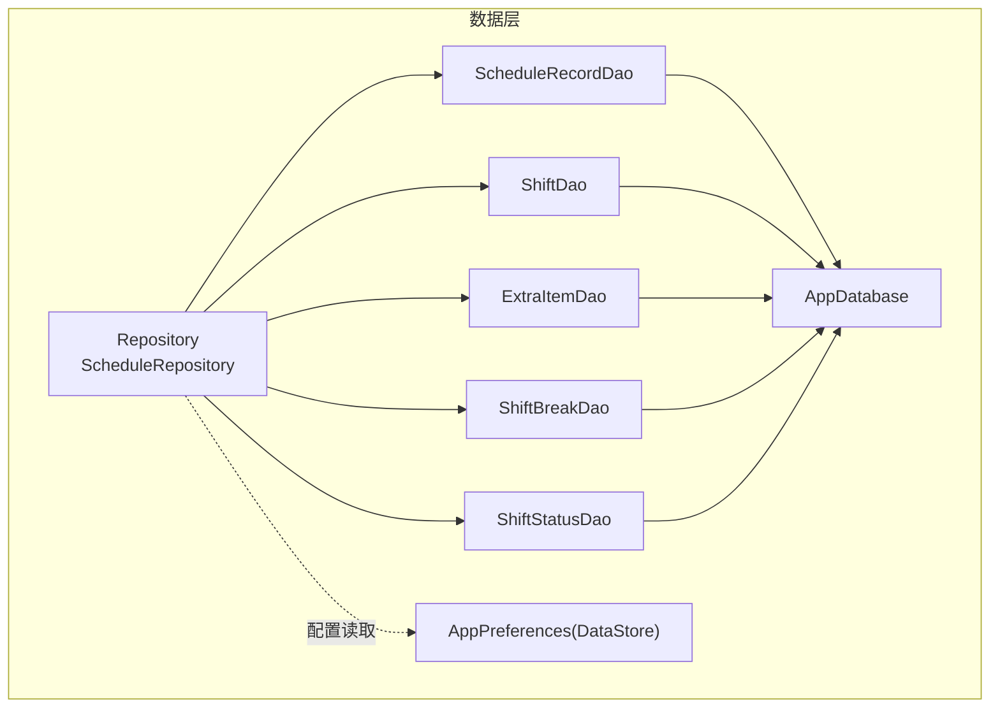
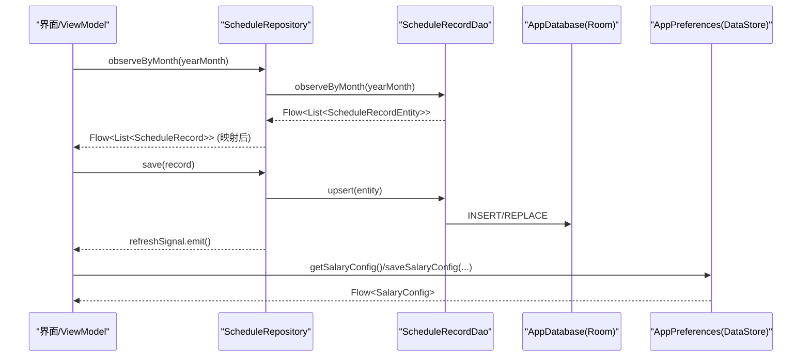
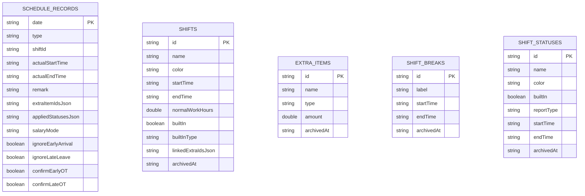
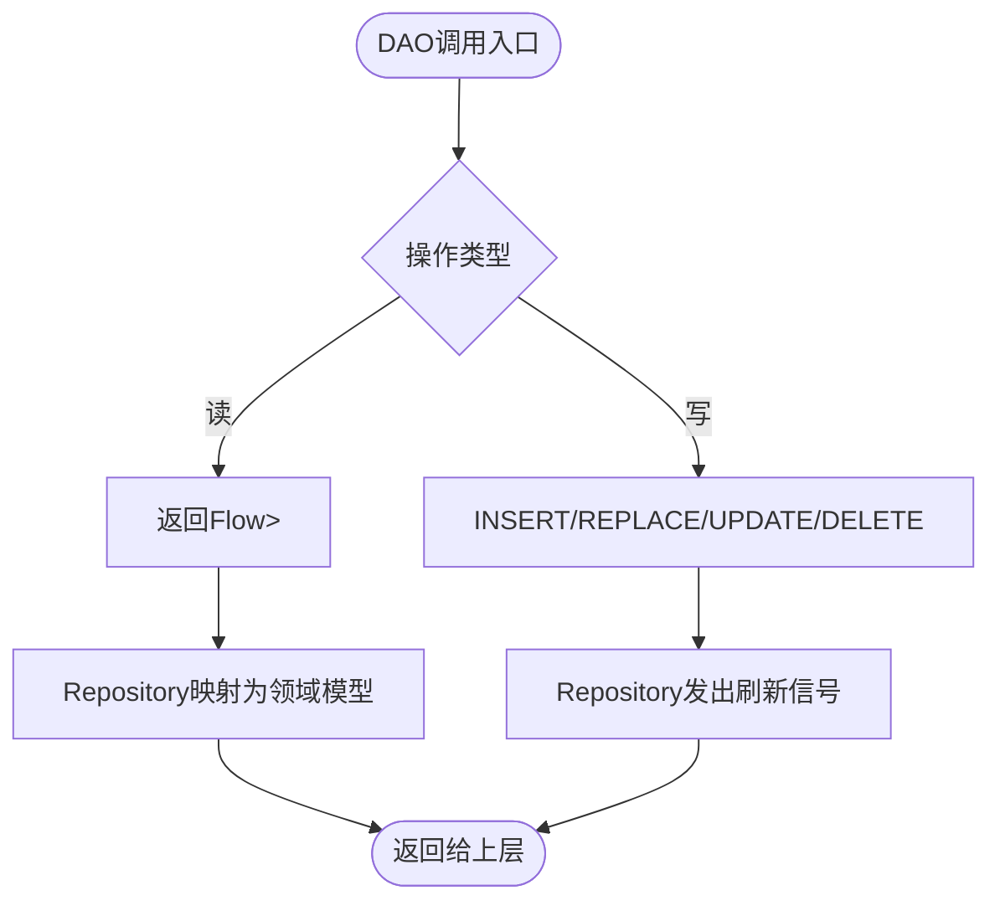
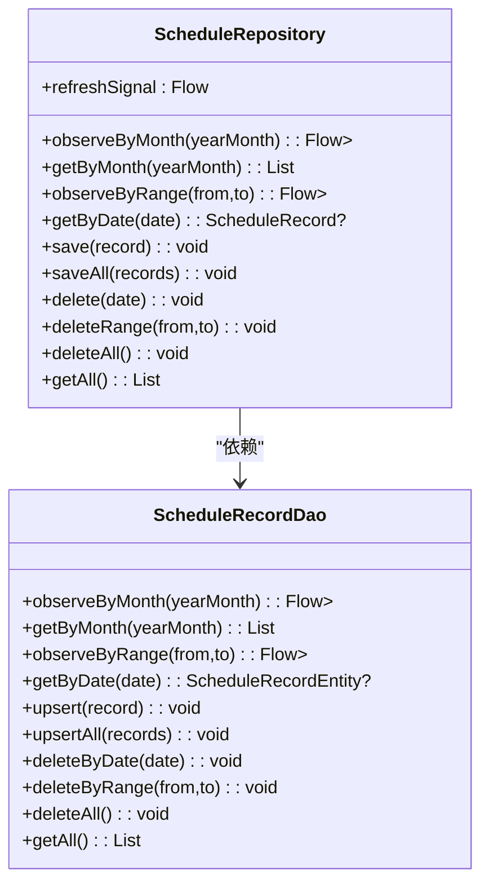
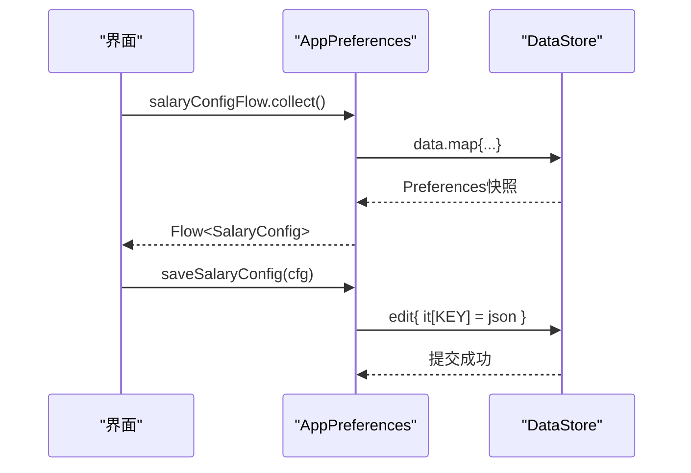
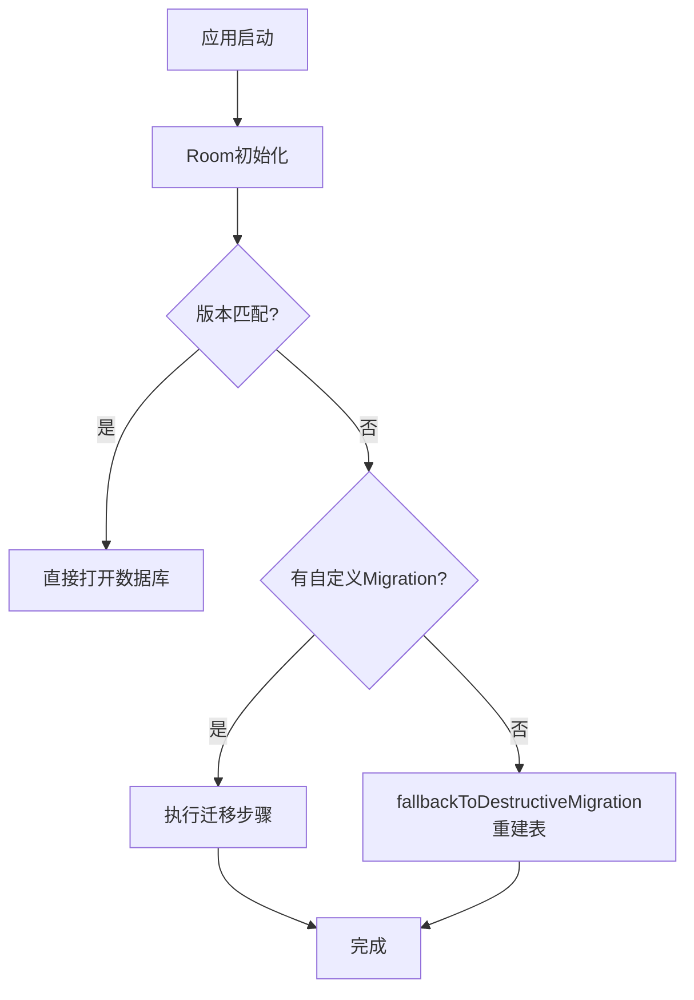
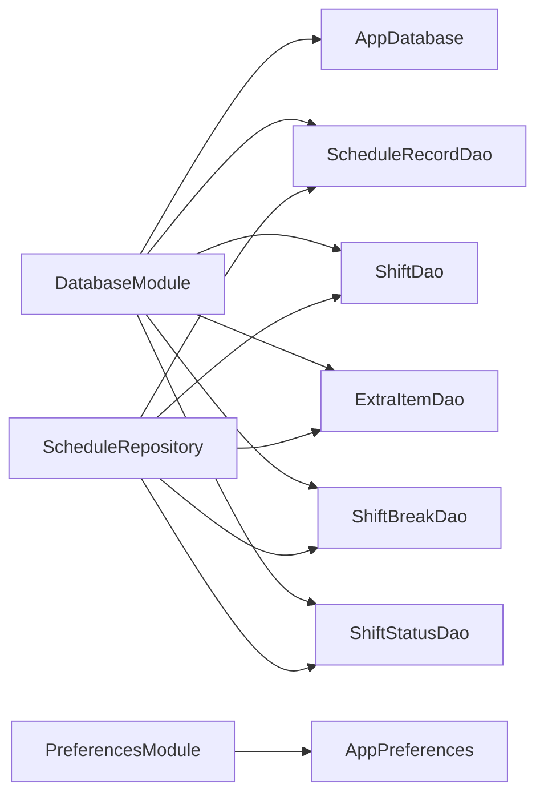

# 数据持久化

<cite>
**本文引用的文件**   
- [AppDatabase.kt](file://app/src/main/java/com/schedulecalendar/app/data/db/AppDatabase.kt)
- [DatabaseModule.kt](file://app/src/main/java/com/schedulecalendar/app/di/DatabaseModule.kt)
- [PreferencesModule.kt](file://app/src/main/java/com/schedulecalendar/app/di/PreferencesModule.kt)
- [AppPreferences.kt](file://app/src/main/java/com/schedulecalendar/app/data/prefs/AppPreferences.kt)
- [ScheduleRecordEntity.kt](file://app/src/main/java/com/schedulecalendar/app/data/db/entity/ScheduleRecordEntity.kt)
- [ShiftEntity.kt](file://app/src/main/java/com/schedulecalendar/app/data/db/entity/ShiftEntity.kt)
- [ExtraItemEntity.kt](file://app/src/main/java/com/schedulecalendar/app/data/db/entity/ExtraItemEntity.kt)
- [ShiftBreakEntity.kt](file://app/src/main/java/com/schedulecalendar/app/data/db/entity/ShiftBreakEntity.kt)
- [ShiftStatusEntity.kt](file://app/src/main/java/com/schedulecalendar/app/data/db/entity/ShiftStatusEntity.kt)
- [ScheduleRecordDao.kt](file://app/src/main/java/com/schedulecalendar/app/data/db/dao/ScheduleRecordDao.kt)
- [ShiftDao.kt](file://app/src/main/java/com/schedulecalendar/app/data/db/dao/ShiftDao.kt)
- [ExtraItemDao.kt](file://app/src/main/java/com/schedulecalendar/app/data/db/dao/ExtraItemDao.kt)
- [ShiftBreakDao.kt](file://app/src/main/java/com/schedulecalendar/app/data/db/dao/ShiftBreakDao.kt)
- [ShiftStatusDao.kt](file://app/src/main/java/com/schedulecalendar/app/data/db/dao/ShiftStatusDao.kt)
- [ScheduleRepository.kt](file://app/src/main/java/com/schedulecalendar/app/data/repository/ScheduleRepository.kt)
- [2.json](file://app/schemas/com.schedulecalendar.app.data.db.AppDatabase/2.json)
- [3.json](file://app/schemas/com.schedulecalendar.app.data.db.AppDatabase/3.json)
- [4.json](file://app/schemas/com.schedulecalendar.app.data.db.AppDatabase/4.json)
- [5.json](file://app/schemas/com.schedulecalendar.app.data.db.AppDatabase/5.json)
</cite>

## 目录
1. [简介](#简介)
2. [项目结构](#项目结构)
3. [核心组件](#核心组件)
4. [架构总览](#架构总览)
5. [详细组件分析](#详细组件分析)
6. [依赖关系分析](#依赖关系分析)
7. [性能考虑](#性能考虑)
8. [故障排查指南](#故障排查指南)
9. [结论](#结论)
10. [附录](#附录)

## 简介
本文件面向Android排班日历应用的数据持久化系统，系统性阐述Room数据库设计、实体与DAO实现、DataStore偏好设置使用、Repository模式抽象层、数据同步与缓存策略、性能优化、Schema设计与迁移、以及备份导入导出方案。文档力求在技术深度与可读性之间取得平衡，帮助开发者快速理解并扩展数据层。

## 项目结构
数据层按“领域模型 → Repository → DAO → Entity”分层组织：
- 领域模型位于 domain/model（不在本节展开）
- Repository 提供统一的数据访问接口，封装协程Flow与信号通知
- DAO 定义Room查询与变更操作，暴露Flow以支持响应式更新
- Entity 映射SQLite表结构
- AppDatabase 集中声明实体与版本管理
- DI模块负责数据库与偏好设置的单例注入

图表来源 
- [AppDatabase.kt:17-34](file://app/src/main/java/com/schedulecalendar/app/data/db/AppDatabase.kt#L17-L34)
- [ScheduleRepository.kt:13-39](file://app/src/main/java/com/schedulecalendar/app/data/repository/ScheduleRepository.kt#L13-L39)
- [AppPreferences.kt:23-66](file://app/src/main/java/com/schedulecalendar/app/data/prefs/AppPreferences.kt#L23-L66)

章节来源
- [AppDatabase.kt:17-34](file://app/src/main/java/com/schedulecalendar/app/data/db/AppDatabase.kt#L17-L34)
- [DatabaseModule.kt:21-34](file://app/src/main/java/com/schedulecalendar/app/di/DatabaseModule.kt#L21-L34)
- [PreferencesModule.kt:15-20](file://app/src/main/java/com/schedulecalendar/app/di/PreferencesModule.kt#L15-L20)

## 核心组件
- Room数据库入口与版本控制：AppDatabase声明实体集合与版本号，并导出schema用于迁移追踪
- DAO接口：对每张表提供CRUD、范围查询、归档逻辑删除、Flow响应式观察
- Repository：封装业务级数据访问，统一将Entity映射为领域模型，并通过SharedFlow发出刷新信号
- DataStore偏好设置：集中管理应用配置、显示方案、排序、提醒、账户分类等键值对，并以Flow暴露变化

章节来源
- [AppDatabase.kt:17-34](file://app/src/main/java/com/schedulecalendar/app/data/db/AppDatabase.kt#L17-L34)
- [ScheduleRecordDao.kt:8-39](file://app/src/main/java/com/schedulecalendar/app/data/db/dao/ScheduleRecordDao.kt#L8-L39)
- [ShiftDao.kt:8-41](file://app/src/main/java/com/schedulecalendar/app/data/db/dao/ShiftDao.kt#L8-L41)
- [ExtraItemDao.kt:8-40](file://app/src/main/java/com/schedulecalendar/app/data/db/dao/ExtraItemDao.kt#L8-L40)
- [ShiftBreakDao.kt:8-38](file://app/src/main/java/com/schedulecalendar/app/data/db/dao/ShiftBreakDao.kt#L8-L38)
- [ShiftStatusDao.kt:8-38](file://app/src/main/java/com/schedulecalendar/app/data/db/dao/ShiftStatusDao.kt#L8-L38)
- [ScheduleRepository.kt:13-39](file://app/src/main/java/com/schedulecalendar/app/data/repository/ScheduleRepository.kt#L13-L39)
- [AppPreferences.kt:23-66](file://app/src/main/java/com/schedulecalendar/app/data/prefs/AppPreferences.kt#L23-L66)

## 架构总览
下图展示从UI到数据层的调用链与数据流向，强调Repository作为统一抽象层的作用，以及DataStore对配置的响应式支持。

图表来源 
- [ScheduleRepository.kt:22-36](file://app/src/main/java/com/schedulecalendar/app/data/repository/ScheduleRepository.kt#L22-L36)
- [ScheduleRecordDao.kt:10-26](file://app/src/main/java/com/schedulecalendar/app/data/db/dao/ScheduleRecordDao.kt#L10-L26)
- [AppPreferences.kt:68-82](file://app/src/main/java/com/schedulecalendar/app/data/prefs/AppPreferences.kt#L68-L82)

## 详细组件分析

### Room数据库与实体设计
- AppDatabase集中声明所有实体与版本，开启schema导出便于迁移
- 实体采用data class + @Entity/@PrimaryKey注解，字段类型与业务语义一一对应
- 常用字段约定：
  - id为主键字符串ID
  - archivedAt用于逻辑删除（null表示有效）
  - JSON字段存储复杂结构（如extraItemIdsJson、appliedStatusesJson、linkedExtraIdsJson）

图表来源 
- [ScheduleRecordEntity.kt:8-25](file://app/src/main/java/com/schedulecalendar/app/data/db/entity/ScheduleRecordEntity.kt#L8-L25)
- [ShiftEntity.kt:8-23](file://app/src/main/java/com/schedulecalendar/app/data/db/entity/ShiftEntity.kt#L8-L23)
- [ExtraItemEntity.kt:8-15](file://app/src/main/java/com/schedulecalendar/app/data/db/entity/ExtraItemEntity.kt#L8-L15)
- [ShiftBreakEntity.kt:8-15](file://app/src/main/java/com/schedulecalendar/app/data/db/entity/ShiftBreakEntity.kt#L8-L15)
- [ShiftStatusEntity.kt:8-18](file://app/src/main/java/com/schedulecalendar/app/data/db/entity/ShiftStatusEntity.kt#L8-L18)

章节来源
- [AppDatabase.kt:17-34](file://app/src/main/java/com/schedulecalendar/app/data/db/AppDatabase.kt#L17-L34)
- [ScheduleRecordEntity.kt:8-25](file://app/src/main/java/com/schedulecalendar/app/data/db/entity/ScheduleRecordEntity.kt#L8-L25)
- [ShiftEntity.kt:8-23](file://app/src/main/java/com/schedulecalendar/app/data/db/entity/ShiftEntity.kt#L8-L23)
- [ExtraItemEntity.kt:8-15](file://app/src/main/java/com/schedulecalendar/app/data/db/entity/ExtraItemEntity.kt#L8-L15)
- [ShiftBreakEntity.kt:8-15](file://app/src/main/java/com/schedulecalendar/app/data/db/entity/ShiftBreakEntity.kt#L8-L15)
- [ShiftStatusEntity.kt:8-18](file://app/src/main/java/com/schedulecalendar/app/data/db/entity/ShiftStatusEntity.kt#L8-L18)

### DAO接口设计与查询模式
- 统一的CRUD方法命名：upsert/upsertAll/deleteById/deleteAll
- 响应式查询：observeActive/observeAll/observeByRange返回Flow，自动传播变更
- 逻辑删除：archiveById通过archivedAt标记实现软删除
- 典型查询：
  - 按月查询：date LIKE :yearMonth || '%'
  - 区间查询：date >= from AND date <= to
  - 排序：按name或startTime等字段稳定排序

图表来源 
- [ScheduleRecordDao.kt:10-38](file://app/src/main/java/com/schedulecalendar/app/data/db/dao/ScheduleRecordDao.kt#L10-L38)
- [ShiftDao.kt:10-41](file://app/src/main/java/com/schedulecalendar/app/data/db/dao/ShiftDao.kt#L10-L41)
- [ExtraItemDao.kt:10-40](file://app/src/main/java/com/schedulecalendar/app/data/db/dao/ExtraItemDao.kt#L10-L40)
- [ShiftBreakDao.kt:10-38](file://app/src/main/java/com/schedulecalendar/app/data/db/dao/ShiftBreakDao.kt#L10-L38)
- [ShiftStatusDao.kt:10-38](file://app/src/main/java/com/schedulecalendar/app/data/db/dao/ShiftStatusDao.kt#L10-L38)

章节来源
- [ScheduleRecordDao.kt:8-39](file://app/src/main/java/com/schedulecalendar/app/data/db/dao/ScheduleRecordDao.kt#L8-L39)
- [ShiftDao.kt:8-41](file://app/src/main/java/com/schedulecalendar/app/data/db/dao/ShiftDao.kt#L8-L41)
- [ExtraItemDao.kt:8-40](file://app/src/main/java/com/schedulecalendar/app/data/db/dao/ExtraItemDao.kt#L8-L40)
- [ShiftBreakDao.kt:8-38](file://app/src/main/java/com/schedulecalendar/app/data/db/dao/ShiftBreakDao.kt#L8-L38)
- [ShiftStatusDao.kt:8-38](file://app/src/main/java/com/schedulecalendar/app/data/db/dao/ShiftStatusDao.kt#L8-L38)

### Repository模式与数据同步
- ScheduleRepository封装ScheduleRecord的读写与范围查询，统一转换Entity↔领域模型
- 使用MutableSharedFlow作为写操作后的刷新信号，供ViewModel订阅触发UI刷新
- 批量写入：upsertAll减少往返次数；删除支持按日期与区间批量删除

图表来源 
- [ScheduleRepository.kt:13-39](file://app/src/main/java/com/schedulecalendar/app/data/repository/ScheduleRepository.kt#L13-L39)
- [ScheduleRecordDao.kt:8-39](file://app/src/main/java/com/schedulecalendar/app/data/db/dao/ScheduleRecordDao.kt#L8-L39)

章节来源
- [ScheduleRepository.kt:13-39](file://app/src/main/java/com/schedulecalendar/app/data/repository/ScheduleRepository.kt#L13-L39)

### DataStore偏好设置应用
- 使用preferencesDataStore创建全局DataStore实例，键值对覆盖薪资、考勤、排班规则、显示方案、小组件数据、排序、颜色索引、备份路径、提醒、账户分类等
- 复杂对象通过Gson序列化为JSON存储，并提供Flow监听变化
- 读取快照用.first()避免竞态；保存用edit{}原子更新

图表来源 
- [AppPreferences.kt:23-35](file://app/src/main/java/com/schedulecalendar/app/data/prefs/AppPreferences.kt#L23-L35)
- [AppPreferences.kt:68-82](file://app/src/main/java/com/schedulecalendar/app/data/prefs/AppPreferences.kt#L68-L82)

章节来源
- [AppPreferences.kt:23-66](file://app/src/main/java/com/schedulecalendar/app/data/prefs/AppPreferences.kt#L23-L66)
- [PreferencesModule.kt:15-20](file://app/src/main/java/com/schedulecalendar/app/di/PreferencesModule.kt#L15-20)

### 数据库迁移策略
- AppDatabase.version=5，exportSchema=true，生成app/schemas下的JSON schema文件
- DI中配置fallbackToDestructiveMigration(dropAllTables=true)，当前策略为破坏性迁移
- 建议逐步引入自定义Migration，确保用户数据无损升级

图表来源 
- [AppDatabase.kt:17-27](file://app/src/main/java/com/schedulecalendar/app/data/db/AppDatabase.kt#L17-L27)
- [DatabaseModule.kt:24-27](file://app/src/main/java/com/schedulecalendar/app/di/DatabaseModule.kt#L24-L27)
- [2.json](file://app/schemas/com.schedulecalendar.app.data.db.AppDatabase/2.json)
- [3.json](file://app/schemas/com.schedulecalendar.app.data.db.AppDatabase/3.json)
- [4.json](file://app/schemas/com.schedulecalendar.app.data.db.AppDatabase/4.json)
- [5.json](file://app/schemas/com.schedulecalendar.app.data.db.AppDatabase/5.json)

章节来源
- [AppDatabase.kt:17-27](file://app/src/main/java/com/schedulecalendar/app/data/db/AppDatabase.kt#L17-L27)
- [DatabaseModule.kt:24-27](file://app/src/main/java/com/schedulecalendar/app/di/DatabaseModule.kt#L24-L27)

## 依赖关系分析
- DI层通过@Module提供AppDatabase与各DAO的单例实例
- Repository依赖对应DAO，屏蔽底层Room细节
- DataStore独立于Room，专注轻量配置存储

图表来源 
- [DatabaseModule.kt:21-34](file://app/src/main/java/com/schedulecalendar/app/di/DatabaseModule.kt#L21-L34)
- [PreferencesModule.kt:15-20](file://app/src/main/java/com/schedulecalendar/app/di/PreferencesModule.kt#L15-20)
- [ScheduleRepository.kt:13-16](file://app/src/main/java/com/schedulecalendar/app/data/repository/ScheduleRepository.kt#L13-L16)

章节来源
- [DatabaseModule.kt:21-34](file://app/src/main/java/com/schedulecalendar/app/di/DatabaseModule.kt#L21-L34)
- [PreferencesModule.kt:15-20](file://app/src/main/java/com/schedulecalendar/app/di/PreferencesModule.kt#L15-20)

## 性能考虑
- 查询优化
  - 使用LIKE前缀匹配年月（date LIKE :yearMonth || '%'），建议在date列建立索引以提升范围查询性能
  - 对频繁排序字段（如shifts.name、shift_breaks.startTime、shift_statuses.builtIn/name）建立索引
  - 避免SELECT *，按需选择字段，减少内存占用
- 写入优化
  - 批量upsertAll减少事务开销
  - 使用onConflict=REPLACE避免重复插入冲突
- 响应式更新
  - DAO返回Flow，UI侧自动收集最新结果，避免手动刷新
  - Repository通过SharedFlow发出写操作信号，集中处理刷新逻辑
- DataStore优化
  - 使用.edit{}原子更新，避免并发写冲突
  - 复杂对象序列化注意Gson默认值注册，防止反序列化异常

章节来源
- [ScheduleRecordDao.kt:10-20](file://app/src/main/java/com/schedulecalendar/app/data/db/dao/ScheduleRecordDao.kt#L10-L20)
- [ShiftDao.kt:10-18](file://app/src/main/java/com/schedulecalendar/app/data/db/dao/ShiftDao.kt#L10-L18)
- [ExtraItemDao.kt:10-23](file://app/src/main/java/com/schedulecalendar/app/data/db/dao/ExtraItemDao.kt#L10-L23)
- [ShiftBreakDao.kt:10-21](file://app/src/main/java/com/schedulecalendar/app/data/db/dao/ShiftBreakDao.kt#L10-L21)
- [ShiftStatusDao.kt:10-18](file://app/src/main/java/com/schedulecalendar/app/data/db/dao/ShiftStatusDao.kt#L10-L18)
- [AppPreferences.kt:68-103](file://app/src/main/java/com/schedulecalendar/app/data/prefs/AppPreferences.kt#L68-L103)

## 故障排查指南
- 数据库版本不一致导致崩溃
  - 检查AppDatabase.version与schemas下JSON版本是否一致
  - 若尚未实现自定义Migration，fallbackToDestructiveMigration会清空数据，需确认可接受
- DataStore读写异常
  - 确保使用.first()读取快照，而非在edit{}内读取
  - Gson反序列化失败时捕获异常并回退默认值
- 查询性能问题
  - 对高频过滤/排序字段添加索引
  - 避免在Flow链中进行重型计算，尽量在Repository层预处理

章节来源
- [AppDatabase.kt:17-27](file://app/src/main/java/com/schedulecalendar/app/data/db/AppDatabase.kt#L17-L27)
- [DatabaseModule.kt:24-27](file://app/src/main/java/com/schedulecalendar/app/di/DatabaseModule.kt#L24-L27)
- [AppPreferences.kt:106-111](file://app/src/main/java/com/schedulecalendar/app/data/prefs/AppPreferences.kt#L106-L111)

## 结论
该数据持久化系统以Room为核心，结合DataStore进行偏好设置管理，通过Repository统一抽象数据访问，实现了清晰的层次结构与响应式数据流。当前迁移策略为破坏性迁移，建议逐步引入自定义Migration保障数据完整性。通过合理的索引与批量操作，可在保证功能的同时提升性能。

## 附录

### Schema设计与索引优化建议
- 主键与唯一约束
  - schedule_records.date作为主键，天然唯一
  - shifts.id、extra_items.id、shift_breaks.id、shift_statuses.id作为主键
- 推荐索引
  - schedule_records.date（已为主键）
  - shifts.name（排序与搜索）
  - extra_items.name（排序）
  - shift_breaks.startTime（排序）
  - shift_statuses.builtIn, shift_statuses.name（排序）
- 视图与聚合
  - 可按需要创建视图简化复杂查询，例如按月份统计记录数

### 数据同步机制与缓存策略
- 同步机制
  - 写操作后Repository发出refreshSignal，ViewModel订阅后重新拉取数据
  - DAO的Flow自动传播变更，无需手动失效缓存
- 缓存策略
  - 列表数据通过Flow缓存最新结果
  - 小配置项通过DataStore本地持久化，避免重复网络请求

### 备份与导入导出方案
- 备份内容
  - Room数据库文件：schedule_calendar.db
  - DataStore偏好文件：app_config.preferences_pb
- 导出流程
  - 复制数据库文件到外部存储或云盘
  - 打包DataStore文件（或通过Settings导出JSON配置）
- 导入流程
  - 恢复数据库文件至应用私有目录
  - 恢复DataStore偏好文件或合并配置
- 注意事项
  - 导入前建议先备份现有数据
  - 版本不兼容时需先执行迁移或清理数据