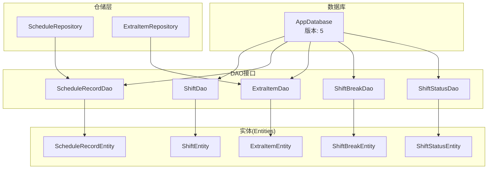
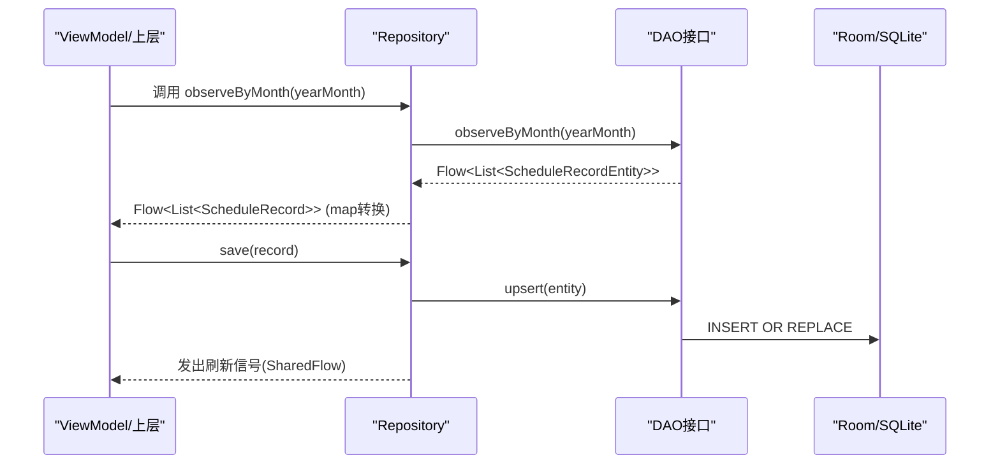
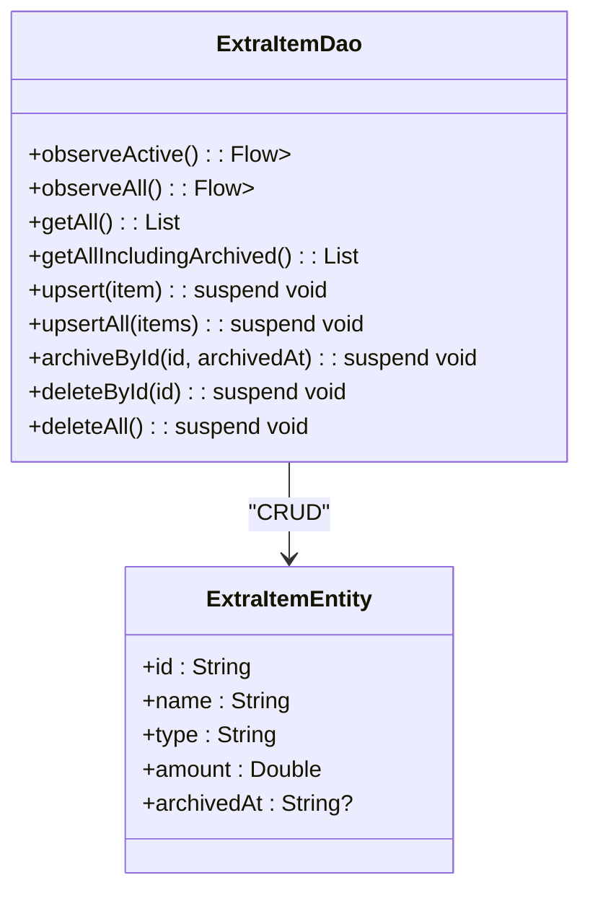
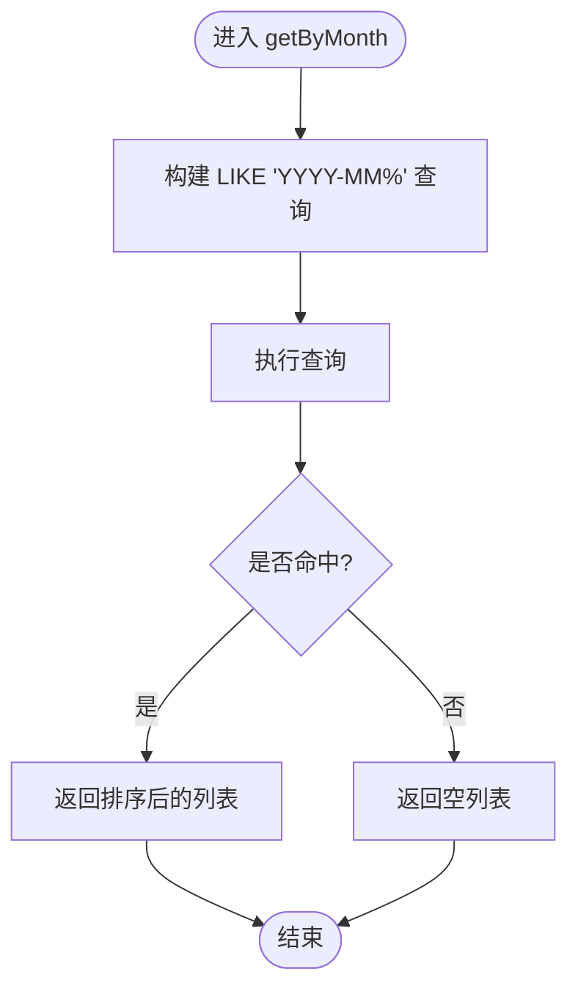
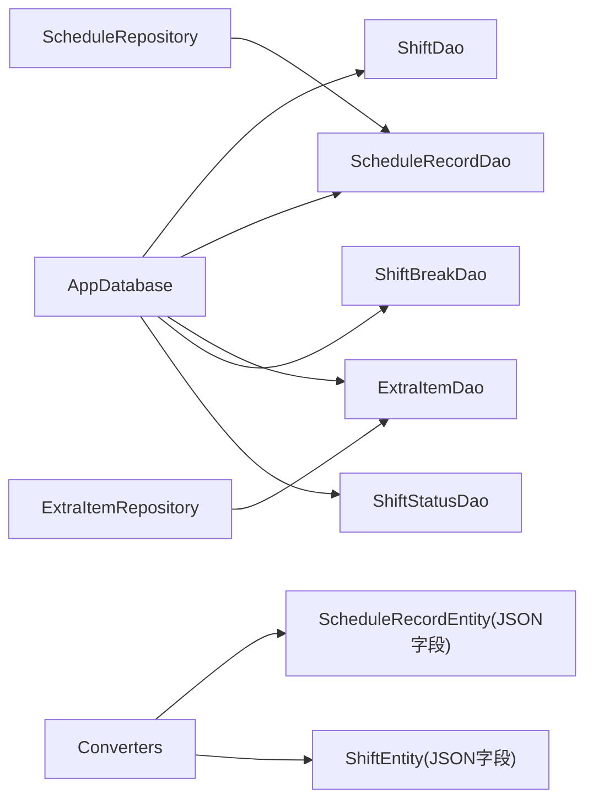

# 数据访问对象(DAO)

<cite>
**本文引用的文件**   
- [ExtraItemDao.kt](file://app/src/main/java/com/schedulecalendar/app/data/db/dao/ExtraItemDao.kt)
- [ScheduleRecordDao.kt](file://app/src/main/java/com/schedulecalendar/app/data/db/dao/ScheduleRecordDao.kt)
- [ShiftBreakDao.kt](file://app/src/main/java/com/schedulecalendar/app/data/db/dao/ShiftBreakDao.kt)
- [ShiftDao.kt](file://app/src/main/java/com/schedulecalendar/app/data/db/dao/ShiftDao.kt)
- [ShiftStatusDao.kt](file://app/src/main/java/com/schedulecalendar/app/data/db/dao/ShiftStatusDao.kt)
- [ExtraItemEntity.kt](file://app/src/main/java/com/schedulecalendar/app/data/db/entity/ExtraItemEntity.kt)
- [ScheduleRecordEntity.kt](file://app/src/main/java/com/schedulecalendar/app/data/db/entity/ScheduleRecordEntity.kt)
- [ShiftBreakEntity.kt](file://app/src/main/java/com/schedulecalendar/app/data/db/entity/ShiftBreakEntity.kt)
- [ShiftEntity.kt](file://app/src/main/java/com/schedulecalendar/app/data/db/entity/ShiftEntity.kt)
- [ShiftStatusEntity.kt](file://app/src/main/java/com/schedulecalendar/app/data/db/entity/ShiftStatusEntity.kt)
- [AppDatabase.kt](file://app/src/main/java/com/schedulecalendar/app/data/db/AppDatabase.kt)
- [Converters.kt](file://app/src/main/java/com/schedulecalendar/app/data/db/Converters.kt)
- [ExtraItemRepository.kt](file://app/src/main/java/com/schedulecalendar/app/data/repository/ExtraItemRepository.kt)
- [ScheduleRepository.kt](file://app/src/main/java/com/schedulecalendar/app/data/repository/ScheduleRepository.kt)
</cite>

## 目录
1. [简介](#简介)
2. [项目结构](#项目结构)
3. [核心组件](#核心组件)
4. [架构总览](#架构总览)
5. [详细组件分析](#详细组件分析)
6. [依赖关系分析](#依赖关系分析)
7. [性能与索引优化](#性能与索引优化)
8. [事务处理](#事务处理)
9. [异步操作支持](#异步操作支持)
10. [复杂查询模式与最佳实践](#复杂查询模式与最佳实践)
11. [错误处理策略](#错误处理策略)
12. [结论](#结论)

## 简介
本文件面向Room DAO层，系统性梳理各DAO接口的CRUD方法、注解使用方式（@Insert/@Update/@Delete/@Query）、Flow/LiveData协程异步支持、以及性能调优与事务处理。结合仓库中的实体定义与Repository封装，给出可落地的最佳实践与常见问题排查建议。

## 项目结构
数据层采用“Entity + DAO + Room Database”的标准Room架构，Repository作为业务与数据层的桥梁，将DAO返回的Entity映射为领域模型并暴露给上层。

图表来源
- [AppDatabase.kt:17-34](file://app/src/main/java/com/schedulecalendar/app/data/db/AppDatabase.kt#L17-L34)
- [ShiftDao.kt:8-41](file://app/src/main/java/com/schedulecalendar/app/data/db/dao/ShiftDao.kt#L8-L41)
- [ScheduleRecordDao.kt:8-39](file://app/src/main/java/com/schedulecalendar/app/data/db/dao/ScheduleRecordDao.kt#L8-L39)
- [ExtraItemDao.kt:8-40](file://app/src/main/java/com/schedulecalendar/app/data/db/dao/ExtraItemDao.kt#L8-L40)
- [ShiftBreakDao.kt:8-38](file://app/src/main/java/com/schedulecalendar/app/data/db/dao/ShiftBreakDao.kt#L8-L38)
- [ShiftStatusDao.kt:8-38](file://app/src/main/java/com/schedulecalendar/app/data/db/dao/ShiftStatusDao.kt#L8-L38)
- [ShiftEntity.kt:8-23](file://app/src/main/java/com/schedulecalendar/app/data/db/entity/ShiftEntity.kt#L8-L23)
- [ScheduleRecordEntity.kt:8-25](file://app/src/main/java/com/schedulecalendar/app/data/db/entity/ScheduleRecordEntity.kt#L8-L25)
- [ExtraItemEntity.kt:8-15](file://app/src/main/java/com/schedulecalendar/app/data/db/entity/ExtraItemEntity.kt#L8-L15)
- [ShiftBreakEntity.kt:8-15](file://app/src/main/java/com/schedulecalendar/app/data/db/entity/ShiftBreakEntity.kt#L8-L15)
- [ShiftStatusEntity.kt:8-18](file://app/src/main/java/com/schedulecalendar/app/data/db/entity/ShiftStatusEntity.kt#L8-L18)

章节来源
- [AppDatabase.kt:17-34](file://app/src/main/java/com/schedulecalendar/app/data/db/AppDatabase.kt#L17-L34)

## 核心组件
- AppDatabase：声明所有实体与版本，导出Schema便于迁移追踪；提供DAO获取入口。
- Converters：通过Gson实现List<String>与JSON字符串互转，支撑实体中JSON字段持久化。
- DAO接口：每个实体对应一个DAO，统一提供观察型（Flow）与一次性（suspend）API，包含upsert、归档、删除等。
- Repository：对DAO进行封装，负责Entity到领域模型的转换、变更信号通知、以及跨表逻辑编排。

章节来源
- [AppDatabase.kt:17-34](file://app/src/main/java/com/schedulecalendar/app/data/db/AppDatabase.kt#L17-L34)
- [Converters.kt:9-16](file://app/src/main/java/com/schedulecalendar/app/data/db/Converters.kt#L9-L16)
- [ExtraItemRepository.kt:11-30](file://app/src/main/java/com/schedulecalendar/app/data/repository/ExtraItemRepository.kt#L11-L30)
- [ScheduleRepository.kt:13-39](file://app/src/main/java/com/schedulecalendar/app/data/repository/ScheduleRepository.kt#L13-L39)

## 架构总览
下图展示从Repository调用DAO再到数据库的完整流程，体现Flow响应式更新与协程异步执行。

图表来源
- [ScheduleRepository.kt:22-35](file://app/src/main/java/com/schedulecalendar/app/data/repository/ScheduleRepository.kt#L22-L35)
- [ScheduleRecordDao.kt:10-26](file://app/src/main/java/com/schedulecalendar/app/data/db/dao/ScheduleRecordDao.kt#L10-L26)

## 详细组件分析

### ExtraItemDao（附加补贴/扣款项目）
- 主要职责：维护extra_items表的增删改查与归档逻辑，提供活跃项与全部项的观察流。
- 关键注解与方法
  - @Query：按条件查询、归档更新、删除等。
  - @Insert(onConflict = REPLACE)：upsert单条与批量。
- 典型用法
  - 观察有效项：observeActive()返回Flow<List<ExtraItemEntity>>，过滤archivedAt IS NULL。
  - 观察全部项：observeAll()用于薪资计算场景。
  - 一次性查询：getAll()/getAllIncludingArchived()。
  - 归档：archiveById(id, timestamp)。
  - 删除：deleteById()/deleteAll()。

图表来源
- [ExtraItemDao.kt:8-40](file://app/src/main/java/com/schedulecalendar/app/data/db/dao/ExtraItemDao.kt#L8-L40)
- [ExtraItemEntity.kt:8-15](file://app/src/main/java/com/schedulecalendar/app/data/db/entity/ExtraItemEntity.kt#L8-L15)

章节来源
- [ExtraItemDao.kt:8-40](file://app/src/main/java/com/schedulecalendar/app/data/db/dao/ExtraItemDao.kt#L8-L40)
- [ExtraItemEntity.kt:8-15](file://app/src/main/java/com/schedulecalendar/app/data/db/entity/ExtraItemEntity.kt#L8-L15)

### ScheduleRecordDao（每日排班记录）
- 主要职责：按日期范围与月份查询、插入/替换、删除、全量读取。
- 关键注解与方法
  - @Query：按年月的LIKE前缀匹配、区间查询、按日精确查询。
  - @Insert(onConflict = REPLACE)：upsert单条与批量。
  - @Query("DELETE ...")：按日期或区间删除。
- 典型用法
  - 观察月度数据：observeByMonth(yearMonth)。
  - 区间观察：observeByRange(from, to)。
  - 一次性查询：getByMonth/getByDate/getAll。
  - 写入：upsert/upsertAll；删除：deleteByDate/deleteByRange/deleteAll。

图表来源
- [ScheduleRecordDao.kt:10-14](file://app/src/main/java/com/schedulecalendar/app/data/db/dao/ScheduleRecordDao.kt#L10-L14)

章节来源
- [ScheduleRecordDao.kt:8-39](file://app/src/main/java/com/schedulecalendar/app/data/db/dao/ScheduleRecordDao.kt#L8-L39)
- [ScheduleRecordEntity.kt:8-25](file://app/src/main/java/com/schedulecalendar/app/data/db/entity/ScheduleRecordEntity.kt#L8-L25)

### ShiftBreakDao（全局不计入工时时段）
- 主要职责：维护shift_breaks表，支持活跃项与全部项观察、归档、删除。
- 关键注解与方法
  - @Query：按archivedAt过滤、排序、归档更新、删除。
  - @Insert(onConflict = REPLACE)：upsert单条与批量。
- 典型用法
  - observeActive()/observeAll()
  - getAll()/getAllWithArchived()
  - archiveById()/deleteById()/deleteAll()

章节来源
- [ShiftBreakDao.kt:8-38](file://app/src/main/java/com/schedulecalendar/app/data/db/dao/ShiftBreakDao.kt#L8-L38)
- [ShiftBreakEntity.kt:8-15](file://app/src/main/java/com/schedulecalendar/app/data/db/entity/ShiftBreakEntity.kt#L8-L15)

### ShiftDao（班次）
- 主要职责：维护shifts表，支持活跃项与全部项观察、按ID查询、归档、删除。
- 关键注解与方法
  - @Query：按archivedAt过滤、按ID查询、归档更新、删除。
  - @Insert(onConflict = REPLACE)：upsert单条与批量。
  - @Delete：基于实体的删除重载。
- 典型用法
  - observeActive()/observeAll()
  - getAll()/getById()
  - archiveById()/deleteById()/deleteAll()

章节来源
- [ShiftDao.kt:8-41](file://app/src/main/java/com/schedulecalendar/app/data/db/dao/ShiftDao.kt#L8-L41)
- [ShiftEntity.kt:8-23](file://app/src/main/java/com/schedulecalendar/app/data/db/entity/ShiftEntity.kt#L8-L23)

### ShiftStatusDao（班次状态类型）
- 主要职责：维护shift_statuses表，支持活跃项与全部项观察、归档、删除用户自定义项。
- 关键注解与方法
  - @Query：按builtIn与archivedAt过滤、排序、归档更新、删除。
  - @Insert(onConflict = REPLACE)：upsert单条与批量。
- 典型用法
  - observeActive()/observeAll()
  - getAll()
  - archiveById()/deleteById()/deleteAllUserDefined()/deleteAll()

章节来源
- [ShiftStatusDao.kt:8-38](file://app/src/main/java/com/schedulecalendar/app/data/db/dao/ShiftStatusDao.kt#L8-L38)
- [ShiftStatusEntity.kt:8-18](file://app/src/main/java/com/schedulecalendar/app/data/db/entity/ShiftStatusEntity.kt#L8-L18)

## 依赖关系分析
- AppDatabase集中管理实体与DAO，确保编译期生成SQL与类型安全。
- Converters为实体中的JSON字段提供序列化能力，避免在DAO中手写JSON解析。
- Repository依赖DAO，屏蔽Entity细节，向上暴露领域模型与Flow。

图表来源
- [AppDatabase.kt:17-34](file://app/src/main/java/com/schedulecalendar/app/data/db/AppDatabase.kt#L17-L34)
- [Converters.kt:9-16](file://app/src/main/java/com/schedulecalendar/app/data/db/Converters.kt#L9-L16)
- [ScheduleRepository.kt:13-39](file://app/src/main/java/com/schedulecalendar/app/data/repository/ScheduleRepository.kt#L13-L39)
- [ExtraItemRepository.kt:11-30](file://app/src/main/java/com/schedulecalendar/app/data/repository/ExtraItemRepository.kt#L11-L30)

章节来源
- [AppDatabase.kt:17-34](file://app/src/main/java/com/schedulecalendar/app/data/db/AppDatabase.kt#L17-L34)
- [Converters.kt:9-16](file://app/src/main/java/com/schedulecalendar/app/data/db/Converters.kt#L9-L16)

## 性能与索引优化
当前DAO未显式定义索引，但可通过以下策略提升查询性能：
- 针对高频过滤字段添加索引
  - shifts.archivedAt、shift_statuses.archivedAt、shift_breaks.archivedAt：用于活跃项过滤。
  - schedule_records.date：用于按日期/月份查询与排序。
  - extra_items.name：用于ORDER BY name ASC的场景。
- 复合索引
  - schedule_records(date)：覆盖按年月LIKE与排序。
  - shift_statuses(builtIn, name)：覆盖默认排序。
- 避免全表扫描
  - 使用archivedAt IS NULL而非函数包裹列的条件。
  - 使用精确匹配替代LIKE前缀（如可能）。
- JSON字段查询
  - 尽量在应用层解析JSON后过滤，避免在SQL中对JSON字符串做复杂运算。
- 分页与限制
  - 大数据集查询应引入LIMIT/OFFSET或使用游标，避免一次性加载过多数据。

说明：以上为通用优化建议，具体索引需在实体@Entity中添加@Index注解并在数据库升级时生效。

[本节为通用指导，不直接分析具体文件]

## 事务处理
- Room默认在单个DAO方法内自动开启事务。对于需要多步原子操作的场景，可在Repository层组合多个DAO调用并使用Room的事务API（如@Transaction注解的方法）保证一致性。
- 示例思路
  - 批量保存+发送刷新信号：先upsertAll，再emit刷新信号，整体置于事务中。
  - 归档+关联清理：先归档主记录，再清理关联子记录，确保要么都成功要么都失败。

章节来源
- [ScheduleRepository.kt:32-35](file://app/src/main/java/com/schedulecalendar/app/data/repository/ScheduleRepository.kt#L32-L35)
- [ExtraItemRepository.kt:24-27](file://app/src/main/java/com/schedulecalendar/app/data/repository/ExtraItemRepository.kt#L24-L27)

## 异步操作支持
- Flow响应式数据流
  - 多数DAO提供observeXxx()返回Flow<List<Entity>>，适合UI订阅实时变化。
  - Repository通过map将Entity转换为领域模型，保持类型安全与解耦。
- LiveData
  - 若需LiveData，可将Flow通过asLiveData()转换，或在Repository层封装为LiveData。
- 协程
  - suspend方法用于一次性查询/写入，适合在协程作用域中调用。
- 变更信号
  - ScheduleRepository使用MutableSharedFlow发出刷新信号，供ViewModel触发重新拉取数据。

章节来源
- [ExtraItemDao.kt:11-16](file://app/src/main/java/com/schedulecalendar/app/data/db/dao/ExtraItemDao.kt#L11-L16)
- [ScheduleRecordDao.kt:10-20](file://app/src/main/java/com/schedulecalendar/app/data/db/dao/ScheduleRecordDao.kt#L10-L20)
- [ScheduleRepository.kt:17-21](file://app/src/main/java/com/schedulecalendar/app/data/repository/ScheduleRepository.kt#L17-L21)

## 复杂查询模式与最佳实践
- JOIN操作
  - 当前DAO未出现JOIN，建议在Repository层组装多表结果，或在DAO中使用@Relation配合@Embedded进行Room级联查询。
- 聚合函数
  - 可使用SUM/COUNT等聚合函数，结合GROUP BY/HAVING完成统计。例如按月份统计排班数量。
- 子查询
  - 使用IN/EXISTS等子查询实现条件筛选，注意避免N+1问题。
- 排序与分页
  - ORDER BY配合LIMIT/OFFSET实现分页；大数据集建议使用游标或分页库。
- 条件拼接
  - 动态SQL建议使用Room的@Query with参数拼接，避免字符串拼接带来的注入风险。

[本节为通用指导，不直接分析具体文件]

## 错误处理策略
- 冲突策略
  - 使用onConflict = REPLACE实现幂等写入，避免重复键异常。
- 空值与可选返回
  - 返回可为空的字段使用nullable类型，调用方需做空判断。
- 异常捕获
  - 在Repository层捕获DAO抛出的异常，转换为业务异常或返回错误码。
- 日志与监控
  - 对关键写操作与异常路径添加日志，便于定位问题。

章节来源
- [ExtraItemDao.kt:25-29](file://app/src/main/java/com/schedulecalendar/app/data/db/dao/ExtraItemDao.kt#L25-L29)
- [ScheduleRecordDao.kt:22-26](file://app/src/main/java/com/schedulecalendar/app/data/db/dao/ScheduleRecordDao.kt#L22-L26)

## 结论
本项目DAO层遵循Room标准实践，通过@Insert/@Update/@Delete/@Query注解实现类型安全的CRUD，结合Flow与协程提供响应式与异步能力。Repository层进一步抽象领域模型与变更信号，使上层更简洁。未来可在DAO层引入索引、分页、聚合与复杂查询，以提升性能与表达能力。同时，完善事务与错误处理策略，保障数据一致性与健壮性。