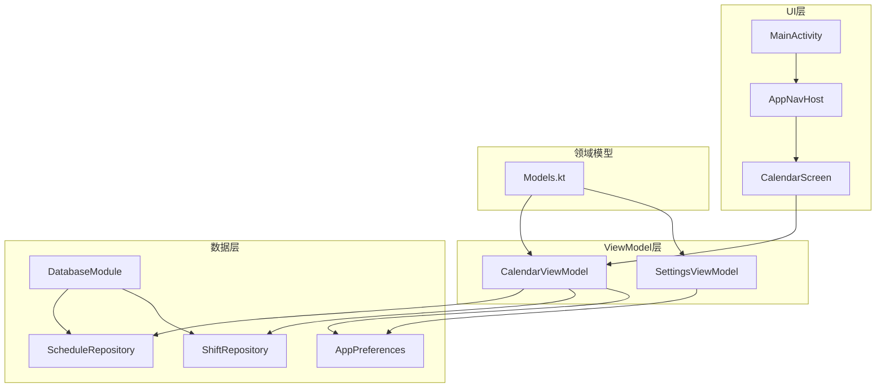
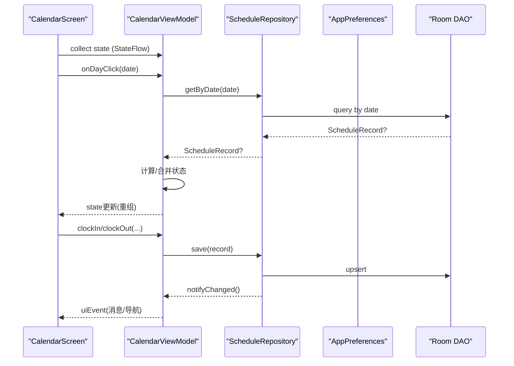
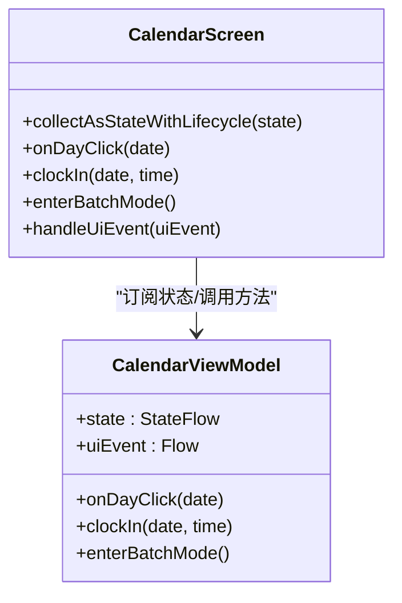
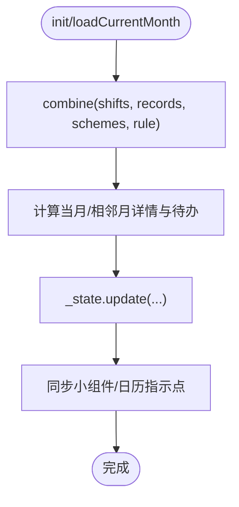
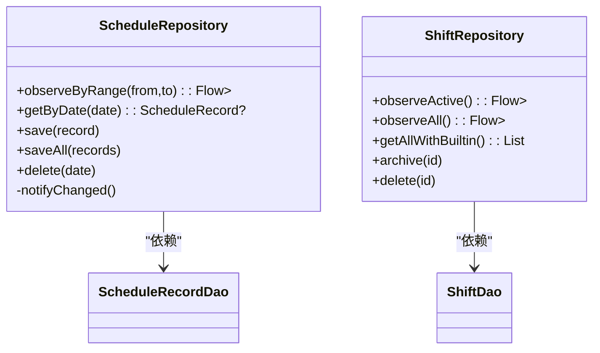
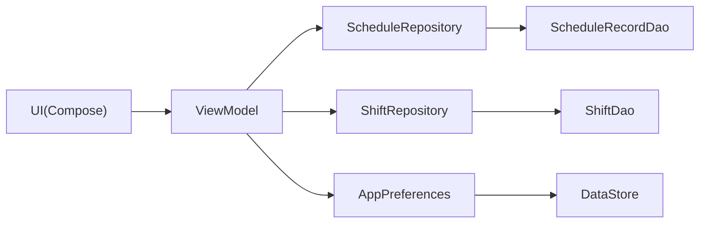

# MVVM架构模式

<cite>
**本文引用的文件**   
- [MainActivity.kt](file://app/src/main/java/com/schedulecalendar/app/MainActivity.kt)
- [ScheduleApp.kt](file://app/src/main/java/com/schedulecalendar/app/ScheduleApp.kt)
- [CalendarViewModel.kt](file://app/src/main/java/com/schedulecalendar/app/ui/calendar/CalendarViewModel.kt)
- [CalendarScreen.kt](file://app/src/main/java/com/schedulecalendar/app/ui/calendar/CalendarScreen.kt)
- [ScheduleRepository.kt](file://app/src/main/java/com/schedulecalendar/app/data/repository/ScheduleRepository.kt)
- [ShiftRepository.kt](file://app/src/main/java/com/schedulecalendar/app/data/repository/ShiftRepository.kt)
- [Models.kt](file://app/src/main/java/com/schedulecalendar/app/domain/model/Models.kt)
- [AppNavHost.kt](file://app/src/main/java/com/schedulecalendar/app/ui/navigation/AppNavHost.kt)
- [DatabaseModule.kt](file://app/src/main/java/com/schedulecalendar/app/di/DatabaseModule.kt)
- [AppPreferences.kt](file://app/src/main/java/com/schedulecalendar/app/data/prefs/AppPreferences.kt)
- [SettingsViewModel.kt](file://app/src/main/java/com/schedulecalendar/app/ui/settings/SettingsViewModel.kt)
</cite>

## 目录
1. [简介](#简介)
2. [项目结构](#项目结构)
3. [核心组件](#核心组件)
4. [架构总览](#架构总览)
5. [详细组件分析](#详细组件分析)
6. [依赖关系分析](#依赖关系分析)
7. [性能考量](#性能考量)
8. [故障排查指南](#故障排查指南)
9. [结论](#结论)
10. [附录：数据流与状态更新模式](#附录数据流与状态更新模式)

## 简介
本文件面向Android排班日历应用，系统性阐述MVVM（Model-View-ViewModel）在该工程中的具体实现。重点包括：
- UI层（Compose）如何与ViewModel交互
- ViewModel如何处理业务逻辑与状态管理
- Repository层如何抽象数据访问
- StateFlow与LiveData的使用模式、数据流方向与状态更新机制
- 各层职责分离与最佳实践
- 架构图表与常见问题解决方案

## 项目结构
该应用采用分层清晰的模块化组织：
- UI层：基于Jetpack Compose的页面与组件，位于ui包下
- 视图模型层：按功能划分ViewModel，负责状态管理与业务编排
- 领域模型层：domain.model定义跨层共享的数据结构与计算规则
- 数据层：repository封装DAO与外部源（Room、DataStore、系统日历等），提供Flow与协程API
- 基础设施：Hilt依赖注入、Navigation导航、DataStore配置、数据库模块

图表来源
- [MainActivity.kt:141-220](file://app/src/main/java/com/schedulecalendar/app/MainActivity.kt#L141-L220)
- [AppNavHost.kt:57-172](file://app/src/main/java/com/schedulecalendar/app/ui/navigation/AppNavHost.kt#L57-L172)
- [CalendarScreen.kt:229-687](file://app/src/main/java/com/schedulecalendar/app/ui/calendar/CalendarScreen.kt#L229-L687)
- [CalendarViewModel.kt:118-151](file://app/src/main/java/com/schedulecalendar/app/ui/calendar/CalendarViewModel.kt#L118-L151)
- [ScheduleRepository.kt:13-39](file://app/src/main/java/com/schedulecalendar/app/data/repository/ScheduleRepository.kt#L13-L39)
- [ShiftRepository.kt:12-44](file://app/src/main/java/com/schedulecalendar/app/data/repository/ShiftRepository.kt#L12-L44)
- [AppPreferences.kt:25-112](file://app/src/main/java/com/schedulecalendar/app/data/prefs/AppPreferences.kt#L25-L112)
- [DatabaseModule.kt:19-34](file://app/src/main/java/com/schedulecalendar/app/di/DatabaseModule.kt#L19-L34)

章节来源
- [MainActivity.kt:141-220](file://app/src/main/java/com/schedulecalendar/app/MainActivity.kt#L141-L220)
- [AppNavHost.kt:57-172](file://app/src/main/java/com/schedulecalendar/app/ui/navigation/AppNavHost.kt#L57-L172)

## 核心组件
- MainActivity：应用入口，处理权限、返回键拦截、快捷方式Intent，并承载根导航
- AppNavHost：底部Tab导航与路由分发，维护Tab页状态与返回行为
- CalendarScreen：日历主界面，使用Compose展示网格、工具栏与详情区域，订阅ViewModel状态
- CalendarViewModel：核心业务编排，聚合多源数据，计算工时与待办，暴露StateFlow与事件Channel
- ScheduleRepository / ShiftRepository：数据访问抽象，封装Room DAO与Flow映射
- AppPreferences：DataStore配置持久化，提供Flow与一次性读写接口
- Models.kt：领域模型定义（班次、记录、显示方案、薪资/考勤配置等）

章节来源
- [CalendarViewModel.kt:118-151](file://app/src/main/java/com/schedulecalendar/app/ui/calendar/CalendarViewModel.kt#L118-L151)
- [CalendarScreen.kt:229-687](file://app/src/main/java/com/schedulecalendar/app/ui/calendar/CalendarScreen.kt#L229-L687)
- [ScheduleRepository.kt:13-39](file://app/src/main/java/com/schedulecalendar/app/data/repository/ScheduleRepository.kt#L13-L39)
- [ShiftRepository.kt:12-44](file://app/src/main/java/com/schedulecalendar/app/data/repository/ShiftRepository.kt#L12-L44)
- [AppPreferences.kt:25-112](file://app/src/main/java/com/schedulecalendar/app/data/prefs/AppPreferences.kt#L25-L112)
- [Models.kt:51-101](file://app/src/main/java/com/schedulecalendar/app/domain/model/Models.kt#L51-L101)

## 架构总览
MVVM在本工程中的职责边界清晰：
- View（Compose）只负责渲染与用户交互，通过hiltViewModel获取ViewModel实例，collectAsStateWithLifecycle订阅state
- ViewModel集中处理状态与业务逻辑，组合多个Repository与偏好设置，暴露不可变StateFlow与单向事件流
- Repository屏蔽底层存储细节，统一以Flow或suspend函数对外暴露，保证可测试性与解耦

图表来源
- [CalendarScreen.kt:229-302](file://app/src/main/java/com/schedulecalendar/app/ui/calendar/CalendarScreen.kt#L229-L302)
- [CalendarViewModel.kt:475-502](file://app/src/main/java/com/schedulecalendar/app/ui/calendar/CalendarViewModel.kt#L475-L502)
- [ScheduleRepository.kt:31-36](file://app/src/main/java/com/schedulecalendar/app/data/repository/ScheduleRepository.kt#L31-L36)

章节来源
- [CalendarScreen.kt:229-302](file://app/src/main/java/com/schedulecalendar/app/ui/calendar/CalendarScreen.kt#L229-L302)
- [CalendarViewModel.kt:475-502](file://app/src/main/java/com/schedulecalendar/app/ui/calendar/CalendarViewModel.kt#L475-L502)
- [ScheduleRepository.kt:31-36](file://app/src/main/java/com/schedulecalendar/app/data/repository/ScheduleRepository.kt#L31-L36)

## 详细组件分析

### 视图层（Compose）与ViewModel交互
- CalendarScreen通过hiltViewModel获取CalendarViewModel实例
- 使用collectAsStateWithLifecycle订阅state，确保生命周期安全
- 通过vm方法调用触发业务操作（如onDayClick、clockIn、enterBatchMode等）
- 通过uiEvent收集一次性事件（导航、Snackbar提示）

图表来源
- [CalendarScreen.kt:229-302](file://app/src/main/java/com/schedulecalendar/app/ui/calendar/CalendarScreen.kt#L229-L302)
- [CalendarViewModel.kt:118-151](file://app/src/main/java/com/schedulecalendar/app/ui/calendar/CalendarViewModel.kt#L118-L151)

章节来源
- [CalendarScreen.kt:229-302](file://app/src/main/java/com/schedulecalendar/app/ui/calendar/CalendarScreen.kt#L229-L302)
- [CalendarViewModel.kt:118-151](file://app/src/main/java/com/schedulecalendar/app/ui/calendar/CalendarViewModel.kt#L118-L151)

### ViewModel状态管理与业务编排
- 使用MutableStateFlow作为内部可变状态，asStateFlow暴露给UI
- 使用Channel接收一次性UI事件，receiveAsFlow转为Flow供UI消费
- init中启动loadCurrentMonth，结合多个Flow（shifts、records、displaySchemes、scheduleRule）进行combine计算
- 月份切换时取消旧Job再启新Job，避免collector累积泄漏
- 批量操作、复制排班、删除排班等复杂流程在ViewModel内编排，保持UI简洁

图表来源
- [CalendarViewModel.kt:153-246](file://app/src/main/java/com/schedulecalendar/app/ui/calendar/CalendarViewModel.kt#L153-L246)

章节来源
- [CalendarViewModel.kt:153-246](file://app/src/main/java/com/schedulecalendar/app/ui/calendar/CalendarViewModel.kt#L153-L246)

### Repository层数据访问抽象
- ScheduleRepository封装ScheduleRecordDao，提供observeByRange、saveAll、delete等Flow与suspend API
- ShiftRepository封装ShiftDao，区分active与all（含内置）观察，支持归档与删除
- 写操作后发出refreshSignal（SharedFlow），供需要刷新数据的场景响应
- 所有Domain对象通过toEntity/toDomain转换，隔离实体与领域模型

图表来源
- [ScheduleRepository.kt:13-39](file://app/src/main/java/com/schedulecalendar/app/data/repository/ScheduleRepository.kt#L13-L39)
- [ShiftRepository.kt:12-44](file://app/src/main/java/com/schedulecalendar/app/data/repository/ShiftRepository.kt#L12-L44)

章节来源
- [ScheduleRepository.kt:13-39](file://app/src/main/java/com/schedulecalendar/app/data/repository/ScheduleRepository.kt#L13-L39)
- [ShiftRepository.kt:12-44](file://app/src/main/java/com/schedulecalendar/app/data/repository/ShiftRepository.kt#L12-L44)

### 领域模型与配置
- Models.kt定义了班次、排班记录、附加状态、显示方案、薪资/考勤配置等核心数据结构
- 内置常量与默认值（如BUILTIN_SHIFTS、NO_SCHEME_ID）便于初始化与兼容
- 计算相关类型（HoursSummary、DayScheduleDetail）支撑工时与薪资统计

章节来源
- [Models.kt:51-101](file://app/src/main/java/com/schedulecalendar/app/domain/model/Models.kt#L51-L101)
- [Models.kt:169-208](file://app/src/main/java/com/schedulecalendar/app/domain/model/Models.kt#L169-L208)

### 导航与返回键处理
- AppNavHost统一管理Tab与子页面路由，维护当前是否在Tab页的状态
- MainActivity注册OnBackPressedCallback与API 34+ OnBackInvokedDispatcher回调，确保返回键行为一致
- CalendarScreen将子模式状态（批量/复制/删除）同步到Activity，使返回键优先退出模式

章节来源
- [AppNavHost.kt:57-172](file://app/src/main/java/com/schedulecalendar/app/ui/navigation/AppNavHost.kt#L57-L172)
- [MainActivity.kt:141-157](file://app/src/main/java/com/schedulecalendar/app/MainActivity.kt#L141-L157)
- [CalendarScreen.kt:239-255](file://app/src/main/java/com/schedulecalendar/app/ui/calendar/CalendarScreen.kt#L239-L255)

### 依赖注入与数据库模块
- HiltApplication类标记为@HiltAndroidApp，启用依赖注入
- DatabaseModule提供AppDatabase与各DAO的单例实例，Room构建配置包含破坏性迁移策略

章节来源
- [ScheduleApp.kt:7-8](file://app/src/main/java/com/schedulecalendar/app/ScheduleApp.kt#L7-L8)
- [DatabaseModule.kt:19-34](file://app/src/main/java/com/schedulecalendar/app/di/DatabaseModule.kt#L19-L34)

## 依赖关系分析
- UI层仅依赖ViewModel与Navigation，不直接访问Repository
- ViewModel依赖多个Repository与AppPreferences，组合数据源并编排业务逻辑
- Repository依赖DAO与DataStore，向上暴露Flow与suspend API
- 领域模型贯穿UI、ViewModel与Repository，保证一致性

图表来源
- [CalendarScreen.kt:229-302](file://app/src/main/java/com/schedulecalendar/app/ui/calendar/CalendarScreen.kt#L229-L302)
- [CalendarViewModel.kt:118-151](file://app/src/main/java/com/schedulecalendar/app/ui/calendar/CalendarViewModel.kt#L118-L151)
- [ScheduleRepository.kt:13-39](file://app/src/main/java/com/schedulecalendar/app/data/repository/ScheduleRepository.kt#L13-L39)
- [ShiftRepository.kt:12-44](file://app/src/main/java/com/schedulecalendar/app/data/repository/ShiftRepository.kt#L12-L44)
- [AppPreferences.kt:25-112](file://app/src/main/java/com/schedulecalendar/app/data/prefs/AppPreferences.kt#L25-L112)

章节来源
- [CalendarScreen.kt:229-302](file://app/src/main/java/com/schedulecalendar/app/ui/calendar/CalendarScreen.kt#L229-L302)
- [CalendarViewModel.kt:118-151](file://app/src/main/java/com/schedulecalendar/app/ui/calendar/CalendarViewModel.kt#L118-L151)

## 性能考量
- 使用StateFlow替代LiveData，减少生命周期绑定开销，提升可组合性
- loadCurrentMonth中使用combine聚合多源Flow，避免多次重复查询
- collectJob在切月时取消旧任务，防止内存泄漏与重复计算
- 使用stateIn配合WhileSubscribed控制流的生命周期与背压
- 小组件与日历指示点仅在必要时同步，降低UI重绘频率

[本节为通用指导，不直接分析具体文件]

## 故障排查指南
- 状态未更新：检查是否正确使用collectAsStateWithLifecycle订阅state；确认_state.update是否正确触发重组
- 事件丢失：确保uiEvent使用Channel.BUFFERED并在UI侧及时collect
- 数据不同步：检查Repository的notifyChanged是否被调用；确认Flow链是否完整
- 返回键异常：确认MainActivity与AppNavHost的BackHandler优先级与条件；验证子模式状态同步
- 内存泄漏：检查collectJob是否正确取消；避免在ViewModel中持有长生命周期引用

章节来源
- [CalendarViewModel.kt:153-158](file://app/src/main/java/com/schedulecalendar/app/ui/calendar/CalendarViewModel.kt#L153-L158)
- [ScheduleRepository.kt:17-21](file://app/src/main/java/com/schedulecalendar/app/data/repository/ScheduleRepository.kt#L17-L21)
- [AppNavHost.kt:161-170](file://app/src/main/java/com/schedulecalendar/app/ui/navigation/AppNavHost.kt#L161-L170)

## 结论
本工程严格遵循MVVM分层原则，通过StateFlow与Channel实现单向数据流，Repository抽象数据访问，ViewModel专注业务编排，UI层保持简洁与可组合性。整体架构具备高内聚、低耦合、易扩展与易测试的特点，适合复杂排班与日历场景的持续演进。

[本节为总结性内容，不直接分析具体文件]

## 附录：数据流与状态更新模式
- StateFlow使用模式：
  - 内部MutableStateFlow保存状态，asStateFlow暴露只读流
  - UI侧collectAsStateWithLifecycle订阅，生命周期安全
  - 使用stateIn配合SharingStarted.WhileSubscribed控制流生命周期
- Channel事件模式：
  - 一次性UI事件（导航、Snackbar）通过Channel发送，receiveAsFlow转为Flow
  - UI侧collect处理，避免重复消费
- Repository数据流：
  - observe系列方法返回Flow，自动响应底层数据变更
  - 写操作后发出refreshSignal，供需要刷新数据的场景监听

章节来源
- [SettingsViewModel.kt:44-64](file://app/src/main/java/com/schedulecalendar/app/ui/settings/SettingsViewModel.kt#L44-L64)
- [CalendarViewModel.kt:131-136](file://app/src/main/java/com/schedulecalendar/app/ui/calendar/CalendarViewModel.kt#L131-L136)
- [ScheduleRepository.kt:17-21](file://app/src/main/java/com/schedulecalendar/app/data/repository/ScheduleRepository.kt#L17-L21)