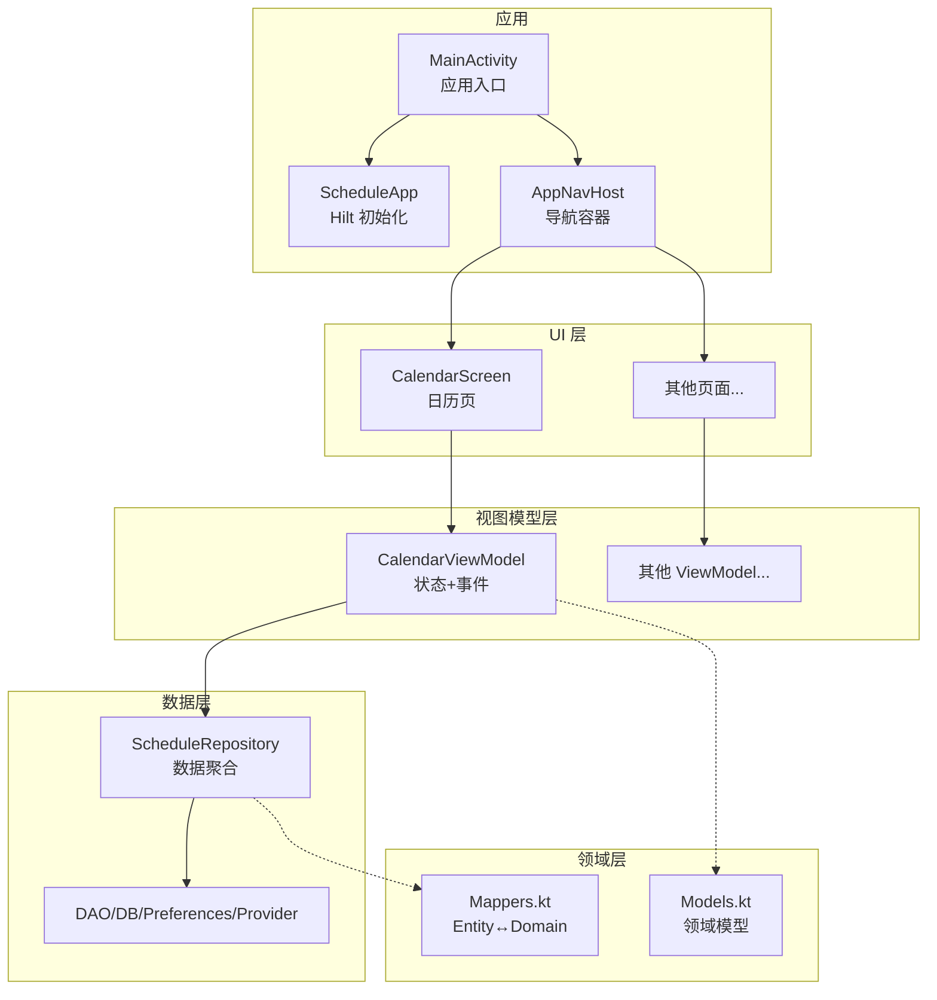
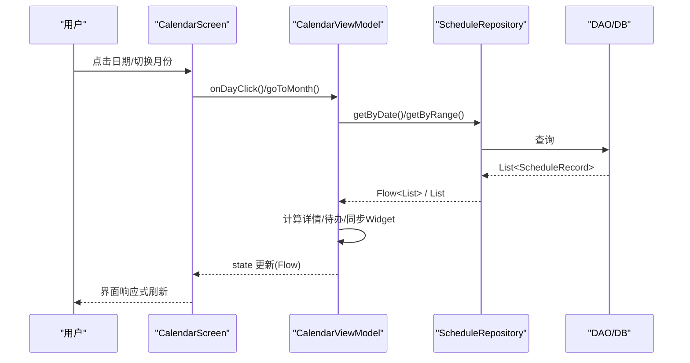
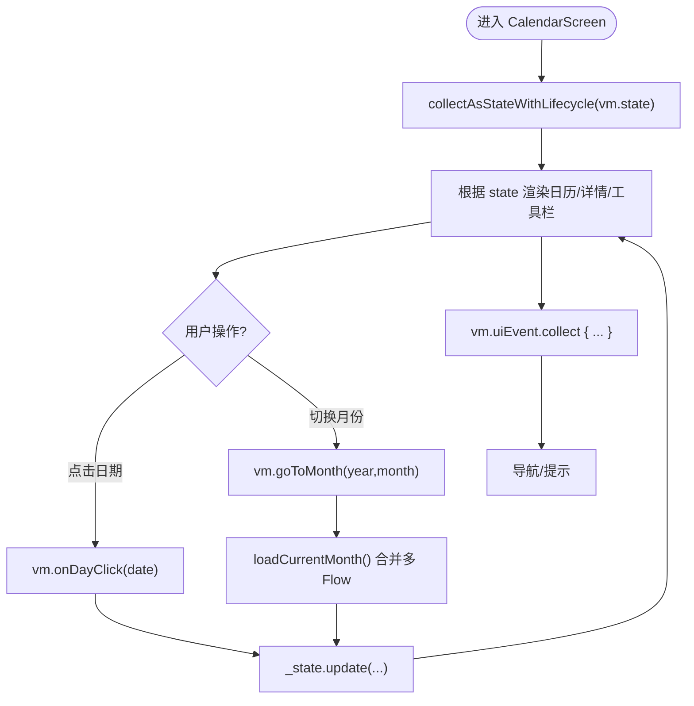
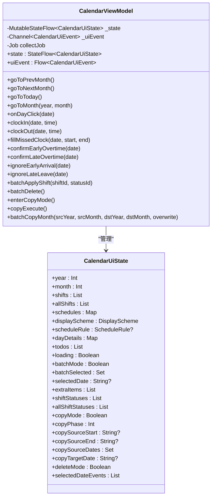
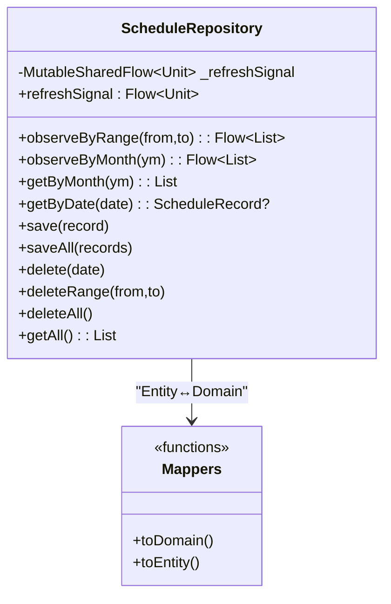
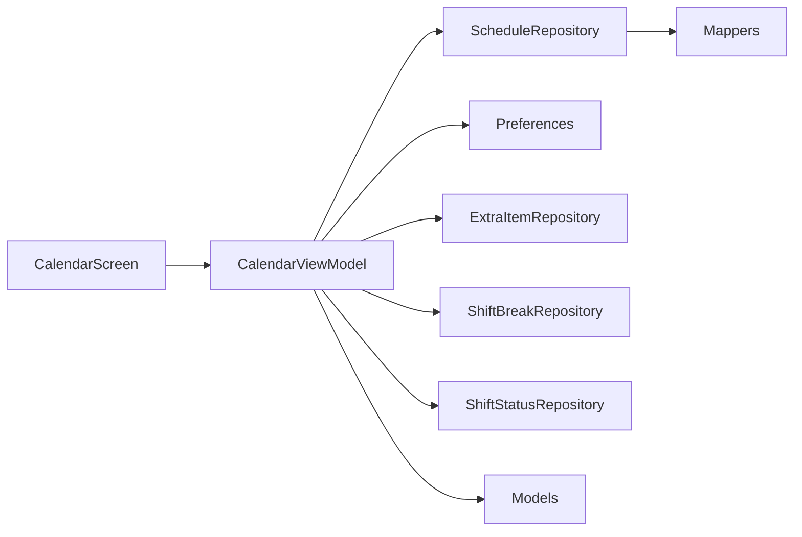

# MVVM架构模式

<cite>
**本文引用的文件**   
- [MainActivity.kt](file://app/src/main/java/com/schedulecalendar/app/MainActivity.kt)
- [ScheduleApp.kt](file://app/src/main/java/com/schedulecalendar/app/ScheduleApp.kt)
- [AppNavHost.kt](file://app/src/main/java/com/schedulecalendar/app/ui/navigation/AppNavHost.kt)
- [Screen.kt](file://app/src/main/java/com/schedulecalendar/app/ui/navigation/Screen.kt)
- [CalendarViewModel.kt](file://app/src/main/java/com/schedulecalendar/app/ui/calendar/CalendarViewModel.kt)
- [CalendarScreen.kt](file://app/src/main/java/com/schedulecalendar/app/ui/calendar/CalendarScreen.kt)
- [SalaryViewModel.kt](file://app/src/main/java/com/schedulecalendar/app/ui/salary/SalaryViewModel.kt)
- [ScheduleRepository.kt](file://app/src/main/java/com/schedulecalendar/app/data/repository/ScheduleRepository.kt)
- [Mappers.kt](file://app/src/main/java/com/schedulecalendar/app/data/repository/Mappers.kt)
- [Models.kt](file://app/src/main/java/com/schedulecalendar/app/domain/model/Models.kt)
</cite>

## 目录
1. [简介](#简介)
2. [项目结构](#项目结构)
3. [核心组件](#核心组件)
4. [架构总览](#架构总览)
5. [详细组件分析](#详细组件分析)
6. [依赖关系分析](#依赖关系分析)
7. [性能考量](#性能考量)
8. [故障排查指南](#故障排查指南)
9. [结论](#结论)
10. [附录](#附录)

## 简介
本文件围绕该工程中的 MVVM 架构实现进行深入解析，重点覆盖：
- View 层（Jetpack Compose）的声明式 UI、状态提升与组合函数设计、响应式更新机制
- ViewModel 层的职责边界：状态管理、业务逻辑处理、数据转换与生命周期管理
- Repository 层的数据访问抽象：数据源聚合、缓存策略与错误处理
- 各层交互模式与示例路径，StateFlow 在数据流中的作用
- 组件通信机制、事件处理模式与状态同步策略的实现细节

## 项目结构
整体采用分层组织：
- ui 层：以 Compose 页面为入口，通过 hiltViewModel 注入 ViewModel
- domain 层：领域模型与计算工具
- data 层：Repository 聚合 DAO 与外部数据源，提供 Flow 与 suspend API
- navigation 层：类型安全路由定义与导航宿主
- app 层：应用启动、主题与全局配置

图表来源
- [MainActivity.kt:1-105](file://app/src/main/java/com/schedulecalendar/app/MainActivity.kt#L1-L105)
- [ScheduleApp.kt:1-9](file://app/src/main/java/com/schedulecalendar/app/ScheduleApp.kt#L1-L9)
- [AppNavHost.kt:1-133](file://app/src/main/java/com/schedulecalendar/app/ui/navigation/AppNavHost.kt#L1-L133)
- [CalendarScreen.kt:1-800](file://app/src/main/java/com/schedulecalendar/app/ui/calendar/CalendarScreen.kt#L1-L800)
- [CalendarViewModel.kt:1-873](file://app/src/main/java/com/schedulecalendar/app/ui/calendar/CalendarViewModel.kt#L1-L873)
- [ScheduleRepository.kt:1-40](file://app/src/main/java/com/schedulecalendar/app/data/repository/ScheduleRepository.kt#L1-L40)
- [Mappers.kt:1-134](file://app/src/main/java/com/schedulecalendar/app/data/repository/Mappers.kt#L1-L134)
- [Models.kt:1-277](file://app/src/main/java/com/schedulecalendar/app/domain/model/Models.kt#L1-L277)

章节来源
- [MainActivity.kt:1-105](file://app/src/main/java/com/schedulecalendar/app/MainActivity.kt#L1-L105)
- [ScheduleApp.kt:1-9](file://app/src/main/java/com/schedulecalendar/app/ScheduleApp.kt#L1-L9)
- [AppNavHost.kt:1-133](file://app/src/main/java/com/schedulecalendar/app/ui/navigation/AppNavHost.kt#L1-L133)

## 核心组件
- CalendarScreen：基于 Compose 的声明式 UI，使用 collectAsStateWithLifecycle 订阅 ViewModel.state，并通过 Channel 消费 uiEvent 触发导航与提示。
- CalendarViewModel：集中管理当月排班、显示方案、待办中心、批量/复制/删除操作等；通过 StateFlow 暴露不可变 UI 状态，通过 Channel 发送一次性 UI 事件。
- ScheduleRepository：对数据库 DAO 的封装，提供 observeByRange/observeByMonth 等 Flow 接口，并在写操作后发出 refreshSignal 通知相关页面刷新。
- Mappers：负责 Entity 与 Domain 模型的互转，统一 JSON 字段解析与兼容旧格式。
- Models：领域模型定义，包括班次、状态、记录、薪资配置、显示方案等。

章节来源
- [CalendarScreen.kt:1-800](file://app/src/main/java/com/schedulecalendar/app/ui/calendar/CalendarScreen.kt#L1-L800)
- [CalendarViewModel.kt:1-873](file://app/src/main/java/com/schedulecalendar/app/ui/calendar/CalendarViewModel.kt#L1-L873)
- [ScheduleRepository.kt:1-40](file://app/src/main/java/com/schedulecalendar/app/data/repository/ScheduleRepository.kt#L1-L40)
- [Mappers.kt:1-134](file://app/src/main/java/com/schedulecalendar/app/data/repository/Mappers.kt#L1-L134)
- [Models.kt:1-277](file://app/src/main/java/com/schedulecalendar/app/domain/model/Models.kt#L1-L277)

## 架构总览
MVVM 在本工程中的职责划分清晰：
- View（Compose）：只负责渲染与用户交互，不持有业务状态
- ViewModel：持有并转换 UI 状态，协调多数据源，暴露 state 与 uiEvent
- Repository：屏蔽底层数据源差异，提供统一的 Flow 与 suspend API，并负责数据映射与变更信号

图表来源
- [CalendarScreen.kt:1-800](file://app/src/main/java/com/schedulecalendar/app/ui/calendar/CalendarScreen.kt#L1-L800)
- [CalendarViewModel.kt:1-873](file://app/src/main/java/com/schedulecalendar/app/ui/calendar/CalendarViewModel.kt#L1-L873)
- [ScheduleRepository.kt:1-40](file://app/src/main/java/com/schedulecalendar/app/data/repository/ScheduleRepository.kt#L1-L40)

## 详细组件分析

### View 层（Jetpack Compose）
- 状态提升与组合函数
  - CalendarScreen 通过 hiltViewModel 获取 CalendarViewModel，并使用 collectAsStateWithLifecycle 将 state 提升到可组合函数中，保证生命周期感知与内存安全。
  - 所有交互回调直接委托给 ViewModel 的方法，避免在 Composable 中保存可变状态。
- 响应式更新机制
  - state 是 StateFlow，UI 自动订阅最新值并重组
  - uiEvent 是 Channel，用于一次性事件（如导航、Snackbar），收集后立即消费，避免重复触发
- 跨组件通信
  - 通过 MainActivity.consumeShortcutAction/consumeNavigateDate 读取待处理动作，再调用 ViewModel 方法完成打卡或跳转
  - 导航由 NavController 执行，事件由 uiEvent 驱动

图表来源
- [CalendarScreen.kt:1-800](file://app/src/main/java/com/schedulecalendar/app/ui/calendar/CalendarScreen.kt#L1-L800)
- [CalendarViewModel.kt:1-873](file://app/src/main/java/com/schedulecalendar/app/ui/calendar/CalendarViewModel.kt#L1-L873)
- [MainActivity.kt:1-105](file://app/src/main/java/com/schedulecalendar/app/MainActivity.kt#L1-L105)

章节来源
- [CalendarScreen.kt:1-800](file://app/src/main/java/com/schedulecalendar/app/ui/calendar/CalendarScreen.kt#L1-L800)
- [MainActivity.kt:1-105](file://app/src/main/java/com/schedulecalendar/app/MainActivity.kt#L1-L105)

### ViewModel 层
- 状态管理
  - 使用 MutableStateFlow + asStateFlow 暴露不可变 UI 状态 CalendarUiState，包含当月信息、班次、排班记录、显示方案、待办、批量/复制/删除模式等
  - 使用 Channel 暴露一次性 UI 事件 CalendarUiEvent（导航、消息、错误）
- 业务逻辑处理
  - 月份切换时，计算完整网格范围（含上月尾部与下月头部），合并多个 Flow（班次、排班、显示方案、规则）进行数据组装
  - 构建待办中心：检测漏打卡、加班待确认/已确认/忽略等
  - 批量/复制/删除：维护选择集与阶段状态，最终批量持久化
- 数据转换
  - 结合 CalcUtils 与领域模型计算每日工时、薪资明细
  - 与 Widget 同步：将当前月/今日排班数据转换为小组件数据结构
- 生命周期管理
  - 使用 viewModelScope 管理协程，切月时取消上次 collectJob，防止泄漏
  - 首次加载时触发自动备份与本地日历账户创建

图表来源
- [CalendarViewModel.kt:1-873](file://app/src/main/java/com/schedulecalendar/app/ui/calendar/CalendarViewModel.kt#L1-L873)
- [Models.kt:1-277](file://app/src/main/java/com/schedulecalendar/app/domain/model/Models.kt#L1-L277)

章节来源
- [CalendarViewModel.kt:1-873](file://app/src/main/java/com/schedulecalendar/app/ui/calendar/CalendarViewModel.kt#L1-L873)

### Repository 层
- 数据访问抽象
  - 提供 observeByRange/observeByMonth 等 Flow 接口，供 ViewModel 组合多数据源
  - 提供 save/saveAll/delete 等写操作，并在内部发出 refreshSignal 通知监听者刷新
- 数据源聚合
  - 聚合 DAO 与偏好设置、外部 Provider 等，对外仅暴露领域模型
- 错误处理
  - 写操作失败由上层捕获；读操作返回空集合或空对象，保持 UI 稳定
- 缓存策略
  - 通过 Flow 实时反映数据库变化，无需手动缓存；必要时可在 Repository 层增加内存缓存

图表来源
- [ScheduleRepository.kt:1-40](file://app/src/main/java/com/schedulecalendar/app/data/repository/ScheduleRepository.kt#L1-L40)
- [Mappers.kt:1-134](file://app/src/main/java/com/schedulecalendar/app/data/repository/Mappers.kt#L1-L134)

章节来源
- [ScheduleRepository.kt:1-40](file://app/src/main/java/com/schedulecalendar/app/data/repository/ScheduleRepository.kt#L1-L40)
- [Mappers.kt:1-134](file://app/src/main/java/com/schedulecalendar/app/data/repository/Mappers.kt#L1-L134)

### 领域模型与映射
- Models.kt 定义了 Shift、ShiftStatus、ScheduleRecord、DisplayScheme、SalaryConfig、AttendConfig 等核心领域对象
- Mappers.kt 负责 Entity 与 Domain 的双向转换，并对复杂字段（JSON）进行兼容解析

章节来源
- [Models.kt:1-277](file://app/src/main/java/com/schedulecalendar/app/domain/model/Models.kt#L1-L277)
- [Mappers.kt:1-134](file://app/src/main/java/com/schedulecalendar/app/data/repository/Mappers.kt#L1-L134)

### 导航与路由
- Screen.kt 使用 @Serializable 定义类型安全路由（object 无参、data class 带参）
- AppNavHost 注册所有页面路由，支持参数传递与状态保留

章节来源
- [Screen.kt:1-34](file://app/src/main/java/com/schedulecalendar/app/ui/navigation/Screen.kt#L1-L34)
- [AppNavHost.kt:1-133](file://app/src/main/java/com/schedulecalendar/app/ui/navigation/AppNavHost.kt#L1-L133)

## 依赖关系分析
- 耦合与内聚
  - CalendarScreen 仅依赖 CalendarViewModel 与导航控制器，内聚良好
  - CalendarViewModel 依赖多个 Repository 与 Preferences，但通过构造函数注入，职责清晰
  - Repository 仅依赖 DAO 与 Mapper，屏蔽了具体存储细节
- 外部依赖
  - Hilt 注入依赖
  - Jetpack Compose Navigation 管理页面流转
  - Kotlin Coroutines/Flow 驱动异步与响应式

图表来源
- [CalendarScreen.kt:1-800](file://app/src/main/java/com/schedulecalendar/app/ui/calendar/CalendarScreen.kt#L1-L800)
- [CalendarViewModel.kt:1-873](file://app/src/main/java/com/schedulecalendar/app/ui/calendar/CalendarViewModel.kt#L1-L873)
- [ScheduleRepository.kt:1-40](file://app/src/main/java/com/schedulecalendar/app/data/repository/ScheduleRepository.kt#L1-L40)
- [Mappers.kt:1-134](file://app/src/main/java/com/schedulecalendar/app/data/repository/Mappers.kt#L1-L134)
- [Models.kt:1-277](file://app/src/main/java/com/schedulecalendar/app/domain/model/Models.kt#L1-L277)

章节来源
- [CalendarScreen.kt:1-800](file://app/src/main/java/com/schedulecalendar/app/ui/calendar/CalendarScreen.kt#L1-L800)
- [CalendarViewModel.kt:1-873](file://app/src/main/java/com/schedulecalendar/app/ui/calendar/CalendarViewModel.kt#L1-L873)
- [ScheduleRepository.kt:1-40](file://app/src/main/java/com/schedulecalendar/app/data/repository/ScheduleRepository.kt#L1-L40)

## 性能考量
- 列表与布局
  - 使用 LazyColumn 与 AnimatedContent 优化大列表与月份切换动画
  - 预计算网格数据，减少重组开销
- 数据流
  - 使用 combine 合并多个 Flow，仅在任一上游变化时重新计算
  - 切月时 cancel 上一次 collectJob，避免协程泄漏
- 写入与刷新
  - Repository 写操作后发出 refreshSignal，其他页面（如薪资页）按需刷新，避免全量重建

[本节为通用指导，不涉及具体文件分析]

## 故障排查指南
- 常见问题
  - 页面未刷新：检查 Repository 是否在写操作后发出 refreshSignal，以及 ViewModel 是否正确收集
  - 事件重复触发：确保 uiEvent 使用 Channel 且仅消费一次
  - 导航异常：确认路由定义与参数类型一致，使用 toRoute<T>() 解析
- 定位建议
  - 在 ViewModel 的关键分支添加日志输出
  - 观察 Flow 上游是否频繁发射导致重算
  - 检查 Widget 同步逻辑是否阻塞主线程

章节来源
- [SalaryViewModel.kt:57-88](file://app/src/main/java/com/schedulecalendar/app/ui/salary/SalaryViewModel.kt#L57-L88)
- [CalendarViewModel.kt:1-873](file://app/src/main/java/com/schedulecalendar/app/ui/calendar/CalendarViewModel.kt#L1-L873)

## 结论
该工程以清晰的 MVVM 分层实现了基于 Compose 的现代化 Android 应用：
- View 层专注声明式 UI 与用户交互
- ViewModel 层承担状态管理与业务编排
- Repository 层屏蔽数据源细节并提供响应式数据流
- 通过 StateFlow 与 Channel 实现高效的状态同步与事件分发
- 借助类型安全路由与 Hilt 注入，提升了可维护性与可扩展性

[本节为总结，不涉及具体文件分析]

## 附录
- 关键交互示例路径
  - 打卡流程：从快捷方式到打卡落库与 UI 反馈
    - [MainActivity.kt:72-103](file://app/src/main/java/com/schedulecalendar/app/MainActivity.kt#L72-L103)
    - [CalendarScreen.kt:83-101](file://app/src/main/java/com/schedulecalendar/app/ui/calendar/CalendarScreen.kt#L83-L101)
    - [CalendarViewModel.kt:404-416](file://app/src/main/java/com/schedulecalendar/app/ui/calendar/CalendarViewModel.kt#L404-L416)
  - 月份切换与数据合并
    - [CalendarViewModel.kt:134-247](file://app/src/main/java/com/schedulecalendar/app/ui/calendar/CalendarViewModel.kt#L134-L247)
  - 批量/复制/删除操作
    - [CalendarViewModel.kt:552-793](file://app/src/main/java/com/schedulecalendar/app/ui/calendar/CalendarViewModel.kt#L552-L793)
  - 薪资页自动刷新
    - [SalaryViewModel.kt:65-70](file://app/src/main/java/com/schedulecalendar/app/ui/salary/SalaryViewModel.kt#L65-L70)
    - [ScheduleRepository.kt:17-21](file://app/src/main/java/com/schedulecalendar/app/data/repository/ScheduleRepository.kt#L17-L21)