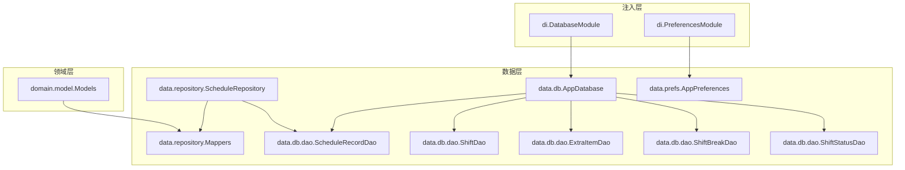
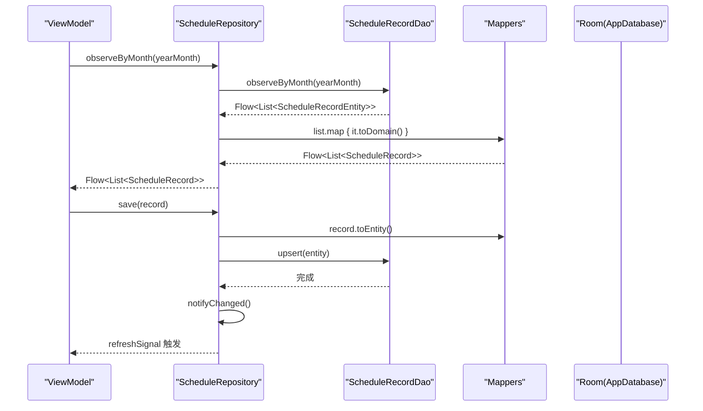
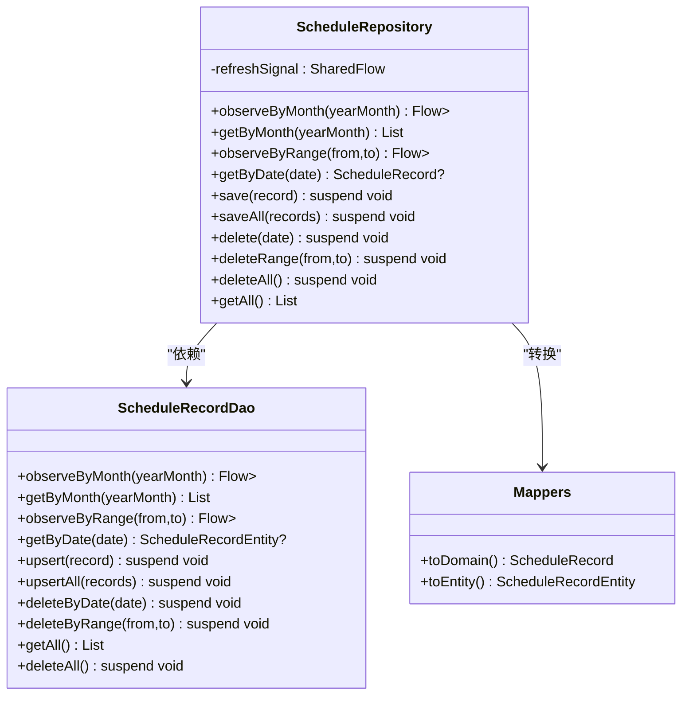
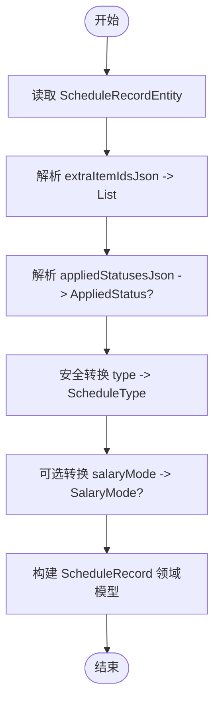
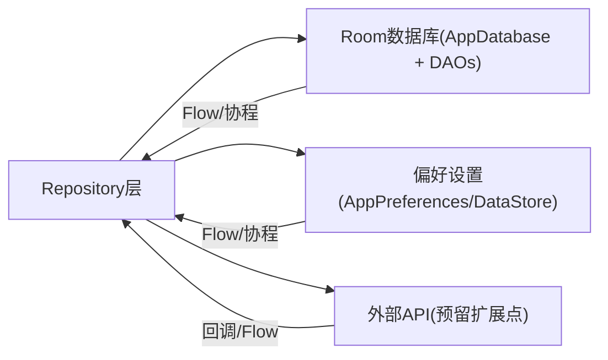
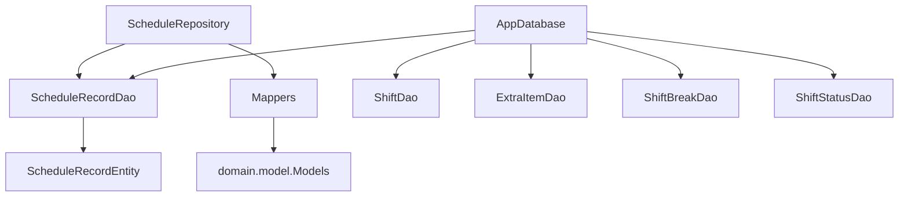

# Repository层实现

<cite>
**本文引用的文件**
- [ScheduleRepository.kt](file://app/src/main/java/com/schedulecalendar/app/data/repository/ScheduleRepository.kt)
- [Mappers.kt](file://app/src/main/java/com/schedulecalendar/app/data/repository/Mappers.kt)
- [AppDatabase.kt](file://app/src/main/java/com/schedulecalendar/app/data/db/AppDatabase.kt)
- [ScheduleRecordDao.kt](file://app/src/main/java/com/schedulecalendar/app/data/db/dao/ScheduleRecordDao.kt)
- [ShiftDao.kt](file://app/src/main/java/com/schedulecalendar/app/data/db/dao/ShiftDao.kt)
- [ExtraItemDao.kt](file://app/src/main/java/com/schedulecalendar/app/data/db/dao/ExtraItemDao.kt)
- [ShiftBreakDao.kt](file://app/src/main/java/com/schedulecalendar/app/data/db/dao/ShiftBreakDao.kt)
- [ShiftStatusDao.kt](file://app/src/main/java/com/schedulecalendar/app/data/db/dao/ShiftStatusDao.kt)
- [ScheduleRecordEntity.kt](file://app/src/main/java/com/schedulecalendar/app/data/db/entity/ScheduleRecordEntity.kt)
- [ShiftEntity.kt](file://app/src/main/java/com/schedulecalendar/app/data/db/entity/ShiftEntity.kt)
- [ExtraItemEntity.kt](file://app/src/main/java/com/schedulecalendar/app/data/db/entity/ExtraItemEntity.kt)
- [ShiftBreakEntity.kt](file://app/src/main/java/com/schedulecalendar/app/data/db/entity/ShiftBreakEntity.kt)
- [ShiftStatusEntity.kt](file://app/src/main/java/com/schedulecalendar/app/data/db/entity/ShiftStatusEntity.kt)
- [Models.kt](file://app/src/main/java/com/schedulecalendar/app/domain/model/Models.kt)
- [AppPreferences.kt](file://app/src/main/java/com/schedulecalendar/app/data/prefs/AppPreferences.kt)
- [DatabaseModule.kt](file://app/src/main/java/com/schedulecalendar/app/di/DatabaseModule.kt)
- [PreferencesModule.kt](file://app/src/main/java/com/schedulecalendar/app/di/PreferencesModule.kt)
</cite>

## 目录
1. [简介](#简介)
2. [项目结构](#项目结构)
3. [核心组件](#核心组件)
4. [架构总览](#架构总览)
5. [详细组件分析](#详细组件分析)
6. [依赖关系分析](#依赖关系分析)
7. [性能与并发](#性能与并发)
8. [故障排查指南](#故障排查指南)
9. [结论](#结论)
10. [附录：最佳实践示例路径](#附录最佳实践示例路径)

## 简介
本文件聚焦于数据访问抽象层（Repository层）的实现与设计，围绕以下目标展开：
- 解释数据源聚合、缓存策略与错误处理机制
- 深入阐述 ScheduleRepository 的核心能力：排班记录的CRUD、范围查询与变更通知
- 说明 Mappers 的数据转换逻辑：Entity 到 Domain Model 的映射与类型安全转换
- 统一数据源管理：数据库操作、偏好设置读取与外部API调用点预留
- 提供可落地的最佳实践：事务处理、并发控制与性能优化策略

## 项目结构
仓库采用分层组织方式：
- domain.model：领域模型（纯Kotlin数据类与枚举）
- data.db.entity：Room实体（持久化存储结构）
- data.db.dao：Room DAO接口（SQL与Flow流式查询）
- data.repository：Repository层（业务数据访问聚合）
- data.prefs：DataStore偏好配置
- di：Hilt依赖注入模块

图表来源
- [ScheduleRepository.kt:1-40](file://app/src/main/java/com/schedulecalendar/app/data/repository/ScheduleRepository.kt#L1-L40)
- [Mappers.kt:1-134](file://app/src/main/java/com/schedulecalendar/app/data/repository/Mappers.kt#L1-L134)
- [AppDatabase.kt:1-35](file://app/src/main/java/com/schedulecalendar/app/data/db/AppDatabase.kt#L1-L35)
- [DatabaseModule.kt:1-35](file://app/src/main/java/com/schedulecalendar/app/di/DatabaseModule.kt#L1-L35)
- [PreferencesModule.kt:1-21](file://app/src/main/java/com/schedulecalendar/app/di/PreferencesModule.kt#L1-L21)

章节来源
- [AppDatabase.kt:17-34](file://app/src/main/java/com/schedulecalendar/app/data/db/AppDatabase.kt#L17-L34)
- [DatabaseModule.kt:23-34](file://app/src/main/java/com/schedulecalendar/app/di/DatabaseModule.kt#L23-L34)
- [PreferencesModule.kt:17-20](file://app/src/main/java/com/schedulecalendar/app/di/PreferencesModule.kt#L17-L20)

## 核心组件
- ScheduleRepository：面向上层（ViewModel/UI）暴露的排班数据访问入口，封装DAO调用、类型转换与变更信号。
- Mappers：负责 Entity 与 Domain Model 的双向转换，包含JSON字段解析与枚举安全转换。
- AppDatabase + DAOs：Room数据库定义与各表DAO，提供同步与Flow异步查询。
- AppPreferences：基于DataStore的统一偏好设置读写，支持Flow响应式读取。
- DI模块：通过Hilt提供单例数据库与偏好实例。

章节来源
- [ScheduleRepository.kt:13-39](file://app/src/main/java/com/schedulecalendar/app/data/repository/ScheduleRepository.kt#L13-L39)
- [Mappers.kt:19-133](file://app/src/main/java/com/schedulecalendar/app/data/repository/Mappers.kt#L19-L133)
- [AppDatabase.kt:17-34](file://app/src/main/java/com/schedulecalendar/app/data/db/AppDatabase.kt#L17-L34)
- [AppPreferences.kt:25-64](file://app/src/main/java/com/schedulecalendar/app/data/prefs/AppPreferences.kt#L25-L64)

## 架构总览
Repository层作为数据访问抽象层，向上屏蔽底层存储细节，向下聚合多数据源（Room、DataStore），并通过Mappers保证类型安全。

图表来源
- [ScheduleRepository.kt:22-36](file://app/src/main/java/com/schedulecalendar/app/data/repository/ScheduleRepository.kt#L22-L36)
- [ScheduleRecordDao.kt:10-38](file://app/src/main/java/com/schedulecalendar/app/data/db/dao/ScheduleRecordDao.kt#L10-L38)
- [Mappers.kt:92-128](file://app/src/main/java/com/schedulecalendar/app/data/repository/Mappers.kt#L92-L128)
- [AppDatabase.kt:28-34](file://app/src/main/java/com/schedulecalendar/app/data/db/AppDatabase.kt#L28-L34)

## 详细组件分析

### ScheduleRepository 设计
职责与边界
- 对外暴露以领域模型为边界的API，避免将Entity泄露到上层。
- 提供月视图与日期范围的观察型查询（Flow），以及一次性查询（suspend）。
- 写操作后发出变更信号，供UI或ViewModel刷新。

关键能力
- 范围查询：按月份（yearMonth前缀匹配）和区间[from,to]查询。
- CRUD：保存单条/批量、删除单条/区间/全部、获取全部。
- 变更通知：内部使用SharedFlow发出Unit信号，便于订阅刷新。

并发与一致性
- DAO方法多为协程suspend函数，Repository在写入后触发通知，确保观察者收到最新数据。
- 未引入显式事务；如需跨表原子性，可在Repository内组合多个DAO调用并置于同一协程作用域中，必要时扩展至@Transaction注解的DAO方法。

图表来源
- [ScheduleRepository.kt:13-39](file://app/src/main/java/com/schedulecalendar/app/data/repository/ScheduleRepository.kt#L13-L39)
- [ScheduleRecordDao.kt:8-39](file://app/src/main/java/com/schedulecalendar/app/data/db/dao/ScheduleRecordDao.kt#L8-L39)
- [Mappers.kt:92-128](file://app/src/main/java/com/schedulecalendar/app/data/repository/Mappers.kt#L92-L128)

章节来源
- [ScheduleRepository.kt:17-36](file://app/src/main/java/com/schedulecalendar/app/data/repository/ScheduleRepository.kt#L17-L36)
- [ScheduleRecordDao.kt:10-38](file://app/src/main/java/com/schedulecalendar/app/data/db/dao/ScheduleRecordDao.kt#L10-L38)

### Mappers 数据转换逻辑
设计要点
- 双向转换：Entity ↔ Domain Model，保持单向依赖（Repository不反向依赖Entity）。
- JSON字段解析：对复杂字段（如附加项ID列表、已应用状态）使用Gson进行序列化/反序列化。
- 类型安全：枚举转换使用runCatching/getOrDefault，避免异常传播导致崩溃。

重点转换
- Shift / ShiftBreak / ShiftStatus / ExtraItem：简单字段直转。
- AppliedStatus：兼容旧版数组格式与新版单对象格式，提升迁移兼容性。
- ScheduleRecord：解析extraItemIdsJson与appliedStatusesJson，并将字符串枚举转换为对应枚举值。

图表来源
- [Mappers.kt:62-88](file://app/src/main/java/com/schedulecalendar/app/data/repository/Mappers.kt#L62-L88)
- [Mappers.kt:92-128](file://app/src/main/java/com/schedulecalendar/app/data/repository/Mappers.kt#L92-L128)

章节来源
- [Mappers.kt:19-48](file://app/src/main/java/com/schedulecalendar/app/data/repository/Mappers.kt#L19-L48)
- [Mappers.kt:50-58](file://app/src/main/java/com/schedulecalendar/app/data/repository/Mappers.kt#L50-L58)
- [Mappers.kt:62-88](file://app/src/main/java/com/schedulecalendar/app/data/repository/Mappers.kt#L62-L88)
- [Mappers.kt:92-128](file://app/src/main/java/com/schedulecalendar/app/data/repository/Mappers.kt#L92-L128)

### 数据源统一管理
- 数据库：AppDatabase集中声明所有实体与版本，DAO由Hilt提供单例。
- 偏好设置：AppPreferences封装DataStore读写，提供Flow响应式读取与便捷键常量。
- 外部API：当前代码库未见直接外部API调用；Repository层可作为未来扩展点，新增网络服务依赖并在写操作后触发变更信号。

图表来源
- [AppDatabase.kt:17-34](file://app/src/main/java/com/schedulecalendar/app/data/db/AppDatabase.kt#L17-L34)
- [AppPreferences.kt:25-64](file://app/src/main/java/com/schedulecalendar/app/data/prefs/AppPreferences.kt#L25-L64)

章节来源
- [DatabaseModule.kt:23-34](file://app/src/main/java/com/schedulecalendar/app/di/DatabaseModule.kt#L23-L34)
- [PreferencesModule.kt:17-20](file://app/src/main/java/com/schedulecalendar/app/di/PreferencesModule.kt#L17-L20)
- [AppPreferences.kt:66-101](file://app/src/main/java/com/schedulecalendar/app/data/prefs/AppPreferences.kt#L66-L101)

## 依赖关系分析
- 低耦合：Repository仅依赖DAO与Mappers，不感知具体存储实现细节。
- 高内聚：Mappers集中于类型转换逻辑，避免分散在各处。
- 注入清晰：Hilt提供单例数据库与偏好实例，降低样板代码。

图表来源
- [ScheduleRepository.kt:13-39](file://app/src/main/java/com/schedulecalendar/app/data/repository/ScheduleRepository.kt#L13-L39)
- [Mappers.kt:19-133](file://app/src/main/java/com/schedulecalendar/app/data/repository/Mappers.kt#L19-L133)
- [AppDatabase.kt:28-34](file://app/src/main/java/com/schedulecalendar/app/data/db/AppDatabase.kt#L28-L34)

章节来源
- [ScheduleRecordDao.kt:8-39](file://app/src/main/java/com/schedulecalendar/app/data/db/dao/ScheduleRecordDao.kt#L8-L39)
- [ShiftDao.kt:8-41](file://app/src/main/java/com/schedulecalendar/app/data/db/dao/ShiftDao.kt#L8-L41)
- [ExtraItemDao.kt:8-40](file://app/src/main/java/com/schedulecalendar/app/data/db/dao/ExtraItemDao.kt#L8-L40)
- [ShiftBreakDao.kt:8-38](file://app/src/main/java/com/schedulecalendar/app/data/db/dao/ShiftBreakDao.kt#L8-L38)
- [ShiftStatusDao.kt:8-38](file://app/src/main/java/com/schedulecalendar/app/data/db/dao/ShiftStatusDao.kt#L8-L38)

## 性能与并发
- 流式查询：DAO返回Flow，Repository透传并做轻量map转换，减少内存拷贝与重复计算。
- 范围查询优化：按月前缀匹配与区间比较，建议在date列建立索引以提升查询性能。
- 批量写入：upsertAll用于批量插入/更新，适合导入或同步场景。
- 变更通知：写入后发出Unit信号，避免频繁轮询；注意SharedFlow缓冲容量以避免丢事件。
- 事务建议：若需跨表原子性（例如同时更新排班记录与统计汇总），可在DAO层使用@Transaction包裹多条语句，或在Repository内协调多个DAO调用并置于同一协程上下文。

[本节为通用指导，无需源码引用]

## 故障排查指南
常见问题与建议
- 枚举转换异常：Mappers中对type与salaryMode使用安全转换，若出现空值或非法值，检查上游写入是否一致。
- JSON解析失败：extraItemIdsJson与appliedStatusesJson为空或null时，Mappers会回退到默认值；确认写入端序列化逻辑。
- 数据不同步：确认write操作后是否触发notifyChanged，且上层正确订阅refreshSignal。
- 性能问题：大范围查询时考虑分页或增量加载；为date等高频过滤字段添加索引。

章节来源
- [Mappers.kt:92-128](file://app/src/main/java/com/schedulecalendar/app/data/repository/Mappers.kt#L92-L128)
- [ScheduleRepository.kt:17-36](file://app/src/main/java/com/schedulecalendar/app/data/repository/ScheduleRepository.kt#L17-L36)

## 结论
Repository层在本项目中实现了清晰的职责分离与类型安全的转换，结合Room的Flow与协程提供了高效的响应式数据访问。Mappers保证了Entity与Domain模型的解耦与兼容性。通过统一的偏好设置管理与可扩展的外部API预留，系统具备良好的演进能力。后续可在事务与索引方面进一步优化，以满足更复杂的业务需求。

[本节为总结，无需源码引用]

## 附录：最佳实践示例路径
- 事务处理（DAO层）
  - 参考路径：[ScheduleRecordDao.kt:22-38](file://app/src/main/java/com/schedulecalendar/app/data/db/dao/ScheduleRecordDao.kt#L22-L38)
  - 建议：对需要原子性的多语句操作，使用@Transaction包裹DAO方法。
- 并发控制（Repository层）
  - 参考路径：[ScheduleRepository.kt:17-36](file://app/src/main/java/com/schedulecalendar/app/data/repository/ScheduleRepository.kt#L17-36)
  - 建议：写操作后统一触发变更信号，避免竞态条件导致的UI不一致。
- 性能优化（查询与批量）
  - 参考路径：[ScheduleRecordDao.kt:10-38](file://app/src/main/java/com/schedulecalendar/app/data/db/dao/ScheduleRecordDao.kt#L10-L38)
  - 建议：为date字段建立索引；优先使用Flow+map进行轻量转换；批量写入使用upsertAll。
- 类型安全转换（Mappers）
  - 参考路径：[Mappers.kt:92-128](file://app/src/main/java/com/schedulecalendar/app/data/repository/Mappers.kt#L92-128)
  - 建议：对枚举与JSON字段使用安全转换与默认值回退，避免崩溃。
- 数据源统一（偏好设置）
  - 参考路径：[AppPreferences.kt:66-101](file://app/src/main/java/com/schedulecalendar/app/data/prefs/AppPreferences.kt#L66-101)
  - 建议：使用Flow暴露配置变化，配合combine合并多个配置项。