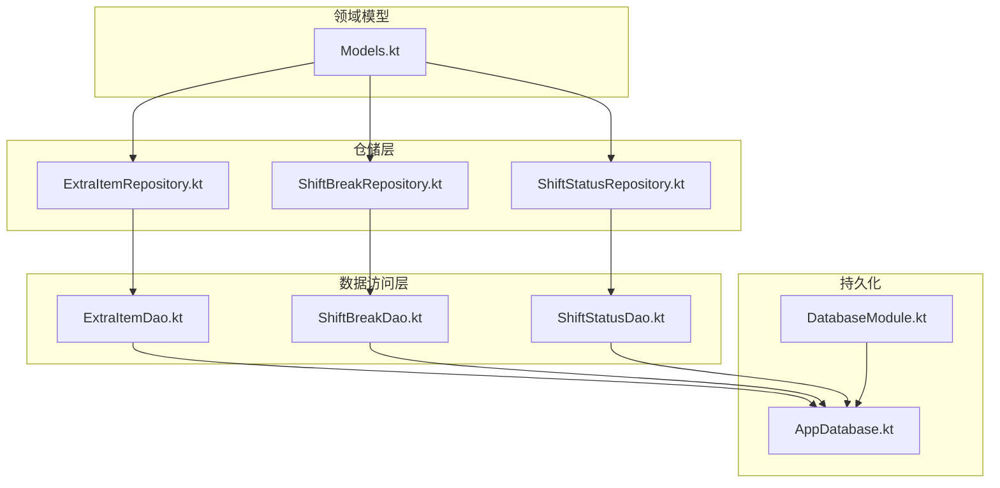
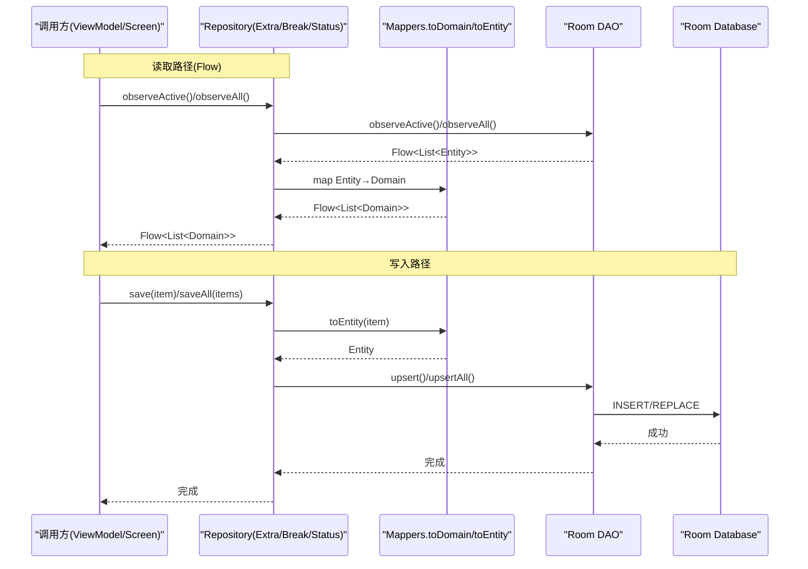
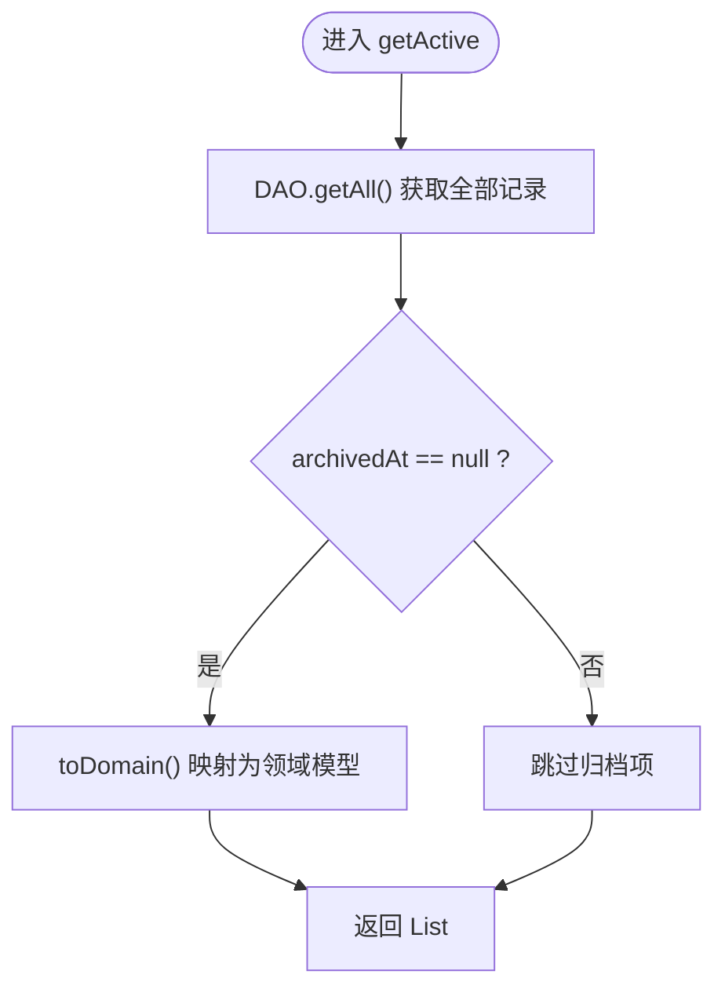
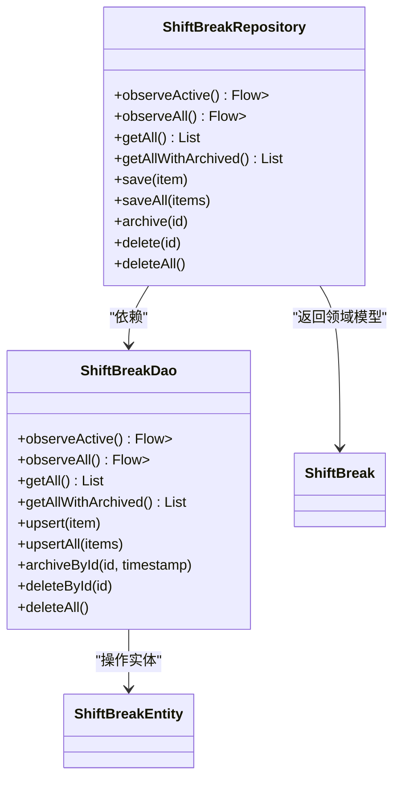
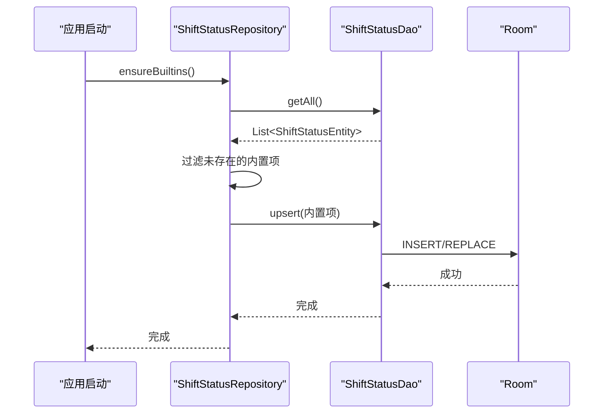
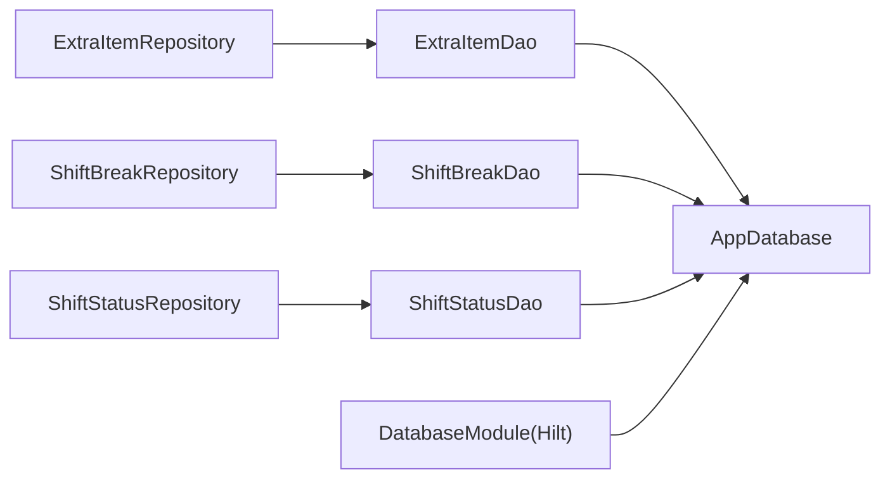

# 其他数据仓库

<cite>
**本文引用的文件**
- [ExtraItemRepository.kt](file://app/src/main/java/com/schedulecalendar/app/data/repository/ExtraItemRepository.kt)
- [ShiftBreakRepository.kt](file://app/src/main/java/com/schedulecalendar/app/data/repository/ShiftBreakRepository.kt)
- [ShiftStatusRepository.kt](file://app/src/main/java/com/schedulecalendar/app/data/repository/ShiftStatusRepository.kt)
- [ExtraItemDao.kt](file://app/src/main/java/com/schedulecalendar/app/data/db/dao/ExtraItemDao.kt)
- [ShiftBreakDao.kt](file://app/src/main/java/com/schedulecalendar/app/data/db/dao/ShiftBreakDao.kt)
- [ShiftStatusDao.kt](file://app/src/main/java/com/schedulecalendar/app/data/db/dao/ShiftStatusDao.kt)
- [ExtraItemEntity.kt](file://app/src/main/java/com/schedulecalendar/app/data/db/entity/ExtraItemEntity.kt)
- [ShiftBreakEntity.kt](file://app/src/main/java/com/schedulecalendar/app/data/db/entity/ShiftBreakEntity.kt)
- [ShiftStatusEntity.kt](file://app/src/main/java/com/schedulecalendar/app/data/db/entity/ShiftStatusEntity.kt)
- [Mappers.kt](file://app/src/main/java/com/schedulecalendar/app/data/repository/Mappers.kt)
- [Models.kt](file://app/src/main/java/com/schedulecalendar/app/domain/model/Models.kt)
- [AppDatabase.kt](file://app/src/main/java/com/schedulecalendar/app/data/db/AppDatabase.kt)
- [DatabaseModule.kt](file://app/src/main/java/com/schedulecalendar/app/di/DatabaseModule.kt)
</cite>

## 目录
1. [简介](#简介)
2. [项目结构](#项目结构)
3. [核心组件](#核心组件)
4. [架构总览](#架构总览)
5. [详细组件分析](#详细组件分析)
6. [依赖关系分析](#依赖关系分析)
7. [性能与缓存策略](#性能与缓存策略)
8. [故障排查指南](#故障排查指南)
9. [结论](#结论)
10. [附录：使用示例与最佳实践](#附录使用示例与最佳实践)

## 简介
本文件聚焦于“其他数据仓库”的实现，深入解析 ExtraItemRepository、ShiftBreakRepository 与 ShiftStatusRepository 的共同设计模式与实现策略。围绕附加项目（补贴/扣款）、休息时间（全局不计入工时时段）和状态管理（请假、调休等），阐述其业务逻辑、数据流程、跨表协作与一致性保证，并提供可操作的代码片段路径、错误处理与调试技巧，以及性能优化建议。

## 项目结构
该模块遵循清晰的分层结构：
- 领域模型层：定义业务实体与常量（如内置状态、内置班次）。
- 数据访问层：Room DAO 接口负责 SQL 查询与变更。
- 仓储层：Repository 封装业务规则、数据映射与对外 API。
- 数据库与依赖注入：AppDatabase 声明实体与版本；Hilt 提供单例数据库与 DAO。

图表来源
- [AppDatabase.kt:17-34](file://app/src/main/java/com/schedulecalendar/app/data/db/AppDatabase.kt#L17-L34)
- [DatabaseModule.kt:23-34](file://app/src/main/java/com/schedulecalendar/app/di/DatabaseModule.kt#L23-L34)
- [ExtraItemDao.kt:8-40](file://app/src/main/java/com/schedulecalendar/app/data/db/dao/ExtraItemDao.kt#L8-L40)
- [ShiftBreakDao.kt:8-38](file://app/src/main/java/com/schedulecalendar/app/data/db/dao/ShiftBreakDao.kt#L8-L38)
- [ShiftStatusDao.kt:8-38](file://app/src/main/java/com/schedulecalendar/app/data/db/dao/ShiftStatusDao.kt#L8-L38)
- [ExtraItemRepository.kt:11-30](file://app/src/main/java/com/schedulecalendar/app/data/repository/ExtraItemRepository.kt#L11-L30)
- [ShiftBreakRepository.kt:11-26](file://app/src/main/java/com/schedulecalendar/app/data/repository/ShiftBreakRepository.kt#L11-L26)
- [ShiftStatusRepository.kt:12-53](file://app/src/main/java/com/schedulecalendar/app/data/repository/ShiftStatusRepository.kt#L12-L53)
- [Models.kt:1-277](file://app/src/main/java/com/schedulecalendar/app/domain/model/Models.kt#L1-L277)

章节来源
- [AppDatabase.kt:17-34](file://app/src/main/java/com/schedulecalendar/app/data/db/AppDatabase.kt#L17-L34)
- [DatabaseModule.kt:23-34](file://app/src/main/java/com/schedulecalendar/app/di/DatabaseModule.kt#L23-L34)

## 核心组件
三个仓库共享统一的设计模式：
- 单一职责：每个仓库仅负责一类实体的读写与简单业务编排。
- 单向依赖：Repository → Dao → Room；不反向依赖上层。
- 流式观察：observeActive()/observeAll() 返回 Flow<List<T>>，便于 UI 实时刷新。
- 归档语义：通过 archivedAt 字段实现逻辑删除，保留历史数据用于统计与薪资计算。
- 映射隔离：Entity ↔ Domain 的转换集中在 Mappers.kt，避免在 Repository 中散落转换逻辑。
- 内置数据保护：ShiftStatusRepository 提供 ensureBuiltins() 与 builtIn 标记，防止误删系统默认项。

章节来源
- [ExtraItemRepository.kt:11-30](file://app/src/main/java/com/schedulecalendar/app/data/repository/ExtraItemRepository.kt#L11-L30)
- [ShiftBreakRepository.kt:11-26](file://app/src/main/java/com/schedulecalendar/app/data/repository/ShiftBreakRepository.kt#L11-L26)
- [ShiftStatusRepository.kt:12-53](file://app/src/main/java/com/schedulecalendar/app/data/repository/ShiftStatusRepository.kt#L12-L53)
- [Mappers.kt:50-58](file://app/src/main/java/com/schedulecalendar/app/data/repository/Mappers.kt#L50-L58)
- [Mappers.kt:130-134](file://app/src/main/java/com/schedulecalendar/app/data/repository/Mappers.kt#L130-L134)
- [Models.kt:74-78](file://app/src/main/java/com/schedulecalendar/app/domain/model/Models.kt#L74-L78)

## 架构总览
下图展示从调用方到数据库的完整链路，包括 Flow 观察链路与写入路径。

图表来源
- [ExtraItemRepository.kt:15-25](file://app/src/main/java/com/schedulecalendar/app/data/repository/ExtraItemRepository.kt#L15-L25)
- [ShiftBreakRepository.kt:15-21](file://app/src/main/java/com/schedulecalendar/app/data/repository/ShiftBreakRepository.kt#L15-L21)
- [ShiftStatusRepository.kt:16-48](file://app/src/main/java/com/schedulecalendar/app/data/repository/ShiftStatusRepository.kt#L16-L48)
- [Mappers.kt:50-58](file://app/src/main/java/com/schedulecalendar/app/data/repository/Mappers.kt#L50-L58)
- [Mappers.kt:130-134](file://app/src/main/java/com/schedulecalendar/app/data/repository/Mappers.kt#L130-L134)

## 详细组件分析

### 附加项目仓库（ExtraItemRepository）
- 业务职责
  - 维护补贴/扣款项目，支持有效/归档两种状态。
  - 为薪资计算提供历史金额查找能力（包含归档数据）。
- 关键方法
  - 观察与获取：observeActive()/observeAll()/getActive()/getAll()/getAllIncludingArchived()
  - 保存：save()/saveAll()
  - 归档与删除：archive()/delete()/deleteAll()
- 数据流
  - 读取：DAO 返回 Flow<List<ExtraItemEntity>> → Repository.map → Domain 列表
  - 写入：Domain → toEntity() → upsert/upsertAll
- 典型场景
  - 日历/薪资页显示当日额外收入或扣款
  - 薪资汇总时聚合历史金额（含归档）

图表来源
- [ExtraItemRepository.kt:19-22](file://app/src/main/java/com/schedulecalendar/app/data/repository/ExtraItemRepository.kt#L19-L22)
- [ExtraItemDao.kt:18-23](file://app/src/main/java/com/schedulecalendar/app/data/db/dao/ExtraItemDao.kt#L18-L23)
- [Mappers.kt:130-134](file://app/src/main/java/com/schedulecalendar/app/data/repository/Mappers.kt#L130-L134)

章节来源
- [ExtraItemRepository.kt:11-30](file://app/src/main/java/com/schedulecalendar/app/data/repository/ExtraItemRepository.kt#L11-L30)
- [ExtraItemDao.kt:8-40](file://app/src/main/java/com/schedulecalendar/app/data/db/dao/ExtraItemDao.kt#L8-L40)
- [ExtraItemEntity.kt:7-15](file://app/src/main/java/com/schedulecalendar/app/data/db/entity/ExtraItemEntity.kt#L7-L15)
- [Mappers.kt:130-134](file://app/src/main/java/com/schedulecalendar/app/data/repository/Mappers.kt#L130-L134)

### 休息时间仓库（ShiftBreakRepository）
- 业务职责
  - 维护全局不计入工时的时段（午休、用餐等），对全部班次生效。
  - 支持按时间排序与归档控制。
- 关键方法
  - 观察与获取：observeActive()/observeAll()/getAll()/getAllWithArchived()
  - 保存：save()/saveAll()
  - 归档与删除：archive()/delete()/deleteAll()
- 典型场景
  - 排班详情中扣除休息时长
  - 统计页面展示实际工作时长

图表来源
- [ShiftBreakRepository.kt:11-26](file://app/src/main/java/com/schedulecalendar/app/data/repository/ShiftBreakRepository.kt#L11-L26)
- [ShiftBreakDao.kt:8-38](file://app/src/main/java/com/schedulecalendar/app/data/db/dao/ShiftBreakDao.kt#L8-L38)
- [ShiftBreakEntity.kt:7-15](file://app/src/main/java/com/schedulecalendar/app/data/db/entity/ShiftBreakEntity.kt#L7-L15)
- [Mappers.kt:50-53](file://app/src/main/java/com/schedulecalendar/app/data/repository/Mappers.kt#L50-L53)

章节来源
- [ShiftBreakRepository.kt:11-26](file://app/src/main/java/com/schedulecalendar/app/data/repository/ShiftBreakRepository.kt#L11-L26)
- [ShiftBreakDao.kt:8-38](file://app/src/main/java/com/schedulecalendar/app/data/db/dao/ShiftBreakDao.kt#L8-L38)
- [ShiftBreakEntity.kt:7-15](file://app/src/main/java/com/schedulecalendar/app/data/db/entity/ShiftBreakEntity.kt#L7-L15)
- [Mappers.kt:50-53](file://app/src/main/java/com/schedulecalendar/app/data/repository/Mappers.kt#L50-L53)

### 状态仓库（ShiftStatusRepository）
- 业务职责
  - 管理用户自定义的班次状态（请假、外出、培训等），并内置系统默认状态。
  - 确保内置状态存在且不可被普通删除覆盖。
- 关键方法
  - 观察与获取：observeActive()/observeAll()/observeAllWithBuiltin()/getAll()/getAllWithBuiltin()
  - 初始化：ensureBuiltins() 首次启动保证内置状态存在
  - 保存：save(item) 若 builtIn 则拒绝写入
  - 归档与清理：archive()/delete()/deleteAllUserDefined()
- 典型场景
  - 排班选择器下拉列表（内置在前，去重）
  - 报表类型映射（leave/swap）

图表来源
- [ShiftStatusRepository.kt:41-46](file://app/src/main/java/com/schedulecalendar/app/data/repository/ShiftStatusRepository.kt#L41-L46)
- [ShiftStatusDao.kt:17-24](file://app/src/main/java/com/schedulecalendar/app/data/db/dao/ShiftStatusDao.kt#L17-L24)
- [Models.kt:74-78](file://app/src/main/java/com/schedulecalendar/app/domain/model/Models.kt#L74-L78)

章节来源
- [ShiftStatusRepository.kt:12-53](file://app/src/main/java/com/schedulecalendar/app/data/repository/ShiftStatusRepository.kt#L12-L53)
- [ShiftStatusDao.kt:8-38](file://app/src/main/java/com/schedulecalendar/app/data/db/dao/ShiftStatusDao.kt#L8-L38)
- [ShiftStatusEntity.kt:7-18](file://app/src/main/java/com/schedulecalendar/app/data/db/entity/ShiftStatusEntity.kt#L7-L18)
- [Models.kt:74-78](file://app/src/main/java/com/schedulecalendar/app/domain/model/Models.kt#L74-L78)

## 依赖关系分析
- 组件耦合
  - Repository 仅依赖对应 Dao，无横向耦合。
  - 所有 Dao 由 AppDatabase 暴露，并由 Hilt 提供单例实例。
- 外部依赖
  - Room 提供 Flow 与事务性写入。
  - Gson 用于复杂字段的序列化（见 Mappers.kt 中的 JSON 辅助）。
- 潜在循环
  - 当前分层清晰，未发现循环依赖。

图表来源
- [ExtraItemRepository.kt:11-14](file://app/src/main/java/com/schedulecalendar/app/data/repository/ExtraItemRepository.kt#L11-L14)
- [ShiftBreakRepository.kt:11-14](file://app/src/main/java/com/schedulecalendar/app/data/repository/ShiftBreakRepository.kt#L11-L14)
- [ShiftStatusRepository.kt:12-15](file://app/src/main/java/com/schedulecalendar/app/data/repository/ShiftStatusRepository.kt#L12-L15)
- [AppDatabase.kt:28-34](file://app/src/main/java/com/schedulecalendar/app/data/db/AppDatabase.kt#L28-L34)
- [DatabaseModule.kt:23-34](file://app/src/main/java/com/schedulecalendar/app/di/DatabaseModule.kt#L23-L34)

章节来源
- [AppDatabase.kt:17-34](file://app/src/main/java/com/schedulecalendar/app/data/db/AppDatabase.kt#L17-L34)
- [DatabaseModule.kt:23-34](file://app/src/main/java/com/schedulecalendar/app/di/DatabaseModule.kt#L23-L34)

## 性能与缓存策略
- 流式观察（懒加载）
  - observeActive()/observeAll() 基于 Room Flow，仅在数据变化时推送，避免轮询。
  - 建议在 UI 层使用 collectAsStateWithLifecycle 或类似机制，配合生命周期自动取消订阅。
- 预加载与批量写入
  - saveAll()/upsertAll() 适用于初始化内置状态或导入数据，减少往返次数。
  - ShiftStatusRepository.ensureBuiltins() 在应用启动时一次性补齐内置项。
- 查询优化
  - DAO 已按 name/startTime/builtIn 排序，避免在内存中二次排序。
  - 区分 observeActive 与 observeAll，UI 通常只需观察有效数据，减少不必要的数据量。
- 内存与对象映射
  - 将 Entity↔Domain 映射集中到 Mappers.kt，避免重复转换开销。
  - 对于大列表，尽量在 Repository 层进行必要过滤（如 getActive 过滤归档项），减少 UI 层负担。

[本节为通用性能建议，无需特定文件引用]

## 故障排查指南
- 常见错误
  - 主键冲突：使用 onConflict=REPLACE 的 upsert 可避免异常，但需确认业务允许覆盖。
  - 空值与格式：Gson 解析失败会返回空或默认值，注意日志定位。
  - 归档误删：deleteAll() 会物理删除，谨慎使用；优先 archive() 做逻辑删除。
- 日志与调试
  - 在 Repository 的关键入口添加日志（如 observeActive/save/archive），记录输入参数与耗时。
  - 使用 Room 的 SQL 日志（开发构建）验证生成的查询是否符合预期。
- 一致性保障
  - 归档时间戳使用 Instant.now()，确保顺序一致。
  - 内置状态保护：builtIn=true 的记录不应被 deleteAllUserDefined 以外的方法删除。

章节来源
- [ExtraItemDao.kt:25-39](file://app/src/main/java/com/schedulecalendar/app/data/db/dao/ExtraItemDao.kt#L25-L39)
- [ShiftBreakDao.kt:23-37](file://app/src/main/java/com/schedulecalendar/app/data/db/dao/ShiftBreakDao.kt#L23-L37)
- [ShiftStatusDao.kt:20-37](file://app/src/main/java/com/schedulecalendar/app/data/db/dao/ShiftStatusDao.kt#L20-L37)
- [Mappers.kt:68-88](file://app/src/main/java/com/schedulecalendar/app/data/repository/Mappers.kt#L68-L88)

## 结论
三个仓库采用统一的仓储模式：以 Flow 驱动 UI 实时更新，以逻辑归档保留历史数据，以集中映射保持领域与存储解耦。ShiftStatusRepository 额外承担内置数据初始化与保护职责。整体结构清晰、扩展性强，适合在考勤与薪资相关场景中复用。

[本节为总结性内容，无需特定文件引用]

## 附录：使用示例与最佳实践
以下为常用操作的路径参考，便于快速定位实现位置：
- 观察有效附加项目
  - [ExtraItemRepository.observeActive:15-16](file://app/src/main/java/com/schedulecalendar/app/data/repository/ExtraItemRepository.kt#L15-L16)
- 获取所有附加项目（含归档，用于薪资历史）
  - [ExtraItemRepository.getAllIncludingArchived:22-23](file://app/src/main/java/com/schedulecalendar/app/data/repository/ExtraItemRepository.kt#L22-L23)
- 保存单个附加项目
  - [ExtraItemRepository.save:24-24](file://app/src/main/java/com/schedulecalendar/app/data/repository/ExtraItemRepository.kt#L24-L24)
- 观察有效休息时间
  - [ShiftBreakRepository.observeActive:15-16](file://app/src/main/java/com/schedulecalendar/app/data/repository/ShiftBreakRepository.kt#L15-L16)
- 保存多个休息时间
  - [ShiftBreakRepository.saveAll:21-21](file://app/src/main/java/com/schedulecalendar/app/data/repository/ShiftBreakRepository.kt#L21-L21)
- 观察所有状态（含内置，去重）
  - [ShiftStatusRepository.observeAllWithBuiltin:24-30](file://app/src/main/java/com/schedulecalendar/app/data/repository/ShiftStatusRepository.kt#L24-L30)
- 初始化内置状态
  - [ShiftStatusRepository.ensureBuiltins:41-46](file://app/src/main/java/com/schedulecalendar/app/data/repository/ShiftStatusRepository.kt#L41-L46)
- 归档与删除
  - [ExtraItemRepository.archive/delete:26-29](file://app/src/main/java/com/schedulecalendar/app/data/repository/ExtraItemRepository.kt#L26-L29)
  - [ShiftBreakRepository.archive/delete:22-25](file://app/src/main/java/com/schedulecalendar/app/data/repository/ShiftBreakRepository.kt#L22-L25)
  - [ShiftStatusRepository.archive/delete:49-52](file://app/src/main/java/com/schedulecalendar/app/data/repository/ShiftStatusRepository.kt#L49-L52)

章节来源
- [ExtraItemRepository.kt:15-29](file://app/src/main/java/com/schedulecalendar/app/data/repository/ExtraItemRepository.kt#L15-L29)
- [ShiftBreakRepository.kt:15-25](file://app/src/main/java/com/schedulecalendar/app/data/repository/ShiftBreakRepository.kt#L15-L25)
- [ShiftStatusRepository.kt:24-52](file://app/src/main/java/com/schedulecalendar/app/data/repository/ShiftStatusRepository.kt#L24-L52)