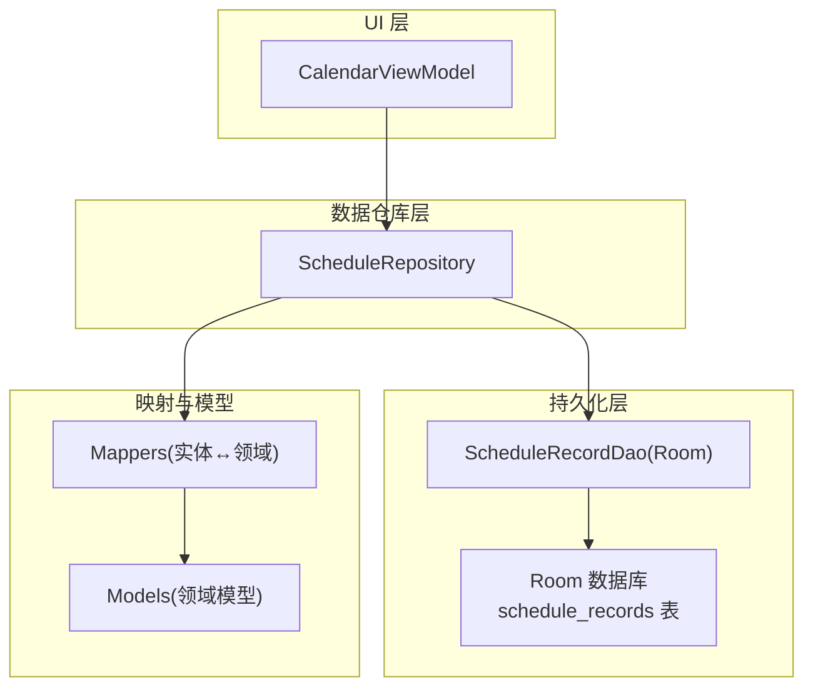
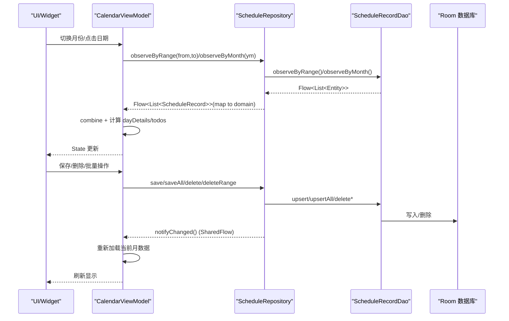
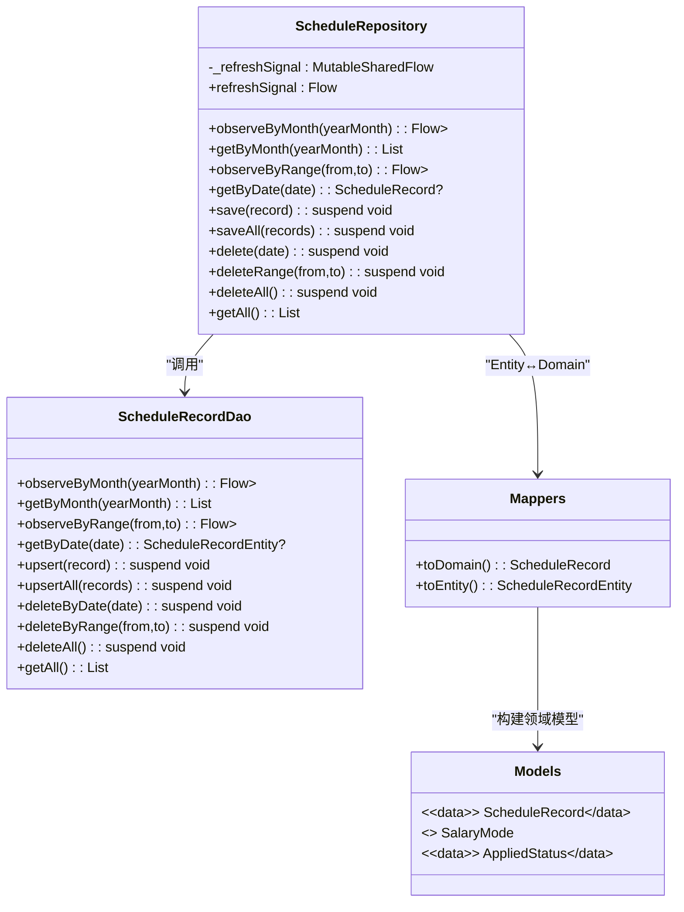
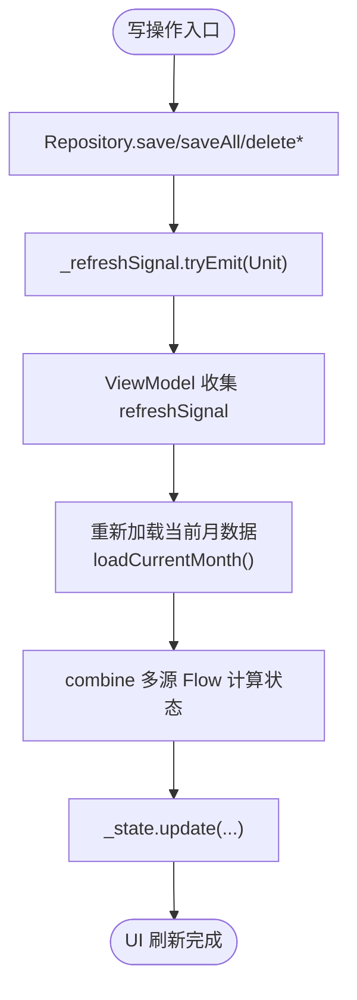
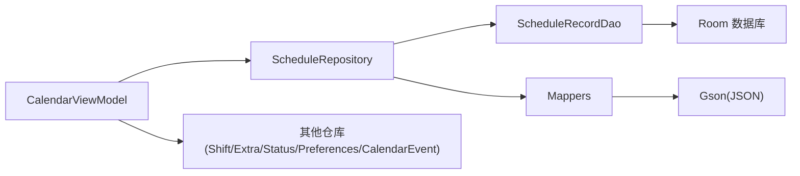

# 排班数据仓库

<cite>
**本文引用的文件**   
- [ScheduleRepository.kt](file://app/src/main/java/com/schedulecalendar/app/data/repository/ScheduleRepository.kt)
- [ScheduleRecordDao.kt](file://app/src/main/java/com/schedulecalendar/app/data/db/dao/ScheduleRecordDao.kt)
- [ScheduleRecordEntity.kt](file://app/src/main/java/com/schedulecalendar/app/data/db/entity/ScheduleRecordEntity.kt)
- [Mappers.kt](file://app/src/main/java/com/schedulecalendar/app/data/repository/Mappers.kt)
- [Models.kt](file://app/src/main/java/com/schedulecalendar/app/domain/model/Models.kt)
- [CalendarViewModel.kt](file://app/src/main/java/com/schedulecalendar/app/ui/calendar/CalendarViewModel.kt)
</cite>

## 目录
1. [简介](#简介)
2. [项目结构](#项目结构)
3. [核心组件](#核心组件)
4. [架构总览](#架构总览)
5. [详细组件分析](#详细组件分析)
6. [依赖关系分析](#依赖关系分析)
7. [性能考量](#性能考量)
8. [故障排查指南](#故障排查指南)
9. [结论](#结论)
10. [附录：使用示例与最佳实践](#附录使用示例与最佳实践)

## 简介
本文件围绕“排班数据仓库”的实现进行系统化说明，重点解析 ScheduleRepository 的核心职责、响应式数据流设计（Flow/SharedFlow）、批量操作与事务处理策略，以及 ViewModel 层的响应式更新模式。文档同时提供按月查询、日期范围查询和单条记录操作的代码路径指引，帮助读者快速理解并正确使用该模块。

## 项目结构
排班数据仓库位于 data.repository 层，通过 DAO 访问 Room 数据库，并通过 Mappers 在领域模型与实体之间转换。UI 层 CalendarViewModel 订阅仓库的响应式数据流，并在变更时刷新界面与小组件。

图表来源
- [ScheduleRepository.kt:1-40](file://app/src/main/java/com/schedulecalendar/app/data/repository/ScheduleRepository.kt#L1-L40)
- [ScheduleRecordDao.kt:1-40](file://app/src/main/java/com/schedulecalendar/app/data/db/dao/ScheduleRecordDao.kt#L1-L40)
- [ScheduleRecordEntity.kt:1-26](file://app/src/main/java/com/schedulecalendar/app/data/db/entity/ScheduleRecordEntity.kt#L1-L26)
- [Mappers.kt:1-134](file://app/src/main/java/com/schedulecalendar/app/data/repository/Mappers.kt#L1-L134)
- [Models.kt:80-100](file://app/src/main/java/com/schedulecalendar/app/domain/model/Models.kt#L80-L100)
- [CalendarViewModel.kt:104-132](file://app/src/main/java/com/schedulecalendar/app/ui/calendar/CalendarViewModel.kt#L104-L132)

章节来源
- [ScheduleRepository.kt:1-40](file://app/src/main/java/com/schedulecalendar/app/data/repository/ScheduleRepository.kt#L1-L40)
- [ScheduleRecordDao.kt:1-40](file://app/src/main/java/com/schedulecalendar/app/data/db/dao/ScheduleRecordDao.kt#L1-L40)
- [ScheduleRecordEntity.kt:1-26](file://app/src/main/java/com/schedulecalendar/app/data/db/entity/ScheduleRecordEntity.kt#L1-L26)
- [Mappers.kt:1-134](file://app/src/main/java/com/schedulecalendar/app/data/repository/Mappers.kt#L1-L134)
- [Models.kt:80-100](file://app/src/main/java/com/schedulecalendar/app/domain/model/Models.kt#L80-L100)
- [CalendarViewModel.kt:104-132](file://app/src/main/java/com/schedulecalendar/app/ui/calendar/CalendarViewModel.kt#L104-L132)

## 核心组件
- ScheduleRepository：对外暴露排班记录的 CRUD、范围查询、月度查询与响应式观察；维护一个 SharedFlow 作为写操作后的变更信号，供上层统一刷新。
- ScheduleRecordDao：基于 Room 的 DAO，定义按年月的 Flow 与 suspend 查询、upsert、批量 upsert、删除等接口。
- ScheduleRecordEntity：Room 实体，对应 schedule_records 表，包含日期、班次、打卡时间、备注、附加项 JSON、状态 JSON、薪资模式与加班确认/忽略标志等字段。
- Mappers：负责 Entity 与 Domain 模型的相互转换，包括 JSON 字段的序列化/反序列化和枚举安全解析。
- Models：领域模型定义，如 ScheduleRecord、Shift、AppliedStatus、SalaryMode 等。
- CalendarViewModel：订阅仓库的 observeByRange/observeByMonth 等 Flow，组合多源数据计算当月详情与待办事项，并在写操作后通过 refreshSignal 触发 UI 刷新。

章节来源
- [ScheduleRepository.kt:13-39](file://app/src/main/java/com/schedulecalendar/app/data/repository/ScheduleRepository.kt#L13-L39)
- [ScheduleRecordDao.kt:8-39](file://app/src/main/java/com/schedulecalendar/app/data/db/dao/ScheduleRecordDao.kt#L8-L39)
- [ScheduleRecordEntity.kt:7-25](file://app/src/main/java/com/schedulecalendar/app/data/db/entity/ScheduleRecordEntity.kt#L7-L25)
- [Mappers.kt:90-128](file://app/src/main/java/com/schedulecalendar/app/data/repository/Mappers.kt#L90-L128)
- [Models.kt:80-100](file://app/src/main/java/com/schedulecalendar/app/domain/model/Models.kt#L80-L100)
- [CalendarViewModel.kt:104-132](file://app/src/main/java/com/schedulecalendar/app/ui/calendar/CalendarViewModel.kt#L104-L132)

## 架构总览
仓库层采用响应式优先的设计：读操作返回 Flow<List<ScheduleRecord>>，写操作完成后发出变更信号，ViewModel 通过 combine 聚合多个数据源，计算展示所需的状态并更新 UI。

图表来源
- [CalendarViewModel.kt:134-246](file://app/src/main/java/com/schedulecalendar/app/ui/calendar/CalendarViewModel.kt#L134-L246)
- [ScheduleRepository.kt:22-36](file://app/src/main/java/com/schedulecalendar/app/data/repository/ScheduleRepository.kt#L22-L36)
- [ScheduleRecordDao.kt:10-38](file://app/src/main/java/com/schedulecalendar/app/data/db/dao/ScheduleRecordDao.kt#L10-L38)

## 详细组件分析

### ScheduleRepository 核心功能
- 响应式查询
  - 按月观察：observeByMonth(yearMonth) 返回 Flow<List<ScheduleRecord>>，内部调用 DAO 的 observeByMonth 并将 Entity 映射为领域模型。
  - 范围观察：observeByRange(from, to) 返回 Flow<List<ScheduleRecord>>，用于日历网格跨月填充场景。
- 一次性查询
  - getByMonth/getByDate/getAll 返回 List/单个记录，适用于非响应式场景或一次性读取。
- 增删改
  - save(record)：upsert 单条记录，随后发出变更信号。
  - saveAll(records)：批量 upsert，随后发出变更信号。
  - delete(date)/deleteRange(from,to)/deleteAll：删除指定范围或全部记录，随后发出变更信号。
- 变更通知机制
  - 私有 MutableSharedFlow<Unit> _refreshSignal，经 asSharedFlow 暴露只读 Flow。
  - 所有写操作完成后调用 notifyChanged() 发出 Unit 事件，供 ViewModel 收集并触发刷新。

图表来源
- [ScheduleRepository.kt:13-39](file://app/src/main/java/com/schedulecalendar/app/data/repository/ScheduleRepository.kt#L13-L39)
- [ScheduleRecordDao.kt:8-39](file://app/src/main/java/com/schedulecalendar/app/data/db/dao/ScheduleRecordDao.kt#L8-L39)
- [Mappers.kt:90-128](file://app/src/main/java/com/schedulecalendar/app/data/repository/Mappers.kt#L90-L128)
- [Models.kt:80-100](file://app/src/main/java/com/schedulecalendar/app/domain/model/Models.kt#L80-L100)

章节来源
- [ScheduleRepository.kt:17-36](file://app/src/main/java/com/schedulecalendar/app/data/repository/ScheduleRepository.kt#L17-L36)
- [ScheduleRecordDao.kt:10-38](file://app/src/main/java/com/schedulecalendar/app/data/db/dao/ScheduleRecordDao.kt#L10-L38)
- [Mappers.kt:90-128](file://app/src/main/java/com/schedulecalendar/app/data/repository/Mappers.kt#L90-L128)

### 响应式数据流设计与状态管理
- Flow 的使用模式
  - 读操作返回 Flow<List<ScheduleRecord>>，避免手动轮询，自动感知底层数据变化。
  - 在 ViewModel 中通过 combine 合并多个 Flow（如班次列表、排班记录、显示方案、规则），统一计算展示状态。
- SharedFlow 的变更通知机制
  - Repository 层在每次写操作后发出 Unit 事件，ViewModel 收集该信号后重新加载当前月数据，确保 UI 与数据一致。
- 状态管理策略
  - ViewModel 维护单一状态对象 CalendarUiState，包含当月排班、详情、待办、选择集、模式开关等。
  - 切月时取消旧 collectJob，防止 collector 累积泄漏；新月份加载时先设置 loading=true，数据到达后更新状态。

图表来源
- [ScheduleRepository.kt:17-21](file://app/src/main/java/com/schedulecalendar/app/data/repository/ScheduleRepository.kt#L17-L21)
- [CalendarViewModel.kt:134-246](file://app/src/main/java/com/schedulecalendar/app/ui/calendar/CalendarViewModel.kt#L134-L246)

章节来源
- [CalendarViewModel.kt:117-132](file://app/src/main/java/com/schedulecalendar/app/ui/calendar/CalendarViewModel.kt#L117-L132)
- [CalendarViewModel.kt:134-246](file://app/src/main/java/com/schedulecalendar/app/ui/calendar/CalendarViewModel.kt#L134-L246)

### 批量操作与事务处理
- upsertAll 实现原理
  - DAO 的 upsertAll 使用 @Insert(onConflict = REPLACE) 批量插入，Room 会在同一协程作用域内执行，具备原子性语义。
  - Repository.saveAll 将领域模型转换为实体列表后调用 upsertAll，随后发出变更信号。
- 事务处理建议
  - 对于超大批量写入，建议在 Repository 层显式开启事务（例如使用 Room 的事务 API）以确保一致性；当前实现依赖 Room 的默认事务行为，适合常规批量场景。
- 性能优化要点
  - 减少不必要的 map 转换：仅在需要领域模型时进行映射。
  - 控制并发：批量写入在同一协程顺序执行，避免并发竞争。
  - 合理选择查询范围：使用 observeByRange 精确覆盖日历网格所需日期，避免全表扫描。

章节来源
- [ScheduleRecordDao.kt:22-26](file://app/src/main/java/com/schedulecalendar/app/data/db/dao/ScheduleRecordDao.kt#L22-L26)
- [ScheduleRepository.kt:32-33](file://app/src/main/java/com/schedulecalendar/app/data/repository/ScheduleRepository.kt#L32-L33)

### 数据同步机制
- 小组件与日历同步
  - ViewModel 在状态更新后调用 syncCalendarWidget 等方法，将最新排班与状态同步到小组件与系统日历。
- 备份与账户初始化
  - 应用启动时执行自动备份与本地日历账户创建，保证数据可用性与一致性。

章节来源
- [CalendarViewModel.kt:240-246](file://app/src/main/java/com/schedulecalendar/app/ui/calendar/CalendarViewModel.kt#L240-L246)
- [CalendarViewModel.kt:126-132](file://app/src/main/java/com/schedulecalendar/app/ui/calendar/CalendarViewModel.kt#L126-L132)

## 依赖关系分析
- 直接依赖
  - ScheduleRepository 依赖 ScheduleRecordDao 与 Mappers。
  - CalendarViewModel 依赖 ScheduleRepository 及其他仓库（班次、附加项、状态、偏好设置、日历事件）。
- 间接依赖
  - Room 数据库通过 DAO 暴露 SQL 查询与变更流。
  - Gson 用于 JSON 字段的序列化/反序列化。
- 耦合与内聚
  - Repository 层职责清晰：仅负责数据访问与领域模型转换，不持有 UI 状态。
  - ViewModel 层集中状态管理与业务编排，保持高内聚。

图表来源
- [ScheduleRepository.kt:1-11](file://app/src/main/java/com/schedulecalendar/app/data/repository/ScheduleRepository.kt#L1-L11)
- [CalendarViewModel.kt:104-115](file://app/src/main/java/com/schedulecalendar/app/ui/calendar/CalendarViewModel.kt#L104-L115)
- [Mappers.kt:1-12](file://app/src/main/java/com/schedulecalendar/app/data/repository/Mappers.kt#L1-L12)

章节来源
- [ScheduleRepository.kt:1-11](file://app/src/main/java/com/schedulecalendar/app/data/repository/ScheduleRepository.kt#L1-L11)
- [CalendarViewModel.kt:104-115](file://app/src/main/java/com/schedulecalendar/app/ui/calendar/CalendarViewModel.kt#L104-L115)
- [Mappers.kt:1-12](file://app/src/main/java/com/schedulecalendar/app/data/repository/Mappers.kt#L1-L12)

## 性能考量
- 查询范围最小化：使用 observeByRange 精确覆盖日历网格所需日期，避免全表扫描。
- 流式合并：combine 在多源数据变化时统一计算，减少重复 IO。
- 批量写入：upsertAll 利用 Room 的批量插入能力，降低事务开销。
- 内存占用：避免在 Flow.map 中进行重型计算，必要时在 ViewModel 侧缓存中间结果。

[本节为通用指导，无需具体文件引用]

## 故障排查指南
- 写操作后 UI 未刷新
  - 检查 Repository 的 notifyChanged 是否被调用。
  - 确认 ViewModel 是否正确收集 refreshSignal 并触发 loadCurrentMonth。
- 数据不一致
  - 检查 DAO 的 onConflict 策略是否为 REPLACE，确保 upsert 覆盖旧值。
  - 验证 Mappers 的 JSON 解析是否兼容旧格式。
- 性能问题
  - 评估 observeByRange 的范围是否过大，导致过多数据加载。
  - 检查 combine 的计算逻辑是否存在重复或冗余。

章节来源
- [ScheduleRepository.kt:17-21](file://app/src/main/java/com/schedulecalendar/app/data/repository/ScheduleRepository.kt#L17-L21)
- [CalendarViewModel.kt:134-246](file://app/src/main/java/com/schedulecalendar/app/ui/calendar/CalendarViewModel.kt#L134-L246)
- [ScheduleRecordDao.kt:22-26](file://app/src/main/java/com/schedulecalendar/app/data/db/dao/ScheduleRecordDao.kt#L22-L26)
- [Mappers.kt:68-88](file://app/src/main/java/com/schedulecalendar/app/data/repository/Mappers.kt#L68-L88)

## 结论
ScheduleRepository 以响应式为核心，结合 SharedFlow 的变更通知机制，实现了高效、一致的排班数据管理。配合 ViewModel 的组合式状态管理，系统在复杂交互场景下仍能保持流畅与可维护性。批量操作与精确范围查询进一步提升了性能与用户体验。

[本节为总结，无需具体文件引用]

## 附录：使用示例与最佳实践
以下示例以“代码片段路径”的形式给出，便于读者定位实现细节。

- 按月查询（响应式）
  - 仓库方法：observeByMonth(yearMonth)
  - 参考路径：[ScheduleRepository.kt:22-23](file://app/src/main/java/com/schedulecalendar/app/data/repository/ScheduleRepository.kt#L22-L23)
  - DAO 方法：observeByMonth(yearMonth)
  - 参考路径：[ScheduleRecordDao.kt:10-11](file://app/src/main/java/com/schedulecalendar/app/data/db/dao/ScheduleRecordDao.kt#L10-L11)

- 日期范围查询（响应式）
  - 仓库方法：observeByRange(from, to)
  - 参考路径：[ScheduleRepository.kt:28-29](file://app/src/main/java/com/schedulecalendar/app/data/repository/ScheduleRepository.kt#L28-L29)
  - DAO 方法：observeByRange(from, to)
  - 参考路径：[ScheduleRecordDao.kt:19-20](file://app/src/main/java/com/schedulecalendar/app/data/db/dao/ScheduleRecordDao.kt#L19-L20)

- 单条记录操作
  - 获取单条：getByDate(date)
    - 参考路径：[ScheduleRepository.kt:31](file://app/src/main/java/com/schedulecalendar/app/data/repository/ScheduleRepository.kt#L31)
    - DAO 方法：getByDate(date)
    - 参考路径：[ScheduleRecordDao.kt:16-17](file://app/src/main/java/com/schedulecalendar/app/data/db/dao/ScheduleRecordDao.kt#L16-L17)
  - 保存单条：save(record)
    - 参考路径：[ScheduleRepository.kt:32](file://app/src/main/java/com/schedulecalendar/app/data/repository/ScheduleRepository.kt#L32)
    - DAO 方法：upsert(record)
    - 参考路径：[ScheduleRecordDao.kt:22-23](file://app/src/main/java/com/schedulecalendar/app/data/db/dao/ScheduleRecordDao.kt#L22-L23)
  - 删除单条：delete(date)
    - 参考路径：[ScheduleRepository.kt:34](file://app/src/main/java/com/schedulecalendar/app/data/repository/ScheduleRepository.kt#L34)
    - DAO 方法：deleteByDate(date)
    - 参考路径：[ScheduleRecordDao.kt:28-29](file://app/src/main/java/com/schedulecalendar/app/data/db/dao/ScheduleRecordDao.kt#L28-L29)

- 批量操作
  - 批量保存：saveAll(records)
    - 参考路径：[ScheduleRepository.kt:33](file://app/src/main/java/com/schedulecalendar/app/data/repository/ScheduleRepository.kt#L33)
    - DAO 方法：upsertAll(records)
    - 参考路径：[ScheduleRecordDao.kt:25-26](file://app/src/main/java/com/schedulecalendar/app/data/db/dao/ScheduleRecordDao.kt#L25-L26)

- 变更信号与 ViewModel 响应式更新
  - 仓库变更信号：refreshSignal
    - 参考路径：[ScheduleRepository.kt:17-21](file://app/src/main/java/com/schedulecalendar/app/data/repository/ScheduleRepository.kt#L17-L21)
  - ViewModel 收集与刷新：loadCurrentMonth 中使用 combine 聚合数据并更新状态
    - 参考路径：[CalendarViewModel.kt:134-246](file://app/src/main/java/com/schedulecalendar/app/ui/calendar/CalendarViewModel.kt#L134-L246)

- 领域模型与实体映射
  - 领域模型：ScheduleRecord
    - 参考路径：[Models.kt:80-100](file://app/src/main/java/com/schedulecalendar/app/domain/model/Models.kt#L80-L100)
  - 实体模型：ScheduleRecordEntity
    - 参考路径：[ScheduleRecordEntity.kt:7-25](file://app/src/main/java/com/schedulecalendar/app/data/db/entity/ScheduleRecordEntity.kt#L7-L25)
  - 映射函数：toDomain/toEntity
    - 参考路径：[Mappers.kt:90-128](file://app/src/main/java/com/schedulecalendar/app/data/repository/Mappers.kt#L90-L128)

[本节为使用指引，无需额外图示]