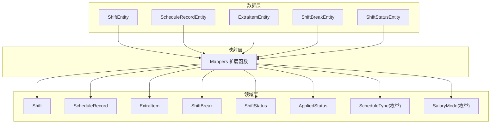
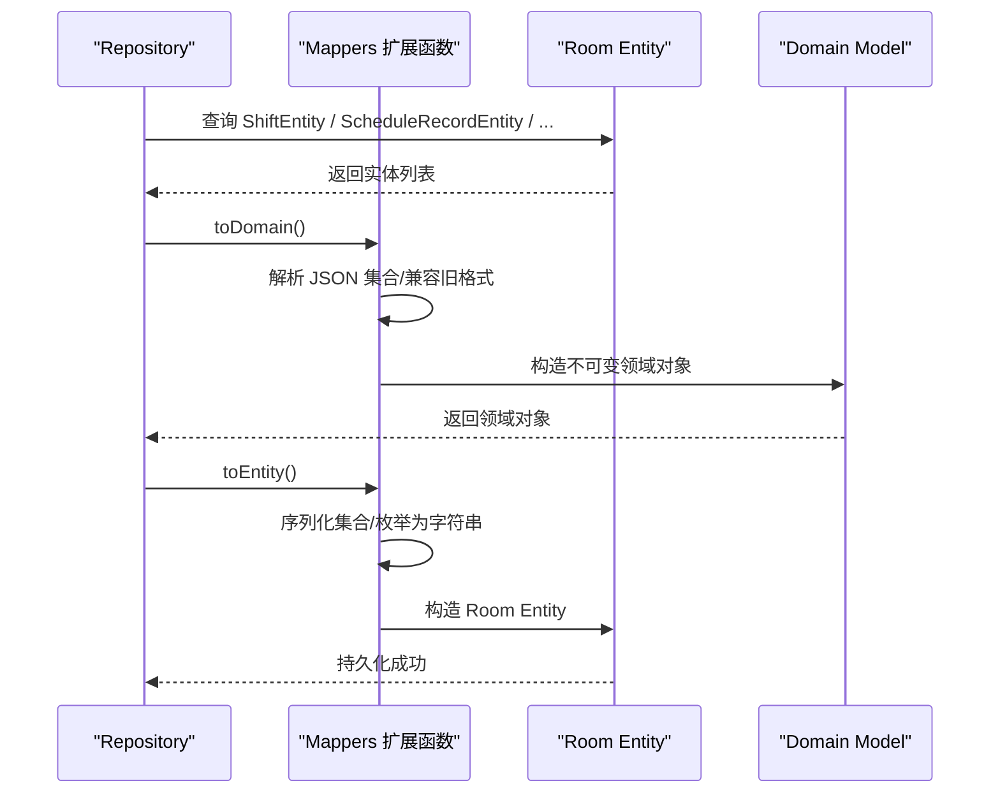
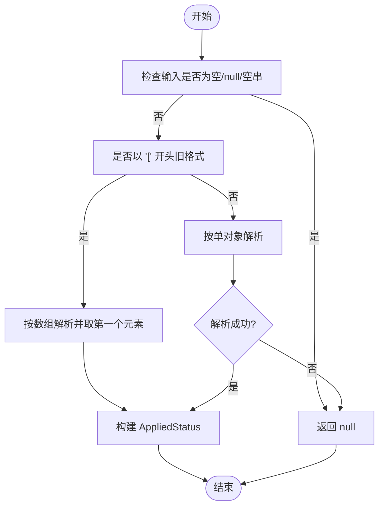
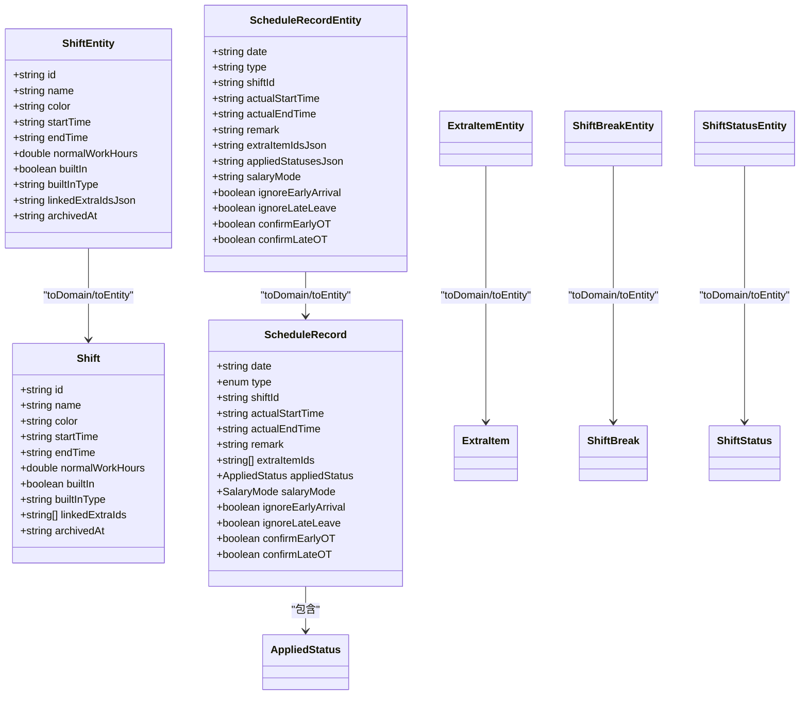
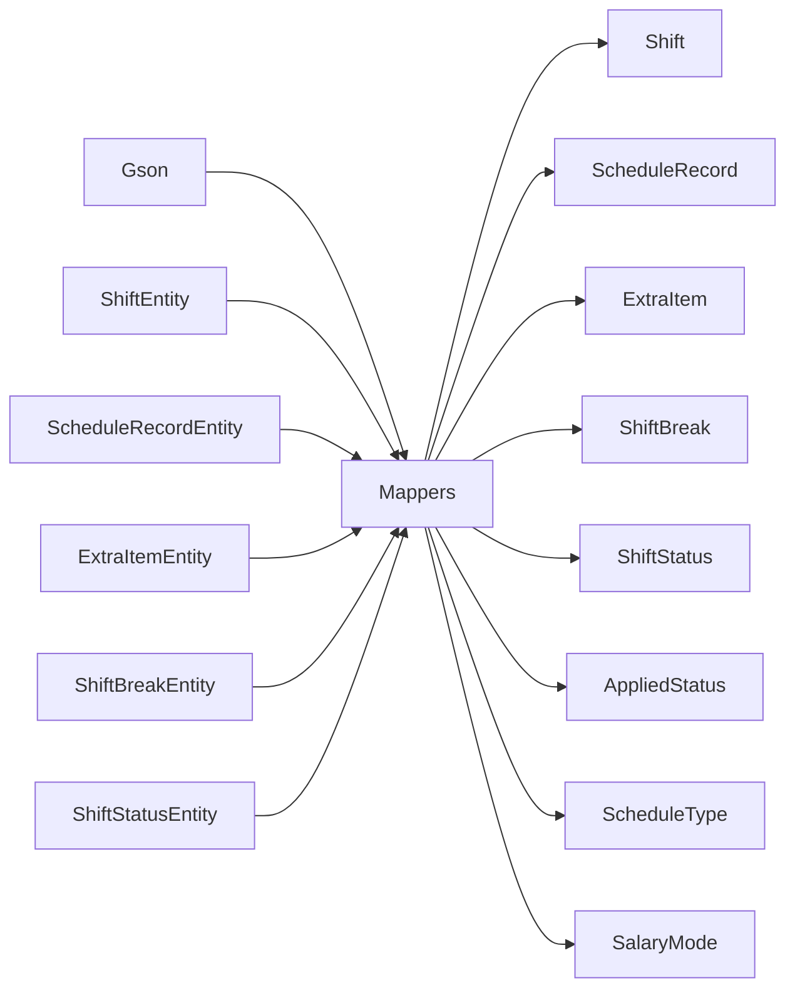

# 数据映射器

<cite>
**本文引用的文件**   
- [Mappers.kt](file://app/src/main/java/com/schedulecalendar/app/data/repository/Mappers.kt)
- [Models.kt](file://app/src/main/java/com/schedulecalendar/app/domain/model/Models.kt)
- [ShiftEntity.kt](file://app/src/main/java/com/schedulecalendar/app/data/db/entity/ShiftEntity.kt)
- [ScheduleRecordEntity.kt](file://app/src/main/java/com/schedulecalendar/app/data/db/entity/ScheduleRecordEntity.kt)
- [ExtraItemEntity.kt](file://app/src/main/java/com/schedulecalendar/app/data/db/entity/ExtraItemEntity.kt)
- [ShiftBreakEntity.kt](file://app/src/main/java/com/schedulecalendar/app/data/db/entity/ShiftBreakEntity.kt)
- [ShiftStatusEntity.kt](file://app/src/main/java/com/schedulecalendar/app/data/db/entity/ShiftStatusEntity.kt)
</cite>

## 目录
1. [简介](#简介)
2. [项目结构](#项目结构)
3. [核心组件](#核心组件)
4. [架构总览](#架构总览)
5. [详细组件分析](#详细组件分析)
6. [依赖关系分析](#依赖关系分析)
7. [性能与内存优化建议](#性能与内存优化建议)
8. [故障排查指南](#故障排查指南)
9. [结论](#结论)

## 简介
本文件聚焦于 Mappers 模块的数据映射实现，系统性阐述从数据库实体（Entity）到领域模型（Domain Model）的双向转换机制。文档覆盖类型安全策略、空值处理、默认值设置、复杂对象（嵌套对象、集合、枚举）的映射逻辑，并提供扩展性与可维护性设计建议，以及性能优化与内存使用最佳实践。

## 项目结构
本项目采用分层组织：
- 数据层：Room Entity 定义持久化表结构与字段
- 领域层：不可变数据类与枚举表达业务语义
- 映射层：在 Repository 包下集中提供扩展函数完成双向转换

图表来源
- [Mappers.kt:1-134](file://app/src/main/java/com/schedulecalendar/app/data/repository/Mappers.kt#L1-L134)
- [Models.kt:1-277](file://app/src/main/java/com/schedulecalendar/app/domain/model/Models.kt#L1-L277)
- [ShiftEntity.kt:1-24](file://app/src/main/java/com/schedulecalendar/app/data/db/entity/ShiftEntity.kt#L1-L24)
- [ScheduleRecordEntity.kt:1-26](file://app/src/main/java/com/schedulecalendar/app/data/db/entity/ScheduleRecordEntity.kt#L1-L26)
- [ExtraItemEntity.kt:1-16](file://app/src/main/java/com/schedulecalendar/app/data/db/entity/ExtraItemEntity.kt#L1-L16)
- [ShiftBreakEntity.kt:1-16](file://app/src/main/java/com/schedulecalendar/app/data/db/entity/ShiftBreakEntity.kt#L1-L16)
- [ShiftStatusEntity.kt:1-19](file://app/src/main/java/com/schedulecalendar/app/data/db/entity/ShiftStatusEntity.kt#L1-L19)

章节来源
- [Mappers.kt:1-134](file://app/src/main/java/com/schedulecalendar/app/data/repository/Mappers.kt#L1-L134)
- [Models.kt:1-277](file://app/src/main/java/com/schedulecalendar/app/domain/model/Models.kt#L1-L277)
- [ShiftEntity.kt:1-24](file://app/src/main/java/com/schedulecalendar/app/data/db/entity/ShiftEntity.kt#L1-L24)
- [ScheduleRecordEntity.kt:1-26](file://app/src/main/java/com/schedulecalendar/app/data/db/entity/ScheduleRecordEntity.kt#L1-L26)
- [ExtraItemEntity.kt:1-16](file://app/src/main/java/com/schedulecalendar/app/data/db/entity/ExtraItemEntity.kt#L1-L16)
- [ShiftBreakEntity.kt:1-16](file://app/src/main/java/com/schedulecalendar/app/data/db/entity/ShiftBreakEntity.kt#L1-L16)
- [ShiftStatusEntity.kt:1-19](file://app/src/main/java/com/schedulecalendar/app/data/db/entity/ShiftStatusEntity.kt#L1-L19)

## 核心组件
- 映射入口：位于 Repository 包的 Mappers 文件，以扩展函数形式暴露 toDomain()/toEntity() 方法，职责单一、易于定位与维护。
- 领域模型：全部为不可变 data class 与 enum，保证状态稳定与线程安全。
- 实体模型：Room @Entity 注解的数据类，字段与数据库列一一对应。
- JSON 辅助：通过 Gson 将集合与复杂对象序列化为字符串存储，并在读取时反序列化。

章节来源
- [Mappers.kt:1-134](file://app/src/main/java/com/schedulecalendar/app/data/repository/Mappers.kt#L1-L134)
- [Models.kt:1-277](file://app/src/main/java/com/schedulecalendar/app/domain/model/Models.kt#L1-L277)
- [ShiftEntity.kt:1-24](file://app/src/main/java/com/schedulecalendar/app/data/db/entity/ShiftEntity.kt#L1-L24)
- [ScheduleRecordEntity.kt:1-26](file://app/src/main/java/com/schedulecalendar/app/data/db/entity/ScheduleRecordEntity.kt#L1-L26)
- [ExtraItemEntity.kt:1-16](file://app/src/main/java/com/schedulecalendar/app/data/db/entity/ExtraItemEntity.kt#L1-L16)
- [ShiftBreakEntity.kt:1-16](file://app/src/main/java/com/schedulecalendar/app/data/db/entity/ShiftBreakEntity.kt#L1-L16)
- [ShiftStatusEntity.kt:1-19](file://app/src/main/java/com/schedulecalendar/app/data/db/entity/ShiftStatusEntity.kt#L1-L19)

## 架构总览
下图展示 Entity 与 Domain 之间的双向映射流程，包括集合与枚举的安全转换、JSON 解析与兼容旧格式的处理路径。

图表来源
- [Mappers.kt:1-134](file://app/src/main/java/com/schedulecalendar/app/data/repository/Mappers.kt#L1-L134)
- [Models.kt:1-277](file://app/src/main/java/com/schedulecalendar/app/domain/model/Models.kt#L1-L277)
- [ShiftEntity.kt:1-24](file://app/src/main/java/com/schedulecalendar/app/data/db/entity/ShiftEntity.kt#L1-L24)
- [ScheduleRecordEntity.kt:1-26](file://app/src/main/java/com/schedulecalendar/app/data/db/entity/ScheduleRecordEntity.kt#L1-L26)
- [ExtraItemEntity.kt:1-16](file://app/src/main/java/com/schedulecalendar/app/data/db/entity/ExtraItemEntity.kt#L1-L16)
- [ShiftBreakEntity.kt:1-16](file://app/src/main/java/com/schedulecalendar/app/data/db/entity/ShiftBreakEntity.kt#L1-L16)
- [ShiftStatusEntity.kt:1-19](file://app/src/main/java/com/schedulecalendar/app/data/db/entity/ShiftStatusEntity.kt#L1-L19)

## 详细组件分析

### 映射模式与类型安全策略
- 扩展函数式映射：每个实体提供 toDomain()/toEntity() 扩展，调用方无需记忆具体类名，IDE 自动补全友好。
- 枚举安全转换：使用“尝试解析 + 回退默认”的策略，避免非法枚举值导致崩溃。
- 集合与 JSON：对 List<String> 等集合统一通过 Gson 进行序列化/反序列化，并保证空串或 null 场景下的默认行为。
- 空值与默认值：
  - 缺失或空 JSON 字符串时，集合映射为空列表；
  - 可选时间字段允许为 null；
  - 布尔型字段提供 false 作为默认值；
  - 数值型字段保留 null 表示未配置。

章节来源
- [Mappers.kt:1-134](file://app/src/main/java/com/schedulecalendar/app/data/repository/Mappers.kt#L1-L134)
- [Models.kt:1-277](file://app/src/main/java/com/schedulecalendar/app/domain/model/Models.kt#L1-L277)

### 基础类型映射示例说明
- 字符串：直接赋值，如日期 yyyy-MM-dd、时间 HH:mm、备注等。
- 数值：Double? 用于正常班时长等可选数值；Int 用于计数类字段。
- 布尔：ignoreEarlyArrival、confirmLateOT 等开关字段。
- 枚举：ScheduleType、SalaryMode 通过 name/valueOf 安全转换。

章节来源
- [Mappers.kt:90-128](file://app/src/main/java/com/schedulecalendar/app/data/repository/Mappers.kt#L90-L128)
- [Models.kt:44-49](file://app/src/main/java/com/schedulecalendar/app/domain/model/Models.kt#L44-L49)
- [ScheduleRecordEntity.kt:1-26](file://app/src/main/java/com/schedulecalendar/app/data/db/entity/ScheduleRecordEntity.kt#L1-L26)

### 集合类型映射（List<String>）
- 关联补贴/扣款 ID 列表：
  - 写入：将 List<String> 序列化为 JSON 字符串存入实体；
  - 读取：从 JSON 字符串反序列化为 List<String>，若为空或 null 则回退为空列表。
- 适用场景：Shift.linkedExtraIds、ScheduleRecord.extraItemIds。

章节来源
- [Mappers.kt:19-48](file://app/src/main/java/com/schedulecalendar/app/data/repository/Mappers.kt#L19-L48)
- [Mappers.kt:92-128](file://app/src/main/java/com/schedulecalendar/app/data/repository/Mappers.kt#L92-L128)
- [ShiftEntity.kt:1-24](file://app/src/main/java/com/schedulecalendar/app/data/db/entity/ShiftEntity.kt#L1-L24)
- [ScheduleRecordEntity.kt:1-26](file://app/src/main/java/com/schedulecalendar/app/data/db/entity/ScheduleRecordEntity.kt#L1-L26)

### 复杂对象映射（嵌套对象与兼容旧格式）
- AppliedStatus 解析：
  - 支持旧版数组格式 [{...}] 与新版单对象格式 {...}；
  - 当 JSON 为空、null 或空串时返回 null；
  - 解析失败时捕获异常并返回 null，确保健壮性。
- 写入：将 AppliedStatus 序列化为单对象 JSON，null 时输出固定字符串。

图表来源
- [Mappers.kt:60-89](file://app/src/main/java/com/schedulecalendar/app/data/repository/Mappers.kt#L60-L89)

章节来源
- [Mappers.kt:60-89](file://app/src/main/java/com/schedulecalendar/app/data/repository/Mappers.kt#L60-L89)
- [Models.kt:37-42](file://app/src/main/java/com/schedulecalendar/app/domain/model/Models.kt#L37-L42)

### 枚举映射与容错
- ScheduleType：
  - 读取时尝试 valueOf，失败回退为 SHIFT；
  - 写入时使用 name 保存。
- SalaryMode：
  - 读取时尝试 valueOf，失败返回 null；
  - 写入时使用 name 保存，允许 null。

章节来源
- [Mappers.kt:92-128](file://app/src/main/java/com/schedulecalendar/app/data/repository/Mappers.kt#L92-L128)
- [Models.kt:44-49](file://app/src/main/java/com/schedulecalendar/app/domain/model/Models.kt#L44-L49)

### 一对一简单对象映射
- ShiftBreak、ShiftStatus、ExtraItem：
  - 字段一一映射，无复杂逻辑；
  - 注意 archivedAt 可为 null，表示有效记录。

章节来源
- [Mappers.kt:50-59](file://app/src/main/java/com/schedulecalendar/app/data/repository/Mappers.kt#L50-L59)
- [Mappers.kt:130-134](file://app/src/main/java/com/schedulecalendar/app/data/repository/Mappers.kt#L130-L134)
- [ShiftBreakEntity.kt:1-16](file://app/src/main/java/com/schedulecalendar/app/data/db/entity/ShiftBreakEntity.kt#L1-L16)
- [ShiftStatusEntity.kt:1-19](file://app/src/main/java/com/schedulecalendar/app/data/db/entity/ShiftStatusEntity.kt#L1-L19)
- [ExtraItemEntity.kt:1-16](file://app/src/main/java/com/schedulecalendar/app/data/db/entity/ExtraItemEntity.kt#L1-L16)
- [Models.kt:14-35](file://app/src/main/java/com/schedulecalendar/app/domain/model/Models.kt#L14-L35)

### 关键类与关系图

图表来源
- [Mappers.kt:1-134](file://app/src/main/java/com/schedulecalendar/app/data/repository/Mappers.kt#L1-L134)
- [Models.kt:1-277](file://app/src/main/java/com/schedulecalendar/app/domain/model/Models.kt#L1-L277)
- [ShiftEntity.kt:1-24](file://app/src/main/java/com/schedulecalendar/app/data/db/entity/ShiftEntity.kt#L1-L24)
- [ScheduleRecordEntity.kt:1-26](file://app/src/main/java/com/schedulecalendar/app/data/db/entity/ScheduleRecordEntity.kt#L1-L26)
- [ExtraItemEntity.kt:1-16](file://app/src/main/java/com/schedulecalendar/app/data/db/entity/ExtraItemEntity.kt#L1-L16)
- [ShiftBreakEntity.kt:1-16](file://app/src/main/java/com/schedulecalendar/app/data/db/entity/ShiftBreakEntity.kt#L1-L16)
- [ShiftStatusEntity.kt:1-19](file://app/src/main/java/com/schedulecalendar/app/data/db/entity/ShiftStatusEntity.kt#L1-L19)

## 依赖关系分析
- 外部依赖：Gson 用于 JSON 序列化/反序列化。
- 内部依赖：
  - Mappers 依赖 Models 中的领域对象与枚举；
  - Mappers 依赖各 Entity 类的字段定义；
  - 无循环依赖，职责清晰。

图表来源
- [Mappers.kt:1-134](file://app/src/main/java/com/schedulecalendar/app/data/repository/Mappers.kt#L1-L134)
- [Models.kt:1-277](file://app/src/main/java/com/schedulecalendar/app/domain/model/Models.kt#L1-L277)
- [ShiftEntity.kt:1-24](file://app/src/main/java/com/schedulecalendar/app/data/db/entity/ShiftEntity.kt#L1-L24)
- [ScheduleRecordEntity.kt:1-26](file://app/src/main/java/com/schedulecalendar/app/data/db/entity/ScheduleRecordEntity.kt#L1-L26)
- [ExtraItemEntity.kt:1-16](file://app/src/main/java/com/schedulecalendar/app/data/db/entity/ExtraItemEntity.kt#L1-L16)
- [ShiftBreakEntity.kt:1-16](file://app/src/main/java/com/schedulecalendar/app/data/db/entity/ShiftBreakEntity.kt#L1-L16)
- [ShiftStatusEntity.kt:1-19](file://app/src/main/java/com/schedulecalendar/app/data/db/entity/ShiftStatusEntity.kt#L1-L19)

章节来源
- [Mappers.kt:1-134](file://app/src/main/java/com/schedulecalendar/app/data/repository/Mappers.kt#L1-L134)

## 性能与内存优化建议
- 复用 Gson 实例：当前已使用私有静态变量复用，避免频繁创建带来的开销。
- 批量映射优化：
  - 对大量记录的 toDomain()/toEntity() 调用，建议在 Repository 层合并为批量操作，减少重复解析与对象创建；
  - 对于只读场景，考虑延迟解析 JSON 集合，仅在访问相关字段时再反序列化。
- 字符串拼接与临时对象：
  - 避免在映射过程中产生不必要的中间字符串；
  - 尽量使用不可变对象构造器一次性赋值，减少后续修改。
- 内存占用：
  - 大集合（extraItemIds、linkedExtraIds）在高频读写场景下，评估是否需要分页加载或按需加载；
  - 对 Archived 数据进行归档清理，降低主库体积。
- 错误路径成本：
  - 解析异常分支应尽量轻量，避免在异常路径中执行重计算。

[本节为通用指导，不直接分析具体文件]

## 故障排查指南
- JSON 解析失败：
  - 现象：AppliedStatus 解析抛出异常或返回 null；
  - 排查：确认 stored JSON 是否符合预期格式（旧数组/新对象），必要时增加日志打印原始 JSON；
  - 修复：保持向后兼容逻辑，确保空串/null 均能安全返回 null。
- 枚举值不匹配：
  - 现象：valueOf 抛异常；
  - 排查：检查数据库中存储的枚举名称是否与领域枚举一致；
  - 修复：采用“尝试解析 + 回退默认”的策略，避免崩溃。
- 集合为空：
  - 现象：extraItemIdsJson 或 linkedExtraIdsJson 为空或 null；
  - 排查：确认写入时是否正确序列化；
  - 修复：读取时统一回退为空列表，避免 NPE。

章节来源
- [Mappers.kt:60-89](file://app/src/main/java/com/schedulecalendar/app/data/repository/Mappers.kt#L60-L89)
- [Mappers.kt:92-128](file://app/src/main/java/com/schedulecalendar/app/data/repository/Mappers.kt#L92-L128)

## 结论
Mappers 模块以扩展函数为核心，围绕不可变领域模型与 Room 实体之间提供简洁、安全的映射能力。通过统一的 JSON 处理、枚举安全转换与空值默认策略，实现了良好的健壮性与可维护性。未来可在批量映射、延迟解析与版本迁移方面进一步优化，以提升性能与兼容性。