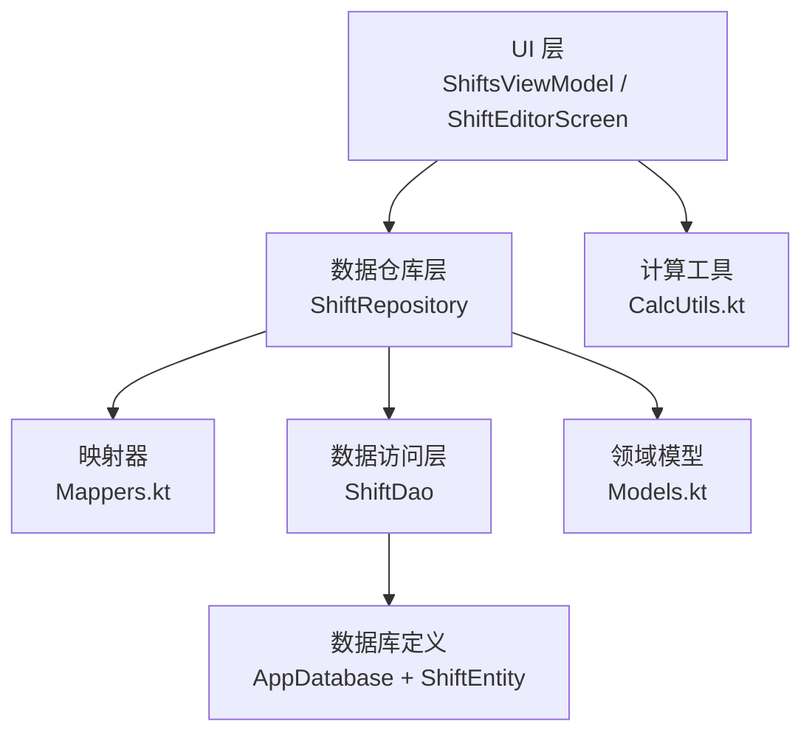
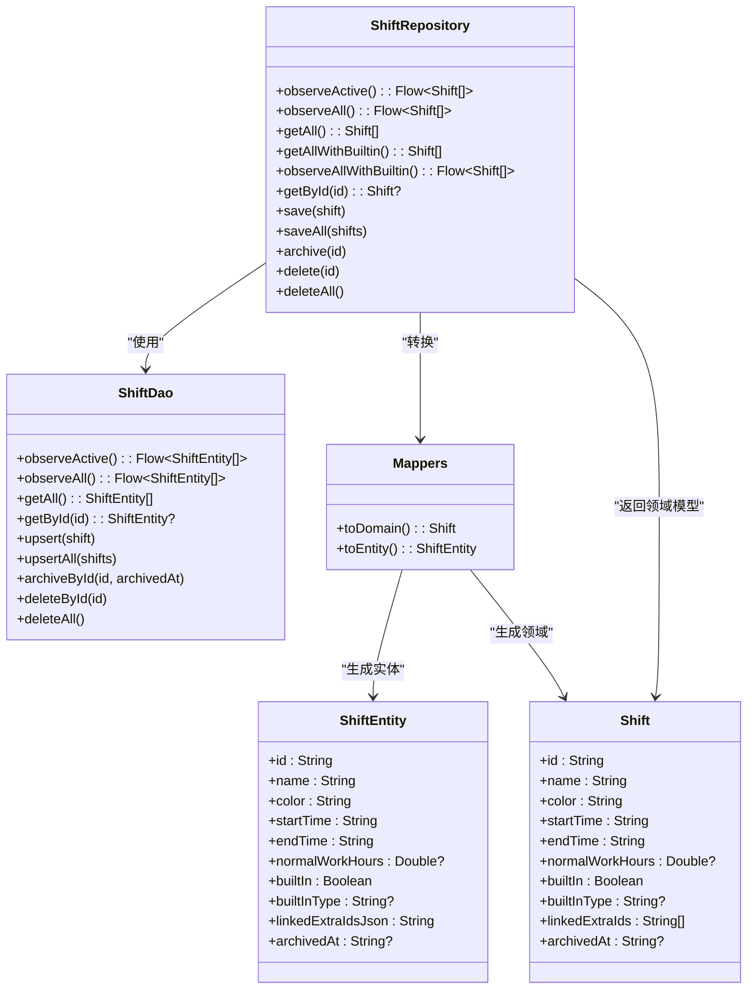
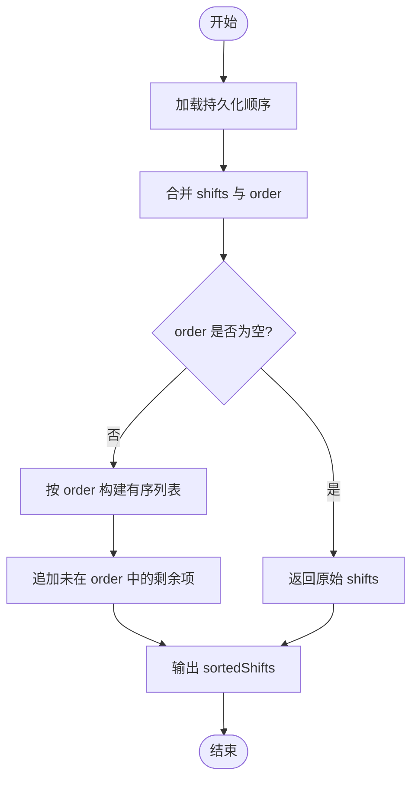
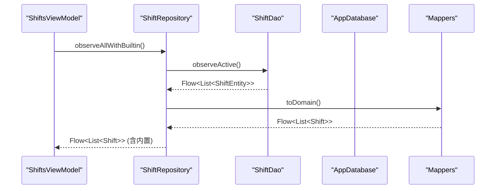
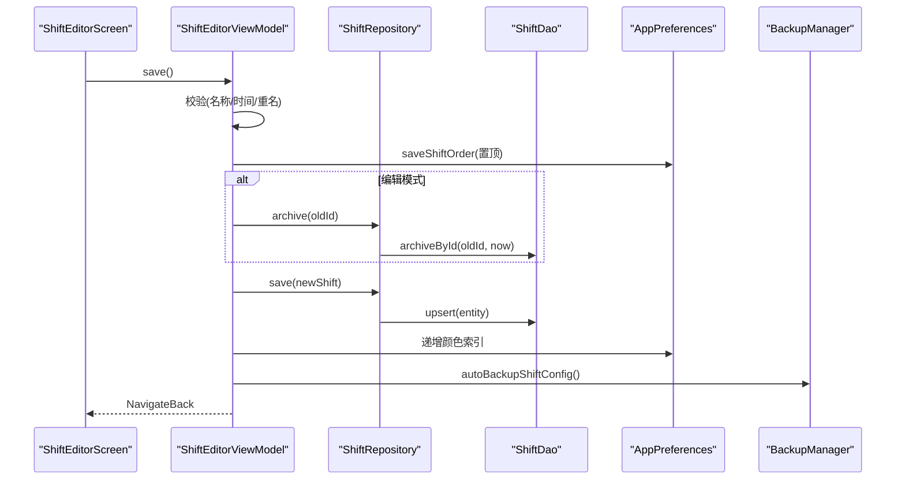
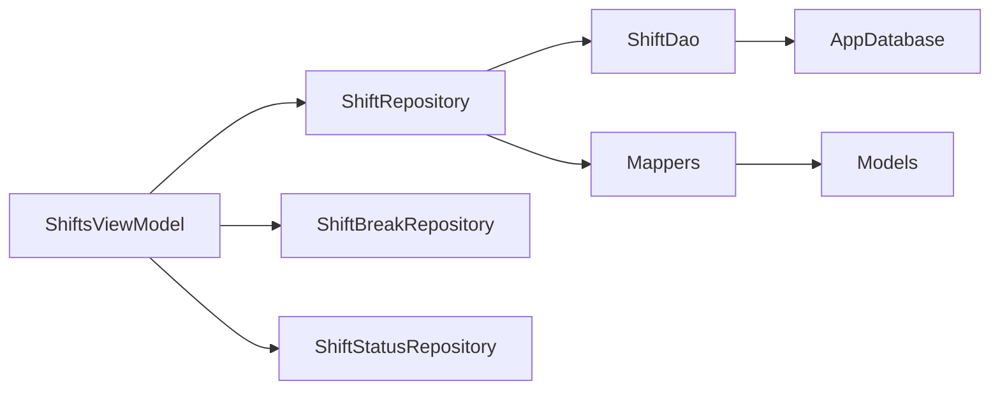

# 班次数据仓库

<cite>
**本文引用的文件**   
- [ShiftRepository.kt](file://app/src/main/java/com/schedulecalendar/app/data/repository/ShiftRepository.kt)
- [ShiftDao.kt](file://app/src/main/java/com/schedulecalendar/app/data/db/dao/ShiftDao.kt)
- [ShiftEntity.kt](file://app/src/main/java/com/schedulecalendar/app/data/db/entity/ShiftEntity.kt)
- [Mappers.kt](file://app/src/main/java/com/schedulecalendar/app/data/repository/Mappers.kt)
- [Models.kt](file://app/src/main/java/com/schedulecalendar/app/domain/model/Models.kt)
- [AppDatabase.kt](file://app/src/main/java/com/schedulecalendar/app/data/db/AppDatabase.kt)
- [ShiftsViewModel.kt](file://app/src/main/java/com/schedulecalendar/app/ui/shifts/ShiftsViewModel.kt)
- [ShiftEditorScreen.kt](file://app/src/main/java/com/schedulecalendar/app/ui/shifts/ShiftEditorScreen.kt)
- [CalcUtils.kt](file://app/src/main/java/com/schedulecalendar/app/domain/model/CalcUtils.kt)
</cite>

## 目录
1. [简介](#简介)
2. [项目结构](#项目结构)
3. [核心组件](#核心组件)
4. [架构总览](#架构总览)
5. [详细组件分析](#详细组件分析)
6. [依赖关系分析](#依赖关系分析)
7. [性能考量](#性能考量)
8. [故障排查指南](#故障排查指南)
9. [结论](#结论)
10. [附录：操作示例与最佳实践](#附录操作示例与最佳实践)

## 简介
本文件围绕“班次数据仓库”的实现进行系统化说明，重点解析 ShiftRepository 的设计模式、CRUD 能力、排序管理与归档逻辑；阐述班次配置从创建到删除的完整生命周期；解释与排班系统的集成（班次 ID 关联与外键约束处理）；并提供具体代码路径以展示创建、编辑、删除、查询等典型操作。同时给出排序算法实现与自定义排序规则的配置方法，以及错误处理与异常场景的最佳实践。

## 项目结构
本项目采用分层架构：UI 层通过 ViewModel 调用 Repository，Repository 封装领域模型与持久化 DAO 之间的映射与业务规则，DAO 基于 Room 访问 SQLite 数据库。

图表来源
- [ShiftsViewModel.kt:1-120](file://app/src/main/java/com/schedulecalendar/app/ui/shifts/ShiftsViewModel.kt#L1-L120)
- [ShiftRepository.kt:1-45](file://app/src/main/java/com/schedulecalendar/app/data/repository/ShiftRepository.kt#L1-L45)
- [Mappers.kt:17-48](file://app/src/main/java/com/schedulecalendar/app/data/repository/Mappers.kt#L17-L48)
- [ShiftDao.kt:1-42](file://app/src/main/java/com/schedulecalendar/app/data/db/dao/ShiftDao.kt#L1-L42)
- [AppDatabase.kt:17-34](file://app/src/main/java/com/schedulecalendar/app/data/db/AppDatabase.kt#L17-L34)
- [Models.kt:50-78](file://app/src/main/java/com/schedulecalendar/app/domain/model/Models.kt#L50-L78)
- [CalcUtils.kt:115-134](file://app/src/main/java/com/schedulecalendar/app/domain/model/CalcUtils.kt#L115-L134)

章节来源
- [AppDatabase.kt:17-34](file://app/src/main/java/com/schedulecalendar/app/data/db/AppDatabase.kt#L17-L34)
- [ShiftDao.kt:1-42](file://app/src/main/java/com/schedulecalendar/app/data/db/dao/ShiftDao.kt#L1-L42)
- [ShiftEntity.kt:1-24](file://app/src/main/java/com/schedulecalendar/app/data/db/entity/ShiftEntity.kt#L1-L24)
- [ShiftRepository.kt:1-45](file://app/src/main/java/com/schedulecalendar/app/data/repository/ShiftRepository.kt#L1-L45)
- [Mappers.kt:17-48](file://app/src/main/java/com/schedulecalendar/app/data/repository/Mappers.kt#L17-L48)
- [Models.kt:50-78](file://app/src/main/java/com/schedulecalendar/app/domain/model/Models.kt#L50-L78)
- [ShiftsViewModel.kt:54-117](file://app/src/main/java/com/schedulecalendar/app/ui/shifts/ShiftsViewModel.kt#L54-L117)
- [CalcUtils.kt:115-134](file://app/src/main/java/com/schedulecalendar/app/domain/model/CalcUtils.kt#L115-L134)

## 核心组件
- 领域模型 Shift：包含班次标识、名称、颜色、起止时间、正常工时阈值、是否内置、内置类型、默认关联补贴/扣款项、归档时间戳等字段。
- 实体类 ShiftEntity：Room 表映射，使用 JSON 存储关联的额外项 ID 列表，archivedAt 用于逻辑删除。
- DAO 接口 ShiftDao：提供观察有效/全部、插入/替换、归档、删除等操作。
- 仓库 ShiftRepository：对外暴露 Flow/List API，合并内置班次，屏蔽 builtIn 写入，统一转换领域模型。
- 映射器 Mappers：负责 Entity 与 Domain 的双向转换，包括 JSON 数组序列化/反序列化。
- 视图模型 ShiftsViewModel：编排排序、导入导出、自动备份、事件分发等上层业务。
- 编辑器界面 ShiftEditorScreen：收集用户输入，触发保存流程并显示校验错误。
- 计算工具 CalcUtils：提供全局休息时段扣减、工时分类、薪资计算等。

章节来源
- [Models.kt:50-78](file://app/src/main/java/com/schedulecalendar/app/domain/model/Models.kt#L50-L78)
- [ShiftEntity.kt:1-24](file://app/src/main/java/com/schedulecalendar/app/data/db/entity/ShiftEntity.kt#L1-L24)
- [ShiftDao.kt:1-42](file://app/src/main/java/com/schedulecalendar/app/data/db/dao/ShiftDao.kt#L1-L42)
- [ShiftRepository.kt:1-45](file://app/src/main/java/com/schedulecalendar/app/data/repository/ShiftRepository.kt#L1-L45)
- [Mappers.kt:17-48](file://app/src/main/java/com/schedulecalendar/app/data/repository/Mappers.kt#L17-L48)
- [ShiftsViewModel.kt:54-117](file://app/src/main/java/com/schedulecalendar/app/ui/shifts/ShiftsViewModel.kt#L54-L117)
- [ShiftEditorScreen.kt:36-50](file://app/src/main/java/com/schedulecalendar/app/ui/shifts/ShiftEditorScreen.kt#L36-L50)
- [CalcUtils.kt:115-134](file://app/src/main/java/com/schedulecalendar/app/domain/model/CalcUtils.kt#L115-L134)

## 架构总览
ShiftRepository 作为数据仓库，承担以下职责：
- 聚合内置班次与用户自定义班次，提供 observeAllWithBuiltin 等组合流。
- 屏蔽 builtIn 字段的直接写入，避免外部误改内置数据。
- 将 Entity 与 Domain 模型转换委托给 Mappers。
- 提供归档（逻辑删除）与物理删除两种策略。
- 为上层提供 Flow 驱动的数据订阅，支持实时排序与 UI 响应。

图表来源
- [ShiftRepository.kt:1-45](file://app/src/main/java/com/schedulecalendar/app/data/repository/ShiftRepository.kt#L1-L45)
- [ShiftDao.kt:1-42](file://app/src/main/java/com/schedulecalendar/app/data/db/dao/ShiftDao.kt#L1-L42)
- [ShiftEntity.kt:1-24](file://app/src/main/java/com/schedulecalendar/app/data/db/entity/ShiftEntity.kt#L1-L24)
- [Mappers.kt:17-48](file://app/src/main/java/com/schedulecalendar/app/data/repository/Mappers.kt#L17-L48)
- [Models.kt:50-78](file://app/src/main/java/com/schedulecalendar/app/domain/model/Models.kt#L50-L78)

## 详细组件分析

### ShiftRepository 设计与核心功能
- 设计模式
  - 单例注入：@Singleton 配合 @Inject 构造，确保应用级唯一实例。
  - 门面模式：对 DAO 和映射器进行封装，向上暴露简洁 API。
  - 组合模式：在 observeAllWithBuiltin 中组合内置与用户数据，保证 UI 一致性。
- CRUD 操作
  - 创建/更新：save/saveAll 仅对非内置班次执行 upsert，避免覆盖内置数据。
  - 读取：getAll/getById/observeActive/observeAll/observeAllWithBuiltin 提供同步与异步流式读取。
  - 删除：archive 为逻辑删除（设置 archivedAt），delete/deleteAll 为物理删除。
- 排序管理
  - 仓库本身不维护排序顺序，但 expose 的 observeAllWithBuiltin 结合上层 StateFlow 与内存 order 列表，实现即时排序与后台持久化。
- 归档逻辑
  - archive 调用 DAO 的 update 语句设置 archivedAt，便于历史数据保留与恢复。

章节来源
- [ShiftRepository.kt:12-44](file://app/src/main/java/com/schedulecalendar/app/data/repository/ShiftRepository.kt#L12-L44)
- [ShiftDao.kt:23-41](file://app/src/main/java/com/schedulecalendar/app/data/db/dao/ShiftDao.kt#L23-L41)
- [Mappers.kt:17-48](file://app/src/main/java/com/schedulecalendar/app/data/repository/Mappers.kt#L17-L48)
- [Models.kt:50-78](file://app/src/main/java/com/schedulecalendar/app/domain/model/Models.kt#L50-L78)

### 排序算法与自定义排序规则
- 内存排序
  - ShiftsViewModel 维护 _shiftOrder 内存状态，combine shifts 与 order 得到 sortedShifts，优先按用户指定顺序排列，未出现在 order 中的元素追加至末尾。
- 持久化
  - moveShiftUp/moveShiftDown 更新内存顺序后，调用 prefs.saveShiftOrder 持久化。
- 初始化与刷新
  - init 中加载持久化顺序，并在 shifts 变化时重新加载，确保新增/编辑后顺序正确。
- 自定义规则
  - 可通过移动上移/下移调整顺序；如需更复杂规则，可在 combine 中扩展排序逻辑。

图表来源
- [ShiftsViewModel.kt:54-83](file://app/src/main/java/com/schedulecalendar/app/ui/shifts/ShiftsViewModel.kt#L54-L83)
- [ShiftsViewModel.kt:140-170](file://app/src/main/java/com/schedulecalendar/app/ui/shifts/ShiftsViewModel.kt#L140-L170)

章节来源
- [ShiftsViewModel.kt:54-83](file://app/src/main/java/com/schedulecalendar/app/ui/shifts/ShiftsViewModel.kt#L54-L83)
- [ShiftsViewModel.kt:140-170](file://app/src/main/java/com/schedulecalendar/app/ui/shifts/ShiftsViewModel.kt#L140-L170)

### 与排班系统的集成关系
- 班次 ID 关联
  - ScheduleRecord 通过 shiftId 引用 Shift.id，用于计算每日工时与薪资。
- 外键约束处理
  - 当前数据库未声明显式外键约束，依赖逻辑一致性与业务层校验（如根据 shiftId 查找 Shift）。
  - 当 Shift 被归档或删除时，相关排班记录仍保留，但计算时会忽略无效班次。
- 内置班次参与
  - observeAllWithBuiltin 将内置班次（休息/调休/请假）与用户自定义班次合并，供排班选择与历史展示。

图表来源
- [ShiftRepository.kt:27-32](file://app/src/main/java/com/schedulecalendar/app/data/repository/ShiftRepository.kt#L27-L32)
- [ShiftDao.kt:10-15](file://app/src/main/java/com/schedulecalendar/app/data/db/dao/ShiftDao.kt#L10-L15)
- [Mappers.kt:17-35](file://app/src/main/java/com/schedulecalendar/app/data/repository/Mappers.kt#L17-L35)
- [Models.kt:80-100](file://app/src/main/java/com/schedulecalendar/app/domain/model/Models.kt#L80-L100)

章节来源
- [Models.kt:80-100](file://app/src/main/java/com/schedulecalendar/app/domain/model/Models.kt#L80-L100)
- [ShiftRepository.kt:27-32](file://app/src/main/java/com/schedulecalendar/app/data/repository/ShiftRepository.kt#L27-L32)
- [ShiftDao.kt:10-15](file://app/src/main/java/com/schedulecalendar/app/data/db/dao/ShiftDao.kt#L10-L15)
- [Mappers.kt:17-35](file://app/src/main/java/com/schedulecalendar/app/data/repository/Mappers.kt#L17-L35)

### 班次配置的完整生命周期管理
- 创建
  - 用户在 ShiftEditorScreen 填写信息，ShiftEditorViewModel.save 进行校验（名称非空、时间完整、重名检查），然后：
    - 更新内存排序顺序（新建置顶）
    - 若为编辑：先归档旧记录，再保存新记录（新 ID）
    - 递增预设颜色索引
    - 触发自动备份
- 编辑
  - 同创建流程，区别在于先归档旧记录，再保存新记录，保持历史可追溯。
- 删除
  - 提供两种策略：
    - 归档：archive 设置 archivedAt，保留历史数据
    - 物理删除：delete/deleteAll 直接移除
- 查询
  - 支持 observeActive/observeAll/observeAllWithBuiltin 等流式查询，以及 getAll/getById 同步查询。

图表来源
- [ShiftEditorScreen.kt:222-228](file://app/src/main/java/com/schedulecalendar/app/ui/shifts/ShiftEditorScreen.kt#L222-L228)
- [ShiftsViewModel.kt:403-453](file://app/src/main/java/com/schedulecalendar/app/ui/shifts/ShiftsViewModel.kt#L403-L453)
- [ShiftRepository.kt:37-42](file://app/src/main/java/com/schedulecalendar/app/data/repository/ShiftRepository.kt#L37-L42)
- [ShiftDao.kt:29-31](file://app/src/main/java/com/schedulecalendar/app/data/db/dao/ShiftDao.kt#L29-L31)

章节来源
- [ShiftEditorScreen.kt:36-50](file://app/src/main/java/com/schedulecalendar/app/ui/shifts/ShiftEditorScreen.kt#L36-L50)
- [ShiftsViewModel.kt:403-453](file://app/src/main/java/com/schedulecalendar/app/ui/shifts/ShiftsViewModel.kt#L403-L453)
- [ShiftRepository.kt:37-42](file://app/src/main/java/com/schedulecalendar/app/data/repository/ShiftRepository.kt#L37-L42)
- [ShiftDao.kt:29-31](file://app/src/main/java/com/schedulecalendar/app/data/db/dao/ShiftDao.kt#L29-L31)

### 错误处理与异常情况最佳实践
- 输入校验
  - 名称为空、时间不完整、重名时，通过 uiEvent 抛出错误消息，UI 层显示提示。
- 保存失败
  - 使用 runCatching 捕获异常，统一发送 ShowError 事件，避免崩溃。
- 导入/导出
  - 导入时校验 JSON 格式，失败则提示；导出时捕获异常并提示。
- 归档与删除
  - 归档不会破坏历史排班记录，删除需谨慎，建议在 UI 层二次确认。

章节来源
- [ShiftsViewModel.kt:403-453](file://app/src/main/java/com/schedulecalendar/app/ui/shifts/ShiftsViewModel.kt#L403-L453)
- [ShiftsViewModel.kt:274-327](file://app/src/main/java/com/schedulecalendar/app/ui/shifts/ShiftsViewModel.kt#L274-L327)
- [ShiftEditorScreen.kt:43-50](file://app/src/main/java/com/schedulecalendar/app/ui/shifts/ShiftEditorScreen.kt#L43-L50)

## 依赖关系分析
- 组件耦合
  - ShiftRepository 依赖 ShiftDao 与 Mappers，低耦合高内聚。
  - ShiftsViewModel 依赖多个 Repository 与 Preferences，编排业务逻辑。
- 外部依赖
  - Room 数据库与 Gson 序列化。
- 潜在循环依赖
  - 未发现循环依赖，模块边界清晰。

图表来源
- [ShiftsViewModel.kt:46-52](file://app/src/main/java/com/schedulecalendar/app/ui/shifts/ShiftsViewModel.kt#L46-L52)
- [ShiftRepository.kt:12-15](file://app/src/main/java/com/schedulecalendar/app/data/repository/ShiftRepository.kt#L12-L15)
- [AppDatabase.kt:17-34](file://app/src/main/java/com/schedulecalendar/app/data/db/AppDatabase.kt#L17-L34)
- [Mappers.kt:17-48](file://app/src/main/java/com/schedulecalendar/app/data/repository/Mappers.kt#L17-L48)
- [Models.kt:50-78](file://app/src/main/java/com/schedulecalendar/app/domain/model/Models.kt#L50-L78)

章节来源
- [ShiftsViewModel.kt:46-52](file://app/src/main/java/com/schedulecalendar/app/ui/shifts/ShiftsViewModel.kt#L46-L52)
- [ShiftRepository.kt:12-15](file://app/src/main/java/com/schedulecalendar/app/data/repository/ShiftRepository.kt#L12-L15)
- [AppDatabase.kt:17-34](file://app/src/main/java/com/schedulecalendar/app/data/db/AppDatabase.kt#L17-L34)
- [Mappers.kt:17-48](file://app/src/main/java/com/schedulecalendar/app/data/repository/Mappers.kt#L17-L48)
- [Models.kt:50-78](file://app/src/main/java/com/schedulecalendar/app/domain/model/Models.kt#L50-L78)

## 性能考量
- 流式查询
  - observeActive/observeAll 使用 Flow，减少重复 IO，提升 UI 响应性。
- 内存排序
  - 通过内存 order 列表与 combine 实现即时排序，避免频繁数据库排序。
- 批量操作
  - upsertAll 支持批量插入/替换，适合导入场景。
- 计算优化
  - CalcUtils 提供小时差、跨天归一化、全局休息段扣减等高效计算函数。

[本节为通用指导，无需特定文件引用]

## 故障排查指南
- 常见问题
  - 名称重复：保存前进行重名校验，提示修改。
  - 时间缺失：校验 startTime/endTime 非空。
  - 导入失败：检查 JSON 结构与版本兼容。
- 定位步骤
  - 查看 uiEvent 的错误消息。
  - 检查数据库 schema 版本与迁移脚本。
  - 确认 Flow 订阅是否正确释放。

章节来源
- [ShiftsViewModel.kt:403-453](file://app/src/main/java/com/schedulecalendar/app/ui/shifts/ShiftsViewModel.kt#L403-L453)
- [ShiftsViewModel.kt:274-327](file://app/src/main/java/com/schedulecalendar/app/ui/shifts/ShiftsViewModel.kt#L274-L327)
- [AppDatabase.kt:17-27](file://app/src/main/java/com/schedulecalendar/app/data/db/AppDatabase.kt#L17-L27)

## 结论
ShiftRepository 通过清晰的层次划分与稳健的封装，提供了完整的班次数据管理能力。结合 ShiftsViewModel 的排序编排与 ShiftEditorScreen 的用户交互，实现了从创建到删除的全生命周期管理。与排班系统通过 shiftId 建立松耦合关联，保证了数据一致性与可扩展性。建议在生产环境中继续完善外键约束与数据迁移策略，以提升数据完整性与可维护性。

[本节为总结，无需特定文件引用]

## 附录：操作示例与最佳实践
- 创建班次
  - 参考路径：[ShiftEditorScreen.kt:222-228](file://app/src/main/java/com/schedulecalendar/app/ui/shifts/ShiftEditorScreen.kt#L222-L228)、[ShiftsViewModel.kt:403-453](file://app/src/main/java/com/schedulecalendar/app/ui/shifts/ShiftsViewModel.kt#L403-L453)
- 编辑班次
  - 参考路径：[ShiftsViewModel.kt:403-453](file://app/src/main/java/com/schedulecalendar/app/ui/shifts/ShiftsViewModel.kt#L403-L453)
- 删除班次
  - 归档：参考路径：[ShiftsViewModel.kt:135-138](file://app/src/main/java/com/schedulecalendar/app/ui/shifts/ShiftsViewModel.kt#L135-L138)
  - 物理删除：参考路径：[ShiftRepository.kt:42-43](file://app/src/main/java/com/schedulecalendar/app/data/repository/ShiftRepository.kt#L42-L43)
- 查询班次
  - 观察有效：参考路径：[ShiftRepository.kt:17](file://app/src/main/java/com/schedulecalendar/app/data/repository/ShiftRepository.kt#L17)
  - 观察全部（含内置）：参考路径：[ShiftRepository.kt:27-32](file://app/src/main/java/com/schedulecalendar/app/data/repository/ShiftRepository.kt#L27-L32)
  - 同步获取：参考路径：[ShiftRepository.kt:23-26](file://app/src/main/java/com/schedulecalendar/app/data/repository/ShiftRepository.kt#L23-L26)
- 排序配置
  - 上移/下移：参考路径：[ShiftsViewModel.kt:146-170](file://app/src/main/java/com/schedulecalendar/app/ui/shifts/ShiftsViewModel.kt#L146-L170)
  - 持久化顺序：参考路径：[ShiftsViewModel.kt:140-144](file://app/src/main/java/com/schedulecalendar/app/ui/shifts/ShiftsViewModel.kt#L140-L144)
- 错误处理
  - 保存失败：参考路径：[ShiftsViewModel.kt:449-452](file://app/src/main/java/com/schedulecalendar/app/ui/shifts/ShiftsViewModel.kt#L449-L452)
  - 导入失败：参考路径：[ShiftsViewModel.kt:324-327](file://app/src/main/java/com/schedulecalendar/app/ui/shifts/ShiftsViewModel.kt#L324-L327)

[本节为操作指引，无需特定文件引用]