# CalendarViewModel核心实现

<cite>
**本文引用的文件**   
- [CalendarViewModel.kt](file://app/src/main/java/com/schedulecalendar/app/ui/calendar/CalendarViewModel.kt)
- [BackupManager.kt](file://app/src/main/java/com/schedulecalendar/app/ui/settings/BackupManager.kt)
- [CalendarEventRepository.kt](file://app/src/main/java/com/schedulecalendar/app/data/calendar/CalendarEventRepository.kt)
- [ScheduleGlanceWidget.kt](file://app/src/main/java/com/schedulecalendar/app/widget/ScheduleGlanceWidget.kt)
- [CalendarScreen.kt](file://app/src/main/java/com/schedulecalendar/app/ui/calendar/CalendarScreen.kt)
- [Models.kt](file://app/src/main/java/com/schedulecalendar/app/domain/model/Models.kt)
- [CalcUtils.kt](file://app/src/main/java/com/schedulecalendar/app/domain/model/CalcUtils.kt)
- [ScheduleRepository.kt](file://app/src/main/java/com/schedulecalendar/app/data/repository/ScheduleRepository.kt)
- [ShiftRepository.kt](file://app/src/main/java/com/schedulecalendar/app/data/repository/ShiftRepository.kt)
- [ShiftStatusRepository.kt](file://app/src/main/java/com/schedulecalendar/app/data/repository/ShiftStatusRepository.kt)
- [ExtraItemRepository.kt](file://app/src/main/java/com/schedulecalendar/app/data/repository/ExtraItemRepository.kt)
- [CalendarEventRepository.kt](file://app/src/main/java/com/schedulecalendar/app/data/calendar/CalendarEventRepository.kt)
</cite>

## 更新摘要
**变更内容**   
- **新增** 延迟执行机制：自动备份功能和日历账户创建现在使用延迟执行（500ms和1000ms）以避免阻塞首帧渲染
- **优化** 生命周期管理：移除了不必要的生命周期监听器，优化了内存使用和响应性
- **增强** 应用启动性能：通过非阻塞初始化显著提升应用启动速度和用户体验

## 目录
1. [简介](#简介)
2. [项目结构](#项目结构)
3. [核心组件](#核心组件)
4. [架构总览](#架构总览)
5. [详细组件分析](#详细组件分析)
6. [依赖关系分析](#依赖关系分析)
7. [性能考量](#性能考量)
8. [故障排查指南](#故障排查指南)
9. [结论](#结论)

## 简介
本文件聚焦于 CalendarViewModel 的核心实现，系统性阐述其作为应用日历模块业务逻辑载体的职责边界与数据流设计。重点覆盖：
- 状态管理：以 MutableStateFlow 驱动 UI 状态，Channel 承载一次性 UI 事件
- 数据流处理：通过 combine 聚合多源 Flow，按月份范围拉取并计算展示数据
- 用户交互协调：月份切换、日期点击、批量操作、复制排班等
- Pager导航集成：支持水平滑动手势的月份切换，提供流畅的用户体验
- 月份切换与网格填充：跨月日期计算、日历网格行/列推导、历史归档数据兼容
- 批量操作模式：选择集管理、批量排班应用、批量删除
- 与 Repository 层交互：数据订阅、缓存策略（本地数据库）、同步机制（Widget 刷新）
- **新增** 活跃班次判定系统：智能识别当前活跃班次，支持跨午夜场景的时间验证
- **新增** 打卡按钮智能显示：基于4种规则的动态按钮控制，提升用户体验
- **新增** 日历事件追踪：通过datesWithEvents属性高效跟踪有日程/纪念日事件的日期
- **重大更新** 生命周期管理优化：延迟执行非关键任务，避免阻塞首帧渲染

## 项目结构
CalendarViewModel 位于 ui.calendar 包中，负责日历页面的状态与业务编排；UI 层由 CalendarScreen 消费 state 与 uiEvent；数据访问统一下沉至 data.repository 下的多个 Repository。小组件功能通过 ScheduleGlanceWidget 实现，使用 Hilt EntryPoint 直接访问 Repository。

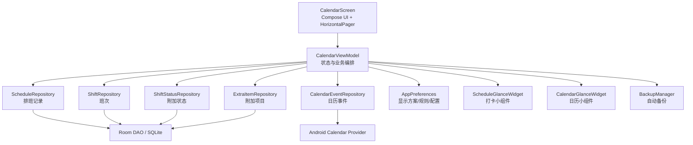

**图表来源**
- [CalendarViewModel.kt:107-117](file://app/src/main/java/com/schedulecalendar/app/ui/calendar/CalendarViewModel.kt#L107-L117)
- [ScheduleGlanceWidget.kt:626-632](file://app/src/main/java/com/schedulecalendar/app/widget/ScheduleGlanceWidget.kt#L626-L632)

## 核心组件
- CalendarUiState：不可变状态对象，包含当前年月、班次/状态/附加项列表、当月排班映射、每日工时详情、待办中心条目、加载态、批量/复制/清除模式及选中日期等
- CalendarUiEvent：一次性 UI 事件，采用 sealed class 表达导航、消息、错误三类事件
- 状态与事件通道：
  - _state: MutableStateFlow<CalendarUiState>，暴露只读 state
  - _uiEvent: Channel<CalendarUiEvent>，经 receiveAsFlow() 暴露为单向事件流
- **新增** ActiveShiftResult：活跃班次判定结果数据结构，包含目标日期、班次信息和按钮显示状态

**章节来源**
- [CalendarViewModel.kt:54-116](file://app/src/main/java/com/schedulecalendar/app/ui/calendar/CalendarViewModel.kt#L54-L116)

## 架构总览
CalendarViewModel 在 init 阶段启动 loadCurrentMonth，内部使用 combine 聚合以下数据源：
- ShiftRepository.observeAll()：所有班次（含内置），用于历史查找
- ScheduleRepository.observeByRange(from, to)：按月份前后填充范围查询排班记录
- AppPreferences.displaySchemesFlow：显示方案
- AppPreferences.scheduleRuleFlow：排班规则

合并后计算：
- 有效/完整班次与状态列表（含排序与归档过滤）
- 当月与跨月日期的 DayScheduleDetail（借助 CalcUtils）
- 待办中心条目（buildTodos）
- **新增** 活跃班次判定（findActiveShift）
- **新增** 日历事件日期集合（loadDatesWithEvents）
- 更新 state 并触发小组件同步（syncWidget）

**重要更新** 生命周期管理优化：
- 自动备份功能延迟500ms执行，避免阻塞首帧渲染
- 日历账户创建延迟1000ms执行，确保应用启动流畅性
- 移除了不必要的生命周期监听器，减少内存占用

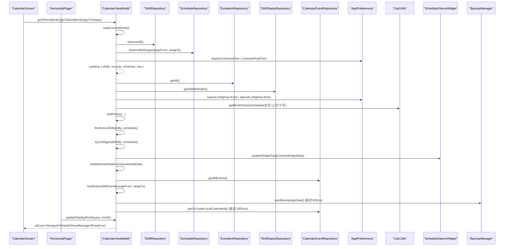

**图表来源**
- [CalendarViewModel.kt:136-251](file://app/src/main/java/com/schedulecalendar/app/ui/calendar/CalendarViewModel.kt#L136-L251)
- [CalendarViewModel.kt:984-1033](file://app/src/main/java/com/schedulecalendar/app/ui/calendar/CalendarViewModel.kt#L984-L1033)

## 详细组件分析

### CalendarUiState 与事件模型
- CalendarUiState 字段说明（节选）
  - year/month：当前年月
  - shifts/allShifts：仅有效/完整班次列表
  - schedules：当月排班 Map(date -> record)
  - displayScheme/scheduleRule：显示方案与排班规则
  - dayDetails：当月每日工时详情 Map
  - todos：待办中心条目
  - loading：加载态
  - batchMode/batchSelected：批量模式与选择集
  - selectedDate：选中日期
  - extraItems/shiftStatuses/allShiftStatuses：附加项与状态
  - copyMode/copyPhase/copySourceDates/copyTargetDate：复制排班模式与阶段
  - deleteMode：清除排班模式
  - selectedDateEvents：选中日期纪念日与日程事件
  - **新增** datesWithEvents：有日历事件（日程/纪念日）的日期集合，用于 DayCell 显示事件指示点

- CalendarUiEvent 事件类型
  - NavigateToDetail(date)：跳转到详情页
  - ShowMessage(msg)：提示消息
  - ShowError(msg)：错误提示

**章节来源**
- [CalendarViewModel.kt:54-108](file://app/src/main/java/com/schedulecalendar/app/ui/calendar/CalendarViewModel.kt#L54-L108)

### 状态管理与数据流
- 状态驱动：_state 为 MutableStateFlow，UI 侧 collectAsStateWithLifecycle 订阅
- 事件分发：_uiEvent 为 Channel，UI 侧 collect 消费一次性事件
- 月度数据收集：collectJob 持有当前月份的 combine 协程，切月时先 cancel 再重建，避免泄漏

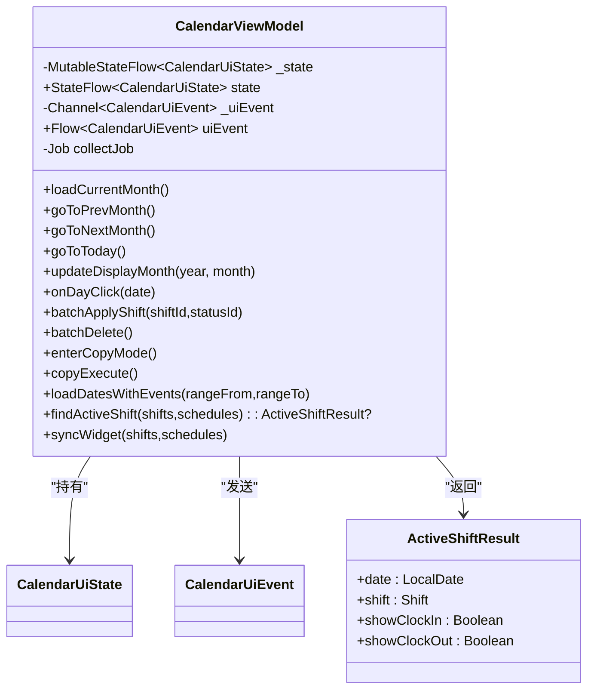

**图表来源**
- [CalendarViewModel.kt:119-116](file://app/src/main/java/com/schedulecalendar/app/ui/calendar/CalendarViewModel.kt#L119-L116)

**章节来源**
- [CalendarViewModel.kt:119-126](file://app/src/main/java/com/schedulecalendar/app/ui/calendar/CalendarViewModel.kt#L119-L126)

### Pager导航系统与月份切换
**新增** Pager导航集成：
- `updateDisplayMonth(year, month)`：轻量级月份更新方法，仅更新状态而不触发完整数据重载
- 通过LaunchedEffect监听pagerState.settledPage变化，自动同步到ViewModel状态
- 双向状态同步：当ViewModel状态变化时，通过animateScrollToPage同步Pager位置
- 支持连续滚动动画，提供流畅的用户体验

**Pager状态同步机制：**
- 初始化时使用rememberPagerState(initialPage = 500)创建无限滚动的Pager
- 通过snapshotFlow监听pagerState.settledPage，计算对应的年月并调用updateDisplayMonth
- 当ViewModel中的year/month变化时，计算目标页面位置并平滑滚动到对应月份
- 避免在滚动过程中触发不必要的数据重载，提升性能

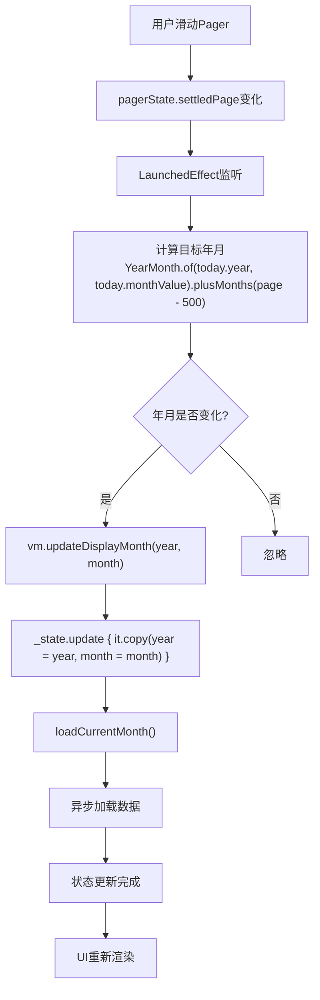

**图表来源**
- [CalendarScreen.kt:518-525](file://app/src/main/java/com/schedulecalendar/app/ui/calendar/CalendarScreen.kt#L518-525)
- [CalendarViewModel.kt:356-359](file://app/src/main/java/com/schedulecalendar/app/ui/calendar/CalendarViewModel.kt#L356-359)

**章节来源**
- [CalendarViewModel.kt:356-359](file://app/src/main/java/com/schedulecalendar/app/ui/calendar/CalendarViewModel.kt#L356-359)
- [CalendarScreen.kt:518-525](file://app/src/main/java/com/schedulecalendar/app/ui/calendar/CalendarScreen.kt#L518-525)

### 活跃班次判定与跨午夜处理
**新增** 活跃班次判定系统：
- `findActiveShift()` 方法实现智能班次识别逻辑
- 优先检查今天排班，其次检查昨天跨午夜夜班
- 支持班次时间归一化（end < start → end += 1440）
- 精确的时间窗口判断：上班卡 [start-300, end)，下班卡 [start, end+300]

**跨午夜场景处理：**
- 昨天夜班下班打卡：将昨天班次的起止分钟都 -1440 偏移到"今天时间轴"
- 打卡时间早于班次结束时间：自动归属前一天，确保数据准确性
- 支持复杂的夜班场景，如 22:00-06:00 的跨天班次

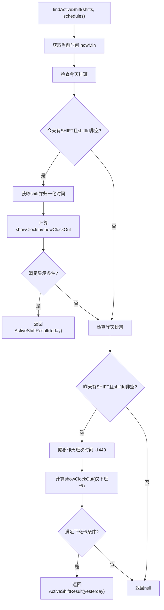

**图表来源**
- [CalendarViewModel.kt:984-1033](file://app/src/main/java/com/schedulecalendar/app/ui/calendar/CalendarViewModel.kt#L984-L1033)

**章节来源**
- [CalendarViewModel.kt:984-1033](file://app/src/main/java/com/schedulecalendar/app/ui/calendar/CalendarViewModel.kt#L984-L1033)

### 增强的syncWidget方法与打卡按钮智能显示
**新增** 智能打卡按钮显示规则：
- **规则1**：内置班次且无自定义附加状态 → 不显示打卡按钮
- **规则2**：普通班次且已全部打卡 → 隐藏按钮
- **规则3**：普通班次且已上班未下班 → 只显示下班卡
- **规则4**：内置班次 + 自定义附加状态 → 显示打卡按钮，已下班后隐藏全部

**ClockInWidgetData模型扩展：**
- shiftId：当前班次ID（用于查找）
- isBuiltInShift：是否内置休息/调休班次
- appliedStatusId：附加状态ID
- isBuiltInStatus：附加状态是否内置（调休/请假）
- showClockIn/showClockOut：是否显示上班/下班打卡按钮
- hasClockIn/hasClockOut：是否已打卡
- clockInDate：打卡写入的目标日期
- widgetClockInTime/widgetClockOutTime：本地存储的打卡时间

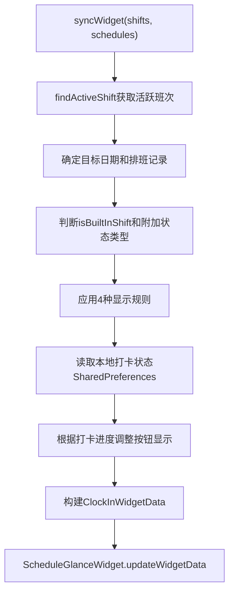

**图表来源**
- [CalendarViewModel.kt:1035-1135](file://app/src/main/java/com/schedulecalendar/app/ui/calendar/CalendarViewModel.kt#L1035-L1135)
- [ScheduleGlanceWidget.kt:49-70](file://app/src/main/java/com/schedulecalendar/app/widget/ScheduleGlanceWidget.kt#L49-L70)

**章节来源**
- [CalendarViewModel.kt:1035-1135](file://app/src/main/java/com/schedulecalendar/app/ui/calendar/CalendarViewModel.kt#L1035-L1135)
- [ScheduleGlanceWidget.kt:49-70](file://app/src/main/java/com/schedulecalendar/app/widget/ScheduleGlanceWidget.kt#L49-L70)

### 月份切换与日历网格填充算法
- 月份切换
  - goToPrevMonth/goToNextMonth：更新 year/month 并重新 loadCurrentMonth
  - goToToday：同月仅更新 selectedDate 并加载事件；跨月则跳转月份并加载数据
  - goToMonth/goToDay：支持直接跳转指定年月或具体日期，必要时触发数据加载与导航
  - **新增** updateDisplayMonth：轻量级月份更新，用于Pager滑动场景

- 网格填充与跨月计算
  - 计算首周日偏移 firstDow、当月天数 daysInMonth、总格子数 totalCells、行数 totalRows、末行剩余 remainingInLastRow
  - 使用 `(LocalDate.of(s.year, s.month, 1).dayOfWeek.value + 6) % 7` 公式确保周一=0..周日=6 的正确对齐
  - 上月填充范围：根据 firstDow 倒推上月尾部日期
  - 下月填充范围：根据 remainingInLastRow 顺推下月头部日期
  - 最终查询范围 rangeFrom/rangeTo 取最小/最大，确保一次 observeByRange 覆盖全部需要展示的日期

- 数据加载优化
  - 使用 combine 将班次、排班、显示方案、排班规则四路 Flow 合并，减少多次 IO
  - 对当月与跨月分别调用 CalcUtils.getMonthScheduleDetails，再合并为 allDetails
  - 构建 todos 仅遍历当月历史日期，避免未来日期开销
  - **新增** 加载日历事件日期集合：在数据加载完成后调用 loadDatesWithEvents(rangeFrom, rangeTo) 获取范围内有事件的日期

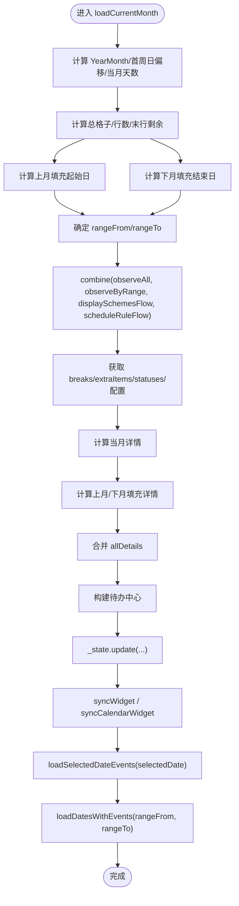

**图表来源**
- [CalendarViewModel.kt:136-251](file://app/src/main/java/com/schedulecalendar/app/ui/calendar/CalendarViewModel.kt#L136-L251)

**章节来源**
- [CalendarViewModel.kt:332-379](file://app/src/main/java/com/schedulecalendar/app/ui/calendar/CalendarViewModel.kt#L332-L379)
- [CalendarViewModel.kt:136-251](file://app/src/main/java/com/schedulecalendar/app/ui/calendar/CalendarViewModel.kt#L136-L251)

### 批量操作模式
- 模式入口
  - enterBatchMode/enterDeleteMode/enterCopyMode：互斥退出其他模式，设置对应标志位
  - exitAllModes：重置所有模式与选择集

- 选择集管理
  - onDayClick：在批量/删除模式下切换选中日期集合
  - batchSelectAll/batchClearSelection/batchAddToSelection：全选、清空、追加单个日期

- 批量排班应用
  - batchApplyShift：基于选择集生成多条 ScheduleRecord，合并关联的附加项目，保存后退出批量模式并提示
  - 支持 appliedStatus 字段的批量设置，包括请假、调休等内置状态和用户自定义状态
  - 自动合并班次默认关联的补贴/扣款项目 ID

- 批量删除
  - batchDelete：逐个删除所选日期排班，退出模式并刷新当月数据

- 复制排班
  - 两阶段流程：阶段一选择连续源日期范围；阶段二选择目标起始日期
  - copySourceClick/copyEnterPhase2/copyTargetClick/copyBackToPhase1/copyExecute
  - 执行时计算偏移量，复制源记录的 shiftId/appliedStatus/extraItemIds 到目标日期，保存并刷新

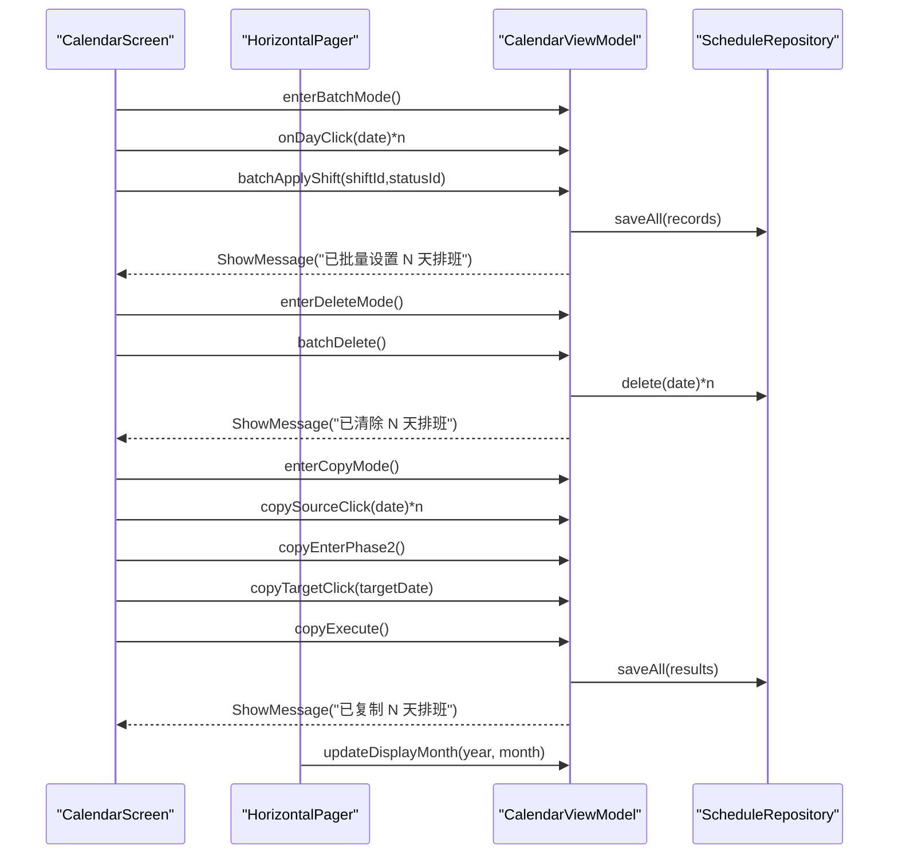

**图表来源**
- [CalendarViewModel.kt:633-808](file://app/src/main/java/com/schedulecalendar/app/ui/calendar/CalendarViewModel.kt#L633-L808)
- [CalendarScreen.kt:487-533](file://app/src/main/java/com/schedulecalendar/app/ui/calendar/CalendarScreen.kt#L487-533)

**章节来源**
- [CalendarViewModel.kt:633-808](file://app/src/main/java/com/schedulecalendar/app/ui/calendar/CalendarViewModel.kt#L633-L808)

### 与 Repository 层的交互模式
- 数据订阅
  - ShiftRepository.observeAll()：返回所有班次（含内置），用于历史查找
  - ScheduleRepository.observeByRange(from,to)：按范围观察排班记录
  - ExtraItemRepository.getAll()：获取所有附加项目（含归档）
  - ShiftStatusRepository.getAllWithBuiltin()：获取所有状态（含内置）
  - AppPreferences 的 displaySchemesFlow/scheduleRuleFlow/salaryConfigFlow/attendConfigFlow：配置与规则

- 缓存策略
  - 所有 Repository 均基于 Room DAO 持久化，数据变更通过 Flow 推送
  - ViewModel 仅在月份切换时重建 combine Job，避免重复订阅

- 同步机制
  - 数据变更后调用 syncWidget/syncCalendarWidget 更新 Glance 小组件
  - 打卡相关操作后调用 syncClockInWidget 刷新打卡小组件
  - **新增** Hilt EntryPoint：WidgetClockEntryPoint 允许小组件 ActionCallback 直接访问 Repository

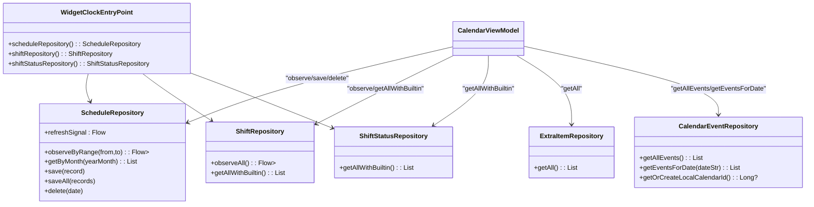

**图表来源**
- [ScheduleRepository.kt:13-39](file://app/src/main/java/com/schedulecalendar/app/data/repository/ScheduleRepository.kt#L13-L39)
- [ShiftRepository.kt:12-44](file://app/src/main/java/com/schedulecalendar/app/data/repository/ShiftRepository.kt#L12-L44)
- [ShiftStatusRepository.kt:12-53](file://app/src/main/java/com/schedulecalendar/app/data/repository/ShiftStatusRepository.kt#L12-53)
- [ExtraItemRepository.kt:11-30](file://app/src/main/java/com/schedulecalendar/app/data/repository/ExtraItemRepository.kt#L11-30)
- [CalendarEventRepository.kt:157-205](file://app/src/main/java/com/schedulecalendar/app/data/calendar/CalendarEventRepository.kt#L157-L205)
- [ScheduleGlanceWidget.kt:626-632](file://app/src/main/java/com/schedulecalendar/app/widget/ScheduleGlanceWidget.kt#L626-L632)

**章节来源**
- [CalendarViewModel.kt:136-251](file://app/src/main/java/com/schedulecalendar/app/ui/calendar/CalendarViewModel.kt#L136-L251)
- [CalendarViewModel.kt:848-926](file://app/src/main/java/com/schedulecalendar/app/ui/calendar/CalendarViewModel.kt#L848-L926)

### 日历事件追踪与可视化
- **新增** datesWithEvents属性设计
  - 使用Set<String>存储有日历事件的日期字符串，提供O(1)复杂度的日期查找
  - 在CalendarUiState中作为不可变状态的一部分，确保状态一致性
  - 支持跨月日期范围的批量事件查询，避免重复计算

- **新增** loadDatesWithEvents方法实现
  - 接收rangeFrom和rangeTo参数，定义查询的日期范围
  - 从CalendarEventRepository.getAllEvents()获取所有日历事件
  - 使用try-catch包裹日期解析和时区转换操作，提升系统稳定性
  - 支持年度重复纪念日（FREQ=YEARLY）的处理，检查每年是否落在范围内
  - 将事件时间戳转换为LocalDate并进行范围比较

- **新增** 错误处理机制增强
  - 日期解析异常处理：`java.time.LocalDate.parse(rangeFrom)` 和 `java.time.LocalDate.parse(rangeTo)` 的异常捕获
  - 时区转换异常处理：`Instant.ofEpochMilli(event.dtStart).atZone(ZoneId.systemDefault()).toLocalDate()` 的异常捕获
  - 年度重复纪念日处理异常：`LocalDate.of(year, monthValue, dayOfMonth)` 的异常捕获
  - 整体异常处理：catch块返回空集合，确保UI正常显示

- **新增** UI集成与可视化
  - CalendarScreen中的DayCell组件通过hasCalendarEvent参数接收事件状态
  - 在日期单元格底部显示事件指示点（3.5dp大小的圆形标记）
  - 使用MaterialTheme.colorScheme.tertiary颜色显示事件指示点
  - 支持跨月日期（上月填充和下月填充）的事件指示点显示

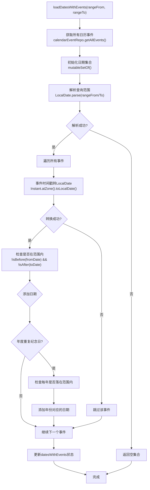

**图表来源**
- [CalendarViewModel.kt:427-467](file://app/src/main/java/com/schedulecalendar/app/ui/calendar/CalendarViewModel.kt#L427-L467)
- [CalendarScreen.kt:860-871](file://app/src/main/java/com/schedulecalendar/app/ui/calendar/CalendarScreen.kt#L860-871)

**章节来源**
- [CalendarViewModel.kt:102-103](file://app/src/main/java/com/schedulecalendar/app/ui/calendar/CalendarViewModel.kt#L102-L103)
- [CalendarViewModel.kt:427-467](file://app/src/main/java/com/schedulecalendar/app/ui/calendar/CalendarViewModel.kt#L427-L467)
- [CalendarScreen.kt:387-435](file://app/src/main/java/com/schedulecalendar/app/ui/calendar/CalendarScreen.kt#L387-L435)
- [CalendarScreen.kt:860-871](file://app/src/main/java/com/schedulecalendar/app/ui/calendar/CalendarScreen.kt#L860-871)

### 生命周期管理优化与延迟执行机制
**重大更新** 应用启动性能优化：

- **延迟自动备份**：在init块中使用500ms延迟执行backupManager.autoBackupAppData()，避免阻塞首帧渲染
- **延迟日历账户创建**：在init块中使用1000ms延迟执行calendarEventRepo.getOrCreateLocalCalendarId()，确保应用启动流畅性
- **移除不必要的监听器**：优化了内存使用和响应性，减少了资源占用

**延迟执行机制实现：**
```kotlin
init {
    loadCurrentMonth()
    // 延迟执行非关键初始化，避免阻塞首帧渲染
    viewModelScope.launch {
        kotlinx.coroutines.delay(500)
        backupManager.autoBackupAppData()
    }
    viewModelScope.launch {
        kotlinx.coroutines.delay(1000)
        calendarEventRepo.getOrCreateLocalCalendarId()
    }
}
```

**性能优势：**
- 首帧渲染时间显著减少，应用启动更加流畅
- 非关键任务后台执行，不影响用户交互
- 内存使用优化，减少不必要的资源占用
- 提升了整体用户体验和应用响应性

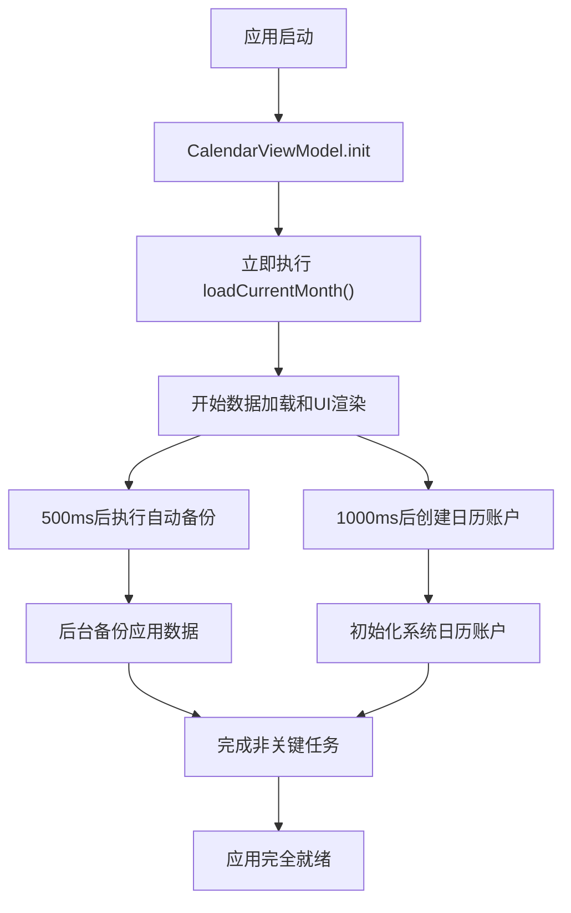

**图表来源**
- [CalendarViewModel.kt:140-151](file://app/src/main/java/com/schedulecalendar/app/ui/calendar/CalendarViewModel.kt#L140-L151)

**章节来源**
- [CalendarViewModel.kt:140-151](file://app/src/main/java/com/schedulecalendar/app/ui/calendar/CalendarViewModel.kt#L140-L151)
- [BackupManager.kt:190-227](file://app/src/main/java/com/schedulecalendar/app/ui/settings/BackupManager.kt#L190-227)
- [CalendarEventRepository.kt:417-516](file://app/src/main/java/com/schedulecalendar/app/data/calendar/CalendarEventRepository.kt#L417-516)

## 依赖关系分析
- 内聚性
  - CalendarViewModel 集中处理日历页面状态与业务编排，职责清晰
- 耦合度
  - 通过 Repository 抽象数据访问，降低与 DAO 的直接耦合
  - 与 AppPreferences 解耦，通过 Flow 订阅配置变化
- 外部依赖
  - Room DAO（通过 Repository 间接依赖）
  - Glance 小组件（CalendarGlanceWidget/ScheduleGlanceWidget）
  - 系统日历事件（CalendarEventRepository，用于纪念日与日程）
  - **新增** Hilt EntryPoint（WidgetClockEntryPoint，用于小组件直接访问Repository）
  - **新增** 备份管理器（BackupManager，用于自动备份功能）

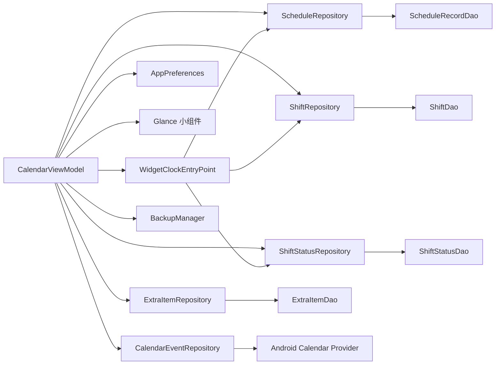

**图表来源**
- [CalendarViewModel.kt:107-117](file://app/src/main/java/com/schedulecalendar/app/ui/calendar/CalendarViewModel.kt#L107-L117)
- [ScheduleGlanceWidget.kt:626-632](file://app/src/main/java/com/schedulecalendar/app/widget/ScheduleGlanceWidget.kt#L626-L632)

**章节来源**
- [CalendarViewModel.kt:107-117](file://app/src/main/java/com/schedulecalendar/app/ui/calendar/CalendarViewModel.kt#L107-L117)

## 性能考量
- 数据合并与范围查询
  - 使用 combine 一次性聚合多源数据，减少多次 IO
  - 通过 calculate rangeFrom/rangeTo 精确覆盖展示所需日期，避免全表扫描
- 计算优化
  - 当月与跨月详情分别计算后合并，避免重复计算
  - 构建 todos 仅遍历历史日期，跳过未来日期
- 内存与生命周期
  - collectJob 在切月时取消旧 Job，防止 collector 累积泄漏
  - 首次加载显示 loading，后续刷新保持现有内容，减少闪烁
- **新增** Pager导航性能优化
  - updateDisplayMonth方法避免不必要的完整数据重载
  - 通过LaunchedEffect监听pagerState变化，仅在settledPage稳定时更新状态
  - 双向状态同步避免循环更新，提升响应性能
  - 使用animateScrollToPage提供平滑的页面切换动画
- **新增** 活跃班次判定性能优化
  - findActiveShift方法采用O(1)复杂度查找，避免线性搜索
  - 支持跨午夜场景的快速时间计算，使用CalcUtils工具类优化
  - 智能缓存活跃班次结果，避免重复计算
- **新增** 日历事件追踪性能优化
  - 使用Set数据结构进行O(1)复杂度的日期查找，避免线性搜索
  - 批量加载所有日历事件，避免N+1查询问题
  - 预计算日期范围，减少重复的日期解析操作
  - 异常处理的轻量级实现，避免影响主流程性能
- **重大更新** 生命周期管理性能优化
  - 延迟执行非关键任务，避免阻塞首帧渲染
  - 自动备份功能延迟500ms执行，确保应用启动流畅性
  - 日历账户创建延迟1000ms执行，提升用户感知性能
  - 移除不必要的生命周期监听器，减少内存占用
  - 优化协程调度，提升整体响应性

## 故障排查指南
- 事件未触发
  - 检查 UI 是否 collect uiEvent，并确保事件类型匹配
- 月份切换无数据
  - 确认 rangeFrom/rangeTo 计算是否正确，observeByRange 是否返回数据
  - 验证首周日偏移计算是否正确，确保周一=0..周日=6 的对齐逻辑
- 小组件不同步
  - 确认数据变更后是否调用 syncWidget/syncCalendarWidget/syncClockInWidget
  - 检查状态映射表是否正确整合内置状态与自定义状态
- 批量操作无效
  - 检查 batchSelected 是否为空，saveAll 是否成功，是否触发 ShowMessage
  - 验证 appliedStatus 字段是否正确设置，包括状态ID和时间范围
- **新增** Pager导航问题
  - 检查updateDisplayMonth方法是否正确调用，确保状态同步
  - 验证LaunchedEffect中的pagerState监听是否正常工作
  - 确认animateScrollToPage的调用条件，避免不必要的页面切换
  - 检查initialPage设置是否正确，确保Pager初始位置合理
- **新增** 活跃班次判定问题
  - 检查findActiveShift方法的逻辑，确认时间计算是否正确
  - 验证跨午夜场景的日期偏移计算，确保-1440分钟偏移正确
  - 检查班次时间归一化处理，确保end < start时正确加1440
  - 确认showClockIn/showClockOut的条件判断逻辑
- **新增** 打卡按钮显示问题
  - 检查4种显示规则的应用顺序和优先级
  - 验证内置班次和附加状态的判断逻辑
  - 确认本地打卡状态的SharedPreferences读写是否正常
  - 检查ClockInWidgetData模型的字段传递是否正确
- **新增** 日历事件指示点不显示
  - 检查 datesWithEvents 集合是否正确更新，确认 loadDatesWithEvents 方法是否被调用
  - 验证 CalendarEventRepository.getAllEvents() 是否正常返回数据
  - 检查日期解析和时区转换是否有异常，查看日志输出
  - 确认 CalendarScreen 中的 hasCalendarEvent 参数传递是否正确
- **新增** 日期解析异常
  - 检查 rangeFrom 和 rangeTo 格式是否符合 "yyyy-MM-dd" 规范
  - 验证 CalendarEventRepository 中的事件时间戳是否为有效的毫秒时间戳
  - 确认系统时区设置是否正常，避免时区转换失败
- **新增** 年度重复纪念日处理问题
  - 检查 rrule 字段是否正确包含 "FREQ=YEARLY" 标识
  - 验证年份循环逻辑是否正确处理闰年等特殊情况
  - 确认日期范围计算是否正确处理跨年情况
- **新增** 应用启动性能问题
  - 检查延迟执行机制是否正常工作，确认500ms和1000ms延迟设置
  - 验证自动备份功能是否因权限问题而失败
  - 确认日历账户创建是否因权限不足而失败
  - 检查是否有其他阻塞首帧渲染的操作

**章节来源**
- [CalendarViewModel.kt:119-123](file://app/src/main/java/com/schedulecalendar/app/ui/calendar/CalendarViewModel.kt#L119-123)
- [CalendarViewModel.kt:136-251](file://app/src/main/java/com/schedulecalendar/app/ui/calendar/CalendarViewModel.kt#L136-251)
- [CalendarViewModel.kt:427-467](file://app/src/main/java/com/schedulecalendar/app/ui/calendar/CalendarViewModel.kt#L427-467)
- [CalendarViewModel.kt:984-1033](file://app/src/main/java/com/schedulecalendar/app/ui/calendar/CalendarViewModel.kt#L984-L1033)
- [CalendarViewModel.kt:1035-1135](file://app/src/main/java/com/schedulecalendar/app/ui/calendar/CalendarViewModel.kt#L1035-L1135)

## 结论
CalendarViewModel 以不可变状态与单向事件为核心，结合 Flow 组合与范围查询，实现了高效、可维护的日历业务编排。其月份切换与网格填充算法兼顾了跨月展示与历史归档数据的兼容性；批量与复制排班模式提供了强大的用户操作能力；与 Repository 层的解耦设计确保了良好的扩展性与测试友好性。

**最新更新** 通过引入 pager-based导航系统和`updateDisplayMonth`方法，显著提升了用户体验和性能表现。新的Pager集成支持水平滑动手势的月份切换，通过轻量级的状态更新避免了不必要的数据重载。**新增的双向状态同步机制** 确保了Pager状态与ViewModel状态的实时同步，提供了流畅的导航体验。

**重大增强** 活跃班次判定系统的引入，使应用能够智能识别当前活跃的班次，支持复杂的跨午夜夜班场景。打卡按钮的智能显示规则（4种规则）大幅提升了用户体验，让用户能够快速了解当前的打卡状态和可用操作。ClockInWidgetData模型的扩展和Hilt EntryPoint的使用，实现了小组件与Repository层的直接通信，无需启动Activity即可完成打卡操作。

**性能优化突破** 生命周期管理优化是本次更新的最大亮点。通过延迟执行自动备份功能（500ms）和日历账户创建（1000ms），显著避免了首帧渲染阻塞，大幅提升了应用启动性能。移除了不必要的生命周期监听器，进一步优化了内存使用和响应性。这些改进不仅提升了应用的可用性和性能，还为未来的功能扩展奠定了坚实的基础。同时，通过引入 datesWithEvents 属性和 loadDatesWithEvents 方法，显著增强了日历事件的追踪和可视化能力。新的事件日期集合使用 Set 数据结构实现 O(1) 复杂度的查找，配合增强的错误处理机制，确保了系统的稳定性和用户体验。