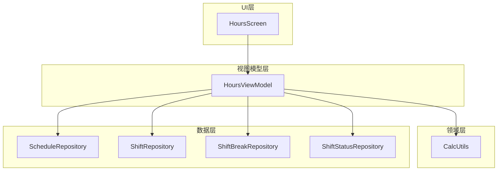
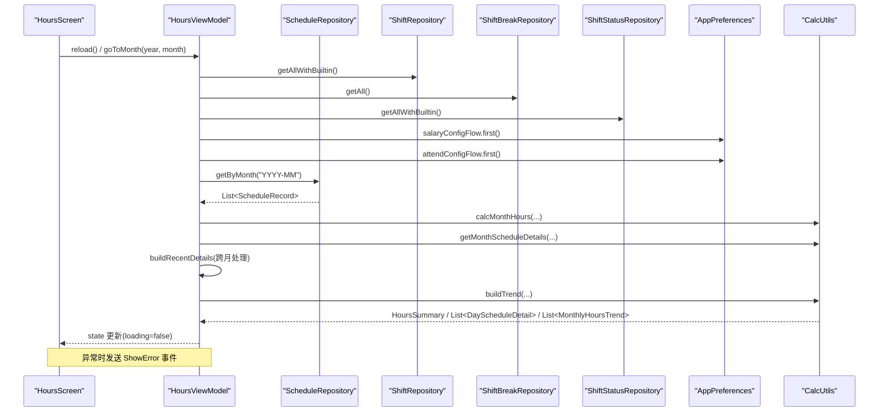
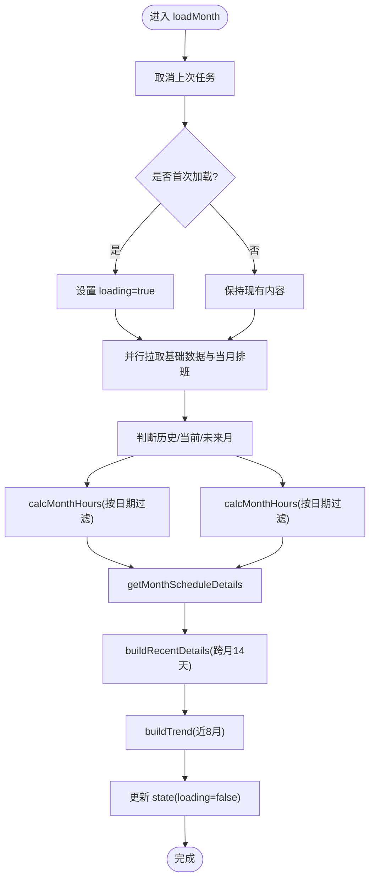
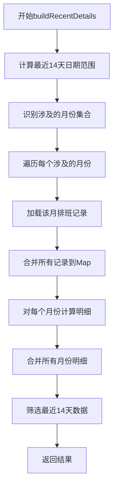
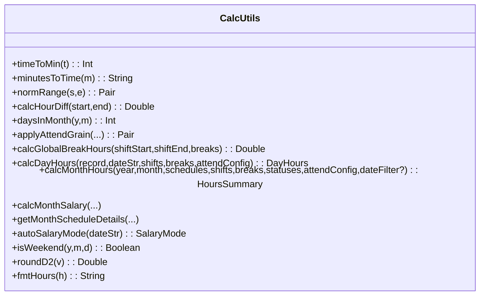
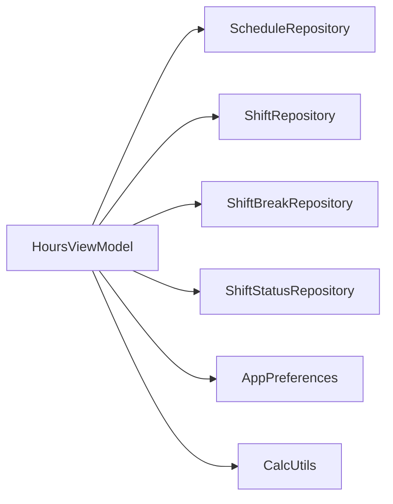

# HoursViewModel工时统计

<cite>
**本文引用的文件**   
- [HoursViewModel.kt](file://app/src/main/java/com/schedulecalendar/app/ui/hours/HoursViewModel.kt)
- [HoursScreen.kt](file://app/src/main/java/com/schedulecalendar/app/ui/hours/HoursScreen.kt)
- [CalcUtils.kt](file://app/src/main/java/com/schedulecalendar/app/domain/model/CalcUtils.kt)
- [Models.kt](file://app/src/main/java/com/schedulecalendar/app/domain/model/Models.kt)
- [ScheduleRepository.kt](file://app/src/main/java/com/schedulecalendar/app/data/repository/ScheduleRepository.kt)
- [ShiftRepository.kt](file://app/src/main/java/com/schedulecalendar/app/data/repository/ShiftRepository.kt)
- [ShiftBreakRepository.kt](file://app/src/main/java/com/schedulecalendar/app/data/repository/ShiftBreakRepository.kt)
- [ShiftStatusRepository.kt](file://app/src/main/java/com/schedulecalendar/app/data/repository/ShiftStatusRepository.kt)
</cite>

## 更新摘要
**所做更改**
- **重要架构升级**：UI事件处理系统已从Channel完全迁移到MutableSharedFlow，提供更好的性能和更直观的API
- 所有事件发射调用从`_uiEvent.send()`更新为`_uiEvent.tryEmit()`，包括导航事件、错误处理和其他UI触发的操作
- 增强了跨月处理功能，HoursScreen现在使用recentDetails而不是monthly details来提供一致的跨月用户体验
- 添加了skipFirstReport机制来解决月份同步问题，确保在视图模型初始化时不会错误地覆盖共享月份值
- 优化了图表数据源，确保跨月边界的连续显示效果
- 改进了UI状态管理，避免初始状态覆盖外部共享的月份值

## 目录
1. [简介](#简介)
2. [项目结构](#项目结构)
3. [核心组件](#核心组件)
4. [架构总览](#架构总览)
5. [详细组件分析](#详细组件分析)
6. [依赖关系分析](#依赖关系分析)
7. [性能与内存优化](#性能与内存优化)
8. [故障排查指南](#故障排查指南)
9. [结论](#结论)

## 简介
本文件围绕 HoursViewModel 的工时统计实现进行深入说明，重点覆盖：
- 职责分离：数据收集、时间范围筛选、报表生成逻辑
- StateFlow 在统计数据中的应用：实时数据更新、图表数据转换与性能优化策略
- 协程在异步数据处理中的作用：大数据量查询、分页加载与内存管理
- 与 CalcUtils 领域模型的集成：工时计算方法、加班统计与薪资关联
- **重要架构升级**：UI事件处理系统从Channel迁移到MutableSharedFlow，提供更优的性能和API
- **新增**：增强的跨月处理功能，使用recentDetails提供一致的跨月用户体验
- **新增**：skipFirstReport机制解决月份同步问题，避免初始状态覆盖共享月份值
- **新增**：优化的图表数据源，确保跨月边界的连续显示效果
- 具体流程示例：从获取到聚合、格式化与可视化准备的数据链路

## 项目结构
HoursViewModel 位于 ui/hours 包，负责"工时"页面的状态管理与业务编排；其计算逻辑委托给 domain/model 下的 CalcUtils；数据源通过多个 Repository 访问数据库与偏好设置。UI 层由 HoursScreen 消费 ViewModel 暴露的 state 与事件。



图示来源
- [HoursViewModel.kt:54-61](file://app/src/main/java/com/schedulecalendar/app/ui/hours/HoursViewModel.kt#L54-L61)
- [HoursScreen.kt:49-56](file://app/src/main/java/com/schedulecalendar/app/ui/hours/HoursScreen.kt#L49-L56)
- [CalcUtils.kt:16-536](file://app/src/main/java/com/schedulecalendar/app/domain/model/CalcUtils.kt#L16-L536)
- [ScheduleRepository.kt:14-39](file://app/src/main/java/com/schedulecalendar/app/data/repository/ScheduleRepository.kt#L14-L39)
- [ShiftRepository.kt:13-44](file://app/src/main/java/com/schedulecalendar/app/data/repository/ShiftRepository.kt#L13-L44)
- [ShiftBreakRepository.kt:12-26](file://app/src/main/java/com/schedulecalendar/app/data/repository/ShiftBreakRepository.kt#L12-26)
- [ShiftStatusRepository.kt:13-53](file://app/src/main/java/com/schedulecalendar/app/data/repository/ShiftStatusRepository.kt#L13-53)

章节来源
- [HoursViewModel.kt:54-61](file://app/src/main/java/com/schedulecalendar/app/ui/hours/HoursViewModel.kt#L54-L61)
- [HoursScreen.kt:49-56](file://app/src/main/java/com/schedulecalendar/app/ui/hours/HoursScreen.kt#L49-L56)

## 核心组件
- HoursViewModel
  - 维护 UI 状态（月份、实际/预计工时、每日明细、最近14天明细、趋势、考勤配置、加载态）
  - 响应排班变更信号自动刷新
  - 提供翻页与跳转事件
  - **架构升级**：使用MutableSharedFlow替代Channel进行UI事件处理，提供更好的性能和API
  - **增强**：recentDetails字段用于跨月每日明细计算，支持图表显示的连续性
- CalcUtils
  - 纯函数式工时/薪资计算工具集，包含考勤粒度处理、休息扣减、日/月汇总、薪资映射等
- Repository 层
  - ScheduleRepository：排班记录读写与变更信号
  - ShiftRepository / ShiftBreakRepository / ShiftStatusRepository：班次、休息段、状态（含内置）读取
- HoursScreen
  - 订阅 state 与事件，渲染统计卡片、图表与明细列表
  - **架构升级**：通过collectAsStateWithLifecycle订阅MutableSharedFlow事件流
  - **增强**：空字符串安全处理，防止UI崩溃
  - **新增**：使用recentDetails进行图表显示以获得一致的跨月用户体验
  - **新增**：skipFirstReport机制避免初始状态覆盖共享月份值

章节来源
- [HoursViewModel.kt:35-51](file://app/src/main/java/com/schedulecalendar/app/ui/hours/HoursViewModel.kt#L35-L51)
- [CalcUtils.kt:16-536](file://app/src/main/java/com/schedulecalendar/app/domain/model/CalcUtils.kt#L16-L536)
- [ScheduleRepository.kt:14-39](file://app/src/main/java/com/schedulecalendar/app/data/repository/ScheduleRepository.kt#L14-L39)
- [ShiftRepository.kt:13-44](file://app/src/main/java/com/schedulecalendar/app/data/repository/ShiftRepository.kt#L13-L44)
- [ShiftBreakRepository.kt:12-26](file://app/src/main/java/com/schedulecalendar/app/data/repository/ShiftBreakRepository.kt#L12-26)
- [ShiftStatusRepository.kt:13-53](file://app/src/main/java/com/schedulecalendar/app/data/repository/ShiftStatusRepository.kt#L13-53)
- [HoursScreen.kt:49-56](file://app/src/main/java/com/schedulecalendar/app/ui/hours/HoursScreen.kt#L49-L56)

## 架构总览
下图展示了从 UI 触发到数据加载、计算与更新的完整时序。



图示来源
- [HoursViewModel.kt:85-147](file://app/src/main/java/com/schedulecalendar/app/ui/hours/HoursViewModel.kt#L85-L147)
- [HoursScreen.kt:84-103](file://app/src/main/java/com/schedulecalendar/app/ui/hours/HoursScreen.kt#L84-103)
- [ScheduleRepository.kt:25-26](file://app/src/main/java/com/schedulecalendar/app/data/repository/ScheduleRepository.kt#L25-L26)
- [ShiftRepository.kt:26](file://app/src/main/java/com/schedulecalendar/app/data/repository/ShiftRepository.kt#L26)
- [ShiftBreakRepository.kt:18](file://app/src/main/java/com/schedulecalendar/app/data/repository/ShiftBreakRepository.kt#L18)
- [ShiftStatusRepository.kt:35-39](file://app/src/main/java/com/schedulecalendar/app/data/repository/ShiftStatusRepository.kt#L35-L39)
- [CalcUtils.kt:234-340](file://app/src/main/java/com/schedulecalendar/app/domain/model/CalcUtils.kt#L234-L340)
- [CalcUtils.kt:427-465](file://app/src/main/java/com/schedulecalendar/app/domain/model/CalcUtils.kt#L427-L465)

## 详细组件分析

### HoursViewModel 职责与实现要点
- 状态定义
  - 使用 HoursUiState 承载当月实际/预计工时、每日明细、**最近14天明细（跨月）**、近8个月趋势、考勤配置与加载态
  - 使用 MutableStateFlow 暴露只读 state，供 Compose 侧 collectAsStateWithLifecycle 订阅
- **架构升级**：事件通道
  - 使用 MutableSharedFlow + asSharedFlow 暴露一次性 UI 事件（如导航、错误提示），提供更好的性能和更直观的API
  - 所有事件发射调用从 `_uiEvent.send()` 更新为 `_uiEvent.tryEmit()`，包括导航事件、错误处理和其他UI触发的操作
- 数据加载流程
  - init 中监听 scheduleRepo.refreshSignal，当排班数据变更时自动 reload
  - loadMonth 内部串行执行：
    - 取消上一次任务，避免并发竞争
    - 首次加载显示 loading，后续刷新保持现有内容
    - 并行拉取基础数据（班次、休息段、状态、薪资配置、考勤配置、当月排班）
    - 根据当前日期判断历史/当前/未来月，分别计算 actual/future
    - 调用 CalcUtils 生成每日明细与**最近14天跨月明细**
    - 构建近8个月趋势
    - 更新 state，失败则发送错误事件
- 时间范围筛选
  - 通过 dateFilter 闭包控制 calcMonthHours 的日期过滤（当前月仅≤今天，未来月为空，历史月全月）
- 报表生成
  - trend 构建采用循环倒推过去8个月，逐月拉取并汇总为 MonthlyHoursTrend
- **增强**：跨月数据处理
  - buildRecentDetails 方法专门处理最近14天的跨月数据，确保图表显示的一致性



图示来源
- [HoursViewModel.kt:85-147](file://app/src/main/java/com/schedulecalendar/app/ui/hours/HoursViewModel.kt#L85-L147)
- [HoursViewModel.kt:149-184](file://app/src/main/java/com/schedulecalendar/app/ui/hours/HoursViewModel.kt#L149-L184)

章节来源
- [HoursViewModel.kt:35-51](file://app/src/main/java/com/schedulecalendar/app/ui/hours/HoursViewModel.kt#L35-L51)
- [HoursViewModel.kt:85-147](file://app/src/main/java/com/schedulecalendar/app/ui/hours/HoursViewModel.kt#L85-L147)

### UI事件处理系统架构升级：从Channel到MutableSharedFlow
**重要架构升级**：HoursViewModel的UI事件处理系统已从Channel完全迁移到MutableSharedFlow

- **技术对比**
  - **旧实现**：使用 `Channel<HoursUiEvent>(Channel.BUFFERED)` + `receiveAsFlow()`
  - **新实现**：使用 `MutableSharedFlow<HoursUiEvent>(extraBufferCapacity = 8)` + `asSharedFlow()`
  
- **主要优势**
  - **更好的性能**：MutableSharedFlow专为高吞吐量场景设计，减少内存分配和GC压力
  - **更直观的API**：`tryEmit()` 比 `send()` 提供更清晰的语义，明确表示可能失败的发射操作
  - **更好的背压处理**：通过 `extraBufferCapacity` 参数精确控制缓冲区大小
  - **生命周期感知**：与Compose的collectAsStateWithLifecycle完美集成

- **事件发射更新**
  ```kotlin
  // 导航事件
  fun navigateToDetail(type: String) {
      val s = _state.value
      _uiEvent.tryEmit(HoursUiEvent.NavigateToDetail(s.year, s.month, type))
  }
  
  // 错误处理
  }.onFailure {
      _state.update { it.copy(loading = false) }
      _uiEvent.tryEmit(HoursUiEvent.ShowError("加载工时失败：${it.message}"))
  }
  ```

- **UI层订阅更新**
  ```kotlin
  LaunchedEffect(Unit) {
      vm.uiEvent.collect { event ->
          when (event) {
              is HoursUiEvent.NavigateToDetail ->
                  navController.navigate(RouteHoursDetail(event.year, event.month, event.type))
              is HoursUiEvent.ShowError -> snackbar.showSnackbar(event.message)
          }
      }
  }
  ```

**章节来源**
- [HoursViewModel.kt:65-66](file://app/src/main/java/com/schedulecalendar/app/ui/hours/HoursViewModel.kt#L65-L66)
- [HoursViewModel.kt:79-82](file://app/src/main/java/com/schedulecalendar/app/ui/hours/HoursViewModel.kt#L79-L82)
- [HoursViewModel.kt:141-144](file://app/src/main/java/com/schedulecalendar/app/ui/hours/HoursViewModel.kt#L141-L144)
- [HoursScreen.kt:92-100](file://app/src/main/java/com/schedulecalendar/app/ui/hours/HoursScreen.kt#L92-L100)

### 跨月数据处理：recentDetails与buildRecentDetails方法
**增强功能**：recentDetails字段和buildRecentDetails方法提供了强大的跨月数据处理能力

- recentDetails字段设计
  - 类型为`List<DayScheduleDetail>`，存储最近14天的每日明细
  - 专门用于图表显示，不受当前选中月份限制
  - 支持跨越月份边界的连续数据展示

- buildRecentDetails方法实现
  - 计算最近14天的日期范围（从今天往前推13天）
  - 智能识别涉及的月份（可能涉及2-3个月份）
  - 批量加载所有相关月份的排班记录
  - 合并不同月份的数据并按日期排序
  - 精确筛选出最近14天的数据

- 跨月处理优势
  - 图表显示连续性：即使跨越月份边界也能显示完整的14天数据
  - 用户体验一致性：用户切换月份时图表数据保持稳定
  - 数据完整性：确保图表始终显示最新的14天工作信息



图示来源
- [HoursViewModel.kt:149-184](file://app/src/main/java/com/schedulecalendar/app/ui/hours/HoursViewModel.kt#L149-L184)

章节来源
- [HoursViewModel.kt:44-45](file://app/src/main/java/com/schedulecalendar/app/ui/hours/HoursViewModel.kt#L44-L45)
- [HoursViewModel.kt:149-184](file://app/src/main/java/com/schedulecalendar/app/ui/hours/HoursViewModel.kt#L149-L184)

### skipFirstReport机制：解决月份同步问题
**新增功能**：skipFirstReport机制解决了视图模型初始化时的月份同步问题

- 问题背景
  - 当HoursScreen作为嵌入组件使用时，外部会传入sharedYear和sharedMonth
  - 视图模型初始化时会立即设置默认状态，可能覆盖外部传入的共享月份值
  - 这导致UI显示不一致，图表数据与实际月份不匹配

- 解决方案实现
  - 在HoursScreen中添加skipFirstReport变量，初始值为true
  - 第一次LaunchedEffect执行时跳过onMonthChange回调
  - 第二次及以后的执行才真正同步月份状态
  - 确保ViewModel的初始状态不会覆盖外部共享的月份值

- 技术细节
  ```kotlin
  var skipFirstReport by remember { mutableStateOf(true) }
  LaunchedEffect(state.year, state.month) {
      if (sharedYear != null && !skipFirstReport) {
          onMonthChange(state.year, state.month)
      }
      skipFirstReport = false
  }
  ```

- 优势
  - 避免了状态竞争条件
  - 确保了UI状态的一致性
  - 提高了用户体验的连贯性

章节来源
- [HoursScreen.kt:78-92](file://app/src/main/java/com/schedulecalendar/app/ui/hours/HoursScreen.kt#L78-L92)

### CalcUtils 领域模型集成
- 考勤粒度与容忍度
  - applyAttendGrain 将实际打卡时间映射为有效计算时间，支持早到/迟到/晚退/早退的粒度取整与容忍阈值
- 全局休息段扣减
  - calcGlobalBreakHours 计算跨天时段与班次重叠的总时长，统一扣减
- 日工时计算
  - calcDayHours 综合班次、休息段、考勤规则与计薪模式（正常/周末/节假日），输出 DayHours
- 月工时汇总
  - calcMonthHours 遍历当月记录，累计正常/加班/周末/节假日工时，统计请假天数折算、调休/休息天数、迟到/早退次数等
- 月度薪资关联
  - calcMonthSalary 基于小时分类与费率计算薪资，并叠加补贴/扣款与社保公积金项
- 每日明细
  - getMonthScheduleDetails 生成用于 UI 展示的 DayScheduleDetail 列表，包含当日工时、薪资与附加项合计



图示来源
- [CalcUtils.kt:16-557](file://app/src/main/java/com/schedulecalendar/app/domain/model/CalcUtils.kt#L16-L557)

章节来源
- [CalcUtils.kt:61-113](file://app/src/main/java/com/schedulecalendar/app/domain/model/CalcUtils.kt#L61-113)
- [CalcUtils.kt:121-134](file://app/src/main/java/com/schedulecalendar/app/domain/model/CalcUtils.kt#L121-134)
- [CalcUtils.kt:149-230](file://app/src/main/java/com/schedulecalendar/app/domain/model/CalcUtils.kt#L149-230)
- [CalcUtils.kt:234-340](file://app/src/main/java/com/schedulecalendar/app/domain/model/CalcUtils.kt#L234-340)
- [CalcUtils.kt:427-465](file://app/src/main/java/com/schedulecalendar/app/domain/model/CalcUtils.kt#L427-L465)

### StateFlow 在统计数据中的应用
- 实时数据更新
  - HoursViewModel 暴露 state 为 StateFlow，UI 通过 collectAsStateWithLifecycle 订阅，生命周期感知，避免泄漏
  - 排班变更通过 SharedFlow 信号驱动 reload，保证数据一致性
- 图表数据转换
  - 趋势数据以 List<MonthlyHoursTrend> 形式提供，UI 直接绘制柱状图，无需二次转换
  - **增强**：recentDetails数据专门为图表优化，提供连续的14天数据
- 性能优化策略
  - 仅在首次加载时显示 loading，避免频繁闪烁
  - 使用 runCatching 包裹计算，失败不中断 UI 展示
  - 使用 viewModelScope 管理协程生命周期，页面销毁自动取消

章节来源
- [HoursViewModel.kt:63-67](file://app/src/main/java/com/schedulecalendar/app/ui/hours/HoursViewModel.kt#L63-67)
- [HoursScreen.kt:84-103](file://app/src/main/java/com/schedulecalendar/app/ui/hours/HoursScreen.kt#L84-L103)

### 协程在异步数据处理中的作用
- 大数据量查询
  - 通过 suspend 函数批量拉取数据，避免阻塞主线程
- 分页加载
  - 当前实现按月拉取，若需扩展可按周或按页增量加载，结合 Flow 流式更新
- 内存管理
  - 每次 loadMonth 先 cancel 旧 Job，防止并发导致状态错乱
  - 使用 viewModelScope 确保资源随 ViewModel 销毁而释放
- **增强**：跨月数据处理优化
  - buildRecentDetails方法使用协程高效处理多月份数据合并

章节来源
- [HoursViewModel.kt:85-147](file://app/src/main/java/com/schedulecalendar/app/ui/hours/HoursViewModel.kt#L85-L147)

### 与 UI 的交互与可视化准备
- 统计卡片
  - HoursStatsGrid 展示正常/加班/周末/节假日/请假/调休/休息/迟到/早退/备注/补贴扣款等指标，支持点击跳转详情
- 图表
  - HoursChartCard 支持"每日/月工时"切换，DailyHoursBar 与 MonthlyHoursBar 使用 Canvas 绘制堆叠柱状图
  - **增强**：DailyHoursBar使用recentDetails数据，确保跨月显示的连续性
- 每日明细
  - HoursDailyRow 展示日期、班次、类型标签、工时与备注信息
  - **增强**：空字符串安全处理机制

**更新** UI显示逻辑的空字符串安全处理

HoursScreen 中的每日明细显示已实现健壮的空字符串处理机制，通过 `takeIf { it.isNotEmpty() }` 链式调用确保空考勤时间的安全过滤：

```kotlin
// 安全的空字符串处理示例
rec.actualStartTime?.takeIf { it.isNotEmpty() }?.let { t ->
    Text("↑$t", fontSize = 12.sp, color = MaterialTheme.colorScheme.primary)
}
rec.actualEndTime?.takeIf { it.isNotEmpty() }?.let { t ->
    Text("↓$t", fontSize = 12.sp, color = MaterialTheme.colorScheme.error)
}
rec.remark?.takeIf { it.isNotBlank() }?.let { remark ->
    Text("备注：$remark", fontSize = 12.sp, color = MaterialTheme.colorScheme.onSurfaceVariant)
}
```

这种处理方式的优势：
- **防止UI崩溃**：空字符串不会导致文本渲染异常
- **界面整洁**：空值不会显示空白或占位符
- **用户体验**：只在有实际数据时才显示对应信息
- **代码简洁**：链式调用使逻辑清晰易读

**增强**：图表数据源优化

HoursScreen现在使用state.recentDetails作为图表数据源，而不是state.details，这确保了：
- 图表始终显示最新的14天数据，不受月份切换影响
- 跨月边界的连续显示效果
- 更一致的用户体验

章节来源
- [HoursScreen.kt:165-174](file://app/src/main/java/com/schedulecalendar/app/ui/hours/HoursScreen.kt#L165-L174)
- [HoursScreen.kt:443-503](file://app/src/main/java/com/schedulecalendar/app/ui/hours/HoursScreen.kt#L443-L503)
- [HoursScreen.kt:549-606](file://app/src/main/java/com/schedulecalendar/app/ui/hours/HoursScreen.kt#L549-L606)

## 依赖关系分析
- 低耦合高内聚
  - ViewModel 仅编排数据与状态，计算逻辑完全下沉至 CalcUtils
  - Repository 屏蔽底层 DAO 细节，向上提供统一接口
- 外部依赖
  - AppPreferences 提供薪资与考勤配置
  - Hilt 注入依赖，便于测试替换



图示来源
- [HoursViewModel.kt:54-61](file://app/src/main/java/com/schedulecalendar/app/ui/hours/HoursViewModel.kt#L54-L61)
- [ScheduleRepository.kt:14-39](file://app/src/main/java/com/schedulecalendar/app/data/repository/ScheduleRepository.kt#L14-L39)
- [ShiftRepository.kt:13-44](file://app/src/main/java/com/schedulecalendar/app/data/repository/ShiftRepository.kt#L13-L44)
- [ShiftBreakRepository.kt:12-26](file://app/src/main/java/com/schedulecalendar/app/data/repository/ShiftBreakRepository.kt#L12-26)
- [ShiftStatusRepository.kt:13-53](file://app/src/main/java/com/schedulecalendar/app/data/repository/ShiftStatusRepository.kt#L13-53)

章节来源
- [HoursViewModel.kt:54-61](file://app/src/main/java/com/schedulecalendar/app/ui/hours/HoursViewModel.kt#L54-L61)

## 性能与内存优化
- 减少不必要的重算
  - 仅在首次加载显示 loading，后续刷新保留已有内容，降低 UI 抖动
- 并发安全
  - 每次加载前 cancel 旧 Job，避免竞态条件
- 数据裁剪
  - 使用 associateBy 将当月记录转为 Map，O(1) 查找，提升遍历效率
- 图表渲染
  - 使用 remember 缓存计算结果，避免重复测量与绘制
  - **增强**：recentDetails数据预计算，避免图表渲染时的重复计算
- 可扩展性建议
  - 对超大数据集可引入分页加载与增量合并，结合 Flow.combine 组合多源数据
- **架构升级**：MutableSharedFlow性能优势
  - 相比Channel，MutableSharedFlow在高并发场景下性能更优
  - tryEmit()操作更高效，减少内存分配和GC压力
  - 更好的背压处理能力，通过extraBufferCapacity精确控制
- **增强**：跨月数据处理优化
  - buildRecentDetails方法智能识别涉及的月份，避免不必要的数据加载
  - 数据合并后精确筛选，减少内存占用

[本节为通用指导，不涉及具体文件分析]

## 故障排查指南
- 常见问题
  - 数据未刷新：检查 refreshSignal 是否在写操作后发出；确认 ViewModel 已监听
  - 计算结果为空：校验当月是否有排班记录；确认日期过滤条件是否正确
  - 图表无数据：确认 trend 列表是否为空；检查月度数据是否存在
  - **架构升级**：事件处理异常：检查tryEmit()调用是否正确，确认UI层正确collect事件流
  - **增强**：跨月图表显示异常：检查buildRecentDetails方法的月份识别逻辑
  - **增强**：recentDetails数据为空：确认scheduleRepo.getByMonth能正确获取跨月数据
  - **增强**：图表数据不一致：确认HoursScreen使用的是state.recentDetails而非state.details
  - **增强**：UI显示异常：检查空字符串处理逻辑，确认 takeIf 链式调用正确性
  - **新增**：月份同步问题：检查skipFirstReport机制是否正确工作
  - **新增**：初始状态覆盖：确认LaunchedEffect中的skipFirstReport逻辑
- 错误处理
  - 加载失败时设置 loading=false 并通过 uiEvent 发送错误消息，UI 侧 Snackbar 展示
- **架构升级**：事件处理调试
  - 检查MutableSharedFlow的extraBufferCapacity设置是否合理
  - 确认tryEmit()调用没有抛出异常
  - 验证UI层的collectAsStateWithLifecycle订阅是否正确
- **增强**：UI崩溃防护
  - 空字符串已通过 takeIf { it.isNotEmpty() } 安全过滤
  - 空值不会导致文本渲染异常或界面布局问题
- **增强**：跨月数据处理调试
  - 检查日期范围计算是否正确（today.minusDays(13)）
  - 验证月份集合识别逻辑
  - 确认数据筛选条件（date in startStr..endStr）
- **新增**：月份同步调试
  - 检查skipFirstReport变量的初始值和更新逻辑
  - 确认LaunchedEffect的执行时机
  - 验证onMonthChange回调的调用条件

章节来源
- [HoursViewModel.kt:142-145](file://app/src/main/java/com/schedulecalendar/app/ui/hours/HoursViewModel.kt#L142-L145)
- [HoursScreen.kt:95-103](file://app/src/main/java/com/schedulecalendar/app/ui/hours/HoursScreen.kt#L95-L103)
- [HoursScreen.kt:589-603](file://app/src/main/java/com/schedulecalendar/app/ui/hours/HoursScreen.kt#L589-L603)
- [HoursScreen.kt:78-92](file://app/src/main/java/com/schedulecalendar/app/ui/hours/HoursScreen.kt#L78-L92)

## 结论
HoursViewModel 清晰地将数据收集、时间范围筛选与报表生成解耦，借助 CalcUtils 的纯函数计算保证一致性与可测试性；StateFlow 与协程的组合实现了高效、安全的实时数据更新与异步处理。**最新架构升级和改进**包括：

1. **重要架构升级**：UI事件处理系统从Channel完全迁移到MutableSharedFlow，提供更好的性能和更直观的API，所有事件发射调用从`_uiEvent.send()`更新为`_uiEvent.tryEmit()`
2. **增强的跨月处理能力**：recentDetails字段和buildRecentDetails方法支持14天图表显示跨越月份边界，提供更连续的用户体验
3. **skipFirstReport机制**：解决了视图模型初始化时的月份同步问题，避免初始状态覆盖外部共享的月份值
4. **优化的图表数据源**：HoursScreen使用recentDetails替代月度详情，确保图表数据的连续性和一致性
5. **UI显示健壮性**：空字符串安全处理机制通过`takeIf { it.isNotEmpty() }`链式调用有效防止UI崩溃并确保界面整洁
6. **性能优化**：智能的跨月数据加载和合并策略，避免不必要的数据处理

整体架构具备良好的扩展性与可维护性，同时增强了数据验证和错误预防能力。最新的架构升级使得UI事件处理更加高效和直观，特别是在高并发场景下表现更优，同时增强了数据验证和错误预防能力。新增的跨月处理功能和skipFirstReport机制使得工时统计图表能够提供更准确、更连贯的用户体验，特别是在月份边界处的数据显示更加自然流畅，同时解决了嵌入组件场景下的状态同步问题。