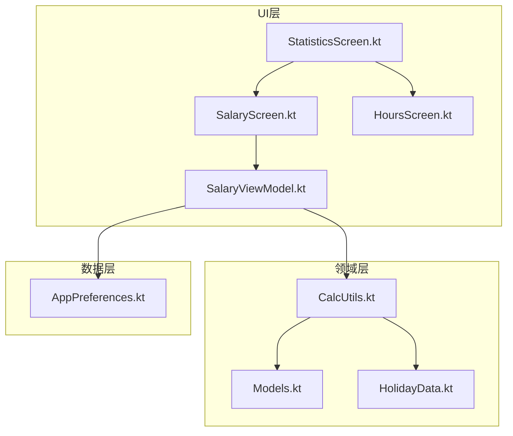
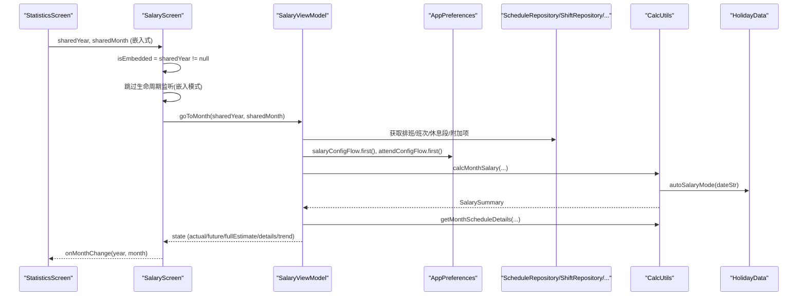
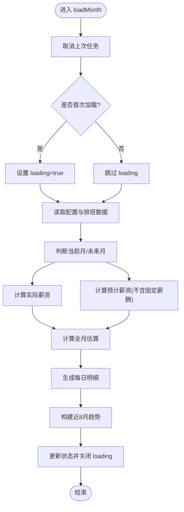
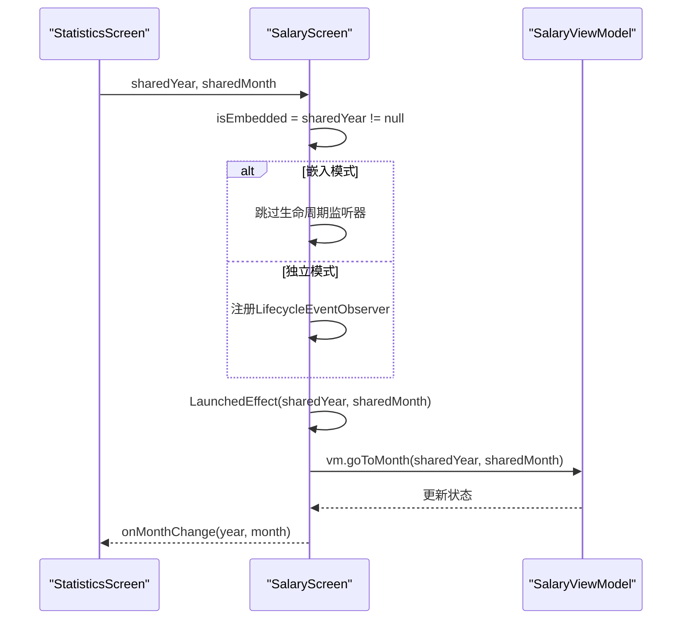
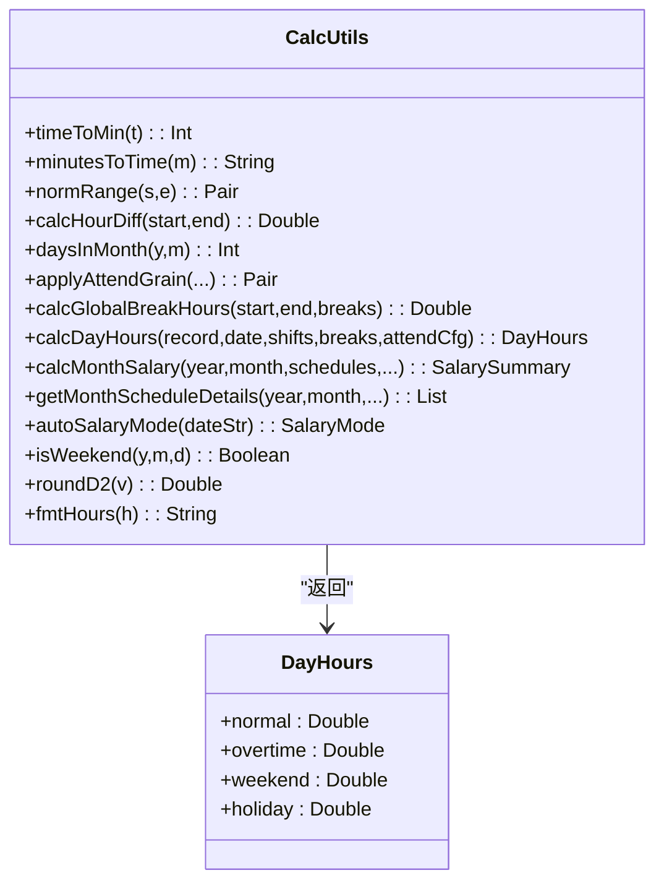
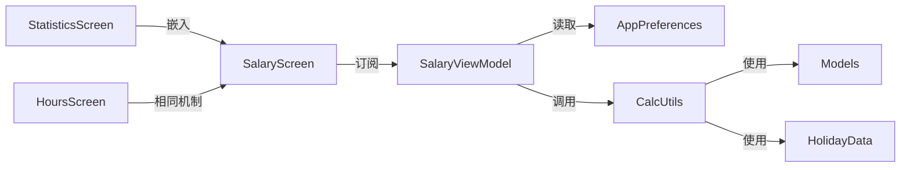

# SalaryViewModel薪资计算

<cite>
**本文引用的文件**   
- [SalaryViewModel.kt](file://app/src/main/java/com/schedulecalendar/app/ui/salary/SalaryViewModel.kt)
- [SalaryScreen.kt](file://app/src/main/java/com/schedulecalendar/app/ui/salary/SalaryScreen.kt)
- [HoursScreen.kt](file://app/src/main/java/com/schedulecalendar/app/ui/hours/HoursScreen.kt)
- [StatisticsScreen.kt](file://app/src/main/java/com/schedulecalendar/app/ui/statistics/StatisticsScreen.kt)
- [AppPreferences.kt](file://app/src/main/java/com/schedulecalendar/app/data/prefs/AppPreferences.kt)
- [Models.kt](file://app/src/main/java/com/schedulecalendar/app/domain/model/Models.kt)
- [CalcUtils.kt](file://app/src/main/java/com/schedulecalendar/app/domain/model/CalcUtils.kt)
- [HolidayData.kt](file://app/src/main/java/com/schedulecalendar/app/domain/model/HolidayData.kt)
</cite>

## 更新摘要
**变更内容**   
- **重大增强**：SalaryScreen嵌入式模式处理得到优化，移除了不必要的生命周期监听器以防止冗余重载调用导致的性能问题
- **统一检测逻辑**：嵌入式模式检测逻辑统一使用isEmbedded变量基于sharedYear != null，消除了重复状态声明并简化了条件逻辑
- **性能优化**：仅在非嵌入模式下监听生命周期ON_RESUME事件，避免在StatisticsScreen中嵌入时的不必要刷新
- **状态同步改进**：LaunchedEffect确保外部共享月份的正确同步，避免初始状态覆盖问题

## 目录
1. [简介](#简介)
2. [项目结构](#项目结构)
3. [核心组件](#核心组件)
4. [架构总览](#架构总览)
5. [详细组件分析](#详细组件分析)
6. [依赖关系分析](#依赖关系分析)
7. [性能与精度考量](#性能与精度考量)
8. [故障排查指南](#故障排查指南)
9. [结论](#结论)
10. [附录：完整流程示例路径](#附录完整流程示例路径)

## 简介
本文件围绕 SalaryViewModel 的薪资计算业务逻辑进行系统化文档化，涵盖：
- 薪资规则应用、计算公式执行与报表生成
- 薪资配置管理（基本工资、加班费率、补贴扣款）
- 复杂计算逻辑（多条件判断、边界处理、精度控制）
- 与偏好设置的集成（参数读取、配置验证、用户反馈）
- 从数据收集到结果展示的端到端流程说明

**最新更新**：SalaryScreen嵌入式模式处理得到重大增强，通过统一的isEmbedded检测逻辑和优化的生命周期管理，显著提升了在StatisticsScreen中嵌入时的性能和用户体验。

## 项目结构
与薪资模块相关的代码主要分布在以下包与文件：
- UI层：SalaryScreen（展示）、SalaryViewModel（状态与编排）
- 统计层：StatisticsScreen（嵌入式容器）
- 领域层：CalcUtils（工时与薪资计算）、Models（数据模型）、HolidayData（节假日/调休）
- 数据持久化：AppPreferences（薪资与考勤配置）



图表来源
- [SalaryScreen.kt:1-497](file://app/src/main/java/com/schedulecalendar/app/ui/salary/SalaryScreen.kt#L1-L497)
- [SalaryViewModel.kt:1-168](file://app/src/main/java/com/schedulecalendar/app/ui/salary/SalaryViewModel.kt#L1-L168)
- [HoursScreen.kt:1-611](file://app/src/main/java/com/schedulecalendar/app/ui/hours/HoursScreen.kt#L1-L611)
- [StatisticsScreen.kt:1-155](file://app/src/main/java/com/schedulecalendar/app/ui/statistics/StatisticsScreen.kt#L1-L155)
- [CalcUtils.kt:1-536](file://app/src/main/java/com/schedulecalendar/app/domain/model/CalcUtils.kt#L1-L536)
- [Models.kt:1-277](file://app/src/main/java/com/schedulecalendar/app/domain/model/Models.kt#L1-L277)
- [HolidayData.kt:1-636](file://app/src/main/java/com/schedulecalendar/app/domain/model/HolidayData.kt#L1-L636)
- [AppPreferences.kt:1-313](file://app/src/main/java/com/schedulecalendar/app/data/prefs/AppPreferences.kt#L1-L313)

章节来源
- [SalaryViewModel.kt:1-168](file://app/src/main/java/com/schedulecalendar/app/ui/salary/SalaryViewModel.kt#L1-L168)
- [SalaryScreen.kt:1-497](file://app/src/main/java/com/schedulecalendar/app/ui/salary/SalaryScreen.kt#L1-L497)
- [HoursScreen.kt:1-611](file://app/src/main/java/com/schedulecalendar/app/ui/hours/HoursScreen.kt#L1-L611)
- [StatisticsScreen.kt:1-155](file://app/src/main/java/com/schedulecalendar/app/ui/statistics/StatisticsScreen.kt#L1-L155)
- [CalcUtils.kt:1-536](file://app/src/main/java/com/schedulecalendar/app/domain/model/CalcUtils.kt#L1-L536)
- [Models.kt:1-277](file://app/src/main/java/com/schedulecalendar/app/domain/model/Models.kt#L1-L277)
- [HolidayData.kt:1-636](file://app/src/main/java/com/schedulecalendar/app/domain/model/HolidayData.kt#L1-L636)
- [AppPreferences.kt:1-313](file://app/src/main/java/com/schedulecalendar/app/data/prefs/AppPreferences.kt#L1-L313)

## 核心组件
- SalaryViewModel：负责月度薪资加载、实际/预计/全月估算、每日明细与趋势构建，并通过 Flow 暴露状态与事件。
- CalcUtils：纯函数式计算引擎，封装工时分类、薪资汇总、日期类型推断、精度控制等。
- AppPreferences：基于 DataStore 的薪资与考勤配置读写，提供 Flow 与一次性读取。
- Models：统一的数据模型定义（班次、记录、薪资配置、考勤配置、汇总等）。
- HolidayData：内置法定假日与调休补班数据，用于自动计薪模式判定。

章节来源
- [SalaryViewModel.kt:48-167](file://app/src/main/java/com/schedulecalendar/app/ui/salary/SalaryViewModel.kt#L48-L167)
- [CalcUtils.kt:16-534](file://app/src/main/java/com/schedulecalendar/app/domain/model/CalcUtils.kt#L16-L534)
- [AppPreferences.kt:26-88](file://app/src/main/java/com/schedulecalendar/app/data/prefs/AppPreferences.kt#L26-L88)
- [Models.kt:112-141](file://app/src/main/java/com/schedulecalendar/app/domain/model/Models.kt#L112-L141)
- [HolidayData.kt:171-175](file://app/src/main/java/com/schedulecalendar/app/domain/model/HolidayData.kt#L171-L175)

## 架构总览
SalaryViewModel 作为编排器，聚合仓库与偏好设置，调用 CalcUtils 完成计算，并将结果以 StateFlow 暴露给 UI。UI 通过 Compose 收集状态并渲染薪资卡片、明细网格、图表与每日明细列表。



图表来源
- [StatisticsScreen.kt:138-149](file://app/src/main/java/com/schedulecalendar/app/ui/statistics/StatisticsScreen.kt#L138-L149)
- [SalaryScreen.kt:59-78](file://app/src/main/java/com/schedulecalendar/app/ui/salary/SalaryScreen.kt#L59-L78)
- [SalaryViewModel.kt:74-143](file://app/src/main/java/com/schedulecalendar/app/ui/salary/SalaryViewModel.kt#L74-L143)
- [CalcUtils.kt:344-423](file://app/src/main/java/com/schedulecalendar/app/domain/model/CalcUtils.kt#L344-L423)
- [CalcUtils.kt:427-465](file://app/src/main/java/com/schedulecalendar/app/domain/model/CalcUtils.kt#L427-L465)
- [CalcUtils.kt:499-522](file://app/src/main/java/com/schedulecalendar/app/domain/model/CalcUtils.kt#L499-L522)
- [HolidayData.kt:171-175](file://app/src/main/java/com/schedulecalendar/app/domain/model/HolidayData.kt#L171-L175)

## 详细组件分析

### SalaryViewModel 职责与实现要点
- 状态与事件
  - 使用 MutableStateFlow 暴露 SalaryUiState，包含 year/month、actual/future/fullEstimate、details、trend、loading。
  - 使用 Channel 暴露 SalaryUiEvent（如 ShowError），由 UI 消费并显示 Snackbar。
- 生命周期与刷新
  - init 中监听 scheduleRepo.refreshSignal，当排班数据变更时自动 reload。
  - reload 仅对首次加载（details为空）显示 loading，后续刷新保持现有内容。
- 月度加载流程 loadMonth
  - 并发取消上一次任务，避免竞态。
  - 读取全局配置与当月排班数据，构造 schedules Map。
  - 根据当前日期判断 isCurrentMonth/isFutureMonth，分别计算 actual/future/fullEstimate。
  - **重要更新**：未来月份预测现在正确排除固定薪酬，仅计算可变工时收入。
  - 生成每日明细 details 与近8个月趋势 trend。
  - 异常捕获后更新 loading=false 并通过 uiEvent 发送错误消息。
- 趋势构建 buildTrend
  - 向前回溯7个月，逐月查询排班并计算 totalSalary，形成 MonthlySalaryTrend 列表。

**更新** 未来月份薪资预测逻辑已优化，现在正确区分固定薪酬和可变工时收入。



图表来源
- [SalaryViewModel.kt:74-143](file://app/src/main/java/com/schedulecalendar/app/ui/salary/SalaryViewModel.kt#L74-L143)
- [SalaryViewModel.kt:146-162](file://app/src/main/java/com/schedulecalendar/app/ui/salary/SalaryViewModel.kt#L146-L162)

章节来源
- [SalaryViewModel.kt:48-167](file://app/src/main/java/com/schedulecalendar/app/ui/salary/SalaryViewModel.kt#L48-L167)

### 嵌入式模式处理机制（重大增强）

**重大更新**：SalaryScreen的嵌入式模式处理得到了重大增强，通过统一的isEmbedded检测逻辑和优化生命周期管理，显著提升了性能。

#### isEmbedded检测逻辑
- **统一检测**：`val isEmbedded = sharedYear != null` 作为唯一的嵌入式模式判断标准
- **消除重复**：避免了之前可能存在的多个状态变量声明，简化了条件逻辑
- **一致性保证**：与HoursScreen保持一致的检测逻辑，确保行为统一

#### 生命周期监听器优化
- **条件监听**：仅在 `!isEmbedded` 时注册生命周期监听器
- **性能提升**：避免在StatisticsScreen中嵌入时产生不必要的ON_RESUME事件处理
- **资源管理**：正确使用DisposableEffect确保监听器的正确清理

#### 月份状态同步流程


图表来源
- [SalaryScreen.kt:59-78](file://app/src/main/java/com/schedulecalendar/app/ui/salary/SalaryScreen.kt#L59-L78)
- [StatisticsScreen.kt:144-149](file://app/src/main/java/com/schedulecalendar/app/ui/statistics/StatisticsScreen.kt#L144-L149)

章节来源
- [SalaryScreen.kt:59-78](file://app/src/main/java/com/schedulecalendar/app/ui/salary/SalaryScreen.kt#L59-L78)
- [HoursScreen.kt:69-88](file://app/src/main/java/com/schedulecalendar/app/ui/hours/HoursScreen.kt#L69-88)
- [StatisticsScreen.kt:138-149](file://app/src/main/java/com/schedulecalendar/app/ui/statistics/StatisticsScreen.kt#L138-L149)

### 薪资估算逻辑优化详解

**更新** 薪资估算逻辑已进行重要优化，特别是未来月份的预测算法。

#### 实际薪资计算逻辑
- **历史月份**：计算整月薪资，包含所有固定薪酬和可变工时收入
- **当前月份**：仅计算到今天为止的实际工作收入
- **未来月份**：返回基础底薪和绩效（固定薪酬部分）

#### 预计薪资计算逻辑（已优化）
- **历史月份**：返回 null（不适用）
- **当前月份**：计算从今天到月底的可变工时收入
- **未来月份**：**仅计算可变工时收入，排除固定薪酬**

**关键优化点**：
```kotlin
// 预计薪资（不含底薪/绩效/社保/公积金，仅工时部分）
val future = when {
    !isCurrentMonth && !isFutureMonth -> null
    else -> {
        val raw = CalcUtils.calcMonthSalary(year, month, schedules, shifts, breaks, extraItems, salaryConf, attendConf) {
            if (isCurrentMonth) it > todayStr else true
        }
        // 只保留可变工时收入部分
        val hoursTotal = raw.normalSalary + raw.overtimeSalary + raw.weekendSalary +
                raw.holidaySalary + raw.totalSubsidy - raw.totalDeduction
        raw.copy(
            baseSalary = 0.0,           // 排除底薪
            basePerformance = 0.0,      // 排除绩效
            socialInsurance = 0.0,      // 排除社保
            housingFundDeduction = 0.0, // 排除公积金
            totalSalary = CalcUtils.roundD2(hoursTotal.coerceAtLeast(0.0))
        )
    }
}
```

#### 全月估算逻辑
- 始终计算整月的完整薪资，包含所有固定薪酬和可变工时收入
- 用于顶部卡片显示完整的月度薪资预估

章节来源
- [SalaryViewModel.kt:96-121](file://app/src/main/java/com/schedulecalendar/app/ui/salary/SalaryViewModel.kt#L96-L121)

### CalcUtils 计算引擎
- 时间工具与跨天支持
  - timeToMin/minutesToTime/calcHourDiff/normRange 等基础方法，支持跨天场景。
- 考勤粒度与容忍时长
  - applyAttendGrain：将早到/迟到/晚退/早退映射为有效计算时间；支持忽略早到/晚退加班开关与分钟级取整粒度。
- 全局休息段扣减
  - calcGlobalBreakHours：计算全局不计入时段与班次时间窗口的重叠时长，支持跨天。
- 日工时计算 calcDayHours
  - 依据内置班次ID推导 effectiveType（请假/调休/休息/正常班）。
  - 休息/调休：若存在时间段则按该时间段计算工时并按计薪方式归类。
  - 正常班：先应用考勤粒度与容忍时长，再扣除全局休息段与已应用状态时间段，最后按阈值区分正常/加班工时。
  - 自动计薪模式：autoSalaryMode 结合 HolidayData 判断工作日/周末/法定节假日。
- 月薪资统计 calcMonthSalary
  - 遍历当月记录，累计正常/加班/周末/节假日工资，叠加补贴与扣款，减去社保与公积金，得到 totalSalary。
  - 支持 dateFilter 过滤（例如仅计算"今天之前"或"今天之后"的记录）。
- 每日明细 getMonthScheduleDetails
  - 逐日计算 DayScheduleDetail，含 normalHours/overtimeHours/weekendHours/holidayHours、salary、normalSalary/overtimeSalary、extras。
  - 注意：日历显示将周末/节假日工时统一归为"加班工时"，对应 overtimeSalary 也按加班费率计算。
- 精度控制
  - roundD2 保留两位小数；fmtHours 格式化工时。



图表来源
- [CalcUtils.kt:16-534](file://app/src/main/java/com/schedulecalendar/app/domain/model/CalcUtils.kt#L16-L534)

章节来源
- [CalcUtils.kt:61-113](file://app/src/main/java/com/schedulecalendar/app/domain/model/CalcUtils.kt#L61-L113)
- [CalcUtils.kt:149-230](file://app/src/main/java/com/schedulecalendar/app/domain/model/CalcUtils.kt#L149-L230)
- [CalcUtils.kt:344-423](file://app/src/main/java/com/schedulecalendar/app/domain/model/CalcUtils.kt#L344-L423)
- [CalcUtils.kt:427-465](file://app/src/main/java/com/schedulecalendar/app/domain/model/CalcUtils.kt#L427-L465)
- [CalcUtils.kt:499-522](file://app/src/main/java/com/schedulecalendar/app/domain/model/CalcUtils.kt#L499-L522)
- [CalcUtils.kt:527-533](file://app/src/main/java/com/schedulecalendar/app/domain/model/CalcUtils.kt#L527-L533)

### 薪资配置与考勤配置（AppPreferences + Models）
- 薪资配置 SalaryConfig
  - 字段包括 baseSalary/basePerformance、normalRate/overtimeRate/weekendRate/holidayRate、socialInsurance/housingFundDeduction。
- 考勤配置 AttendConfig
  - 字段包括 overtimeGranMin、lateToleranceMin、earlyLeaveToleranceMin、normalWorkHoursPerDay、lateDeductionPerMin、earlyLeaveDeductionPerMin 等。
- 偏好存取
  - AppPreferences 提供 Flow 与 first() 快照读取，确保在 ViewModel 中同步获取最新配置参与计算。

章节来源
- [Models.kt:112-141](file://app/src/main/java/com/schedulecalendar/app/domain/model/Models.kt#L112-L141)
- [AppPreferences.kt:66-88](file://app/src/main/java/com/schedulecalendar/app/data/prefs/AppPreferences.kt#L66-L88)

### UI 展示与交互（SalaryScreen）
- 顶部卡片：显示本月预计薪资（fullEstimate.totalSalary），并在有 future 时展示"已到/预计再到"。
- 明细网格：分两列展示底薪/绩效、正常/加班、周末/节假日、补贴/扣款、社保/公积金等。
- 图表区：切换"构成"饼图与"趋势"折线图。
- 每日明细：按日期倒序展示工作天数，标注班次、状态（请假/调休/休息）、附加项（补贴/扣款）及当日薪资与加班薪资。
- 加班薪资推算：由于 DayScheduleDetail 未直接提供 overtimeSalary，UI 通过 normalHours/overtimeHours/salary 按比例推算。
- **重大更新**：嵌入式模式处理优化，通过isEmbedded变量统一管理，避免不必要的生命周期监听器注册。

章节来源
- [SalaryScreen.kt:39-186](file://app/src/main/java/com/schedulecalendar/app/ui/salary/SalaryScreen.kt#L39-L186)
- [SalaryScreen.kt:188-267](file://app/src/main/java/com/schedulecalendar/app/ui/salary/SalaryScreen.kt#L188-L267)
- [SalaryScreen.kt:269-310](file://app/src/main/java/com/schedulecalendar/app/ui/salary/SalaryScreen.kt#L269-L310)
- [SalaryScreen.kt:312-358](file://app/src/main/java/com/schedulecalendar/app/ui/salary/SalaryScreen.kt#L312-L358)
- [SalaryScreen.kt:360-420](file://app/src/main/java/com/schedulecalendar/app/ui/salary/SalaryScreen.kt#L360-L420)
- [SalaryScreen.kt:422-495](file://app/src/main/java/com/schedulecalendar/app/ui/salary/SalaryScreen.kt#L422-L495)

## 依赖关系分析
- SalaryViewModel 依赖：
  - ShiftRepository、ScheduleRepository、ShiftBreakRepository、ExtraItemRepository（数据源）
  - AppPreferences（薪资与考勤配置）
  - CalcUtils（计算引擎）
- CalcUtils 依赖：
  - Models（数据模型）
  - HolidayData（节假日/调休）
- UI 依赖：
  - SalaryViewModel（状态与事件）
  - CalcUtils（部分格式化与显示逻辑）
- **新增**：StatisticsScreen作为嵌入式容器，统一管理sharedYear和sharedMonth状态



图表来源
- [SalaryViewModel.kt:48-70](file://app/src/main/java/com/schedulecalendar/app/ui/salary/SalaryViewModel.kt#L48-L70)
- [CalcUtils.kt:16-534](file://app/src/main/java/com/schedulecalendar/app/domain/model/CalcUtils.kt#L16-L534)
- [Models.kt:1-277](file://app/src/main/java/com/schedulecalendar/app/domain/model/Models.kt#L1-L277)
- [HolidayData.kt:1-636](file://app/src/main/java/com/schedulecalendar/app/domain/model/HolidayData.kt#L1-L636)
- [SalaryScreen.kt:39-186](file://app/src/main/java/com/schedulecalendar/app/ui/salary/SalaryScreen.kt#L39-L186)
- [StatisticsScreen.kt:138-149](file://app/src/main/java/com/schedulecalendar/app/ui/statistics/StatisticsScreen.kt#L138-L149)

章节来源
- [SalaryViewModel.kt:48-70](file://app/src/main/java/com/schedulecalendar/app/ui/salary/SalaryViewModel.kt#L48-L70)
- [CalcUtils.kt:16-534](file://app/src/main/java/com/schedulecalendar/app/domain/model/CalcUtils.kt#L16-L534)
- [Models.kt:1-277](file://app/src/main/java/com/schedulecalendar/app/domain/model/Models.kt#L1-L277)
- [HolidayData.kt:1-636](file://app/src/main/java/com/schedulecalendar/app/domain/model/HolidayData.kt#L1-L636)
- [SalaryScreen.kt:39-186](file://app/src/main/java/com/schedulecalendar/app/ui/salary/SalaryScreen.kt#L39-L186)
- [StatisticsScreen.kt:138-149](file://app/src/main/java/com/schedulecalendar/app/ui/statistics/StatisticsScreen.kt#L138-L149)

## 性能与精度考量
- 并发与防抖
  - loadJob 取消上一次任务，避免重复计算与竞态。
  - 仅在首次加载显示 loading，提升用户体验。
- 计算复杂度
  - calcMonthSalary 与 getMonthScheduleDetails 均为 O(N) 遍历当月记录，N 为当月排班记录数。
  - buildTrend 循环8次，每次调用一次月度计算，整体 O(8N)。
- 精度控制
  - roundD2 统一保留两位小数，避免浮点误差累积。
  - 考勤粒度取整（floor(grain)）减少微小差异导致的偏差。
- 边界情况
  - 跨天班次与跨天休息段通过 normRange 正确处理。
  - 无排班月份返回空列表，趋势值为 0。
  - **更新**：未来月份 actual 仅包含底薪/绩效，future 仅包含工时部分，避免误导。
- **重大更新**：嵌入式模式性能优化
  - 通过isEmbedded检测避免不必要的生命周期监听器注册
  - 减少StatisticsScreen中嵌入时的冗余ON_RESUME事件处理
  - 统一的状态管理逻辑减少了内存占用和计算开销

[本节为通用指导，不直接分析具体文件]

## 故障排查指南
- 常见问题
  - 薪资计算失败：查看 _uiEvent 的 ShowError 消息，定位异常原因（如数据缺失、配置异常）。
  - 未来月份显示异常：确认 isFutureMonth 分支仅返回底薪/绩效，未来预计薪资不含底薪/绩效。
  - 加班薪资显示不准确：检查 UI 侧 overtimeSalary 推算逻辑是否与 CalcUtils 一致。
  - **新增**：嵌入式模式状态不同步：检查isEmbedded检测逻辑是否正确，确保StatisticsScreen中嵌入时不会触发不必要的生命周期事件。
- 建议
  - 在日志中输出关键中间值（effectiveStart/effectiveEnd、worked、mode、totalSalary）。
  - 校验配置是否为空或默认值，必要时提示用户完善薪资与考勤配置。
  - **新增**：在StatisticsScreen中调试时，检查sharedYear和sharedMonth的传递是否正确，确认isEmbedded逻辑生效。

章节来源
- [SalaryViewModel.kt:139-142](file://app/src/main/java/com/schedulecalendar/app/ui/salary/SalaryViewModel.kt#L139-L142)
- [SalaryScreen.kt:481-487](file://app/src/main/java/com/schedulecalendar/app/ui/salary/SalaryScreen.kt#L481-L487)

## 结论
SalaryViewModel 将数据访问、配置读取与复杂计算解耦，通过 CalcUtils 提供稳定一致的薪资计算能力。**最新的嵌入式模式处理重大增强确保了在StatisticsScreen中嵌入时的最佳性能和用户体验，通过统一的isEmbedded检测逻辑和优化生命周期管理，显著减少了不必要的刷新和内存占用**。同时，优化的薪资估算逻辑确保了未来月份预测的准确性，正确区分固定薪酬和可变工时收入。配合 UI 的状态驱动与事件机制，实现了从数据收集、规则应用到报表生成的完整闭环。建议在后续迭代中持续优化大数据量下的性能表现，并增强配置校验与用户引导。

[本节为总结性内容，不直接分析具体文件]

## 附录：完整流程示例路径
以下为从数据收集到结果展示的端到端流程，附带各步骤对应的源码路径，便于快速定位与调试：

- 触发加载
  - [reload/goToMonth:72-73](file://app/src/main/java/com/schedulecalendar/app/ui/salary/SalaryViewModel.kt#L72-L73)
- 嵌入式模式处理（**重大更新**）
  - [isEmbedded检测:59](file://app/src/main/java/com/schedulecalendar/app/ui/salary/SalaryScreen.kt#L59)
  - [生命周期监听器优化:62-71](file://app/src/main/java/com/schedulecalendar/app/ui/salary/SalaryScreen.kt#L62-L71)
  - [月份同步LaunchedEffect:74-78](file://app/src/main/java/com/schedulecalendar/app/ui/salary/SalaryScreen.kt#L74-L78)
- 读取配置与数据
  - [读取薪资/考勤配置:85-86](file://app/src/main/java/com/schedulecalendar/app/ui/salary/SalaryViewModel.kt#L85-L86)
  - [读取排班/班次/休息段/附加项:82-88](file://app/src/main/java/com/schedulecalendar/app/ui/salary/SalaryViewModel.kt#L82-L88)
- 计算实际/预计/全月薪资（**已优化**）
  - [实际薪资计算（含日期过滤）:97-101](file://app/src/main/java/com/schedulecalendar/app/ui/salary/SalaryViewModel.kt#L97-L101)
  - [预计薪资计算（未来/剩余日期，不含固定薪酬）:103-119](file://app/src/main/java/com/schedulecalendar/app/ui/salary/SalaryViewModel.kt#L103-L119)
  - [全月估算:121-121](file://app/src/main/java/com/schedulecalendar/app/ui/salary/SalaryViewModel.kt#L121-L121)
- 生成每日明细与趋势
  - [每日明细:124-124](file://app/src/main/java/com/schedulecalendar/app/ui/salary/SalaryViewModel.kt#L124-L124)
  - [近8月趋势:127-127](file://app/src/main/java/com/schedulecalendar/app/ui/salary/SalaryViewModel.kt#L127-L127)
- 计算引擎核心
  - [月薪资汇总:344-423](file://app/src/main/java/com/schedulecalendar/app/domain/model/CalcUtils.kt#L344-L423)
  - [每日明细生成:427-465](file://app/src/main/java/com/schedulecalendar/app/domain/model/CalcUtils.kt#L427-L465)
  - [自动计薪模式（节假日/周末）:499-522](file://app/src/main/java/com/schedulecalendar/app/domain/model/CalcUtils.kt#L499-L522)
- UI 展示
  - [顶部卡片与明细网格:108-237](file://app/src/main/java/com/schedulecalendar/app/ui/salary/SalaryScreen.kt#L108-L237)
  - [图表切换与绘制:269-420](file://app/src/main/java/com/schedulecalendar/app/ui/salary/SalaryScreen.kt#L269-L420)
  - [每日明细行与加班薪资推算:422-495](file://app/src/main/java/com/schedulecalendar/app/ui/salary/SalaryScreen.kt#L422-L495)
- 嵌入式容器（**新增**）
  - [StatisticsScreen嵌入逻辑:138-149](file://app/src/main/java/com/schedulecalendar/app/ui/statistics/StatisticsScreen.kt#L138-L149)