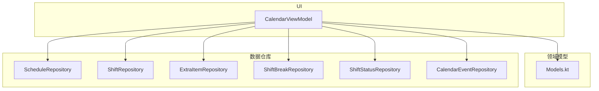
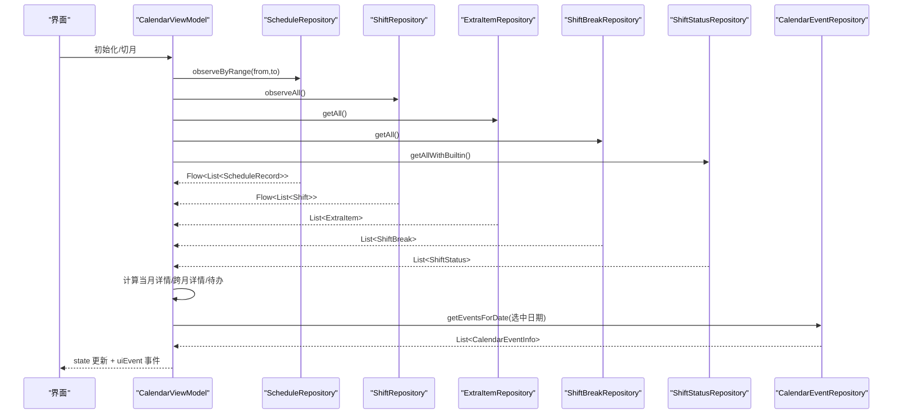
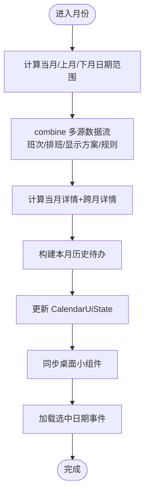
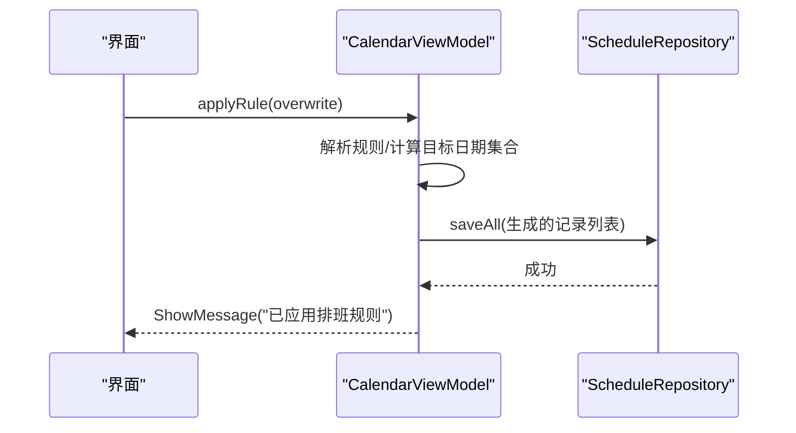
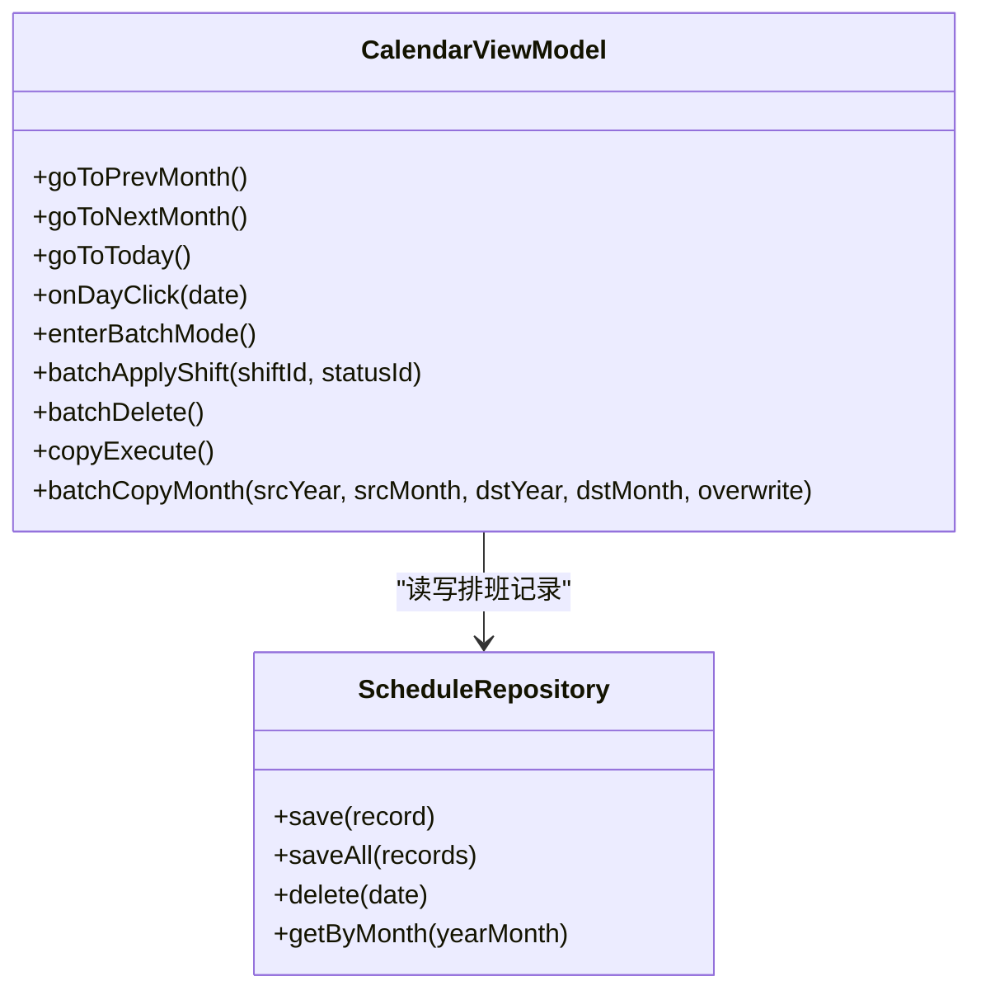
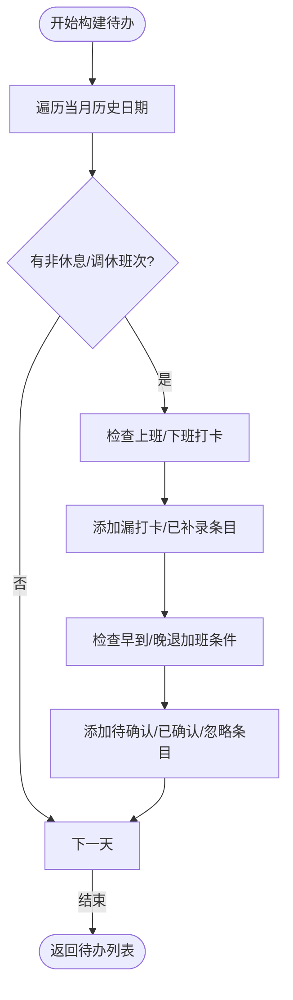
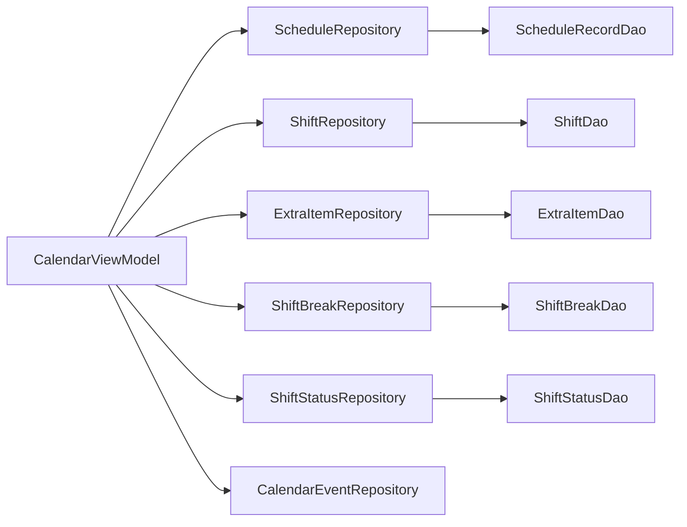

# ViewModel层实现

<cite>
**本文引用的文件列表**
- [CalendarViewModel.kt](file://app/src/main/java/com/schedulecalendar/app/ui/calendar/CalendarViewModel.kt)
- [ScheduleRepository.kt](file://app/src/main/java/com/schedulecalendar/app/data/repository/ScheduleRepository.kt)
- [ShiftRepository.kt](file://app/src/main/java/com/schedulecalendar/app/data/repository/ShiftRepository.kt)
- [ExtraItemRepository.kt](file://app/src/main/java/com/schedulecalendar/app/data/repository/ExtraItemRepository.kt)
- [ShiftBreakRepository.kt](file://app/src/main/java/com/schedulecalendar/app/data/repository/ShiftBreakRepository.kt)
- [ShiftStatusRepository.kt](file://app/src/main/java/com/schedulecalendar/app/data/repository/ShiftStatusRepository.kt)
- [CalendarEventRepository.kt](file://app/src/main/java/com/schedulecalendar/app/data/calendar/CalendarEventRepository.kt)
- [Models.kt](file://app/src/main/java/com/schedulecalendar/app/domain/model/Models.kt)
</cite>

## 目录
1. [简介](#简介)
2. [项目结构](#项目结构)
3. [核心组件](#核心组件)
4. [架构总览](#架构总览)
5. [详细组件分析](#详细组件分析)
6. [依赖关系分析](#依赖关系分析)
7. [性能考量](#性能考量)
8. [故障排查指南](#故障排查指南)
9. [结论](#结论)
10. [附录](#附录)

## 简介
本文件聚焦于排班日历应用的 ViewModel 层实现，重点阐述职责分离原则（状态管理、业务逻辑处理、生命周期管理），并深入解析 CalendarViewModel 的核心功能：月份切换、排班操作、批量处理与待办事项管理。同时说明 StateFlow 在数据流中的作用（状态订阅、数据转换、错误处理）以及协程的使用模式（viewModelScope 作用域管理与异步任务调度）。文档还给出 ViewModel 与 Repository 交互的具体示例路径，涵盖数据加载、缓存策略与同步机制。

## 项目结构
从模块划分看，UI 层位于 ui 包，业务模型位于 domain.model，数据访问通过 repository 封装 DAO 与外部系统（如系统日历 Provider）。CalendarViewModel 作为日历页面的核心协调者，聚合多个 Repository 完成数据读取、计算与 UI 状态更新，并通过 Flow 将变化推送给界面。

图表来源
- [CalendarViewModel.kt:105-132](file://app/src/main/java/com/schedulecalendar/app/ui/calendar/CalendarViewModel.kt#L105-L132)
- [Models.kt:50-100](file://app/src/main/java/com/schedulecalendar/app/domain/model/Models.kt#L50-L100)

章节来源
- [CalendarViewModel.kt:105-132](file://app/src/main/java/com/schedulecalendar/app/ui/calendar/CalendarViewModel.kt#L105-L132)
- [Models.kt:50-100](file://app/src/main/java/com/schedulecalendar/app/domain/model/Models.kt#L50-L100)

## 核心组件
- CalendarViewModel：负责日历页面状态、月份切换、日期点击、打卡补录、加班确认/忽略、规则应用、批量复制/删除、待办中心生成、Widget 同步等。
- Repository 层：对数据库与外部系统进行统一抽象，提供 Flow 观察与 suspend 方法，支持事务性写入与变更通知。
- Domain Models：定义班次、排班记录、附加项、显示方案、薪资配置、考勤规则等核心数据结构。

章节来源
- [CalendarViewModel.kt:105-132](file://app/src/main/java/com/schedulecalendar/app/ui/calendar/CalendarViewModel.kt#L105-L132)
- [Models.kt:50-100](file://app/src/main/java/com/schedulecalendar/app/domain/model/Models.kt#L50-L100)

## 架构总览
CalendarViewModel 使用 MutableStateFlow 暴露不可变状态，结合 combine 多源数据流进行合并计算；通过 viewModelScope 启动协程执行 IO 与业务逻辑；通过 Channel 发送一次性 UI 事件（导航、消息、错误）。

图表来源
- [CalendarViewModel.kt:134-246](file://app/src/main/java/com/schedulecalendar/app/ui/calendar/CalendarViewModel.kt#L134-L246)
- [CalendarViewModel.kt:393-402](file://app/src/main/java/com/schedulecalendar/app/ui/calendar/CalendarViewModel.kt#L393-L402)
- [ScheduleRepository.kt:22-36](file://app/src/main/java/com/schedulecalendar/app/data/repository/ScheduleRepository.kt#L22-L36)
- [ShiftRepository.kt:17-32](file://app/src/main/java/com/schedulecalendar/app/data/repository/ShiftRepository.kt#L17-L32)
- [ExtraItemRepository.kt:15-23](file://app/src/main/java/com/schedulecalendar/app/data/repository/ExtraItemRepository.kt#L15-L23)
- [ShiftBreakRepository.kt:15-19](file://app/src/main/java/com/schedulecalendar/app/data/repository/ShiftBreakRepository.kt#L15-L19)
- [ShiftStatusRepository.kt:24-39](file://app/src/main/java/com/schedulecalendar/app/data/repository/ShiftStatusRepository.kt#L24-L39)
- [CalendarEventRepository.kt:713-749](file://app/src/main/java/com/schedulecalendar/app/data/calendar/CalendarEventRepository.kt#L713-L749)

## 详细组件分析

### CalendarViewModel 职责与状态管理
- 状态模型：CalendarUiState 集中承载当前月份、有效/完整班次、排班映射、显示方案、每日工时详情、待办、批量/复制/清除模式、选中日期、附加项、附加状态、选中日期事件等。
- 状态流：_state 为 MutableStateFlow，对外暴露不可变 state；uiEvent 为 Channel 转 Flow，用于一次性 UI 事件。
- 生命周期：init 中触发首月加载、自动备份、本地日历账户创建；loadCurrentMonth 内部维护 collectJob，切月时取消旧 Job 避免泄漏。

章节来源
- [CalendarViewModel.kt:60-102](file://app/src/main/java/com/schedulecalendar/app/ui/calendar/CalendarViewModel.kt#L60-L102)
- [CalendarViewModel.kt:117-132](file://app/src/main/java/com/schedulecalendar/app/ui/calendar/CalendarViewModel.kt#L117-L132)
- [CalendarViewModel.kt:134-146](file://app/src/main/java/com/schedulecalendar/app/ui/calendar/CalendarViewModel.kt#L134-L146)

#### 月份切换与数据刷新流程
- goToPrevMonth/goToNextMonth/goToToday/goToMonth：仅更新 year/month，必要时清空部分视图数据以避免闪烁；随后调用 loadCurrentMonth 重新收集数据。
- loadCurrentMonth：根据当前年月计算日历网格覆盖的完整日期范围（含上月尾部与下月头部），combine 多源 Flow 后计算当月与跨月详情、待办、选择事件，并同步 Widget。

图表来源
- [CalendarViewModel.kt:134-246](file://app/src/main/java/com/schedulecalendar/app/ui/calendar/CalendarViewModel.kt#L134-L246)

章节来源
- [CalendarViewModel.kt:328-363](file://app/src/main/java/com/schedulecalendar/app/ui/calendar/CalendarViewModel.kt#L328-L363)
- [CalendarViewModel.kt:134-246](file://app/src/main/java/com/schedulecalendar/app/ui/calendar/CalendarViewModel.kt#L134-L246)

#### 排班操作与规则应用
- 单天打卡：clockIn/clockOut/fillMissedClock 获取或新建 ScheduleRecord，设置实际上下班时间并保存。
- 加班处理：confirmEarlyOvertime/confirmLateOvertime/ignoreEarlyArrival/ignoreLateLeave 及其撤销方法，修改对应布尔字段并持久化。
- 规则应用：applyRule 基于 ScheduleRule 生成当月排班序列，支持独立循环与连续循环两种模式，可选择是否覆盖已有记录。

图表来源
- [CalendarViewModel.kt:501-550](file://app/src/main/java/com/schedulecalendar/app/ui/calendar/CalendarViewModel.kt#L501-L550)
- [ScheduleRepository.kt:32-36](file://app/src/main/java/com/schedulecalendar/app/data/repository/ScheduleRepository.kt#L32-L36)

章节来源
- [CalendarViewModel.kt:404-455](file://app/src/main/java/com/schedulecalendar/app/ui/calendar/CalendarViewModel.kt#L404-L455)
- [CalendarViewModel.kt:459-499](file://app/src/main/java/com/schedulecalendar/app/ui/calendar/CalendarViewModel.kt#L459-L499)
- [CalendarViewModel.kt:501-550](file://app/src/main/java/com/schedulecalendar/app/ui/calendar/CalendarViewModel.kt#L501-L550)

#### 批量处理与复制排班
- 批量模式：enterBatchMode/exitAllModes/toggleBatchMode/batchSelectAll/batchClearSelection/batchAddToSelection 管理选择集。
- 批量应用：batchApplyShift 将所选日期设置为指定班次与状态，并合并默认关联附加项。
- 批量删除：batchDelete 删除所选日期的排班记录。
- 复制排班：enterCopyMode/exitCopyMode/copySourceClick/copyEnterPhase2/copyTargetClick/copyExecute 支持两阶段选择与偏移复制；batchCopyMonth 支持整月范围复制。

图表来源
- [CalendarViewModel.kt:554-793](file://app/src/main/java/com/schedulecalendar/app/ui/calendar/CalendarViewModel.kt#L554-L793)
- [ScheduleRepository.kt:22-36](file://app/src/main/java/com/schedulecalendar/app/data/repository/ScheduleRepository.kt#L22-L36)

章节来源
- [CalendarViewModel.kt:554-793](file://app/src/main/java/com/schedulecalendar/app/ui/calendar/CalendarViewModel.kt#L554-L793)

#### 待办事项管理
- buildTodos 遍历当月历史日期，依据班次与实际打卡情况生成漏打卡、已补录、早到/晚退加班待确认/已确认/忽略等条目。
- 结果纳入 CalendarUiState.todos，供“待办中心”展示。

图表来源
- [CalendarViewModel.kt:249-324](file://app/src/main/java/com/schedulecalendar/app/ui/calendar/CalendarViewModel.kt#L249-L324)

章节来源
- [CalendarViewModel.kt:249-324](file://app/src/main/java/com/schedulecalendar/app/ui/calendar/CalendarViewModel.kt#L249-L324)

#### 状态订阅、数据转换与错误处理
- 状态订阅：UI 侧通过 state.collectAsState 订阅不可变状态，确保响应式更新。
- 数据转换：combine 将多源 Flow 合并为 Triple，再转换为 Map 与计算结果；Repository 层 map 将实体转为领域模型。
- 错误处理：applyRule 使用 runCatching 捕获异常并通过 uiEvent 发送错误消息；loadSelectedDateEvents 使用 try-catch 保护系统日历查询。

章节来源
- [CalendarViewModel.kt:160-167](file://app/src/main/java/com/schedulecalendar/app/ui/calendar/CalendarViewModel.kt#L160-L167)
- [CalendarViewModel.kt:501-511](file://app/src/main/java/com/schedulecalendar/app/ui/calendar/CalendarViewModel.kt#L501-L511)
- [CalendarViewModel.kt:393-402](file://app/src/main/java/com/schedulecalendar/app/ui/calendar/CalendarViewModel.kt#L393-L402)

#### 协程与 viewModelScope 使用模式
- 所有写操作与耗时计算均在 viewModelScope.launch 中执行，保证与 ViewModel 生命周期绑定，避免内存泄漏。
- loadCurrentMonth 内部使用 collectJob 跟踪无限收集协程，切月时 cancel 旧 Job 再启动新 Job，防止 collector 累积。
- 系统日历查询使用 withContext(IO) 切换到 IO 线程，避免阻塞主线程。

章节来源
- [CalendarViewModel.kt:123-132](file://app/src/main/java/com/schedulecalendar/app/ui/calendar/CalendarViewModel.kt#L123-L132)
- [CalendarViewModel.kt:134-146](file://app/src/main/java/com/schedulecalendar/app/ui/calendar/CalendarViewModel.kt#L134-L146)
- [CalendarViewModel.kt:393-402](file://app/src/main/java/com/schedulecalendar/app/ui/calendar/CalendarViewModel.kt#L393-L402)

#### ViewModel 与 Repository 交互示例（数据加载、缓存策略、同步机制）
- 数据加载：loadCurrentMonth 通过 observeByRange(rangeFrom, rangeTo) 拉取当月及跨月排班；observeAll/observeAllWithBuiltin 拉取完整班次与状态；getAll/getAllWithBuiltin 拉取附加项与状态。
- 缓存策略：Repository 层通过 Flow 提供实时观察，ViewModel 在内存中维护 schedules/allShifts/allShiftStatuses 等映射，减少重复计算；DisplayScheme 与 ScheduleRule 来自 AppPreferences 的 Flow，保持配置一致性。
- 同步机制：write 操作后 Repository 发出 refreshSignal（SharedFlow），便于其他组件感知变更；CalendarViewModel 在写操作后主动调用 syncWidget 与 loadCurrentMonth 刷新相关视图。

章节来源
- [CalendarViewModel.kt:160-246](file://app/src/main/java/com/schedulecalendar/app/ui/calendar/CalendarViewModel.kt#L160-L246)
- [ScheduleRepository.kt:17-36](file://app/src/main/java/com/schedulecalendar/app/data/repository/ScheduleRepository.kt#L17-L36)
- [ShiftRepository.kt:17-32](file://app/src/main/java/com/schedulecalendar/app/data/repository/ShiftRepository.kt#L17-L32)
- [ExtraItemRepository.kt:15-23](file://app/src/main/java/com/schedulecalendar/app/data/repository/ExtraItemRepository.kt#L15-L23)
- [ShiftStatusRepository.kt:24-39](file://app/src/main/java/com/schedulecalendar/app/data/repository/ShiftStatusRepository.kt#L24-L39)

## 依赖关系分析
CalendarViewModel 依赖多个 Repository 以解耦数据源，各 Repository 又依赖 DAO 与领域模型。依赖方向清晰，无循环依赖。

图表来源
- [CalendarViewModel.kt:105-115](file://app/src/main/java/com/schedulecalendar/app/ui/calendar/CalendarViewModel.kt#L105-L115)
- [ScheduleRepository.kt:14-16](file://app/src/main/java/com/schedulecalendar/app/data/repository/ScheduleRepository.kt#L14-L16)
- [ShiftRepository.kt:13-15](file://app/src/main/java/com/schedulecalendar/app/data/repository/ShiftRepository.kt#L13-L15)
- [ExtraItemRepository.kt:12-14](file://app/src/main/java/com/schedulecalendar/app/data/repository/ExtraItemRepository.kt#L12-L14)
- [ShiftBreakRepository.kt:12-14](file://app/src/main/java/com/schedulecalendar/app/data/repository/ShiftBreakRepository.kt#L12-L14)
- [ShiftStatusRepository.kt:13-15](file://app/src/main/java/com/schedulecalendar/app/data/repository/ShiftStatusRepository.kt#L13-L15)

章节来源
- [CalendarViewModel.kt:105-115](file://app/src/main/java/com/schedulecalendar/app/ui/calendar/CalendarViewModel.kt#L105-L115)
- [ScheduleRepository.kt:14-16](file://app/src/main/java/com/schedulecalendar/app/data/repository/ScheduleRepository.kt#L14-L16)
- [ShiftRepository.kt:13-15](file://app/src/main/java/com/schedulecalendar/app/data/repository/ShiftRepository.kt#L13-L15)
- [ExtraItemRepository.kt:12-14](file://app/src/main/java/com/schedulecalendar/app/data/repository/ExtraItemRepository.kt#L12-L14)
- [ShiftBreakRepository.kt:12-14](file://app/src/main/java/com/schedulecalendar/app/data/repository/ShiftBreakRepository.kt#L12-L14)
- [ShiftStatusRepository.kt:13-15](file://app/src/main/java/com/schedulecalendar/app/data/repository/ShiftStatusRepository.kt#L13-L15)

## 性能考量
- 流合并优化：使用 combine 一次性合并多源数据，减少多次 UI 更新；仅在必要范围（rangeFrom-rangeTo）内查询排班，降低 IO 压力。
- 历史归档数据：allShifts/allShiftStatuses 包含已归档项，确保历史日期计算正确，避免额外查询。
- 协程作用域：collectJob 控制无限收集的生命周期，避免内存泄漏；IO 操作显式切换到 Dispatchers.IO。
- Widget 同步：在状态稳定后批量更新小组件，避免频繁刷新。

[本节为通用指导，不直接分析具体文件]

## 故障排查指南
- 应用规则失败：查看 applyRule 的错误分支，确认规则参数与日期范围是否正确；错误信息通过 uiEvent.ShowError 上报。
- 系统日历权限问题：CalendarEventRepository 在创建账户/日历时会检查 WRITE_CALENDAR 权限，若未授权则无法创建；建议引导用户授予权限。
- 数据不同步：检查 Repository 的 notifyChanged 是否被调用；确认 UI 侧是否正确订阅 Flow 并在变更后刷新。

章节来源
- [CalendarViewModel.kt:501-511](file://app/src/main/java/com/schedulecalendar/app/ui/calendar/CalendarViewModel.kt#L501-L511)
- [CalendarEventRepository.kt:420-443](file://app/src/main/java/com/schedulecalendar/app/data/calendar/CalendarEventRepository.kt#L420-L443)
- [ScheduleRepository.kt:17-21](file://app/src/main/java/com/schedulecalendar/app/data/repository/ScheduleRepository.kt#L17-L21)

## 结论
CalendarViewModel 通过清晰的职责分离与响应式数据流，实现了日历页面的复杂业务逻辑与状态管理。借助 StateFlow 与 combine，多源数据高效合并；通过 viewModelScope 与 collectJob，协程生命周期得到严格管理；通过 Repository 抽象，数据访问与外部系统集成得以解耦。整体设计具备良好的可维护性与扩展性。

[本节为总结，不直接分析具体文件]

## 附录
- 关键数据模型参考：
  - 班次与内置类型：[Models.kt:50-78](file://app/src/main/java/com/schedulecalendar/app/domain/model/Models.kt#L50-L78)
  - 排班记录与附加项：[Models.kt:80-109](file://app/src/main/java/com/schedulecalendar/app/domain/model/Models.kt#L80-L109)
  - 显示方案与数据行配置：[Models.kt:167-180](file://app/src/main/java/com/schedulecalendar/app/domain/model/Models.kt#L167-L180)
  - 排班循环规则：[Models.kt:189-194](file://app/src/main/java/com/schedulecalendar/app/domain/model/Models.kt#L189-L194)

章节来源
- [Models.kt:50-109](file://app/src/main/java/com/schedulecalendar/app/domain/model/Models.kt#L50-L109)
- [Models.kt:167-194](file://app/src/main/java/com/schedulecalendar/app/domain/model/Models.kt#L167-L194)