# 待办事项ViewModel

<cite>
**本文引用的文件**   
- [TodoScreen.kt](file://app/src/main/java/com/schedulecalendar/app/ui/todo/TodoScreen.kt)
- [CalendarViewModel.kt](file://app/src/main/java/com/schedulecalendar/app/ui/calendar/CalendarViewModel.kt)
- [Models.kt](file://app/src/main/java/com/schedulecalendar/app/domain/model/Models.kt)
- [CalcUtils.kt](file://app/src/main/java/com/schedulecalendar/app/domain/model/CalcUtils.kt)
- [ScheduleRepository.kt](file://app/src/main/java/com/schedulecalendar/app/data/repository/ScheduleRepository.kt)
- [CalendarEventViewModel.kt](file://app/src/main/java/com/schedulecalendar/app/ui/todo/CalendarEventViewModel.kt)
- [CalendarEventRepository.kt](file://app/src/main/java/com/schedulecalendar/app/data/calendar/CalendarEventRepository.kt)
- [AppPreferences.kt](file://app/src/main/java/com/schedulecalendar/app/data/prefs/AppPreferences.kt)
- [AddCalendarEventScreen.kt](file://app/src/main/java/com/schedulecalendar/app/ui/todo/AddCalendarEventScreen.kt)
</cite>

## 更新摘要
**变更内容**   
- 新增日程专用日历ID管理功能，支持懒加载和缓存机制
- CalendarEventViewModel的prefs属性公开化，允许UI层直接访问偏好数据
- 增强日历事件创建流程，提供专用的日程日历ID获取方法
- 优化禁用账户过滤逻辑，提升用户体验

## 目录
1. [简介](#简介)
2. [项目结构](#项目结构)
3. [核心组件](#核心组件)
4. [架构总览](#架构总览)
5. [详细组件分析](#详细组件分析)
6. [依赖关系分析](#依赖关系分析)
7. [性能与优化](#性能与优化)
8. [故障排查指南](#故障排查指南)
9. [结论](#结论)
10. [附录：关键流程时序图](#附录关键流程时序图)

## 简介
本文件围绕"待办事项"的 ViewModel 实现进行系统化说明，覆盖以下目标：
- 漏打卡检测、加班确认流程与日程事件管理
- TodoItem 数据模型设计（类型标识、显示信息、操作状态）
- 系统日历服务集成（事件查询、创建、更新）
- 自动检测与生成逻辑（考勤规则应用、时间计算）
- 从数据收集到用户交互的完整生命周期示例

## 项目结构
待办事项相关代码主要分布在 UI 层、领域模型层与数据仓库层：
- UI 层：TodoScreen 负责展示与交互；CalendarEventViewModel 负责日程事件管理
- 领域模型层：Models.kt 定义排班、班次、附加项、薪资配置等；CalcUtils.kt 提供工时/薪资计算工具
- 数据仓库层：ScheduleRepository 封装排班记录的读写；CalendarEventRepository 封装系统日历 Provider 的读写

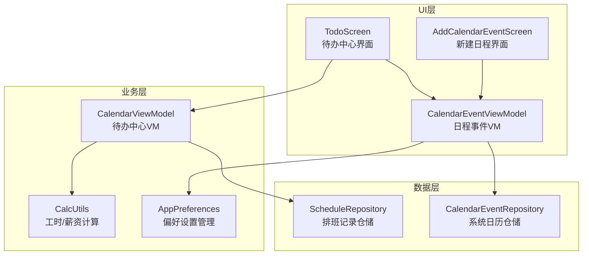

图表来源
- [TodoScreen.kt:1-200](file://app/src/main/java/com/schedulecalendar/app/ui/todo/TodoScreen.kt#L1-L200)
- [CalendarViewModel.kt:100-250](file://app/src/main/java/com/schedulecalendar/app/ui/calendar/CalendarViewModel.kt#L100-L250)
- [CalendarEventViewModel.kt:1-120](file://app/src/main/java/com/schedulecalendar/app/ui/todo/CalendarEventViewModel.kt#L1-L120)
- [AddCalendarEventScreen.kt:1-100](file://app/src/main/java/com/schedulecalendar/app/ui/todo/AddCalendarEventScreen.kt#L1-L100)
- [ScheduleRepository.kt:1-40](file://app/src/main/java/com/schedulecalendar/app/data/repository/ScheduleRepository.kt#L1-L40)
- [CalendarEventRepository.kt:1-120](file://app/src/main/java/com/schedulecalendar/app/data/calendar/CalendarEventRepository.kt#L1-L120)

章节来源
- [TodoScreen.kt:1-200](file://app/src/main/java/com/schedulecalendar/app/ui/todo/TodoScreen.kt#L1-L200)
- [CalendarViewModel.kt:100-250](file://app/src/main/java/com/schedulecalendar/app/ui/calendar/CalendarViewModel.kt#L100-L250)
- [CalendarEventViewModel.kt:1-120](file://app/src/main/java/com/schedulecalendar/app/ui/todo/CalendarEventViewModel.kt#L1-L120)
- [AddCalendarEventScreen.kt:1-100](file://app/src/main/java/com/schedulecalendar/app/ui/todo/AddCalendarEventScreen.kt#L1-L100)
- [ScheduleRepository.kt:1-40](file://app/src/main/java/com/schedulecalendar/app/data/repository/ScheduleRepository.kt#L1-L40)
- [CalendarEventRepository.kt:1-120](file://app/src/main/java/com/schedulecalendar/app/data/calendar/CalendarEventRepository.kt#L1-L120)

## 核心组件
- CalendarViewModel：构建当月待办列表、处理补录与加班确认、撤销操作、月份切换、选中日期事件加载
- TodoScreen：渲染待办分类区块、合并同一天上班/下班行、弹窗交互、触发 VM 动作
- CalendarEventViewModel：权限检查、账户与事件加载、内容观察者监听、增删改查事件、**日程专用日历ID管理**
- CalcUtils：考勤粒度取整、容忍时长、跨天归一化、日/月工时统计、自动计薪模式判断
- ScheduleRepository：排班记录的观察与持久化
- CalendarEventRepository：系统日历账户/事件 CRUD、本地日历创建、纪念日专用日历
- AppPreferences：**公开的偏好数据访问接口**，支持禁用账户ID流式监听

章节来源
- [CalendarViewModel.kt:249-324](file://app/src/main/java/com/schedulecalendar/app/ui/calendar/CalendarViewModel.kt#L249-L324)
- [TodoScreen.kt:218-417](file://app/src/main/java/com/schedulecalendar/app/ui/todo/TodoScreen.kt#L218-L417)
- [CalendarEventViewModel.kt:96-152](file://app/src/main/java/com/schedulecalendar/app/ui/todo/CalendarEventViewModel.kt#L96-L152)
- [CalendarEventViewModel.kt:183-207](file://app/src/main/java/com/schedulecalendar/app/ui/todo/CalendarEventViewModel.kt#L183-L207)
- [AppPreferences.kt:252-262](file://app/src/main/java/com/schedulecalendar/app/data/prefs/AppPreferences.kt#L252-L262)
- [CalcUtils.kt:61-113](file://app/src/main/java/com/schedulecalendar/app/domain/model/CalcUtils.kt#L61-L113)
- [ScheduleRepository.kt:14-39](file://app/src/main/java/com/schedulecalendar/app/data/repository/ScheduleRepository.kt#L14-L39)
- [CalendarEventRepository.kt:412-517](file://app/src/main/java/com/schedulecalendar/app/data/calendar/CalendarEventRepository.kt#L412-L517)

## 架构总览
待办中心的数据流遵循"响应式 + 命令式"混合模式：
- 数据源：Shift、ScheduleRecord、Break、ExtraItem、SalaryConfig、AttendConfig 通过 Repository 暴露 Flow
- 聚合计算：CalendarViewModel 在 loadCurrentMonth 中 combine 多源数据，调用 CalcUtils 计算 dayDetails 与 todos
- 用户交互：TodoScreen 将用户操作转换为 VM 方法调用，持久化后刷新 UI
- 日历集成：CalendarEventViewModel 独立管理系统日历事件，支持按日期查询并联动 CalendarViewModel 的 selectedDateEvents
- **偏好访问：UI层可直接访问AppPreferences以获取禁用账户ID等配置信息**

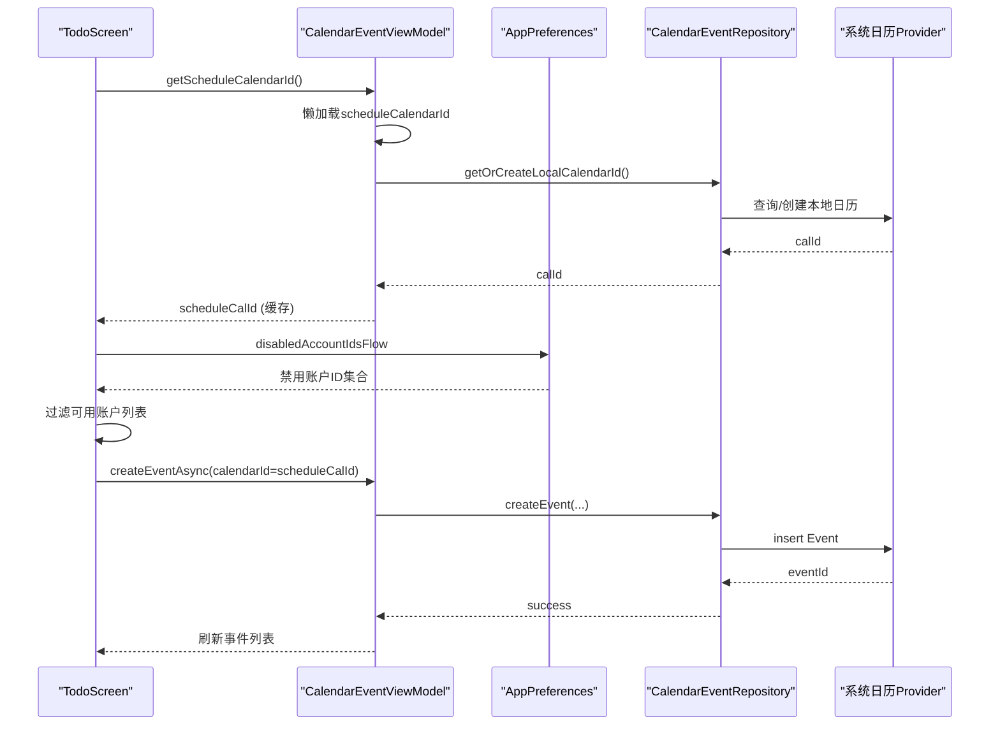

图表来源
- [CalendarEventViewModel.kt:183-194](file://app/src/main/java/com/schedulecalendar/app/ui/todo/CalendarEventViewModel.kt#L183-L194)
- [AddCalendarEventScreen.kt:71-76](file://app/src/main/java/com/schedulecalendar/app/ui/todo/AddCalendarEventScreen.kt#L71-L76)
- [AddCalendarEventScreen.kt:79](file://app/src/main/java/com/schedulecalendar/app/ui/todo/AddCalendarEventScreen.kt#L79)
- [CalendarEventRepository.kt:412-517](file://app/src/main/java/com/schedulecalendar/app/data/calendar/CalendarEventRepository.kt#L412-L517)

## 详细组件分析

### TodoItem 数据模型与类型
- 字段含义
  - date：日期字符串 yyyy-MM-dd
  - type：TodoType 枚举，标识待办类型
  - label：显示标签（如"上班漏打卡"）
  - shiftName/shiftTime：班次名称与时间段
  - clockTime：已录入的实际打卡时间
  - overtimeMinutes：早到/晚退分钟数
  - actualTime：实际打卡时间（用于展示）
- 类型枚举
  - MISSED_CLOCK_IN/MISSED_CLOCK_OUT：漏打卡（上班/下班）
  - FILLED_CLOCK_IN/FILLED_CLOCK_OUT：已补录（上班/下班）
  - PENDING_EARLY_OT/PENDING_LATE_OT：疑似加班待确认（早到/晚退）
  - CONFIRMED_EARLY_OT/CONFIRMED_LATE_OT：已确认加班（早到/晚退）
  - IGNORED_EARLY_OT/IGNORED_LATE_OT：忽略加班（早到/晚退）

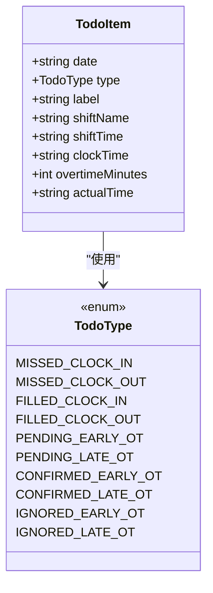

图表来源
- [CalendarViewModel.kt:33-50](file://app/src/main/java/com/schedulecalendar/app/ui/calendar/CalendarViewModel.kt#L33-L50)

章节来源
- [CalendarViewModel.kt:33-50](file://app/src/main/java/com/schedulecalendar/app/ui/calendar/CalendarViewModel.kt#L33-L50)

### 漏打卡检测与补录流程
- 检测逻辑
  - 遍历当月历史日期（不含今天及未来），若存在班次且缺少实际打卡时间，则生成漏打卡待办
  - 上班/下班分别独立判断，避免相互影响
- 补录交互
  - 点击"补录"弹出时间选择器，默认值来自班次时间
  - 确认后写入 ScheduleRecord.actualStartTime/actualEndTime，并发送消息提示
- 撤销补录
  - 清除对应字段，回到漏打卡状态

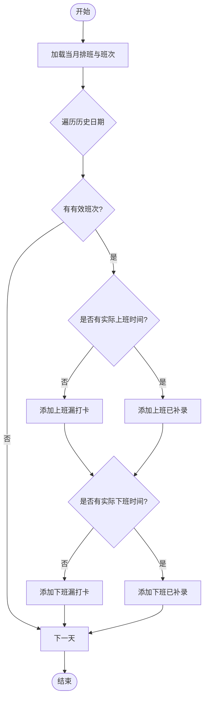

图表来源
- [CalendarViewModel.kt:249-324](file://app/src/main/java/com/schedulecalendar/app/ui/calendar/CalendarViewModel.kt#L249-L324)
- [TodoScreen.kt:706-753](file://app/src/main/java/com/schedulecalendar/app/ui/todo/TodoScreen.kt#L706-L753)

章节来源
- [CalendarViewModel.kt:249-324](file://app/src/main/java/com/schedulecalendar/app/ui/calendar/CalendarViewModel.kt#L249-L324)
- [TodoScreen.kt:706-753](file://app/src/main/java/com/schedulecalendar/app/ui/todo/TodoScreen.kt#L706-L753)

### 加班确认流程
- 待确认条件
  - 早到加班：有实际上班时间且早于班次开始，未忽略且未确认，且早到分钟数达到考勤粒度
  - 晚退加班：有实际下班时间且晚于班次结束，未忽略且未确认，且晚退分钟数达到考勤粒度
- 确认/忽略
  - 确认后标记 confirmEarlyOT/confirmLateOT，并在列表中显示为"已确认加班"
  - 忽略后标记 ignoreEarlyArrival/ignoreLateLeave，显示为"忽略加班"
- 撤销
  - 将对应布尔位重置为 false，回到待确认或漏打卡状态

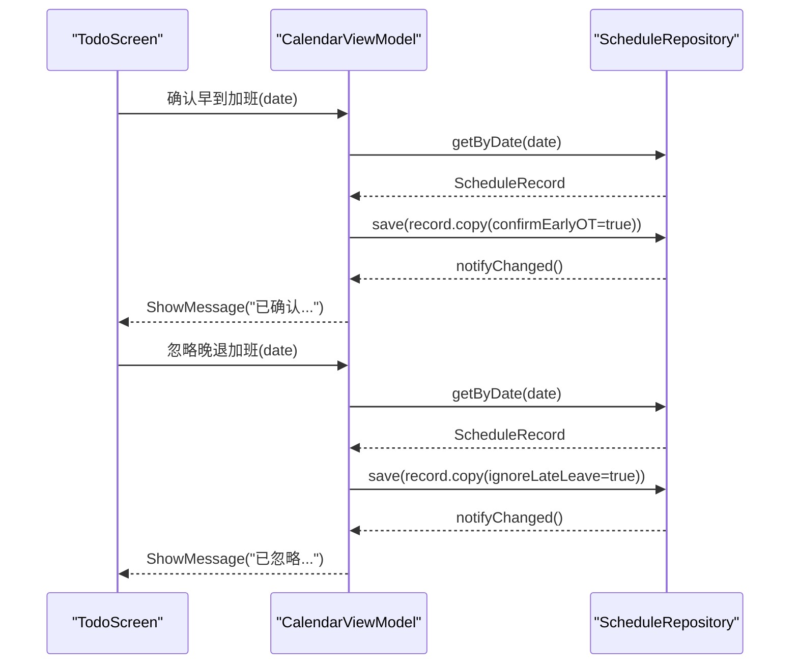

图表来源
- [CalendarViewModel.kt:429-455](file://app/src/main/java/com/schedulecalendar/app/ui/calendar/CalendarViewModel.kt#L429-L455)
- [CalendarViewModel.kt:487-499](file://app/src/main/java/com/schedulecalendar/app/ui/calendar/CalendarViewModel.kt#L487-L499)
- [TodoScreen.kt:755-799](file://app/src/main/java/com/schedulecalendar/app/ui/todo/TodoScreen.kt#L755-L799)

章节来源
- [CalendarViewModel.kt:429-455](file://app/src/main/java/com/schedulecalendar/app/ui/calendar/CalendarViewModel.kt#L429-L455)
- [CalendarViewModel.kt:487-499](file://app/src/main/java/com/schedulecalendar/app/ui/calendar/CalendarViewModel.kt#L487-L499)
- [TodoScreen.kt:755-799](file://app/src/main/java/com/schedulecalendar/app/ui/todo/TodoScreen.kt#L755-L799)

### 日程事件管理（与系统日历集成）
- 权限与账户
  - 初始化时检查 READ_CALENDAR 权限，无权限则阻止后续操作
  - 确保应用自有账户与本地日历存在（getOrCreateLocalCalendarId），并创建纪念日专用日历（getOrCreateAnniversaryCalendarId）
- **日程专用日历ID管理**
  - **新增scheduleCalendarId私有属性用于存储日程事件的专用日历ID**
  - **实现getScheduleCalendarId()函数进行懒加载和缓存，避免重复查询**
  - **UI层可通过该API获取默认的日程日历ID用于新事件创建**
- 事件加载与过滤
  - 加载所有事件，根据禁用账户与分类映射过滤出"日程"和"纪念日"两类
  - 使用 ContentObserver 监听系统日历变化，自动刷新
- 增删改查
  - createEventAsync：创建事件（支持全天、地点、RRULE、提醒、颜色）
  - updateEvent/deleteEvent：更新或删除事件
  - loadEventById：按 ID 加载单个事件供编辑页使用
  - changeEventCategory：在"日程"与"纪念日"之间转换（标题前缀与 RRULE 调整）

```mermaid
sequenceDiagram
participant UI as "AddCalendarEventScreen"
participant CEVM as "CalendarEventViewModel"
val Prefs as "AppPreferences"
participant Repo as "CalendarEventRepository"
participant OS as "系统日历Provider"
UI->>CEVM : getScheduleCalendarId()
CEVM->>CEVM : 检查scheduleCalendarId缓存
alt 缓存为空
CEVM->>Repo : getOrCreateLocalCalendarId()
Repo->>OS : 查询/创建本地日历
OS-->>Repo : calId
Repo-->>CEVM : calId
CEVM->>CEVM : 缓存scheduleCalendarId
else 缓存存在
CEVM-->>UI : 返回缓存的scheduleCalendarId
end
UI->>Prefs : disabledAccountIdsFlow.collectAsStateWithLifecycle()
Prefs-->>UI : 禁用账户ID集合
UI->>UI : 过滤可见账户列表
UI->>CEVM : createEventAsync(calendarId=selectedAccountId ? : scheduleCalId)
CEVM->>Repo : createEvent(...)
Repo->>OS : insert Event + Reminder
OS-->>Repo : eventId
Repo-->>CEVM : success
CEVM-->>UI : loadEvents() 刷新列表
```

图表来源
- [CalendarEventViewModel.kt:183-194](file://app/src/main/java/com/schedulecalendar/app/ui/todo/CalendarEventViewModel.kt#L183-L194)
- [AddCalendarEventScreen.kt:71-76](file://app/src/main/java/com/schedulecalendar/app/ui/todo/AddCalendarEventScreen.kt#L71-L76)
- [AddCalendarEventScreen.kt:79](file://app/src/main/java/com/schedulecalendar/app/ui/todo/AddCalendarEventScreen.kt#L79)
- [CalendarEventRepository.kt:412-517](file://app/src/main/java/com/schedulecalendar/app/data/calendar/CalendarEventRepository.kt#L412-L517)
- [CalendarEventRepository.kt:275-330](file://app/src/main/java/com/schedulecalendar/app/data/calendar/CalendarEventRepository.kt#L275-L330)

章节来源
- [CalendarEventViewModel.kt:96-152](file://app/src/main/java/com/schedulecalendar/app/ui/todo/CalendarEventViewModel.kt#L96-L152)
- [CalendarEventViewModel.kt:183-194](file://app/src/main/java/com/schedulecalendar/app/ui/todo/CalendarEventViewModel.kt#L183-L194)
- [CalendarEventRepository.kt:412-517](file://app/src/main/java/com/schedulecalendar/app/data/calendar/CalendarEventRepository.kt#L412-L517)
- [CalendarEventRepository.kt:275-330](file://app/src/main/java/com/schedulecalendar/app/data/calendar/CalendarEventRepository.kt#L275-L330)

### 自动检测与生成逻辑（考勤规则与时间计算）
- 考勤粒度与容忍
  - applyAttendGrain：对早到/迟到/晚退/早退进行粒度取整与容忍处理，得到 effectiveStart/effectiveEnd
- 全局休息段扣减
  - calcGlobalBreakHours：计算午休等不计入工时段与班次窗口的重叠时长
- 日工时计算
  - calcDayHours：依据排班类型、实际打卡、全局休息、状态时间段、计薪方式（工作日/周末/节假日）计算正常/加班/周末/假日工时
- 月统计与明细
  - calcMonthHours/getMonthScheduleDetails：汇总月维度指标与每日明细，供 UI 展示

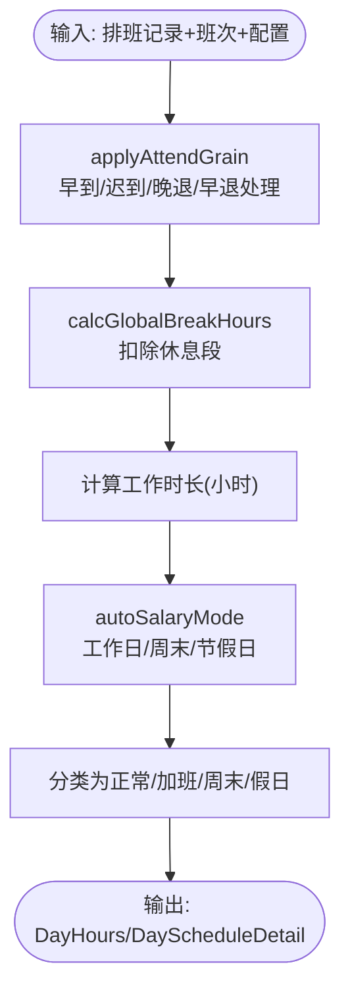

图表来源
- [CalcUtils.kt:61-113](file://app/src/main/java/com/schedulecalendar/app/domain/model/CalcUtils.kt#L61-L113)
- [CalcUtils.kt:149-230](file://app/src/main/java/com/schedulecalendar/app/domain/model/CalcUtils.kt#L149-L230)
- [CalcUtils.kt:427-465](file://app/src/main/java/com/schedulecalendar/app/domain/model/CalcUtils.kt#L427-L465)

章节来源
- [CalcUtils.kt:61-113](file://app/src/main/java/com/schedulecalendar/app/domain/model/CalcUtils.kt#L61-L113)
- [CalcUtils.kt:149-230](file://app/src/main/java/com/schedulecalendar/app/domain/model/CalcUtils.kt#L149-L230)
- [CalcUtils.kt:427-465](file://app/src/main/java/com/schedulecalendar/app/domain/model/CalcUtils.kt#L427-L465)

### 待办中心 UI 与交互
- 分类展示
  - 漏打卡待补录、已补录、疑似加班待确认、已确认加班、忽略加班
  - 同一天上班/下班合并显示，提升可读性
- 交互弹窗
  - 漏打卡补录：直接弹出时间选择器，默认值来自班次时间
  - 加班处理：确认/忽略弹窗，明确早到/晚退场景
- 状态同步
  - 操作成功后通过 Snackbar 提示，并触发 VM 刷新
- **偏好数据直接访问**
  - **UI层可直接访问CalendarEventViewModel.prefs属性获取禁用账户ID**
  - **通过disabledAccountIdsFlow实时监听禁用状态变化**
  - **动态过滤可用账户列表，提升用户体验**

章节来源
- [TodoScreen.kt:218-417](file://app/src/main/java/com/schedulecalendar/app/ui/todo/TodoScreen.kt#L218-L417)
- [TodoScreen.kt:706-799](file://app/src/main/java/com/schedulecalendar/app/ui/todo/TodoScreen.kt#L706-L799)
- [AddCalendarEventScreen.kt:79](file://app/src/main/java/com/schedulecalendar/app/ui/todo/AddCalendarEventScreen.kt#L79)

## 依赖关系分析
- 低耦合高内聚
  - CalendarViewModel 仅依赖 Repository 与 CalcUtils，不直接访问 Android API
  - CalendarEventViewModel 与 CalendarEventRepository 解耦系统日历 Provider
  - **UI层可直接访问AppPreferences，简化偏好数据访问流程**
- 外部依赖
  - Android Calendar Provider（读写事件、账户）
  - Room/DAO（通过 Repository 间接访问）
  - DataStore/AppPreferences（读取配置）

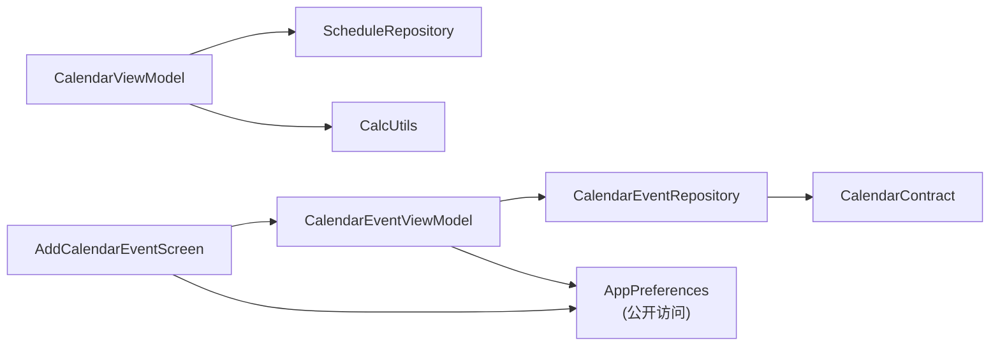

图表来源
- [CalendarViewModel.kt:104-132](file://app/src/main/java/com/schedulecalendar/app/ui/calendar/CalendarViewModel.kt#L104-L132)
- [CalendarEventViewModel.kt:46-51](file://app/src/main/java/com/schedulecalendar/app/ui/todo/CalendarEventViewModel.kt#L46-L51)
- [CalendarEventRepository.kt:47-59](file://app/src/main/java/com/schedulecalendar/app/data/calendar/CalendarEventRepository.kt#L47-L59)
- [AddCalendarEventScreen.kt:79](file://app/src/main/java/com/schedulecalendar/app/ui/todo/AddCalendarEventScreen.kt#L79)

章节来源
- [CalendarViewModel.kt:104-132](file://app/src/main/java/com/schedulecalendar/app/ui/calendar/CalendarViewModel.kt#L104-L132)
- [CalendarEventViewModel.kt:46-51](file://app/src/main/java/com/schedulecalendar/app/ui/todo/CalendarEventViewModel.kt#L46-L51)
- [CalendarEventRepository.kt:47-59](file://app/src/main/java/com/schedulecalendar/app/data/calendar/CalendarEventRepository.kt#L47-L59)
- [AddCalendarEventScreen.kt:79](file://app/src/main/java/com/schedulecalendar/app/ui/todo/AddCalendarEventScreen.kt#L79)

## 性能与优化
- 数据收集范围控制
  - loadCurrentMonth 计算日历网格覆盖的完整日期范围（含上月尾部与下月头部），减少不必要的查询
- 组合流与缓存
  - 使用 combine 聚合多源数据，避免重复计算；remember(todos) 在 UI 层缓存分类结果
  - **日程专用日历ID采用懒加载和缓存机制，避免重复查询系统日历**
- 异步与线程
  - 日历事件加载与 IO 操作在 Dispatchers.IO 执行，避免阻塞主线程
- 增量刷新
  - Repository 写操作后发出 refreshSignal，VM 可据此局部刷新，降低全量重建开销
- **偏好数据流式监听**
  - **通过Flow实时监听禁用账户ID变化，自动更新UI显示**

[本节为通用指导，无需具体文件引用]

## 故障排查指南
- 权限问题
  - 若 READ_CALENDAR/WRITE_CALENDAR 未授权，CalendarEventViewModel 会拒绝加载/创建事件，需引导用户授权
- 国产 ROM 兼容
  - 创建事件时设置 HAS_ALARM 与 ExtendedProperties 的 need_alarm 标志，部分厂商可能不支持扩展属性，异常被捕获并记录日志
- 重复创建
  - 通过 findEventByDateAndTitle 与 findEventsByTitlePrefix 避免重复生成上下班提醒事件
- 数据一致性
  - 写操作后通过 notifyChanged 通知 UI 刷新，确保待办列表与详情一致
- **日程日历ID获取失败**
  - **检查getScheduleCalendarId()是否正确实现懒加载和缓存**
  - **验证UI层是否正确处理null返回值**
- **禁用账户过滤异常**
  - **确认prefs.disabledAccountIdsFlow是否正确订阅**
  - **检查账户ID匹配逻辑是否准确**

章节来源
- [CalendarEventViewModel.kt:225-265](file://app/src/main/java/com/schedulecalendar/app/ui/todo/CalendarEventViewModel.kt#L225-L265)
- [CalendarEventRepository.kt:317-381](file://app/src/main/java/com/schedulecalendar/app/data/calendar/CalendarEventRepository.kt#L317-L381)
- [CalendarEventRepository.kt:630-683](file://app/src/main/java/com/schedulecalendar/app/data/calendar/CalendarEventRepository.kt#L630-L683)
- [ScheduleRepository.kt:17-21](file://app/src/main/java/com/schedulecalendar/app/data/repository/ScheduleRepository.kt#L17-L21)
- [CalendarEventViewModel.kt:183-194](file://app/src/main/java/com/schedulecalendar/app/ui/todo/CalendarEventViewModel.kt#L183-L194)
- [AddCalendarEventScreen.kt:79](file://app/src/main/java/com/schedulecalendar/app/ui/todo/AddCalendarEventScreen.kt#L79)

## 结论
本实现以 CalendarViewModel 为核心，结合 CalcUtils 的考勤与工时计算能力，构建了完整的待办中心。其特点包括：
- 明确的待办类型与状态流转，覆盖漏打卡与加班确认全流程
- 与系统日历深度集成，支持事件查询、创建、更新与分类管理
- **新增日程专用日历ID管理功能，提供懒加载和缓存机制**
- **偏好数据访问公开化，简化UI层配置获取流程**
- 响应式数据流与合理的范围控制，保证性能与用户体验
- 良好的错误处理与兼容性策略，适配不同厂商系统行为

[本节为总结性内容，无需具体文件引用]

## 附录：关键流程时序图

### 补录漏打卡（上班）
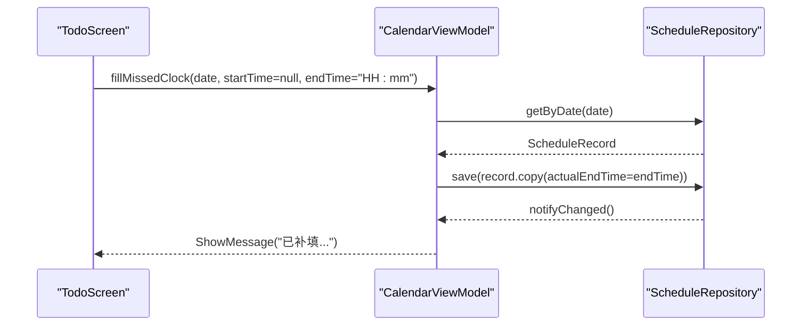

图表来源
- [CalendarViewModel.kt:418-427](file://app/src/main/java/com/schedulecalendar/app/ui/calendar/CalendarViewModel.kt#L418-L427)
- [TodoScreen.kt:170-181](file://app/src/main/java/com/schedulecalendar/app/ui/todo/TodoScreen.kt#L170-L181)

### 确认早到加班
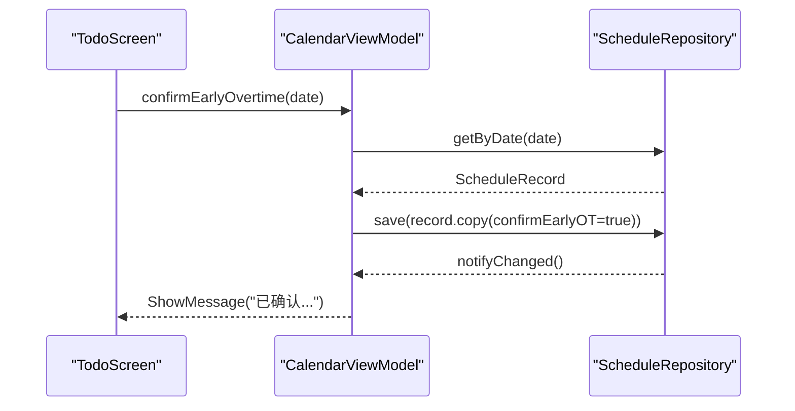

图表来源
- [CalendarViewModel.kt:429-434](file://app/src/main/java/com/schedulecalendar/app/ui/calendar/CalendarViewModel.kt#L429-L434)
- [TodoScreen.kt:184-200](file://app/src/main/java/com/schedulecalendar/app/ui/todo/TodoScreen.kt#L184-L200)

### 加载指定日期事件
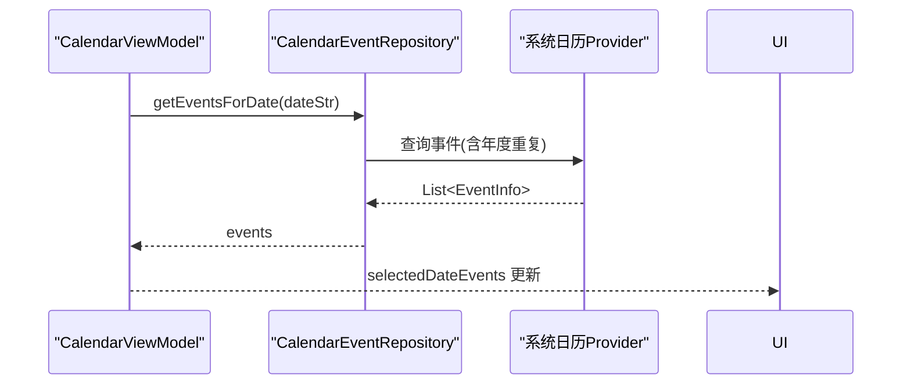

图表来源
- [CalendarViewModel.kt:392-402](file://app/src/main/java/com/schedulecalendar/app/ui/calendar/CalendarViewModel.kt#L392-L402)
- [CalendarEventRepository.kt:713-749](file://app/src/main/java/com/schedulecalendar/app/data/calendar/CalendarEventRepository.kt#L713-L749)

### 获取日程专用日历ID（新增）
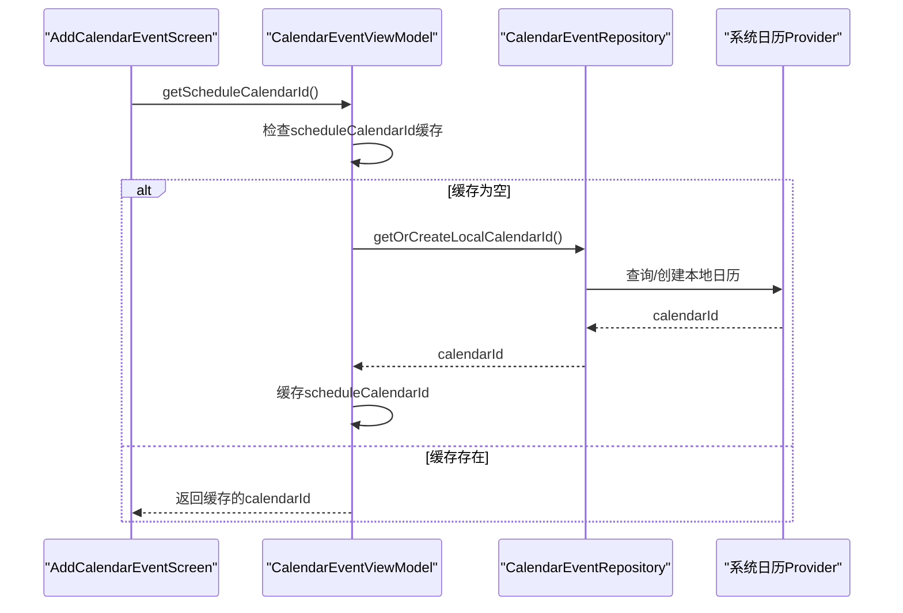

图表来源
- [CalendarEventViewModel.kt:183-194](file://app/src/main/java/com/schedulecalendar/app/ui/todo/CalendarEventViewModel.kt#L183-L194)
- [AddCalendarEventScreen.kt:71-76](file://app/src/main/java/com/schedulecalendar/app/ui/todo/AddCalendarEventScreen.kt#L71-L76)