# 设置相关ViewModel

<cite>
**本文引用的文件**   
- [SettingsViewModel.kt](file://app/src/main/java/com/schedulecalendar/app/ui/settings/SettingsViewModel.kt)
- [ReminderSettingsViewModel.kt](file://app/src/main/java/com/schedulecalendar/app/ui/settings/ReminderSettingsViewModel.kt)
- [StorageViewModel.kt](file://app/src/main/java/com/schedulecalendar/app/ui/settings/StorageViewModel.kt)
- [CalendarAccountViewModel.kt](file://app/src/main/java/com/schedulecalendar/app/ui/settings/CalendarAccountViewModel.kt)
- [AppPreferences.kt](file://app/src/main/java/com/schedulecalendar/app/data/prefs/AppPreferences.kt)
- [BackupManager.kt](file://app/src/main/java/com/schedulecalendar/app/ui/settings/BackupManager.kt)
- [CalendarEventRepository.kt](file://app/src/main/java/com/schedulecalendar/app/data/calendar/CalendarEventRepository.kt)
- [SettingsScreen.kt](file://app/src/main/java/com/schedulecalendar/app/ui/settings/SettingsScreen.kt)
- [ReminderSettingsScreen.kt](file://app/src/main/java/com/schedulecalendar/app/ui/settings/ReminderSettingsScreen.kt)
- [StorageScreen.kt](file://app/src/main/java/com/schedulecalendar/app/ui/settings/StorageScreen.kt)
- [CalendarAccountSettingsScreen.kt](file://app/src/main/java/com/schedulecalendar/app/ui/settings/CalendarAccountSettingsScreen.kt)
- [ReminderScheduler.kt](file://app/src/main/java/com/schedulecalendar/app/reminder/ReminderScheduler.kt)
- [ShiftsViewModel.kt](file://app/src/main/java/com/schedulecalendar/app/ui/shifts/ShiftsViewModel.kt)
</cite>

## 更新摘要
**变更内容**   
- **StorageScreen.kt 重大UI增强**：新增可展开的"清理废弃数据"界面，提供详细的废弃项目信息和分类展示
- **OrphanItemInfo数据类**：新增详细废弃项目信息结构，支持颜色编码和附加信息显示
- **可折叠详情面板**：实现分类列表展示，包含班次、状态、项目和时段等不同类型的废弃数据
- **颜色编码视觉指示器**：为班次和状态类型提供颜色圆点指示，提升用户识别体验
- **交互式清理界面**：提供确认弹窗和实时统计，改善存储管理用户体验

## 目录
1. [简介](#简介)
2. [项目结构](#项目结构)
3. [核心组件](#核心组件)
4. [架构总览](#架构总览)
5. [详细组件分析](#详细组件分析)
6. [依赖关系分析](#依赖关系分析)
7. [性能与可维护性](#性能与可维护性)
8. [故障排查指南](#故障排查指南)
9. [结论](#结论)
10. [附录：关键流程时序图](#附录关键流程时序图)

## 简介
本文件聚焦"设置"模块的 ViewModel 层，系统性阐述以下职责与实现：
- 应用设置、提醒设置、存储管理、日历账户管理的职责分离设计
- DataStore Preferences 的配置项定义、读写与变更监听模式
- **BackupManager v2版本的完整备份恢复机制**：支持提醒设置、自定义排序、颜色索引、快捷方式开关等全部应用配置的序列化与恢复
- 日历账户管理的复杂性（权限检查、账户创建、同步状态管理）
- **增强的存储管理界面**：通过可展开的废弃数据清理界面，提供详细的分类展示和颜色编码视觉反馈
- 通过具体代码路径展示设置数据的持久化与 UI 响应式更新

## 项目结构
设置相关代码按功能域分层组织：
- ui.settings：各设置页面的 Screen 与对应 ViewModel
- data.prefs：DataStore 配置中心 AppPreferences
- data.calendar：系统日历仓库 CalendarEventRepository
- ui.settings.BackupManager：v2版本备份/恢复与裁剪策略，支持完整应用配置迁移

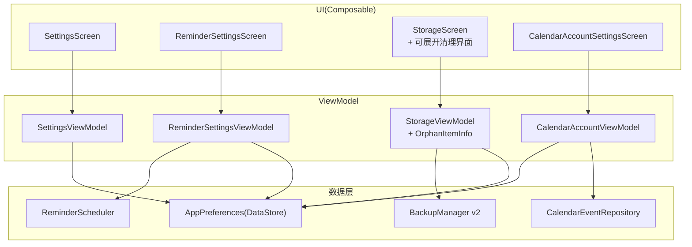

**图表来源**
- [SettingsScreen.kt](file://app/src/main/java/com/schedulecalendar/app/ui/settings/SettingsScreen.kt)
- [ReminderSettingsScreen.kt](file://app/src/main/java/com/schedulecalendar/app/ui/settings/ReminderSettingsScreen.kt)
- [StorageScreen.kt](file://app/src/main/java/com/schedulecalendar/app/ui/settings/StorageScreen.kt)
- [CalendarAccountSettingsScreen.kt](file://app/src/main/java/com/schedulecalendar/app/ui/settings/CalendarAccountSettingsScreen.kt)
- [SettingsViewModel.kt](file://app/src/main/java/com/schedulecalendar/app/ui/settings/SettingsViewModel.kt)
- [ReminderSettingsViewModel.kt](file://app/src/main/java/com/schedulecalendar/app/ui/settings/ReminderSettingsViewModel.kt)
- [StorageViewModel.kt](file://app/src/main/java/com/schedulecalendar/app/ui/settings/StorageViewModel.kt)
- [CalendarAccountViewModel.kt](file://app/src/main/java/com/schedulecalendar/app/ui/settings/CalendarAccountViewModel.kt)
- [AppPreferences.kt](file://app/src/main/java/com/schedulecalendar/app/data/prefs/AppPreferences.kt)
- [BackupManager.kt](file://app/src/main/java/com/schedulecalendar/app/ui/settings/BackupManager.kt)
- [CalendarEventRepository.kt](file://app/src/main/java/com/schedulecalendar/app/data/calendar/CalendarEventRepository.kt)
- [ReminderScheduler.kt](file://app/src/main/java/com/schedulecalendar/app/reminder/ReminderScheduler.kt)

## 核心组件
- SettingsViewModel：聚合薪资、考勤、排班规则、显示方案等设置；提供清空数据与一次性 UI 事件通道。
- ReminderSettingsViewModel：上下班提醒开关、方式（闹钟/日历）、内容选择与提前分钟数；采用新的批量处理模式，在退出页面时统一应用更改。
- **StorageViewModel**：**增强的存储管理**，新增 OrphanItemInfo 数据类和完整的废弃数据扫描、分类展示功能。
- CalendarAccountViewModel：加载系统日历账户、禁用/启用、分类映射、首次初始化策略。
- AppPreferences：集中定义 DataStore Key、Flow 读取与保存方法，支持复杂对象 JSON 序列化，**新增排序顺序、颜色索引、快捷方式开关等v2配置项**。
- **BackupManager v2**：**全面升级的备份管理器**，支持提醒设置、自定义排序、颜色索引、快捷方式开关等全部应用配置的完整备份与恢复。
- CalendarEventRepository：系统日历账户/事件 CRUD、本地账户与日历创建、同步开关控制。
- ReminderScheduler：提醒调度核心，支持闹钟和日历两种提醒方式，提供批量调度能力。

## 架构总览
设置模块采用"页面-ViewModel-数据层"清晰分层：
- UI 层仅负责展示与交互，不直接访问数据源
- ViewModel 暴露 StateFlow 给 UI 收集，并通过 Channel 发送一次性事件
- 数据层由 AppPreferences（DataStore）、BackupManager v2（完整配置备份/JSON）、CalendarEventRepository（系统日历）组成

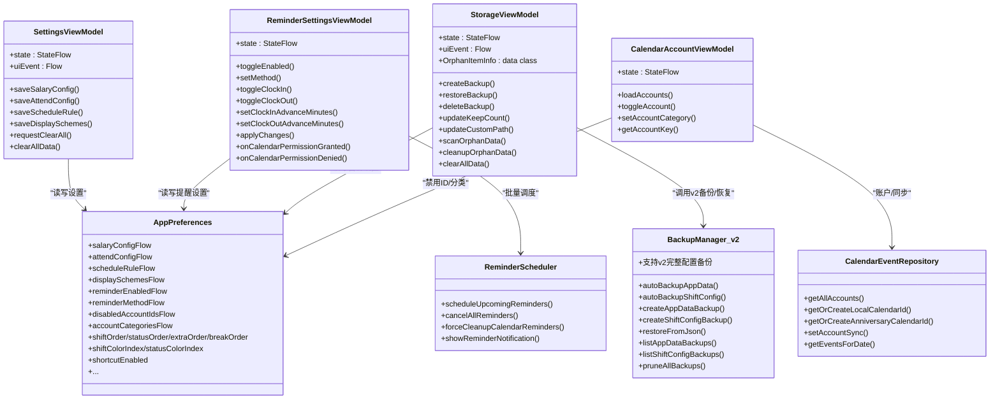

**图表来源**
- [SettingsViewModel.kt](file://app/src/main/java/com/schedulecalendar/app/ui/settings/SettingsViewModel.kt)
- [ReminderSettingsViewModel.kt](file://app/src/main/java/com/schedulecalendar/app/ui/settings/ReminderSettingsViewModel.kt)
- [StorageViewModel.kt](file://app/src/main/java/com/schedulecalendar/app/ui/settings/StorageViewModel.kt)
- [CalendarAccountViewModel.kt](file://app/src/main/java/com/schedulecalendar/app/ui/settings/CalendarAccountViewModel.kt)
- [AppPreferences.kt](file://app/src/main/java/com/schedulecalendar/app/data/prefs/AppPreferences.kt)
- [BackupManager.kt](file://app/src/main/java/com/schedulecalendar/app/ui/settings/BackupManager.kt)
- [CalendarEventRepository.kt](file://app/src/main/java/com/schedulecalendar/app/data/calendar/CalendarEventRepository.kt)
- [ReminderScheduler.kt](file://app/src/main/java/com/schedulecalendar/app/reminder/ReminderScheduler.kt)

## 详细组件分析

### 应用设置 ViewModel（SettingsViewModel）
- 职责：聚合薪资、考勤、排班规则、显示方案等设置；提供清空数据与一次性 UI 事件。
- 数据流：combine 多个 Flow 合并为统一 UIState，UI 使用 collectAsStateWithLifecycle 订阅。
- 变更持久化：保存方法委托给 AppPreferences 对应 Flow 的 saveXxx 方法。
- 一次性事件：通过 Channel 发送 ShowClearConfirm/DataCleared/ShowError，避免重复消费。

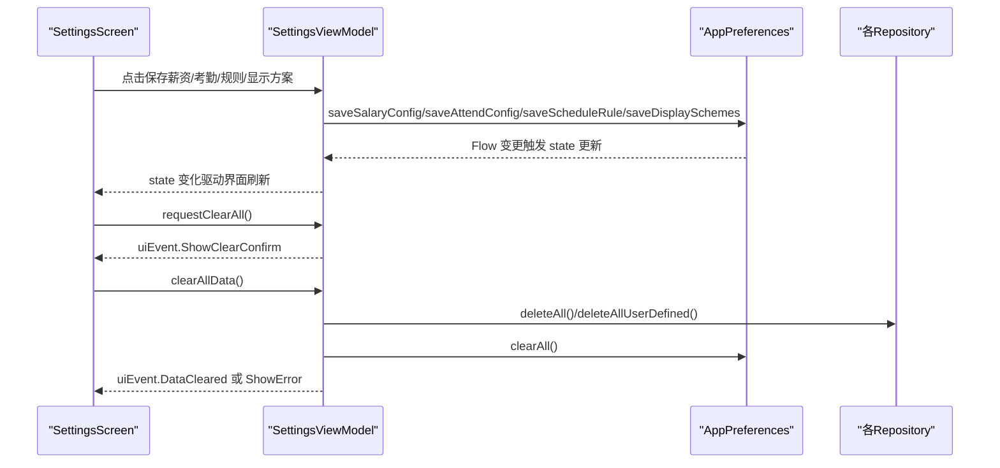

**图表来源**
- [SettingsViewModel.kt](file://app/src/main/java/com/schedulecalendar/app/ui/settings/SettingsViewModel.kt)
- [AppPreferences.kt](file://app/src/main/java/com/schedulecalendar/app/data/prefs/AppPreferences.kt)
- [SettingsScreen.kt](file://app/src/main/java/com/schedulecalendar/app/ui/settings/SettingsScreen.kt)

### 提醒设置 ViewModel（ReminderSettingsViewModel）

**更新** 实现了新的批量处理架构，通过 applyChanges() 方法进行统一调度，替代了之前的立即重调度模式。

- 职责：管理提醒开关、方式（alarm/calendar）、内容（上班/下班）、提前分钟数。
- 持久化：每次修改立即写入 AppPreferences，并更新本地 state。
- 批量调度：新增 applyChanges() 方法，在退出页面时根据当前设置执行一次统一的调度操作。
- 权限处理：切换到日历提醒前检查权限，支持权限请求回调处理。

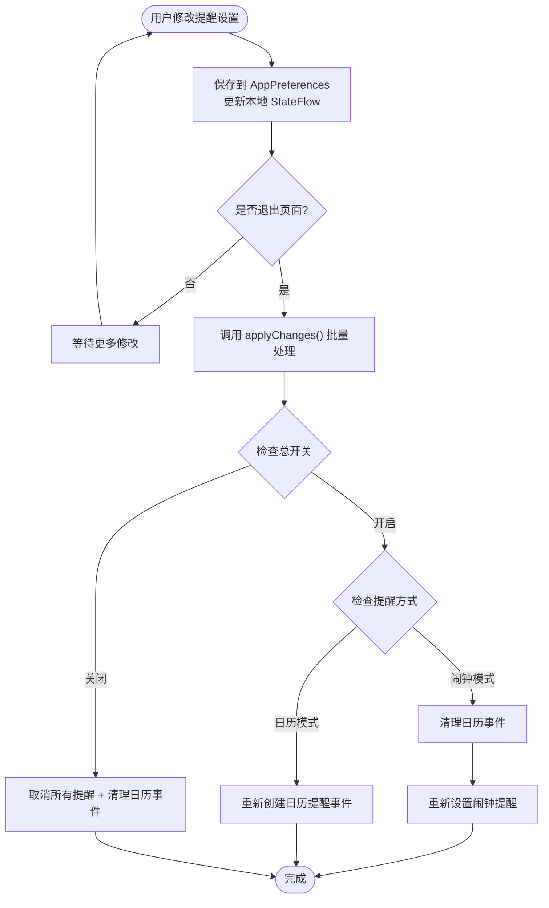

**图表来源**
- [ReminderSettingsViewModel.kt](file://app/src/main/java/com/schedulecalendar/app/ui/settings/ReminderSettingsViewModel.kt)
- [ReminderSettingsScreen.kt](file://app/src/main/java/com/schedulecalendar/app/ui/settings/ReminderSettingsScreen.kt)
- [ReminderScheduler.kt](file://app/src/main/java/com/schedulecalendar/app/reminder/ReminderScheduler.kt)

章节来源
- [ReminderSettingsViewModel.kt](file://app/src/main/java/com/schedulecalendar/app/ui/settings/ReminderSettingsViewModel.kt)
- [ReminderSettingsScreen.kt](file://app/src/main/java/com/schedulecalendar/app/ui/settings/ReminderSettingsScreen.kt)
- [ReminderScheduler.kt](file://app/src/main/java/com/schedulecalendar/app/reminder/ReminderScheduler.kt)

### 存储管理 ViewModel（StorageViewModel）

**重大更新**：增强了废弃数据管理功能，新增 OrphanItemInfo 数据类和完整的可展开清理界面支持。

- 职责：备份类型与保留份数、自定义路径、导入/导出、扫描与清理废弃数据、清空所有数据。
- **新增 OrphanItemInfo 数据类**：提供详细的废弃项目信息，包括 ID、名称、颜色和附加信息。
- **增强的废弃数据扫描**：支持四种类型的废弃数据（班次、状态、项目、不计入时段），并提供分类统计。
- **可展开详情面板**：UI 层实现可折叠的详细信息展示，包含颜色编码的视觉指示器。
- 数据流：init 中加载保留份数与默认路径，列出备份文件并统计数据库/备份大小与可用空间。
- 备份/恢复：委托 BackupManager v2 执行 JSON 序列化与文件 I/O，UI 通过 uiEvent 接收消息。

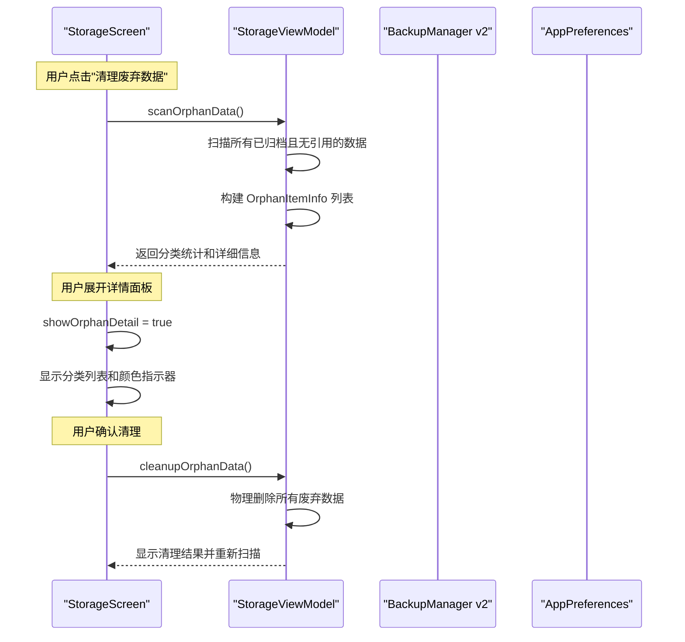

**图表来源**
- [StorageViewModel.kt](file://app/src/main/java/com/schedulecalendar/app/ui/settings/StorageViewModel.kt)
- [StorageScreen.kt](file://app/src/main/java/com/schedulecalendar/app/ui/settings/StorageScreen.kt)
- [BackupManager.kt](file://app/src/main/java/com/schedulecalendar/app/ui/settings/BackupManager.kt)
- [AppPreferences.kt](file://app/src/main/java/com/schedulecalendar/app/data/prefs/AppPreferences.kt)

### 日历账户管理 ViewModel（CalendarAccountViewModel）
- 职责：加载系统日历账户、首次初始化策略（禁用非应用账户、设置应用日历分类）、禁用/启用账户、分类映射。
- 权限与账户：先确保应用本地日程/纪念日日历存在，再获取账户列表；根据偏好设置持久化禁用 ID 与分类。
- 同步状态：通过 Repository 的 setAccountSync 控制系统日历同步开关。

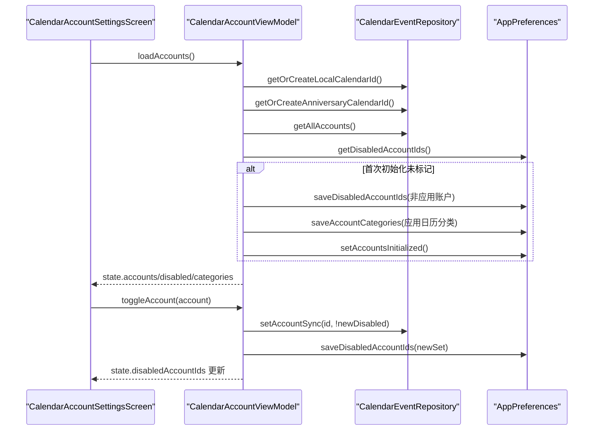

**图表来源**
- [CalendarAccountViewModel.kt](file://app/src/main/java/com/schedulecalendar/app/ui/settings/CalendarAccountViewModel.kt)
- [CalendarEventRepository.kt](file://app/src/main/java/com/schedulecalendar/app/data/calendar/CalendarEventRepository.kt)
- [AppPreferences.kt](file://app/src/main/java/com/schedulecalendar/app/data/prefs/AppPreferences.kt)
- [CalendarAccountSettingsScreen.kt](file://app/src/main/java/com/schedulecalendar/app/ui/settings/CalendarAccountSettingsScreen.kt)

### DataStore Preferences 集成模式（AppPreferences）
- 配置项定义：以 string/int 类型的 Key 常量集中管理，包括薪资、考勤、排班规则、显示方案、备份设置、提醒设置、账户禁用与分类、**排序顺序、颜色索引、快捷方式开关等v2新功能**。
- 读写操作：
  - 简单值：first() 读取当前快照，edit{} 原子写入
  - 复杂对象：Gson 序列化为 JSON 字符串，反序列化时通过 InstanceCreator 保证默认值
  - 集合/映射：List/Map 同样以 JSON 形式存储，并提供 TypeToken 解析
- 变更监听：对外暴露 Flow<T>，UI 侧 collectAsStateWithLifecycle 实现响应式更新。

**v2新增配置项**：
- 排序顺序：shiftOrder、statusOrder、extraOrder、breakOrder
- 颜色索引：shiftColorIndex、statusColorIndex  
- 快捷方式开关：shortcutEnabled

示例路径（不展示代码内容）：
- 薪资配置 Flow 与保存：[AppPreferences.kt](file://app/src/main/java/com/schedulecalendar/app/data/prefs/AppPreferences.kt)
- 显示方案 List 解析与保存：[AppPreferences.kt](file://app/src/main/java/com/schedulecalendar/app/data/prefs/AppPreferences.kt)
- 提醒设置组合 Flow：[AppPreferences.kt](file://app/src/main/java/com/schedulecalendar/app/data/prefs/AppPreferences.kt)
- 账户禁用 ID 与分类 Map：[AppPreferences.kt](file://app/src/main/java/com/schedulecalendar/app/data/prefs/AppPreferences.kt)
- **v2新增排序与颜色索引**：[AppPreferences.kt](file://app/src/main/java/com/schedulecalendar/app/data/prefs/AppPreferences.kt)

### 备份恢复功能（BackupManager v2）

**重大更新**：BackupManager 已升级为 v2 版本，提供了完整的应用配置备份与恢复能力。

- **v2数据模型**：AppDataBackup 类新增 version=2，包含所有应用设置的完整序列化支持
- **新增备份字段**：
  - 提醒设置：reminderEnabled、reminderMethod、reminderClockIn、reminderClockOut、提醒时间配置
  - 自定义排序：shiftOrder、statusOrder、extraOrder、breakOrder
  - 颜色索引：shiftColorIndex、statusColorIndex
  - 快捷方式开关：shortcutEnabled
- **ShiftExportData v5增强**：新增 extraItems 字段支持，实现完整的班次配置共享
- **智能恢复逻辑**：条件性恢复，仅覆盖非null字段，保持向后兼容性

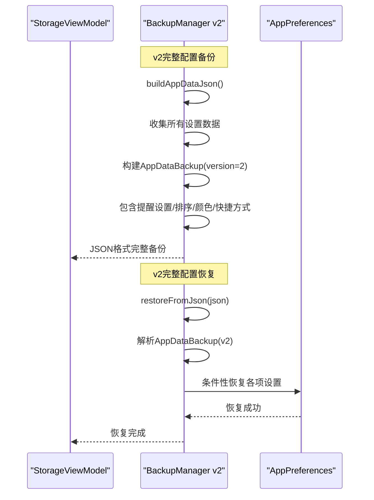

**图表来源**
- [BackupManager.kt](file://app/src/main/java/com/schedulecalendar/app/ui/settings/BackupManager.kt)
- [StorageViewModel.kt](file://app/src/main/java/com/schedulecalendar/app/ui/settings/StorageViewModel.kt)
- [AppPreferences.kt](file://app/src/main/java/com/schedulecalendar/app/data/prefs/AppPreferences.kt)

### 日历账户管理复杂性（CalendarEventRepository）
- 权限检查：创建本地账户前检查 WRITE_CALENDAR 权限，否则返回失败。
- 账户创建：通过 AccountManager 添加自定义账户类型，设置同步标志与主同步开关。
- 日历条目：创建"日程"和"纪念日"两个独立日历，设置颜色、可见性与提醒允许范围。
- 同步状态：通过 Calendars.SYNC_EVENTS 字段控制是否同步该日历。
- 事件查询优化：批量加载日历信息，避免 N+1 查询。

示例路径（不展示代码内容）：
- 获取/创建本地日程日历：[CalendarEventRepository.kt](file://app/src/main/java/com/schedulecalendar/app/data/calendar/CalendarEventRepository.kt)
- 获取/创建纪念日日历：[CalendarEventRepository.kt](file://app/src/main/java/com/schedulecalendar/app/data/calendar/CalendarEventRepository.kt)
- 禁用/启用账户同步：[CalendarEventRepository.kt](file://app/src/main/java/com/schedulecalendar/app/data/calendar/CalendarEventRepository.kt)

### 提醒调度器（ReminderScheduler）
- 双重提醒模式：支持闹钟（AlarmManager.setAlarmClock）和日历事件两种方式
- 批量调度：scheduleUpcomingReminders() 方法根据当前设置批量处理未来多天的提醒
- 智能清理：根据提醒窗口（今天前后3天）自动清理过期日历事件
- 权限处理：精确闹钟权限检查和日历权限验证

章节来源
- [ReminderSettingsViewModel.kt](file://app/src/main/java/com/schedulecalendar/app/ui/settings/ReminderSettingsViewModel.kt)
- [ReminderSettingsScreen.kt](file://app/src/main/java/com/schedulecalendar/app/ui/settings/ReminderSettingsScreen.kt)
- [ReminderScheduler.kt](file://app/src/main/java/com/schedulecalendar/app/reminder/ReminderScheduler.kt)
- [AppPreferences.kt](file://app/src/main/java/com/schedulecalendar/app/data/prefs/AppPreferences.kt)
- [BackupManager.kt](file://app/src/main/java/com/schedulecalendar/app/ui/settings/BackupManager.kt)
- [StorageViewModel.kt](file://app/src/main/java/com/schedulecalendar/app/ui/settings/StorageViewModel.kt)
- [StorageScreen.kt](file://app/src/main/java/com/schedulecalendar/app/ui/settings/StorageScreen.kt)
- [CalendarEventRepository.kt](file://app/src/main/java/com/schedulecalendar/app/data/calendar/CalendarEventRepository.kt)
- [CalendarAccountViewModel.kt](file://app/src/main/java/com/schedulecalendar/app/ui/settings/CalendarAccountViewModel.kt)

## 依赖关系分析
- 松耦合：ViewModel 仅依赖抽象接口（Repository/Preferences），便于替换与测试
- 内聚性：每个 ViewModel 专注单一领域（应用设置/提醒/存储/账户）
- 外部依赖：
  - DataStore Preferences：配置持久化
  - 系统日历 Provider：账户/事件/同步
  - SAF：跨进程文件访问
  - AlarmManager：精确闹钟服务

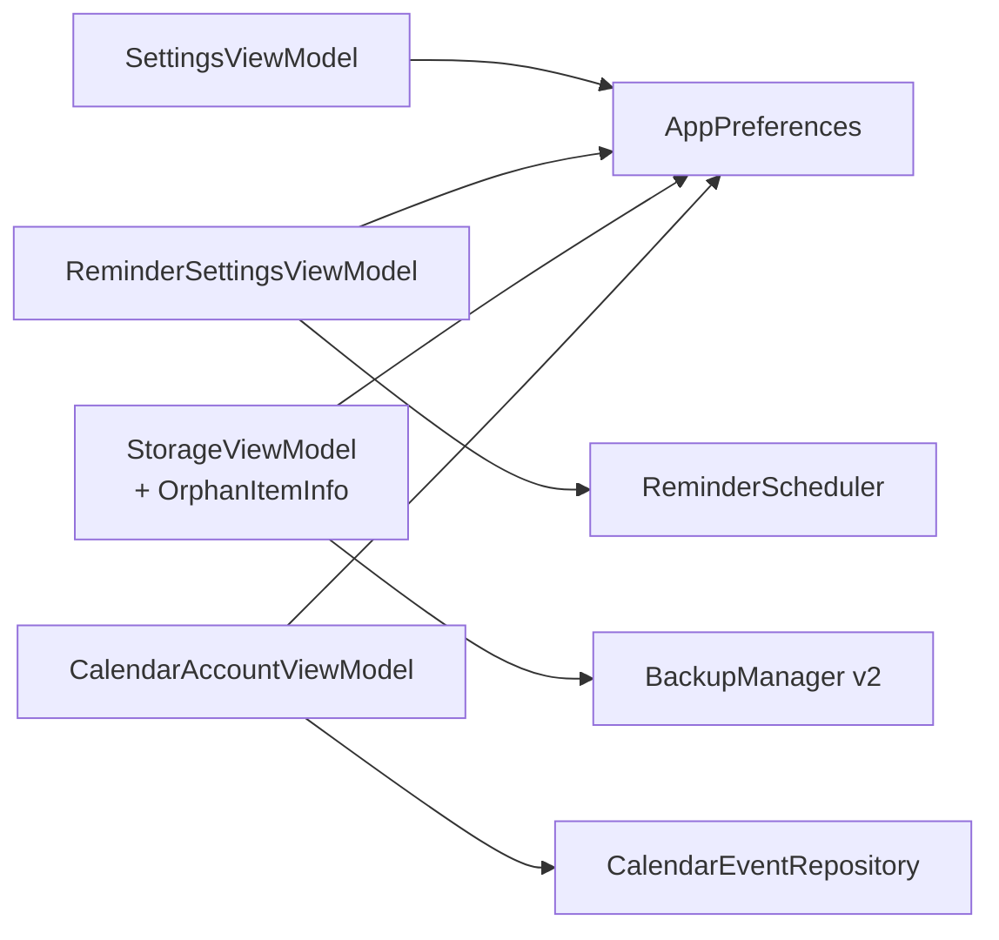

**图表来源**
- [SettingsViewModel.kt](file://app/src/main/java/com/schedulecalendar/app/ui/settings/SettingsViewModel.kt)
- [ReminderSettingsViewModel.kt](file://app/src/main/java/com/schedulecalendar/app/ui/settings/ReminderSettingsViewModel.kt)
- [StorageViewModel.kt](file://app/src/main/java/com/schedulecalendar/app/ui/settings/StorageViewModel.kt)
- [CalendarAccountViewModel.kt](file://app/src/main/java/com/schedulecalendar/app/ui/settings/CalendarAccountViewModel.kt)
- [AppPreferences.kt](file://app/src/main/java/com/schedulecalendar/app/data/prefs/AppPreferences.kt)
- [BackupManager.kt](file://app/src/main/java/com/schedulecalendar/app/ui/settings/BackupManager.kt)
- [CalendarEventRepository.kt](file://app/src/main/java/com/schedulecalendar/app/data/calendar/CalendarEventRepository.kt)
- [ReminderScheduler.kt](file://app/src/main/java/com/schedulecalendar/app/reminder/ReminderScheduler.kt)

## 性能与可维护性
- 响应式更新：UI 通过 collectAsStateWithLifecycle 收集 StateFlow，生命周期感知，避免内存泄漏
- 一次性事件：Channel 用于对话框/错误提示，避免重复触发
- **批量处理优化**：提醒设置采用新的批量处理模式，减少频繁的调度器调用，提升性能和用户体验
- 批量查询优化：日历事件加载时批量获取日历信息，减少多次 IPC
- **v2备份性能优化**：单次JSON序列化包含所有配置，避免多次I/O操作
- 备份裁剪：仅在必要时删除旧备份，避免频繁 IO
- **可展开界面优化**：废弃数据详情采用按需展开机制，减少初始渲染开销
- **颜色编码优化**：OrphanItemInfo 中的颜色信息延迟解析，提升界面响应速度
- 可扩展性：新增设置项只需在 AppPreferences 增加 Key/Flow/saveXxx，并在对应 ViewModel 暴露方法
- **现代化生命周期管理**：使用 `androidx.lifecycle.compose.LocalLifecycleOwner` 替代旧的导入，遵循现代 Compose 最佳实践，提供更好的生命周期感知和内存管理

## 故障排查指南
- 备份失败/无法写入外部目录
  - 确认已通过 SAF 持久化 URI 权限
  - 检查 content:// URI 是否为 tree 根目录
  - 参考路径：[BackupManager.kt](file://app/src/main/java/com/schedulecalendar/app/ui/settings/BackupManager.kt)
- 恢复失败/格式不识别
  - 确认 JSON 包含正确字段（应用数据 vs 班次配置）
  - **检查v2版本兼容性**：确认备份文件version字段为2
  - 参考路径：[BackupManager.kt](file://app/src/main/java/com/schedulecalendar/app/ui/settings/BackupManager.kt)
- 日历账户不可见/无法创建
  - 检查 WRITE_CALENDAR 权限是否授予
  - 查看账户是否已注册及同步标志
  - 参考路径：[CalendarEventRepository.kt](file://app/src/main/java/com/schedulecalendar/app/data/calendar/CalendarEventRepository.kt)
- **提醒未触发或调度异常**
  - 确认提醒设置是否正确保存
  - 检查 applyChanges() 是否在退出页面时被调用
  - 验证闹钟权限和日历权限状态
  - 参考路径：[ReminderSettingsViewModel.kt](file://app/src/main/java/com/schedulecalendar/app/ui/settings/ReminderSettingsViewModel.kt)
  - 参考路径：[ReminderScheduler.kt](file://app/src/main/java/com/schedulecalendar/app/reminder/ReminderScheduler.kt)
- **v2备份恢复问题**
  - 确认AppDataBackup.version字段为2
  - 检查新增字段（排序、颜色索引、快捷方式）是否正确序列化
  - 验证ShiftExportData.v5的extraItems字段支持
  - 参考路径：[BackupManager.kt](file://app/src/main/java/com/schedulecalendar/app/ui/settings/BackupManager.kt)
  - 参考路径：[ShiftsViewModel.kt](file://app/src/main/java/com/schedulecalendar/app/ui/shifts/ShiftsViewModel.kt)
- **生命周期管理问题**
  - 确认使用正确的 LocalLifecycleOwner 导入：`androidx.lifecycle.compose.LocalLifecycleOwner`
  - 检查 LaunchedEffect 中的生命周期感知是否正确工作
  - 参考路径：[SettingsScreen.kt](file://app/src/main/java/com/schedulecalendar/app/ui/settings/SettingsScreen.kt)
- **废弃数据清理界面问题**
  - 确认 OrphanItemInfo 数据类正确传递颜色和附加信息
  - 检查可展开状态的 showOrphanDetail 变量管理
  - 验证颜色编码的 Color 转换逻辑
  - 参考路径：[StorageScreen.kt](file://app/src/main/java/com/schedulecalendar/app/ui/settings/StorageScreen.kt)
  - 参考路径：[StorageViewModel.kt](file://app/src/main/java/com/schedulecalendar/app/ui/settings/StorageViewModel.kt)

章节来源
- [BackupManager.kt](file://app/src/main/java/com/schedulecalendar/app/ui/settings/BackupManager.kt)
- [CalendarEventRepository.kt](file://app/src/main/java/com/schedulecalendar/app/data/calendar/CalendarEventRepository.kt)
- [ReminderSettingsViewModel.kt](file://app/src/main/java/com/schedulecalendar/app/ui/settings/ReminderSettingsViewModel.kt)
- [ReminderScheduler.kt](file://app/src/main/java/com/schedulecalendar/app/reminder/ReminderScheduler.kt)
- [SettingsScreen.kt](file://app/src/main/java/com/schedulecalendar/app/ui/settings/SettingsScreen.kt)
- [ShiftsViewModel.kt](file://app/src/main/java/com/schedulecalendar/app/ui/shifts/ShiftsViewModel.kt)
- [StorageScreen.kt](file://app/src/main/java/com/schedulecalendar/app/ui/settings/StorageScreen.kt)
- [StorageViewModel.kt](file://app/src/main/java/com/schedulecalendar/app/ui/settings/StorageViewModel.kt)

## 结论
设置相关 ViewModel 通过清晰的职责划分与统一的 DataStore 集成模式，实现了高内聚、低耦合的可维护架构。**BackupManager v2的重大升级显著提升了应用的完整配置迁移能力**，通过支持提醒设置、自定义排序、颜色索引、快捷方式开关等全部应用配置的序列化与恢复，为用户提供了更加完善的备份恢复体验。**同时，ShiftExportData v5版本的extraItems支持确保了班次配置的完整共享能力**。最新的批量处理架构改进显著提升了提醒设置的性能和用户体验，通过减少频繁的调度器调用和优化资源管理，为用户提供了更加流畅的设置体验。**StorageScreen.kt 的可展开清理界面大幅改善了存储管理体验**，通过 OrphanItemInfo 数据类和颜色编码视觉指示器，为用户提供直观的废弃数据分类展示和便捷的清理操作。

## 附录：关键流程时序图

### BackupManager v2完整配置备份流程（端到端）
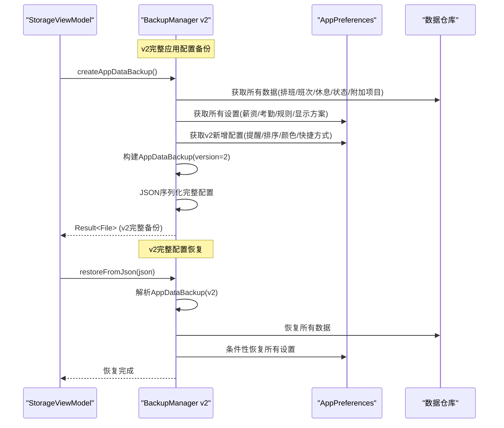

**图表来源**
- [BackupManager.kt](file://app/src/main/java/com/schedulecalendar/app/ui/settings/BackupManager.kt)
- [StorageViewModel.kt](file://app/src/main/java/com/schedulecalendar/app/ui/settings/StorageViewModel.kt)
- [AppPreferences.kt](file://app/src/main/java/com/schedulecalendar/app/data/prefs/AppPreferences.kt)

### ShiftExportData v5额外项目支持流程
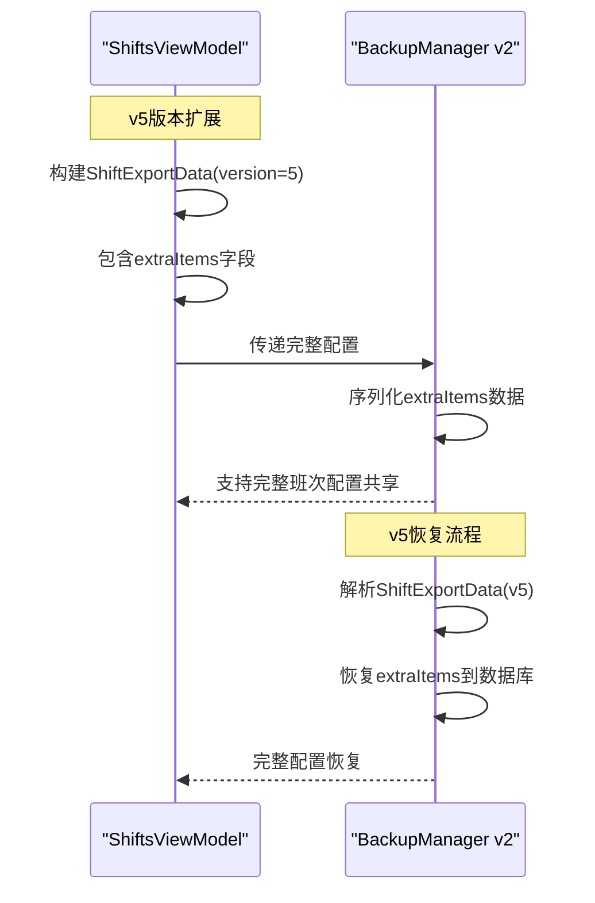

**图表来源**
- [ShiftsViewModel.kt](file://app/src/main/java/com/schedulecalendar/app/ui/shifts/ShiftsViewModel.kt)
- [BackupManager.kt](file://app/src/main/java/com/schedulecalendar/app/ui/settings/BackupManager.kt)

### 提醒设置批量处理流程（端到端）
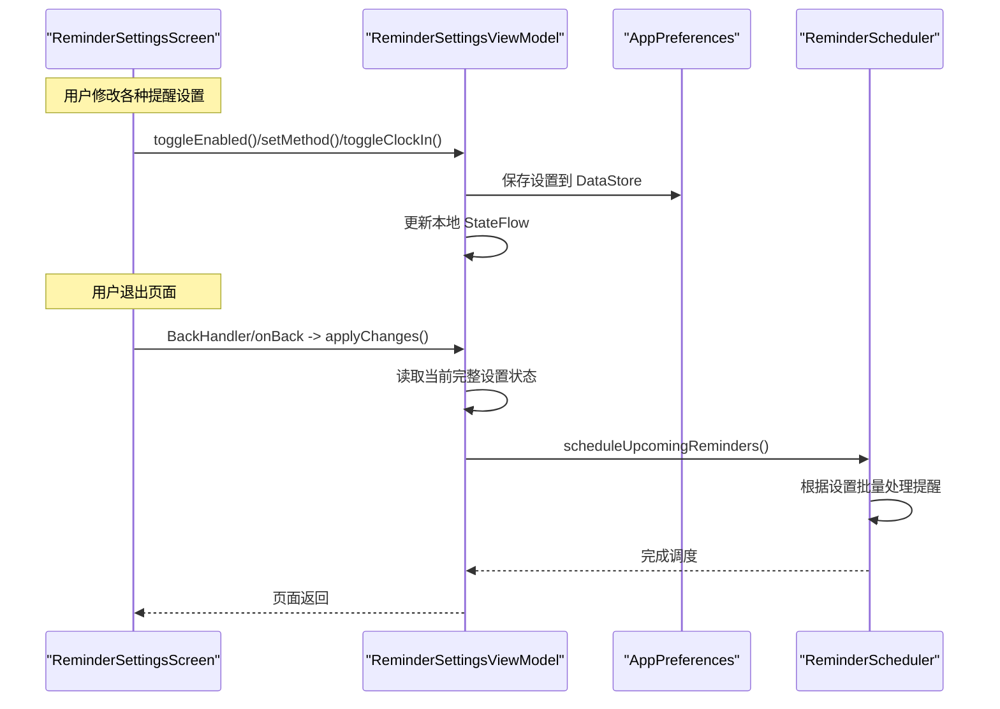

**图表来源**
- [ReminderSettingsScreen.kt](file://app/src/main/java/com/schedulecalendar/app/ui/settings/ReminderSettingsScreen.kt)
- [ReminderSettingsViewModel.kt](file://app/src/main/java/com/schedulecalendar/app/ui/settings/ReminderSettingsViewModel.kt)
- [ReminderScheduler.kt](file://app/src/main/java/com/schedulecalendar/app/reminder/ReminderScheduler.kt)

### 备份创建与恢复（端到端）
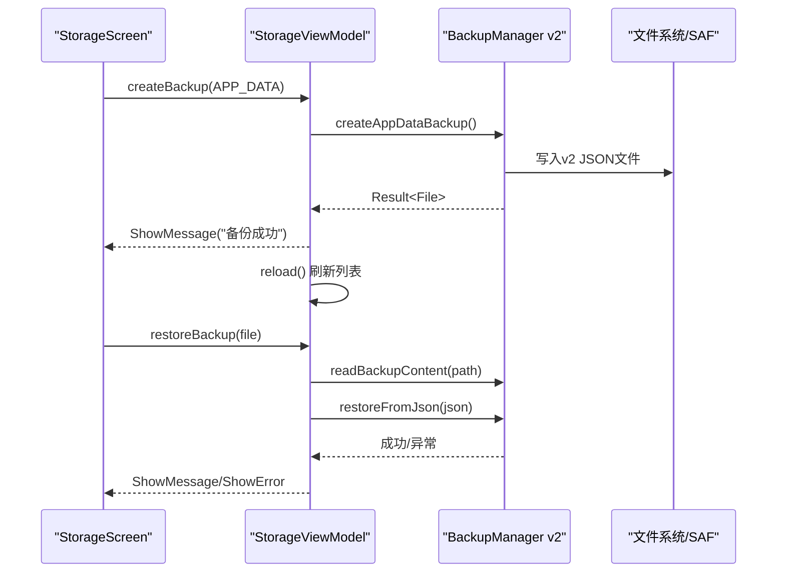

**图表来源**
- [StorageViewModel.kt](file://app/src/main/java/com/schedulecalendar/app/ui/settings/StorageViewModel.kt)
- [BackupManager.kt](file://app/src/main/java/com/schedulecalendar/app/ui/settings/BackupManager.kt)
- [StorageScreen.kt](file://app/src/main/java/com/schedulecalendar/app/ui/settings/StorageScreen.kt)

### 日历账户禁用/启用（端到端）
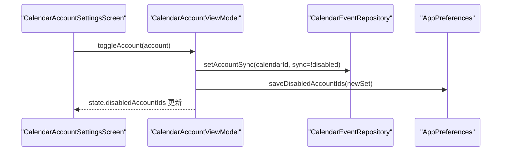

**图表来源**
- [CalendarAccountViewModel.kt](file://app/src/main/java/com/schedulecalendar/app/ui/settings/CalendarAccountViewModel.kt)
- [CalendarEventRepository.kt](file://app/src/main/java/com/schedulecalendar/app/data/calendar/CalendarEventRepository.kt)
- [AppPreferences.kt](file://app/src/main/java/com/schedulecalendar/app/data/prefs/AppPreferences.kt)
- [CalendarAccountSettingsScreen.kt](file://app/src/main/java/com/schedulecalendar/app/ui/settings/CalendarAccountSettingsScreen.kt)

### 生命周期管理现代化（SettingsScreen）
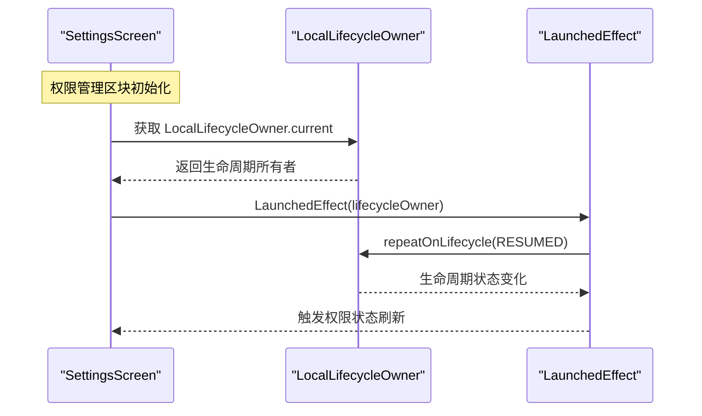

**图表来源**
- [SettingsScreen.kt](file://app/src/main/java/com/schedulecalendar/app/ui/settings/SettingsScreen.kt)

### 废弃数据清理界面流程（新增）
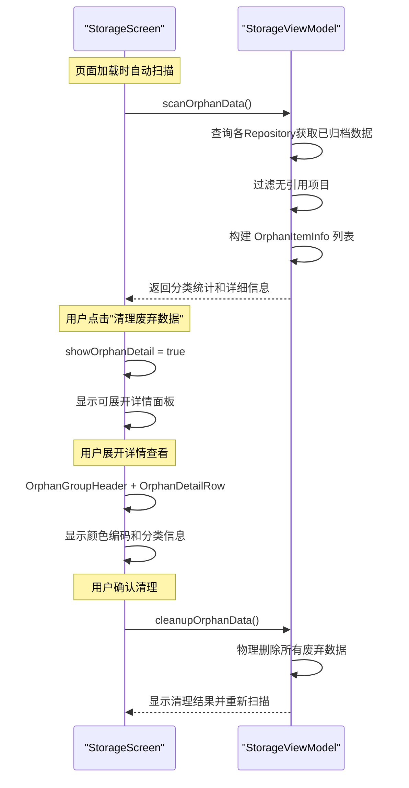

**图表来源**
- [StorageScreen.kt](file://app/src/main/java/com/schedulecalendar/app/ui/settings/StorageScreen.kt)
- [StorageViewModel.kt](file://app/src/main/java/com/schedulecalendar/app/ui/settings/StorageViewModel.kt)